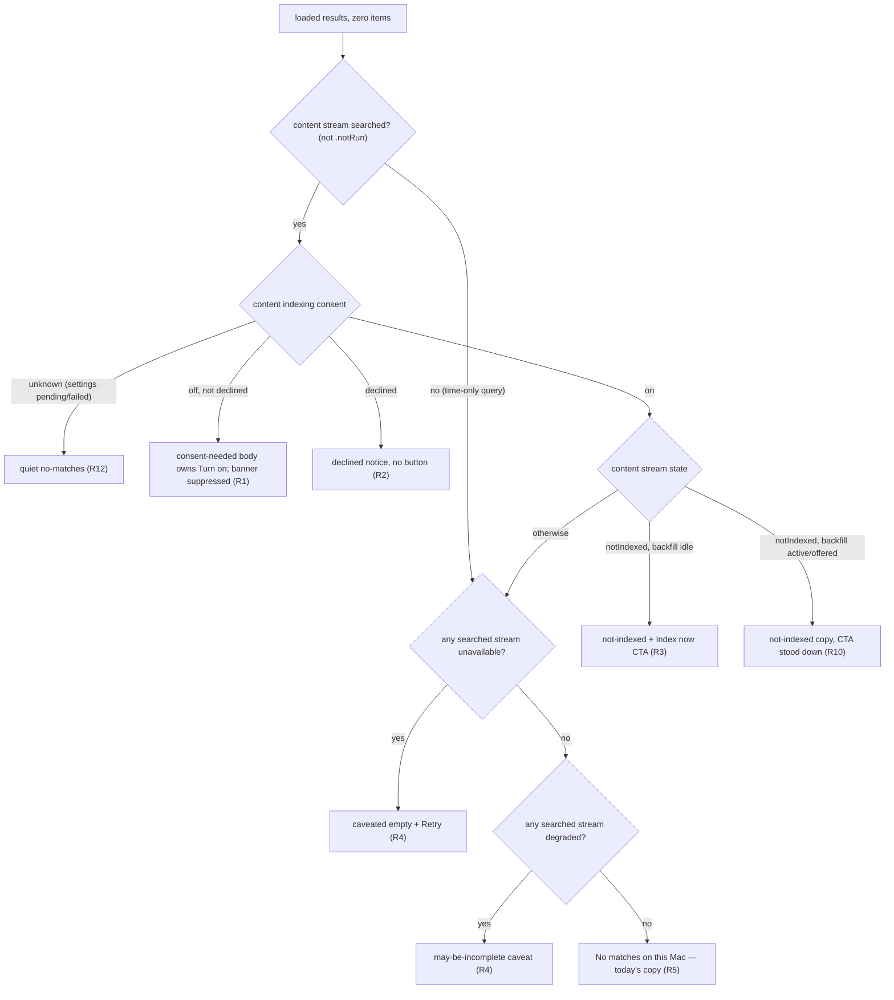

# Honest Search Empty States - Plan

## Goal Capsule

- **Objective:** Fix [SCR-261](https://linear.app/zk-email/issue/SCR-261/search-shows-definitive-no-matches-on-this-mac-when-the-content-index): the macOS recall palette's search empty state must name the real cause (consent never given, index not built, stream unavailable/degraded) instead of the definitive "No matches on this Mac", with working recovery actions.
- **Authority:** The Linear ticket, adjusted by two user decisions made during planning: empty states carry actionable CTAs (not copy-only), and the locked corpus is **not** an empty-state cause (no Unlock affordance on empty — see KTD2).
- **Execution profile:** Swift-only, confined to `macos/ScreenCap` (palette model + view + view-model CTA plumbing). No Python/daemon changes.
- **Stop conditions:** Stop and surface if the fix appears to require daemon `/v0` response changes, changes to `SearchViewModel.Phase` / `SearchResults` public shape (breaks the second consumer, `DayTimelineView`), or new lock/unlock mechanics.
- **Tail ownership:** Unit verification via `ScreenCapTests`; manual QA reproduces the ticket's observed case.

---

## Product Contract

### Summary

When a free-text search renders zero items, derive an explicit empty-state cause from the per-stream coverage the view model already assembles, render state-specific copy with working CTAs (turn on indexing / index now / retry), suppress duplicate asks, and make the "indexed on-device" footer conditional. Locked corpus display-gating stays as-is and never affects empty states.

### Problem Frame

QA of app v0.12.0 found that on a Mac where the content index was never built (daemon returns `index_state: "not_indexed"`) and the recall corpus is locked, a pure free-text query renders the definitive empty state "No matches on this Mac", with a footer claiming "indexed on-device". The user cannot distinguish "nothing matched" from "nothing was ever indexed". The daemon-side truth was verified during QA: `POST /v0/content.search` returned `index_state: "not_indexed"` while the app showed the definitive no-matches message.

The root cause is a lossy aggregation seam: `SearchViewModel` already decodes per-stream `index_state` into `StreamState` values (`.notIndexed`, `.unavailable`, `.degraded`, …) and carries them in `SearchResults.coverage`, but `RecallPalette.state(...)` computes `body = items.isEmpty ? .empty : .results` and never consults coverage — every degraded, unavailable, or unindexed stream with zero rendered items collapses into the same definitive empty state.

Two prior institutional learnings frame this as a known failure class: overloading one signal across separately-actionable causes (`docs/solutions/design-patterns/fallback-path-recovery-and-exit-code-signaling-2026-06-15.md`), and mapping "data absent" onto a definitive terminal state (`docs/solutions/integration-issues/review-data-nullable-timing-swift-consumer-2026-06-01.md`, the SCR-102 bug — same shape as this one).

### Requirements

**Empty-state causes** (apply when a search completes with zero rendered items):

- R1. Consent never given (content indexing off, not declined): the empty body says on-screen text isn't being indexed and owns a single Turn-on CTA; the consent banner is suppressed for this combination so exactly one ask renders.
- R2. Consent previously declined: the empty body uses honest, button-free copy stating screen text isn't being indexed (matches may exist on screen) — never the definitive no-matches copy, and no nagging CTA.
- R3. Indexing enabled but the content index isn't built (content stream `.notIndexed`): the empty body says recordings aren't indexed for text search yet and offers an index-now CTA.
- R4. Any searched stream `.unavailable`: a caveated empty state ("couldn't search everything") with a Retry action. A `.degraded` stream (fallback search ran) gets softer "results may be incomplete" copy, not "unavailable".
- R5. All searched streams `.ok`/`.empty` with the index ready: today's "No matches on this Mac" copy is preserved unchanged.
- R6. The locked corpus is not an empty-state cause and empty states carry no Unlock affordance — the daemon searches the encrypted index while locked, so unlocking can never reveal matches; the presence gate keeps covering only actual results.
- R7. Streams that were not run (`.notRun`) never contribute a cause — a pure time query with indexing off must not show a consent nag.

**CTA lifecycle:**

- R8. An explicit index-now click starts a backfill even for a user who previously declined the unsolicited offer, and clears the persisted backfill-declined flag.
- R9. Backfill completion (including completion with partial failures) re-runs the active query so a stale empty cause resolves into live results.
- R10. The index-now CTA stands down while a backfill is starting/running or while the backfill section owns the ask — never two buttons for the same action visible at once.

**Honest chrome and robustness:**

- R11. The footer's "indexed on-device" claim renders only when content indexing is enabled AND the content index is built (content stream not `.notIndexed`); the header's "searching this Mac only" locality claim is unchanged (true in every state).
- R12. Unknown settings (settings load pending or failed) never produce a consent or not-indexed nag — the derivation falls back to the quiet no-matches copy while unknown.
- R13. New empty-state CTAs carry accessibility labels and hints, following the existing prominent-CTA precedent.

### Acceptance Examples

- AE1. **The QA case.** Indexing enabled, index never built, corpus locked; pure free-text query; daemon returns zero hits with `index_state: "not_indexed"` → body shows the not-indexed message with an index-now CTA; no "No matches on this Mac"; no Unlock button; footer does not claim "indexed on-device" coverage it lacks.
- AE2. **Consent never given.** Free-text query, indexing off, zero hits → body owns the Turn-on ask; the consent banner does not also render; clicking Turn on enables indexing and offers backfill.
- AE3. **Pure time query, indexing off.** "yesterday afternoon" with zero timeline rows → plain no-matches copy; no consent or index nag (content/transcript were not run).
- AE4. **Backfill resolves the empty state.** From AE1, user accepts backfill; when it reports done, the palette re-runs the query and matching results render without further interaction. The query term must appear in recorded on-screen content — a term matching only a recording title still lands in the empty state until SCR-256.
- AE5. **Stream error is not "no matches".** Content searched fine with zero hits, transcript store errors (e.g. stale-daemon 500) → caveated empty state with Retry, not the definitive no-matches copy.

### Scope Boundaries

**Non-goals:**

- No daemon/Python changes — every needed signal already reaches the app.
- No change to lock/unlock mechanics, `PresenceGate`, or the gate over non-empty results.
- No change to SCR-176 behavior (pure free-text queries continue not to fan out to timeline).

**Deferred to Follow-Up Work:**

- Surfacing renamed-recording title matches ([SCR-256](https://linear.app/zk-email/issue/SCR-256/surface-renamed-recording-title-matches-in-the-macos-search-ui)) — title-only hits are filtered upstream and still land in the empty state; the new derivation stays coverage-based (not hit-count special-cased) so that fix composes later.
- A transcript index-state signal: `transcript.search` carries no `index_state`, so a machine with transcription off is indistinguishable from "searched, no matches". Being honest about the transcript stream requires a daemon change — candidate Linear follow-up.
- Rendering `SearchResults.truncated` (lost when the Search pane was retired) — do not model the new states assuming a truncation UI exists.
- `PresenceGate` observability refactor (`@Published`/grace-expiry re-render) — pre-existing limitation, unchanged by this plan.

---

## Planning Contract

### Key Technical Decisions

- KTD1. **Derive the cause in `RecallPalette.state(...)`, not in `SearchViewModel`.** The palette model function already receives the full `SearchResults` (coverage included) and is a pure, pin-tested seam; `SearchViewModel.Phase` and `SearchResults` shapes stay untouched, so the second consumer (`DayTimelineView`) is unaffected by construction.
- KTD2. **Locked is excluded from the derivation** (user decision during planning, reversing the ticket's assumed behavior). The daemon searches the encrypted index while locked; lock gates display of existing results only. An Unlock affordance on an empty state would imply hidden matches — the same dishonesty class this fix removes.
- KTD3. **Cause precedence:** consent tier first (consent-needed with CTA, or declined notice without), then not-indexed, then unavailable, then degraded, then no-matches. `.notRun` streams are excluded everywhere; phase-level causes (daemon down, subscription required) are already promoted upstream of results assembly and stay there. Rationale for consent-over-not-indexed: an index-now CTA without consent is meaningless. Note a stale index may exist and still be searched while indexing is off — disabling does not delete `content_index.db` and the daemon searches any existing index file regardless of the flag — which is why R1/R2 copy says screen text isn't being *indexed*, not that nothing was searched.
- KTD4. **CTA ownership and suppression are encoded inside `state(...)`** using inputs it already receives (`consentNeeded`, `consentDeclined`, `backfillState`), so every collision combination (banner vs. body, body vs. backfill section) is pure, pin-testable derivation rather than scattered view conditions.
- KTD5. **Explicit index-now routes to `acceptBackfill()` directly**, not `offerBackfill(alreadyDeclined:)` — the offer path no-ops to `.hidden` for prior decliners, which would make the CTA a dead button for exactly the user it targets. The persisted `content_index_backfill_declined` flag is cleared on explicit accept.
- KTD6. **`contentIndexEnabled` becomes tri-state (`Bool?`, nil = unknown)**, mirroring the existing `corpusEncrypted` pattern, so a slow or failed settings load fails quiet (plain no-matches) instead of nagging a long-consented user. Settings-load failure must not imply consent was declined. The palette coalesces nil to false at the existing `search(_:contentIndexEnabled:)` call site (no signature change); inside `state(...)` the live tri-state flag is authoritative for the consent tier and for consent-banner suppression — `results.consentNeeded` (frozen at search time) is consulted only as the free-text-was-searched signal (equivalently, content stream not `.notRun`), never as the consent truth. `RecallPaletteContent` gains the threaded flag from `RecallPaletteView` (a new parameter — `state(...)` receives no such input today).
- KTD7. **Single primary cause plus an optional one-line secondary note** when a different searched stream is unavailable (e.g. transcript store error while the primary cause is consent/not-indexed) — winner-takes-all would hide a broken stream behind a consent ask.
- KTD8. **Copy and rendering follow the `subscriptionRequired` precedent**: the shared `message(icon:title:note:...)` helper with a prominent tinted CTA; its hardcoded accessibility hint gets parameterized. Copy tone stays honest and blame-free. No localization files exist — inline literals are the convention.
- KTD9. **Backfill-done re-run is exposed as an injectable completion hook on `SearchViewModel`** (a closure set alongside the existing injected persist-declined closure, invoked when the backfill state reaches done) so `SearchViewModelBackfillTests` can assert exactly one invocation; `RecallPaletteView` wires a single non-debounced re-run of the current non-empty query into it, mirroring the `enableConsent` re-run pattern. Partial-failure done still fires the hook (a partial index beats a stale lie; the done copy already discloses failures).

### High-Level Technical Design

Data flow today: daemon `index_state` → `ContentIndexState` (`macos/ScreenCap/Models/SearchResult.swift`) → per-stream `StreamState` → `CoverageReport` inside `SearchResults` (`macos/ScreenCap/Views/Search/SearchViewModel.swift`) → `RecallPalette.state(...)` (`macos/ScreenCap/Views/Palette/RecallPaletteModel.swift`) → `RecallPaletteContent.bodyContent` (`macos/ScreenCap/Views/Palette/RecallPaletteView.swift`). The last hop currently reads only `items.isEmpty`; this plan replaces that hop with the derivation below (directional sketch — exact enum shape is the implementer's):

"Searched stream" means any stream not `.notRun` (R7). Locked never enters the derivation (KTD2). A secondary unavailable-stream note may attach to the consent/not-indexed outcomes (KTD7).

### Sources & Research

- Swallow point and seam: `macos/ScreenCap/Views/Palette/RecallPaletteModel.swift` (`state(...)`, `showsConsentBanner`); rendering switch and copy: `macos/ScreenCap/Views/Palette/RecallPaletteView.swift` (empty body, footer, `message()` helper, `enableConsent()`, backfill section).
- Stream states and mapping: `macos/ScreenCap/Views/Search/SearchViewModel.swift` (`StreamState`, `mapContentState`, `CoverageReport`, `consentNeeded`, `BackfillUIState`, `offerBackfill`/`acceptBackfill`); wire enum: `macos/ScreenCap/Models/SearchResult.swift` (`ContentIndexState`, pessimistic default to store-unavailable).
- Lock architecture (why locked is not a cause): `macos/ScreenCap/Controllers/PresenceGate.swift`, `macos/ScreenCap/Views/PresenceGatedContent.swift`, `SECURITY.md` (daemon holds the corpus key; the app-side gate is display-only).
- Settings signals: `macos/ScreenCap/Models/PrivacyStatus.swift` (`content_index_enabled`, `corpus_encrypted`).
- Institutional learnings applied: `docs/solutions/design-patterns/fallback-path-recovery-and-exit-code-signaling-2026-06-15.md` (distinct causes + reachable recovery affordances), `docs/solutions/integration-issues/review-data-nullable-timing-swift-consumer-2026-06-01.md` (absent-data ≠ terminal state; paired pin tests), `docs/solutions/integration-issues/keychain-auth-prompt-eager-decrypt-at-launch-2026-07-08.md` (unlock is click-initiated only — moot for empty states under KTD2 but binding on any future lock work), `docs/solutions/integration-issues/stale-daemon-after-app-update-http-500-2026-07-02.md` (search verbs 500 wholesale after stale-daemon app updates — the unavailable cause is reachable in the wild).
- A related honest-coverage precedent already ships in chat recall: `ChatCoverageState` in `macos/ScreenCap/Models/ChatRecall.swift` treats not-indexed/degraded/store-unavailable uniformly as "coverage is limited".

---

## Implementation Units

### U1. Empty-state cause derivation in RecallPalette.state

- **Goal:** Replace the lossy `items.isEmpty → .empty` mapping with an explicit cause-carrying empty variant derived from coverage, consent state, and backfill state.
- **Requirements:** R1–R7, R10, R12 (derivation side), KTD1–KTD4, KTD6, KTD7.
- **Dependencies:** none.
- **Files:** `macos/ScreenCap/Views/Palette/RecallPaletteModel.swift`; `macos/ScreenCap/Views/Palette/RecallPaletteView.swift` (the sole `state(...)` call site passes a stopgap value for the new parameter so U1 compiles independently, ahead of U3's real settings wiring); `macos/ScreenCapTests/RecallPaletteStateTests.swift`; `macos/ScreenCapTests/ViewHostingHarness.swift` (new `SearchFixtures`).
- **Approach:** Extend `RecallPalette.State.Body` with cause-carrying empty variants (or one `.empty(cause:)` payload — implementer's call; the enum is `Equatable` and pin-tested). Inputs: the existing `SearchResults` (coverage, `consentNeeded`), `consentDeclined`, `backfillState`, and a now-optional content-indexing-enabled flag. Encode precedence per KTD3 and CTA stand-down per KTD4/R10 with the full `BackfillUIState` mapping: the body CTA stands down for offering/starting/indexing/paused/cancelled (the backfill section's Accept/Resume owns the ask) and returns for hidden and start-failed (whose section has no action button); done triggers the KTD9 re-run. Attach the optional secondary unavailable-note (KTD7) to the variant payload.
- **Patterns to follow:** The existing pure `state(...)` derivation and its pin tests; wire-realistic fixtures (a free-text query has `activity: .notRun` per SCR-176 — the existing `noMatchesResults()` fixture uses `.empty` and must not be copied blindly for new cases).
- **Test scenarios:**
  - Covers AE1. Enabled + content `.notIndexed` + backfill hidden → not-indexed variant with CTA.
  - Covers AE2. Consent off, not declined → consent-needed variant; consent banner flag suppressed for this combination.
  - Covers AE3. Time-only query (content/transcript `.notRun`), zero activity rows → plain no-matches variant (no nag).
  - Covers AE5. Content `.empty` + transcript `.unavailable` → caveated-unavailable variant.
  - Declined consent (+ content `.notIndexed`, the realistic wire shape) → declined-notice variant, no CTA.
  - Not-indexed + backfill `.starting`/`.indexing`/offered → CTA stood down (R10).
  - Not-indexed + backfill `.paused`/`.cancelled` → CTA stood down (the section's Resume owns the ask); `.startFailed` → CTA returns (that section state has no action button, and a stood-down CTA would leave a dead end).
  - Not-indexed + transcript `.unavailable` → not-indexed primary + secondary note (KTD7).
  - Content `.degraded` with zero hits → may-be-incomplete variant, distinct from unavailable copy.
  - Enabled flag `nil` (settings unresolved) with content `.notIndexed` → quiet no-matches (R12).
  - Existing pinned `empty`/`results` cases updated deliberately; non-empty items still yield `.results` regardless of coverage.
- **Verification:** All `RecallPaletteStateTests` derivation cases pass; every reachable combination has exactly one winning cause.

### U2. Render the new empty variants

- **Goal:** The palette body renders each cause with honest copy and an accessible CTA, and locked/presence behavior is visibly unchanged.
- **Requirements:** R1–R6, R13, KTD2, KTD8.
- **Dependencies:** U1.
- **Files:** `macos/ScreenCap/Views/Palette/RecallPaletteView.swift`; `macos/ScreenCapTests/RecallPaletteStateTests.swift` (render smoke).
- **Approach:** Extend the `bodyContent` switch per variant using the `message(icon:title:note:...)` helper. Parameterize its hardcoded accessibility hint so each CTA carries its own, on the retry path as well as the action path — today only the action-button path has a hint, so R4's Retry would otherwise silently miss R13 by inheriting the unparameterized daemon-down pattern. Give `message()` a distinct `secondaryNote` parameter rendered as a visually de-emphasized second line, used consistently by every variant carrying KTD7's secondary note (no per-variant concatenation). Copy follows the subscription-state tone: honest, reassuring, no blame; the declined-notice variant is button-free. No Unlock affordance on any empty variant (KTD2).
- **Patterns to follow:** The `subscriptionRequired` empty state (prominent tinted CTA precedent); `PresenceGatedContent` copy tone for lock-adjacent wording if any caveat mentions history.
- **Test scenarios:**
  - Render-smoke per new variant via the existing hosted `rendersVisibleContent` pattern (extends the "no variant renders blank" guard).
  - The genuine no-matches variant renders today's exact copy (R5 pin).
  - CTA buttons expose accessibility labels/hints (assert non-empty where the harness allows).
- **Verification:** Each new variant renders visible, distinct content; no empty variant renders an Unlock control.

### U3. CTA wiring and lifecycle

- **Goal:** Every CTA does what it says: Turn on enables + offers backfill, Index now starts backfill even for prior decliners, Retry re-runs, and backfill completion resolves the empty state.
- **Requirements:** R8, R9, R10 (view side), R12 (settings-load side), KTD5, KTD6, KTD9.
- **Dependencies:** U1, U2.
- **Files:** `macos/ScreenCap/Views/Palette/RecallPaletteView.swift`; `macos/ScreenCap/Views/Search/SearchViewModel.swift`; `macos/ScreenCapTests/SearchViewModelBackfillTests.swift`; `macos/ScreenCapTests/RecallPaletteStateTests.swift`.
- **Approach:** Wire Turn on to the existing `enableConsent()` path; wire Index now to `acceptBackfill()` directly, clearing the persisted backfill-declined flag on explicit accept (KTD5 — a small view-model addition mirroring the existing persist-declined closure); wire Retry to the existing retry affordance. Add the backfill-done completion hook on the view model (KTD9) and wire the palette's single non-debounced re-run of the current query into it. Make the view's content-indexing-enabled state optional (nil until settings resolve; load failure leaves it nil rather than false, and never sets declined) feeding U1's tri-state input.
- **Execution note:** Start with a failing view-model test for the decliner-clicks-Index-now path — it pins the KTD5 routing decision that the obvious `offerBackfill` call would get wrong.
- **Patterns to follow:** `enableConsent()` optimistic-flip-revert-and-re-run; `FakeBackfillService` with `AsyncStream` continuation and injected persistence closures in the backfill tests.
- **Test scenarios:**
  - Covers AE4. Backfill reaches done with a non-empty query pending → exactly one re-run fires; done-with-failures also re-runs.
  - Explicit accept from a prior decliner starts the backfill and clears the persisted declined flag (would fail against `offerBackfill` routing).
  - Settings load failure leaves the enabled flag unknown and declined unset → palette derivation stays quiet (integration with U1's R12 case).
  - Backfill done with an empty/cleared query → no re-run fires.
- **Verification:** The AE4 journey passes end-to-end in view-model tests; no double search dispatch on completion.

### U4. Honest footer

- **Goal:** The footer stops claiming "indexed on-device" when content indexing is off or unknown.
- **Requirements:** R11.
- **Dependencies:** U3 (tri-state flag).
- **Files:** `macos/ScreenCap/Views/Palette/RecallPaletteView.swift`.
- **Approach:** Condition or reword the footer line on the tri-state enabled flag AND the content stream's not-indexed state (claim indexed coverage only when indexing is enabled and the index is built, per R11). Header "searching this Mac only" and the field accessibility label are locality claims — true in every state — and stay unchanged (avoids VoiceOver churn for no honesty gain).
- **Test scenarios:** Test expectation: none — a small conditional on view chrome with no derivation logic; covered by the manual QA pass (AE1 includes the footer assertion).
- **Verification:** With indexing off/unknown, or on with the index not yet built (content stream `.notIndexed`), the rendered footer makes no indexed-coverage claim; with indexing on and the index built, today's footer is preserved.

---

## Verification Contract

| Gate | Command / check | Notes |
|---|---|---|
| Project generation | `cd macos && xcodegen generate` | `.xcodeproj` is gitignored; re-run after adding files |
| Compile (worktree-safe) | `xcodebuild build-for-testing -project ScreenCap.xcodeproj -scheme ScreenCap` | Compile-only is safe in this `~/Documents` worktree |
| Unit tests | `xcodebuild test -only-testing:ScreenCapTests -project ScreenCap.xcodeproj -scheme ScreenCap` | Do NOT launch tests from this worktree — test-host launch TCC-bricks the session; run from the main checkout or a `/private/tmp` source copy, and kill stray orphaned test hosts before rerunning. A daemon-reconnect test is known-flaky: re-run before blaming the diff |
| Python lanes | none | Swift-only change; `pytest -m privacy` CI lane untouched |
| Manual QA | Reproduce AE1 on a Mac with no index + locked corpus; walk AE2–AE5 | AE1 is the ticket's verified repro. Use query terms that appear in recorded on-screen content, not just recording titles — title-only hits stay hidden until SCR-256, so a title-term query would fail AE4 through no fault of the implementation |

Behavioral gates: every AE passes; `DayTimelineView` compiles without modification (KTD1's no-shared-shape-change check).

## Definition of Done

- R1–R13 are implemented and each AE demonstrably passes (unit-tested where scenarios above cover it, manual QA for AE1's full journey).
- All new/updated `RecallPaletteStateTests`, `SearchViewModelBackfillTests` pass; the pre-existing render-smoke guard covers every new variant.
- No changes to daemon code, `SearchViewModel.Phase`, or `SearchResults`' shape consumed by `DayTimelineView`; no Unlock affordance on empty states.
- Fixtures added for new causes use wire-realistic coverage shapes (`.notRun` activity for free-text queries).
- Abandoned-attempt code from any explored alternative is removed from the diff.
- Follow-up candidates (transcript index-state daemon signal; SCR-256 interplay) are filed to Linear if the implementer confirms they're wanted, not folded into this diff.

## Deferred / Open Questions

### From 2026-07-12 review

- **Backfill state dies with the palette; R9/R10 break on reopen** — Planning Contract KTD9 / R9, R10 / U3 (P2, adversarial, confidence 75)

  The palette is conditionally inserted, so its view model — including the backfill state and the progress-draining task — is destroyed on dismiss, and a fresh palette starts hidden with no seeding from the existing backfill status snapshot. Concrete scenario: the user accepts a large-library backfill, closes the palette, reopens — the CTA stand-down cannot hold because the fresh model does not know a run is active, a paused run silently loses its Resume affordance, and the backfill-done re-run never fires. In the early window before the index file is first written, the empty state renders the Index-now CTA while indexing is already running — the same dishonesty class this plan removes. Options: seed from the backfill service's status snapshot on palette open, or explicitly scope R9/R10 to a single palette presentation and record the reopen-during-run limitation.
