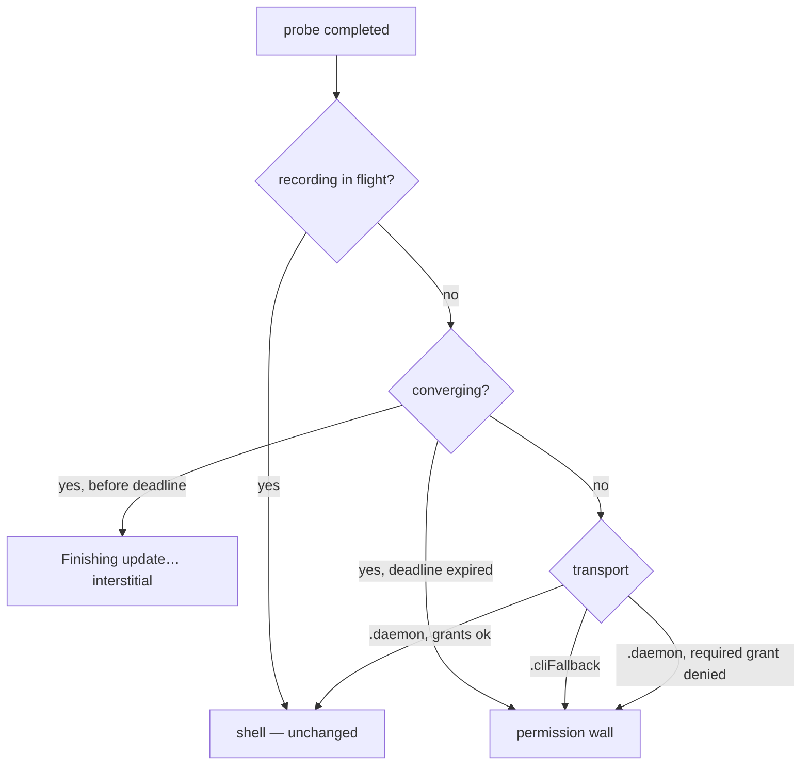

# Permission Wall Gated on Helper Convergence - Plan

## Goal Capsule

- **Objective:** First launch after an app update no longer drops the user into the full-screen permission wall while the embedded helper daemon is being swapped. The app shows a lightweight "Finishing update…" interstitial until the helper converges, and falls through to the permission wall only when the helper is reachable and a required grant is genuinely denied — or after a bounded deadline when it never converges.
- **Authority:** This plan's Requirements and Key Technical Decisions govern; repo conventions (`CLAUDE.md`, the pure-policy test style in `macos/ScreenCapTests/`) override implementation details the plan leaves open.
- **Execution profile:** Swift app only (`macos/`). No Python daemon changes. Policy-first: extend the pure decision layer and its tests before touching views.
- **Stop conditions:** Stop and surface if (a) the takeover surface turns out to have callers beyond `MainWindow` that the research missed, (b) preserving the dead-registration repair path (auto-`install()`) conflicts with the interstitial in a way the deadline cannot resolve, or (c) the fix requires changing daemon-side behavior.
- **Tail ownership:** Implementer owns updating the pinned policy tests (`FirstRunSetupPresentationPolicyTests`) deliberately — the plan names which pins change and why.

---

## Product Contract

### Summary

Gate the permission-recovery takeover on helper convergence. Plumb the app's own stale-daemon restart decision into observable state, sequence the launch probe after that decision, drive convergence with a bounded re-probe loop behind a "Finishing update…" interstitial, and only present the permission wall on genuine denial or deadline expiry.

### Problem Frame

On first launch of an updated app over a still-running old daemon (the normal update scenario, observed on 0.11.0→0.12.0), the app opens straight into the full-screen "Let Screencap see your screen" wall: helper spinner, Screen Recording and Accessibility rows reading as not granted. All grants are in fact intact — the rows only read as missing because grant state cannot be verified until the swapped-in helper is up. After the daemon boot-out/re-register converges (~30–60s) the wall dismisses itself.

The mechanical chain: `AppDelegate` fire-and-forgets `DaemonInstallController.restartStaleDaemonIfNeeded()` (kickstart of any daemon older than the embedded helper binary) concurrently with the launch `RecorderController.probeDaemon()`. The probe lands mid-swap, sets `transport = .cliFallback` with all-indeterminate grants, and `FirstRunSetupPresentationPolicy.shouldPresentOnLaunch` treats `.cliFallback` as "present the wall" — it cannot distinguish "daemon genuinely broken" from "daemon mid-swap". Worse, today's self-dismissal is not passive convergence: the spurious wall auto-fires `DaemonInstallController.install()`, whose success posts the notification that re-probes and flips transport. Any fix that suppresses the wall must replace that convergence driver.

The user impact: every update greets the user with a screen implying their grants were lost, inviting unnecessary TCC fiddling — and a user who clicks Continue on the spurious wall permanently suppresses the launch gate (`setupDismissed` persists on indeterminate grants).

### Requirements

**Update-launch behavior**
- R1. A launch that triggers a stale-daemon restart shows a "Finishing update…" interstitial instead of the permission wall while the helper converges.
- R2. The interstitial self-resolves: within a few seconds of the swapped-in daemon becoming reachable, the app advances to the normal shell with no user action.
- R3. The permission wall is presented only when the helper is reachable and a required grant is genuinely denied, or when the convergence deadline (wall-clock, anchored at the restart trigger) expires without the helper coming up.

**Preserved behaviors**
- R4. A genuinely-broken helper still reaches the wall and its repair path (the auto-fired helper install): a dead registration — where no restart is triggered — shows the wall immediately, exactly as today; a triggered-but-failed convergence reaches it at the deadline.
- R5. The fresh-install wizard, healthy relaunch, genuine-revocation launch (reachable daemon, denied grant → wall with no added delay), and launch-while-recording behaviors are unchanged.

**Gate integrity**
- R6. Dismissing the wall reached via the update-convergence path (converging or deadline-expired) does not persist the `setupDismissed` suppression flag; dismissing the ordinary repair wall persists exactly as today.
- R7. Interstitial copy is honest about what is happening ("finishing an update", not a permission claim), lives in a policy/copy enum, and is pinned by string-assert tests, following the existing honesty-gate convention.

### Scope Boundaries

- **Non-goals:** Speeding up the boot-out/re-register convergence itself (~30–60s, SCR-121 territory); any Python daemon change; redesigning onboarding or wall copy beyond the new interstitial.
- **Deferred to Follow-Up Work:**
  - Menu-bar Start during the swap window errors with permission-flavored copy while the window says "Finishing update…" — reusing the `isDefeatingStaleness` copy pattern there is a follow-up.
  - Launch-while-recording leaves the stale daemon unswapped for the whole session (restart defers and nothing re-checks after the recording stops); this plan only ensures the interstitial never latches in that flow.

### Acceptance Examples

- AE1. **Covers R1–R3.** Given an updated app launching over a running old daemon (all grants intact), when the stale-restart kickstart fires, then the user sees "Finishing update…" (never the permission checklist), and lands in the Library as soon as the new daemon answers — no TCC prompts, no wall.
- AE2. **Covers R4.** Given a dead registration (helper label enabled, bundle gone — no restart is triggered), when the app launches, then the wall appears immediately and auto-fires the helper install, exactly as today.
- AE3. **Covers R3, R5.** Given a reachable, current daemon reporting Screen Recording denied, when the app launches, then the wall appears immediately (no interstitial, no delay).
- AE4. **Covers R6.** Given the wall shown at deadline expiry with all-indeterminate rows, when the user clicks Continue, then the launch gate is not permanently suppressed — a later launch with a genuine denial still presents the wall.

---

## Planning Contract

### Key Technical Decisions

- **KTD-1: Gate on an explicit convergence signal, never bare unreachability.** `restartStaleDaemonIfNeeded` already returns whether it triggered a restart; today nobody consumes it. Surface it as observable app-wide state ("helper update converging", set when a restart is triggered — wiring in KTD-2 — cleared on verified convergence or deadline). Persist the trigger timestamp (UserDefaults): the swap window outlives the process that created it, so a quit-and-relaunch mid-swap re-initializes converging from the persisted anchor when still inside the deadline — otherwise the relaunch finds a dead daemon, triggers no restart, and presents the exact spurious wall being fixed. Keying the interstitial on bare `.cliFallback` would give dead-registration and CLI-fallback users a 90-second "Finishing update…" lie before their repair wall — the exact honesty failure this plan fixes.
- **KTD-2: Sequence the launch probe after the restart decision.** The launch `.task` in `macos/ScreenCap/ScreenCapApp.swift` currently races the kickstart in `macos/ScreenCap/AppDelegate.swift`. If the probe wins it can adopt the doomed old daemon (transport `.daemon`) an instant before the kickstart kills it, leaving a dead transport with no re-probe and no interstitial. Await the restart decision before the first probe. Concretely: the stale-check moves out of AppDelegate's fire-and-forget into that launch `.task`, via a `RecorderController` method that awaits `restartStaleDaemonIfNeeded()`, sets converging + deadline from its result, starts the KTD-3 loop, then runs the first `probeDaemon()` — one owner, no double kickstart. Setting the flag after the call returns is equivalent to "before the kickstart": presentation stays gated on `daemonProbeCompleted`, which is false until that first sequenced probe.
- **KTD-3: The interstitial owns convergence, and success is freshness-verified.** Today the spurious wall drives convergence by auto-firing `install()`. With the wall suppressed, a bounded re-probe loop (re-run `probeDaemon()` every ~3s while converging) is the replacement driver — without it, every update launch rides the full deadline and lands on the wall anyway, strictly worse than today. Success is not bare reachability: the booted-out daemon can keep answering the socket for up to ~30s (launchd `ExitTimeOut=30`, per the SCR-135 notes in `DaemonInstallController`), and adopting it would dismiss the interstitial onto a transport about to die. The loop ends only when a probed daemon's `daemon.info.started_at` postdates the trigger anchor (the same comparison `restartStaleDaemonIfNeeded` already makes) — or at the deadline.
- **KTD-4: Tri-state decision in the pure policy layer.** Extend `FirstRunSetupPresentationPolicy` (`macos/ScreenCap/Views/MainWindow.swift`) from a Bool to a three-way decision — shell / interstitial / wall — with the converging flag and deadline expiry as inputs. Wall requires reachable-and-denied, non-converging `.cliFallback`, or converging-and-deadline-expired. This is the house style: pure static decision funcs, matrix-tested without a render tree.
- **KTD-5: Deadline of 90s, anchored at the restart trigger.** Must exceed both the 30s install convergence budget (`convergenceTimeoutSeconds` / launchd `ExitTimeOut=30`) and the observed 30–60s convergence range — which comes from a single observed update, so 90s buys headroom against slower machines (a deadline at the observed upper bound would ride the full interstitial and still land on the spurious wall). The cost is a slower fall-through to genuine repair when the kickstart truly fails; the deadline is a one-line constant, revisited once the QA matrix's convergence-timing measurement (Verification Contract) gives real data. Anchoring at the trigger (not first display) means a window opened late against a long-broken helper doesn't wait a fresh 90s.
- **KTD-6: Deadline fallback goes to the existing wall, plus a one-line acknowledgment.** The wall remains the repair surface (auto-`install()` is the only self-heal for dead registrations). When reached via deadline expiry it carries one acknowledgment line (in the copy enum, string-asserted) explaining the update didn't finish cleanly — without it the user watches "Finishing update…" for the full deadline and is then dropped onto a permission checklist with no narrative bridge. Redesigning the wall's indeterminate rows stays out of scope; the R6 provenance rule removes the lasting harm (gate suppression).
- **KTD-7: A schema-mismatch probe during convergence needs no dedicated policy input.** A mid-swap old daemon answering with a stale schema already surfaces as `transport = .cliFallback` (plus the separate `schemaMismatchDetected` flag on `RecorderController`), so the converging branch covers it with no new policy input; the existing mismatch surfacing resumes after convergence or deadline.
- **KTD-8: `setupDismissed` persists only when the wall is the real repair surface.** `PermissionSetupTakeover.close()` currently persists dismissal whenever required grants aren't all granted — including indeterminate, which is how a Continue on the spurious update wall permanently suppresses the launch gate. Key the decision on the wall's provenance, not grant state: a wall reached via the converging/deadline-expired path never persists the flag; the ordinary non-converging wall persists as today. (A denied-only rule was considered and rejected: in `.cliFallback` grants are always all-indeterminate, so it would make the dead-registration repair wall permanently unsuppressable — a regression for exactly the users that wall exists to help.)

### High-Level Technical Design

Launch sequencing (KTD-1/KTD-2/KTD-3) — the restart decision happens before the first probe, and the re-probe loop replaces the wall as convergence driver:

```mermaid
sequenceDiagram
    participant App as ScreenCapApp launch task
    participant RC as RecorderController
    participant DIC as DaemonInstallController
    participant D as daemon

    App->>RC: run launch stale-check
    RC->>DIC: restartStaleDaemonIfNeeded()
    DIC->>D: daemon.info (started_at vs bundle mtime)
    alt stale and not recording
        DIC->>D: launchctl kickstart -k
        DIC-->>RC: restart triggered
        RC->>RC: converging = true (deadline anchored at trigger; anchor persisted)
    else fresh / recording / unreachable
        DIC-->>RC: no restart (converging stays false, unless a persisted anchor is still inside its deadline)
    end
    RC->>D: probeDaemon() (first probe, after the decision)
    loop every ~3s while converging and before deadline
        RC->>D: probeDaemon() + freshness check (started_at postdates anchor)
    end
    Note over RC: converging = false on verified-fresh daemon or deadline
```

Presentation decision (KTD-4) — the pure policy's tri-state, per launch state:



The interstitial and the wall stay mutually exclusive with the wizard: the fresh-install wizard path (`OnboardingStepPolicy.takeover`) owns the window first, as today.

### Assumptions

- The `restartStaleDaemonIfNeeded` retry call sites (`macos/ScreenCap/Views/LibraryView.swift`, `macos/ScreenCap/Views/DayTimelineView.swift`) set the same converging state when they trigger a restart, but the interstitial takeover is scoped to launch-time evaluation: presentation re-evaluates on converging changes (U2), so the policy must explicitly keep a mid-session retry from replacing the window content.
- `shouldPresentOnLaunch` has no production callers beyond `MainWindow`, but two pinned test surfaces: `macos/ScreenCapTests/FirstRunSetupPresentationPolicyTests.swift` and the truth-table pins in `macos/ScreenCapTests/PermissionControllerTests.swift` (via its `present(...)` helper). Both migrate in U2.

---

## Implementation Units

### U1. Observable convergence state and launch sequencing

- **Goal:** "A helper swap is converging" becomes observable app-wide state, and the launch probe can never adopt the doomed old daemon.
- **Requirements:** R1, R3 (deadline anchor), R5 (recording-in-flight unchanged)
- **Dependencies:** none
- **Files:** `macos/ScreenCap/Controllers/DaemonInstallController.swift`, `macos/ScreenCap/Controllers/RecorderController.swift`, `macos/ScreenCap/AppDelegate.swift`, `macos/ScreenCap/ScreenCapApp.swift`, `macos/ScreenCapTests/DaemonInstallControllerTests.swift`
- **Approach:** Move the launch stale-check out of `AppDelegate.applicationDidFinishLaunching`'s fire-and-forget into the `ScreenCapApp` launch `.task`: a `RecorderController` method awaits `DaemonInstallController.restartStaleDaemonIfNeeded()`, consumes its returned Bool to set a `@Published private(set)` converging flag with a trigger-anchored deadline (`RecorderController` is the app-wide observable the window already watches, matching the single-writer pattern of `daemonGrants`), persists the trigger timestamp, then runs the first `probeDaemon()` — one owner, no double kickstart. On launch, a persisted trigger still inside its deadline re-initializes converging with the original anchor. Recording-in-flight → restart defers → flag never set. Extend the existing `restartStaleDaemonIfNeeded` test matrix; do not build a parallel one.
- **Execution note:** Extend `DaemonInstallControllerTests`' injected-clock/stubbed-probe style; write the decision-matrix tests alongside the state change.
- **Test scenarios:**
  - Stale daemon, not recording → restart triggered, converging set, deadline = trigger time + 90s, trigger timestamp persisted.
  - Relaunch inside the swap window (persisted trigger, now < deadline) → converging initialized true with the original anchor; relaunch after the deadline → converging stays false.
  - Fresh daemon → no restart, converging stays false.
  - Recording in flight → restart deferred, converging stays false.
  - Unreachable probe (dead registration) → no restart, converging stays false.
  - Launch ordering: first `probeDaemon()` does not run until the restart decision resolves (both restart-triggered and no-restart branches).
- **Verification:** Unit tests green; converging observable from the window layer.

### U2. Tri-state presentation policy

- **Goal:** The pure policy distinguishes shell / interstitial / wall, so mid-swap can never present the permission checklist.
- **Requirements:** R1, R3, R4, R5
- **Dependencies:** U1 (input semantics)
- **Files:** `macos/ScreenCap/Views/MainWindow.swift` (policy + `updatePermissionSetupPresentation`), `macos/ScreenCapTests/FirstRunSetupPresentationPolicyTests.swift`, `macos/ScreenCapTests/PermissionControllerTests.swift` (its truth-table pins map `true` → wall and `false` → shell unchanged — they all model the non-converging state; the shared `present(...)` helper gains the new inputs defaulted to non-converging)
- **Approach:** Extend `FirstRunSetupPresentationPolicy.shouldPresentOnLaunch` into a three-way decision with converging + deadline-expired inputs per the KTD-4 flowchart; a schema-mismatch probe needs no dedicated input — it already lands as `.cliFallback` and the converging branch covers it (KTD-7). MainWindow re-evaluates presentation on converging changes (`.onChange(of: recorder.converging)`) — the only trigger for the deadline's interstitial→wall transition, since nothing else observable changes at expiry — and the interstitial takeover applies to launch evaluation only (a mid-session retry-site restart must not replace the window content). Mirror the auto-close: verified convergence with grants intact dismisses the interstitial the same way `shouldAutoCloseOnUpdate` dismisses the wall. `migrationNeeded` keeps precedence only when not converging (the migration banner resumes after convergence).
- **Test scenarios:**
  - Covers AE1: converging + `.cliFallback` + before deadline → interstitial (this deliberately reworks the pin in `testMigratedCliFallbackPresents`: non-converging `.cliFallback` still presents the wall; converging does not).
  - Converging + deadline expired → wall.
  - Not converging + `.cliFallback` → wall (dead-registration path unchanged, AE2).
  - `.daemon` + required denied → wall regardless of converging (AE3 — a reachable fresh daemon's denial is genuine).
  - `.daemon` + grants ok → shell, interstitial dismissed.
  - Schema-mismatch probe during convergence → lands as `.cliFallback` → interstitial, no dedicated policy input; the existing `schemaMismatchDetected` surfacing resumes after convergence or deadline.
  - Converging cleared at deadline with nothing else changing → presentation re-evaluates (the `onChange` of converging) and the wall presents.
  - `setupDismissed` persisted → wall still suppressed, interstitial still shown (it is status, not a nag).
  - Migration needed + converging → interstitial first; migration banner after convergence.
- **Verification:** Full policy matrix green, including the reworked pins.

### U3. Convergence re-probe loop

- **Goal:** Convergence self-drives while the wall is suppressed — the interstitial ends within seconds of the daemon binding.
- **Requirements:** R2, R3
- **Dependencies:** U1
- **Files:** `macos/ScreenCap/Controllers/RecorderController.swift`, `macos/ScreenCapTests/DaemonInstallControllerTests.swift` or a sibling pure test for cadence/termination decisions
- **Approach:** While converging, re-run `probeDaemon()` on a ~3s cadence (precedent: `pollDaemon`'s probe cadence) until a probe confirms a fresh daemon — reachable AND `daemon.info.started_at` postdating the trigger anchor (KTD-3) — or the deadline; clear converging on either exit. Keep the loop's termination decision pure and injectable (stubbed clock/sleep, house style) so tests don't wait wall-clock time. Respect the existing single-writer rule: the loop calls the same `probeDaemon()`; no second grant writer.
- **Test scenarios:**
  - Fresh daemon (`started_at` postdates the anchor) answers on the 3rd probe → converging cleared, no further probes.
  - Old daemon still answering the first post-kickstart probes (`started_at` predates the anchor) → converging stays set, loop continues.
  - Deadline reached with daemon still unreachable → converging cleared, loop stops (policy then presents the wall).
  - Loop never runs when converging was never set.
- **Verification:** Unit tests green; no timer left running after either exit.

### U4. "Finishing update…" interstitial view and window wiring

- **Goal:** The user sees an honest, self-dismissing "Finishing update…" card instead of the permission checklist.
- **Requirements:** R1, R2, R7
- **Dependencies:** U2, U3
- **Files:** new `macos/ScreenCap/Views/Privacy/UpdateConvergenceView.swift` (name per repo taste), `macos/ScreenCap/Views/MainWindow.swift`, `macos/ScreenCap/Views/Onboarding/OnboardingStepPolicy.swift` or the policy file the copy lands in, `macos/ScreenCapTests/OnboardingStepPolicyTests.swift` (or the policy test owning the copy)
- **Approach:** Mirror `DaemonMigrationView`'s lightweight centered card (520pt, `scPaper`, `radiusPanel`, serif headline + sans body) with `HelperInstallCard`'s spinner idiom, and reserve the `windowControlsSlot` spacer the takeover and wizard both use so the traffic lights stay visible and usable during the wait. Render as the interstitial branch of `MainWindow`'s takeover `Group`. Add the interstitial state to the `maybePresentSearchDisclosure` guard so the disclosure sheet cannot pop over it. Copy lives in a copy enum, string-asserted per the honesty-gate convention: the "Finishing update…" headline + one line of body (no permission claims), a time-based prolonged-wait secondary line (mirroring `HelperInstallCard.statusText`'s phase-varied convention so a long wait never reads as hung), and the one-line acknowledgment the wall carries when reached via deadline expiry (KTD-6).
- **Test scenarios:**
  - Copy strings pinned by string-assert (headline, body, prolonged-wait line, deadline acknowledgment; no banned permission-claim tokens per the existing sweep).
  - Prolonged-wait line selection (elapsed time → which line) is a pure func with its own assert; the deadline-reached wall shows the KTD-6 acknowledgment line, the ordinary wall does not.
  - Search disclosure suppressed while the interstitial is up (extend the existing guard's test if one exists; otherwise policy-level assert on the guard inputs).
  - Test expectation for the SwiftUI layout itself: none — pure-policy convention; visual check happens in the manual QA matrix.
- **Verification:** App builds; interstitial renders in the update-launch manual flow and dismisses on convergence.

### U5. Dismissal persists only on genuine denial

- **Goal:** Continue on the spurious update wall can no longer permanently suppress the launch gate.
- **Requirements:** R6
- **Dependencies:** U2 (the wall's provenance — update-convergence path vs ordinary — must be visible to the takeover)
- **Files:** `macos/ScreenCap/Views/Privacy/PermissionSetupTakeover.swift`, `macos/ScreenCapTests/FirstRunSetupPresentationPolicyTests.swift` or the policy test nearest the extracted decision
- **Approach:** Extract `close()`'s persist decision into a pure func keyed on the wall's provenance (KTD-8): reached via the converging/deadline-expired path → never persist `setupDismissed`; ordinary non-converging wall → persist as today. Wire `close()` through it. (Not a denied-only rule: `.cliFallback` grants are always all-indeterminate, so denied-only would make the dead-registration repair wall permanently unsuppressable.)
- **Test scenarios:**
  - Covers AE4: wall reached via deadline expiry + Continue → not persisted.
  - Ordinary non-converging `.cliFallback` wall (dead registration) + Continue → persisted (the repair wall stays skippable, exactly as today).
  - Required grant denied on a reachable daemon + Continue → persisted (today's intent preserved).
  - All granted + close → not persisted (auto-close path unaffected).
- **Verification:** Unit tests green.

---

## Verification Contract

| Gate | Command / check | Applies to |
|---|---|---|
| Swift unit tests | `cd macos && DEVELOPMENT_TEAM=<team> xcodegen generate && xcodebuild test -only-testing:ScreenCapTests -project ScreenCap.xcodeproj -scheme ScreenCap` | U1–U5 |
| Worktree TCC constraint | Never launch xcodebuild-built products from a `~/Documents` worktree (launch-time TCC brick). In-worktree: compile-only `xcodebuild build-for-testing` on sources copied to `/private/tmp`, signing off; run the test host from the main checkout or a `/private/tmp` copy. | all |
| Manual QA matrix | The six divergent flows: update-over-running-daemon (AE1), dead registration (AE2), revoked grant (AE3), launch-while-recording, prior-skip (`setupDismissed`) launch, and triggered-restart-that-never-converges (deadline → wall with the KTD-6 acknowledgment). Time a real update's convergence on the slowest available config and sanity-check the 90s deadline (KTD-5) against it. Sweep stray ScreenCap.app/daemon build products before manual testing. | U2–U5 |
| Python side | none touched — no pytest lane required beyond CI's normal run | — |

Known flake: one daemon-reconnect test in the macOS suite is historically flaky — re-run before debugging the diff; kill orphaned test hosts first.

---

## Definition of Done

- All five units implemented with their test scenarios passing, including the deliberately reworked `testMigratedCliFallbackPresents` pins.
- AE1–AE4 verified: AE1 by the manual update-path flow (stale daemon at launch → interstitial → Library, no wall), AE2/AE3 by policy tests plus manual spot-check, AE4 by unit test.
- No new writer of `daemonGrants` or `transport` outside `probeDaemon()`; no timer or task left running after interstitial exit.
- Interstitial copy passes the string-assert and banned-token sweeps.
- Deferred items (menu-bar Start copy, post-recording stale-daemon re-check) recorded as Linear follow-ups, not left as TODOs in code.
- Abandoned-approach code removed from the diff.

---

## Sources & Research

- Linear [SCR-262](https://linear.app/zk-email/issue/SCR-262/first-launch-after-app-update-drops-into-the-permission-onboarding) — observed QA behavior, environment (0.11.0→0.12.0, stale daemon 0.24.5 holding `api.sock`).
- `docs/solutions/integration-issues/stale-daemon-after-app-update-http-500-2026-07-02.md` — the kickstart window is created by our own `restartStaleDaemonIfNeeded`; version-string gates are known-insufficient for "is the helper current?"; extend its existing test matrix.
- `docs/solutions/runtime-errors/daemon-tcc-grant-probe-stale-until-daemon-restart.md` — grant reads reflect daemon launch-time TCC context; treat unreachable/mid-restart reads as unknown, never denied; prior art for pure gating funcs + converging flags (`shouldRestartStaleDaemon`, `isDefeatingStaleness`).
- `docs/solutions/ui-bugs/recording-hud-frozen-on-stop-decouple-teardown-from-finalization-2026-07-08.md` — the 60s wall-clock fallback precedent for UI states that must not await background work open-endedly.
- `docs/solutions/design-patterns/fallback-path-recovery-and-exit-code-signaling-2026-06-15.md` — indeterminate is first-class; fallback states must stay recoverable (the `setupDismissed` write-once hazard class).
- Key code seams: `FirstRunSetupPresentationPolicy` (`macos/ScreenCap/Views/MainWindow.swift`), `DaemonInstallController.restartStaleDaemonIfNeeded` / `pollDaemon` / `convergenceTimeoutSeconds`, `RecorderController.probeDaemon`, `PermissionSetupTakeover.close`, `DaemonMigrationView`, `HelperInstallCard.statusText`.
