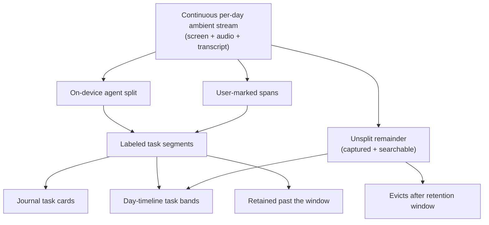
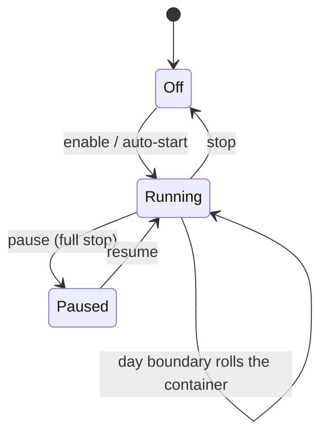
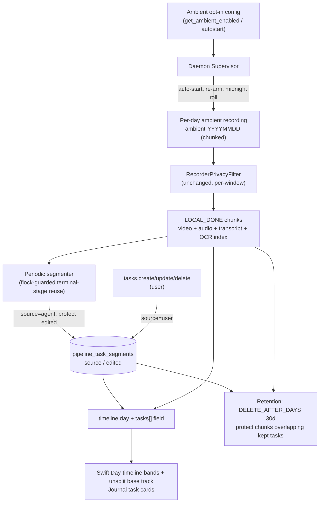

# Ambient Recording + Agent Task Segmentation - Plan

## Goal Capsule

- **Objective:** Ship opt-in always-on ambient capture and surface agent-split task segments (plus user-marked ones) in the Journal and Day-timeline, so a user's day is automatically organized into labeled tasks over one continuous, searchable stream.
- **Product authority:** Rute (SCR-214 author).
- **Scope note:** This is SCR-214 in full — both the always-on capture (previously flagged for deferral) and the segmentation → Journal/Day-timeline surfacing are in this ticket. The two are coupled: "unsplit — still searchable" only has a referent once ambient capture exists.
- **Open blockers:** None. The retention default is set (30 days); the remaining open items are architectural and deferred to planning (see Outstanding Questions).

---

## Product Contract

### Summary

Add opt-in always-on ambient capture — one continuous per-day recording at full fidelity (screen, audio, transcript) that the user can pause or stop at any time. The on-device agent splits each day into labeled task segments that populate the Journal; the user can rename, merge, split, delete, or add their own by marking a span live or after the fact. Footage between task segments renders as "unsplit — still searchable" on the Day-timeline; raw ambient footage rolls off after a retention window while any span kept as a task is retained.

### Problem Frame

The Screencap Prototype design builds the Journal around "ambient recording · split by the agent" — day-grouped task cards over always-on capture, with a Day-timeline showing labeled task segments against "unsplit — still searchable" regions. The product can't produce that today. Recordings are explicit start/stop only, so between recordings nothing is captured and the "unsplit" region has no referent — the current Day-timeline even substitutes "nothing captured" for the design's "unsplit — still searchable" because its gaps genuinely hold no footage.

The segmentation engine is further along than the ticket implies: the on-device segmenter already runs per recording, `/v0/tasks.list` already exposes labeled segments, and the Journal already renders a per-recording task breakdown. But the Day-timeline still shows one band per recording labeled with the recording title, and the design's headline experience — a continuous day, auto-split by the agent, with the gaps still searchable — cannot exist without an always-on stream underneath it.

### Key Decisions

- **One continuous stream; tasks are marked spans, not two layers.** Ambient is a single per-day recording, and a task is a labeled sub-span of it (agent- or user-created). "Focused recording" is reframed: when ambient is on, starting a recording marks a task span in the stream rather than opening a separate parallel capture. This fits the existing segmenter — `tasks.list` segments are already sub-spans of a recording — and avoids a second capture pipeline.
- **Full-fidelity ambient capture, including continuous audio.** Ambient records what a focused recording does today — screen video, audio, transcript — so recall is richest and unsplit footage stays playable, clippable, and searchable. The storage and privacy cost is bounded by retention, not by capturing less.
- **Agent auto-splits; the user curates.** The on-device agent auto-populates the Journal with candidate task segments; the user renames, merges, splits, deletes, and adds their own. This honors the design's "split by the agent" while giving the user direct control over "the parts I want to keep."
- **Rolling-window retention with kept spans exempt.** Raw ambient footage evicts after a retention window (default 30 days, time-based); any span kept as a task is retained. Always-on full-fidelity capture can't default to keep-forever, and "your recent days are here; what you kept stays" matches the Journal-as-your-days framing.
- **Opt-in, with the same privacy enforcement as explicit recordings.** Ambient is off by default and gated on first-run consent that covers always-on audio specifically. Capture-time blocking, pause rules, and mic-mute all apply to the stream identically, and nothing new is uploaded — the stream and its tasks stay local by the existing rules.

The data model these decisions produce:

### Requirements

**Ambient capture**

- R1. Ambient capture is opt-in, off by default, and gated behind first-run consent that specifically covers always-on audio.
- R2. When enabled, ambient runs as a single continuous per-day recording the user can pause/resume and stop at any time, and may auto-start (e.g., on login) per the user's setting.
- R3. Ambient records at full fidelity — screen video, audio, and transcript — identical to a focused recording.
- R4. Capture-time privacy enforcement applies to the ambient stream identically to explicit recordings: blocked apps are cut from video, secure-field / EXCLUDE / MASK are honored, and pause + mic-mute stop capture in-stream.
- R5. Each day is its own recording container: a day boundary closes the current ambient recording and opens the next.

Capture lifecycle:

**Task segmentation**

- R6. The on-device agent automatically segments each ambient day into labeled task segments (name + time span), degrading to the idle-gap heuristic when no on-device model is available, reusing the existing segmentation path.
- R7. Segmentation runs incrementally so the current day's Journal fills as the day progresses, not only when the stream stops.
- R8. The user can create a task span manually — proactively ("start a task now") or retroactively (select a span and label it) — and can rename, merge, split, and delete task segments, whether agent- or user-created.
- R9. Time in the stream not covered by any task segment is "unsplit" footage: captured, searchable via the content index, and retained until the retention window rolls it off.

**Journal & Day-timeline surfaces**

- R10. The Journal renders agent-split and user-created task segments as day-grouped task cards, not one card per raw recording.
- R11. The Day-timeline renders labeled task-segment bands over the continuous day, with the between-task remainder shown as "unsplit — still searchable."
- R12. Task segments and their labels are exposed additively over the daemon `/v0` API so the Journal and Day-timeline can render them at day granularity, preserving existing constraints (no `browser_url`, local-only, class-name-only diagnostics).

**Retention**

- R13. Raw ambient footage evicts automatically after a default retention window of 30 days (time-based); the window is user-configurable.
- R14. Any span kept as a task segment is retained beyond the window — eviction never removes footage covered by a kept task.

**Reconciliation with existing surfaces**

- R15. Library, editable titles, and clip-a-moment operate on task spans as the unit when ambient is on, consistent with "tasks are spans of one stream."
- R16. Explicit start/stop recording remains available and unchanged for users who do not enable ambient.

### Key Flows

- F1. Enable ambient and capture a day
  - **Trigger:** User turns on ambient capture for the first time.
  - **Steps:** First-run consent (covering always-on audio) → user enables and optionally sets auto-start → the per-day stream begins → capture-time privacy enforcement and pause/mic-mute apply throughout → at the day boundary the container rolls.
  - **Outcome:** A continuous, privacy-filtered, full-fidelity day stream exists on-device.
  - **Covers:** R1, R2, R3, R4, R5.
- F2. Agent split populates the Journal, user curates
  - **Trigger:** Ambient has been running and segmentation runs incrementally.
  - **Steps:** The on-device agent labels completed spans → task cards appear in today's Journal and as bands on the Day-timeline → the user renames/merges/splits/deletes, or marks an unsplit span as a new task.
  - **Outcome:** The day reads as labeled tasks against an "unsplit — still searchable" remainder, curated by the user.
  - **Covers:** R6, R7, R8, R9, R10, R11.

### Acceptance Examples

- AE1. Pause mid-day
  - **Given** ambient is running, **when** the user pauses, **then** video and audio capture stops for the paused span, resumes on unpause, and the paused span reads as "nothing captured" — not "unsplit — still searchable" (nothing was recorded there).
  - **Covers:** R2, R4, R9.
- AE2. Today fills without stopping
  - **Given** ambient has been running for a few hours, **when** incremental segmentation runs, **then** today's Journal shows labeled task cards for completed spans without waiting for the stream to stop.
  - **Covers:** R6, R7, R10.
- AE3. Mark a task over unsplit footage
  - **Given** a span of unsplit footage from this morning, **when** the user selects it and labels it a task, **then** it becomes a retained task segment shown as a Day-timeline band and a Journal card.
  - **Covers:** R8, R9, R14.
- AE4. Retention rolls off raw but keeps tasks
  - **Given** ambient footage older than the retention window, **when** eviction runs, **then** unsplit footage in that window is deleted while any span kept as a task remains playable.
  - **Covers:** R13, R14.
- AE5. No on-device model available
  - **Given** a CLI-only or pre-macOS-26 install, **when** segmentation runs, **then** the day is split by the idle-gap heuristic with mechanical names and every other behavior is unchanged.
  - **Covers:** R6.

### Scope Boundaries

**Deferred for later (own tickets):**
- Cloud sync/propagation of ambient footage or task segments — local-only for v1.
- Auto-pause heuristics for audio (e.g., pausing during video calls) and any two-party-consent automation — v1 relies on manual pause, mic-mute, and first-run consent.
- Masked video upload of ambient footage — stays OFF, governed by the existing `masked_video_upload` flag.

**Outside this v1:**
- Team/shared Journal or cross-device merge.
- Changing the segmentation model itself — reuse the existing on-device provider plus idle-gap heuristic.

### Dependencies / Assumptions

- Reuses the existing on-device segmentation path (`_run_local_segmentation`, `/v0/tasks.list`, `pipeline_task_segments`) and the local-only content index; no new model or cloud dependency is introduced.
- Assumes existing capture-time privacy enforcement and mic-mute apply unchanged to a continuously-running recording.
- Blocked-interval rendering on the Day-timeline carries over the existing honesty rules (`blocked_proven` vs `unverifiable`).
- Always-on audio widens the capture surface beyond what `SECURITY.md` documents today; updating that trust boundary (continuous mic + 30-day retained third-party audio) is a Definition-of-Done item.

### Outstanding Questions

All product-level questions are resolved; the architectural forks below were settled by the Key Technical Decisions and the document-review pass. What remains is UX-copy detail.

**Resolved in planning:** day-level task API (additive `tasks` field on `timeline.day`, KTD6); ambient per-day object + wake-driven roll (KTD1, U3); incremental-segmentation cadence + edit reconciliation via the protected-span carve-out (KTD4, U6); retention granularity (whole-chunk via capture-time bounds, KTD5, U8); task-ownership coexistence (`source`/`edited` + disjoint `task_index` ranges, KTD3, U5).

**Deferred to implementation:** first-run consent copy and the exact placement/copy of the ambient enable / pause / auto-start controls (U12).

### Sources / Research

- Segmentation engine: `src/screencap/terminal_stage.py` (`_run_local_segmentation`), `src/screencap/segmentation/` (provider, degrade ladder), `src/screencap/task_manifest.py` (idle-gap heuristic `_segment_tasks`).
- Task surface: `/v0/tasks.list` in `src/screencap/daemon/app.py`; `pipeline_task_segments` in `src/screencap/pipeline_state.py`.
- Day-timeline today: `macos/ScreenCap/Views/Timeline/DayTimelineView.swift`, `macos/ScreenCap/Views/Timeline/DayStripView.swift` (legend honesty substitutions); Journal: `macos/ScreenCap/Views/Journal/JournalTasks.swift`.
- Recording lifecycle: `src/screencap/engine/recorder.py`, `recording.start` / `recording.stop` in `src/screencap/daemon/app.py`; mid-recording mic-mute in `src/screencap/daemon/app.py` (SCR-218) and `recorder.py` (`mute_control_q`).
- Local-only rules: `src/screencap/upload.py` (`recording.db` exclusion, `assert_uploadable`), `src/screencap/content_index.py`.
- Design + prior UI plan: `docs/design/screencap-prototype/Screencap Prototype.dc.html` (Journal / Day-timeline), `docs/plans/2026-07-03-001-feat-screencap-prototype-ui-plan.md`.
- Related work built around discrete recordings (reconcile per R15): `docs/plans/2026-07-12-001-feat-clip-a-moment-video-export-plan.md`, `docs/plans/2026-07-12-001-feat-editable-recording-titles-plan.md`; on-device generation seam: `docs/plans/2026-07-09-002-feat-ondevice-llm-generation-endpoint-plan.md`.

---

## Planning Contract

**Product Contract preservation:** unchanged — R1–R16, the Key Decisions, and all Flows/Acceptance Examples carry forward verbatim. Planning added the sections below; no product scope was altered.

### Key Technical Decisions

- KTD1. **Per-day ambient recording, rolled at midnight.** Ambient is one recording per calendar day (`ambient-YYYYMMDD`), closed and re-opened at the day boundary rather than a single unbounded dir. Reuses the existing recording-dir model, `timeline.day` day-clamping, and per-recording retention. Intra-day 15-min chunk rotation is unchanged.
- KTD2. **Ambient reuses the whole capture engine unchanged; "ambient" is a frozen intent flag, not a second pipeline.** `RecorderPrivacyFilter` is keyed off the resolved `PrivacyConfig` and per-window events, not off any start-mode, so capture-time blocking / secure-field / MASK / EXCLUDE cover the ambient stream identically (`enforcement/recorder_enforcement.py`, built in `engine/collaborators.py:102`). Constraint: keep `capture_window_data` on (else the filter is `None`). The internal ambient request hard-pins `destination=LOCAL` (`cloud_intent=False`, no `force_mode`) regardless of `get_upload_default()`, and an assertion rejects any ambient request carrying `cloud_intent` — local-only is an enforced invariant, not a coding convention (a user with `upload_default=cloud/both` must never upload the always-on stream).
- KTD3. **Task ownership via `source` + `edited` columns, with disjoint index ranges.** Today `replace_task_segments` deletes and re-inserts *all* rows for a recording (`pipeline_state.py:861`), which would clobber user tasks on every re-segmentation. Add `source` (`agent`/`user`) and `edited` columns to `pipeline_task_segments` via an explicit, guarded `ALTER TABLE … ADD COLUMN` inside `ensure_pipeline_state_schema` — the table is raw DDL, not a SQLAlchemy model, so `CREATE TABLE IF NOT EXISTS` alone does NOT migrate existing DBs (guard with a `PRAGMA table_info` check or a duplicate-column `OperationalError` catch). Scope the agent replace to unedited agent rows. Because `UNIQUE(recording_id, task_index)` would collide agent and user rows (the agent assigns `task_index` positionally), agent rows keep a contiguous low range and user rows draw `task_index` from a disjoint high offset (`MAX(task_index)+1` from a reserved base). Incremental passes carve protected user/edited spans out of the segmentation input so fresh agent spans never overlap them. `tasks.json` (`terminal_stage.py:1203`) gets the same source-awareness. This is the load-bearing change that makes "agent auto-splits, you curate" hold.
- KTD4. **Incremental segmentation as a periodic flock-guarded daemon task.** A timer in `Supervisor` re-runs the terminal-stage segmenter (`_run_local_segmentation`, `terminal_stage.py:891`) over the growing ambient `recording_dir`, mirroring `resume_terminal_stage`'s worker-thread + `non_blocking` pattern (`supervisor.py:686`). Chosen over a per-chunk stage because segmentation needs the cross-chunk activity summary + the R11 privacy strip (`blocked_source=recording_dir`) + whole-recording replace idempotency, and per-chunk work runs in the engine process outside the terminal flock. The R11 privacy strip runs fail-CLOSED over the live (concurrently-written) `recording.db` — a partial read over-skips rather than under-blocks, so a masked interval can never leak into a task name surfaced by `tasks.list`. Consequence: today's labels refresh on the timer interval, not per closed chunk.
- KTD5. **Retention reuses `DELETE_AFTER_DAYS`; kept tasks protect their chunks.** The 30-day rolling window is the existing `DELETE_AFTER_DAYS` path (`retention.py:482`) applied to the ambient recording's LOCAL_DONE chunks. Add a task-span→chunk-index protector into `_evictable_candidates` (`retention.py:398`) that excludes any chunk overlapping a kept task span. Per-chunk capture bounds come from the chunk manifest's `chunk_start`/`chunk_end` (or min/max frame timestamps in `recording.db`) — NOT the ledger's `updated_at`, which is a state-transition time, not a capture window, and would mis-map task spans to chunks. Whole-chunk granularity — chunks are the eviction unit.
- KTD6. **Day-level task bands via an additive `tasks` field on `timeline.day`.** Add `tasks: [TaskSegment]` to `DaySegmentRecording` (`daemon/schema.py:503`), populated in `day_segments.py`, so the strip gets all task bands for the day in one round-trip (`TaskSegment` already exists at `schema.py:715`). The Swift strip overlays task bands on the existing recording-span rectangle, which becomes the "unsplit — still searchable" base track.
- KTD7. **Pause is a new capture-pause control modeled on mic-mute.** New verb → `supervisor.send_command` → engine-main handler → control queue → confirmed event, mirroring the mic-mute chain (`recording.mute` at `daemon/app.py:737`, `_make_set_muted_handler` at `engine/recorder.py:2750`), extended to stop video/screenshot capture alongside audio. Pause fully stops capture — paused spans record nothing and read "nothing captured" (AE1). This is distinct from mic-mute, which stops only audio: a mic-muted span still captures video and renders as "unsplit — still searchable," not "nothing captured."
- KTD8. **Auto-start via a supervised ambient task in the daemon.** The LaunchAgent already runs the daemon on login (`RunAtLoad`); ambient auto-start is a new supervised task in `Supervisor` after `_reconcile` clears, gated on `get_ambient_enabled()`, routing through a shared start-gate helper (extracted from `app.py:644-663`) that both the HTTP handler and the internal spawn call, so a future gate can't be added to one path but missed on the other. Re-arm after an engine exit uses exponential backoff with a max-retries/quiescence ceiling, surfacing a degraded state after repeated crashes rather than thrash-respawning. The idle-shutdown watchdog is taught that an active ambient recording is non-idle.

### High-Level Technical Design

### Assumptions

- Ambient enable is off by default; enabling it turns on auto-start-on-login by default (an "always-on" recording implies resuming after reboot), with a separate control to disable auto-start.
- The on-device segmenter's existing degrade ladder (Apple Foundation Models → idle-gap heuristic) is reused as-is; incremental runs change *when* it runs, not *how* it segments.
- Continuous audio + per-chunk transcription already work for chunked recordings (`chunk_processor` transcribes each `audio_NNNN.flac`); U1 forces the ambient audio substream on (R3), respecting mute/pause state.
- The macOS app's daemon is the source-built embedded daemon; app-side controls call new `/v0` verbs over the existing `DaemonClient`.

### Sequencing

- Phase A — Ambient capture: U1 → U2 → U3, U4.
- Phase B — Task model & generation: U5 → U6, U7.
- Phase C — Retention: U8.
- Phase D — Surfaces: U9 → U10 → U11.
- Phase E — Consent & controls: U12.

Cross-phase: U5 (task store `source`/`edited`) unblocks U6, U7, U8, U9. U3/U4 unblock the U12 controls.

---

## Implementation Units

| U-ID | Title | Key files | Depends on |
|---|---|---|---|
| U1 | Ambient config, intent, per-day identity | `config.py`, `engine/lock_policy.py`, `daemon/supervisor.py` | — |
| U2 | Supervised always-on ambient task | `daemon/supervisor.py`, `daemon/_idle_shutdown.py` | U1 |
| U3 | Day-boundary recording roll | `daemon/supervisor.py`, `engine/video.py` | U1, U2 |
| U4 | Capture-pause control | `daemon/app.py`, `daemon/supervisor.py`, `engine/recorder.py` | U2 |
| U5 | Task store: source/edited coexistence | `pipeline_state.py`, `terminal_stage.py` | — |
| U6 | Incremental segmentation daemon task | `daemon/supervisor.py`, `terminal_stage.py` | U5 |
| U7 | User task CRUD verbs | `daemon/app.py`, `daemon/schema.py`, `pipeline_state.py` | U5 |
| U8 | Ambient retention window + task-span protection | `retention.py`, `config.py`, `pipeline_policy.py` | U5 |
| U9 | Day-level task API field | `daemon/schema.py`, `daemon/day_segments.py`, `daemon/app.py` | U5, U6 |
| U10 | Swift Day-timeline task bands + unsplit + legend | `macos/ScreenCap/Views/Timeline/` | U9 |
| U11 | Swift Journal task cards + manual create + edit write-through | `macos/ScreenCap/Views/Journal/`, `Controllers/`, `Models/RecordingTasks.swift` | U7, U10 |
| U12 | First-run consent + ambient controls (Swift) | `macos/ScreenCap/Views/`, `Controllers/DaemonClient.swift` | U3, U4 |

### U1. Ambient config, intent, and per-day identity

- **Goal:** Add opt-in ambient config, freeze an `ambient` flag + `destination=LOCAL` into `.recording_intent`, force full-fidelity audio on, and name ambient recordings deterministically per day.
- **Requirements:** R1, R2, R3, R5.
- **Dependencies:** none.
- **Files:** `src/screencap/config.py` (`get_ambient_enabled`/`set_ambient_enabled`, `get_ambient_autostart`, `SCREENCAP_AMBIENT_*` + `[ambient]` `config.toml` keys), `src/screencap/engine/screen_recorder.py` (`RecordingRequest` ambient field), `src/screencap/engine/lock_policy.py` (freeze `ambient` into intent JSON near `:84`), `src/screencap/catalog.py` (read ambient from intent), `src/screencap/daemon/supervisor.py` (`_allocate_capture_dir` deterministic `ambient-YYYYMMDD` name near `:1288`), `tests/test_config.py`, `tests/test_recording_intent.py`.
- **Approach:** Mirror the `get_audio_default`/`set_audio_default` config pattern (`config.py:146`). Ambient is a frozen intent field alongside `destination`/`retention_policy`; the ambient request hard-pins `destination=LOCAL` / `cloud_intent=False` regardless of `get_upload_default()` (KTD2) and defaults the audio substream ON so R3's screen + audio + transcript holds. Per-day identity resolves-or-reopens the deterministic `ambient-YYYYMMDD` dir when it already exists and is not finalized — bypassing `_allocate_capture_dir`'s collision-suffix loop, which would otherwise fork `ambient-YYYYMMDD-2`; on re-open, reconcile with any frozen `chunks_expected` / completeness sentinel the terminal stage wrote.
- **Test scenarios:** `get_ambient_enabled` defaults false; env override beats `config.toml`; enabling sets autostart-default true with an independent disable. Intent round-trips `ambient: true` + `destination=local`. An ambient request built under `upload_default=cloud` still freezes `destination=local` and carries no `cloud_intent`. The ambient audio substream is on → a transcript is produced (R3). Same-day re-entry re-resolves the existing `ambient-YYYYMMDD` dir (no `-2` fork); re-open with an existing sentinel is handled.
- **Verification:** Config/intent covered; a dry ambient `recording.start` writes the expected dir name, `destination=local`, audio-on, and never forks a second same-day dir.

### U2. Supervised always-on ambient task

- **Goal:** Auto-start ambient on daemon boot when enabled, re-arm after the engine exits, and keep the daemon alive while ambient runs.
- **Requirements:** R2.
- **Dependencies:** U1.
- **Files:** `src/screencap/daemon/supervisor.py` (ambient auto-start after `_reconcile` clears near `:1029`; re-arm on engine teardown), `src/screencap/daemon/_idle_shutdown.py` (count active ambient as non-idle), `tests/test_supervisor_ambient.py`.
- **Approach:** After reconcile clears `_recovering`, gate on `get_ambient_enabled()` and issue an internal `spawn(<ambient request>)` built with `destination=LOCAL` / `cloud_intent=False` (U1). Extract the `recording.start` permission + paywall gates (`app.py:644-663`) into a shared helper that both the HTTP handler and this internal spawn call — do not duplicate the checks, so a future gate can't be added to one path but missed on the other. Re-arm by watching `_proc` teardown with exponential backoff and a max-retries/quiescence ceiling: a persistently-failing engine (disk full, revoked TCC, deterministic crash) surfaces a degraded state instead of thrash-respawning. Teach the idle-shutdown watchdog (`has_inflight_resume` sibling) that an active ambient recording blocks idle shutdown.
- **Execution note:** Add a supervisor-level integration test that a booted daemon with ambient enabled spawns exactly one ambient recording and re-arms once after a simulated engine exit — mocks alone won't prove the re-arm.
- **Test scenarios:** Ambient disabled → no auto-spawn. Enabled → one ambient spawn after reconcile via the shared gate helper; permission-denied → no spawn + surfaced degraded state; paywall-blocked → no spawn. Single engine exit → exactly one re-arm. Repeated rapid exits → backoff engages and re-arm stops at the ceiling with a surfaced degraded state (no thrash loop, no crash-truncated micro-chunk litter). Idle-shutdown does not fire while ambient is active.
- **Verification:** Booting the daemon with ambient on yields a running ambient recording; killing the engine re-arms it; a crash-looping engine stops at the ceiling; idle watchdog stays parked.

### U3. Day-boundary recording roll

- **Goal:** At the calendar day boundary, close the current ambient recording and open the next day's, seamlessly.
- **Requirements:** R5.
- **Dependencies:** U1, U2.
- **Files:** `src/screencap/daemon/supervisor.py` (midnight roll in the ambient supervision loop), `src/screencap/engine/video.py` (confirm chunk rotation handles a clean close mid-stream near `:790`), `tests/test_ambient_day_roll.py`.
- **Approach:** The supervised ambient task detects the local-day change and performs a stop→start roll to the next `ambient-YYYYMMDD` dir. Because the daemon is suspended while the Mac sleeps, the roll is also wake-driven: on a wake notification (or a bounded catch-up on the first post-wake tick) it performs any missed roll, and a chunk left open across midnight is force-closed at the boundary so it belongs to exactly one day. The finished day finalizes through the normal terminal path (final segmentation pass). A recording-level roll over an unbounded dir keeps day-grouping, `timeline.day`, and per-day retention clean.
- **Test scenarios:** Crossing local midnight closes day N and opens day N+1 with correct dir names. Sleep-across-midnight then wake (e.g. at 08:00) rolls on wake, and a chunk open at sleep time is force-closed to a single day (no straddling chunk). Day N finalizes (terminal stage + segmentation). A DST/timezone shift resolves to one unambiguous local day. No capture gap beyond the roll handoff.
- **Verification:** A simulated clock crossing midnight, and a simulated suspend/resume across midnight, each produce two adjacent per-day recordings with contiguous coverage and no straddling chunk.

### U4. Capture-pause control

- **Goal:** Let the user pause and resume ambient capture (video + audio) mid-stream without ending the recording.
- **Requirements:** R2, R4, R16.
- **Dependencies:** U2.
- **Files:** `src/screencap/daemon/app.py` (new `recording.pause`/`recording.resume` verbs near the mute verb `:737` + route registration `:2716-2744`), `src/screencap/daemon/supervisor.py` (`send_command` pass-through like `set_muted` `:390`), `src/screencap/engine/recorder.py` (pause handler mirroring `_make_set_muted_handler` `:2750`, toggling video/screenshot capture + audio), `src/screencap/daemon/schema.py` (request models), `tests/test_recording_pause.py`.
- **Approach:** Copy the mic-mute chain end-to-end and extend it to gate video/screenshot capture in addition to audio. Echo requested state; treat the engine's confirmed `paused`/`resumed` event as truth. A paused interval records nothing — it is a genuine capture gap, not unsplit footage (AE1). Because this touches the shared `recorder.py` capture path, keep the explicit (non-ambient) start/stop flow unchanged (R16).
- **Test scenarios:** `Covers AE1.` Pause stops video + audio; resume restarts both; the paused span has no captured frames and no audio file. Pause while already paused is idempotent. Pause is honored across a chunk rotation. Confirmed event drives UI state, not the requested echo. `Covers R16.` Explicit (non-ambient) recording start/stop is unchanged by the pause-control edits to the shared capture path.
- **Verification:** Pausing during an ambient recording produces a gap the Day-timeline renders as "nothing captured"; explicit recording is unaffected.

### U5. Task store: source/edited coexistence

- **Goal:** Let agent-generated and user-authored task segments coexist so re-segmentation never clobbers user work.
- **Requirements:** R8.
- **Dependencies:** none.
- **Files:** `src/screencap/pipeline_state.py` (add `source`/`edited` columns to `pipeline_task_segments` via a guarded `ALTER TABLE … ADD COLUMN` inside `ensure_pipeline_state_schema` — NOT via `CREATE TABLE IF NOT EXISTS`, which won't migrate the existing raw-DDL table `:256`; scope `replace_task_segments` `:861` to `source='agent' AND edited=0`; give agent rows a contiguous low `task_index` range and reserve a disjoint high base for user rows so `UNIQUE(recording_id, task_index)` never collides; add row-level `insert/update/delete_task_segment` + a `TaskSegmentRow.source`/`edited` field `:209`), `src/screencap/terminal_stage.py` (write `source='agent'` and preserve user rows in `tasks.json` `:1203`), `tests/test_pipeline_task_segments.py`.
- **Approach:** The agent replace becomes a scoped replace: delete only unedited agent rows, then re-insert the fresh agent set at contiguous low indices, leaving `source='user'` / `edited=1` rows (high indices) intact. Because `pipeline_task_segments` is raw DDL (not a SQLAlchemy model), the migration must run an explicit `ALTER TABLE … ADD COLUMN` guarded by a `PRAGMA table_info` check (or a duplicate-column `OperationalError` catch) so *existing* DBs gain the columns and read back `source='agent', edited=0`; fresh DBs get them from the DDL.
- **Execution note:** Add characterization coverage of the current whole-recording replace before changing it; test the migration on a DB that already has the table without the columns (the common existing-user case), not just a fresh DB.
- **Test scenarios:** Scoped replace preserves user + edited-agent rows and refreshes unedited agent rows. A fresh agent re-insert never raises `IntegrityError` against a user-held `task_index` (disjoint ranges). Empty agent result clears only unedited agent rows. Migration on a pre-columns *existing* DB adds the columns and defaults `source='agent', edited=0`. Row-level insert/update/delete round-trip. `read_task_segments` orders by `task_index` across mixed sources.
- **Verification:** A re-segmentation over a recording with a user task leaves the user task untouched, never raises a UNIQUE collision, and updates agent tasks.

### U6. Incremental segmentation daemon task

- **Goal:** Segment the growing ambient day incrementally so today's Journal fills as the day progresses.
- **Requirements:** R6, R7.
- **Dependencies:** U5.
- **Files:** `src/screencap/daemon/supervisor.py` (periodic flock-guarded segmentation sweep mirroring `resume_terminal_stage` `:686` and the `_token_refresh_loop` timer `:1768`), `src/screencap/terminal_stage.py` (expose an incremental entry reusing `_run_local_segmentation` `:891` over a live `recording_dir`), `tests/test_incremental_segmentation.py`.
- **Approach:** On a timer, for the active ambient recording, run the existing segmenter under the terminal flock over the current on-disk manifests + `recording.db`, writing `source='agent'` via the scoped replace (U5). Reuse `build_activity_summary(..., blocked_source=recording_dir)` with the R11 blocked-interval derivation run **fail-closed** over the live (concurrently-written) DB — a partial read over-skips rather than under-blocks, so a masked interval never reaches a provider or a task name. Carve protected user/edited spans out of the segmentation input so fresh agent spans don't overlap them (KTD3). Strictly fail-open on the *provider*: a miss or error leaves existing tasks intact.
- **Execution note:** Integration test that a partially-recorded ambient dir produces agent tasks mid-recording and that a later pass refreshes them without duplication or overlap with a user-edited span.
- **Test scenarios:** Mid-recording pass produces agent task rows; a second pass over more footage refreshes agent rows without duplicating. User rows survive both passes and no fresh agent span overlaps a protected user/edited span. A mid-write DB never yields a task covering a masked interval (fail-closed R11, privacy lane). No on-device model → idle-gap heuristic names tasks (`Covers AE5.`, `Covers AE2.`). Provider error → prior tasks unchanged. Concurrent terminal-stage finalize and incremental pass do not double-write (flock holds).
- **Verification:** An ambient recording accrues labeled, non-overlapping tasks visible via `tasks.list` before it stops.

### U7. User task CRUD verbs

- **Goal:** Expose create/update/delete/merge/split for task segments so the app can add and curate tasks.
- **Requirements:** R8.
- **Dependencies:** U5.
- **Files:** `src/screencap/daemon/app.py` (`tasks.create`/`tasks.update`/`tasks.delete`/`tasks.merge`/`tasks.split` mirroring `recording.rename` `:820`; routes near `:2734`), `src/screencap/daemon/schema.py` (request/response models + version consts near `:705`), `src/screencap/pipeline_state.py` (row-level methods from U5), `tests/test_tasks_crud_verbs.py`.
- **Approach:** Follow the `recording.rename` post-hoc mutating-verb pattern: peer descriptor, `_audit` on every exit path, validated request model, typed error responses. Create sets `source='user'` with a `task_index` from the reserved high range (U5); update marks an agent row `edited=1`. `tasks.merge` (combine adjacent segments; the surviving label is the caller's choice, applied atomically in one transaction) and `tasks.split` (a split point yields two segments) are dedicated verbs so the app never composes non-atomic client-side sequences. Decide `_ACTIVITY_PATHS` membership as mutating verbs (like mute/stop), not read verbs.
- **Test scenarios:** Create adds a `source='user'` row at a non-colliding `task_index`; update marks an agent row `edited=1`; delete removes the row; merge combines two segments atomically with the chosen label (partial failure rolls back); split produces two segments at the point. Traversal recording name → 400; malformed body / zero-length / out-of-range span → 400. Audit recorded on success and failure. A subsequent incremental segmentation (U6) preserves all outcomes.
- **Verification:** The five verbs mutate the local task store and survive the next agent pass.

### U8. Ambient retention window + task-span protection

- **Goal:** Roll off raw ambient footage after 30 days while retaining any chunk covered by a kept task.
- **Requirements:** R9, R13, R14.
- **Dependencies:** U5.
- **Files:** `src/screencap/retention.py` (task-span→chunk-index protector injected into `_evictable_candidates` `:398`), `src/screencap/config.py` (ambient default `DELETE_AFTER_DAYS` days=30 via `get_retention_policy` `:511`), `src/screencap/pipeline_policy.py` (resolve ambient retention `:179`), `tests/test_retention_ambient.py`.
- **Approach:** Ambient recordings resolve to `DELETE_AFTER_DAYS` (days=30), reusing `_select_past_days` (`:482`). Before candidate selection, map each kept `TaskSegmentRow.start_ts/end_ts` to the chunk indices it overlaps using per-chunk capture bounds from the chunk manifest's `chunk_start`/`chunk_end` (or min/max frame timestamps in `recording.db`) — never the ledger `updated_at` (a state-transition time, KTD5) — and exclude those chunks. Because the window is frozen into `.recording_intent` per recording, a changed default applies to *future* ambient days; existing days keep the window they started with (surface this in the setting copy). Default `keep_forever` is unchanged for non-ambient recordings.
- **Execution note:** Characterize current eviction candidate selection before adding the protector, to prove non-ambient behavior is unchanged.
- **Test scenarios:** `Covers AE4.` Ambient chunks older than 30 days evict; a chunk overlapping a kept task is retained even when older (mapped via capture bounds, not `updated_at`). A chunk re-transitioned near eviction still maps to its capture window. Changing the window affects future ambient days only. Non-ambient `keep_forever` recordings still no-op. A chunk partially overlapping a task span is kept whole.
- **Verification:** Simulated 31-day-old ambient footage evicts except chunks under kept tasks, using capture-time bounds.

### U9. Day-level task API field

- **Goal:** Return per-task bands for a day in one round-trip.
- **Requirements:** R12.
- **Dependencies:** U5, U6.
- **Files:** `src/screencap/daemon/schema.py` (`tasks: [TaskSegment]` on `DaySegmentRecording` `:503`), `src/screencap/day_segments.py` (populate per recording near `:187`), `src/screencap/daemon/app.py` (`timeline.day` handler `:2106`), `tests/test_timeline_day_tasks.py`.
- **Approach:** Additive only — existing `timeline.day` fields and the `timeline.query` row shape are untouched. Populate `tasks` from `read_task_segments` per day-recording, preserving the local-only + class-name-only-diagnostics constraints. Bump the verb's API version const.
- **Test scenarios:** A day with tasks returns them nested per recording; a day with none returns `tasks: []`. Existing `DaySegmentRecording` fields unchanged (additive). Blocked/unverifiable intervals still returned per existing honesty rules. Version const bumped.
- **Verification:** `timeline.day` returns task bands consumable by the strip without a second call.

### U10. Swift Day-timeline task bands + unsplit base track + legend

- **Goal:** Render agent/user task bands over the day, with the remainder as "unsplit — still searchable," and honest legend copy.
- **Requirements:** R11.
- **Dependencies:** U9.
- **Files:** `macos/ScreenCap/Views/Timeline/DayTimelineView.swift` (emit N `DayStripSegment` per recording from the new `tasks` field, near `stripSegments` `:369`), `macos/ScreenCap/Views/Timeline/DayStripView.swift` (`DayStripSegment` task fields + unique id `:12`; overlay bands on the recording-span base track; legend `:297`; accessibility `:343`), `macos/ScreenCap/Models/`, `macos/ScreenCapTests/DayTimelineTaskBandsTests.swift`.
- **Approach:** The recording-span rectangle becomes the "unsplit — still searchable" base layer; task bands overlay it with their labels. Task spans are a **non-overlapping partition** (enforced by U6's carve-out + U7's overlap validation), so band layout needs no stacking/z-order. Replace the legend's honesty substitutions (`agent-labeled task` and `unsplit — still searchable` now have referents). `DayStripSegment.id` moves off `recording` (non-unique per task) to a task-stable id. Accessibility covers keyboard focus order across bands and announcements for the unsplit / "nothing captured" / blocked regions and the span-select affordance (U11), not just task titles. A very narrow band truncates its label with a hover/tooltip fallback. Paused/blocked spans keep their existing honest rendering.
- **Test scenarios:** N tasks in a recording render N labeled bands over the base track (non-overlapping). A recording with no tasks renders a plain unsplit base band. Legend shows task + "unsplit — still searchable" + "nothing captured" + blocked swatches. VoiceOver/keyboard can focus and announce every region type (task, unsplit, nothing-captured, blocked). A very narrow band truncates its label with a tooltip. Segment ids are unique.
- **Verification:** The Day-timeline shows the agent split with an unsplit remainder, keyboard-navigable, matching the design legend.

### U11. Swift Journal task cards + manual create + edit write-through

- **Goal:** Render agent-split task cards and let the user create, rename, merge, split, and delete tasks.
- **Requirements:** R8, R10, R15.
- **Dependencies:** U7, U10.
- **Files:** `macos/ScreenCap/Views/Journal/JournalView.swift` + `JournalTasks.swift` (task cards; write-through on edit; empty-state), `macos/ScreenCap/Controllers/DaemonClient.swift` + `SearchService.swift` (`tasksCreate/Update/Delete/Merge/Split`), `macos/ScreenCap/Models/RecordingTasks.swift` (request models + `source`/`edited` marker), `macos/ScreenCap/Views/Timeline/` (span-select gesture; live "start a task" + in-progress rendering), `macos/ScreenCapTests/RecordingTasksTests.swift`.
- **Approach:** Extend the existing `JournalTasks` one-`tasks.list`-per-recording resolver to write through the CRUD/merge/split verbs and refresh its cache on edit. Manual creation has two entry points: **(a) live "start a task"** — opens an in-progress span that ends on an explicit stop, the next task-start, or the day-roll, rendering as a growing band + a provisional Journal card until closed; **(b) retroactive span-select** on the Day-timeline — drag-to-select endpoints that snap to task/chunk boundaries, then a label-entry confirmation. When ambient is on, the app's record affordance IS "start a task" (a span in the stream), not a second `recording.start`; the daemon still rejects a concurrent `recording.start` while ambient holds the lock (existing `LockContendedError`, surfaced), and explicit start/stop stays intact when ambient is off (R16). A failed write-through shows a visible retry/error state and reverts local state (no silent divergence). An all-unsplit day shows an "unsplit — still searchable" Journal placeholder. Library/editable-titles/clip-a-moment operate on task spans as the unit (R15) — clip-a-moment already reads task bounds, so this is adaptation, not rework.
- **Test scenarios:** Journal renders one card per task with day grouping; an all-unsplit day shows the placeholder. Create/rename/merge/split/delete call the right verb and refresh the cache. A live "start a task" renders an in-progress band/card and closes on stop / next-start / day-roll. Span-select drag sets snapped endpoints and confirms a label. A failed write shows a visible error and reverts (not silently overwritten by re-segmentation). Editing an agent task marks it `edited` so the next agent pass preserves it. `Covers AE3.` Labeling an unsplit span creates a retained task shown as a band and a card.
- **Verification:** A user can curate the day's tasks end-to-end (including merge/split and a live task) and the edits survive re-segmentation.

### U12. First-run consent + ambient controls (Swift)

- **Goal:** Gate ambient on first-run consent covering always-on audio, and expose enable / pause / auto-start controls.
- **Requirements:** R1, R2.
- **Dependencies:** U3, U4.
- **Files:** `macos/ScreenCap/Views/` (consent sheet + ambient settings), `macos/ScreenCap/Controllers/DaemonClient.swift` (enable + pause/resume verbs), `macos/ScreenCapTests/AmbientConsentTests.swift`.
- **Approach:** First enable shows a consent sheet that specifically names always-on audio (other people in meetings) before ambient starts. Controls: an enable toggle, an auto-start-on-login toggle (default on when enabled), and a pause/resume affordance wired to U4. The enable toggle reflects the daemon's surfaced state: a permission-denied or paywall-blocked ambient (U2) shows a blocked/error state with copy, not a silent on-with-nothing-recording. Pause/resume disable or show-pending during the request round-trip. Follows the app's existing consent-flow and settings patterns.
- **Test scenarios:** Ambient stays off until consent is accepted; declining leaves it off. Enabling defaults auto-start on with an independent off. Permission-denied / paywall-blocked enable shows a blocked state + copy, not a silent non-recording toggle. Pause/resume reflect the daemon's confirmed state (not the requested echo) and show pending in-flight. Re-launch with ambient enabled resumes capture (via U2).
- **Verification:** A first-time user can opt in through consent; a blocked enable shows why; pause/enable controls drive the daemon.

---

## Verification Contract

| Gate | Command | Applies to |
|---|---|---|
| Python unit/integration | `PYTHONPATH=src pytest tests/` | U1–U9 |
| Single test | `PYTHONPATH=src pytest tests/test_retention_ambient.py::<test>` | targeted |
| Privacy lane (CI-authoritative) | `PYTHONPATH=src pytest -m privacy` | U2, U4, U6, U8 |
| Lint | `ruff check src/screencap/` | all Python |
| macOS app tests | `ScreenCapTests` target (XcodeGen project) | U10–U12 |

Repo-specific gates:
- CI runs only the `-m privacy` lane (plus the lock-policy test). Mark privacy-bearing tests `@pytest.mark.privacy` and keep them Vision-free, or they will not run on CI — this covers the capture-time enforcement paths (ambient privacy, pause gaps, retention protection, R11 strip on incremental segmentation).
- In a worktree, run Python tests with `PYTHONPATH=src` — the editable install may point at a different worktree.
- Do not run `xcodebuild` from a `~/Documents` worktree (it TCC-bricks the session); compile/verify the Swift units from a copy under `/private/tmp` or on the main checkout.

## Definition of Done

Global:
- R1–R16 satisfied; ambient is off by default and requires consent (R1).
- Agent re-segmentation never clobbers user-created or user-edited tasks (KTD3); verified by U5/U6/U7 tests.
- Retention evicts 30-day-old ambient footage but retains chunks under kept tasks (R14), mapped via capture-time bounds not ledger `updated_at`; verified by U8.
- Local-only is enforced, not conventional: an ambient recording started under `upload_default=cloud/both` still freezes `destination=local` and never reaches an upload seam (privacy lane).
- Explicit (non-ambient) start/stop recording is verified unchanged (R16 regression).
- `SECURITY.md` is updated for the always-on-audio trust boundary (continuous mic + 30-day retained third-party audio).
- Capture-time privacy enforcement, pause gaps, and the fail-closed R11 strip on incremental segmentation are covered in the `-m privacy` lane and green.
- `PYTHONPATH=src pytest tests/`, the privacy lane, and `ruff` are green; `ScreenCapTests` pass on a non-worktree build.
- Abandoned/experimental code from the build is removed; no dead ambient/pipeline branches left in the diff.

Per-unit: each U-ID is done when its Test scenarios pass and its Verification outcome holds. Units are landed in the Sequencing order, with U5 before U6/U7/U8/U9.
