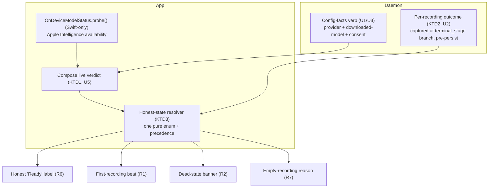
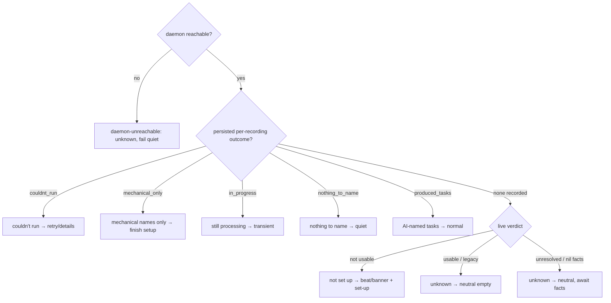

# Intelligence Setup Surfacing and Honest Status - Plan

## Goal Capsule

- **Objective:** Make intelligence setup discoverable at the recording moment, and make its status honest — so a new user reaches a working intelligence choice (or a conscious skip) without hunting through Settings, and never faces a "Ready" that produces nothing.
- **Product authority:** rfigueiredo.dev@gmail.com (product owner). Product Contract validated in `ce-brainstorm`.
- **Stop conditions:** Surface a genuine blocker (a change that contradicts the Product Contract or the shared-signal decision) rather than guessing. Do not weaken the local-first degrade ladder (day-split never touches cloud) or the "nudge never block" rule.
- **Execution profile:** Cross-language — Python daemon (per-recording outcome + config-facts verdict inputs) and macOS SwiftUI app (fresh availability probe, verdict composition, honest-state model, surfaces). Because the Apple-Intelligence-availability fact is Swift-only, the **app composes the final live verdict** (its probe + the daemon's config facts); the daemon never probes availability. This relaxes strict "daemon units land first" ordering: the daemon verdict-inputs (U1) and the app availability-feed/composition (U4–U5) are co-dependent and land together, then the consuming surfaces.
- **Environment constraints for the implementer:** (a) This repo lives under `~/Documents`, where running `xcodebuild` TCC-bricks the session — Swift units (U4–U8) are **compile-only on a `/private/tmp` copy** (signing off, never launched/run) and are runtime-verified on a machine outside `~/Documents`; (b) this checkout is **concurrently owned by another branch**, so all implementation must run in an **isolated git worktree**, never in the shared checkout.
- **Product Contract preservation:** changed — R7 (in the initial enrichment) expanded from three empty reasons to five honest states. This revision changes only Planning Contract (KTDs, HTD, sequencing) and Implementation Units to resolve review findings; R1–R8 are unchanged.

---

## Product Contract

### Summary

Add a recording-anchored path to working intelligence plus an honest status. A one-time first-recording beat teaches new users what intelligence does and lets them choose a model; a non-blocking banner nudges only when no usable model exists; every recording without AI-named tasks states which honest state applies; and the Intelligence screen stops claiming "Ready" when it will not actually produce results. One logical "usable" verdict feeds all surfaces so they cannot disagree.

### Problem Frame

Starting a recording says nothing about intelligence. `RecorderController.start()` gates only on Screen Recording permission — there is no intelligence check, prompt, or nudge in the record path. A new user has no signal that intelligence exists, needs setting up, or lives on a Settings screen they've never opened.

The deeper pain is that the status can lie by omission. The Intelligence screen can show "Ready (Apple Intelligence)" while a finished recording still produces no named tasks — and several very different situations look identical to the user: nothing is actually set up, a model ran but had too little to name, a model was configured but couldn't run, or on-device silently degraded to a mechanical idle-gap heuristic. The app never says what intelligence did or why a recording lacks real tasks. A new user silently gets no value and concludes the feature is broken or absent.

### Key Decisions

- **Nudge, never block.** Recording is time-sensitive, so the setup surfaces never gate the record action. The New Recording sheet is deliberately not used as an interrupt.
- **The beat runs once for everyone, not just the broken state.** Discoverability wins over zero-friction: even a user whose Apple Intelligence is already usable learns intelligence exists and confirms a choice. Content adapts to state (a light confirmation when a usable model exists; the choose-a-model offer when none does).
- **The beat is catch-up, not a duplicate.** Fresh installs still make the choice in onboarding's existing download-model step; the beat fires only when that choice wasn't made or wasn't seen (existing users, skippers), so nobody is asked twice — and it reaches existing users who never see the onboarding wizard.
- **Honest readiness over the availability probe.** "Ready" must mean "will produce results," derived from what the system can actually run — not from the Apple Intelligence availability probe alone. That probe alone is what produced the "says Ready, got nothing" experience.
- **One shared usable verdict.** The banner, the beat's adaptive content, the settings readiness label, and the empty-recording reason all resolve from one logical verdict, so they cannot drift into disagreeing.

### Requirements

**Recording-anchored setup surfacing**

- R1. The first time a user starts a recording, show a one-time beat that explains what intelligence does and lets them choose a model (download on-device / connect their own / skip). It is adaptive: a light confirmation when a usable model already exists, the choose-a-model offer when none does. It never blocks recording — the recording proceeds regardless of the choice.
- R2. When a recording is started or running and there is no usable model, show a non-blocking, dismissible banner offering to set up intelligence. It never blocks the record action.
- R3. The beat (R1) fires only when the onboarding intelligence choice was not made or not seen; a user who completed that choice in onboarding is not asked again in the beat.
- R4. The banner (R2) does not appear on the same first recording where the user just dismissed or skipped the beat (R1).
- R5. The setup surfaces let the user act on the fix in place — start the on-device download or open the connect flow from the surface — rather than only deep-linking to Settings → Intelligence. A deep-link to the Intelligence screen remains available as a secondary path.

**Honest status**

- R6. The Intelligence screen reflects whether intelligence will actually produce results, not merely whether Apple Intelligence is available. "Ready" appears only when the system can actually run; an available-but-not-producing state is shown as a distinct status with a path to finish setup.
- R7. A recording without AI-named tasks always states which honest state applies: (a) **not set up** — no usable model; with a set-up action; (b) **ran, nothing to name** — a usable model ran and found nothing; quiet, no action; (c) **couldn't run** — the model was expected but the attempt failed and no fallback produced anything; retry/details; (d) **mechanical names only** — day-split degraded to the idle-gap heuristic, so names are mechanical rather than AI; labeled as such with a finish-setup action; (e) **still processing** — ambient segmentation hasn't finished; transient, no error. No recording is left ambiguous.

**Shared signal**

- R8. The banner (R2), the beat's adaptive content (R1), the settings readiness label (R6), and the empty-recording reason (R7) never disagree about whether intelligence is usable, because all resolve from one logical "can it actually run" verdict rather than computing readiness independently.

### Key Flows

- F1. First-recording beat (catch-up)
  - **Trigger:** A user starts their first recording and the onboarding intelligence choice was not made or not seen.
  - **Steps:** Show the beat; adapt content to the shared usable verdict (confirm vs. choose-a-model); user downloads / connects / skips in place; recording proceeds regardless.
  - **Outcome:** The user has consciously chosen or skipped; the beat does not fire again.
  - **Covered by:** R1, R3, R5, R8
- F2. Dead-state banner
  - **Trigger:** A recording starts or runs, there is no usable model, and the beat was not just skipped on this same recording.
  - **Steps:** Show a dismissible banner; user sets up in place or dismisses; recording continues throughout.
  - **Outcome:** The user is reminded without the record action ever being blocked.
  - **Covered by:** R2, R4, R5, R8
- F3. Honest empty/degraded recording
  - **Trigger:** A recording finishes (or is mid-segmentation) without AI-named tasks.
  - **Steps:** Resolve which of the five honest states applies from the persisted per-recording outcome plus the live verdict, and render the matching message and affordance.
  - **Outcome:** The user knows the state and what, if anything, to do.
  - **Covered by:** R7, R8

### Acceptance Examples

- AE1. **Covers R1, R3.** First recording; no onboarding choice was made; no usable model. → The beat offers choose-a-model (download / connect / skip). Recording proceeds.
- AE2. **Covers R1, R8.** First recording; a usable model already exists. → The beat is a light confirmation of what intelligence will do, not a choose-a-model prompt.
- AE3. **Covers R1, R4.** User picks "Skip for now" in the beat. → Recording proceeds and no banner appears on that same recording.
- AE4. **Covers R2.** A later recording starts with no usable model. → The non-blocking banner appears; the record action is never blocked.
- AE5. **Covers R6, R8.** Apple Intelligence reports available, but no downloaded model and the daemon path can't produce tasks. → The Intelligence screen shows an "available, not producing tasks yet" state with a finish-setup path — not "Ready."
- AE6. **Covers R7.** A recording finishes with no tasks and the live verdict is "not usable." → The recording shows a "not set up" reason with a set-up action.
- AE7. **Covers R7.** A usable model ran and found nothing to name. → The recording shows a quiet "nothing to name" note with no action.
- AE8. **Covers R7.** On-device degraded to the idle-gap heuristic and emitted mechanical names. → The recording labels the (populated) task list as mechanical (not AI) with a finish-setup action, distinct from the "nothing to name" state.

### Scope Boundaries

**Deferred for later**

- The full install → working → first-tasks activation rethink as one guided experience (this effort is deliberately the middle scope).
- A persistent, always-on intelligence health indicator — the banner is intentionally only-when-broken.

**Outside this effort**

- Diagnosing the specific "Ready but no tasks" result observed during brainstorming — a separate debugging track (could be benign "nothing to name" or a real wiring gap).
- Deep BYO cloud-provider setup flows — this effort surfaces the "connect your own" option, not the provider onboarding depth behind it.
- Changing what intelligence itself produces (summaries, titles, task naming, answers).

**Deferred to Follow-Up Work**

- Migrating the app's intelligence-settings read from the CLI seam (`settings intelligence --json`) to a socket verb. This plan adds the minimal new daemon verb/field it needs and follows the existing CLI-seam pattern for the rest; a wholesale socket migration is out of scope.

### Success Criteria

- A new user reaches a working intelligence choice — or a conscious skip — within their first session, without discovering Settings → Intelligence on their own.
- No recording's empty/degraded task state is ambiguous about which of the five honest states applies.
- The banner, beat, settings readiness, and empty-recording reason never disagree about whether intelligence is usable.
- Existing users, who never see the onboarding wizard, get the same one-time setup opportunity.

### Sources / Research

- `macos/ScreenCap/Controllers/RecorderController.swift` — recording start gates only on permission; no intelligence hook (`start()` ~line 520).
- `macos/ScreenCap/Views/Onboarding/OnboardingStepPolicy.swift`, `OnboardingWizard.swift`, `OnboardingDownloadModelStep.swift` — the onboarding step machine + SCR-239 download-model step; `takeover()` short-circuits to `.none` while recording, so no beat is tied to the record action today.
- `macos/ScreenCap/Views/Shell/ShellSidebar.swift` — `shouldShowLocalModelHint` pure predicate (~110-118) and the dismiss-forever sidebar hint; the predicate is probe-blind and false-positives when Apple Intelligence is on.
- `macos/ScreenCap/Views/Record/NewRecordingSheet.swift` — `InlineStartError` (~344) is the non-blocking inline-message pattern to reuse for the banner.
- `macos/ScreenCap/Models/OnDeviceAvailability.swift` — `OnDeviceModelStatus.probe()` reading `SystemLanguageModel.default.availability`; the Swift-only availability fact and the source of the app-composed verdict's availability input.
- `macos/ScreenCap/Views/Settings/IntelligenceSelectionModel.swift`, `IntelligenceSettingsView.swift` — the on-device row render matrix (`onDeviceRowRender` / `statusFor`) and the "Ready (Apple Intelligence)" copy; where honest "Ready" must land.
- `macos/ScreenCap/Controllers/IntelligenceController.swift`, `DaemonClient.swift`, `ModelDownloadController.swift` — app read surfaces; intelligence settings read via the CLI seam, `model.status` verb carries only the downloaded-model install bit.
- `macos/ScreenCap/Models/RecordingTasks.swift`, `macos/ScreenCap/Views/Journal/JournalView.swift` — task read models and the `taskBreakdown` empty state ("unsplit — still searchable"); the empty array conflates four causes.
- `src/screencap/segmentation/providers/ondevice.py`, `chained.py`, `provider.py` — the tri-state contract (tasks dict / `None` / `PROVIDER_UNAVAILABLE`).
- `src/screencap/segmentation/routing.py`, `degrade.py`, `consent.py` — `build_day_split_provider`; day-split `PROVIDER_UNAVAILABLE` resolves to the idle-gap heuristic (never cloud), which is why "couldn't run" and "mechanical names only" must be distinguished at the branch.
- `src/screencap/terminal_stage.py` — day-split runs here (`_run_local_segmentation`, branch points ~1055-1091); `_persist_local_tasks` overwrites row `source` to `agent`, so the outcome reason must be captured before persist; `tasks_persisted` is an unused count.
- `src/screencap/daemon/app.py`, `daemon/schema.py` — `model.status` / `tasks.list` verbs; `ChatAnswerResponse.target`+`reason` (~1122-1142) is the honest-state wire precedent to mirror.
- Prior honest-state precedents to mirror: `docs/plans/2026-07-10-001-fix-chat-recall-honest-answers-plan.md` (client `ChatHonestState` enum + precedence), `docs/plans/2026-07-12-002-fix-honest-search-empty-states-plan.md` (pure cause-derivation seam, tri-state `Bool?` fail-quiet).
- `docs/solutions/integration-issues/on-device-helper-discovery-nested-daemon-bundle.md` — on-device silently degrades to the idle-gap heuristic (mechanical names, `source: idle_gap_heuristic`) when the helper is unreachable; the tell for the "mechanical names only" state and why the probe alone is insufficient.
- `docs/plans/2026-07-10-002-feat-intelligence-pane-redesign-plan.md` — the shipped on-device row state matrix this plan revises for honest "Ready"; `docs/plans/2026-07-13-001-feat-ambient-recording-task-segmentation-plan.md` — incremental segmentation, so "still processing" is a real transient state.

---

## Planning Contract

### Key Technical Decisions

- KTD1. **The live "usable" verdict is composed app-side; the daemon never probes Apple-Intelligence availability.** `SystemLanguageModel.availability` is Swift-only, so a daemon-side preflight would either check only helper-file-resolvability (reproducing the "says Ready, got nothing" bug) or spawn the helper per query (a full run on the hot path). Instead: the app's `OnDeviceModelStatus.probe()` supplies the fresh Apple-Intelligence-availability fact, and the daemon exposes its config facts (active provider, downloaded-model installed, cloud-summary consent) over a read verb; the **app composes the final verdict** from both. It is still one logical verdict (R8) — the surfaces all read the app-composed result — but the Swift-only input is sourced where it is natively knowable, with no daemon spawn.
- KTD2. **Persist the per-recording segmentation outcome at the terminal_stage branch, before `_persist_local_tasks` overwrites `source`.** The daemon observes the actual segmentation result directly at run time, so it records what happened per recording: `produced_tasks`, `nothing_to_name` (`degrade.NONE`), `mechanical_only` (degraded to the idle-gap heuristic, `source: idle_gap_heuristic`), `couldnt_run` (the attempt failed/was unavailable AND no fallback produced anything), or `in_progress`. Capture the reason at the branch **before** `_persist_local_tasks` rewrites row `source` to `agent` (which otherwise erases the `idle_gap_heuristic` tell). `not_set_up` is NOT daemon-persisted — it is derived app-side from the live verdict (see KTD3); the daemon only records what segmentation actually did. Derive `mechanical_only` from the `source: idle_gap_heuristic` tell, not `DegradeAction.HEURISTIC` alone — the heuristic branch's cloud-summary fallback can yield real cloud-named tasks (`produced_tasks`). Capture the reason at every early-return path, including the two top-level exception handlers (an attempt that raises before the branch → `couldnt_run`). Extend monotonicity to task-row persistence, not just the reason field: once `produced_tasks` is recorded, a later degraded tick must not overwrite the AI-named rows with mechanical ones (`_persist_local_tasks` otherwise replaces unedited agent rows every tick, which would show "AI-named" above a mechanical list).
- KTD3. **Honest state is one pure Swift resolver with explicit precedence; the persisted per-recording outcome outranks the forward-looking verdict, and the fresh probe wins for availability.** The app composes the live verdict (KTD1) and resolves the card/label state by precedence: **daemon-unreachable → couldnt_run → mechanical_only → in_progress → nothing_to_name → produced_tasks**, and only when there is no persisted per-recording outcome does the forward-looking "not usable" verdict yield **not_set_up**. This ordering means a recording that already degraded to mechanical tasks shows "mechanical names only," never "not set up." For the availability input specifically, the **fresh Swift probe wins** over any stale daemon-reported state (the daemon's TCC/probe reads can lag until restart). Settings-derived config inputs use tri-state `Bool?` (nil = unknown) so a slow/failed load fails quiet. An **unresolved verdict** — daemon config facts still loading (`settings` nil before the first read) while the probe is already synchronous — resolves to **unknown**, never `not_set_up`; nil facts mean "don't know yet," not "not usable." Extend `IntelligenceSelectionModel`'s existing matrix — do not build a parallel signal.
- KTD4. **Setup-action failures surface an explicit inline error + retry, never a silent revert.** R5's in-place download/connect actions fire on the user-action edge (optimistic flip), but on failure the beat and banner show inline error text with a retry affordance — a silent optimistic revert would be worse than the "Ready but nothing" bug this plan exists to fix.
- KTD5. **The dead-state banner is a new non-blocking record surface reusing `InlineStartError`; both banner and the corrected sidebar hint read the app-composed verdict.** The banner uses per-recording dismissal (keyed to the recording, cleared when a new recording starts); the existing sidebar hint keeps its dismiss-forever persistence but its gate (`shouldShowLocalModelHint`) is corrected to consult the composed verdict, so it stops nagging when Apple Intelligence is genuinely usable. Two surfaces, one verdict.
- KTD6. **"unknown" is an app-layer absence state, not a sixth persisted reason.** A recording with no persisted outcome (a legacy recording, or an older daemon that predates the outcome field) renders as a neutral "unknown" empty state — never a false "not set up" or "couldn't run." It is derived app-side from the absence of an outcome, distinct from R7's five honest states. It also covers the brief **unresolved-verdict window** at launch / first-recording before the daemon config facts have loaded (KTD3).

### High-Level Technical Design

Source-of-truth composition and honest-state precedence:

### Assumptions

- The app's `OnDeviceModelStatus.probe()` is the authoritative, fresh source of Apple-Intelligence availability; the daemon contributes only config facts it can observe directly. This removes the earlier "cheap daemon-side preflight" assumption entirely.
- On-device usability is macOS-26+; below that floor the on-device path is never usable and the verdict resolves to cloud/BYO-only, matching `OnDeviceModelStatus.osUnsupported`.
- For day-split, `PROVIDER_UNAVAILABLE` normally degrades to the idle-gap heuristic (mechanical names), so `mechanical_only` is the common degrade outcome and `couldnt_run` is the rarer case where even the heuristic produced nothing — the two are distinguished at the branch, not conflated.
- Incremental/ambient segmentation means a recording can be legitimately `in_progress`; the outcome must be monotonic (a later tick never downgrades `produced_tasks` back to `mechanical_only`).

### Sequencing

U1 (config-facts verb) and U2 (per-recording outcome) can proceed in parallel; U3 follows U2 to expose the persisted outcomes. The app availability-feed + verdict composition (U4–U5) is co-dependent with U1's verdict shape — they land together rather than daemon-first. The consuming surfaces (U6, U7, U8) follow U5. U7 and U8 both depend on U5; U8 also coordinates with U7 for the no-double-ask rule.

---

## Implementation Units

### U1. Daemon config-facts verdict inputs + read verb

- **Goal:** Expose the daemon-observable inputs to the "usable" verdict (active provider, downloaded-model installed, cloud-summary consent) over a read verb, so the app can compose the final verdict. No Apple-Intelligence probe here.
- **Requirements:** R6, R8
- **Dependencies:** none
- **Files:** `src/screencap/segmentation/routing.py` (or new `src/screencap/segmentation/availability.py` for the config-facts assembly), `src/screencap/daemon/app.py` (extend `model.status` or add `/v0/intelligence.status`), `src/screencap/daemon/schema.py` (verdict-inputs fields, bump the relevant API version), `src/screencap/config.py` (read-only getters), `tests/segmentation/test_verdict_inputs.py` (new), `tests/daemon/test_intelligence_status_verb.py` (new).
- **Approach:** Assemble `{active_provider, downloaded_model_installed, cloud_summary_consent, os_floor_ok}` from `config.get_llm_provider`, `models.is_model_installed`, `get_llm_cloud_provider` + `get_summary_cloud_consent`. Expose read-only, validated, class-name-only diagnostics — consistent with other read verbs. Do NOT probe `SystemLanguageModel` (Swift-only) and do NOT spawn the helper to answer.
- **Patterns to follow:** `_model_status_payload` and the `tasks.list` reader in `daemon/app.py`; `ChatAnswerResponse` field shape in `schema.py`.
- **Test scenarios:**
  - Happy path: verb returns the config-facts shape for an on-device provider with a downloaded model installed.
  - Edge: cloud provider + summary consent on → facts reflect `cloud_summary_consent: true`.
  - Edge: below macOS-26 floor → `os_floor_ok: false`.
  - Error: daemon store locked/absent → typed store-state error, not a 500 (per the daemon store-state posture).
  - Integration: API version bump is reflected so the app can detect an older daemon and treat the facts as unknown.
- **Verification:** The verb carries the daemon-observable verdict inputs; it never probes Apple-Intelligence availability; older-daemon detection degrades cleanly.

### U2. Persist per-recording segmentation outcome (pre-persist capture)

- **Goal:** Record what segmentation actually did per recording, captured before `source` is overwritten.
- **Requirements:** R7
- **Dependencies:** none (daemon-observed; parallel with U1)
- **Files:** `src/screencap/terminal_stage.py` (the `_run_local_segmentation` branch points and `_persist_local_tasks`), `src/screencap/pipeline_state.py` (or the `recording.db` schema owning `pipeline_task_segments`), `tests/test_terminal_stage_outcome.py` (new).
- **Approach:** At the finalize/incremental branches, capture the reason **before** `_persist_local_tasks` rewrites row `source` to `agent`: `produced_tasks`, `nothing_to_name` (`degrade.NONE`), `mechanical_only` (`source: idle_gap_heuristic` observed at the branch), `couldnt_run` (`PROVIDER_UNAVAILABLE`/attempt-failed AND no fallback produced anything), `in_progress`. Thread a liveness/is-incremental flag from the caller (`run_incremental_segmentation` vs `run_terminal_stage`) so `in_progress` is set by liveness, not by an empty result. Enforce monotonicity: a later incremental tick never downgrades a recorded `produced_tasks` to `mechanical_only`. The reason is per-recording, local-only, written under the terminal flock. Instrument every early-return path, including the two top-level exception handlers (an attempt that raises before the branch → `couldnt_run`). Key `mechanical_only` off the `source: idle_gap_heuristic` tell — a cloud-summary fallback inside the heuristic branch is `produced_tasks`, not mechanical. Gate task-row persistence by the same monotonicity: skip the degraded tick's scoped row-replace when `produced_tasks` is already recorded, so AI-named rows are not overwritten by mechanical ones.
- **Execution note:** Add a characterization test capturing today's "empty on every absence" behavior before changing the branches, so the split is proven against existing outcomes.
- **Patterns to follow:** `_persist_local_tasks` writing `pipeline_task_segments`; the tri-state contract in `segmentation/provider.py`.
- **Test scenarios:**
  - `Covers AE7.` Provider ran, returned `None` → `nothing_to_name`.
  - `Covers AE8.` Degraded to idle-gap heuristic → `mechanical_only`, tasks still persist, and the reason is captured before `source` is rewritten to `agent`.
  - Edge: attempt unavailable AND heuristic produced nothing → `couldnt_run` (distinct from `mechanical_only`).
  - Edge: incremental tick not yet complete → `in_progress` via the liveness flag, not via emptiness.
  - Edge (monotonicity): a recording that recorded `produced_tasks` is not downgraded by a later `mechanical_only` tick, and its AI-named task rows are not overwritten by the degraded tick's row-replace.
  - Edge (exception): the attempt raises before the branch → `couldnt_run`, captured by the exception handler.
  - Edge (cloud fallback): the heuristic branch's cloud-summary fallback yields cloud-named tasks → `produced_tasks`, not `mechanical_only`.
  - Integration: outcome written under the terminal flock; re-processing is idempotent per recording.
- **Verification:** Each outcome is persisted for the matching segmentation result, captured before `source` overwrite, liveness-driven for `in_progress`, and monotonic across ticks.

### U3. Expose per-recording outcome on the task-read verbs

- **Goal:** Let the app read each recording's outcome alongside its tasks.
- **Requirements:** R7, R8
- **Dependencies:** U2
- **Files:** `src/screencap/daemon/app.py` (extend the `tasks.list` / `timeline.day` readers), `src/screencap/daemon/schema.py` (add the per-recording `reason`), `tests/daemon/test_tasks_list_reason.py` (new).
- **Approach:** Add the per-recording `reason` to `TasksListResponse` and the day view's nested recording payload, read via the existing task-segment readers. Read-only, validated.
- **Patterns to follow:** the `tasks.list` reader in `daemon/app.py`; `ChatAnswerResponse.reason` field shape.
- **Test scenarios:**
  - Happy path: `tasks.list` carries the per-recording `reason`.
  - Edge: a recording with no recorded outcome (legacy) → `reason` omitted, decoded app-side as absence (→ KTD6 unknown), not an error.
  - Integration: version detectable so an older daemon degrades to "unknown."
- **Verification:** The task-read verbs carry the per-recording reason; missing-outcome and older-daemon cases degrade cleanly.

### U4. App read plumbing: config facts + per-recording outcome + fresh probe

- **Goal:** Decode the daemon fields and gather the fresh availability probe app-side.
- **Requirements:** R6, R7, R8
- **Dependencies:** U1, U3
- **Files:** `macos/ScreenCap/Controllers/IntelligenceController.swift` (read the config-facts verdict inputs), `macos/ScreenCap/Controllers/DaemonClient.swift` (verb/field wiring), `macos/ScreenCap/Models/RecordingTasks.swift` (decode per-recording `reason`), `macos/ScreenCap/Models/OnDeviceAvailability.swift` (probe already exists — ensure fresh re-probe on the surfacing paths), `macos/ScreenCapTests/RecordingTasksTests.swift` (extend).
- **Approach:** Add the config-facts inputs to `IntelligenceController` (app-wide `@EnvironmentObject`), following the existing read pattern. Decode the per-recording `reason` onto the task read model. Treat a missing field / unreachable daemon as `nil`/unknown (tri-state), never a failure. Ensure `OnDeviceModelStatus.probe()` is re-run on the beat/banner/settings surfacing paths so availability is fresh.
- **Patterns to follow:** `IntelligenceController.refresh()` decode; `RecordingTasks` decoders (graceful empty/missing handling); `IntelligenceSettingsView` `.task`/`didBecomeActive` re-probe.
- **Test scenarios:**
  - Happy path: config facts + reason decode from the new payloads.
  - Edge: older daemon without the fields → decode as unknown, no crash (mirror `testDecodesEmptyTasksListGracefully`).
  - Edge: daemon unreachable → config facts `nil`/unknown, fail quiet.
- **Verification:** The app exposes config facts, the per-recording reason, and a fresh availability probe, with unknown-state fallbacks.

### U5. Compose the live verdict + shared honest-state resolver + honest "Ready"

- **Goal:** One pure Swift model composes the verdict (probe + config facts) and resolves the honest state; make "Ready" reflect it.
- **Requirements:** R6, R8
- **Dependencies:** U4
- **Files:** `macos/ScreenCap/Views/Settings/IntelligenceSelectionModel.swift` (compose the verdict + extend the render matrix), `macos/ScreenCap/Models/OnDeviceAvailability.swift` (availability input), `macos/ScreenCapTests/IntelligenceSelectionModelTests.swift` (extend), `macos/ScreenCapTests/IntelligenceHonestStateTests.swift` (new).
- **Approach:** Compose the live verdict app-side: fresh probe (availability) + daemon config facts (provider/downloaded/consent/os-floor). Add a pure honest-state resolver with the KTD3 precedence (daemon-unreachable → per-recording outcome states → else, when the verdict is resolved-and-not-usable, verdict-derived not_set_up → else unknown, which includes the unresolved/nil-facts window), with the fresh probe winning for availability. Revise the "Ready (Apple Intelligence)" cell so "Ready" shows only when the composed verdict is usable; otherwise "available, not producing tasks yet" with a finish-setup path. Extend the existing matrix, no parallel signal.
- **Patterns to follow:** `onDeviceRowRender` / `statusFor` matrix; `ChatHonestState` precedence; tri-state `Bool?` fail-quiet from honest-search.
- **Test scenarios:**
  - `Covers AE5.` Probe `.available` but no downloaded model and verdict not usable → "available, not producing tasks yet," not "Ready."
  - Happy path: probe available + verdict usable → "Ready."
  - Edge: daemon unreachable → unknown, never "not set up."
  - Edge: precedence — a persisted `mechanical_only` outcome outranks the not-set-up verdict.
  - Edge: config facts still loading (nil) → verdict unresolved → unknown, never `not_set_up`.
  - Edge: fresh probe wins — probe flips to available while the daemon-reported state is stale → verdict reflects available.
  - Honest-copy audit: no forbidden strings (mirror `testHonestCopyAuditNoForbiddenStrings`).
- **Verification:** "Ready" appears only when the composed verdict can actually run; the shared state resolves deterministically by precedence with the fresh probe authoritative for availability.

### U6. Honest empty/degraded recording reason on the card

- **Goal:** Render the five honest states (and the unknown absence state) where the user notices the absence.
- **Requirements:** R7, R8
- **Dependencies:** U4, U5
- **Files:** `macos/ScreenCap/Views/Journal/JournalView.swift` (the `taskBreakdown` area), `macos/ScreenCap/Views/Journal/JournalTasks.swift` (resolve state), `macos/ScreenCapTests/JournalTaskReasonTests.swift` (new).
- **Approach:** Drive the card state from the per-recording reason (U4) and the shared resolver (U5). **`mechanical_only` is NOT an empty state — tasks exist** (heuristic-named), so render it as a **labeled banner above the populated task list** (mechanical names, finish-setup action), not a replacement of the empty string. The empty-state cases (`not_set_up`, `nothing_to_name`, `couldnt_run`, `in_progress`, `unknown`) replace the single "unsplit — still searchable" string with the state-specific message. Give each state a concrete visual treatment so two "quiet" states are never indistinguishable:

  | State | Empty vs populated | Affordance | Visual treatment |
  |---|---|---|---|
  | `not_set_up` | empty | Set up | warn accent + set-up icon |
  | `nothing_to_name` | empty | none (quiet) | neutral/muted, "nothing to name" |
  | `couldnt_run` | empty | Retry / Details | error accent |
  | `mechanical_only` | populated (banner above list) | Finish setup | info accent, "mechanical names" badge |
  | `in_progress` | empty | none (transient) | neutral + activity indicator |
  | `unknown` | empty | none | neutral, no CTA |

  A single primary cause + optional one-line secondary note; a CTA stands down while another surface (beat/banner) owns the same ask.
- **Patterns to follow:** honest-search "derive cause in a pure seam, single primary cause"; the existing `taskBreakdown` render.
- **Test scenarios:**
  - `Covers AE6.` No tasks + verdict not usable + no persisted outcome → `not_set_up` message with set-up action.
  - `Covers AE7.` `nothing_to_name` → quiet neutral note, no action.
  - `Covers AE8.` `mechanical_only` → banner ABOVE the populated task list, finish-setup action; visually distinct from `nothing_to_name`.
  - Edge: `couldnt_run` → error-accented message with Retry/Details.
  - Edge: `in_progress` → transient state, clears when segmentation completes.
  - Edge: no persisted outcome + legacy recording → `unknown` neutral empty, never a false "not set up."
- **Verification:** Each state renders its distinct treatment; `mechanical_only` attaches to the populated list, not the empty string; no recording is ambiguous.

### U7. First-recording beat (marker + record-path trigger + catch-up gate)

- **Goal:** Fire a one-time, adaptive intelligence beat on the first recording for users who didn't make the choice in onboarding.
- **Requirements:** R1, R3, R5
- **Dependencies:** U5
- **Files:** `macos/ScreenCap/Controllers/RecorderController.swift` (fire the trigger on first start, non-blocking), a new "has recorded once" marker + a new "onboarding intelligence choice made/seen" marker (UserDefaults, `HUDHintStore`/`OnboardingMarkerStore` idiom), `macos/ScreenCap/Views/Onboarding/OnboardingDownloadModelStep.swift` (write the choice-made/seen marker on both a choice and a skip), a beat sheet view reusing `OnboardingDownloadModelStep` content, `macos/ScreenCap/Views/Onboarding/OnboardingStepPolicy.swift` (catch-up predicate), `macos/ScreenCapTests/FirstRecordingBeatPolicyTests.swift` (new) + `OnboardingStepPolicyTests.swift` (extend).
- **Approach:** Add the missing **"onboarding intelligence choice made/seen" marker**, written at `OnboardingDownloadModelStep` on BOTH choose and skip; users who never reach the conditionally-shown step have the marker **unset** (→ eligible for the beat). Add a pure `shouldShowFirstRecordingBeat(hasRecordedOnce, onboardingChoiceSeen, verdict)` predicate. Fire the beat from the record path without blocking `start()`. Adaptive content from U5: light confirm when usable, choose-a-model otherwise. The beat awaits a **resolved** verdict before choosing its adaptive content, and does not set the one-time "has recorded once" marker until the verdict resolves or the user acts — so a usable-model user in the async config-facts load window is never permanently locked into choose-a-model (AE2). Setup actions act in place with inline error/retry on failure (KTD4); the `route = .intelligence` deep-link is the secondary path.
- **Patterns to follow:** the pure-predicate onboarding policy; `OnboardingDownloadModelStep`; the deep-link seam threaded as an `onOpenIntelligenceSettings` closure.
- **Test scenarios:**
  - `Covers AE1.` First recording, choice-seen marker unset, verdict not usable → beat offers choose-a-model.
  - `Covers AE2.` First recording, verdict usable → beat is a light confirmation.
  - `Covers AE3.` Skip → recording proceeds; has-recorded-once marker set so the beat never re-fires.
  - Edge: onboarding choice-made/seen marker set → beat does not fire (catch-up).
  - Edge: user never reached the download-model step (marker unset) → beat is eligible.
  - Edge: verdict still resolving when the beat would fire → the beat defers its adaptive choice rather than showing choose-a-model to a usable-model user; the one-time marker is not set until the verdict resolves or the user acts.
  - Edge: a failed in-place setup action shows inline error + retry, not a silent revert.
  - Edge: beat firing never delays or blocks `start()`.
- **Verification:** The beat fires exactly once, only for the catch-up cohort, adaptively, never blocks recording, and reports setup-action failures.

### U8. Dead-state banner + probe-aware sidebar hint + no-double-ask

- **Goal:** Nudge dead-state users in the record path without blocking, stop the sidebar hint false-positiving, and report setup-action failures.
- **Requirements:** R2, R4, R5, R8
- **Dependencies:** U5, U7
- **Files:** `macos/ScreenCap/Views/Record/NewRecordingSheet.swift` and/or `RecordingHUDPanel.swift` (banner via the `InlineStartError` pattern), `macos/ScreenCap/Views/Shell/ShellSidebar.swift` (make `shouldShowLocalModelHint` consult the composed verdict), `macos/ScreenCap/Controllers/HUDHintStore.swift` (per-recording suppression key), `macos/ScreenCapTests/ShellSidebarHintTests.swift` (new/extend) + a banner-gate test.
- **Approach:** Add a non-blocking banner gated on the composed verdict (not usable) and a per-recording suppression flag set when the beat was just skipped (R4). Per-recording dismissal is keyed to the recording id and cleared when a new recording starts; the dismiss control is an explicit `[x]`. Failed in-place setup → inline error + retry (KTD4). Correct `shouldShowLocalModelHint` to consult the composed verdict so it no longer nags when Apple Intelligence is usable; the sidebar hint keeps dismiss-forever. Two surfaces, one verdict.
- **Patterns to follow:** `InlineStartError`; the `shouldShowLocalModelHint` pure predicate; `HUDHintStore` dismissal keys.
- **Test scenarios:**
  - `Covers AE4.` Later recording, verdict not usable → banner appears; record action never blocked.
  - `Covers AE3.` Beat skipped this recording → banner suppressed for that recording; a new recording clears the suppression.
  - Edge: Apple Intelligence usable (fresh probe) → neither banner nor sidebar hint shows (predicate corrected).
  - Edge: banner dismissal is per-recording; sidebar hint stays dismiss-forever; the two never disagree (both read the composed verdict).
  - Edge: failed in-place setup shows inline error + retry, not a silent revert.
- **Verification:** The banner appears only in the dead state, never blocks recording, respects no-double-ask and per-recording dismissal, reports failures, and the sidebar hint stops false-positiving.

---

## Verification Contract

- **Python unit tests:** `pytest tests/segmentation/test_verdict_inputs.py tests/test_terminal_stage_outcome.py tests/daemon/test_intelligence_status_verb.py tests/daemon/test_tasks_list_reason.py`. Behavioral unit tests, not privacy-lane tests — run in the full local suite (`pytest tests/`); CI's `-m privacy` lane will not pick them up, so do not rely on CI alone to prove U1–U3.
- **Swift app tests:** compile-only on a `/private/tmp` copy in this checkout (see Goal Capsule environment constraint), full run on a machine outside `~/Documents`, covering `IntelligenceSelectionModelTests`, `IntelligenceHonestStateTests`, `RecordingTasksTests`, `JournalTaskReasonTests`, `FirstRecordingBeatPolicyTests`, `OnboardingStepPolicyTests`, and the sidebar/banner gate tests. Keep the honest-copy audit test green.
- **Manual behavioral check (capture-test):** record with no usable model → beat fires once + banner appears + empty recording shows "not set up"; record with a usable model → beat is a light confirm and "Ready" shows; force a degrade (unreachable helper) → recording shows "mechanical names only" banner above the task list and settings shows "available, not producing tasks yet."
- **Gates:** all pure predicates/matrices have unit coverage (no UI-test tooling exists — the pure-model seam is the test surface); the local-first degrade ladder is unchanged (day-split never touches cloud); all implementation runs in an isolated worktree.

---

## Definition of Done

- **Global:** All R1–R8 satisfied; the five honest states + the unknown absence state are persisted/derived, exposed, and rendered distinctly; the four surfaces read the one app-composed verdict and never disagree; recording is never blocked by any setup surface; setup-action failures never revert silently; a still-resolving verdict never renders a false `not_set_up` and the beat never locks in wrong content before the verdict resolves; the displayed reason never diverges from the persisted task rows.
- **Per unit:** each unit's test scenarios pass and its verification statement holds.
- **Honest-copy audit:** no forbidden strings introduced; copy is fallback-honest.
- **Backward compatibility:** an older daemon (missing config-facts / reason fields) and legacy recordings (no recorded outcome) resolve to "unknown" and never show a false "not set up" or a false "Ready."
- **Cleanup:** abandoned-approach code removed; no dead marker keys or unused verdict fields left in the diff; the CLI-seam-to-socket migration is left as the documented follow-up, not half-done.
