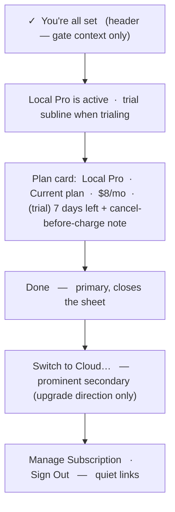
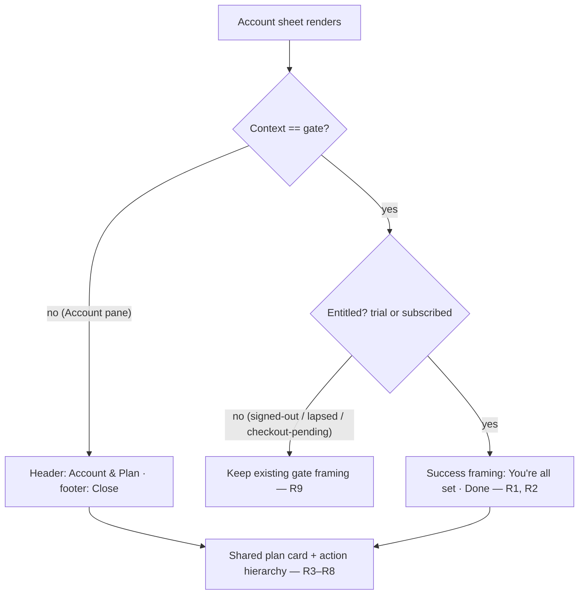

# Post-Subscribe Account Sheet Success State - Plan

## Goal Capsule

- **Objective:** When a user subscribes from the paywall gate, turn the sheet into a clear "you're all set" confirmation instead of one that still asks them to subscribe, and give its plan info and actions a real hierarchy.
- **Product authority:** Rute (rfigueiredo.dev@gmail.com).
- **Execution profile:** Standard, three units — two in the account-sheet policy/copy layer, one in the sheet view. Swift / SwiftUI under `macos/ScreenCap/`. Single `fix` PR.
- **Stop conditions:** `AccountSheetPolicyTests` green, the manual gate→subscribe→success smoke passes, and non-entitled gate states are visibly unchanged.
- **Tail ownership:** Implementer runs the macOS test scheme and the manual smoke before opening the PR.
- **Open blockers:** None. Copy wording and exact SwiftUI styling are deferred to implementation.

---

## Product Contract

**Product Contract preservation:** unchanged — this plan enriches the same requirements-only artifact; all R/F/AE IDs are preserved verbatim.

### Summary

Reorganize the already-entitled (active trial or paid subscription) rendering of the Account & Plan sheet. When that state is reached through the paywall gate — the just-subscribed-in-place moment — the header becomes a success confirmation, the scattered plan lines collapse into one card, a single **Done** button closes the sheet, and the management actions gain a hierarchy: **Switch to Cloud** prominent, **Manage Subscription** and **Sign Out** as quiet links. The card and action hierarchy also carry to the menu-bar Account pane, which renders the same content.

### Problem Frame

The sheet is a single state-adaptive surface whose header, subcopy, and dismiss label are fixed to the *entry context* at present time, while the body adapts to the account's live state. When a gated affordance opens it, the context is `gate`; the user then subscribes in place (checkout runs in the browser, entitlement resolves, the body flips to the trial/subscribed state), but the context never changes and the sheet never auto-dismisses.

The result is the screen a new subscriber actually sees: a header that says "Subscribe to keep recording" above a "Current plan: Local Pro" row, a "Not now" footer that reads as *declining* a decision already made, and a flat stack of equal-weight lines and buttons — with "Manage Subscription" referenced three times (a caption, the Switch-to-Cloud button that routes to it, and its own button). It reads as a paywall wearing the wrong outfit, not a confirmation.

### Key Decisions

- **Distinct success moment, not auto-dismiss.** Subscribing in the gate shows a visible "you're all set" confirmation the user dismisses themselves, rather than closing automatically — the user wants an explicit acknowledgment and a place the account actions live.
- **Done just closes.** The primary action dismisses and does nothing else. The gate is reachable from Start, Search, and Recall, so auto-starting "the blocked action" isn't universally correct; the user retries their action, which now succeeds.
- **Success framing is derived, not a new state.** It is `context == gate` AND the account is entitled (`trial` or `subscribed`). The gate only opens for an unentitled account, so gate-plus-entitled uniquely identifies the just-subscribed-in-place moment — no new state machine.
- **Prominent switch means upgrade only.** The cross-tier button is pushed when it's an upgrade (Local Pro → Cloud). For a Cloud subscriber the same slot would offer a downgrade to Local Pro; that is a quiet link, not the prominent button.
- **Reorganization lives on the shared entitled content.** The consolidated card and action hierarchy improve every place the trial/subscribed body renders — including the persistent Account pane — while only the success header/subcopy/Done footer stay specific to the gate moment.

### Requirements

**Success framing (gate + entitled)**

- R1. When the sheet renders in gate context for an already-entitled account (active trial or paid subscription), the header and subcopy read as a success confirmation, not "Subscribe to keep recording." The copy is **state-asserting** ("Local Pro is active"), never event-asserting ("You just subscribed") — gate+entitled is not exclusively an in-place subscribe (see KTD-1). The trial variant keeps the cancel-before-charge caveat in its **primary** subcopy, so a not-yet-charged trial user is never told they are simply "all set" with the caveat demoted to a card line alone.
- R2. In that state the primary action is a single **Done** button — prominent, taking the default-action treatment, positioned above the Switch action per the wireframe — that closes the sheet and takes no further action (it does not start or resume the gated affordance). It replaces the plain "Not now" dismiss footer; no separate bottom dismiss renders in this state.

**Plan-info consolidation**

- R3. Plan details render as one consolidated card: plan name, a current-plan indicator, and price, with no duplicated "Manage Subscription" references anywhere in the state.
- R4. The card adapts to trial vs paid: an active trial shows the days-left line and the cancel-before-charge reassurance; a paid subscription omits the trial lines.

**Action hierarchy**

- R5. "Switch to Cloud…" is a prominent secondary action when the held tier is Local Pro (the upgrade path).
- R6. The cross-tier switch is prominent only when it is an upgrade; when the held tier is Cloud (the switch would be a downgrade to Local Pro), it renders as a quiet link, not the prominent button.
- R7. "Manage Subscription" and "Sign Out" render as quiet links, visually subordinate to Done and to the Switch action.

**Shared surface**

- R8. The consolidated card (R3, R4) and the action hierarchy (R5–R7) apply wherever the entitled body renders, including the menu-bar Account pane. Only the success header/subcopy and the Done action are specific to the gate moment; the Account pane keeps its "Account & Plan" header and renders **no dismiss footer** (its embedded presentation supplies no `onDismiss`, so `dismissFooter` renders nothing — the sidebar is the way out).

**Preserve other states**

- R9. Non-entitled gate states are unchanged: signed-out keeps "Subscribe to keep recording" with the plans preview and Sign In; lapsed and checkout-pending keep their current framing.
- R10. Existing honesty gates are preserved: Sign Out stays disabled-with-reason while an upload is in flight, the neutral/offline (stale-entitlement) rendering is untouched, and the checkout-pending "unlocks automatically" surface is untouched.

**Robustness**

- R11. When an entitled account's held tier is unresolved (`tier == .none` while trialing or subscribed — a null or unrecognized tier claim), the success view falls back safely rather than rendering a "No plan" card or an undefined switch. It preserves today's guard behavior (no plan-name card, no prominent switch), the same defense the current view already applies with `if auth.tier != .none`.

### Wireframe — entitled success state (region stack)

The order is literal: **Done** is a prominent primary button in the content flow (not the shared bottom dismiss footer, which is suppressed in this state), so it sits directly above the Switch action as drawn.

### Framing derivation (which header/footer each context gets)

### Key Flows

- F1. Subscribe from the gate
  - **Trigger:** A gated affordance (menu-bar Start, New-recording, Recall) opens the sheet in gate context for an unentitled account.
  - **Steps:** User starts checkout for a tier; the browser round-trip completes; entitlement resolves and the body flips to trial/subscribed. Because the account is now entitled and the context is still gate, the sheet re-renders with the success framing in place.
  - **Outcome:** User taps Done; the sheet closes; they retry their original action, which now succeeds.
  - **Covers:** R1, R2, R3.

### Acceptance Examples

- AE1. Gate + active Local Pro trial (the reported screen). **Then:** header "you're all set"; card shows Local Pro · Current plan · $8/mo · days-left + cancel-before-charge; Done primary; Switch to Cloud prominent; Manage Subscription and Sign Out quiet links. **Covers R1–R5, R7.**
- AE2. Gate + paid Local Pro subscription. **Then:** as AE1 but the card omits the trial lines. **Covers R4.**
- AE3. Gate + Cloud subscriber. **Then:** success framing renders; the cross-tier switch ("Switch to Local Pro") is a quiet link, not the prominent button. **Covers R6.**
- AE4. Menu-bar Account pane + trial or subscribed. **Then:** the same consolidated card and action hierarchy render, but the header stays "Account & Plan" and no dismiss footer renders (the embedded pane supplies no `onDismiss`) — no success framing. **Covers R8.**
- AE5. Gate + signed-out. **Then:** unchanged — "Subscribe to keep recording", plans preview, Sign In. **Covers R9.**
- AE6. Gate + entitled with an unresolved held tier (`tier == .none`). **Then:** the success header still renders, but the body falls back to today's rendering (no plan-name card, no prominent switch) rather than a "No plan" card. **Covers R11.**

### Scope Boundaries

- Auto-dismissing the sheet on subscribe — considered, rejected in favor of a visible confirmation.
- Auto-starting or resuming the gated affordance when Done is tapped.
- Deep-linking or pre-selecting the Cloud plan inside the Stripe portal — the Switch and Manage actions continue to open the same portal.
- Reframing the non-entitled gate states (signed-out, lapsed, checkout-pending) or changing any pricing/entitlement logic.

### Outstanding Questions

Deferred to implementation:

- Exact success header/subcopy copy (e.g., "You're all set" vs "Local Pro is active") and whether the primary label is "Done" or "Continue."
- The concrete SwiftUI treatment that expresses "prominent secondary" vs "quiet link" within the sheet's existing button-style vocabulary.

### Sources

- `macos/ScreenCap/Views/Account/AccountSheetView.swift` — render tree: `header` (:117), `stateContent` (:143, trial/subscribed branch identical across contexts), `plansSection`/`tierRow` (:219), `tierSwitchButton` → `beginManage` (:270, :489), `accountActionsSection` (:401), `dismissFooter` (:469).
- `macos/ScreenCap/Views/Account/AccountSheetPolicy.swift` — state derivation (:78), `headline`/`subcopy` fixed by context (:247, :265), `dismissTitle` (:286), `tierAffordance` cross-tier `switchViaPortal` (:188), copy catalog incl. `gateHeadline`, `switchPlanDetail`, `manageSubscription`, `renderedStrings` (:295).
- `macos/ScreenCap/Views/MainWindow.swift:375` — gate sheet presentation; `onDismiss` supplied only for presented contexts; no auto-dismiss on subscribe; `context` fixed at present time.
- `macos/ScreenCapTests/AccountSheetPolicyTests.swift` — the string-assertion test pattern; existing pins `testGateContextSelectsGateFramingAccountContextNeutral`, `testGateDismissTitleIsNotNow`, `testHeldTierRendersCurrentPlanOtherTierSwitchRouted`, `testNoRenderedStringInstructsTerminalUse`.
- Reported screen = the `.trial` body rendered in `.gate` context.

---

## Planning Contract

### Key Technical Decisions

- KTD-1. Derive the success state from existing signals — no new `AccountSheetState` case and no new `AccountSheetContext`. Success framing is `context == .gate` AND state ∈ {`.trial`, `.subscribed`}. The gate only *opens* for an unentitled account (every opener gates on `isGatedForLapse`), so an entitled user can never trigger it — the safety property, that success framing is only ever shown to an actually-entitled account, always holds. It is not exclusively a just-subscribed-in-place moment, though: because the sheet observes `auth`, gate+entitled also arises when entitlement resolves out-of-band (subscribing on the web or another Mac, or a transient `.lapsed` corrected by a refresh) while the gate is open. That is why R1 constrains the copy to be state-asserting, not event-asserting. The existing state chart and its tests stay intact.
- KTD-2. Make the framing copy state-aware in the policy/copy layer, not the view. `headline`, `subcopy`, and `dismissTitle` branch on state for the `.gate` context, with `.trial` and `.subscribed` getting **distinct success subcopy** — the trial variant keeps the cancel-before-charge caveat in primary framing (R1). The new success strings live in `AccountSheetCopy` and are added to `renderedStrings`, so all rendered copy stays under the string-assertion and no-terminal (R10) audits. `dismissTitle` gains a `state` parameter (currently context-only).
- KTD-3. Express switch prominence with a small policy helper, not by splitting `TierAffordance`. A helper returns prominent when the cross-tier switch is an upgrade (held `.localPro` → Cloud) and quiet when a downgrade (held `.cloud` → Local Pro). `TierAffordance.switchViaPortal` and its existing affordance tests are left untouched; the view reads the helper to choose the button's emphasis.
- KTD-4. The card and action hierarchy live in the shared, context-independent `stateContent`, so the Account pane inherits them; only header/subcopy/dismiss vary by context. This matches the existing "context selects framing copy only" design (the file's own KTD-3) rather than forking a gate-only view.

### High-Level Technical Design

The decision boundary that units U1–U3 implement is the **Framing derivation** diagram in the Product Contract above: gate-vs-account selects header/subcopy/dismiss; entitled-vs-not selects success framing; the plan card + action hierarchy are shared below both branches. No additional component or sequence diagram is warranted — the change is two policy functions plus one view restructure.

### Assumptions

- The trial-vs-paid card content (R4) reuses existing helpers — `OnboardingCopy.trialBanner(for:)` returns trial-only banner text and `showsTrialCancelAffordance(state:)` is already true only for `.trial` — so R4 needs correct placement of those in the card, not new conditional logic.
- The Done footer is scoped to gate context because the Account pane is embedded without an `onDismiss` (so `dismissFooter` renders nothing there); the label change therefore cannot leak into the Account pane.
- "Quiet link" is a low-emphasis SwiftUI button style (e.g., `.plain` / `.borderless`) versus the app's `.borderedProminent` for the prominent Switch; exact styling is deferred to implementation.

### Sequencing

U1 and U2 are independent policy changes and can land in either order. U3 (view) depends on both.

---

## Implementation Units

### U1. Success framing in the policy/copy layer

- **Goal:** Gate + entitled renders success framing (header + subcopy) and a Done dismiss, instead of the subscribe/"Not now" gate framing.
- **Requirements:** R1, R2; preserves R9.
- **Dependencies:** none.
- **Files:** `macos/ScreenCap/Views/Account/AccountSheetPolicy.swift`, `macos/ScreenCapTests/AccountSheetPolicyTests.swift`.
- **Approach:** Add success copy to `AccountSheetCopy`: a success headline, a `.subscribed` (paid) success subcopy, a **distinct `.trial` success subcopy** that keeps the cancel-before-charge caveat in primary framing (state-asserting, never event-asserting, per R1), and the Done label. Branch `headline` and `subcopy` so that in `.gate` context with state ∈ {`.trial`, `.subscribed`} they return the success copy (trial vs paid subcopy differ); every other context/state path is unchanged (keep the existing `neutral`-first guard). Add a `state` parameter to `dismissTitle`: gate + entitled → Done, gate + other → "Not now", account/upload → "Close". Add the new strings to `renderedStrings`.
- **Patterns to follow:** the existing context/state branching in `headline`/`subcopy`; the `AccountSheetCopy` catalog + `renderedStrings` audit-list pattern.
- **Test scenarios (extend `AccountSheetPolicyTests`):**
  - `headline(.gate, .trial)` and `headline(.gate, .subscribed)` → the success headline; `headline(.gate, .lapsed)` and `headline(.gate, .signedOut)` → "Subscribe to keep recording" (unchanged). Covers AE1, AE5 / R1, R9.
  - `subcopy(.gate, .trial)` keeps the cancel-before-charge caveat and differs from `subcopy(.gate, .subscribed)`; both differ from `gateReassurance`; `subcopy(.gate, .lapsed)` → `gateReassurance` (unchanged). Assert the trial subcopy contains the pre-charge caveat and that neither success string is event-asserting.
  - `dismissTitle(.gate, .trial)` / `(.gate, .subscribed)` → "Done"; `dismissTitle(.gate, .lapsed)` / `(.gate, .signedOut)` → "Not now"; `dismissTitle(.account, …)` → "Close". Update the existing `testGateDismissTitleIsNotNow` to the new signature. Covers R2.
  - `renderedStrings` still passes `testNoRenderedStringInstructsTerminalUse` (new success strings are plain, count stays > 20).
- **Verification:** `AccountSheetPolicyTests` pass; non-entitled gate framing assertions remain green.

### U2. Upgrade-vs-downgrade switch prominence

- **Goal:** The cross-tier switch is prominent only when it is an upgrade; a downgrade renders quiet.
- **Requirements:** R5, R6, R11.
- **Dependencies:** none.
- **Files:** `macos/ScreenCap/Views/Account/AccountSheetPolicy.swift`, `macos/ScreenCapTests/AccountSheetPolicyTests.swift`.
- **Approach:** Add a policy helper that returns prominent when the held tier is `.localPro` (switch target Cloud, an upgrade), quiet when the held tier is `.cloud` (switch target Local Pro, a downgrade), and not-prominent when the held tier is `.none` (unresolved — no confident upgrade to push; see R11). Do not change `tierAffordance` or the `TierAffordance` enum — the helper is orthogonal to which tier is portal-routed.
- **Patterns to follow:** the pure-function + `heldTier`-parameter shape of `tierAffordance`.
- **Test scenarios:**
  - prominence(heldTier `.localPro`) → prominent; prominence(heldTier `.cloud`) → quiet; prominence(heldTier `.none`) → not prominent. Covers R5, R6, R11.
  - Existing `.switchViaPortal` affordance assertions (`testHeldTierRendersCurrentPlanOtherTierSwitchRouted`, `testCheckoutPendingAffordancesAndLapsedBuysBoth`) remain green (no enum change).
- **Verification:** new prominence tests pass; existing affordance tests unchanged.

### U3. Consolidated plan card + action hierarchy (entitled view)

- **Goal:** Restructure the trial/subscribed rendering into one plan card, a Done primary, a prominent Switch (upgrade only), and quiet links (Manage Subscription, Sign Out, and the downgrade Switch); remove the redundant "Plan changes happen in Manage Subscription" caption.
- **Requirements:** R2, R3, R4, R7, R8, R11; preserves R10.
- **Dependencies:** U1, U2.
- **Files:** `macos/ScreenCap/Views/Account/AccountSheetView.swift`.
- **Approach:** In the `stateContent` `.trial`/`.subscribed` branch, replace `planStatusSection` + `plansSection` + `accountActionsSection` with: the identity line, a plan card (name, current-plan badge, price, and trial-only days-left + cancel-before-charge lines), a prominent primary **Done** button (default-action treatment) placed above the Switch, the prominent Switch button when the U2 helper returns prominent, and quiet links for Manage Subscription and Sign Out (plus the Switch when the helper returns quiet). Because Done is rendered here as the primary action, suppress the shared bottom `dismissFooter` in this state so there is no duplicate dismiss. Apply `.accessibilityElement(children: .combine)` (or a composed label) to the plan card, mirroring the existing `tierRow(.currentPlan)` / `checkoutPendingSection` grouping. Keep the `if auth.tier != .none` guard: when the held tier is unresolved (R11), fall back to today's rendering (no plan-name card, no prominent switch) rather than an empty "No plan" card. Drop the `switchPlanDetail` caption. Leave the `neutral`, `lapsed`, `signedOut`, and `checkoutPending` branches unchanged, and preserve the Sign-Out-disabled-during-upload and error-seam behavior.
- **Patterns to follow:** `.borderedProminent` + `.keyboardShortcut(.defaultAction)` for the prominent Done and Switch (as `signInSection` uses for Sign In); a low-emphasis style (e.g. `.plain` / `.borderless`) for the quiet links; `.accessibilityElement(children: .combine)` for the card (as `tierRow(.currentPlan)` and `checkoutPendingSection` do); existing `identitySection`, `OnboardingCopy.trialBanner`, `currentPlanBadge`, and the `PricingCatalog` price line.
- **Execution note:** Verify visually — reach the gate, subscribe (or drive a trial/subscribed state), and confirm the success screen and the Account-pane rendering; check the Cloud-subscriber case shows a quiet "Switch to Local Pro."
- **Test scenarios:** Test expectation: none — view composition. Behavior is covered by the U1/U2 policy tests; layout correctness is verified by build + manual smoke (the app has no view-snapshot tests).
- **Verification:** app builds; gate→subscribe→success shows the card + Done + prominent Switch to Cloud + quiet Manage/Sign Out; the Account pane shows the same card under its own header/footer; an entitled user never sees "Subscribe to keep recording"; non-entitled states are visibly unchanged.

---

## Verification Contract

| Gate | What it proves | Applies to |
|---|---|---|
| ScreenCap macOS test scheme — `AccountSheetPolicyTests` | Success framing (trial vs paid subcopy distinct, state-asserting), state-aware dismiss label, switch prominence incl. the `.none` fallback, and the no-terminal sweep all hold; non-entitled framing unchanged | U1, U2 |
| App build (ScreenCap scheme) | The view restructure compiles | U3 |
| Manual smoke: gate → subscribe → success | The reported screen is fixed — success header, one card (read as a single VoiceOver stop), a prominent Done above a prominent Switch to Cloud, quiet Manage/Sign Out | U3 |
| Manual smoke: Account pane + Cloud-subscriber cases | Account-pane parity (AE4); downgrade Switch is quiet (AE3) | U3 |

Run the policy tests through the existing macOS test scheme rather than a generic "run tests" — the account-sheet suite is the authoritative gate for this change. No `release:validate` needed; this is a UI-layer fix with no packaging or migration surface.

---

## Definition of Done

- R1–R11 satisfied; AE1–AE6 hold.
- `AccountSheetPolicyTests` updated and green — the reworked `dismissTitle` test, distinct trial-vs-paid success subcopy assertions (trial keeps the pre-charge caveat, neither is event-asserting), and switch-prominence assertions including the `.none` fallback; the no-terminal sweep still passes.
- Manual smoke confirms the gate→subscribe→success screen, Account-pane parity, and the Cloud-subscriber quiet-Switch case.
- The plan card reads as a single VoiceOver element; Done takes the primary/default-action treatment above Switch; the entitled-but-unresolved-tier case (R11) renders the safe fallback, not a "No plan" card.
- Non-entitled gate states and the existing honesty gates (Sign-Out-during-upload, neutral/offline, checkout-pending) are unchanged — no regression.
- No duplicated "Manage Subscription" reference remains in the entitled view; the now-unused `switchPlanDetail` caption is removed rather than left dead.
- Shipped as a single `fix` PR.
