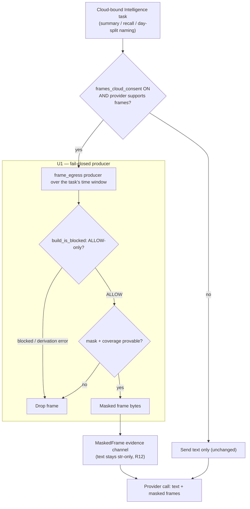

# Screen Frames to Connected Model - Plan

## Goal Capsule

- **Objective:** Ship a default-off capability that sends *masked* screen frames to the Intelligence model the user has connected, extending summaries, recall answers, and day-split with visual understanding the text path can't deliver — without breaching the "blocked apps never leave" boundary.
- **Product authority:** Product owner, via the SCR-272 brainstorm ([SCR-272](https://linear.app/zk-email/issue/SCR-272/brainstorm-should-screen-frames-or-images-become-a-user-facing-toggle)). Product Contract unchanged by planning.
- **Inviolable rule (authority over all implementation convenience):** the structural boundary is fail-closed and provable — a blocked-app frame is never sent, and a frame whose ALLOW eligibility cannot be derived is withheld. Residual masking *within* an ALLOW frame is best-effort OCR, not a proof of complete masking; the consent copy and `SECURITY.md` say so plainly rather than overclaiming. The `TaskKind.FRAMES → ExecutionTarget.NEVER` guard stays verbatim.
- **Execution profile:** Deep, privacy-critical. ~7 units across Python (segmentation, redaction, config, CLI) and Swift (settings, review UI), plus `SECURITY.md`. The privacy CI lane (`pytest -m privacy`) is the enforcing gate.
- **Tail ownership:** PR opened; privacy lane green.

---

## Product Contract

_Product Contract unchanged by planning; enrichment added the Planning Contract, Implementation Units, Verification Contract, and Definition of Done below._

### Summary

Add a default-off capability that sends masked screen frames to the Intelligence model the user has connected, so summaries, recall answers, and day-split can use visual understanding the text-only path loses. Frames leave only after non-`ALLOW` (blocked, masked, secure-field, excluded) frames are skipped and residual sensitive regions are masked, fail-closed. The switch is independent of whether a model is connected, and the guarantee a user gets depends on whether their connected model runs locally or in the cloud.

### Problem Frame

Screen frames are the most sensitive data ScreenCap holds. Masking, per-app blocking, the encrypted vault, and `masked_video_upload` (default off) all exist to keep pixels from leaving, and "nothing leaves" is the pitch. Today that promise is airtight for cloud models: the one code path that used to send screenshots (the legacy auto-namer) was deleted, so the segmentation `FRAMES → NEVER` guard is now the *only* thing governing frame egress. The Intelligence pane reflects this — "Screen frames or images → Always off" renders as a fixed badge, not a toggle.

The text path (app and window titles plus transcript snippets) carries a lot, but it loses what the pixels hold: the shape of a dashboard trend, a red error state, the structure of a diagram or mockup. The product owner wants to close that gap so the connected model can reason over what the operator actually saw.

The cost is that this is the one boundary the product is built around. Making it user-flippable turns "we never send your screen" into "we don't, unless you turned it on" — and the team then owns every trust and support conversation about people who enabled it and forgot. This capability is the first thing that would ever breach an otherwise-absolute promise, so the honesty of the consent and the copy is load-bearing, not cosmetic.

### Key Decisions

- **Full breadth across Intelligence tasks.** Frames are available to summaries, recall answers, and day-split alike — not a narrow per-query wedge. This accepts background and bulk frame egress (day-summaries run without a human reviewing each frame) and the larger masking surface it creates, in exchange for the strongest value across the operator's use cases.
- **Destination is the user's connected model (BYO).** Frames go to whatever Intelligence model the user has configured, matching how the rest of Intelligence already works. This is what makes the promise defensible: frames go to the model the user connected, under their own account — not to a ScreenCap-hosted destination.
- **The guarantee is destination-dependent.** When the connected model resolves on-device, no frame attaches and nothing leaves the Mac — the "nothing leaves" promise stays fully intact for that user (on-device *understanding* of frames by a local vision model is follow-up). When it runs in the cloud, masked frames egress under the user's own account. The path is destination-agnostic; the destination decides the guarantee, the same pattern the recording pipeline already uses.
- **Two-tier guarantee: structural blocked-app boundary, best-effort residual masking.** The blocked-app boundary is structural and provable — only `ALLOW`-classified frames are eligible (`build_is_blocked`, fail-closed on any derivation gap), so a blocked-app frame is never sent. Residual masking *within* an ALLOW frame is best-effort OCR — it can miss content OCR does not detect — and is labeled as such, never as a coverage guarantee. Only the structural tier mirrors `masked_video_upload`'s provable gate; the residual tier does not, because OCR gives no positive coverage proof the way window geometry does.
- **Default off, independently gated.** The frames switch is off by default and orthogonal to "is a model connected" and to the sibling "cloud tasks run by default" work. Neither connecting a model nor those default-on cloud tasks may start frame egress on their own.
- **Honest copy ships with the capability.** The "never sends screen images" line becomes conditional the moment this exists. The consent surface and the copy are reconciled to the runtime state as part of this work (the honesty-gate), not deferred until after the flag flips.

### Requirements

**Capability and scope**

- R1. Frames can be sent to the user's connected Intelligence model for three task kinds: summaries, recall answers, and day-split.
- R2. The capability rides whatever model the user has connected; it introduces no ScreenCap-hosted frame destination.
- R3. When the connected model resolves on-device, no frame attaches and no frame bytes leave the Mac. On-device *frame understanding* by a local vision model is follow-up work; day one, a local model receives no frames.

**Consent and gating**

- R4. Frame egress is off by default.
- R5. The frames switch is independent of whether a model is connected and of the sibling "cloud tasks run by default" behavior; neither enables frame egress on its own.
- R6. Enabling it requires explicit opt-in that discloses, at decision time, what leaves: masked frames of `ALLOW`-only activity, sent to the user's connected model.
- R7. The consent and redaction-review surface states that masked frames are sent before egress can be enabled, reconciling the current "local-only, not uploaded" framing.

**Masking guarantee**

- R8. Only `ALLOW`-classified frames are eligible; every frame overlapping a blocked, masked, secure-field, or excluded interval is skipped, reusing the existing content-index skip set.
- R9. Residual sensitive regions within eligible ALLOW frames are masked best-effort before egress via the OCR redaction pipeline. This is not a proof of complete masking — OCR under-detection is possible — and no surface claims it is.
- R10. A frame is withheld (fails closed) whenever its ALLOW eligibility cannot be derived (missing or partial `recording.db`) or masking raises. These withhold conditions are structural and provable; they are not a claim that OCR caught every sensitive region.
- R11. Frame egress reuses the existing image-redaction and mask pipeline as its enforcement gate rather than adding a parallel egress path.

**Positioning and copy**

- R12. The "never sends screen images" copy is replaced with state-keyed copy that is true in each state (off vs on) and bound to the runtime setting.
- R13. No claim asserts frames are "never" sent once the capability exists; claims are scoped to the actual runtime state.

### Key Flows

- F1. Enabling frame egress (opt-in)
  - **Trigger:** User opens Intelligence settings and turns on the frames switch.
  - **Steps:** The disclosure of what leaves is shown; the user confirms; the switch persists off → on.
  - **Outcome:** Subsequent eligible frames may be sent to the connected model. Nothing is sent for recordings while the switch is off.
  - **Covers:** R4, R6, R7.
- F2. A frame reaching a cloud model
  - **Trigger:** A summary, recall, or day-split naming task runs with frames enabled and a cloud model connected.
  - **Steps:** Candidate frames are selected; non-`ALLOW` frames are skipped; residual regions are masked; coverage is proven or the frame fails closed; the masked frame is sent.
  - **Outcome:** Only masked `ALLOW` frames reach the model; anything unprovable is withheld.
  - **Covers:** R8, R9, R10, R11.

### Acceptance Examples

- AE1. **Covers R5.** Given a user connects a cloud model and "cloud tasks run by default" is active, When the frames switch is off, Then no frame bytes are sent for any task.
- AE2. **Covers R8, R10.** Given a summary task with frames enabled, When a candidate frame overlaps a blocked-app interval, Then that frame is skipped and not sent.
- AE3. **Covers R3.** Given the connected model resolves on-device, When frames are enabled, Then no frame attaches (`frames_may_attach` is false) and nothing leaves the Mac.
- AE4. **Covers R10.** Given a frame whose ALLOW eligibility cannot be derived (missing or partial `recording.db`), When the egress gate evaluates it, Then it fails closed and is withheld.

### Scope Boundaries

**Deferred for later**

- Frame-level agent replay and spatial grounding — valued by the product owner, but it belongs to the data-flywheel product surface and likely wants to stay local; not part of this capability.

**Outside this product's identity**

- Sending raw or unmasked pixels — never, in any state.
- A ScreenCap-hosted frame destination — frames only ever go to the user's own connected model.

**Deferred to follow-up work**

- Vision wiring for Anthropic and OpenAI backends — day one supports Gemini (its SDK takes image parts cleanly); other vision-capable providers follow the same capability seam later.
- On-device *frame understanding* by a local vision model — day one, a local (`ON_DEVICE`-resolved) model receives no frames; wiring a local multimodal provider so frames are understood on-device without leaving the Mac is follow-up.

### Dependencies / Assumptions

- Depends on the image-redaction and mask pipeline being able to enforce masked-frame egress fail-closed for still frames. The pipeline masks screenshots locally during scrub and masks video for cloud upload today; producing a masked still frame to hand to a model is a new use of it (U1).
- Inherits the `masked_video_upload` consent-surface prerequisite: the redaction-review "what leaves" surface must be reconciled before enabling (U7).
- Assumes the connected-model (BYO) architecture is the destination; local-model execution is what preserves the intact promise for local users.
- Value is inferred from plausible use cases, not observed demand — no user has yet been observed hitting the text-path ceiling.

### Success Criteria

- Frame-level understanding is available across summaries, recall, and day-split with zero blocked-app pixels leaving, holding `STRATEGY.md`'s near-zero privacy-incident bar.
- Users can tell, at the moment they enable it and afterward, exactly what leaves — the consent copy reads true in every state.
- A validation signal shows frame-level understanding moves a real workflow the text path couldn't — run alongside the build, not gating it.

### Outstanding Questions

Nothing blocks implementation. The following are deferred to implementation or follow-up.

**Deferred to implementation**

- The concrete value-validation metric — what signal counts as "frame-level understanding moved a workflow" and how it is instrumented. It runs alongside and does not gate.
- The exact frame-selection density per task window (how many masked frames to send, and dedup threshold) — tune during implementation against provider payload limits.

---

## Planning Contract

### Key Technical Decisions

- KTD1. **Independent consent gate; `FRAMES → NEVER` preserved verbatim.** Add a `frames_cloud_consent` gate (default off) that is checked *after* a task already resolves to `CLOUD`, layered on the existing per-task resolution. Do not modify the `TaskKind.FRAMES → NEVER` branch (`consent.py:148-149`) — it keeps meaning "frames are never a standalone payload." Alternative considered: a new `MASKED_FRAMES` TaskKind resolving to CLOUD; rejected because a layered gate leaves the audited `FRAMES → NEVER` invariant untouched and is a smaller change.
- KTD2. **Frames ride only existing cloud-bound text egress points.** A task attaches frames only where its text already egresses to a cloud model. A fully on-device setup never sends a frame; the frames toggle is inert until a cloud model is connected. This bounds the masking surface to exactly the frames tied to already-leaving text and prevents a new egress path.
- KTD3. **Day-split's cloud touch is the SUMMARY-fallback naming path.** Day-split boundary computation is on-device/heuristic and never resolves `CLOUD` (`degrade.resolve_day_split` asserts it). The only cloud touch is `terminal_stage._summary_cloud_fallback`, which names a session via the SUMMARY task. Frames attach there, never to boundary computation.
- KTD4. **ALLOW-only, fail-closed eligibility reuses `frame_blocked.build_is_blocked`.** This is the one ready-made seam — it re-derives the block set with `derive_skip_intervals(require_canonical=True)` and fails closed to "all blocked" on any error. Frame-egress eligibility (R8/R10) calls it directly rather than re-implementing the skip logic.
- KTD5. **Masked-still production returns bytes; it never rewrites the local original.** `masking.mask_screenshot` and `scrubber.mask_screenshots` only mask in place / over a copied tree. Add a mask-to-bytes variant so the local unmasked still is preserved while a masked copy is produced for egress (U1).
- KTD6. **Multimodal is a per-provider capability; Gemini first; unsupported providers silently omit frames.** Providers advertise a `supports_frames` capability (default false). When false — Anthropic, OpenAI, on-device text, CLI backends today — the task sends text only and never fails. Gemini attaches image parts to its `contents` call.
- KTD7. **Masked frames travel a typed, masked-verified channel on both provider paths; `Evidence.text` stays str-only.** Carry masked frames on the recall `Evidence.answer` channel *and* the `provider.segment(...)` channel used by summary/day-split — extend both signatures rather than routing frames through the untyped `activity_summary` dict, so all three task kinds share one guarded channel. A builder-only guard (mirroring the enforced AST/call-graph guard the codebase already uses for `Evidence(stripped=True)`, KTD11) pins `MaskedFrame(masked=True)` construction to U1's producer and defaults `masked` to `False`, so an unmarked frame cannot ride on either channel — the invariant is enforced structurally, not by a trust-me boolean. The `Evidence.text must be a str` guard (R12) is untouched.
- KTD8. **State-keyed honesty copy.** All "what leaves" surfaces (the redaction-review window, the Intelligence trust footer, `SECURITY.md`) bind to the runtime `frames_cloud_consent` state — true when off, disclosing exactly what leaves when on — mirroring the `masked_video_upload` reconciliation posture.

### High-Level Technical Design

Frames augment an already-cloud-bound task; they never create a new egress. The gate is fail-closed at every branch:

### Assumptions

- Provider SDKs that advertise `supports_frames` accept masked JPEG bytes as inline image parts (verified for Gemini's `contents=[text, image_part]`; other providers stay text-only until wired).
- Frame-selection scope tracks the text already being sent: the session window for summary/day-split, and the retrieved snippets' individual timestamps (not their span) for recall — so no frame ships for a moment whose text was not.

### Sequencing

- **Phase A — enforcement core:** U1 (fail-closed producer), U2 (consent gate). Independent; can run in parallel.
- **Phase B — evidence + provider:** U3 (evidence channel, depends on U1), U4 (provider capability, depends on U3).
- **Phase C — task wiring:** U5 (attach at egress points, depends on U1–U4).
- **Phase D — UI + copy:** U6 (Swift toggle, depends on U2), U7 (copy reconciliation, depends on U6; draftable in parallel).

---

## Implementation Units

### U1. Frame-egress eligibility + masked-still producer

- **Goal:** Given a recording directory and a time window, return a fail-closed set of masked frame bytes eligible to leave — ALLOW-only, sensitive regions masked, coverage-provable — without touching the local originals.
- **Requirements:** R8, R9, R10, R11.
- **Dependencies:** none.
- **Files:**
  - `src/screencap/segmentation/frame_egress.py` (new) — the producer.
  - `src/screencap/redaction/masking.py` — add a mask-to-bytes (or mask-to-new-path) variant that does not rewrite the source.
  - Reuse `src/screencap/frame_blocked.py` (`build_is_blocked`), `src/screencap/backfill/skip_intervals.py` (`derive_skip_intervals(require_canonical=True)`), and `src/screencap/scrubber.py` (`ocr_mask_screenshot` region detection).
  - `tests/redaction/test_frame_egress.py` (new).
- **Approach:** For each candidate frame timestamp in the window, call `build_is_blocked(recording_dir, frame_tss)` and drop every blocked frame (fail-closed: any derivation error → all blocked). For survivors, load the local still and produce a masked copy via the new mask-to-bytes producer (reuse `scrubber.ocr_mask_screenshot` region detection plus `masking.mask_screenshot`'s paint logic, writing to a buffer, not the source). Drop any frame whose ALLOW eligibility can't be derived (fail-closed) or whose masking raises; residual OCR masking is best-effort and is not treated as a coverage proof. Dedup near-identical consecutive frames. Return masked bytes plus timestamps; never mutate `screenshots/*.jpg`.
- **Execution note:** Write the fail-closed privacy tests first — assert that a derivation error yields zero eligible frames before wiring the producer.
- **Patterns to follow:** `index_core.index_range` time-scoping and `_skipped` filtering; `frame_blocked`'s fail-closed fallback to "all blocked".
- **Test scenarios:**
  - Covers AE2. A frame overlapping a blocked-app interval is excluded from the output.
  - Covers AE4. When `derive_skip_intervals(require_canonical=True)` raises (missing/partial `recording.db`), the producer returns zero frames — never the raw frame.
  - An ALLOW frame with a sensitive region returns masked bytes, and the on-disk original is byte-identical afterward (no in-place mutation).
  - A frame whose masking raises is dropped, not sent raw.
  - Near-identical consecutive frames collapse via dedup so egress volume is bounded.
- **Verification:** `pytest -m privacy` proves the fail-closed default and the no-in-place-mutation invariant.

### U2. Frames consent model (config + resolution + CLI row)

- **Goal:** Add `frames_cloud_consent` (default off) as an independent, writable consent gate, leaving `TaskKind.FRAMES → NEVER` verbatim.
- **Requirements:** R2, R4, R5.
- **Dependencies:** none.
- **Files:**
  - `src/screencap/config.py` — add `get_frames_cloud_consent()` (env `SCREENCAP_FRAMES_CLOUD_CONSENT` > `[intelligence].frames_cloud_consent` > `False`, via `_parse_intelligence_bool`); add `frames_cloud_consent` to `_CLOUD_CONSENT_ROWS`.
  - `src/screencap/segmentation/consent.py` — add `frames_cloud_consent: bool = False` to `ConsentPolicy`, wire it in `from_config`, and add a helper (e.g. `frames_may_attach(policy, resolved_target)`) returning true only when `resolved_target is CLOUD and policy.frames_cloud_consent and policy.cloud_provider is not None`. Do not touch the `FRAMES → NEVER` branch.
  - `src/screencap/cli/__init__.py` — move `frames_cloud_consent` out of `_FORBIDDEN_CLOUD_ROWS`; emit its live value in the `settings intelligence --json` envelope instead of the hardcoded `False`.
  - `tests/test_frames_consent.py` (new).
- **Approach:** The gate is orthogonal to the task's own cloud resolution — it can only *narrow* egress (frames never ride a non-cloud task), never widen it.
- **Test scenarios:**
  - Default: `get_frames_cloud_consent()` is `False` with no env or config.
  - `frames_may_attach` is `False` when a task resolves `ON_DEVICE`/`NEVER` even with consent on.
  - Covers AE1. With `frames_cloud_consent` off, `frames_may_attach` is `False` even when a cloud provider is connected and summary/recall resolve `CLOUD`.
  - Regression: `resolve(TaskKind.FRAMES, ...)` returns `NEVER` in every config (the `FRAMES → NEVER` invariant).
  - CLI round-trip: setting the frames row persists to config and reads back; `--json` reflects it.
- **Verification:** `pytest -m privacy` green; the `FRAMES → NEVER` regression test passes unchanged.

### U3. Multimodal evidence channel

- **Goal:** Carry masked frame bytes to providers through a typed, masked-verified channel on both the `Evidence.answer` (recall) and `provider.segment(...)` (summary/day-split) paths, keeping `Evidence.text` str-only.
- **Requirements:** R1, R9.
- **Dependencies:** U1.
- **Files:**
  - `src/screencap/segmentation/generation.py` — add a typed `MaskedFrame` (bytes plus a `masked: bool` marker defaulting to `False`) and an optional `masked_frames` field on `Evidence`; add a guard rejecting any frame not marked masked, parallel to the R12 text guard. Keep `text: str` and its guard.
  - `src/screencap/segmentation/provider.py` — extend `LLMProvider.segment` and `GenerationProvider.answer` to accept optional masked frames under the same guard, so summary/day-split (which use `segment(dict)`, not `Evidence`) are covered — not only recall's `Evidence`.
  - `tests/segmentation/test_generation.py` — extend the existing `Evidence(stripped=True)` builder AST/call-graph guard (KTD11) to also pin `MaskedFrame(masked=True)` construction to U1's producer module.
  - `tests/test_evidence_frames.py` (new).
- **Approach:** Only U1's producer constructs `MaskedFrame(masked=True)`; the guard raises on any unmarked frame on either channel, so unmasked bytes cannot ride. The builder guard makes this structural rather than a self-asserted boolean.
- **Test scenarios:**
  - Text-only evidence still works; non-str `text` still raises (R12 unchanged).
  - Constructing evidence or a segment input with an unmarked frame raises (masked-only invariant).
  - A `MaskedFrame(masked=True)` constructed outside U1's producer module is rejected by the builder guard.
  - Both channels (`Evidence.answer` and `segment`) carry masked frames plus text.
- **Verification:** unit tests green; the R12 guard test and the extended builder-guard test both pass.

### U4. Provider multimodal capability (Gemini) + graceful omission

- **Goal:** Let a vision-capable provider receive masked frames; providers without image support omit frames and still send text, never failing.
- **Requirements:** R1, R2.
- **Dependencies:** U3.
- **Files:**
  - `src/screencap/segmentation/provider.py` and `src/screencap/segmentation/generation.py` — add a `supports_frames` capability signal to the provider protocols (default `False`).
  - `src/screencap/segmentation/providers/gemini.py` — when masked frames are present (on either the `answer` or `segment` channel) and capability is on, attach image parts to `contents=[prompt, *image_parts]` in `_call_gemini` / `_answer_gemini`; otherwise text-only as today.
  - `tests/test_provider_frames.py` (new).
- **Approach:** The wiring unit (U5) asks the provider `supports_frames`; if false it never builds frame evidence for that call. No local provider advertises `supports_frames` on day one — a local model resolves `ON_DEVICE` and receives no frames (R3's negative guarantee); wiring a local vision provider is follow-up.
- **Test scenarios:**
  - A non-multimodal provider given masked-frame evidence sends text only and does not raise (graceful omission).
  - The Gemini backend with masked frames builds a multimodal `contents` payload — assert image parts are present with a mocked client (no network).
  - The `supports_frames` flag defaults `False` for every existing provider.
- **Verification:** unit tests green with mocked clients — no network, Vision-free.

### U5. Attach masked frames at cloud-bound task egress points

- **Goal:** Where a task resolves to `CLOUD`, the frames gate is on, and the provider supports frames, build U1's masked-frame evidence for that task's window and pass it to the provider.
- **Requirements:** R1, R2, R3, R5, R8, R9, R10, R11.
- **Dependencies:** U1, U2, U3, U4.
- **Files:**
  - `src/screencap/recall/dispatch.py` and `src/screencap/segmentation/recall.py` — recall-answer path: after `resolve(RECALL_ANSWER)` is `CLOUD` and `frames_may_attach`, build masked frames for the **retrieved ALLOW snippets' individual timestamps** (not their [min, max] span, so un-retrieved moments aren't swept in) and attach via the `answer` frame channel. Extend `assert_cloud_payload_bounded` to also vet that channel — every frame must carry U1's masked-verified marker — so recall's whole-payload bound covers frames, not only text.
  - `src/screencap/terminal_stage.py` — `_summary_cloud_fallback` (summary and day-split naming) and `_run_local_segmentation`: after the SUMMARY task resolves `CLOUD` and `frames_may_attach`, build masked frames for the session window and attach via the extended `segment` frame channel (U3), threading `recording_dir` and the window from `_run_local_segmentation` into `_summary_cloud_fallback`.
  - `tests/test_frame_attach_paths.py` (new).
- **Approach:** Frames are built only at these existing cloud-bound points, using the same window whose text is already being sent (KTD2). The DAY_SPLIT boundary computation never resolves `CLOUD` and never builds frame evidence (KTD3). A locally-connected model resolves `ON_DEVICE`, so `frames_may_attach` is false and no frame is built — the R3 negative guarantee.
- **Execution note:** integration-style test — a cloud-resolved summary with the gate on and a Gemini provider yields a provider call carrying masked frames; the same with the gate off carries none.
- **Test scenarios:**
  - Covers AE1. Gate off + cloud provider connected + cloud-tasks-default-on: the provider call carries zero frames.
  - Gate on + Gemini + a recording with ALLOW frames: the provider call carries masked frames scoped to the task window.
  - Gate on + a blocked-app-only window: the provider call carries text only (U1 yielded zero frames).
  - Regression: the day-split boundary path builds no frame evidence.
  - Gate on + a non-vision provider: text only, no error.
  - Covers AE3. Gate on + a locally-connected (`ON_DEVICE`-resolving) model: `frames_may_attach` is false, the provider call carries zero frames, nothing leaves the Mac.
  - Recall: the frame set covers only the retrieved snippets' timestamps, not un-retrieved moments within their span.
  - Recall: `assert_cloud_payload_bounded` rejects a frame lacking U1's masked marker.
- **Verification:** `pytest -m privacy` plus the segmentation tests green.

### U6. Frames consent toggle (Swift Intelligence settings)

- **Goal:** Turn the fixed "Always off" frames row into an interactive, default-off toggle wired to the existing consent write seam, with a decision-time disclosure of what leaves.
- **Requirements:** R4, R6.
- **Dependencies:** U2.
- **Files:**
  - `macos/ScreenCap/Views/Settings/IntelligenceSettingsView.swift` — replace the frames `fixedRow` (lines ~631-636) with an interactive toggle row bound to the frames consent state.
  - `macos/ScreenCap/Controllers/IntelligenceController.swift` — wire `setConsent(row: "frames_cloud_consent", enabled:)` (the existing, currently-unwired seam at ~219-245) and read the value from `settings intelligence --json`.
  - `macos/ScreenCap/Views/Settings/IntelligenceSelectionModel.swift` — update `framesRowCaption` / chip for on/off states and add the disclosure copy naming what leaves (masked, ALLOW-only frames, to the connected model).
- **Approach:** Default off. Toggling on presents the consequence disclosure before persisting, mirroring the consent posture used for consequential choices elsewhere (SCR-235 / `masked_video_upload`). Persist via the CLI subprocess seam.
- **Test scenarios:**
  - The toggle defaults off on a fresh install.
  - Toggling on writes `frames_cloud_consent=true` via the CLI seam and reflects back on reload.
  - The disclosure is shown before the first enable.
  - Test expectation: UI-state assertions where the Swift test target supports them; otherwise verified via the app build/test track.
- **Verification:** app builds; the toggle round-trips to config.

### U7. "What leaves" copy + consent-surface reconciliation

- **Goal:** No surface claims frames "never" leave once the toggle exists; copy is state-keyed and reads true in each state; the redaction-review window, the trust footer, and `SECURITY.md` are reconciled.
- **Requirements:** R7, R12, R13.
- **Dependencies:** U6.
- **Files:**
  - `macos/ScreenCap/Views/Review/ReviewWindow.swift` (label ~426), `macos/ScreenCap/Views/Review/ReviewWindowViewModel.swift` (~201), `macos/ScreenCap/Views/Review/ScreenshotTruthPane.swift` (~77) — update the "local-only, not uploaded" framing to reflect that masked frames may be sent when the toggle is on.
  - `macos/ScreenCap/Views/Settings/IntelligenceSelectionModel.swift` — make `consentTrustFooter`, the frames caption, **and the per-task captions that currently assert "Never screen images"** (`summaryConsentRowCaption`, `recallConsentRowCaption`, `daySplitRowCaption`, ~lines 222/227/233) state-keyed; update their pinning honesty-gate assertions (`IntelligenceSettingsTests.swift` ~515-523) so the "Never screen images" expectation holds only in the toggle-off state.
  - `SECURITY.md` — add the masked-frames "what leaves" boundary section: the blocked-app boundary is structural/provable (mirrors `masked_video_upload`), while residual within-frame masking is **best-effort OCR, not a coverage guarantee** — distinct from `masked_video_upload`'s geometry-based provable gate; default off.
- **Approach:** Copy binds to the runtime `frames_cloud_consent` state (honesty-gate). Off → "frames not sent" stays true and is shown; on → the copy names exactly what leaves — *best-effort masked* frames of ALLOW-only activity, not a guarantee of complete masking.
- **Test scenarios:**
  - The off state renders a truthful "frames not sent" claim; the on state renders the "masked frames sent to your connected model" disclosure (string-gate test, mirroring existing honesty-gate tests).
  - No absolute "never" claim survives in the on state.
  - Test expectation: copy/string-gate tests where the honesty-gate harness exists; `SECURITY.md` is doc-only.
- **Verification:** honesty-gate string tests green; `SECURITY.md` updated.

---

## Verification Contract

- **Privacy lane (the enforcing CI gate):** `PYTHONPATH=src pytest -m privacy`. Every new fail-closed guard (U1, U2, U5) must be covered here, `@pytest.mark.privacy`, and **Vision-free** — CI runs only this lane for privacy guarantees, and guards gated behind environment-only markers silently rot (see Sources). Run with `PYTHONPATH=src` in this worktree so the editable install resolves to the right source.
- **Full suite:** `PYTHONPATH=src pytest tests/` for the segmentation, config, and provider units.
- **Lint:** `ruff check src/screencap/engine/` (engine sub-package only).
- **Swift (U6, U7):** verify via the app build/test track. Do not launch `xcodebuild test` from this `~/Documents` worktree — it TCC-bricks the session at launch time; use compile-only verification on a `/private/tmp` copy per the app build/test track.
- **Invariant regression:** the `TaskKind.FRAMES → NEVER` test must pass unchanged, proving the layered gate did not weaken the audited guard.

---

## Definition of Done

**Global**

- All seven units land; abandoned or experimental code from approaches that did not pan out is removed.
- Frame egress is proven fail-closed in the privacy lane: a derivation failure yields zero eligible frames, and no blocked-app frame can be produced — the structural boundary (U1, U5). Residual within-frame masking is honestly labeled best-effort; no surface claims OCR proves complete masking (U7).
- Default-off is proven: with the toggle off, connecting a cloud model and the sibling cloud-tasks-default-on behavior send zero frames (AE1).
- No surface claims frames are "never" sent once the toggle exists; copy is state-keyed and true in each state (U7).
- The frames toggle round-trips Swift ↔ CLI ↔ config, default off (U6, U2).
- `SECURITY.md` documents the masked-frames "what leaves" boundary.

**Per unit**

- Each unit's test scenarios pass, and each feature-bearing unit's privacy-relevant scenarios run in the `pytest -m privacy` lane.

---

## Sources / Research

- Consent gate: `src/screencap/segmentation/consent.py` — `TaskKind`/`ExecutionTarget` (49-80), `ConsentPolicy`/`from_config` (83-125), `resolve()` with the `FRAMES → NEVER` guard (148-149).
- Config accessors: `src/screencap/config.py` — `_parse_intelligence_bool` (866-882), `get_summary_cloud_consent`/`get_recall_cloud_consent` (910-947), `get_masked_video_upload_enabled` (1116-1139), `_CLOUD_CONSENT_ROWS` (1032), `_write_intelligence_key` (1088-1108).
- CLI chokepoint: `src/screencap/cli/__init__.py` — `_FORBIDDEN_CLOUD_ROWS` (4185), the frames hard-reject (4264-4271), the `--json` builder (3936-3948).
- Text-only evidence guard: `src/screencap/segmentation/generation.py` — `Evidence` and the R12 guard (54-73); `GenerationProvider` protocol (80-92).
- Provider backends (text-only today): `src/screencap/segmentation/providers/gemini.py` (`contents=` attach point 201-209, 263-267), `anthropic.py` (text-only, 19-24).
- Task execution paths: `src/screencap/terminal_stage.py` — `_run_local_segmentation` (996), `_summary_cloud_fallback` (1238-1308), `CloudCopyProducer` (396-473); `src/screencap/segmentation/degrade.py` — `resolve_day_split` asserts DAY_SPLIT never CLOUD (119-138); `src/screencap/recall/dispatch.py` (recall resolve 390), and recall's whole-payload egress bound `assert_cloud_payload_bounded` (~185-272) that the frame channel must extend.
- Provider protocols (text-only today): `src/screencap/segmentation/provider.py` — `LLMProvider.segment(activity_summary: dict)` (82-93), the summary/day-split channel that must be extended to carry masked frames.
- Builder-guard precedent: `tests/segmentation/test_generation.py` — the enforced `Evidence(stripped=True)` AST/call-graph guard (KTD11) the `MaskedFrame` provenance guard mirrors.
- ALLOW-only fail-closed eligibility (the reusable seam): `src/screencap/frame_blocked.py` — `build_is_blocked` (48-137); `src/screencap/backfill/skip_intervals.py` — `derive_skip_intervals(require_canonical=True)` (260+), `CanonicalDerivationError` (112); `src/screencap/index_core.py` — `index_range` skip filtering (126-235).
- Masking primitives: `src/screencap/redaction/masking.py` — `mask_screenshot` (in-place, 78-152); `src/screencap/scrubber.py` — `ocr_mask_screenshot` returns regions (1551), `mask_screenshots` batch (1736); `src/screencap/redaction/ocr.py` — Vision OCR (35-90).
- Swift UI + persistence: `macos/ScreenCap/Views/Settings/IntelligenceSettingsView.swift` (`fixedRow` frames row 631-636, `infoRow` 652+), `macos/ScreenCap/Views/Settings/IntelligenceSelectionModel.swift` (frames strings 240-250), `macos/ScreenCap/Controllers/IntelligenceController.swift` (`setConsent` write seam 219-245).
- "What leaves" surfaces: `macos/ScreenCap/Views/Review/ReviewWindow.swift` (426), `ReviewWindowViewModel.swift` (201), `ScreenshotTruthPane.swift` (77); `SECURITY.md` — `masked_video_upload` precedent + outstanding consent-surface reconciliation (59-75).
- Institutional learning: `docs/solutions/workflow-issues/privacy-guards-deselected-on-ci-silently-rot-2026-06-10.md` — privacy guards gated behind environment-only markers silently rot on CI; the new frame-egress guards must live in the enforced privacy lane.
- Sibling work (preserves the `FRAMES → NEVER` guard verbatim): `docs/plans/2026-07-16-001-feat-cloud-tasks-run-by-default-plan.md`.
- Product positioning: `STRATEGY.md` — "win on privacy"; privacy incidents per 1k recordings held near zero.
