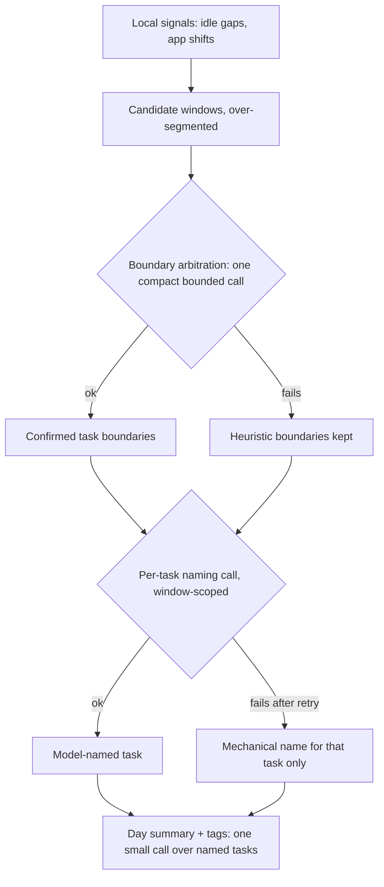
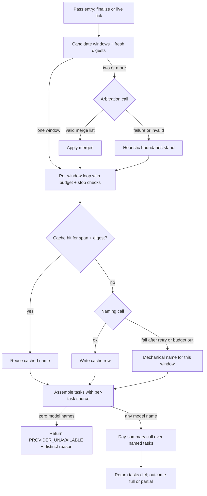

# Heuristic-First On-Device Segmentation - Plan

## Goal Capsule

- **Objective:** On-device day-split segmentation produces model-named tasks for recordings of any length by replacing the single day-sized guided-generation call with bounded, window-scoped model calls over heuristic-proposed boundaries.
- **Product authority:** The Product Contract below (from the SCR-275 brainstorm, 2026-07-17). The Planning Contract governs the technical approach; repo conventions (CLAUDE.md, SECURITY.md) override where they conflict.
- **Execution profile:** Two-track change — Python (`src/screencap/segmentation/`, `src/screencap/terminal_stage.py`, `src/screencap/pipeline_state.py`) plus Swift (`macos/IntelligenceHelper/main.swift`, honest-status surface in `macos/Screencap/`). Swift helper behavior is verified Python-side via the fake-helper pattern plus a manual macOS-26 eval; Swift builds are compile-only from this worktree.
- **Open blockers:** The R11-strip orphan-flagging fix (branch `claude/apple-intelligence-naming-segmentation-0ad808`, one commit) must merge before or with this work — without it, activity summaries come back empty and no segmentation runs at all.
- **Stop conditions:** Surface as a blocker rather than guessing if FoundationModels behavior deviates from the documented contract this plan relies on (fresh-session-per-call isolation, `maximumResponseTokens` early-stop semantics), or if preserving the provider tri-state contract (KTD-1) proves impossible without touching the degrade ladder.

---

## Product Contract

### Summary

Stop asking the 4096-token on-device model to read a whole day and decide everything in one call. Local heuristics over-segment the day into candidate windows; one compact model call confirms and merges those boundaries; each resulting task gets a small window-scoped naming call. Every call is bounded, so recording length stops mattering, and failures degrade per-window — with the honest status saying exactly what happened.

### Problem Frame

With Apple Intelligence available and working, on-device segmentation never produces model-named tasks. The helper's guided-generation call throws `exceededContextWindowSize`: the on-device model has a 4096-token window, and instructions + activity-summary JSON + the injected schema + the generated output cross it. Measured on a real machine (2026-07-17): a ~163-token real recording failed 4/4 because the output rambles into the ceiling; a 2h14m recording's summary alone is ~4262 tokens — over the window before anything else counts. The helper collapses the error into a generic "unavailable" envelope, so the failure is indistinguishable from Apple Intelligence being off, and the degradation ladder lands on mechanically named `task_1`/`task_2`. After the orphan-flagging fix lands, this is what stands between users and model-named tasks on macOS 26.

### Key Decisions

- **Heuristics propose, model arbitrates.** The model no longer segments the raw timeline. Local signals decide candidate boundaries; the model's jobs shrink to confirming/merging boundaries and naming windows — calls whose size is set by the window, not the day. The ticket's fit-the-big-call mitigations (input budgeting, chunk-and-stitch of the day call) are dropped: the measurements falsified them (even tiny inputs failed on output rambling), and the codebase has no existing chunk/stitch machinery to reuse.
- **The success bar is all recording lengths.** Day-split segmentation exists for long ambient days; a fix that only covers short recordings misses the primary use case.
- **Partial results are kept and owned honestly.** A day can mix model names with a few mechanical ones when individual calls fail; the status surface says so rather than pretending or discarding.
- **On-device only.** The cloud provider path (8k+ contexts, working today) keeps its current single-call design.

### Requirements

**Segmentation pipeline**

- R1. Local heuristics produce candidate task windows from strong local signals (idle gaps plus cheap indicators such as app/context shifts), deliberately over-segmented — the model pass may only merge, never split.
- R2. One compact model call arbitrates candidate boundaries: it receives a per-window digest under a hard token budget and returns merge decisions, with bounded output.
- R3. Each resulting task is named by a window-scoped model call that sees only that window's digest and returns at minimum a short name and category, with bounded input and output.
- R4. Day-level summary and tags come from one small model call over the list of named tasks, not the raw timeline.
- R5. No single model call's input or output grows with recording length; only the number of calls does.

**Degradation and honesty**

- R6. If the arbitration call fails, heuristic boundaries stand and naming proceeds unchanged.
- R7. If a naming call fails after a bounded retry, only that task falls back to a mechanical name; model names for the other tasks are kept.
- R8. The helper's failure envelope distinguishes context-window errors from other generation failures and from model-unavailable, and the segmentation outcome ledger records the distinct reason.
- R9. The user-visible honest status says why naming degraded, including the partial case (some tasks model-named, some mechanical).

**Live and incremental behavior**

- R10. Incremental ambient passes reuse results for unchanged windows: model calls run only for new or changed windows, and existing task names never flap across ticks.

### Acceptance Examples

- AE1. **Covers R1–R5.** Given a 2h14m recording whose stripped summary alone exceeds 4096 tokens today, when segmentation runs on-device, then it completes with model-named tasks and no context-window failure.
- AE2. **Covers R7, R9.** Given a day where one window's naming call fails after retry, when the pass completes, then that task has a mechanical name, every other task keeps its model name, and the status reports partial degradation.
- AE3. **Covers R6.** Given an arbitration call that fails, when the pass continues, then heuristic boundaries are used and every window still gets a naming call.
- AE4. **Covers R10.** Given a live ambient day whose tick completes one new window, when the next incremental pass runs, then only the new window triggers model calls and previously named tasks are unchanged.

### Success Criteria

- Short-recording naming becomes deterministic: the real ~163-token recording that failed 4/4 through the shipped helper succeeds across repeated runs.
- Per-call failure rate is independent of recording length — long days differ only in call count, never in per-call failure odds.

### Scope Boundaries

- Making the original day-sized guided call fit (input token budgeting, chunk-and-stitch of that call) — dropped as falsified by measurement.
- The cloud provider path — unchanged. The downloaded-model (llama.cpp) provider is likewise unchanged: it has an 8k context and keeps its whole-day call.
- Boundary-quality iteration beyond merge arbitration (e.g., splitting a window on semantic shift) — future work; over-segmentation is the hedge.
- Background retry-until-whole repair of failed windows — partial-keep was chosen instead.
- SCR-239 (downloadable/BYO local models) and SCR-274 (Intelligence settings presentation).

**Deferred to Follow-Up Work**

- A batched helper protocol (one spawn serving multiple model calls) — deferred until per-call spawn overhead is measured in practice; the stdin `task` discriminator accommodates it without breaking the one-shot contract.
- Naming for stretches with transcript but no input events: candidate windows derive from `action_event` rows, so such spans produce no candidate window and stay unnamed. The old whole-day call saw the transcript, so this is a known edge regression — ticket it if real recordings hit it.
- Precise token counting via `SystemLanguageModel.tokenCount(for:)` (macOS 26.4+) — v1 budgets with the chars-per-token heuristic; adopt the API when the deployment floor allows.
- Extending the retroactive scrub purge to the existing task-name sinks (`tasks.json`, `pipeline_task_segments`) — a pre-existing gap this plan documents but does not fix; ticket it separately.

### Dependencies / Assumptions

- **Dependency:** the R11-strip orphan-flagging fix on branch `claude/apple-intelligence-naming-segmentation-0ad808` (one commit) merges before or with this work.
- **Assumption:** local signals can reliably over-segment — a true boundary the heuristics miss cannot be recovered, because arbitration only merges.
- **Assumption:** window digests (apps, titles, durations) carry enough signal for useful short names; if quality disappoints, digests can be enriched within the per-call budget.

### Sources / Research

- Linear SCR-275 — measured failure data (2026-07-17), repro command, and the original mitigation list.
- `macos/IntelligenceHelper/main.swift` — instructions, guided schema, the catch that collapses every model error to `respond-failed` (line ~222), the stdin `task` discriminator for verbs, and the working plain-text answer path; no output-length cap exists anywhere in the helper today.
- `src/screencap/segmentation/providers/ondevice.py` — envelope mapping that makes `respond-failed` indistinguishable from Apple Intelligence off; `_parse_envelope` logs and then discards the helper's reason string; the stripped-marker fail-closed gate; helper discovery (env-var first, bundle-walk fallback) to preserve.
- `src/screencap/segmentation/degrade.py` and `src/screencap/terminal_stage.py` — the degradation ladder (cloud-summary fallback fires only in the HEURISTIC branch), the idle-gap heuristic (`task_manifest._segment_tasks`), code-owned branch classification, and the monotonic never-overwrite gate.
- `src/screencap/segmentation/outcome.py` — the monotonic honest-status outcome reasons R9 extends; surfaced via the daemon `tasks_list` verb → `macos/Screencap/Models/IntelligenceVerdict.swift` → `macos/Screencap/Views/Journal/JournalView.swift`.
- `src/screencap/segmentation/activity_summary.py` — entry caps (`MAX_ACTIVITY_ENTRIES = 200`, per-entry field caps) and the stripping primitives digests reuse; digests must not be sliced from the capped whole-day summary or late windows on long days starve.
- `src/screencap/index_core.py` — the wall-clock `budget_s` + stop-event pattern the pass budget mirrors.
- `src/screencap/pipeline_state.py` — `replace_task_segments` scoped replace (only unedited `source='agent'` rows), the persistence seam the cache and partial-keep ride on.
- Apple FoundationModels (official docs + TN3193): fixed 4096 window; sessions accumulate transcript (the current bug); fresh-session-per-call is Apple's documented chunking pattern; `maximumResponseTokens` is a hard early stop with no error (truncation surfaces as `decodingFailure`); `GenerationError` taxonomy (deprecated in OS 27 → design envelope reasons semantically); ~3–4 chars/token English heuristic.
- `docs/solutions/integration-issues/` learnings: exit-0 typed envelopes (non-zero exit discards stdout); inner timeout strictly under outer watchdog + per-unit progress for input-scaled phases; fail-open degradation previously hid a fully broken model path for weeks — record which ladder rung fired and why.

---

## Planning Contract

**Product Contract preservation:** unchanged except — the Outstanding Questions section (all deferred-to-planning) is resolved into this Planning Contract; Scope Boundaries gained a "Deferred to Follow-Up Work" subsection from research findings. No R-ID text changed.

### Key Technical Decisions

- KTD-1. **The pipeline lives inside the on-device provider seam; the tri-state contract is preserved.** The orchestrator returns exactly what `OnDeviceProvider.segment` returns today: a tasks dict, `None`, or `PROVIDER_UNAVAILABLE`. Zero model-named windows (model unreachable, or every call failed) → `PROVIDER_UNAVAILABLE` with a distinct reason; one or more model names → a tasks dict whose per-task `source` field marks model vs mechanical entries. Rationale: three load-bearing mechanisms reach through this contract — `degrade.py` routing, the cloud-summary fallback (fires only in the HEURISTIC branch, and must not fire on partial success), and the monotonic outcome gates. Keeping the box's exterior identical means the ladder, consent matrix, and user-edited-task protections need no changes. Two transport details make the seam workable: `build_day_split_provider` gains per-recording context (recording dir, stop signal, live flag) supplied by the terminal stage at call time, with `segment`'s signature staying protocol-compatible so other providers are untouched — and the same stop signal threads through `run_incremental_segmentation` and the supervisor tick, which today pass none. The distinct failure reason travels out-of-band: the provider records the last unavailable reason as an optional attribute after each call, the chained provider forwards the reason of whichever backend's result it returned, and the terminal stage reads it via `getattr`. With a downloaded model installed, the chain absorbs an on-device unavailable and tries the whole-day llama.cpp call first — the recorded reason reflects the chain's final result.
- KTD-2. **One-shot helper spawn per model call; three new stdin verbs.** Extend the helper's stdin `task` discriminator with `arbitrate`, `name-window`, and `day-summary`; the legacy `segment` verb stays untouched. Each spawn: fresh `LanguageModelSession`, one respond, one exit-0 JSON envelope. Rationale: fresh-session-per-call is Apple's documented pattern (session transcripts accumulate toward the 4096 window — the current bug); one-shot spawns keep timeout isolation, the existing subprocess contract, and the fake-helper test pattern. The ~1–2s model-load cost per spawn is bounded by the naming cache; a batched protocol is deferred (see Scope Boundaries).
- KTD-3. **Semantic error-reason envelope with a fixed retry taxonomy.** The helper splits its single catch into semantic reasons: `context-window`, `guardrail`, `refusal`, `rate-limited`, `decoding-failure`, `unsupported`, and `respond-failed` (fallback) — categories chosen to map from both `GenerationError` (macOS 26) and its OS-27 replacement `LanguageModelError`. All envelopes exit 0 (a non-zero exit discards stdout). Python's `_parse_envelope` changes contract to return the reason instead of discarding it. Retry policy: one retry for `decoding-failure` (fresh sample; also the symptom of an output-cap truncation) and `rate-limited` (short backoff); a `context-window` on a naming call halves the digest repeatedly (at most three times) until it fits, then goes mechanical; never retry `guardrail`, `refusal`, or `unsupported`.
- KTD-4. **Candidate windows extend `_segment_tasks`; arbitration is merge-only and validated.** Over-segmentation = existing idle-gap splits (`rest_threshold`) + app-shift boundaries + a ≥60s floor enforced by forward-merging tiny windows + a hard cap on window count. The arbitration response is merge groups over contiguous window indices; a validator rejects out-of-range or non-contiguous groups (a rejected response counts as arbitration failure → R6, heuristic boundaries stand). With a single candidate window the arbitration call is skipped entirely. The arbitration payload is a compressed one-line-per-window form (dominant apps, duration, a few title keywords) — distinct from and much smaller than the naming digest — and the window cap follows from the sizing inequality: cap × per-window line budget + instructions + response cap must fit the 4096 window with headroom. Above the cap, forward-merge the shortest adjacent candidate pairs until under it, before arbitration.
- KTD-5. **Per-window digests are built fresh, stripped, and token-budgeted.** Digests come from the recording's rows for the window span, reusing `activity_summary`'s entry-building and privacy-strip primitives — never sliced from the capped 200-entry whole-day summary (which starves late windows on long days). Every helper payload carries the same fail-closed `stripped` gate the whole-day summary has today. Input budgets are script-aware — ~3 chars/token for Latin-dominant content, ~1.5 for non-Latin-dominant digests (CJK runs 1–1.5 chars/token) — always with ≥10% headroom; every call sets a generous `maximumResponseTokens` runaway cap. Digest determinism is an invariant: only windows fully covered by stage-complete chunks with a settled strip derivation produce cacheable digests — a window with a pending transcript or an ambiguous live-DB strip read is treated like the trailing window (nameable this pass, not cached) until it settles.
- KTD-6. **The naming cache is a table in `recording.db`, keyed by window span + digest hash — a memo, never task truth.** Rows are written under the existing terminal-stage flock as each naming call completes, using the ledger's `_connect` discipline (`busy_timeout=10000`, `BEGIN IMMEDIATE` per write). The DDL lives in `ensure_pipeline_state_schema` — the single schema-evolution path, read-only-DB tolerant — with a UNIQUE key over (window_start, window_end, digest_hash) for idempotent delete-then-insert. Cache hit → reuse without a model call; a window whose boundaries or digest changed — including any window arbitration merged, and the trailing window of a live day — is a miss. **Memo-not-truth invariant:** the sinks (`tasks.json`, `pipeline_task_segments`) remain the sole authoritative store; a digest mismatch is a miss, never an error, so a crash that leaves the cache ahead of the sinks is harmless. Colocation in `recording.db` inherits the never-uploaded rule and the recording destroy/eviction lifecycle for free. On live passes, previously committed task boundaries are pinned: arbitration receives only candidate windows at or after the last committed boundary (plus the mutable trailing window), so a flipped merge decision from the sampling model can never re-name the settled prefix of the day. Whole-day re-arbitration is reserved for finalize, where a one-time boundary revision is acceptable and the partial → produced upgrade already anticipates it. This one mechanism delivers R10 stability, makes live ticks pay only for new windows, and is the resume mechanism for interrupted passes (naming work survives; only assembly is redone).
- KTD-7. **Every pass gets a wall-clock budget and cooperative stop checks.** Between calls the orchestrator checks elapsed time against a per-pass budget (live default under the 300s tick interval; finalize default larger) and the existing terminal-stage `stop_event` — the same signal `storage.lock`'s quiesce fans in before its 5s grace expires and the store force-detaches. Each committed cache row is a safe halt boundary; on unlock, re-running the pass converges idempotently through cache hits. Exhaustion → remaining windows go mechanical this pass and are retried as cache misses next pass. The per-call helper timeout is strictly below the pass budget (an inner timeout ≥ the outer watchdog is unreachable dead code), and each completed call logs progress so inactivity watchdogs measure genuine inactivity.
- KTD-8. **Partial success is a first-class outcome reason.** Add `produced_tasks_partial` between `produced_tasks` and `mechanical_only`. On live passes the outcome recomputes from the current assembled source mix — produced → partial is allowed when the window set has grown and a new window went mechanical — while monotonic protection remains against provisional NOTHING/FAILED passes (`in_progress`). At finalize the order is monotonic: partial upgrades to produced and never downgrades to mechanical. Branch classification stays code-owned in `terminal_stage`: a pass whose assembled tasks mix model and mechanical sources records partial. The distinct unavailable reason (e.g. `context-window` vs `respond-failed`) is recorded alongside the outcome so R8's honesty survives into the ledger.
- KTD-9. **On-device naming output is name + category only.** Slim `@Generable` schemas (short `@Guide` text only where a field name isn't self-explanatory); the 3–5-sentence per-task descriptions and 4–6-sentence overview in today's schema were primary drivers of output blowing the window. `apps_used` is derived Python-side from the digest; `confidence` is omitted; task descriptions are left empty on this path. The day-summary call produces a short overview + tags from the named-task list; if it fails, the existing synthesized-summary fallback fills in and the outcome reason is unaffected (tasks drive the reason). Per-call validators carry over the existing output-string hygiene before any cache write or sink assembly: names stripped and capped (~80 chars), category checked against the existing allowlist with fallback to `other`, day-summary tags through the existing tag regex and count cap — model output is untrusted input derived from screen content.
- KTD-10. **The cache participates in the retroactive scrub lifecycle.** A cached name is a derived artifact of window titles the scrub worker may later delete — the same R7 lifecycle rule that gave the content index its purge hook. Two mechanisms, both landing in the same change as the first cache write: (a) `_scrub_target` deletes cache rows overlapping the computed scrub intervals inside its existing transaction (same DB and connection; table-existence guarded; fail-open per the worker's discipline); (b) a commit-time staleness guard in the naming pass — the purge is one-shot (a repeat disable takes the `matched == 0` early return and never recomputes intervals), so a pass that snapshotted pre-scrub rows must leave no trace: on a tripped guard the orchestrator deletes the cache rows it wrote this pass in the same transaction, commits nothing further, and returns no result to the sinks; the next pass recomputes from post-scrub rows. The guard's signal is a single-row `scrub_generation` counter in `recording.db`, incremented inside `_scrub_target`'s existing transaction (table-existence guarded like the purge), read before digest computation and re-checked inside the commit transaction.

### High-Level Technical Design (HTD)

One pass, both entry points (finalize and the 300s incremental tick) — the loop is where budget, cache, and partial-keep interact:

The exterior of this whole diagram is one provider call: `terminal_stage` still sees dict / `None` / `PROVIDER_UNAVAILABLE`, and the degrade ladder downstream of it is untouched.

### System-Wide Impact

- **Retroactive privacy deletion (scrub) reaches the cache.** The scrub worker deletes source rows (`window_event`, `action_event`, screenshots) and already propagates interval purges to the content index; the naming cache joins that propagation per KTD-10. Without it, a model-generated name derived from a since-disabled app's titles would remain resident in `recording.db` after every source row was deleted — the same remanence class the content index closed.
- **Pre-existing gap, accepted:** today's persisted task names (`tasks.json`, `pipeline_task_segments` agent rows) also derive from window titles and already survive retroactive scrub untouched — the scrub worker references neither. This plan does not extend the purge to those sinks; the gap predates it and is tracked as a follow-up ticket (see Scope Boundaries).
- **Storage Lock.** `storage.lock` is the only force-detach path (stop recording → quiesce with 5s grace → `detach(force=True)`); WAL recovery protects `recording.db` from a torn write, but the pass must halt cooperatively via the quiesce `stop_event` (KTD-7) so work isn't lost — resume-on-unlock converges through cache hits.
- **Concurrency.** Finalize and the incremental tick already serialize on the per-recording terminal-stage flock; the cache is written under that same lock, so no new race surface is introduced. User-edited task protection (`source='user' OR edited=1`) is untouched because the sinks' replace semantics don't change.

---

## Implementation Units

### U1. Candidate windows and per-window digests

- **Goal:** Produce over-segmented candidate windows and a stripped, token-budgeted digest per window.
- **Requirements:** R1, R5 (input side); KTD-4, KTD-5.
- **Dependencies:** none.
- **Files:** new `src/screencap/segmentation/windows.py`; reuse `src/screencap/task_manifest.py` (`_segment_tasks`) and `src/screencap/segmentation/activity_summary.py` primitives; tests in `tests/segmentation/test_windows.py`.
- **Approach:** Windows from idle gaps (existing `rest_threshold`) plus app-shift boundaries derived from the same rows `activity_summary` reads; enforce the ≥60s floor by forward-merge; cap window count. Digests reuse the entry-building + strip primitives per window span (title caps, typed caps, transcript snippets scoped to the span) and carry the `stripped` marker; a digest that fails the strip contract fails closed for that window (mechanical name, no model call).
- **Test scenarios:**
  - Happy path: a day with two idle gaps and one app shift yields the expected over-segmented windows; digests contain only in-span entries.
  - Covers AE1 (input side): a synthetic long day (>200 timeline entries) produces a non-empty digest for the last window, and every digest is under the input budget.
  - Edge: single-window day; empty day (no events → no windows); sub-60s fragments forward-merged; window-count cap respected; a synthetic day exceeding the cap forward-merges shortest adjacent pairs until under it.
  - Budget: a CJK-dominant window budgets at the non-Latin ratio and its digest stays under the input budget.
  - Privacy: a window overlapping blocked content produces a digest with those entries stripped, `stripped` set; an unstrippable digest fails closed.
- **Verification:** `PYTHONPATH=src pytest tests/segmentation/test_windows.py` green; new tests carry `@pytest.mark.privacy` (CI runs only the privacy lane) and stay Vision-free.

### U2. Helper verbs, slim schemas, and semantic error reasons

- **Goal:** The helper serves `arbitrate`, `name-window`, and `day-summary` requests with bounded output and distinct failure reasons.
- **Requirements:** R2, R3, R4 (call side), R8 (helper half); KTD-2, KTD-3, KTD-9.
- **Dependencies:** none (parallel with U1).
- **Files:** `macos/IntelligenceHelper/main.swift`.
- **Approach:** Extend the stdin `task` discriminator; leave the legacy `segment` verb byte-compatible. Each verb: fresh session, slim `@Generable` schema (arbitrate → merge groups with `.maximumCount`; name-window → name + category; day-summary → short overview + tags), `maximumResponseTokens` generous cap per verb, one respond, exit-0 envelope. Split the single catch into the semantic reason set from KTD-3, mapped from `GenerationError` cases; unknown errors → `respond-failed`.
- **Execution note:** Compile-only verification from this worktree — `xcodebuild build` on sources copied to `/private/tmp`, never launch (worktree TCC constraint). Behavioral coverage lives Python-side (U3/U4) via fake helpers; real-inference behavior is the manual macOS-26 eval in the Verification Contract.
- **Test scenarios:** Test expectation: none in Swift — the helper has no test target; the envelope contract (per-verb request/response shapes, reason strings) is pinned by U3's Python tests against fake helpers, and real model behavior by the manual eval.
- **Verification:** Helper compiles for both architectures; manual eval script exercises each verb against a real summary on macOS 26 hardware.

### U3. Provider plumbing: reason-bearing envelopes and per-call functions

- **Goal:** Python can invoke each helper verb with per-call timeouts, receive distinct failure reasons, and apply the retry taxonomy.
- **Requirements:** R8 (Python half); KTD-2, KTD-3.
- **Dependencies:** U2 (envelope contract; fake helpers can proceed in parallel once the contract is pinned).
- **Files:** `src/screencap/segmentation/providers/ondevice.py`; tests in `tests/segmentation/test_ondevice_provider.py`.
- **Approach:** Change `_parse_envelope` to return the unavailable reason instead of discarding it (today it logs and returns bare `None`). Add per-verb call functions sharing the existing spawn path (helper discovery env-var-first + bundle walk, scrubbed env, stdout cap) with a lower per-call timeout default (window-scoped inputs are small; env-overridable). Implement the KTD-3 retry taxonomy at this layer. Preserve the fail-closed `stripped` gate per payload.
- **Patterns to follow:** the existing fake-helper fixture (`_write_helper` + `helper_env`) and the `answer` verb's payload/parse/sanitize shape.
- **Test scenarios:**
  - Happy path per verb: ok envelope parses to the typed result.
  - Error paths: unavailable-with-reason surfaces the reason; garbage stdout, hang→timeout, non-zero exit all map to unavailable with generic reason.
  - Retry taxonomy: `decoding-failure` retried exactly once then fails; `rate-limited` retried after backoff; `guardrail`/`refusal` never retried; `context-window` on name-window triggers one halved-digest retry then mechanical.
  - Privacy: unstripped payload is refused without spawning.
- **Verification:** `PYTHONPATH=src pytest tests/segmentation/test_ondevice_provider.py` green; new tests `@pytest.mark.privacy`.

### U4. The orchestrator and naming cache

- **Goal:** One provider call runs candidates → arbitration → cached naming loop → assembly → day summary, returning the preserved tri-state — with per-window naming results persisted so unchanged windows never re-call the model and interrupted passes lose no naming work, and without opening a privacy-remanence hole.
- **Requirements:** R1–R7 end-to-end, R10; KTD-1, KTD-4, KTD-6, KTD-7, KTD-9, KTD-10.
- **Dependencies:** U1, U3. The scrub purge hook, staleness guard, and stop-event plumbing land in the same change as the first cache write — not as follow-ups.
- **Files:** new `src/screencap/segmentation/ondevice_pipeline.py`; wire via `OnDeviceProvider.segment` in `src/screencap/segmentation/providers/ondevice.py`; context transport in `src/screencap/segmentation/routing.py`, `src/screencap/terminal_stage.py` (call-chain signatures including `run_incremental_segmentation`), and `src/screencap/daemon/supervisor.py` (tick passes the quiesce signal); cache DDL + accessors in `src/screencap/pipeline_state.py`; interval purge + `scrub_generation` bump in `src/screencap/enforcement/scrub_worker.py`; tests in `tests/segmentation/test_ondevice_pipeline.py` and `tests/test_incremental_segmentation.py`.
- **Approach:** Orchestrate per the HTD diagram. Arbitration response validated per KTD-4 (invalid → heuristic boundaries, R6); on live passes only windows after the last committed boundary are arbitrated (KTD-6 pinning). Per-window loop consults the cache, checks pass budget + stop signal between calls, assembles tasks with per-task `source`, and applies the ≥1-model-name rule: zero model names → `PROVIDER_UNAVAILABLE` (carrying the dominant failure reason), else tasks dict. Day-summary failure → synthesized summary fallback. New per-call validators replace `validate_llm_tasks` on this path — cover-every-second and no-overlap hold by construction, and the output-string hygiene rules from KTD-9 apply before any cache write or sink assembly. Cache: table keyed by (window_start, window_end, digest_hash) with a UNIQUE constraint, storing name/category/created_at, created via `ensure_pipeline_state_schema` (read-only-DB tolerant), written with the ledger's `_connect` discipline (`busy_timeout=10000`, `BEGIN IMMEDIATE`) under the terminal-stage flock as each call completes. Lookup before each naming call; any boundary or digest change — including arbitration-merged windows, the live day's trailing window, and windows failing the KTD-5 determinism gate — misses (unstable windows are named but not cached). Scrub purge: overlap delete (`window_end > start AND window_start < end`, boundaries widened like the content-index purge) inside `_scrub_target`'s existing transaction, table-existence guarded, fail-open. Staleness guard per KTD-10: `scrub_generation` snapshot before digest computation, re-check inside the commit transaction; on trip, delete this-pass cache rows, commit nothing further, return no result to the sinks. Sinks keep their full-replace semantics; the cache is a model-call memo, not a row cache.
- **Patterns to follow:** the fake-helper fixture and `answer`-verb shape (U3); `_purge_content_index_intervals` in `scrub_worker.py` (and its test in `tests/test_content_index_pass.py`) for the purge shape; `_TASK_SEGMENTS_DDL` + `ensure_pipeline_state_schema` for schema evolution.
- **Test scenarios (fake helper throughout):**
  - Covers AE1: a many-window day completes with every helper payload under the input budget and no context-window failures.
  - Covers AE2: one naming failure after retry → that window mechanical, others model-named, result marks the mix.
  - Covers AE3: arbitration failure and separately an invalid merge list → heuristic boundaries, naming proceeds for every window.
  - Zero model names (all naming calls fail) → returns `PROVIDER_UNAVAILABLE` with the distinct reason.
  - Budget exhaustion after window k → windows >k mechanical; pass returns partial mix.
  - Stop signal between calls → pass exits promptly; no further spawns.
  - Single-window day → arbitration skipped (exactly one naming call + one summary call).
  - Day-summary failure → synthesized summary, tasks unaffected.
  - Covers AE4: second pass with one new completed window → naming call count equals one (plus summary); prior names byte-identical.
  - Boundary pinning: a fake arbitrator returning a different merge list on tick 2 leaves prior task names byte-identical.
  - Digest change (edited span content) invalidates only that window; a window with a pending transcript is named but not cached, and becomes cacheable once its chunk is stage-complete.
  - Merged window (arbitration joins cached + new) re-names once; boundary-unchanged windows never flap.
  - Simulated crash mid-pass (kill after k naming calls) → next pass reuses k cached names.
  - Cache table absent (old recording.db) → created on first use; pass succeeds.
  - Privacy: scrub of a disabled target deletes cache rows overlapping its intervals; a scrub landing mid-pass trips the staleness guard → zero pre-scrub-derived writes survive in cache or sinks; both fail open on a missing table.
  - Stop: quiesce signal mid-pass halts at the next row boundary; re-run after "unlock" converges with only the un-named windows calling the model.
  - Hygiene: an oversized or out-of-vocabulary helper response is stripped, capped, and fallback-categorized before persist.
- **Verification:** `PYTHONPATH=src pytest tests/segmentation/test_ondevice_pipeline.py tests/test_incremental_segmentation.py` green; tests `@pytest.mark.privacy`, Vision-free.

### U6. Ladder and outcome integration: partial as a first-class reason

- **Goal:** The outcome ledger and degrade ladder represent partial success and the distinct failure reason honestly.
- **Requirements:** R8 (ledger half), R9 (reason side); KTD-1, KTD-8.
- **Dependencies:** U4.
- **Files:** `src/screencap/segmentation/outcome.py`, `src/screencap/terminal_stage.py` (branch classification + `_record`), `src/screencap/daemon/app.py` (`tasks_list` reason passthrough, plus optional reason detail), tests in `tests/segmentation/test_outcome.py` and `tests/test_terminal_stage_degradation.py`.
- **Approach:** Add `produced_tasks_partial` with monotonic order produced > partial > mechanical (later full pass upgrades; never downgrades; live NOTHING/FAILED → `in_progress` unchanged). Classification stays code-owned: `terminal_stage` inspects the assembled pass's source mix. Record the distinct unavailable/degradation reason alongside the outcome. Confirm the cloud-summary fallback still fires only on `PROVIDER_UNAVAILABLE` — no code change expected there (KTD-1), pinned by test.
- **Test scenarios:**
  - Mixed-source pass records partial; later all-model pass upgrades to produced; a mechanical finalize pass never downgrades either.
  - Live sequence: an early all-model pass records produced; a later tick whose grown window set includes one failed naming call moves the outcome to partial.
  - Zero-model-names pass → `PROVIDER_UNAVAILABLE` path → cloud-summary fallback consulted (consent faked), then heuristic; outcome mechanical with the distinct reason recorded.
  - Partial pass does NOT trigger the cloud-summary fallback.
  - `tasks_list` returns the new reason (and detail) for the app.
- **Verification:** `PYTHONPATH=src pytest tests/segmentation/test_outcome.py tests/test_terminal_stage_degradation.py` green; add `@pytest.mark.privacy` to `test_outcome.py` (currently unmarked, so it never runs on CI). Run daemon-adjacent tests with `SCREENCAP_LOCAL_PAYWALL_ENFORCE=0` (known env leak causes spurious 402s otherwise).

### U7. Honest status surface in the app

- **Goal:** The Journal says why naming degraded — including "partially named" and "session too long for the on-device model".
- **Requirements:** R9; KTD-8.
- **Dependencies:** U6.
- **Files:** `macos/Screencap/Models/IntelligenceVerdict.swift` (`RecordingHonestState.resolve`), `macos/Screencap/Models/RecordingTasks.swift` (decode the reason detail if added), `macos/Screencap/Views/Journal/JournalView.swift` (copy), `macos/ScreencapTests/IntelligenceVerdictTests.swift`.
- **Approach:** Map `produced_tasks_partial` to a new honest state with copy acknowledging the mix (exact wording at implementation); surface the context-window detail on the degraded states so a too-long-session day reads differently from intelligence-off. Unknown reason strings keep falling to `.unknown` (old-app compatibility already works this way).
- **Test scenarios:**
  - `IntelligenceVerdictTests`: new reason maps to the new state; unknown strings still fall to `.unknown`; existing mappings unchanged.
- **Verification:** ScreencapTests pass via the documented macOS build/test flow — run from the main checkout or CI, not this worktree (test runs launch a host app; worktree launches TCC-brick the session). Compile-only from the worktree.

---

## Verification Contract

| Gate | Command | Applies to |
|---|---|---|
| Python suite (local) | `PYTHONPATH=src pytest tests/segmentation/ tests/test_terminal_stage_degradation.py tests/test_incremental_segmentation.py` | U1, U3, U4, U6 |
| CI privacy lane | new behavior-bearing tests carry `@pytest.mark.privacy` and stay Vision-free (CI runs only `pytest -m privacy`) | U1, U3, U4, U6 |
| Swift compile | `xcodebuild build` (compile-only, sources copied to `/private/tmp`, signing off, never run) | U2, U7 |
| Swift unit tests | `ScreencapTests` from the main checkout or CI (not the worktree) | U7 |
| Manual macOS-26 eval | pipe a real short recording's summary through the new pipeline repeatedly (determinism), a 2h+ recording end-to-end (AE1), and a CJK-content recording (script-aware budgets); inspect Journal status states | whole plan |

Environment gotchas: run with `SCREENCAP_LOCAL_PAYWALL_ENFORCE=0` where daemon verbs are touched; the privacy lane has known pre-existing failures on this checkout (corpus_migration ×2, frame_read_verb) — verify against base before attributing them to this diff.

## Definition of Done

- Every requirement R1–R10 is implemented and traced to at least one merged test or the manual eval; AE1–AE4 each have a covering automated test.
- The Python suite above is green locally (`PYTHONPATH=src`) and the CI privacy lane is green (modulo the documented pre-existing failures).
- The helper compiles with the new verbs; the manual macOS-26 eval shows deterministic short-recording naming (repeated runs) and a successful multi-hour recording with no context-window failure.
- The degrade ladder's exterior behavior is pinned by tests: cloud-summary fallback only on true unavailability; mechanical never overwrites AI rows; partial upgrades but never downgrades.
- Journal shows the partial and context-window states with real copy; unknown-reason fallback intact.
- The cache ships with its scrub purge, staleness guard, and stop-event plumbing in the same change — a pass through the privacy scenarios in U4 is green before the cache write path merges.
- No dead code from abandoned approaches remains in the diff; the legacy `segment` helper verb still works unchanged.

## Deferred / Open Questions

### From 2026-07-17 review

- **KTD-1's ≥1-model-name rule: one lucky window out of 40 blocks the consented cloud-summary fallback** — KTD-1 / U6 (P2, adversarial, confidence 75)

  A day where 39 of 40 naming calls fail but one succeeds returns a tasks dict, so the HEURISTIC branch — and with it the cloud-summary fallback the user explicitly consented to — never fires; the user gets 39 mechanical names plus a synthesized summary instead of the cloud summary they opted into. The zero/nonzero cliff was chosen to preserve the tri-state contract, but the plan never weighs whether a single model name is actually preferable to the consented fallback, and U6 pins the cliff into a test without recording that trade-off as a decision.
