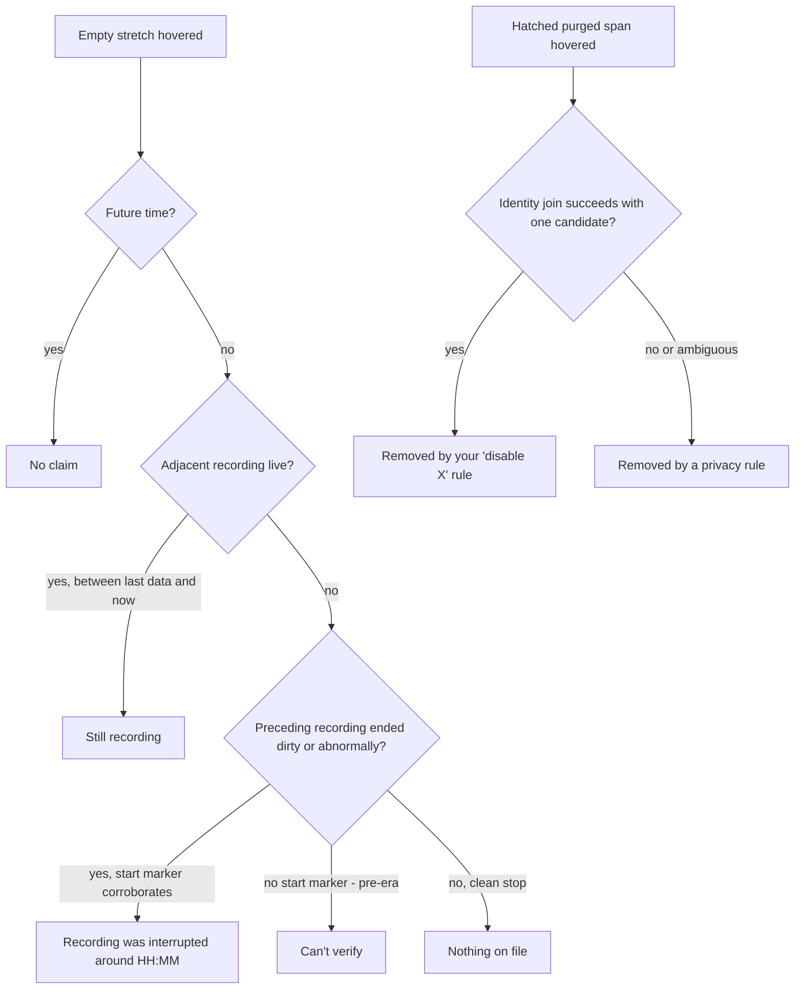
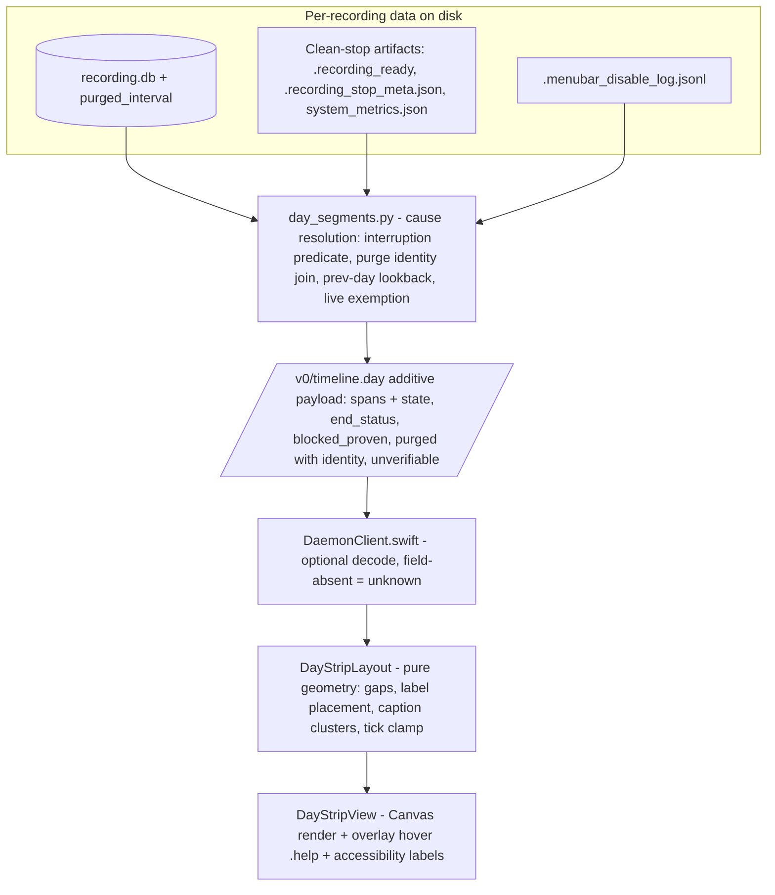

# Day Strip Clarity and Gap Provenance - Plan

## Goal Capsule

- **Objective:** Make the Journal day strip trustworthy and readable — fix its three text-rendering defects, rework the legend wording, and let the user learn on hover why any stretch of the day is empty, honestly.
- **Product authority:** Product owner (Rute), aligned with the STRATEGY "UX & native experience" track and the privacy-honesty posture in `SECURITY.md` (the R7 honesty rule).
- **Product Contract preservation:** changed relative to the brainstorm version — R4/R5/R7 amended and R10–R13 + AE7–AE10 added (live-recording handling, purged-span rendering class, widened interruption definition; user-confirmed during planning). The Problem Frame's purge claim was corrected: purged spans render today as false "blocked", not as neutral gaps.
- **Stop conditions:** Surface rather than guess if implementation contradicts the R7-pinned test expectations on either side, or if the purged-class split turns out to require changes to `skip_intervals` semantics that other consumers (backfill, frame.nearest) depend on.
- **Execution profile:** Two independent tracks (Python daemon provenance, Swift layout fixes) converge in the strip UI; land units in dependency order; honesty-bearing Python tests carry `@pytest.mark.privacy` or they never run on CI.

---

## Product Contract

### Summary

Keep the day strip calm and move gap explanation to hover: an empty stretch tells the user whether nothing was recording, a recording was cut short, a recording is still running, or the app can't verify what happened; purged spans become their own honest class (hatched, named by the rule that removed them where provable) instead of masquerading as "blocked — nothing captured". Ship the three text-rendering fixes and a plain-language legend alongside.

### Problem Frame

The day strip collapses different realities into indistinguishable pixels. Empty stretches conflate "no recording was running", "the recording died", and "can't verify". Retroactively purged spans are worse than the brainstorm assumed: the purge reason is discarded in the daemon's day reader, so purged intervals land in the proven-blocked bucket and render as hatched "blocked — nothing captured" — false on both counts, since footage was captured and then removed. A user looking at a mostly-empty or mislabeled day cannot tell honest emptiness from data loss, which reads as broken capture and erodes the product's core trust promise (≥98% capture reliability is a headline metric).

The diagnosed real-world case sharpened this: recordings die silently when the daemon process restarts (an app update or dev-build swap kills any active recording within seconds), leaving spans that ended without clean-stop metadata. The user believes recording is on; the strip shows an empty day; neither surface says a recording was interrupted.

On top of the semantic gaps, the strip's text rendering fails visibly: task labels hard-clip to narrow band widths ("Seedj…"), every blocked band draws its own "blocked" caption with no overlap guard so nearby bands overprint into garbage, and hour tick labels sit on a fixed offset that misaligns them. The legend's wording assumes vocabulary the user doesn't have.

### Key Decisions

- **Hover provenance over a multi-state track.** Explored three shapes: extra track fills per gap cause, a calm bar with hover explanations, and a split recorder-state ribbon. Chose the calm bar (visual probe, option B): the track keeps its small state set, the legend shrinks, and cause detail lives in hover text where it can be verbose and honest.
- **The R7 honesty rule is a hard constraint, not a choice.** The UI may only claim "removed by your rules", "blocked", or "interrupted" where a provable record exists. Where proof is missing, the stretch must read as "can't verify", never a confident cause.
- **Purged spans keep the hatch but stop lying.** They keep the hatch geometry in a distinct color (no new fill pattern — consistent with the calm-bar choice) and become their own class with honest wording; they are removed from the undifferentiated "blocked" bucket.
- **The live day never misfires.** A recording in progress has no stop artifacts yet; it must read as "still recording", and no cause is ever claimed for future time. No new auto-refresh machinery — the strip stays a per-load snapshot.

### Requirements

**Text rendering**

- R1. Task labels above bands never render as hard-clipped fragments: a label that does not fit truncates with a visible ellipsis, and the full name remains reachable via hover.
- R2. Blocked-band captions never overprint one another: nearby blocked bands share one coalesced caption row so the caption always renders legibly, once per visual cluster.
- R3. Hour tick labels align with their tick positions — centered on the tick, with edge labels clamped so the first and last are not clipped by the strip bounds.

**Gap provenance**

- R4. Hovering any empty stretch of the strip states why it is empty, resolved to exactly one cause with its time range: nothing on file (a data claim — never "no recording was running", which is unprovable once a recording is deleted), a recording was interrupted, still recording, or can't verify.
- R5. A recording is reported as interrupted when it is not live and either its stop metadata records an abnormal termination (disk full, permission lost, force kill) or its start-of-recording marker is present while its clean-stop artifacts are absent; recordings with no start-of-recording marker degrade to "can't verify".
- R6. Where purge provenance can be proven with rule identity, the purged span's hover names the rule (e.g. removed by your "disable Discord" rule); where the span is provable but identity is not recoverable — including when multiple rules are candidates — it degrades to "removed by a privacy rule".
- R7. No hover or label ever claims "removed", "blocked", or "interrupted" without a provable record backing it; unprovable stretches read as "can't verify" (upholds the R7 honesty rule).
- R11. On a day with a live recording, the stretch between the live span's last data and the current time reads "still recording"; future time claims nothing, and no interruption or emptiness cause is ever claimed for a live recording.
- R13. Every gap the strip draws is hover-targetable: hit targets have a minimum width, and where targets collide at boundaries the smaller region wins.

**Purged spans**

- R10. Retroactively purged intervals render as their own class — the blocked hatch geometry in a visually distinct color with its own legend swatch, never worded "blocked — nothing captured" — with hover, caption, legend, and accessibility wording that says footage was captured and then removed.

**Legend, wording, accessibility**

- R8. Legend entries use plain language a first-time user can parse without product vocabulary; the entry for empty stretches signals that hover explains the cause.
- R9. Gap, blocked, and purged wording is consistent across every surface that describes the same states: the strip legend, its accessibility labels, and the recorded-summary pane.
- R12. The strip's accessibility labels carry the same causes the hover shows — provenance is never pointer-only.

### Acceptance Examples

- AE1. **Covers R4.** Given no recording ran 14:00–16:00 and the prior recording stopped cleanly, when the user hovers that stretch, then the hover reads that there is nothing on file for 14:00–16:00.
- AE2. **Covers R4, R5.** Given a recording that died at 10:10 without clean-stop metadata and no recording until 11:00, when the user hovers the empty stretch, then the hover says the recording was cut short around 10:10 — not that the user stopped it.
- AE3. **Covers R6, R10.** Given a span purged by disabling Discord and the provenance join recovers the rule identity, when the user hovers the hatched purged span, then the hover names the Discord rule and the purged range.
- AE4. **Covers R6, R7.** Given a purged span whose identity cannot be recovered (missing join key, lost log line, or two candidate rules), when the user hovers it, then the hover says a privacy rule removed it — without naming a rule it cannot prove.
- AE5. **Covers R7.** Given an unverifiable interval (deleted rows, ambiguous classification), when the user hovers it, then the hover says the app can't verify what happened there and never renders it as "blocked" or "removed".
- AE6. **Covers R2.** Given two blocked bands within a caption-width of each other, when the strip renders, then their captions do not overlap.
- AE7. **Covers R11.** Given a recording currently in progress viewed on today's strip, when the user hovers between its last captured data and the current time, then the hover reads "still recording"; hovering future time shows no claim, and nothing on the strip says the recording was interrupted.
- AE8. **Covers R5.** Given a recording whose stop metadata records a disk-full termination, when the user hovers the stretch after it, then the hover says the recording was cut short — an abnormal recorded stop counts as interrupted, not clean.
- AE9. **Covers R5, R7.** Given a recording with no start-of-recording marker (predating the artifact convention), when the user hovers the stretch after it, then the hover says the app can't verify — old days never read as a crash festival.
- AE10. **Covers R9, R10.** Given a purged span, when the strip renders its caption, legend entry, and accessibility label, then none of them use the words "blocked" or "nothing captured" for it.

### Scope Boundaries

- No changes to capture behavior: ambient/always-on recording stays the separate opt-in feature it is (SCR-214); this work does not alter when footage is captured.
- Task-name quality (the `task_1` / slug-style names feeding the labels) is out of scope — covered by the in-flight SCR-275 work.
- The rejected visual shapes stay rejected: no extra track fills per gap cause, no recorder-state ribbon.
- No new auto-refresh machinery for the live day; the strip remains a per-load snapshot.
- The pre-existing DST skew in day bounds (one fixed tz offset per day) is noted, not fixed here.

#### Deferred to Follow-Up Work

- Fixing silent recording death itself — interruption notifications, auto-resume after a daemon restart — is deeper reliability work beyond this UI surface; candidate Linear ticket.

---

## Planning Contract

### Key Technical Decisions

- **KTD1 — All cause resolution happens daemon-side in the day reader.** `src/screencap/day_segments.py` owns the artifact reads and the purge join (a Swift-side resolver cannot read stop artifacts or disable logs). Resolution is day-bounded — no cross-day lookback. The strip stays a dumb renderer. The read-only join also respects the package DAG: `enforcement` stays read-surface-free, `backfill` never imports `daemon`, and `day_segments` already imports `backfill.skip_intervals` (pinned by `tests/test_package_boundary_call_graph.py`).
- **KTD2 — Additive wire evolution, no breaking change.** Bump `_TIMELINE_DAY_API_VERSION` in `src/screencap/daemon/schema.py` and add optional fields with defaults, mirroring the `tasks` / transcript.search additive precedent. Two repo-specific traps drive the test plan: the handler round-trips output through `DaySegmentRecording(**rec)` with `extra="ignore"`, so a field not added to the Pydantic model is silently dropped (wire-shape round-trip test required); and a stale daemon may serve the old shape to an updated app, so the Swift side must treat field-absent as unknown provenance, never an error (`decodeIfPresent` + defaulted memberwise init, plus an older-daemon-omits-field decode test — the established pattern from `docs/solutions/integration-issues/review-data-nullable-timing-swift-consumer-2026-06-01.md`).
- **KTD3 — Interruption is inferred conservatively; inference is never authoritative.** Predicate: recording `state != "recording"` AND either stop metadata records an abnormal termination (`terminated_reason` / `force_stopped`), or the start-phase `system_metrics.json` marker is present with `"end": null` while `.recording_ready` is absent. The start marker doubles as the artifact-era test: absence of clean-stop artifacts alone never classifies interrupted (the ready-write is best-effort), and a recording with no start-phase marker is pre-era → "can't verify". Live recordings are exempt (→ "still recording"). Interruption is corroborated inference, never bare absence-of-evidence. This honors the repo guardrail that a heuristic best-guess must never be presented as authoritative (`docs/solutions/runtime-errors/capture-health-nonscreen-attribution-terminal-stop-2026-06-01.md`); the interrupted timestamp is worded as approximate ("around HH:MM") because the span end is last observed activity, not proven death time.
- **KTD4 — Purged intervals split out of `blocked_proven` into their own wire class.** Today `RETROACTIVE_PURGE` is not in `_UNVERIFIABLE_REASONS`, so purges flow to `blocked_proven` and the reason string is discarded. The split stops discarding `iv.reason`, ships purges as a separate list carrying `disabled_at` plus joined rule identity (`purged_interval.disabled_at == disable_log.ts_unix` — same-origin timestamps), and degrades to identity-free on any join miss, NULL key, or multiple candidates. This is a behavior change to an R7-pinned surface: the Python bucket tests and the Swift `provenBands` R7 pin move in lockstep.
- **KTD5 — Rendering fixes by extraction into `DayStripLayout`.** The R1–R3 defects live in untestable Canvas closures. Extract label placement, caption clustering (modeled on the existing `clusterXs` single-linkage helper), and tick-label clamping into the pure `DayStripLayout` enum, then have the Canvas draw from the computed geometry. This matches the repo's stated convention (pure layout logic + build-and-run for pixels) and makes AE6 a unit test instead of a screenshot.
- **KTD6 — Hover rides the existing overlay layer; accessibility gets the same strings.** Gap, blocked, purged, and unverifiable regions already (or will) have positioned `Color.clear` overlay views; `.help(...)` tooltips on those overlays are the app-wide pattern (~25 uses) and coexist with the strip's seek gesture. Hover copy lives in the existing `DayStripAccessibility` enum — one pinned string home shared verbatim by `.help` and accessibility labels (R12); no second string-owning type. Unverifiable intervals get a hover overlay without any new visual treatment — the calm bar stays calm.

### High-Level Technical Design

Directional wire shape (guidance, not specification): each recording gains an `end_status` (`clean` / `interrupted` / `live` / `unknown`) and the response gains a `purged` interval list carrying time range plus optional rule identity; the Swift side derives each axis gap's cause from the adjacent recordings' `end_status`, bounded to the requested day. The implementer may instead ship explicit per-day gap-cause intervals if that proves cleaner — the contract is that cause resolution logic lives daemon-side (KTD1) and the fields are additive (KTD2).

### Sequencing

U1 → U2 → U3 → U5 → U6 form the provenance chain; U4 (rendering fixes) is independent and can land first or in parallel.

---

## Implementation Units

### U1. Gap-cause resolution in the day reader

- **Goal:** `day_segments` resolves per-recording end status and purge provenance so the wire can carry honest causes.
- **Requirements:** R4, R5, R6, R7, R11 (data side).
- **Dependencies:** none.
- **Files:** `src/screencap/day_segments.py`; tests extend `tests/test_day_segments.py` (the file the Verification Contract runs).
- **Approach:** Add an end-status classifier per recording: `state == "recording"` → live; stop metadata recording an abnormal termination (`terminated_reason` / `force_stopped`) → interrupted; clean-stop artifacts present and normal → clean; start-phase `system_metrics.json` present with `"end": null` and no `.recording_ready` → interrupted (the start marker is both the artifact-era test and the corroborating record — absence of clean-stop artifacts alone never classifies interrupted); no start-phase marker at all → unknown. Gate all cause resolution on the store being mounted: when `store_state` is locked or absent, every empty stretch resolves to "can't verify", never a confident emptiness claim. Stop discarding `iv.reason` in `_blocked_intervals`: route `RETROACTIVE_PURGE` intervals to a new purged bucket. For identity, read `(start_ts, end_ts, disabled_at)` directly from the per-recording `purged_interval` table inside `day_segments` — the shared `skip_intervals` reader selects no `disabled_at` and stays untouched — and join `.menubar_disable_log.jsonl` on `disabled_at == ts_unix` (read-only; degrade to identity-free on NULL key, missing/corrupt log line, or >1 candidate). An interrupted end status explains a gap only within the remainder of that calendar day.
- **Execution note:** The classifier is honesty-bearing — write the fail-closed tests first; ambiguous evidence must land in `unknown`, never a confident cause.
- **Test scenarios:** clean stop → clean; start marker with null end and no ready sentinel → interrupted; `terminated_reason` disk-full → interrupted (AE8); live recording (active-session lock present) → live, never interrupted (AE7 data side); recording with no start-phase marker → unknown (AE9); locked/absent store → every gap "can't verify", never "nothing on file"; purge with matching log line → purged with bundle id/app name; purge with NULL `disabled_at` → purged, no identity (AE4); two log candidates for one interval → no identity; purged intervals no longer appear in `blocked_proven` (updates the existing bucket tests); a recording that died on the previous day does not mark this day's gaps interrupted; midnight-clamped span at 00:00 not classified as an interruption boundary. All tests `pytestmark = pytest.mark.privacy`, Vision-free, hand-built `recording.db` fixtures per existing file style.
- **Verification:** provenance unit tests green; existing `test_day_segments.py` bucket tests updated and green; package-boundary guard test untouched and green.

### U2. Additive wire schema and verb round-trip

- **Goal:** The new provenance fields survive the daemon boundary.
- **Requirements:** R4, R6, R10 (wire side).
- **Dependencies:** U1.
- **Files:** `src/screencap/daemon/schema.py`, `src/screencap/daemon/app.py` (handler untouched for per-recording fields, which flow through `DaySegmentRecording(**rec)`; a response-level purged list must be threaded through the handler's explicit `schema.envelope(...)` kwargs); `SECURITY.md`; tests extend `tests/test_timeline_day_tasks.py` (the additive-`tasks` precedent file, and the file the Verification Contract runs).
- **Approach:** Add optional defaulted fields to `DaySegmentRecording` (end status) and `TimelineDayResponse` (purged list), bump `_TIMELINE_DAY_API_VERSION`, leave the global schema version alone — per the schema file's own additive-evolution comment. Add a short `SECURITY.md` note in the query-surface section: the new fields expose the same sensitivity class a same-EUID process already reads directly from `recording.db` and the disable log, travel only over the same-EUID UNIX socket, are never uploaded (the dotfile and `recording.db` upload exclusions are untouched), and are not exposed through the MCP verb set.
- **Test scenarios:** wire-shape round-trip — a `day_segments` payload with end status + purged identity survives `DaySegmentRecording(**rec).model_dump()` and reaches the HTTP response (guards the `extra="ignore"` silent-drop trap); response without new fields still validates (backward shape); verb stays out of `_ACTIVITY_PATHS`. Privacy-marked, `httpx.AsyncClient(ASGITransport(...))` style per the existing verb tests.
- **Verification:** round-trip test green; existing timeline.day verb tests green.

### U3. Swift decode with stale-daemon tolerance

- **Goal:** The app reads the new fields and treats their absence as unknown provenance.
- **Requirements:** R4, R7 (client side).
- **Dependencies:** U2.
- **Files:** `macos/ScreenCap/Controllers/DaemonClient.swift`; `macos/ScreenCapTests/DayTimelineTaskBandsTests.swift` (decode-test template lives here).
- **Approach:** Extend `DaySegmentRecording` (and response model) with `decodeIfPresent(...) ?? default` in `init(from:)` **and** defaulted parameters in the memberwise init, or every existing test fixture breaks. Field absent → end status unknown; rendering must not gate on the new fields (readiness gates only on `ok` + required paths, per the nullable-timing learning).
- **Test scenarios:** decodes a fixture with the new fields; decodes an older-daemon fixture without them (mirror `testTimelineDayDecodesWithoutTasksFieldFromOlderDaemon`); absent fields yield unknown, not a decode error.
- **Verification:** `xcodebuild test -only-testing:ScreenCapTests/DayTimelineTaskBandsTests` green.

### U4. Layout extraction and the three rendering fixes

- **Goal:** R1–R3 fixed via testable geometry, not Canvas pixel spelunking.
- **Requirements:** R1, R2, R3.
- **Dependencies:** none (independent track).
- **Files:** `macos/ScreenCap/Views/Timeline/DayStripView.swift` (`DayStripLayout` + the Canvas closures at the label/caption/tick sites); `macos/ScreenCapTests/DayStripLayoutTests.swift`.
- **Approach:** Extract three pure functions into `DayStripLayout`: task-label placement (greedy left-to-right with ellipsis truncation instead of hard clip, with the full task name exposed via the label region's hover and accessibility label per R1), caption clustering over class-tagged bands (blocked and purged; single-linkage like the existing `clusterXs`, one overlap guard across all caption classes), and hour-tick label x-positions (measured centering with first/last edge clamp). Canvas draws from the returned geometry.
- **Test scenarios:** narrow band label truncates but never disappears below the minimum hint width; a truncated task label exposes the full task name via hover and its accessibility label; two bands within caption width produce one caption position (AE6); far-apart bands produce two; a blocked band and a purged band within caption-width produce non-overlapping captions; tick labels center on ticks with edge labels clamped inside strip bounds; existing layout tests stay green.
- **Verification:** `DayStripLayoutTests` green; visual smoke via build-and-run.

### U5. Hover and accessibility provenance in the strip

- **Goal:** Every stretch answers "why is this here / empty" on hover and via VoiceOver.
- **Requirements:** R4, R6, R7, R10, R11, R12, R13.
- **Dependencies:** U3.
- **Files:** `macos/ScreenCap/Views/Timeline/DayStripView.swift` (overlay layer, `DayStripAccessibility` cause strings); `macos/ScreenCapTests/DayStripLayoutTests.swift` for the copy + region mapping.
- **Approach:** Map each axis gap to a cause from adjacent recordings' end status (still-recording between last data and now, nothing for future time); gate all provenance on the day being fully loaded — while the day query hasn't returned or has failed, gap regions carry no cause claim and accessibility reads a neutral loading/unavailable string; add `.help` to the existing gap/blocked overlays and new purged/unverifiable overlays with most-specific-region-on-top z-order (purged/blocked/unverifiable above base tracks and task bands, for hover and accessibility); widen hover hit targets to a minimum width with smaller-region priority at boundaries (R13); route the same strings into accessibility labels (R12). All cause strings live in `DayStripAccessibility`.
- **Test scenarios:** gap-to-cause mapping for each end status (clean → nothing on file, interrupted → cut short with time, live → still recording, unknown → can't verify); trailing stretch between last data and now reads still recording while future time claims nothing (AE7); a strip rendered before the day query returns (or after it fails) makes no cause claims; a purged region under a task band still surfaces its purge hover (z-order); purged span copy names the rule when identity present (AE3) and degrades without it (AE4); unverifiable copy (AE5); hit-target minimum and boundary priority as pure-geometry tests; accessibility label equals hover copy for each region class.
- **Verification:** layout/copy tests green; manual hover pass on a day containing all five region classes, including a purged span that lies under a task band.

### U6. Legend and cross-surface wording

- **Goal:** One honest vocabulary everywhere the day's states are described.
- **Requirements:** R8, R9, R10 (wording side).
- **Dependencies:** U5.
- **Files:** `macos/ScreenCap/Views/Timeline/DayStripView.swift` (`DayStripLegend.items`, `DayStripAccessibility`); `macos/ScreenCap/Views/Inspect/RecordedSummaryPane.swift` (both wording sites); pinned string tests in `macos/ScreenCapTests/DayStripLayoutTests.swift` and `macos/ScreenCapTests/RecordedSummaryTests.swift`. (The Journal "unsplit — still searchable" label is task-naming vocabulary owned by the in-flight SCR-275 work — not touched here.)
- **Approach:** Rewrite legend entries in plain language (empty entry signals hover); add the purged-class entry; update `RecordedSummaryPane`, which already delegates time formatting to `DayStripAccessibility` — extend that coupling for the new wording rather than duplicating strings; update the pinned `hasPrefix`/`contains` string tests in the same change.
- **Test scenarios:** legend contains the purged entry with a swatch pinned unequal to the blocked swatch; the legend no longer pairs "blocked" with "nothing captured" for purges (AE10); accessibility and summary-pane strings match the legend vocabulary; pinned string tests updated to the new wording and green.
- **Verification:** the Verification Contract's Swift command (including `RecordedSummaryTests`) green; manual read of the three surfaces on one purge-bearing day.

---

## Verification Contract

| Check | Command | Applies to |
|---|---|---|
| Daemon provenance + wire tests (privacy lane — what CI runs) | `PYTHONPATH=src SCREENCAP_LOCAL_PAYWALL_ENFORCE=0 pytest tests/test_day_segments.py tests/test_timeline_day_tasks.py -m privacy` | U1, U2 |
| Package-boundary guard | `PYTHONPATH=src pytest tests/test_package_boundary_call_graph.py` | U1 |
| Swift layout/decode/copy tests | `cd macos && xcodegen generate && xcodebuild test -scheme ScreenCap -destination 'platform=macOS' -derivedDataPath DerivedData CODE_SIGNING_ALLOWED=NO -only-testing:ScreenCapTests/DayStripLayoutTests -only-testing:ScreenCapTests/DayTimelineTaskBandsTests -only-testing:ScreenCapTests/RecordedSummaryTests` | U3, U4, U5, U6 |
| Full privacy lane before PR | `PYTHONPATH=src SCREENCAP_LOCAL_PAYWALL_ENFORCE=0 pytest tests/ -m privacy` | all |

Quality gates: honesty-bearing Python tests must carry `@pytest.mark.privacy` and stay Vision-free (unmarked privacy tests never run on CI). Known environmental Swift failures (`RecorderControllerDaemonTests`, `DaemonClientTests`, `DaemonInstallControllerTests`) are pre-existing when the diff against base doesn't touch them. Do not launch a built app from a worktree under `~/Documents` (TCC hazard); compile/test is fine.

---

## Definition of Done

- All six units land with their test scenarios green under the Verification Contract commands.
- Both R7 pins hold in their new shape: Python bucket tests assert purges leave `blocked_proven`, and the Swift `provenBands` pin still proves unverifiable can never acquire a confident label.
- A day containing all five region classes (recorded, blocked, purged, unverifiable, empty) plus a live recording renders without overlapping text and answers every hover honestly (AE1–AE10 exercised).
- Field-absent behavior verified: the app pointed at an old-shape daemon renders the strip with unknown provenance and no errors.
- No abandoned experimental code remains in the diff; superseded strings and their old pinned tests are removed, not commented out.

---

## Deferred / Open Questions

### From 2026-07-17 review

None of these block implementation — the plan as written stands on the default side of each (accept the skew window; per-recording `end_status` with mirrored Swift pins; no tombstone). They are recorded for an explicit decision.

- Old-app/new-daemon skew: once purges leave `blocked_proven`, an app that hasn't been updated renders purged spans as ordinary footage (invisible removal). Accept the one-relaunch skew window, as with prior additive fields, or gate the bucket move on client capability?
- Wire architecture: KTD1 promises daemon-side cause resolution, but the directional shape has Swift derive each gap's cause from `end_status` — logic outside the CI privacy lane. Ship explicit per-day gap-cause intervals daemon-side instead, or keep the Swift mapping pinned by tests mirroring the Python end-status semantics?
- Supervisor interruption tombstone: one stop-metadata write (`terminated_reason: "daemon_restart"`) on the daemon's recording-teardown path would make future interruptions provable records instead of inference, scoping the absence-based heuristic to pre-ship history. Add as a small unit, or explicitly reject in KTD3? (Distinct from the deferred notification/auto-resume reliability work.)

---

## Sources / Research

- Strip rendering and defects: `macos/ScreenCap/Views/Timeline/DayStripView.swift:304-338` (label clipping, per-band captions), `:472-477` (tick offset), `:226-232` (legend), `:171-203` (gap complement), `:400-450` (overlay layer — the hover extension point), `clusterXs` (caption-clustering model).
- Data path: `src/screencap/daemon/app.py:2999-3041` (verb + `extra="ignore"` round-trip), `src/screencap/daemon/schema.py:34-38, 586-656` (additive-evolution comment, models), `src/screencap/day_segments.py:45-53, 89-130, 154-228` (`_UNVERIFIABLE_REASONS` excludes `RETROACTIVE_PURGE`; reason discarded; span derivation), `src/screencap/catalog.py` (`_derive_state`, live span end = last action event, 500ms lock-timeout skip).
- Clean-stop artifacts: `src/screencap/session.py:157-190` (best-effort `.recording_ready`), `src/screencap/engine/screen_recorder.py:1150-1170` (stop meta with `terminated_reason`), `src/screencap/daemon/supervisor.py:1591` (daemon exit path writes nothing — the dirty-death case).
- Purge provenance: `src/screencap/enforcement/scrub_worker.py:381-400, 588-635, 785-787` (log entry shape, `purged_interval` writes, shared `ts_unix`), `src/screencap/enforcement/disable_log.py` (not crash-durable), `src/screencap/backfill/skip_intervals.py:138, 559-599` (`RETROACTIVE_PURGE`, identity-blind reader).
- Institutional learnings applied: `docs/solutions/integration-issues/review-data-nullable-timing-swift-consumer-2026-06-01.md` (optional decode), `docs/solutions/integration-issues/stale-daemon-after-app-update-http-500-2026-07-02.md` (version skew), `docs/solutions/runtime-errors/capture-health-nonscreen-attribution-terminal-stop-2026-06-01.md` (heuristics never authoritative), `docs/solutions/runtime-errors/sigint-handler-timing-and-recording-stop-methods.md` (stop matrix), `docs/solutions/workflow-issues/privacy-guards-deselected-on-ci-silently-rot-2026-06-10.md` (privacy marker).
- Wording surfaces: `macos/ScreenCap/Views/Inspect/RecordedSummaryPane.swift:42-60, 256`, `macos/ScreenCap/Views/Journal/JournalView.swift:537-540`, `DayStripAccessibility` at `DayStripView.swift:537-582`.
- Lost-day diagnosis evidence (2026-07-17): four recordings on four daemon versions in one day; dirty-death recordings lacked all clean-stop artifacts while clean stops had them; no `purged_interval` table in any of the day's recordings; ambient capture absent from config (default off).
