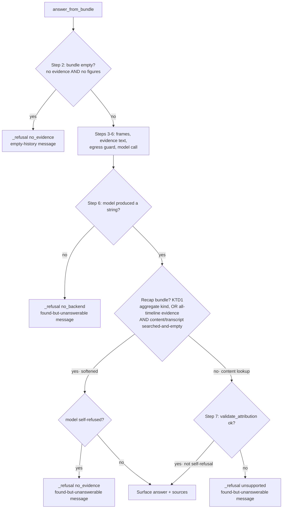

# Recall Recap Grounding Guardrail - Plan

## Goal Capsule

- Objective: Stop the on-device Chat from refusing legitimate day-recap questions ("what I did today?"). Let recap answers surface as a rich narrative, while keeping the strict grounding validator where it still fits (content lookups over OCR'd text).
- Product authority: Rute (rfigueiredo.dev@gmail.com).
- Product Contract preservation: changed — R6 narrowed during planning (the eval flags fabrication, not injected content, and gains a separate injection-resistance case; see KTD5). All other R/AE IDs carried verbatim from the brainstorm.
- Execution profile: change in `src/screencap/recall/` and `src/screencap/segmentation/generation_finish.py` (Python, privacy-lane tested) **plus a matching Swift string-constant edit** in `macos/IntelligenceHelper/main.swift` — the on-device generator uses a separate `answerInstructions` prompt mirror, so the Python-only prompt edit would not reach the failing path (see KTD4). The Swift edit needs no `xcodebuild` (string literal, verified by inspection + review); on-device run-verification happens at the next app build. Implement in a worktree OUTSIDE `~/Documents` and never run `xcodebuild` (TCC session-brick avoidance).
- Decisions (resolved by the user after document review): runtime posture is **fully gate-free** (no runtime attribution check on the recap path; OQ1 closed); scope is **full** — Python + Swift string mirror ship in one PR (OQ3 closed).
- Open blockers: none.

---

## Product Contract

### Summary

For recap-style recall answers, drop the hard answer-side attribution refusal and let faithfulness ride on a strengthened grounding prompt plus a new eval. An answer is on the recap path when its question classifies as aggregate or its evidence is genuinely timeline-only. Content lookups over OCR snippets keep the strict validator. Separately, correct the refusal message so it stops claiming the history is missing when evidence was actually found.

### Problem Frame

Asking the on-device Chat "what I did today?" returns "I don't have that in your recorded history." even when today's recordings exist and are queryable. The message is misleading: the daemon found today's timeline evidence and the on-device model generated a substantive answer — the answer-side attribution validator then discarded it (`reason: unsupported`) and blanked it to a shared refusal string.

The validator is a v1 heuristic built for extractive point-lookups over rich OCR snippets. It cannot be satisfied by a day-recap, whose only evidence is sparse, number-free, repeated window titles ("Claude Claude", "Brave Browser Releases · …/screencap"): its verbatim-number rule rejects any duration or count, and its token-overlap rule rejects the inferred vocabulary a natural recap needs. The result is a core feature that looks broken to the operator persona — and a confidently-wrong "no history" message that erodes trust worse than a dry answer would.

### Key Decisions

- Best-effort grounding for recaps, no runtime gate (decided). A recap is a local-only summary of the user's own screen; the stakes of an occasional over-reach are low, and the hard gate was breaking the feature outright. The grounding prompt (both prompt copies) plus a repeatable eval become the safety net in place of a runtime refusal. The narrow app-mis-attribution guard is intentionally dropped too (the user chose fully gate-free); the record of that alternative is kept under Alternatives Considered.
- Recap detected two ways — question classification and evidence shape. Keying gate-softening on a genuinely timeline-only evidence bundle (not only on the classifier) means an odd phrasing that misroutes to the point path still gets the softened gate. "Genuinely timeline-only" excludes the content-index-off case where content simply was not searched (KTD1).
- Strict validator retained for content lookups. Answers whose evidence carries OCR content snippets keep the existing validator — that is the richer prompt-injection surface, and extractive grounding still fits there.
- Strengthen the grounding prompt as the primary faithfulness lever, in both the Python and Swift copies. With no runtime gate on the recap path, the prompt is what steers rich-but-grounded narrative (use the evidence; do not invent apps, sites, or durations).
- Structural egress bound is untouched. The model still only ever sees the ALLOW-stripped, bundle-only evidence. This change is behavioral (which model answers are surfaced), not a privacy/leakage change.

### Requirements

**Recap answer behavior**

- R1. A recap-path answer bypasses the hard attribution refusal: the on-device model's answer is surfaced as generated, not rejected for low token-overlap or unbacked numbers. A model that itself declines still passes through as an honest refusal.
- R2. A content-lookup answer (evidence bundle carries OCR content/transcript snippets, or those streams were searched and could carry them) retains the existing strict attribution validator with its current behavior.

**Recap routing**

- R3. An answer is on the recap path when its question classifies as aggregate, or its evidence bundle is genuinely timeline-only — non-empty, every item `Stream.TIMELINE`, and the content/transcript streams were actually searched and returned nothing (not merely un-indexed).
- R4. The point-vs-aggregate classifier is corrected so everyday recap phrasings route to aggregate, including the "what I did &lt;period&gt;" word order that currently misses. The exact cue set is a planning detail.

**Messaging**

- R5. When retrieval found evidence but no answer could be produced (a retained-path refusal, a model self-refusal over a non-empty bundle, or no model available), the surfaced message must not claim the recorded history is missing. It distinguishes "found activity but couldn't answer" from "no data in this window."

**Evaluation**

- R6. A repeatable, Vision-free eval pins the new posture over synthetic fixtures: representative recap questions yield a non-refusal answer, an ungrounded content-lookup still refuses, a fabricated-app recap is flagged by an eval-side check, and an injection-bearing timeline title does not steer the surfaced recap. The eval bounds dispatch and assertion logic; it does not bound the real on-device model (see KTD5).

### Acceptance Examples

- AE1. Covers R1, R3, R4. Given today's recordings produce timeline evidence, when the user asks "what I did today?", then the Chat returns a fluent recap of the day's activity with no refusal.
- AE2. Covers R2. Given evidence that includes an OCR content snippet (or a searched-and-empty content stream), when the user asks a content lookup ("what was that error I saw?"), then the strict validator still applies and an ungrounded answer is still refused.
- AE3. Covers R5. Given a time window with genuinely no recordings, when the user asks about it, then the message states there is no activity in that window — distinct from the found-but-unanswerable message.
- AE4. Covers R6. Given a recap eval case whose reference answer names an app absent from the evidence, when the eval runs, then it flags the case as a quality miss.
- AE5. Covers R6. Given a timeline-title evidence item carrying an injected instruction, when the eval runs the softened recap path, then the surfaced answer does not adopt the injected instruction.

### Scope Boundaries

- Not redesigning the content-lookup validator — its verbatim-number and token-overlap rules are retained for the strict path.
- No hard prompt-injection sanitization of untrusted evidence at runtime — the best-effort prompt-level defense was the chosen posture. The eval adds an injection-resistance case (AE5) but nothing sanitizes evidence at runtime.
- The structural egress/privacy strip, masked-frame egress, and cloud recall path are untouched.
- Not replacing the rule-based classifier with an intent model — the fix broadens its recap cues and adds evidence-shape keying.

### Dependencies / Assumptions

- Assumes the on-device model is available and producing answers on the failing path — confirmed in the debug reproduction, where the daemon reached the attribution step (`reason: unsupported`, not `no_backend`). The on-device generator uses the Swift `answerInstructions` prompt, so the prompt lever must be changed there (KTD4).
- Assumes the softened recap path preserves the model-refusal passthrough, so a genuine model decline is still surfaced as an honest refusal rather than a fabricated recap.

### Outstanding Questions

Resolved by the user after document review:

- OQ1 (closed → fully gate-free). The currently-working `_aggregate_names_absent_app` runtime guard is intentionally disabled for aggregate recaps; no runtime attribution check remains on the recap path. The kept-as-runtime-gate alternative is recorded under Alternatives Considered but not taken.
- OQ3 (closed → full scope, safely). The Swift `answerInstructions` mirror ships in this change as a string-constant edit; no `xcodebuild` runs in the pipeline, work is isolated in a worktree outside `~/Documents`, and on-device run-verification is deferred to the next app build.

Deferred to Implementation:

- The exact recap cue set (A1), message wording (A2), and eval corpus (A3) — see Assumptions.
- A golden-recording eval that exercises the real on-device generator is future work (KTD5); the synthetic eval here does not bound real-model fabrication.

---

## Planning Contract

### Key Technical Decisions

- KTD1. Recap-path detection is a pure predicate over the bundle plus its coverage, computed in the dispatch. A bundle is on the recap path when `question_kind is QuestionKind.AGGREGATE`, or its `evidence` is non-empty, every item's `stream is Stream.TIMELINE`, **and** `coverage.per_stream` shows the content and transcript streams were actually served and empty (state `ok`/`no_matching_moments`), not `not_indexed`/`store_unavailable`. The coverage guard is load-bearing: `content_index_enabled` defaults OFF, so without it most ordinary point questions produce timeline-only bundles and would be wrongly softened, silently disabling the R2/AE2 strict validator. The aggregate arm additionally requires no content/transcript evidence items present (defense-in-depth against a future retriever that attaches snippets to an aggregate bundle). Genuine recaps whose content stream is un-indexed are still caught by the classifier arm (U1).
- KTD2. The softened gate bypasses only the attribution-failure refusal for recap bundles, in `answer_from_bundle` step 7. On a recap bundle, a not-`ok` attribution verdict no longer blanks the answer; the model's prose is surfaced with `sources` still populated from the verdict, and the model-refusal passthrough (step 8) is preserved so a genuine decline still refuses. This disables the currently-working `_aggregate_names_absent_app` runtime mis-attribution guard for aggregate recaps — an acknowledged consequence, reopened in OQ1. `validate_attribution` itself is unchanged and still governs content-lookup answers (R1/R2). The empty-bundle and egress-guard refusals (steps 2 and 5) are untouched.
- KTD3. The differentiated refusal message keys on whether evidence was found, gated on bundle emptiness — not on the reason code. `_refusal` surfaces the empty-history string only when `not bundle.evidence and bundle.figures is None`; every other refusal (including a model self-refusal over a non-empty bundle, which today also emits `no_evidence`, and any `unsupported`/`no_backend`/`blocked`) surfaces the "found activity but couldn't answer" string. Keying on the reason code instead would reintroduce the misleading "no history" message for the model-self-refusal-over-found-evidence case. The new string is registered as an `is_refusal` marker so a re-validation still treats it as a safe decline. Daemon-side only — the Swift client renders the `answer` field verbatim (R5, AE3).
- KTD4. Grounding-prompt strengthening is prompt-text only, but it must land in BOTH copies: the Python `generation_finish._GROUNDING_INSTRUCTIONS` (cloud/downloaded backends) and the Swift `answerInstructions` in `macos/IntelligenceHelper/main.swift` (the on-device Apple Intelligence session at the `LanguageModelSession(instructions:)` call). The repro shows recaps are generated on-device, so editing only the Python copy leaves the lever inert and introduces the exact Python/Swift drift the mirror's own comment warns against. The added steering: when the evidence is a timeline of apps and window titles, summarize the activity in the user's own words, but name only apps, sites, and durations present in the evidence. With the runtime gate gone on the recap path, this prompt plus the U5 eval are the anti-fabrication net (R6).
- KTD5. The eval's fabrication and injection checks are eval-side assertions over synthetic fixtures, never runtime gates. Scope honesty: the eval hand-writes fake `answer_fn` outputs and verifies dispatch routing and the assertion logic — it does NOT invoke the real on-device model and therefore does not bound real-model fabrication (that needs a future golden-recording eval). The fabrication assertion must work on the primary timeline-only path, where `figures` is `None`: derive the allowed app vocabulary from the bundle's evidence-item text (window titles) using attribution's capitalized-name detection (`_CAPITALIZED_WORD_RE`), and reserve `_figure_app_tokens`/`_aggregate_names_absent_app` (which read `figures.apps`) for the aggregate-with-figures fixture. The injection assertion (AE5) checks that an injected instruction in a timeline title does not appear as an adopted directive in the surfaced answer.

### High-Level Technical Design

The change is a branch inside the existing `answer_from_bundle` pipeline. Steps 1–6 (target resolution, empty-bundle refusal, masked-frame build, evidence text, egress guard, model call) are unchanged. The new branch is at step 7 (attribution) and the message shape is set in `_refusal`.

Note: every refusal node except the step-2 empty-bundle case (RE) surfaces the found-but-unanswerable message — the empty-history string is reserved for a genuinely empty bundle (KTD3).

### Assumptions

Pipeline-mode defaults recorded here (deferred wording/corpus resolved to a concrete default; a reviewer may adjust wording without changing structure):

- A1. Recap cue set (R4): broaden `_RECAP_CUES` to also match the "what (i|we) (did|have done|got done|worked on|been doing)" word order and the everyday recap forms "my day", "catch me up", "what happened", "where did my time go", and "&lt;period&gt; summary". Gate against demotion by the existing `_CONTENT_QUALIFIER_RE`. Final cue set is tuned against U1's test scenarios; the guard is that "what was that error I saw yesterday" stays POINT.
- A2. Message wording (R5): the found-but-unanswerable string is "I found activity from that time but couldn't put together an answer for it." The empty-window string stays "I don't have that in your recorded history." Exact copy is a one-line change a reviewer can revise.
- A3. Eval corpus (R6): synthetic in-test `EvidenceBundle` fixtures (timeline-only, aggregate-with-figures, content-snippet, and injection-in-title bundles) with injected fake `answer_fn` outputs — no golden recordings, no Vision, deterministic. The eval lives in the privacy lane alongside the existing dispatch tests.

---

## Implementation Units

### U1. Broaden recap classifier cues

- Goal: Route everyday recap phrasings — starting with "what I did today?" — to `QuestionKind.AGGREGATE` so recap intent is detected by classification as well as by evidence shape (U2). This is the primary recap detector when the content index is off.
- Requirements: R4. Advances AE1.
- Dependencies: none.
- Files: `src/screencap/recall/orchestrator.py` (the `_RECAP_CUES` tuple and its `_RECAP_RE`), `tests/recall/test_evidence_bundle.py` (existing `classify_question` coverage).
- Approach: Extend `_RECAP_CUES` per Assumptions A1 — add the "what (i|we) (did|have done|got done|worked on|been doing)" word order and the common recap forms, keeping the `_CONTENT_QUALIFIER_RE` demotion gate so a content-bearing recap ("what did I do about the login bug") stays POINT. Do not touch `_AGGREGATE_CUES`. Keep the cue set readable and commented as today.
- Patterns to follow: the existing `_RECAP_CUES` / `_AGGREGATE_CUES` regex-tuple style and the KTD1 recap-detection rationale.
- Test scenarios:
  - Covers AE1. "what I did today?" and "what I did today" (no question mark) classify AGGREGATE.
  - "what have I done today", "what did I get done", "what was I working on", "my day", "catch me up", "today's summary" classify AGGREGATE.
  - Regression: "what was that error I saw yesterday" stays POINT; "what did I do about the login bug yesterday" stays POINT (content-qualifier demotion holds).
  - Existing aggregate cues ("how much time", "recap", "summarize") still classify AGGREGATE (no regression).
- Verification: `classify_question` returns AGGREGATE for the recap phrasings and POINT for the content-qualified controls.

### U2. Recap-path detection and softened attribution gate

- Goal: Bypass the hard attribution refusal for genuine recap bundles while preserving sources and the model-refusal passthrough; leave content-lookup answers (including content-index-off point questions) on the strict validator.
- Requirements: R1, R2, R3. Advances AE1, AE2.
- Dependencies: none (independent of U1 by KTD1).
- Files: `src/screencap/recall/dispatch.py` (`answer_from_bundle`; a new `_is_recap_bundle` helper), `tests/recall/test_generation_dispatch.py`.
- Approach: Add `_is_recap_bundle(bundle)` implementing the KTD1 predicate — the aggregate arm (with no content/transcript items), or non-empty all-`Stream.TIMELINE` evidence **plus** a `coverage.per_stream` check that content and transcript were searched-and-empty (`ok`/`no_matching_moments`), not `not_indexed`/`store_unavailable`. In `answer_from_bundle` step 7, still call `validate_attribution` (its `sources` populate the answer), but when the bundle is a recap bundle, do not blank on a failing verdict — proceed to the step-8 model-refusal check and surface the model's answer with `verdict.sources`. Content-lookup bundles keep today's blank-on-fail behavior with `REASON_UNSUPPORTED`. Do not alter steps 1–6 or `validate_attribution`.
- Patterns to follow: the existing step-numbered structure and `_refusal(...)` call sites in `answer_from_bundle`; the `CoverageState` values in `orchestrator.py`; fake-`answer_fn` injection already used throughout `tests/recall/test_generation_dispatch.py`.
- Test scenarios:
  - Covers AE1. A timeline-only POINT bundle with content/transcript `no_matching_moments` and a fake `answer_fn` returning a rich narrative that would fail `validate_attribution` is surfaced as a non-refusal with `sources`.
  - Covers AE2. A timeline-only bundle whose `coverage.per_stream` marks content `not_indexed` is treated as a content lookup (NOT softened) — an ungrounded answer still refuses. This is the default-config regression guard.
  - Covers AE2. A bundle containing a `Stream.CONTENT` evidence item with an ungrounded fake answer still refuses with `REASON_UNSUPPORTED`.
  - Covers AE1. An AGGREGATE bundle (figures present, empty evidence) with a fake narrative answer is surfaced as a non-refusal.
  - A recap bundle whose fake `answer_fn` returns a refusal-marker string still refuses — model-refusal passthrough preserved.
  - `_is_recap_bundle` unit cases: all-timeline + content searched-empty → true; all-timeline + content `not_indexed` → false; aggregate/empty-evidence → true; aggregate with a content item → false; any content/transcript item → false; empty non-aggregate bundle → false.
- Verification: genuine recap bundles surface the model answer; content-lookup and content-index-off bundles retain the strict refusal; `sources` populated on surfaced recap answers.

### U3. Differentiated refusal message

- Goal: Stop reporting "not in your recorded history" when evidence was actually found; distinguish the found-but-unanswerable case from the genuinely-empty case.
- Requirements: R5. Advances AE3.
- Dependencies: none.
- Files: `src/screencap/recall/dispatch.py` (`_refusal`, a new message constant), `src/screencap/recall/attribution.py` (`_REFUSAL_MARKERS` / `is_refusal`), `tests/recall/test_generation_dispatch.py`, `tests/recall/test_attribution.py`.
- Approach: Add a `REFUSAL_TEXT_FOUND_NO_ANSWER` constant (Assumptions A2). In `_refusal`, select the message on bundle emptiness, not the reason code: surface the empty-history string only when `not bundle.evidence and bundle.figures is None`; otherwise surface the found-but-unanswerable string. This correctly handles the overloaded `no_evidence` reason, which is emitted both for the truly-empty bundle (step 2) and for a model self-refusal over a non-empty bundle (step 8). Register the new string as an `is_refusal` marker so a re-validation still treats it as a safe decline. No Swift change for the message — the client renders `answer` verbatim (KTD3).
- Patterns to follow: the existing `REFUSAL_TEXT` constant, its `is_refusal`-marker comment, and the `_refusal` signature (it already receives the `bundle` and `reason`).
- Test scenarios:
  - Covers AE3. A `no_evidence` refusal over an empty bundle surfaces the empty-history string.
  - A `no_evidence` refusal over a non-empty bundle (model self-refusal) surfaces the found-but-unanswerable string — the overloaded-reason regression guard.
  - A `no_backend` refusal over a bundle with evidence surfaces the found-but-unanswerable string.
  - A content-lookup `unsupported` refusal surfaces the found-but-unanswerable string.
  - `is_refusal` returns true for the new found-but-unanswerable string (marker registered).
- Verification: the surfaced message matches evidence presence for all refusal reasons; both refusal strings pass `is_refusal`.

### U4. Strengthen the grounding prompt (Python + Swift mirror)

- Goal: Make the guardrail prompt the primary faithfulness lever for recaps — steer rich but grounded narrative — in the copy the on-device generator actually uses.
- Requirements: R6 (support). Advances AE1, AE4, AE5.
- Dependencies: none.
- Files: `src/screencap/segmentation/generation_finish.py` (`_GROUNDING_INSTRUCTIONS`), `macos/IntelligenceHelper/main.swift` (`answerInstructions`), `tests/recall/test_generation_dispatch.py` (egress-bound assertion).
- Approach: Extend both prompt copies (KTD4) with the recap steering — keep the existing "ground every claim / do not invent" spine, add: when the evidence is a timeline of apps and window titles, summarize the activity in the user's own words but name only apps, sites, and durations present in the evidence. Keep the two copies textually in sync (the mirror's own comment requires it). `dispatch._SCAFFOLD_TOKENS` is derived from `_GROUNDING_INSTRUCTIONS`, so the egress-bound token set updates automatically — no separate egress change.
- Patterns to follow: the existing `_GROUNDING_INSTRUCTIONS` string and `build_answer_prompt`; the `answerInstructions` string and its `LanguageModelSession(instructions:)` use in `main.swift`.
- Execution note: prompt-content change on both sides — the Swift edit is a string literal, so it needs NO `xcodebuild` to implement or verify; check it by inspection + code review. The string only reaches a running on-device daemon at the next app build (that is the user's run-verification step). Verify the egress-bound test in `tests/recall/test_generation_dispatch.py` still passes since the scaffold token set widens.
- Test scenarios: assert `_GROUNDING_INSTRUCTIONS` (and `build_answer_prompt` output) contains the recap-steering and anti-invention guidance; assert the Swift `answerInstructions` carries the same steering (string/text check). Behavioral faithfulness is covered by U5.
- Verification: both prompt copies carry the recap steering; the existing egress-bound assertions still pass.

### U5. Recap eval (privacy lane)

- Goal: Pin the new posture so it is measurable and cannot silently regress — good recaps pass, content lookups stay strict, a fabricated recap is flagged, and an injected title does not steer the answer. Scope: bounds dispatch/assertion logic, not the real model.
- Requirements: R6. Advances AE1, AE2, AE4, AE5.
- Dependencies: U2 (softened gate), U3 (message), U4 (prompt).
- Files: `tests/recall/test_recall_recap_eval.py` (new; `pytestmark = pytest.mark.privacy`), optionally a small eval helper in the same file.
- Approach: Vision-free eval over synthetic `EvidenceBundle` fixtures with injected fake `answer_fn` outputs (KTD5, Assumptions A3). Cases: (1) recap bundles (timeline-only searched-and-empty, aggregate-with-figures) + faithful narrative answers → non-refusal (R1); (2) content-lookup bundle + ungrounded answer → refusal, and a content-index-off timeline-only bundle → refusal (R2); (3) a fabricated-app recap flagged by an eval-side `recap_names_absent_app(answer, bundle)` that derives allowed vocabulary from evidence-item text via `_CAPITALIZED_WORD_RE` for timeline-only fixtures and from `_figure_app_tokens` for the aggregate fixture (AE4); (4) an injection-in-title fixture where the surfaced answer must not adopt the injected directive (AE5). All checks are assertions in the eval — never wired into `answer_from_bundle`. Add a module docstring stating the eval does not bound real-model fabrication.
- Patterns to follow: `tests/recall/test_generation_dispatch.py` (privacy marker, fake `answer_fn`, direct `EvidenceBundle`/`EvidenceItem` construction); attribution's `_figure_app_tokens`, `_CAPITALIZED_WORD_RE`, and `_aggregate_names_absent_app`.
- Test scenarios:
  - Covers AE1. Each recap fixture with a faithful narrative answer yields `refusal is False`.
  - Covers AE2. The content-snippet fixture and the content-index-off timeline-only fixture with ungrounded answers yield `refusal is True` (`REASON_UNSUPPORTED`).
  - Covers AE4. A recap answer naming an app absent from the fixture's evidence is flagged; a faithful answer is not — on both the timeline-only and aggregate fixtures.
  - Covers AE5. An injected-instruction timeline title with an answer that adopts it is flagged; an answer that ignores it is not.
- Verification: the eval passes in the privacy lane and fails loudly if the softened gate, the strict path, the fabrication check, or the injection check regresses.

---

## Alternatives Considered

- Keep a narrow runtime anti-fabrication gate (OQ1). Instead of fully gate-free, retain `_aggregate_names_absent_app` (and an evidence-text-derived equivalent for timeline-only recaps) as the ONLY runtime attribution check on the recap path — refusing an answer that credits activity to an app absent from the evidence, while relaxing the number and token-overlap rules that were rejecting valid recaps. Pro: preserves real production enforcement against the most concrete fabrication class (mis-attributed app) without blocking rich narrative; the check is already bounded and cheap and is being built anyway for the eval. Con: reintroduces a runtime refusal path the brainstorm chose to remove, and a false positive would refuse a legitimate recap. This is the OQ1 decision.
- Drop the evidence-shape arm entirely and rely on the classifier alone (U1). Pro: avoids the content-index-off over-broadening risk without a coverage guard. Con: loses the robustness the "both" decision wanted for classifier misses. The chosen middle path (KTD1's coverage-gated evidence-shape arm) keeps robustness for content-index-on users while staying safe when it is off.

---

## Verification Contract

| Gate | Command | Applies to |
|---|---|---|
| Recall unit tests | `PYTHONPATH=src pytest tests/recall/ -q` | U1, U2, U3, U5 |
| Privacy lane (what CI runs) | `PYTHONPATH=src pytest -m privacy -q` | U2, U3, U4, U5 |
| Classifier coverage | `PYTHONPATH=src pytest tests/recall/test_evidence_bundle.py -q` | U1 |
| Full recall + segmentation regression | `PYTHONPATH=src pytest tests/recall tests/segmentation -q` | all Python units |
| Swift prompt mirror | inspection + code review only (string literal; NO `xcodebuild` in this pipeline) | U4 (Swift half) |

Note: run Python with `PYTHONPATH=src` per the repo's worktree convention. The privacy lane is the CI-authoritative set; every behavior-bearing Python test carries `pytest.mark.privacy`. The Swift half rides the macOS app release track — its on-device run-verification is the user's next app build, not this pipeline.

## Definition of Done

- "what I did today?" over present timeline evidence returns a non-refusal recap answer (AE1), verified by the U2 dispatch test and the U5 eval; the on-device prompt (Swift `answerInstructions`) carries the recap steering (U4) so the lever reaches the real generator.
- Content lookups over OCR content snippets, and content-index-off point questions, still refuse an ungrounded answer (AE2) — strict validator unchanged and not over-broadened.
- The refusal message distinguishes found-but-unanswerable from genuinely-empty for every refusal reason (AE3); both strings pass `is_refusal`.
- The privacy-lane recap eval passes, including the fabrication and injection checks (AE4, AE5), with its scope-honesty docstring.
- The structural egress bound and `validate_attribution` are unmodified except for the new `is_refusal` marker; the recap path carries no runtime attribution check (gate-free, per OQ1).
- `PYTHONPATH=src pytest -m privacy -q` is green (accounting for the known pre-existing privacy-lane failures unrelated to this change).

---

## Sources & Research

- Live daemon reproduction: `POST /v0/chat.answer` returned `reason: unsupported` with `coverage.state: "ok"` for both "what I did today?" (classified `point`, `content: not_indexed`) and "what did I do today?" (classified `aggregate`); `timeline.query` for today's window returned many rows. The refusal is attribution, not missing data; the content stream is un-indexed in the default config.
- `src/screencap/recall/attribution.py` — `validate_attribution` (rule a verbatim-number, rule c `_MIN_OVERLAP` 0.5 overlap), `is_refusal` / `_REFUSAL_MARKERS`, `_figure_app_tokens`, `_CAPITALIZED_WORD_RE`, `_aggregate_names_absent_app` (returns False on empty `figures.apps`).
- `src/screencap/recall/dispatch.py` — `answer_from_bundle` step 7 (`REASON_UNSUPPORTED`) and step 8 model-self-refusal (`REASON_NO_EVIDENCE` over a non-empty bundle); `_refusal`, `REFUSAL_TEXT`, `_SCAFFOLD_TOKENS` (derived from `_GROUNDING_INSTRUCTIONS`).
- `src/screencap/recall/orchestrator.py` — `classify_question` / `_RECAP_CUES`; `Stream`, `CoverageState`, `CoverageDescriptor.per_stream`; `EvidenceBundle` / `EvidenceItem`; `_build_point_bundle` (timeline rows as evidence), `_build_aggregate_bundle` (empty evidence + figures).
- `src/screencap/segmentation/generation_finish.py` — `_GROUNDING_INSTRUCTIONS`, `build_answer_prompt`.
- `macos/IntelligenceHelper/main.swift` — `answerInstructions` (line ~135) and its `LanguageModelSession(instructions:)` use (line ~314): the on-device prompt mirror that must stay in sync with the Python copy.
- `docs/plans/2026-07-09-001-feat-conversational-recall-chat-plan.md` — KTD3, the guardrail's original charter (anti-fabrication AND anti-prompt-injection); on-device grounding flagged unverified and eval-dependent.
</content>
