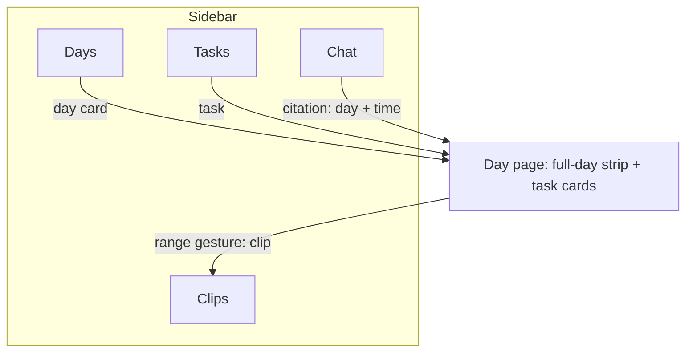
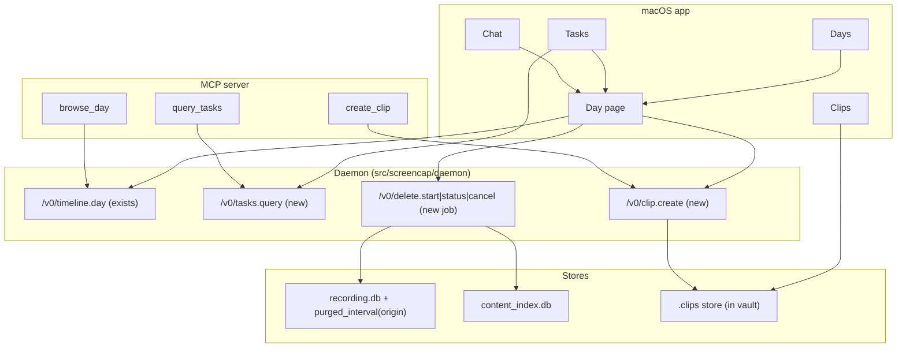
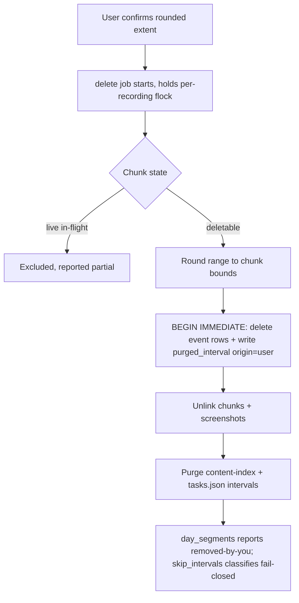

# Day-First Days and Tasks Navigation - Plan

## Goal Capsule

- **Objective:** Restructure the macOS app's browsing model around two units — Days and Tasks — with a sidebar of Days · Tasks · Clips · Chat, and give agents the same day-first access through new MCP tools. The Library and the user-visible "recording" concept are retired; the day page becomes the single footage surface; a universal range gesture covers clip, share, and delete.
- **Product authority:** The Product Contract below; STRATEGY.md "UX & native experience" track. Repo conventions and SECURITY.md govern the daemon/privacy surfaces.
- **Stop conditions:** Surface a blocker instead of guessing when a change would contradict the Product Contract, weaken a privacy/honesty rule (R7, R8, R20), or touch the capture engine. Deletion is irreversible — U8/U9 changes that could delete more than the confirmed extent stop for review.
- **Open blockers:** None. All questions were resolved during planning.

---

## Product Contract

Product Contract changed during planning (user-confirmed): R10 and R11 extended; R14–R21, F5, AE5–AE8 added; the four deferred questions resolved in place (upload status → R14, Inspect → KTD-10, axis bounds → KTD-5, "Days" naming adopted in R1).

### Summary

Screencap's browsing model becomes two units: **Days** (what happened) and **Tasks** (the workflows split out of it), plus **Clips** for things you deliberately kept and **Chat**. Recordings become invisible plumbing under a day-first timeline with an honest full-day axis; one range gesture on the day strip covers clip, share, and delete; and the MCP surface gains day-first tools so agents browse your history the way you do.

### Problem Frame

On 2026-07-18 the founder spent an afternoon in Ableton Live with capture running correctly (one recording, 13:53–14:44, fully captured), yet the app read as "only a few minutes recorded" — and the day was initially reported as a capture bug. Three surface choices produced that misreading: the app maintains two parallel hierarchies over the same footage (a Library grid of recordings and a Journal of days), clicking a recording opens a whole-day timeline the user didn't expect, and the day strip's axis rule (footage span rounded outward with an 8-hour minimum) renders short footage as a sliver.

The deeper mismatch: the shipped ambient-recording contract already models capture as one continuous stream per day with tasks as marked spans — each day is its own recording container. The recording-first surfaces contradict the product's own data model, and the cost lands on the product's core trust promise: honest capture reads as data loss, the exact failure the day-strip gap-provenance work was built to prevent.

### Key Decisions

- **Two browsing units only: Days and Tasks.** Sidebar becomes Days · Tasks · Clips · Chat. Library and Journal disappear as named surfaces; the Collections stub row is removed.
- **Recordings become invisible plumbing.** Storage, pipeline, and CLI stay recording-scoped internally; no browsing surface shows a recording entity. The editable recording titles are retired from the UI — naming lives on days and tasks.
- **Clips carry deliberate capture.** No session entity and no live markers: "I want this captured as a thing" is served by clipping a range from the day, during or after.
- **Honest full-day axis.** The day strip spans the waking day with fixed bounds; the footage-union + 8-hour-floor axis is removed. Footage renders small on sparse days, and labeled gaps make that read as "not recording", never "lost".
- **The time range is the universal footage gesture.** Clip, Share, and Delete all operate on a selected range; "delete this day" and "delete this task" are the same action with a preselected range.
- **Agent parity ships with the restructure.** MCP gains day-browse, cross-day task-query, and clip-create tools backed by the same daemon verbs the UI uses; a deleted range returns nothing through every agent path.
- **Range delete is human-only forever and local-only in v1.** Delete gets no MCP tool ever (closing the prompt-injection → data-destruction channel at the tool surface, not the socket — the daemon verb stays same-EUID-reachable per SECURITY.md); v1 removes footage from this Mac only and says so honestly; cloud propagation is a follow-up.
- **Clips live inside the vault and obey privacy rules.** Clips are sealed by Lock and retention-exempt; retroactive privacy purges delete overlapping clips (and `clip.create` refuses to cut from an already-purged range), while user range-deletes never cascade to clips — surviving clips are disclosed at delete-confirm time so "removed from this Mac" is never silently false.

### Requirements

**Navigation and surfaces**

- R1. The sidebar has exactly four primary destinations: Days, Tasks, Clips, Chat.
- R2. Days is the default landing surface: day cards newest-first, each opening its day page.
- R3. The day page is the single footage surface — full-day strip with task bands and provenance-labeled gaps, plus the day's task cards.
- R4. Tasks is a cross-day list of task segments (agent- and user-created); opening a task lands on its day page seeked to the task's span.
- R5. No browsing surface shows a recording entity: no recording list, cards, titles, or per-recording state chips. Recording remains the internal storage unit only.
- R14. Day cards and the day page carry a day-level upload/review status (e.g. "2 h not yet uploaded · needs review") that routes into the existing Review & upload window. The upload arm of the badge appears only for cloud-destined footage per the frozen policy — local-only-policy days carry review-only status or none, never a permanent pending-upload badge. When opened from a day card or the day page, the Review & upload window presents day + time and never titles itself with a recording name; recording-keyed plumbing stays hidden.
- R15. A Today card is always present, carrying live capture status (recording since HH:MM / ambient off / paused) even before any footage exists; the open day page refreshes on daemon recording events.
- R16. Any date is navigable (previous/next day plus jump-to-date); a footage-less date opens an honest empty day page.

**Day strip and axis**

- R6. The day-strip axis spans the full waking day with fixed bounds, extended when footage falls outside them; position on the strip always means time of day.
- R7. Empty stretches keep the shipped gap-provenance behavior (hover explains why, no unproven claims), and footage boundaries get start/stop labels (e.g. "recording started 13:53").
- R8. Ranges the user deleted render as their own honest state ("removed by you"), distinct from blocked, empty, and policy-purged ("removed by your rules").

**Range gesture: clip, share, delete**

- R9. Selecting a range on the day strip offers Clip, Share, and Delete; day and task deletes are the same action with a preselected range.
- R19. Range selection is an explicit mode with a visible cancel (and Esc), may span gaps (delete trims to footage), is perceivable by VoiceOver, and never discards a selection silently.
- R10. Range delete removes the range's footage from this Mac — playback, screenshots, search, and every agent retrieval path (content, transcript, timeline, frame resolution, Chat evidence); v1 may round the removal to chunk boundaries.
- R20. The delete confirmation shows the actual rounded extent, states there is no undo and that removal is from this Mac only, and lists any clips overlapping the range with a note that they are kept (findable in Clips). The strip's hover copy matches ("removed from this Mac"). Cloud propagation is deferred follow-up work.
- R11. A created clip appears in Clips with its source day and time range, and survives user range-deletes and retention eviction of its source footage.
- R17. Clips live inside the encrypted vault (sealed by Lock, retention-exempt); retroactive privacy-rule purges delete or flag overlapping clips.

**Tasks, search, and honest states**

- R12. Existing task curation (rename, split, merge, delete, start-a-task) remains available from the day page and the Tasks list.
- R13. Search results and Chat citations point at day + time (and task where applicable), never at a recording; tapping a citation opens the day page seeked to that moment.
- R21. Every new surface has honest empty and degraded states — sealed vault, ambient off, intelligence not set up, content index disabled, subscription-gated — never a blank or misleading zero state.

**Agent parity**

- R18. The MCP server exposes day-browse, cross-day task-query, and clip-create tools backed by the same daemon verbs the UI uses; recording identifiers remain opaque plumbing in tool results and docstrings. Range deletion and clip deletion are never exposed as MCP tools — the human-only guarantee is a tool-surface control. The underlying daemon verbs stay reachable by same-EUID processes per SECURITY.md's existing trust boundary; that residual channel is documented, not claimed closed.

### Key Flows

- F1. **Catching up on a day.** Open app → Days → today's card → day page. Hovering a gap explains it; clicking a task card seeks playback to that span.
- F2. **Clip and share.** On the day page, enter select mode → set range endpoints → Clip → the clip appears in Clips and can be shared from there.
- F3. **Delete an afternoon.** Select a range (or delete a day/task) → confirm sheet shows the rounded extent, no-undo, this-Mac-only → footage gone from playback, search, and agent tools; the strip shows "removed by you".
- F4. **Find last week's workflow.** Tasks → scan or filter task names → click → the day page opens seeked to that span with the task band highlighted.
- F5. **Agent recall.** An agent answers "what did I work on Tuesday?" via the day-browse and task-query MCP tools, citing day + time pointers that resolve to the same day page a human would open.

### Acceptance Examples

- AE1. **Covers R6, R7.** Given one recording 13:53–14:44 on an otherwise empty Saturday, the day page shows a full-day axis with the footage band in early afternoon, start/stop labels at its edges, and morning/evening hovers reading "Nothing on file". Nothing implies data loss.
- AE2. **Covers R8, R10, R19, R20.** Given the user deletes 14:00–14:20, the confirm sheet first shows the actual chunk-rounded extent, no-undo, and (when a clip overlaps the range) that the clip will be kept; after confirming, playback, search, transcript, and every agent tool return nothing there and the strip shows "removed by you" over the actual removed extent with hover copy "removed from this Mac".
- AE3. **Covers R4.** Given a task spanning 13:56–14:12 on July 18, clicking it in Tasks opens the July 18 day page with the playhead at 13:56 and that task band highlighted.
- AE4. **Covers R5, R13.** No surface in Days, Tasks, Clips, or Chat — nor the Review & upload window when reached from a day badge — shows `rec-<timestamp>` names, recording cards, or per-recording upload chips; Chat source cards show day + time.
- AE5. **Covers R10, R18.** After the AE2 delete, every MCP tool over that window returns nothing: content and transcript hits absent, timeline rows absent, frame resolution fails closed, Chat answers over that window carry no evidence from it.
- AE6. **Covers R15, R21.** On a fresh morning with ambient on and no chunk flushed yet, Days shows a Today card reading "Recording since 09:02" over an empty strip; with ambient off, it says ambient recording is off; with ambient paused mid-recording, it shows a distinct paused state (not the "Recording since" or "ambient off" copy). The Today card is never absent.
- AE7. **Covers R16, R21.** Jumping to a date with no footage opens a day page with the honest axis and "Nothing on file" hovers — not an error and not a blank.
- AE8. **Covers R11, R17.** Retroactively disabling an app purges its footage and deletes (or flags) any clip overlapping the purged span; a clip whose source range the user range-deleted remains playable.

### Scope Boundaries

- No capture-engine or enforcement changes: recordings stay the internal unit; per-day recording containers and capture-time privacy filtering are untouched. New work is daemon verbs, app surfaces, and MCP tools.
- Task segmentation quality (naming, boundaries) is separate ongoing work (SCR-275), not this.
- No new capture modes: no deliberate-session entity, no live named markers (considered and rejected).
- CLI surfaces stay recording-scoped and unchanged (the `screencap clip` engine is reused, not redesigned).

**Deferred to Follow-Up Work**

- Cloud propagation of range deletes (v1 is local-only per R20) — create a Linear ticket when U8 lands.
- MCP exposure of range delete **and clip delete**: never (human-only by design, R18) — recorded here so nobody "completes" the parity with a delete-shaped tool later.
- Sub-chunk video deletion precision (v1 rounds per R10).
- Drag-to-select refinement of the range gesture (two-endpoint mode ships; drag stays rejected per KTD-7).

### Dependencies / Assumptions

- Ambient always-on recording is the primary mode; deliberate start/stop remains as a control but creates no separate browsing entity.
- The existing day page machinery (day strip, gap provenance, task bands, day playback) is the foundation; this is a rescope and extension, not a rebuild.
- Default chunk duration is 900 s (`config.get_chunk_duration`) — the R10 rounding granularity.
- Legacy days can hold multiple recordings; ambient days hold one (SCR-214 R5). Clip/share are single-recording in v1 (KTD-8); delete works across recordings.
- Success signal (assumption, founder-evidence n=1): a user viewing a sparse day can tell "not recording" from "lost footage" without filing a bug, and clicking anything never surprises them with an unexpected time scope.

---

## Planning Contract

### Key Technical Decisions

- KTD-1. **Pointer vocabulary stays `(recording, timestamp_ms)`; day + time is presentation.** No rewrite of `ChatSource`, `SearchResult`, or MCP tool signatures — the recording directory name is the stable storage key; day + time is derived for display (R13) via KTD-11's mapping rule.
- KTD-2. **Every new capability is a daemon verb consumed by both UI and MCP.** New verbs: `/v0/tasks.query` (date-ranged, cross-recording), `/v0/clip.create`, and a range-delete job (`/v0/delete.start|status|cancel`, Supervisor-style like `daemon/backfill_job.py`, recording-name-free progress events). One code path prevents UI/agent drift and makes MCP exposure (R18) a thin wrapper.
- KTD-3. **Range delete composes existing purge/retention machinery, plus one new ledger state and a widened artifact set.** Chunk mapping via `retention.py` `chunk_capture_bounds` + `_unlink_chunk`; row/screenshot/index purge via the `scrub_worker._scrub_target` pattern (crash-consistent `purged_interval` write in the same `BEGIN IMMEDIATE` as row deletes); `purged_interval` gains an additive `origin` column (`user` | `policy`) that `day_segments` and the strip legend split into "removed by you" vs "removed by your rules" (R8). **NULL/absent `origin` classifies as `policy`** — every pre-migration purge was policy-driven — in both `day_segments` and `skip_intervals`, pinned by a legacy-schema fixture test. Deleted intervals are readable by `backfill/skip_intervals.py` as their own honest category so frame resolution and backfill classify them fail-closed instead of degrading.
  - **Full artifact set (not just chunks):** the `_unlink_chunk` set (mp4/audio/events/manifest) does not cover transcripts or the scrubbed reuse copy, so range delete must additionally, per covered chunk, unlink `transcript_<idx>.txt` / `transcript_<idx>.json`, and regenerate the whole-recording `transcript.txt` from surviving chunks (delete it when none survive) — the bare `transcript.txt` spans every chunk and is directly grepped by `/v0/transcript.search`. It must also purge the deleted range's artifacts from the `<name>-scrubbed` sibling directory under the same per-recording lock (a persistent reuse cache that `_iter_recording_dirs` walks). Without both, deleted speech survives `transcript.search` and defeats AE5.
  - **New ledger state:** deleting a not-yet-uploaded chunk in a cloud-destination recording transitions that chunk's `pipeline_chunk_state` row to a new terminal `USER_DELETED` (written in the same transaction as the `origin='user'` row), which the terminal stage's completeness sentinel counts as satisfied-by-deletion, the stage runner skips, and eviction ignores — otherwise a `FAILED`/pending chunk blocks the sentinel forever and the R14 badge shows unresolvable "not yet uploaded" work. This is the one place the claim "invents no new deletion semantics" does not hold; the ledger has no prior state for intentional user destruction of a pending chunk.
  - **No TOCTOU:** `delete.start`'s preview returns the resolved per-recording chunk set; the confirm call passes it back and the job deletes exactly that set, re-resolving at execution and aborting with a re-confirm-required status if the set changed (e.g. the excluded live chunk flushed between preview and confirm) — so the job never deletes more than the confirmed extent (Goal Capsule stop condition).
  - **Crash reconciliation:** a pass on daemon startup and at every delete-job start re-scans `origin='user'` `purged_interval` rows against on-disk chunk/screenshot/transcript/scrubbed-sibling artifacts under the per-recording flock and completes any outstanding unlinks — so a crash between the transaction and the unlink cannot leave "removed by you" bytes on disk (mirrors how the terminal stage reconciles on every entry).
  - `recording.db` is never deleted by range delete — a fully-deleted recording leaves a tombstone dir preserving provenance. The live in-flight chunk is excluded with an honest partial result. A user range-delete overrides the kept-task-span retention protection (explicit intent wins). `delete.start` and `clip.delete` are audit-logged via `audit_log.record_verb` (peer PID/binary, requested range, outcome), following the `recording.start`/`frame.read` convention.
- KTD-4. **Delete is local-only in v1** (R20). The ledger's cloud rules (fresh remote re-confirm) are not touched; hover and confirm copy carry "removed from this Mac".
- KTD-5. **Axis:** fixed waking window 08:00–21:00, extended outward hour-rounded when footage falls outside it; the 8-hour floor and footage-union rule are removed from `DayStripLayout`; the spanless-day default window stays. Day bounds come from `Calendar` next-day-start, replacing the hardcoded 86,400,000 ms (DST-safe).
- KTD-6. **Days cards derive from day-clamped coverage** (consistent with `/v0/timeline.day`), not start-day bucketing — a day whose only footage is an overnight tail still gets a card. Undated recordings (unparseable start) are reachable through the Inspect debug entry (KTD-10), never silently lost.
- KTD-7. **Range selection reuses the two-endpoint `DaySpanSelection` mark pattern** — drag-select stays rejected (documented as fragile in `macos/Screencap/Views/Timeline/DaySpanSelection.swift`). Added: explicit select mode, visible Cancel + Esc, a11y overlay elements for in-flight selection, and removal of the silent-reset-on-gap behavior (R19).
- KTD-8. **Clips:** an in-container clips store at a **dot-prefixed reserved dir** (`<recordings>/.clips/` + catalog) owned by the daemon, matching the `.store/` sidecar convention so the recordings-tree enumerators (`backfill/engine.py`, `daemon/retention_sweep.py`, `catalog.list_recordings`, `upload`) skip it for free rather than each needing a special-case exemption. Written by `/v0/clip.create` wrapping the existing `screencap clip` engine; retention-exempt; excluded from upload. `clip.create` reads `purged_interval` (both origins) and **fails closed with a typed error when the requested range overlaps a policy-purged interval** — otherwise it could re-cut policy-purged pixels (still present in local chunk mp4s) into a durable retention-exempt artifact, undoing a retroactive privacy removal. `scrub_worker` purge propagation deletes/flags overlapping existing clips (R17). The catalog entry records creator provenance (`ui` | `mcp`) and the `clip_video_capture_blocked_only` honesty flag so agent-created clips stay attributable. The NSSavePanel flow becomes "Export a copy". Clip and Share operate within a single recording in v1; a range crossing recordings gets an honest error naming the split point.
- KTD-9. **The shell keeps the HStack route-value pattern** — never NavigationSplitView/NavigationStack (documented trap: traffic-light occlusion under `.hiddenTitleBar`, `docs/solutions/ui-bugs/swiftui-hidden-toolbar-navigationsplitview-occludes-traffic-lights.md`). The main `Window` singleton scene and Review/Inspect `WindowGroup` scenes are unchanged.
- KTD-10. **Chat and search citations route to the day page** (seeked, task highlighted when applicable); the Inspect window survives as a debug entry from the day page footage context menu and hosts Undated recordings. `ChatView.openSource`'s Inspect deep-link is replaced.
- KTD-11. **One day-mapping rule**, single-sourced from `/v0/timeline.day`'s local-calendar-day intersection (tz offset at request time): shared by Days cards, citations, deleted-interval records, and clip source-days. Pinned by a midnight-spanning test.
- KTD-12. **Live refresh rides the existing daemon event subscription** (`DaemonSessionService` → `DaemonClient.subscribe`): the open day page reloads on recording events; delete tears down `DayPlaybackEngine`'s AVPlayer (open file handles keep deleted bytes playable on APFS) before reloading the strip.

### High-Level Technical Design

New capabilities flow through daemon verbs consumed by both surfaces:

Range-delete pipeline (U8), composing existing machinery:

Range-gesture states (U7):

```mermaid
stateDiagram-v2
  [*] --> Idle
  Idle --> Selecting: Select range (explicit mode)
  Selecting --> Selecting: set/adjust endpoints (a11y announced)
  Selecting --> Idle: Cancel / Esc (never silent)
  Selecting --> Chosen: both endpoints set
  Chosen --> Menu: Clip | Share | Delete
  Menu --> Idle: Clip/Share done; or menu dismissed (selection kept)
  Menu --> Confirm: Delete (rounded extent + kept-clips + no-undo shown)
  Confirm --> Idle: cancelled
  Confirm --> Deleting: confirmed
  Deleting --> Idle: job done (strip reloads)
  Deleting --> Error: job failed/cancelled (reported, not silent)
  Error --> Idle: dismissed
```

### Sequencing

Five stages, each leaving the app shippable: (A) axis trust fix + shell restructure (U1–U4), (B) tasks (U5–U6), (C) range gesture + delete (U7–U9), (D) clips (U10–U11), (E) citations + MCP (U12–U13). U1 can land alone immediately — it is the direct fix for the founding misreading. Because stage A exposes all four R1 sidebar rows before the Tasks (U6) and Clips (U11) surfaces exist, U2 ships honest placeholder states for the Tasks and Clips routes so stage A is genuinely shippable — clicking either lands on a "coming in this update" surface, never a broken route.

---

## Implementation Units

| U-ID | Title | Key files | Depends on |
|---|---|---|---|
| U1 | Honest full-day axis + DST-safe day bounds | `macos/Screencap/Views/Timeline/DayStripView.swift`, `DayTimelineView.swift` | — |
| U2 | Shell route restructure + naming sweep | `macos/Screencap/Views/Shell/ShellSidebar.swift`, `MainWindow.swift` | — |
| U3 | Days surface (cards, Today, badge) | `macos/Screencap/Views/Days/` (new, from Journal) | U2 |
| U4 | Day page: date nav, live refresh, highlight | `macos/Screencap/Views/Timeline/DayTimelineView.swift` | U1, U2 |
| U5 | `/v0/tasks.query` cross-day verb | `src/screencap/daemon/app.py` | — |
| U6 | Tasks surface | `macos/Screencap/Views/Tasks/` (new) | U2, U4, U5 |
| U7 | Range-selection mode + action menu | `macos/Screencap/Views/Timeline/DaySpanSelection.swift` | U4 |
| U8 | Range-delete daemon job | `src/screencap/range_delete.py` (new), `daemon/app.py` | — |
| U9 | Delete UX (confirm, legend split, teardown) | `macos/Screencap/Views/Timeline/` | U7, U8 |
| U10 | Clips store + `/v0/clip.create` | `src/screencap/clips.py` (new), `daemon/app.py` | — |
| U11 | Clips surface + range clip/share | `macos/Screencap/Views/Clips/` (new) | U2, U7, U10 |
| U12 | Chat/search citation re-home | `macos/Screencap/Views/Chat/ChatView.swift`, `RecallPaletteView.swift` | U4 |
| U13 | MCP tools + deletion parity | `src/screencap/mcp/` | U5, U8, U10 |

### U1. Honest full-day axis and DST-safe day bounds

- **Goal:** The day strip always spans the waking day; short footage reads as a small band on an honest axis, never as "a few minutes recorded".
- **Requirements:** R6, R7 (AE1, AE7).
- **Dependencies:** None — lands first as the trust fix.
- **Files:** `macos/Screencap/Views/Timeline/DayStripView.swift` (`DayStripLayout`), `macos/Screencap/Views/Timeline/DayTimelineView.swift` (day bounds), `macos/ScreencapTests/DayStripLayoutTests.swift`.
- **Approach:** Replace `axisBounds`'s footage-union + `minSpanMs = 8h` floor with KTD-5's fixed waking window (08:00–21:00, hour-rounded outward extension for out-of-window footage, spanless default unchanged). Replace `DayTimelineView.dayStartMs/dayEndMs`'s hardcoded 86,400,000 ms with `Calendar` next-day-start. Add footage start/stop boundary labels to the strip's gap hover layer (the `GapCause` machinery already carries end provenance).
- **Patterns to follow:** `DayStripLayout` is a pure enum tested in `DayStripLayoutTests` — keep the axis math pure and view-free.
- **Test scenarios:** Covers AE1: a 51-min span at 13:53 on an empty day yields bounds 08:00–21:00 with the band positioned proportionally. Out-of-window footage at 22:30 extends the axis to 23:00. Spanless day keeps the default window. DST-transition days (23 h and 25 h) place ticks and clamp bounds correctly. Boundary labels render at footage edges ("recording started 13:53").
- **Verification:** `DayStripLayoutTests` updated (floor assertions removed, new bounds pinned); visual check of today's real recording on the day page.

### U2. Shell route restructure and naming sweep

- **Goal:** Sidebar is Days · Tasks · Clips · Chat; every Library/Journal name and route is gone.
- **Requirements:** R1, R5 (partial), AE4 (partial).
- **Dependencies:** None (U3/U6/U11 fill the new routes; ship together with U3 for a working default route).
- **Files:** `macos/Screencap/Views/Shell/ShellSidebar.swift`, `macos/Screencap/Views/MainWindow.swift`, `macos/Screencap/Views/Onboarding/OnboardingWizard.swift`, `macos/Screencap/Views/MenuBarMenu.swift`, `macos/Screencap/Views/Settings/AmbientRecordingSection.swift`, `macos/ScreencapTests/ShellSidebarModelTests.swift`.
- **Approach:** Replace `ShellRoute.library/.journal` with `.days/.tasks/.clips`; remove the Collections stub row; keep the sidebar footer (storage line, local-model hint). Update `MainWindow` default route, `recordingDidEnd` route, onboarding exit destination, and the `switch route` detail view. Ship honest placeholder views for the `.tasks` and `.clips` routes until U6/U11 land (per Sequencing). Delete `Views/Library/{LibraryView,LibraryModel,LibraryCard}.swift` and relocate the still-shared `RecordingCardThumbnail.swift` (referenced by Chat, MainWindow, and the day surfaces, reused for clip thumbnails in U11) out of `Views/Library/` to a shared views location; the `JournalTasks`/`JournalAppChips`/`LiveTask` rename to Day-scoped names happens in U3's rescope (U6 references the renamed types). Re-home the in-window "New recording" affordance to the Days header (menu bar's Start Recording is independent). Sweep copy: MenuBar "Unlock Library…"/"Lock Library" → vault wording without "Library"; `AmbientRecordingSection` "Journal and timeline" phrasing; `DayTimelineView` "← Journal" back button becomes origin-aware (wired fully in U4). Keep the shell as an HStack (KTD-9).
- **Patterns to follow:** `ShellSidebarModel` stays a pure tested model; the existing `MockStringSweepTests` shape for the user-facing-string sweep; `xcodegen generate` after adding/removing Swift files.
- **Test scenarios:** Sidebar rows are exactly Days/Tasks/Clips/Chat + settings; no route, type name, or user-facing string contains "Library"/"Journal"; the `.tasks`/`.clips` placeholders render; onboarding exits to Days; recording-end routes to Days.
- **Verification:** `ShellSidebarModelTests` green; the string sweep finds no "Library"/"Journal" in any route, type name, or user-facing string — filesystem path literals (`~/Library`, `Library/LaunchAgents`) in `CLIClient`, `DaemonInstallController`, `OnboardingMarkerStore`, `OnboardingPermissionsStep`, `StoreStateView`, `MainWindow`, and `ShellSidebar` are exempt (they are OS paths, not the removed surfaces).

### U3. Days surface

- **Goal:** The Days list replaces Journal as home: day cards from day-clamped coverage, an always-present Today card with live capture status, and the day-level upload/review badge.
- **Requirements:** R2, R14, R15, R21 (AE6).
- **Dependencies:** U2.
- **Files:** New `macos/Screencap/Views/Days/DaysView.swift` + `DaysModel.swift` (rescoped from `Views/Journal/JournalView.swift` + `JournalModel.swift`), `macos/Screencap/State/RecordingsIndex.swift`, `macos/ScreencapTests/DaysModelTests.swift` (from `JournalGroupingTests`).
- **Approach:** Rescope Journal's day-grouping into `DaysModel` but derive cards from day-clamped coverage per KTD-6 (a day with only an overnight tail gets a card; drop the start-day-only bucketing). Add the Today card: always present, showing capture status from the daemon session state (recording since HH:MM / ambient off / paused), live-updated via KTD-12's subscription. Day-level badge (R14) aggregates the day's recordings' upload/review state and routes into the existing Review & upload window. Carry over Library's obligations: sealed-vault branch before empty-state (KTD-20 precedent in `LibraryView.swift:80-84`), migration/lapse/stale-daemon banners, honest empty states (never-recorded, ambient off). Day cards keep task summaries (from `JournalTasks`) — no recording titles (R5).
- **Patterns to follow:** `JournalModel.days` grouping tests; `RecordingsIndex` as the single cache; `RecordingHonestState` vocabulary for zero states.
- **Test scenarios:** Covers AE6: ambient on + no chunk flushed → Today card with "Recording since"; ambient off → Today card saying so; ambient paused mid-recording (`AmbientStatus.paused`) → distinct paused copy, not "Recording since" or "ambient off"; never absent. Overnight-tail day gets a card. Sealed vault shows the store state view, not "Nothing recorded yet". Badge aggregates needs-review counts and shows the upload arm only for cloud-destined footage. No `rec-<timestamp>` strings (mock-string sweep).
- **Verification:** `DaysModelTests` green; manual: fresh-morning and sealed-vault states.

### U4. Day page: date navigation, live refresh, task highlight

- **Goal:** The day page works as the single footage surface: reach any date, stay current while recording, land highlighted from Tasks/Chat.
- **Requirements:** R3 (the day page as the single footage surface, completed by U1's axis + U2's removal), R15 (refresh), R16, R21 (AE7), plus AE3's highlight.
- **Dependencies:** U1, U2.
- **Files:** `macos/Screencap/Views/Timeline/DayTimelineView.swift`, `macos/Screencap/Views/Timeline/DayStripView.swift`, `macos/Screencap/Controllers/DaemonClient.swift` (subscribe wiring), tests.
- **Approach:** Add prev/next-day chevrons and jump-to-date; any date opens (honest empty page per AE7). Make `onBack` origin-aware (Days/Tasks/Chat) and highlight the sidebar's Days row while on `.timeline`. Reload `loadDay()` on daemon recording events (KTD-12) so "still recording" and new chunks stay live. Add a highlighted-task-band prop to `DayStripView` for Tasks/Chat landings. Handle unanchored search hits with the day + `startedAt` fallback pointer (R13 edge).
- **Patterns to follow:** `.task(id:)` reload pattern; `DaemonSessionService` event stream; strip props stay value-typed and testable.
- **Test scenarios:** Covers AE7: footage-less date renders axis + "Nothing on file". Chevron navigation crosses month boundaries; jump-to-date opens arbitrary days. A recording event refreshes an open Today page. Highlight prop renders for a given task span. Back returns to the originating surface.
- **Verification:** Unit tests for date math + highlight model; manual: leave Today open while recording, confirm the strip grows.

### U5. Cross-day tasks verb

- **Goal:** One daemon verb answers "which tasks exist in this date range" across recordings.
- **Requirements:** R4 (backend), R18 (backend).
- **Dependencies:** None.
- **Files:** `src/screencap/daemon/app.py`, new `src/screencap/tasks_query.py` (or extend `day_segments.py`), `tests/daemon/test_tasks_query.py`.
- **Approach:** `POST /v0/tasks.query {start_date, end_date, tz_offset_seconds}` → per-day task segments (name, span, category, honest status) by iterating recordings' `pipeline_task_segments` / `tasks.json` via the existing per-recording read path; read-only, validated inputs, not in `_ACTIVITY_PATHS`; carries `store_state` per the vault convention. Include per-recording honest-status rollup so the Tasks surface can render R21 states.
- **Patterns to follow:** `/v0/timeline.day` verb shape (`daemon/app.py:2999`), `/v0/tasks.list` read path (`daemon/app.py:2294+`).
- **Execution note:** Test-first against fixture recordings with tasks across multiple days.
- **Test scenarios:** Range spanning multiple days returns day-grouped tasks; empty range returns empty list with honest statuses; sealed store returns `store_state` degradation, not an error; invalid dates rejected; midnight-spanning task appears under KTD-11's day rule.
- **Verification:** `PYTHONPATH=src SCREENCAP_LOCAL_PAYWALL_ENFORCE=0 pytest -m privacy tests/daemon/test_tasks_query.py` (tests carry `pytestmark = pytest.mark.privacy`).

### U6. Tasks surface

- **Goal:** A cross-day Tasks list: browse, filter locally, curate, and jump into days.
- **Requirements:** R4, R12, R21 (AE3).
- **Dependencies:** U2, U4, U5.
- **Files:** New `macos/Screencap/Views/Tasks/TasksView.swift` + `TasksModel.swift`, `macos/Screencap/Controllers/DaemonClient.swift` (tasks.query client), `macos/ScreencapTests/TasksModelTests.swift`.
- **Approach:** Reverse-chronological list grouped by day, fed by U5 (paged by date window). Local substring filter over loaded tasks — browse verbs only, no 402-gated recall verbs (free-tier Tasks search must work). Task rows reuse the Journal card curation verbs (rename/split/merge/delete via `JournalTasks` write-through). Row click → day page seeked + highlighted (U4). Honest zero states via the rolled-up statuses (intelligence not set up / nothing to name / not yet split — never "you did nothing"). A filter matching nothing among existing tasks shows a distinct "No tasks match '…'" state, never the system-wide zero-task copy (which would misread as data loss, R21).
- **Patterns to follow:** `JournalCard` task rows + `RecordingHonestState`; `JournalTasks` write-through cache.
- **Test scenarios:** Grouping and ordering across days; filter narrows locally without daemon calls; a non-empty list filtered to zero shows "No tasks match", not the zero-task copy; curation verbs round-trip; system-wide zero-task states render the honest vocabulary; click lands per AE3.
- **Verification:** `TasksModelTests` green; manual: curate a task from the list and see it update on the day page.

### U7. Range-selection mode and action menu

- **Goal:** One explicit, accessible range gesture on the day strip offering Clip · Share · Delete.
- **Requirements:** R9, R19.
- **Dependencies:** U4.
- **Files:** `macos/Screencap/Views/Timeline/DaySpanSelection.swift`, `macos/Screencap/Views/Timeline/DayTimelineView.swift`, `macos/Screencap/Views/Timeline/DayStripView.swift` (a11y overlays), `macos/ScreencapTests/DaySpanSelectionTests.swift` (new — existing selection coverage lives in `macos/ScreencapTests/ManualTaskCreationTests.swift`).
- **Approach:** Generalize the existing two-endpoint mark-a-task selection (KTD-7) into a "Select range" mode: explicit toggle, visible Cancel, Esc handling, endpoints adjustable, selection may span gaps. Remove the silent reset when a midpoint lands in a gap — show why instead. On completion, an action menu anchors at the selection: Clip, Share, Delete (Delete continues in U9; Clip/Share in U11). Add a11y elements for in-flight selection to `accessibilityOverlays`; arrow-key endpoint nudge for precision (1-px-≈-minutes problem). Day/task deletes preselect the range and enter the same flow.
- **Patterns to follow:** `DaySpanSelection`/`DaySpanSnap` pure models + tests; the strip already renders `pendingSelection` bands.
- **Test scenarios:** Mode entry/exit; Esc and Cancel never silently discard; gap-spanning selection allowed; snap tolerance visible; a11y elements expose endpoints; preselected day/task ranges open the menu.
- **Verification:** `DaySpanSelectionTests` (new file, seeded from `ManualTaskCreationTests` coverage); VoiceOver manual pass over an in-flight selection.

### U8. Range-delete daemon job

- **Goal:** A crash-safe, chunk-rounded, local-only range delete that every read path — UI and agent — respects.
- **Requirements:** R10, R20, R8 (backend), AE2/AE5 (backend).
- **Dependencies:** None (daemon-side; UI in U9).
- **Files:** New `src/screencap/range_delete.py`, `src/screencap/daemon/app.py` + new `src/screencap/daemon/delete_job.py`, `src/screencap/enforcement/scrub_worker.py` (shared purge helpers), `src/screencap/pipeline_state.py` (`USER_DELETED` ledger state), `src/screencap/terminal_stage.py` (sentinel counts `USER_DELETED` as satisfied), `src/screencap/day_segments.py` (origin split), `src/screencap/backfill/skip_intervals.py` (user-deleted category + NULL-origin default), `src/screencap/daemon/audit_log.py` (verb audit), `SECURITY.md`, `tests/test_range_delete.py`, `tests/daemon/test_delete_job.py`.
- **Approach:** Per KTD-3. `delete.start` supports a **`dry_run` preview** that resolves the requested range per recording, rounds to chunk bounds (`retention.chunk_capture_bounds`), excludes the live in-flight chunk, and returns the resolved per-recording chunk set + rounded extents + kept overlapping clips **while deleting nothing** (U9's confirm sheet consumes this). The confirm call passes that resolved set back; the job re-resolves and deletes exactly it, aborting with re-confirm-required if the set changed. Per recording under the per-recording flock: `BEGIN IMMEDIATE` → delete event rows + write `purged_interval` rows (`origin='user'`, additive migration) + transition covered `pipeline_chunk_state` rows to `USER_DELETED` → commit → unlink the **full artifact set** (chunks/audio/events/manifest via `retention` helpers; screenshots; `transcript_<idx>.txt`/`.json` per chunk; regenerate or delete the whole-recording `transcript.txt`) → purge content-index and `tasks.json` intervals (scrub_worker helpers) → purge the same range from the `<name>-scrubbed` sibling. User delete overrides kept-task protection. `day_segments` splits purged spans by origin (NULL → policy); `skip_intervals` classifies user-deleted spans as their own fail-closed category. Tombstone: never delete `recording.db`. Reconciliation pass on daemon start and every job start completes outstanding unlinks for `origin='user'` intervals. Supervisor-style job, recording-name-free events, audit-logged. Typed `store_locked`/`store_absent` errors. Update SECURITY.md's data-lifecycle section (local-only v1, tombstones, origin column, transcript+scrubbed-sibling coverage, same-EUID residual channel, `hdiutil compact` posture for unlinked-but-uncompacted bytes).
- **Execution note:** Test-first — this is irreversible data destruction. Characterize `purged_interval` reads, `skip_intervals` behavior, and the ledger sentinel before wiring deletion; every failure path must delete nothing or report exactly what it deleted.
- **Patterns to follow:** `daemon/backfill_job.py` job shape; `scrub_worker._scrub_target` crash-consistency; `retention.py` ledger floors + `terminal_stage.py` reconcile-on-entry; the five data-loss rules (`docs/solutions/runtime-errors/chunk-upload-sentinel-gating-and-data-loss.md`) — closed-set, fail-closed, never trust an incomplete in-memory picture.
- **Test scenarios:** Rounding: 14:00–14:20 over 15-min chunks deletes the covering chunks and reports the actual extent. Transcript flat files (`transcript_<idx>.*` and the bare `transcript.txt`) no longer contain in-range text after delete; a seeded `<name>-scrubbed` sibling has the range purged too — `transcript.search` returns nothing (AE5 backend, with transcript + scrubbed fixtures seeded so the assertion can't pass vacuously). Deleting a PENDING chunk in a cloud-destination recording transitions it to `USER_DELETED` and the terminal stage then converges without a retry loop or stuck sentinel. A chunk flushing between preview and confirm is not deleted without a second confirm. Crash between transaction and unlink → the reconciliation pass completes the unlink on restart (bytes gone). Live chunk excluded and reported. Multi-recording range deletes across recordings. Kept-task span deleted when user-requested. Legacy `purged_interval` row with NULL origin classifies as policy. `timeline.day` reports removed-by-you spans. Sealed store → typed error, nothing deleted. `delete.start` invocation is audit-logged. Cancel mid-job stops cleanly with accurate status.
- **Verification:** `PYTHONPATH=src SCREENCAP_LOCAL_PAYWALL_ENFORCE=0 pytest -m privacy tests/test_range_delete.py tests/daemon/test_delete_job.py` — all new tests privacy-marked, Vision-free.

### U9. Delete UX

- **Goal:** Deleting a range is consented, honest, and immediately reflected.
- **Requirements:** R8, R19, R20 (AE2).
- **Dependencies:** U7, U8.
- **Files:** `macos/Screencap/Views/Timeline/DayTimelineView.swift` (confirm sheet + job wiring), `macos/Screencap/Views/Timeline/DayStripView.swift` (legend split), `macos/Screencap/Controllers/DaemonClient.swift` (delete verbs), `macos/Screencap/Controllers/DayPlaybackEngine.swift` (teardown), tests.
- **Approach:** Confirm sheet consumes `delete.start --dry_run` (U8) to show the actual rounded extent, "no undo", "removes from this Mac only", and any overlapping clips that will be kept (R20). On confirm, pass the resolved chunk set back and drive Idle → Deleting → {Idle | Error} (U7 state diagram): tear down the AVPlayer (KTD-12), run the job showing progress (reuse `ReviewWindow.swift`'s `ProgressView(value:)` job-progress pattern), reload the day on success, and surface a failed/cancelled job via the existing `writeError` alert pattern rather than leaving it silent. Legend gains "removed by you" split from "removed by your rules"; hover copy per R20. Day/task delete entry points preselect ranges (U7).
- **Test scenarios:** Covers AE2 end-to-end. Confirm sheet shows widened extent and any kept overlapping clips before commit; cancel deletes nothing; a failed/cancelled job surfaces an error, not a silent no-op; mid-recording day delete reports the live-chunk exclusion honestly; strip and playback update without app restart.
- **Verification:** Model tests for confirm-sheet content; manual delete on a scratch recording; mock-string sweep.

### U10. Clips store and clip.create verb

- **Goal:** Clips become durable, governed artifacts instead of save-panel exports.
- **Requirements:** R11, R17 (backend).
- **Dependencies:** None (daemon-side).
- **Files:** New `src/screencap/clips.py`, `src/screencap/daemon/app.py` (`/v0/clip.create`, `/v0/clip.list`, `/v0/clip.delete`), `src/screencap/enforcement/scrub_worker.py` (purge propagation), `src/screencap/upload.py` (exclusion), `src/screencap/daemon/audit_log.py` (`clip.delete` audit), `tests/test_clips.py`, `tests/daemon/test_clip_verbs.py`.
- **Approach:** Per KTD-8: a dot-prefixed `.clips/` directory + JSON catalog inside the mounted store (sealed with the vault, `0o700`/`0o600`), which the recordings-tree enumerators skip by the `.store/` convention. `clip.create` wraps the `screencap clip` engine (absolute-ms range, single recording, existing failure taxonomy), and **first reads `purged_interval` (both origins), failing closed with a typed error when the range overlaps a policy-purged interval** (never resurrect purged pixels). On success writes the mp4 + catalog entry `{id, source_recording, source_day, start_ms, end_ms, created_at, creator: ui|mcp, honesty_flags}` (source_recording persisted so purge matching never re-derives it). Retention-exempt; excluded from `upload.list_recording_files`. Privacy purge propagation: `scrub_worker` deletes (or flags, when partial-overlap) clips intersecting a policy-purged interval; user range-deletes do not cascade (R11). Clip-scoped consent honesty flag (`clip_video_capture_blocked_only`) carried into the catalog; `clip.delete` is audit-logged.
- **Patterns to follow:** `src/screencap/cli/__init__.py` clip command (engine + flock + failure taxonomy); `content_index.py` hardened-perms store conventions; `.store/` sidecar dot-skip guard.
- **Test scenarios:** Create → catalog entry (with source_recording + creator) + playable file; `clip.create` over a policy-purged range fails closed (purge-then-clip ordering); source eviction leaves clip playable (AE8 second half); policy purge over the clip's span deletes/flags it (AE8 first half); user range-delete over the span leaves it; sealed store → typed error; catalog survives daemon restart; the `.clips/` dir is ignored by catalog listing, backfill enumeration, and the retention sweep; clips never in the upload list; `clip.delete` audit-logged.
- **Verification:** `PYTHONPATH=src SCREENCAP_LOCAL_PAYWALL_ENFORCE=0 pytest -m privacy tests/test_clips.py tests/daemon/test_clip_verbs.py`.

### U11. Clips surface and range clip/share

- **Goal:** Clip from a range into a browsable Clips list; share from either.
- **Requirements:** R9 (clip/share arms), R11, R21 (F2).
- **Dependencies:** U2, U7, U10.
- **Files:** New `macos/Screencap/Views/Clips/ClipsView.swift` + `ClipsModel.swift`, `macos/Screencap/Views/Timeline/DayTimelineView.swift` (range → clip wiring), `macos/Screencap/Controllers/DaemonClient.swift`, `macos/Screencap/Views/Shell/ShellSidebar.swift` (storage footer note), tests.
- **Approach:** Range menu Clip → `clip.create` with the honesty note inline (consent stays: unmasked-video wording from the existing `clipHonestyNote`); saved silently into Clips. Share → clip + `NSSharingServicePicker`; upload-share keeps routing through the Review window (consent boundary unchanged). Clips list shows source day + range, plays locally, offers "Export a copy" (the old NSSavePanel flow) and Delete clip. "Delete clip" goes through a confirmation dialog stating the deletion cannot be undone — clips are the one entity built to be durable (R11), so it gets the same no-undo rigor as range delete (R20), not a zero-friction click. Sealed-vault and empty states per R21. Ranges crossing recordings get the honest single-recording error (KTD-8).
- **Patterns to follow:** `ClipExportController` + `ClipBoundsResolver`; `RecordingCardThumbnail` for clip thumbnails; KTD-20 sealed-state branching.
- **Test scenarios:** Range → clip lands in list with correct source day/range; share sheet invoked with the clip file; delete-clip requires confirmation; cross-recording range shows the split error; sealed vault state; empty state copy; AE8 flows surfaced in the list (flagged clip renders its flag).
- **Verification:** `ClipsModelTests`; manual clip → share loop; mock-string sweep.

### U12. Chat and search citation re-home

- **Goal:** Every citation is a day + time the user can follow into the day page; recording names disappear from Chat and search.
- **Requirements:** R13 (AE4).
- **Dependencies:** U4.
- **Files:** `macos/Screencap/Views/Chat/ChatView.swift`, `macos/Screencap/Views/Palette/RecallPaletteView.swift`, `macos/Screencap/Models/SearchResult.swift` (presentation only), `macos/Screencap/Controllers/InspectRouting.swift` (debug re-home), `macos/ScreencapTests/MockStringSweepTests.swift`.
- **Approach:** Chat source cards render day + time via KTD-11's mapping (pointer stays `(recording, timestamp_ms)` per KTD-1); source tap routes to the day page seeked (replacing the Inspect deep-link). Recall palette hit titles drop the `item.recording` fallback; unanchored hits use day + `startedAt` ("time unknown" keeps the day). Citations into deleted/evicted footage land on the day page at the seek point showing the honest state band. Inspect survives as the day-page footage context-menu debug entry and hosts Undated recordings (KTD-10). Extend the mock-string sweep to enforce AE4 (no `rec-<timestamp>` on browsing surfaces).
- **Patterns to follow:** `RecallPaletteView.onJump` already routes day+seek — mirror it in Chat; MCP docstring touch-ups ride U13.
- **Test scenarios:** Covers AE4: no recording names in Chat/search presentation. Source tap lands seeked; deleted-range citation shows "removed by you" at the landing; unanchored hit renders day-level pointer; sweep test fails on regressions.
- **Verification:** Sweep + model tests; manual Chat answer → citation → day page loop.

### U13. MCP tools and deletion parity

- **Goal:** Agents browse days, query tasks, and create clips through the same verbs as the UI; deleted ranges vanish from every agent path.
- **Requirements:** R18 (AE5).
- **Dependencies:** U5, U8, U10.
- **Files:** `src/screencap/mcp/server.py` (+ sibling tool modules), `tests/mcp/test_day_first_tools.py`, `tests/test_deletion_parity.py`.
- **Approach:** Three new tools: `browse_day` → `/v0/timeline.day` (spans, tasks, provenance-labeled gaps), `query_tasks` → `/v0/tasks.query`, `create_clip` → `/v0/clip.create` (additive — records `creator: mcp` and returns the `clip_video_capture_blocked_only` honesty flag so the agent path stays attributable and the honesty signal survives). No range-delete or clip-delete tool (R18); docstrings state recording IDs are opaque plumbing and day + time is the user-facing vocabulary, and document the two-hop day+time → frame resolution path. Deletion-parity test: after a range delete, all eight existing tools plus the three new ones return nothing in-range (AE5), and `chat_answer` evidence excludes it.
- **Patterns to follow:** Existing FastMCP tool definitions + UDS client in `src/screencap/mcp/`; stderr-only logging; pointer-only results.
- **Test scenarios:** Covers AE5 as an integration test over a fixture recording: delete → every tool empty in-range. `browse_day` carries gap provenance. `query_tasks` matches the UI's day grouping (KTD-11 midnight case). `create_clip` writes through the same catalog U10 reads. No tool accepts a delete-shaped input.
- **Verification:** `PYTHONPATH=src SCREENCAP_LOCAL_PAYWALL_ENFORCE=0 pytest -m privacy tests/mcp/ tests/test_deletion_parity.py`.

---

## Verification Contract

| Gate | Command | Applies to |
|---|---|---|
| Swift unit tests | `cd macos && xcodegen generate && xcodebuild test -project Screencap.xcodeproj -scheme Screencap -only-testing:ScreencapTests` | U1–U4, U6, U7, U9, U11, U12 |
| Python privacy lane (the only CI lane) | `PYTHONPATH=src SCREENCAP_LOCAL_PAYWALL_ENFORCE=0 pytest -m privacy tests/` | U5, U8, U10, U13 |
| Mock/terminal string sweeps | included in ScreencapTests (`MockStringSweepTests`, `TerminalStringSweepTests`) | all Swift units, enforces AE4 |
| Manual QA | window lifecycle (Review/Inspect scenes), range gesture + VoiceOver, live Today refresh, sealed-vault states | U3, U4, U7, U9, U11 |

Constraints: `xcodegen generate` is mandatory after adding/removing Swift files (the `.xcodeproj` is gitignored). All new Python tests must carry `@pytest.mark.privacy` (or `pytestmark`) and stay Vision-free or CI never runs them. In a `~/Documents` worktree, run compile-only verification (`xcodebuild build-for-testing`) — `xcodebuild test` launches the test host, which is exactly the TCC brick; run the full `xcodebuild test` gate only from the main checkout.

---

## Definition of Done

- All units U1–U13 complete in dependency order; AE1–AE8 pass as automated tests or documented manual QA where noted.
- R1–R21 each satisfied by at least one unit's verified behavior (R3 by U4 over U1+U2); no Library/Journal names or `rec-<timestamp>` strings remain on browsing surfaces or the day-reached Review window (sweep tests green).
- SECURITY.md updated for the range-delete lifecycle (transcript + scrubbed-sibling coverage, `USER_DELETED` ledger state, tombstones, `purged_interval` origin column, same-EUID residual channel for the delete/clip-delete verbs, `hdiutil compact` posture), and the clips store's vault posture.
- A Linear ticket (Screencap team) exists for cloud propagation of range deletes (R20 follow-up).
- Abandoned-attempt code from any dead-end approaches is removed — the final diff contains only the shipped design.
