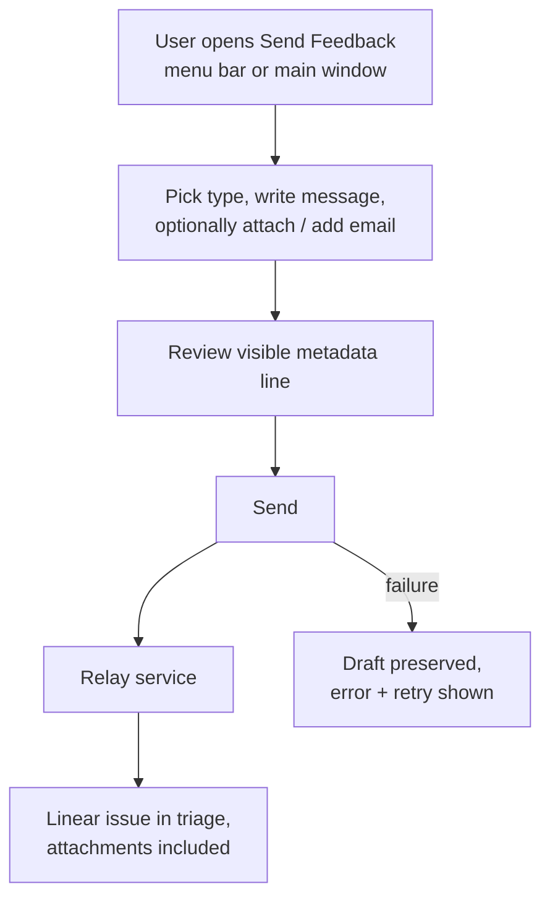
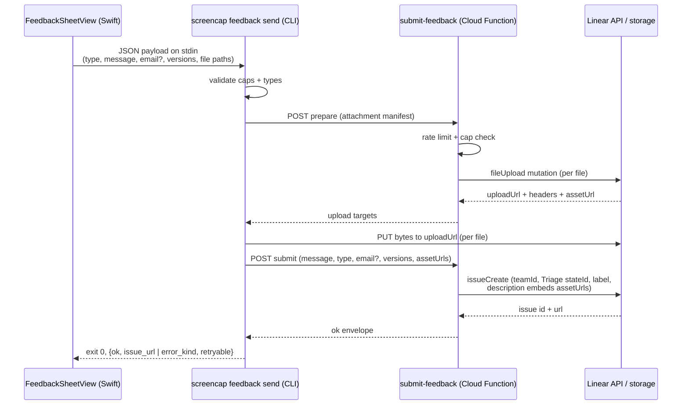

# In-App Feedback Form - Plan

## Goal Capsule

- **Objective:** Ship an in-app surface in the macOS app for sending bug reports, feedback, and feature requests — with screenshot/short-video attachments — before the public launch on 2026-07-20, delivering every submission into the maintainer's Linear triage.
- **Product authority:** The Product Contract below. The Planning Contract and Implementation Units serve it; on conflict, the Product Contract wins.
- **Stop conditions:** Surface any change that would alter product scope (R-IDs) rather than deciding it silently. The launch clock is the binding constraint: anything that would slip past launch moves to the deferred list rather than delaying the release.
- **Open blockers:** None. All formerly open questions are resolved in the Planning Contract.
- **Product Contract preservation:** Changed from the requirements-only version: AE4 amended to tolerate a "daemon: unavailable" metadata line; AE5–AE8 added; R5 clarified to selection-time enforcement of per-file, total, and count caps. Rationale: flow analysis showed the original AE4 wording was untestable in the top bug-report scenario (daemon down), and the cap shape needed a total/count dimension to keep AE2's promise. The brainstorm's "Outstanding Questions — Deferred to Planning" section is resolved into Key Technical Decisions below.

---

## Product Contract

### Summary

One native form inside the ScreenCap app covers all three request types — bug report, feedback, feature request — with user-chosen screenshot and short-video attachments. Submissions are anonymous by default (email optional, prefilled when signed in) and travel through a small vendor-side relay into Linear as triage issues. Reachable from the menu bar dropdown and the main window.

### Problem Frame

The app launches publicly tomorrow with no way for a user to reach the maintainer from inside it — no feedback surface, no support link, nothing. Without a channel, launch-day reactions scatter across Product Hunt comments and ad-hoc email, and most users who hit a bug or want a feature will say nothing at all. The maintainer's explicit goal is that users find it genuinely easy to influence what gets built next.

### Key Decisions

- **Relay into Linear, not direct-from-app or a form vendor.** A Linear credential embedded in the shipped binary could be extracted to spam or read the workspace; a third-party form service would park users' screen captures on a vendor's servers — the wrong posture for a privacy-first screen recorder. A small vendor-side relay (the pattern the product already uses for billing and upload signing) keeps credentials server-side and lands submissions where triage already happens.
- **Anonymous-first.** Zero friction beats follow-up capability: signed-out users submit with no account step. The optional email field (prefilled when signed in, clearable) preserves a follow-up path at no cost to ease.
- **User-chosen attachments only, visible metadata.** The form sends exactly what the user attached plus three version lines it shows before send. No auto-captured screens, no log bundles, nothing from the recording data plane. Consistent with the product's consent-gated egress posture.
- **One-way for v1.** No public roadmap or voting board; users shape direction through what arrives in triage. This keeps the launch build to one form plus one relay.

### Requirements

**Form and entry points**

- R1. A single form covers all three request types — bug report, feedback, feature request — chosen by the user in one picker; there are not three separate surfaces.
- R2. The form is reachable from both the menu bar dropdown and the main window, and opening it never interrupts an active recording.
- R3. Only the request type and a free-text message are required. A user can go from opening the form to sent, text-only, in under a minute.

**Attachments**

- R4. Users can attach screenshots (images) and short video clips via file picker or drag-and-drop. Attachments are always user-chosen; the app never auto-captures or auto-attaches screen content.
- R5. Attachment limits (per-file size, total size, and count) are enforced at selection time with copy that states the limit — never discovered at submit time.

**Identity**

- R6. Signed-out users submit fully anonymously with no account step. When signed in, the email field is prefilled and can be edited or cleared.

**Delivery**

- R7. Each submission arrives as one issue in the maintainer's Linear triage (Screencap team), carrying the message, request type, attachments, and metadata — no secondary inbox to poll.
- R8. The submission auto-includes only app version, daemon version, and macOS version, and the form shows the user this metadata before they send.
- R9. A failed submit preserves the user's draft and offers retry with a visible error naming the actual cause. The form never silently drops a report.

**Privacy and abuse**

- R10. The feedback path reads nothing from the recording data plane — no `recording.db` content, no library screenshots, no window titles, no logs. A user attaching their own exported file is their choice; the app initiates nothing.
- R11. The relay applies basic per-client rate limiting and a request-size cap. No captcha or human-verification step.

### Key Flows

- F1. Submit a report
  - **Trigger:** User picks the feedback item in the menu bar dropdown or main window.
  - **Steps:** Form opens; user picks a type, writes a message, optionally attaches files and adds an email; the metadata line is visible; user sends; a progress state shows while sending; confirmation appears.
  - **Outcome:** One Linear issue in triage with message, type, attachments, and metadata. **Covers R1–R4, R6–R8.**
- F2. Submit fails
  - **Trigger:** Send fails (offline, relay error, rate limit).
  - **Steps:** The draft — text and attachments — stays intact; an error naming the cause appears with retry; a later retry sends normally.
  - **Outcome:** No report is lost silently. **Covers R9.**

### Acceptance Examples

- AE1. **Covers R6.** Given a signed-in user, when the form opens, the email field holds their account email; when they clear it and send, the submission carries no identity.
- AE2. **Covers R5.** Given a video over the size cap, when the user selects it, the form rejects it immediately with copy stating the limit — the send button never becomes the place they learn this.
- AE3. **Covers R9.** Given no network at send time, the draft and attachments remain in the form; when connectivity returns, retry succeeds.
- AE4. **Covers R8.** Given a text-only submission, the resulting Linear issue carries the message plus the metadata lines: app version, macOS version, and daemon version — the daemon line reading "unavailable" when the daemon cannot be reached; submission proceeds regardless.
- AE5. **Covers R6.** Given a signed-in user whose cached auth is stale (email unknown), when the form opens, the email field is empty and the submission behaves as anonymous — no error, no block.
- AE6. **Covers R5.** Given four individually-valid attachments whose combined size exceeds the total cap, when the user adds the fourth, the form rejects that addition at selection time with copy stating the total limit.
- AE7. **Covers R4.** Given a non-image/video file (e.g. a `.log` file) dropped on the form, the form rejects it with copy naming the accepted types — it is never silently dropped or silently attached.
- AE8. **Covers R9.** Given the relay returns rate-limited, the error copy says to try again later and does not present retry as immediately actionable; the draft is preserved.

### Scope Boundaries

**Deferred for later**

- Public roadmap or votable feature-request board — v1 is one-way into triage.
- Drag-and-drop attachment intake (`onDrop`) — deferred to fast-follow; v1 is `NSOpenPanel` file-pick only. `onDrop` is net-new in this app and carries real risk under the launch clock, and NSOpenPanel alone satisfies R4's intent.
- In-form "capture a screenshot / clip now" button using the app's own capture ability — v1 is file-pick only.
- Opt-in diagnostic/log bundles attached to bug reports — the known log-content hazards (raw-URL leakage) need their own scrub design first.
- Replies or status updates surfaced back to the reporter in-app.
- Draft persistence across app restarts — v1 keeps the draft in memory for the app session only.

**Outside this product's identity**

- Telemetry or analytics SDKs — feedback is explicit and user-initiated; nothing here creates a passive data channel.
- Captcha or human-verification friction on submission.
- Client-side install identifiers for rate limiting — a persistent device ID is a telemetry-shaped artifact this product deliberately does not have; limiting is per-IP at the relay.

### Dependencies / Assumptions

- A Linear API credential is available server-side to the relay; it never ships in the app binary.
- The existing cloud project hosting the billing and upload-signing functions (`proteus-photos`, region `southamerica-east1`) can host one more function.
- Demand is anticipatory — launch is tomorrow, so there is no feedback-volume evidence yet. Rate limiting is sized against spam, not scale.
- Anonymous submissions are acceptable to triage without a reply path; the optional email is the only follow-up channel.
- Attachments live on Linear's asset storage once submitted; retention is governed by Linear workspace policy. Anonymous reporters have no deletion path — accepted for v1 since attachment is an explicit user choice.
- Copy is English-only, matching the rest of the app (no localization infrastructure exists).

---

## Planning Contract

### Key Technical Decisions

- KTD-1. **Submit path is Swift form → bundled CLI → relay; Swift makes no cloud HTTPS calls.** The app's standing invariant is that all cloud traffic and token handling live in Python — checkout, portal, and whoami all shell out via `CLIClient` (`macos/ScreenCap/Controllers/CloudAuthController.swift`). The form serializes its payload to JSON and pipes it to a new `screencap feedback send` CLI command via `CLIClient.runJSONRawStdin`. A Swift `URLSession` client would be a new architectural category; not taken.
- KTD-2. **The relay is a new module in this repo:** `scripts/cloud-function/feedback.py`, deployed as a gen2 HTTP function named `submit-feedback` in `proteus-photos` / `southamerica-east1` with `--set-build-env-vars GOOGLE_FUNCTION_SOURCE=feedback.py`, following the docstring-deploy convention of `scripts/cloud-function/billing.py`. Colocated pytest (`scripts/cloud-function/test_feedback.py`).
- KTD-3. **Attachment bytes never pass through the function, and `submit` never trusts client-supplied URLs.** Two-step flow mirroring the repo's signed-URL precedent (`get-upload-urls` → client `requests.put`): (1) `prepare` — the relay validates caps and rate limit, calls Linear's `fileUpload` GraphQL mutation per attachment, and returns per file `{uploadUrl, headers, assetUrl, claim}` where `claim` is a stateless HMAC over `{assetUrl, exp}` signed with a dedicated server-side secret (`FEEDBACK_HMAC_KEY`, distinct from the Linear key); (2) the CLI PUTs each file's bytes directly to Linear's signed `uploadUrl` (copying the returned headers verbatim — GCS signature requirement); (3) `submit` — the relay accepts only assetUrls whose claims verify and are unexpired AND whose parsed hostname is on the Linear upload-host allowlist (`https` scheme, exact-host match, no substring tricks), then creates the issue with those `assetUrl`s embedded as markdown so images/video render inline. Anything else is rejected as `invalid` — an anonymous caller must never be able to render an attacker-chosen URL in the maintainer's triage. This also sidesteps the 32 MiB Cloud Run/gen2 request-body ceiling entirely. **Claim expiry is 60 minutes**, not 15 — the honest slow path matters: a full 60 MB submission on a degraded uplink (this product's own background chunk uploader can be saturating the same link) can take well over 15 minutes, and the claim only gates embedding a prepare-minted Linear asset, so a longer window costs nothing. A claim that still expires mid-upload surfaces at `submit` as the dedicated **`expired`** kind (retryable, KTD-7), not `invalid`; a retry re-runs `prepare` from scratch for the full attachment set (simplest given stateless claims), which is why retries consume prepare budget (KTD-6).
- KTD-4. **Linear routing with a least-privilege credential:** `issueCreate` with an explicit Triage `stateId` (resolved once and set as function config, not relying on team-default behavior), `teamId` for the Screencap team, and a per-request-type label. Auth is a personal API key belonging to a **dedicated Linear account whose access is restricted to the Screencap team** (scoped API key with issue-create/write scopes if the workspace plan supports scopes) — a personal key acts as its user, so the key must not be able to read the rest of the workspace if it leaks. The key lives only in Secret Manager (`--set-secrets`, never `--set-env-vars`, never a real value in the deploy docstring). All user strings travel in the GraphQL `variables` object; the query documents are static constants — no string interpolation into GraphQL. Upstream Linear response bodies are never forwarded to the client and the `Authorization` header is never logged; the client-facing `server` error is opaque. Rate budget (2,500 req/hr) is far above any realistic volume. Issue title: `[<type>] <first line of message, hard-truncated>`.
- KTD-5. **Caps, enforced client-side at selection and revalidated at relay `prepare`:** 25 MB per file, 60 MB total, 5 attachments max. Accepted types: png/jpg/jpeg/gif/heic images; mp4/mov videos. UI copy suggests clips of roughly 30 seconds. The values and the Linear upload-host allowlist are **mirrored** constants — no import mechanism spans the three runtimes (Swift can't import Python; the deployed function `--source scripts/cloud-function/` can't import `src/screencap`), so they live in three homes that must be kept in sync: `macos/ScreenCap/Models/FeedbackModels.swift`, `src/screencap/feedback.py`, and `scripts/cloud-function/feedback.py`. The CLI↔relay pair is the only one testable in one process — a pytest pins their cap and allowlist values equal (U2). Silent drift between copies reproduces exactly the submit-time cap surprise R5 forbids.
- KTD-6. **Rate limiting is in-process per-IP at the function, best-effort by design:** 5 submissions and 5 prepares per hour per IP, plus an hourly per-IP declared-bytes budget (120 MB) on `prepare` so upload capacity can't be minted without submitting; over-budget returns HTTP 429 with a typed `rate_limited` error. Client IP is the **rightmost** `X-Forwarded-For` entry — Google appends the true peer, and reading the first entry would let attackers mint fresh budgets with spoofed leading entries. The counters live in instance memory, so they are **per-instance-lifetime, not a true hourly guarantee**: a gen2/Cloud Run instance scales to zero when idle and is recycled on deploy, minting fresh budgets on each cold start. This is accepted for launch (paired with `--max-instances=2` to bound the multiplier) as a spam speed-bump, not a hard quota; a durable counter is the deferred upgrade if real abuse appears. Retries re-run `prepare` (stateless CLI), so the prepare budget also bounds attachment-bearing retries and failed-submit retries orphan the prior prepare's assets (the same signature U6's runbook watches) — accepted at launch scale. To keep browsers from delivering forged cross-origin submissions that would spend other users' IP budgets, the function **requires `Content-Type: application/json`** (forcing a CORS preflight) and **emits no `Access-Control-Allow-Origin` header**, so a web page cannot POST to it while the CLI is unaffected. No Cloud Armor, no load balancer, no client identifier (see Scope Boundaries). Known IP-limit caveats (shared NAT) accepted at this scale.
- KTD-7. **Typed error taxonomy end-to-end.** The relay returns typed errors (`too_large`, `rate_limited`, `invalid`, `expired`, `server`); the CLI maps transport failures onto the same taxonomy the billing path uses (`requests.ConnectionError`/`Timeout` → `network`, retryable) and adds `rate_limited`. The CLI exits 0 with an `{ok: false, error_kind, retryable}` envelope for all expected failures. `runJSONRawStdin` (the method KTD-1 mandates) actually tolerates non-zero exit (`allowNonZeroExit: true`) and returns stdout regardless — so the exit-0 convention is kept deliberately for consistency with the documented learning (`docs/solutions/integration-issues/cli-json-envelope-nonzero-exit-discards-stdout-2026-07-02.md`) and so no caller ever depends on the tolerant variant, not because this method would drop the envelope. Swift maps **every** kind to distinct copy — R9/U4 forbid a generic "couldn't send": `network` → offline; `server` → something went wrong, retry; `rate_limited` → too many reports, try later; `too_large` → over the limit (prevented client-side; safety net only); `invalid` → couldn't prepare the report, try again (surfaces the relay's field reason when present); `expired` → the upload timed out, try sending again (retryable, re-prepares). Success is keyed on `ok` alone; optional response fields decode as optionals.
- KTD-12. **The send subprocess gets an explicit, payload-scaled wall-clock timeout.** `CLIClient.runJSONRawStdin` defaults to a 10-second timeout and `runOneShot` SIGTERMs the child on overrun — a 60 MB upload takes minutes on a home uplink, so the default would kill every attachment-bearing submission mid-PUT and Swift would see a bare `CLIError.timedOut` with no envelope (violating R9). U3 calls it with a timeout scaled to declared attachment bytes (directional: ~60s base + ~15s per declared MB, floor 120s, cap ~10min) that must exceed worst-case upload time; a subprocess timeout/SIGTERM maps to `network`/retryable copy. The CLI's own per-HTTP-request timeout uses `upload.py`'s actual connect/read tuple `(10, 300)`, not a flat 30s. Residual: a SIGTERM landing between the small `submit` POST reaching the relay and the CLI draining stdout can create an issue the user is told failed; the window is small once the timeout is sized correctly and a retry may duplicate — acceptable for launch, noted for a future idempotency key.
- KTD-8. **Presentation is a sheet on the main window; the menu bar item goes through the notification bridge.** The form renders chrome-free per the `AccountSheetView` embeddable pattern and is presented via `.sheet(item:)` from `MainWindow`. The menu bar "Send Feedback…" button posts a Notification that `MainWindow` observes (the existing MenuBarMenu → MainWindow pattern), activating the main window first when needed. Draft state lives in a controller owned above the sheet, so it survives sheet dismissal for the app session; no disk persistence (a persisted draft would be user text on disk — deliberate v1 exclusion).
- KTD-9. **Metadata collection degrades gracefully and never stalls the form:** app version from `Bundle.main` `CFBundleShortVersionString` (net-new read), macOS version from `ProcessInfo.operatingSystemVersion`, daemon version from `DaemonClient.daemonInfo()` with a literal "unavailable" fallback — the two version schemes are independent and must never be derived from one another (documented learning: `docs/solutions/integration-issues/stale-daemon-after-app-update-http-500-2026-07-02.md`). The daemon fetch runs **asynchronously at form open with a short explicit timeout (~2s)** and renders "unavailable" on timeout — a stale-but-listening daemon that accepts the connection and hangs is exactly the top bug-report scenario, and `daemonInfo()` on the default 10s timeout would otherwise stall form open right when the user is trying to report the daemon is broken (R3's under-a-minute promise). A down or slow daemon never blocks form open or submission (AE4).
- KTD-10. **Email prefill from `AuthStatus.signedIn(email:)` only.** No token access in Swift. When the status is stale or the email nil, the field is empty and the submission is anonymous (AE5). If a non-empty email fails a basic format check, block send with inline copy; empty is always valid.
- KTD-11. **Issue-description rendering is injection-hardened, including the metadata fields.** The user message renders inside a fenced code block (backtick runs escaped); the metadata block is generated server-side below a fixed delimiter heading so a fabricated in-message "metadata block" is visually distinguishable; attachment embeds use server-generated labels (`attachment-1.png`) with the verified assetUrl — client filenames are discarded from the description; the email renders as inline code after format validation. The **version strings (app/daemon/macOS) are client-supplied and render in the metadata block outside the fenced message**, so they are the same injection surface: `submit` validates each against a strict pattern (`[A-Za-z0-9 ().-]{1,64}`, rejected as `invalid` otherwise) and renders them as inline code. This is the rendering surface a malicious submission would use for phishing in the maintainer's triage; harden it structurally rather than by copy review.

### High-Level Technical Design

Text-only submissions skip `prepare` and the PUT leg entirely and go straight to `submit`.

### Assumptions

- Cap values (25 MB / 60 MB / 5 files), rate thresholds, and the ~30-second clip guidance are launch defaults tuned without usage evidence; adjusting them is config-level work, not a redesign.
- Drag-and-drop (`onDrop`) is net-new in this app; if it proves fiddly under the launch clock, `NSOpenPanel` file-pick alone satisfies R4's intent and drag-drop follows fast.
- Linear's `fileUpload` accepts the declared image/video content types at these sizes (no published hard cap); the relay treats a Linear-side rejection as `server`.
- **U0 spike verdict (SCR-281, run 2026-07-20 against the real workspace — GO with adjustments.)** Upload acceptance: a 25 MiB `.mov` (exactly `MAX_FILE_BYTES`), a `.png`, and a `.heic` were all accepted end-to-end (prepare → signed PUT → attach), so the 25/60/5 caps stand. Hosts: `assetUrl` is on `uploads.linear.app` (allowlist assumption held), but the signed **PUT URL is GCS path-style** — `storage.googleapis.com/uploads.linear.app/<path>` — so the upload-target check in both the relay and the CLI now accepts that form pinned to Linear's bucket path (`_upload_target_allowed`). Expiry: the signed upload URL expires **60 seconds** after minting (`X-Goog-Expires=60`, matching Linear's docs); GCS validates the signature at request arrival, so a slow stream that starts in time may finish. Per the ≥-claim-TTL rule, `CLAIM_TTL_SECONDS` was lowered 60 min → **10 min**. Rendering: the `.mov` embed is converted by Linear into a native video-player node and PNG renders as a standard inline image; **HEIC uploads and serves as raw `image/heic`, which Chromium-based Linear clients cannot decode — U4 should transcode HEIC→JPEG client-side before upload** (note added to the remaining-units doc). Spike artifacts live on throwaway issue SCR-284. Residual: the spike ran through Linear's official MCP upload flow (OAuth) because no raw API key existed pre-U6; the raw `fileUpload` mutation is exercised for real by U6's curl-level smoke. Single-vs-two-endpoint: nothing forces smaller caps, so the two-endpoint design stands as planned.
- The unauthenticated relay is this product's first tokenless endpoint; its trust boundary is documented in `SECURITY.md` as part of U1. That section enumerates, concretely: what a forged request can and cannot do (create one triage issue and park bounded bytes; read nothing), the HMAC claim design, the rightmost-XFF IP rule, the browser-CSRF guard (JSON-only content type, no CORS headers), the best-effort per-instance-lifetime rate-counter semantics under `--max-instances=2`, the least-privilege Linear account and dedicated runtime service account, the outbound-PII posture (message, optional user-clearable email, attachments, and version metadata terminate at Linear under Linear's retention policy; anonymous reporters have no deletion path — accepted v1 residual), and the accepted residual risks (declared-only content-type verification; shared-NAT IP limiting) — so the Definition of Done item is checkable rather than vibes.

---

## Implementation Units

### U1. Relay Cloud Function: prepare + submit

- **Goal:** A deployable `submit-feedback` function that validates, rate-limits, mints Linear upload targets, and creates triage issues.
- **Requirements:** R7, R8, R11; KTD-2 through KTD-7, KTD-11.
- **Dependencies:** None (first unit).
- **Files:** `scripts/cloud-function/feedback.py` (new), `scripts/cloud-function/test_feedback.py` (new), `scripts/cloud-function/requirements.txt` (add `requests>=2` — the Linear GraphQL client; currently only a transitive dep, so the function would work by accident and break on a future dep bump), `SECURITY.md` (document the unauthenticated relay's trust boundary), `docs/runbooks/cloud-auth-setup.md` or a sibling runbook section for the new function's config.
- **Approach:** Single HTTP function routing on an `action` field (`prepare` | `submit`). Reject any request whose `Content-Type` is not `application/json` (typed `invalid`) and any body over 64 KB before parsing (KTD-6 browser-CSRF guard; the JSON control plane carries no file bytes); cap message length (10,000 chars) and manifest entries at parse time. `prepare`: enforce per-file/total/count caps, content-type allowlist, and the KTD-6 per-IP request + declared-bytes budgets; call Linear `fileUpload` per attachment; return upload targets with HMAC claims (KTD-3). `submit`: field validation (type enum, message non-empty, email format if present, version strings against the KTD-11 pattern), claim + host-allowlist verification per assetUrl (KTD-3), injection-hardened description assembly (KTD-11), `issueCreate` per KTD-4 (static query documents, user strings only in `variables`); return `{ok, issue_url}` or typed error with no upstream response text. Config via Secret Manager: `LINEAR_API_KEY`, `FEEDBACK_HMAC_KEY`; env: `LINEAR_TEAM_ID`, `LINEAR_TRIAGE_STATE_ID`, label ids. Deploy per the `billing.py` docstring convention with `--max-instances=2`, small `--memory`, `--set-secrets` for both secrets (never a real value in the docstring), and a **dedicated runtime service account** (`screencap-feedback@proteus-photos`) holding only `roles/secretmanager.secretAccessor` scoped to the two secrets — the default compute SA's broad project roles must not sit behind the product's only tokenless internet-facing endpoint; SA-creation commands go in the docstring per the `billing.py` precedent.
- **Patterns to follow:** `scripts/cloud-function/billing.py` (module shape, docstring deploy, env config, error responses), `scripts/cloud-function/main.py` (signed-URL minting shape), `scripts/cloud-function/auth.py` only as a non-example — this endpoint is deliberately tokenless.
- **Test scenarios:**
  - Happy path: `submit` with no attachments creates an issue with title `[Bug] …`, Triage state id, correct label, metadata block in description.
  - Happy path: `prepare` for two valid files returns two upload targets; `submit` with their assetUrls embeds both as markdown.
  - Covers AE6/AE2 (server side): `prepare` rejects a 30 MB file (`too_large`), a 6th attachment (`invalid`), and a 70 MB total (`too_large`).
  - Covers AE7 (server side): `prepare` rejects `text/plain` content type (`invalid`).
  - Covers AE8: requests over the per-IP threshold get 429 `rate_limited`; under-threshold requests from a different IP succeed.
  - Error path: Linear API failure (5xx / GraphQL errors) maps to `server`, no partial issue is created on `submit` failure, and the client-facing body contains none of the upstream response text.
  - Validation: missing message, unknown type, malformed email each return `invalid` with a field name; a body over 64 KB and an over-long message are rejected before any Linear call.
  - Security — assetUrl trust (KTD-3): a tampered claim, an expired claim, a non-Linear host, and an `http://` scheme are each rejected as `invalid`; only prepare-minted, unexpired, allowlisted assetUrls reach the description.
  - Security — GraphQL (KTD-4): for a message containing `"`, `\`, `${`, and `mutation{`, the posted `query` document is byte-identical to the static constant and the user text appears only under `variables`.
  - Security — rendering (KTD-11): a message containing a fence break, ``, and a fake `App version:` line renders entirely inside the fenced block; a filename like `](http://evil)` never appears in the description; a **version field** containing `` and a fence break is rejected as `invalid` and never renders as markup.
  - Security — transport (KTD-6): a request with `Content-Type: text/plain` is rejected as `invalid` before parsing; no `Access-Control-Allow-Origin` header is emitted on any response.
  - Security — rate limiting (KTD-6): a request with `X-Forwarded-For: 1.2.3.4, 5.6.7.8` is counted against `5.6.7.8`; spoofed leading entries do not mint fresh budgets; the declared-bytes budget rejects with `rate_limited`.
  - Claim lifecycle (KTD-3): an expired claim at `submit` returns `expired` (not `invalid`); a tampered claim returns `invalid`.
- **Verification:** `pytest scripts/cloud-function/test_feedback.py` green with Linear fully mocked; function deploys with the docstring command; a manual smoke submission against the real function creates a Linear issue in Triage (part of U6).

### U2. CLI command: `screencap feedback send`

- **Goal:** The Python client that carries a submission from stdin JSON to the relay, including the direct-to-Linear attachment PUTs.
- **Requirements:** R7, R9, R10; KTD-1, KTD-3, KTD-7.
- **Dependencies:** U1 (envelope shapes; can develop in parallel against the agreed schema).
- **Files:** `src/screencap/feedback.py` (new), CLI wiring in the existing command-group module (mirror how other command groups register), `tests/test_feedback.py` (new).
- **Approach:** Read the payload JSON from stdin (type, message, email, attachment paths, versions collected by Swift). Re-validate caps/types (shared constants with the relay's values). Call `prepare`, PUT each file to its `uploadUrl` with the returned headers verbatim, call `submit` echoing the claims. Before any PUT, validate the `uploadUrl`: `https` scheme and hostname on the same Linear upload-host allowlist the relay uses (shared constant) — a compromised or buggy relay must not be able to redirect the user's media elsewhere; refuse with `server` otherwise. TLS verification stays on everywhere (no `verify=False`, ever); the returned headers are applied only to that PUT. Map errors per KTD-7 and always exit 0 with an `{ok, error_kind, retryable}` envelope for expected failures; timeout 30s per request matching `upload.py`. Heavy imports deferred inside the command body per repo convention.
- **Execution note:** Assert the exit-0-with-`ok:false` contract at the real subprocess/CLI level, not only via in-process fakes — fakes bypass the exit-code coupling that hid a prior bug.
- **Patterns to follow:** `src/screencap/upload.py` (requests error mapping, timeout, signed-URL PUT at `upload.py:1072`, module-local `requests` reference for monkeypatching), `tests/test_upload.py` (mock seam).
- **Test scenarios:**
  - Happy path: full payload with two attachments → prepare, two PUTs with verbatim headers, submit; envelope carries `ok: true` and the issue URL.
  - Text-only payload skips prepare/PUT and goes straight to submit.
  - Covers AE3: `requests.ConnectionError` on submit → exit 0, `{ok: false, error_kind: "network", retryable: true}`.
  - Covers AE8: relay 429 → `error_kind: "rate_limited"`, `retryable: false` with retry-later semantics.
  - Oversize file path at CLI validation → `too_large` without any network call.
  - A failed PUT (signed URL rejected) → typed error, no `submit` call, no partial issue.
  - A `prepare` response carrying an `http://` or non-allowlisted `uploadUrl` → typed error, no bytes sent.
  - Covers R10: the command touches only the exact user-supplied file paths — no reads under `~/.screencap/recordings/` or of `recording.db` (assert via the mocked filesystem/network surface). Mark this test `@pytest.mark.privacy` so it runs on CI (CI runs only the privacy lane).
  - Mirrored constants (KTD-5): a test importing both `src/screencap/feedback.py` and `scripts/cloud-function/feedback.py` asserts their cap values and upload-host allowlist are equal — the only cross-runtime pair testable in one process; drift fails the build.
- **Verification:** `pytest tests/test_feedback.py` green; `screencap feedback send --json < payload.json` against a stubbed relay returns the envelope with exit 0 in both success and expected-failure cases.

### U3. Swift controller and service seam

- **Goal:** A testable `FeedbackController` owning draft state, metadata collection, submission lifecycle, and error mapping.
- **Requirements:** R3, R6, R8, R9; KTD-7 through KTD-10.
- **Dependencies:** U2 (CLI envelope schema).
- **Files:** `macos/ScreenCap/Controllers/FeedbackController.swift` (new), `macos/ScreenCap/Models/FeedbackModels.swift` (new: payload, envelope, error-kind, state enum), `macos/ScreenCapTests/FeedbackControllerTests.swift` (new), `macos/ScreenCapTests/FakeFeedbackService.swift` (new).
- **Approach:** `@MainActor final class FeedbackController: ObservableObject` with `@Published private(set) var state` (`idle / sending / success(issueURL?) / failure(kind)`) mirroring `ClipExportController`'s state-enum pattern. A `FeedbackService` protocol wraps `CLIClient.runJSONRawStdin` so tests inject a fake; the call passes the KTD-12 payload-scaled wall-clock timeout (not the 10s default, which would SIGTERM every attachment upload) and maps a subprocess timeout to `network`/retryable. Draft (type, message, email, attachments) lives on the controller, which is owned by `MainWindow` scope — surviving sheet dismissal for the session; attachment add/remove are controller operations so a mis-attached file can be dropped before send. Metadata: app version via `Bundle.main`, macOS via `ProcessInfo`, daemon via `DaemonClient.daemonInfo()` fetched async at open with a ~2s timeout → "unavailable" on failure/timeout (KTD-9), never blocking open or send. Every error kind in KTD-7 (`network`/`server`/`rate_limited`/`too_large`/`invalid`/`expired`) maps to distinct copy — no generic fallback. Email prefill from `CloudAuthController.status` when `.signedIn` with non-nil email. Selection-time attachment validation (caps, types) lives here as pure functions.
- **Patterns to follow:** `macos/ScreenCap/Controllers/ClipExportController.swift` (state enum), `CloudAuthController` + `FakeCloudAuthService` in `macos/ScreenCapTests/CloudAuthControllerTests.swift` (protocol seam + fake), `AccountSheetPolicy` (pure state-derivation tests).
- **Test scenarios:**
  - Covers AE1/AE5: prefill logic — signed-in with email prefills; stale/nil email yields empty field; cleared email sends no identity.
  - Covers AE2/AE6/AE7: selection validation rejects an oversize file, a total-cap breach on the Nth file, a count-cap breach, and a `.log` file — each with a distinct reason the view can render.
  - Attachment removal: adding then removing a valid file leaves the draft sendable; removing the last file returns to text-only.
  - Covers AE4: daemon info timeout/failure yields metadata with "unavailable" daemon line and submission proceeds; form open is not blocked by a hanging daemon.
  - Covers AE3/AE8: fake service returning each error kind — including `invalid` and `expired` — maps to the right `failure(kind)` with distinct copy; draft content is intact after failure; success from `idle` only after a real send.
  - Envelope decoding: `ok: true` with nil optional fields is success (never gate on nullable fields).
  - Sending state transitions: send → `.sending` → success clears the draft; failure preserves it.
- **Verification:** `cd macos && xcodegen generate && xcodebuild test -only-testing:ScreenCapTests` green (regenerate the project after adding files).

### U4. Feedback sheet view

- **Goal:** The chrome-free form UI: type picker, message, email, attachments with selection-time rejection copy, visible metadata, progress, success, and per-kind error copy.
- **Requirements:** R1, R3, R4, R5, R8, R9; KTD-5, KTD-7, KTD-8.
- **Dependencies:** U3.
- **Files:** `macos/ScreenCap/Views/Feedback/FeedbackSheetView.swift` (new), small additions to `macos/ScreenCap/Views/MainWindow.swift` (sheet presentation wiring).
- **Approach:** Embeddable body per the `AccountSheetView` pattern (no window-chrome assumptions). Attachment intake via `NSOpenPanel` for launch (established idiom, presented on main thread per the `ClipsView` note); drag-and-drop is deferred to fast-follow (see Scope Boundaries — net-new `onDrop` with real risk under the launch clock, and NSOpenPanel alone satisfies R4). The attachment list has a per-row remove control so a mis-attached file can be dropped before send. Rejection copy inline at the attachment list. Metadata rendered as a small always-visible line above Send. Sending state: indeterminate progress, Send disabled; interactive dismissal (Esc / outside-click) is **disabled while `.sending`** so an accidental gesture can't silently abort an in-flight upload — cancel is the explicit Cancel button, which returns to the editable draft. In the idle draft state, dismissal is harmless (draft preserved for the session). Success state shows the created issue as a copyable link, offers Done (dismiss), and clears the draft. Error copy per kind names the concrete next step (offline / retry / try later / too large / couldn't prepare / timed out) — never one generic "couldn't send".
- **Patterns to follow:** `macos/ScreenCap/Views/Account/AccountSheetView.swift` (embeddable body, error section with retry re-running the failed action), `macos/ScreenCap/Views/Settings/PrivacySettingsView.swift` (NSOpenPanel usage).
- **Test scenarios:** View logic beyond the controller's pure functions is thin; cover any view-model derivations (e.g. send-button enablement: requires type + non-empty message + not sending) as policy tests in U3's test file. `Test expectation: view chrome itself manual-QA only — SwiftUI presentation and drag-drop are not unit-testable in this harness.`
- **Verification:** Build succeeds; manual walkthrough of F1 and F2 states (see U6 QA checklist).

### U5. Entry points: menu bar and main window

- **Goal:** "Send Feedback…" reachable from the menu bar dropdown and the main window, opening the same sheet.
- **Requirements:** R2; KTD-8.
- **Dependencies:** U4.
- **Files:** `macos/ScreenCap/Views/MenuBarMenu.swift` (new button), `macos/ScreenCap/Views/MainWindow.swift` (notification observer + presentation), the notification-name constants file the existing menu→window bridge uses.
- **Approach:** Menu bar button posts the app's existing cross-scene Notification (pattern documented at `MenuBarMenu.swift:10-22`), which activates the main window if needed and presents the sheet. Main-window entry: a sidebar-adjacent affordance or toolbar/menu item presenting the same sheet — follow wherever the Account entry point lives today. No new window scene (avoids the `WindowGroup` singleton pitfall entirely; documented learning: `docs/solutions/ui-bugs/swiftui-windowgroup-vs-window-singleton-scene-2026-05-18.md`).
- **Test scenarios:** `Test expectation: none — MenuBarExtra button actions are not unit-testable in this XCTest harness (documented learning); covered by the U6 manual QA checklist, including the zero-window .accessory state.`
- **Verification:** Manual: both entry points open the form; menu-bar entry works when the main window is closed; opening during an active recording leaves the recording untouched.

### U0. Linear API pre-flight spike

- **Goal:** Verify the attachment architecture against the real Linear API before any unit is built, since KTD-3/KTD-5 rest on unverified external behavior the day before launch.
- **Requirements:** De-risks KTD-3, KTD-5.
- **Dependencies:** A throwaway Linear API key on the target workspace.
- **Files:** A one-off script (scratch, not committed).
- **Approach:** Exercise `fileUpload` + `issueCreate` against the real workspace with a 25 MB `.mov`, a `.png`, and a `.heic`: confirm upload acceptance at these sizes, the `assetUrl`/`uploadUrl` shape and the signed-URL expiry window (must be ≥ the 60-min claim, else lower the claim to match), and that all three render inline in the issue description. If Linear rejects a type or size, lower KTD-5's caps to fit before writing U1 — the alternative (discovering it at U6 after everything is built) leaves no time to re-architect.
- **Test scenarios:** `Test expectation: none — throwaway verification spike; its output is a go/adjust decision on KTD-5's constants.`
- **Verification:** A documented go/adjust decision recorded in the plan's Assumptions before U1 starts.

### U6. Deploy, configure, and end-to-end verification

- **Goal:** The relay live in production with Linear config resolved, and one verified end-to-end submission.
- **Requirements:** R7; KTD-2, KTD-4.
- **Dependencies:** Operational half (steps below through curl-level smoke) depends only on U1 — run it in parallel with U2–U5, not after, so the highest-variance external unknowns (does the workspace plan support scoped keys? SA provisioning, Secret Manager wiring, gen2 deploy quirks) surface early. The end-to-end QA checklist depends on U1–U5.
- **Files:** No new source; runbook section from U1; Linear workspace configuration (API key, resolved team/Triage-state/label ids into function config).
- **Approach:** Provision the dedicated least-privilege Linear account (access restricted to the Screencap team) and create its API key (scoped, if the plan supports scopes); create the `screencap-feedback` runtime service account; generate `FEEDBACK_HMAC_KEY` with `openssl rand -base64 32` (≥256-bit random — a weak value makes claims offline-forgeable); resolve `teamId`, Triage `stateId`, and the three label ids via a one-off GraphQL query; deploy with the docstring command (`--max-instances=2`, `--set-secrets`, `--service-account`); curl-smoke `prepare`/`submit`. Add runbook lines for Linear-key revocation, HMAC-key rotation (rotation voids unexpired claims — clients simply re-prepare), and where to watch Linear storage usage (orphaned prepare-without-submit uploads are the expected abuse signature). **Delivery vehicle:** the app changes reach users through the separate `macos-app-release` track (build/sign/notarize/DMG) — name its owner on the launch timeline; this plan does not itself cut the release.
- **Test scenarios:** `Test expectation: none — operational unit; verification below is the coverage.`
- **Verification:** Manual QA checklist, from a built app: (1) text-only bug report arrives in Linear Triage with correct label and metadata block; (2) submission with a screenshot and a short clip renders both inline on the issue; (3) signed-out submission is anonymous; signed-in shows prefilled email; (4) offline send shows the offline error and retry succeeds when back online; (5) oversize and wrong-type files rejected at selection; (6) menu-bar entry with main window closed; (7) hammering submissions triggers the 429 copy.

---

## Open Questions

**Resolve before / during U0**

- **Single-shot vs. two-endpoint attachment design.** The `prepare`/`submit` split with HMAC claims exists only because the 60 MB total cap exceeds the 32 MiB Cloud Run request ceiling. A smaller total cap (e.g. one file under ~25 MB) would still satisfy R5 and collapse the design to one endpoint — no claim minting, no second secret, no client-side URL validation — meaningfully less surface to get right before launch. The plan keeps the two-endpoint design because it follows the repo's existing signed-URL precedent (`get-upload-urls`) and the security rationale (bytes never touch the function) is sound; but this is a launch-scope fork worth a conscious call, and the U0 spike may force it either way. If simplified, KTD-3/KTD-6 collapse accordingly and the claim/allowlist test scenarios drop.

**Deferred to implementation**

- Exact attachment size-cap values, pending the U0 spike's Linear-limit findings.
- Exact naming and placement of the two entry points (embeddable-sheet pattern chosen — KTD-8).

---

## Verification Contract

| Gate | Command / check | Proves |
|---|---|---|
| Linear pre-flight (U0) | one-off spike script against the real workspace | KTD-3/KTD-5 attachment assumptions before any unit is built |
| Relay tests | `pytest scripts/cloud-function/test_feedback.py` | U1 validation, routing, rate limit, injection hardening, Linear mapping (Linear mocked) |
| CLI tests | `pytest tests/test_feedback.py` | U2 envelope contract, error taxonomy, PUT-host allowlist, R10 privacy guard, mirrored-constants equality |
| Privacy lane | `pytest -m privacy` | The R10 no-recording-data-egress test runs on CI (CI runs only this lane) |
| Swift tests | `cd macos && xcodegen generate && xcodebuild test -only-testing:ScreenCapTests` | U3 controller, prefill, validation, per-kind error mapping, timeout mapping |
| Manual QA | U6 checklist against the deployed function | End-to-end delivery, entry points, failure UX |

Notes: run the full local suite (`pytest tests/`) before shipping; only privacy-marked tests gate CI. The Swift suite has one known flaky daemon-reconnect test unrelated to this work.

## Definition of Done

- The U0 spike ran and its go/adjust decision on KTD-5's caps is recorded in Assumptions before U1 started.
- All of U1–U6 complete; every AE (AE1–AE8) is covered by a passing automated test or an executed U6 manual-QA step.
- All Verification Contract gates green; the R10 guard test is `@pytest.mark.privacy`-marked and passes in the privacy lane.
- One real submission (with attachments) verified as a Linear issue in the Screencap team's Triage with inline-rendered media.
- `SECURITY.md` documents the unauthenticated relay's trust boundary per the U1 enumeration.
- The single-vs-two-endpoint Open Question is resolved (kept or collapsed) rather than left open.
- No abandoned or experimental code from dead-end approaches remains in the diff.
- The Product Contract preservation note in the Goal Capsule reflects any further product-scope changes made during implementation (expected: none).
