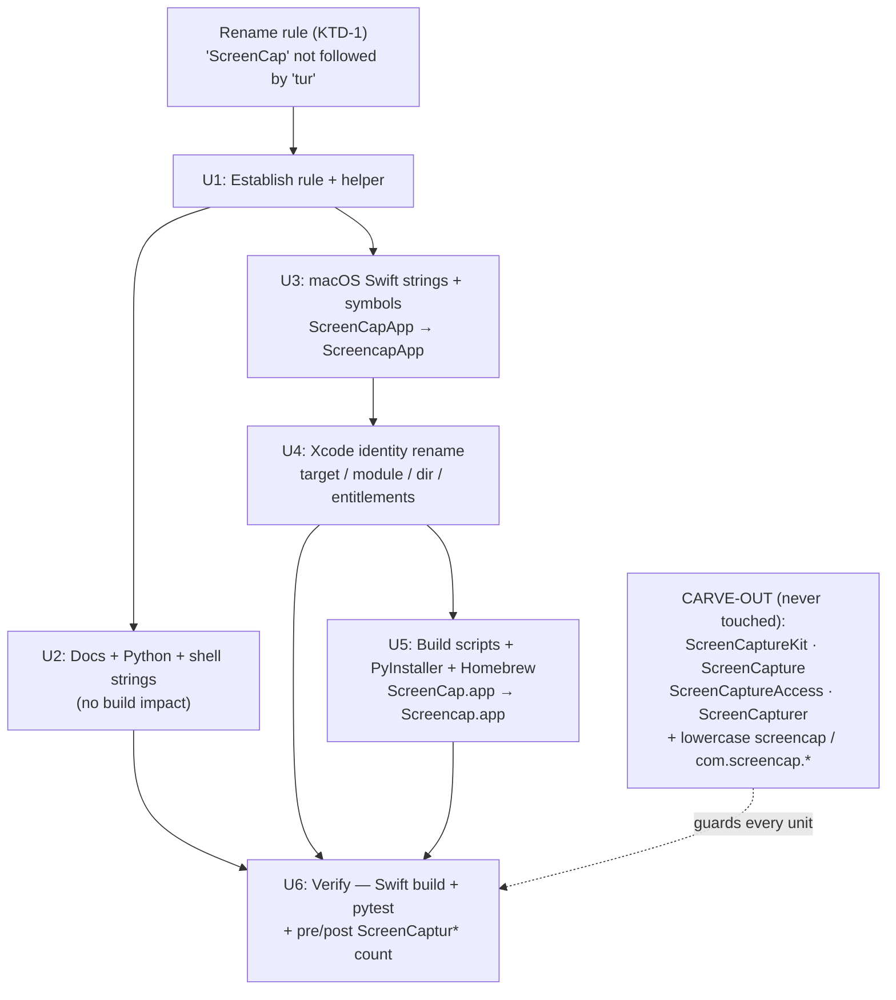

# refactor: Rename brand ScreenCap → Screencap everywhere

**Product Contract preservation:** No upstream requirements doc — direct planning (`ce-plan-bootstrap`). Scope inferred from the one-line request and repo recon; inferred bets are captured in [Assumptions](#assumptions).

---

## Summary

Rename the product brand from the CamelCase token `ScreenCap` to `Screencap` across the entire repository — docs, Python strings, Swift source, the macOS Xcode target/module/directory, build/sign/notarize scripts, the PyInstaller spec, and the Homebrew formula. The rename is a pure capitalization change of one exact token; it does **not** touch the already-lowercase `screencap` identifiers (CLI command, Python package, reverse-DNS bundle IDs) and it must **not** touch Apple/system tokens that merely share the `ScreenCap` prefix (`ScreenCaptureKit`, `ScreenCapture`, `ScreenCaptureAccess`, `ScreenCapturer`).

The work is mechanical but cross-cutting and build-breaking if done naively: a blind find-replace corrupts 125 Apple-API occurrences and desyncs runtime TCC-row-matching strings from the app's `CFBundleName`. The plan isolates the risky macOS module/directory rename into its own unit and gates completion on a green Swift build + Python test suite.

---

## Problem Frame

The brand is spelled inconsistently. The canonical name should be **Screencap** (one capital), but the repo uses **ScreenCap** (two capitals) in 2,532 places: user-facing UI strings, the app bundle name (`ScreenCap.app`), the Xcode target/module/directory (`macos/ScreenCap/`, `struct ScreenCapApp`, target `ScreenCapTests`), CLI help/console text, Info.plist display names, build scripts, and ~300 markdown docs.

Three tokens must be distinguished because they are spelled similarly but mean different things:

| Token family | Examples | Action |
| --- | --- | --- |
| **Brand (CamelCase)** | `ScreenCap`, `ScreenCap.app`, `ScreenCapApp`, `ScreenCapTests`, `ScreenCapDaemonInstalledAndRunning`, `ScreenCapDerivedData` | **Rename** → `Screencap…` |
| **Apple / system / generic-word** | `ScreenCaptureKit`, `ScreenCapture` (TCC service + `SCScreenCapture`), `ScreenCaptureAccess` (`CGRequest/CGPreflightScreenCaptureAccess`), `ScreenCapturer`, `NSScreenCaptureUsageDescription` | **Keep verbatim** |
| **Already-lowercase identifiers** | `screencap` (CLI cmd), `src/screencap/` (Python pkg), `com.screencap.*` (bundle IDs), `com.screencap.daemon.plist`, `screencap-cli.entitlements`, `screencapture` (`/usr/sbin/screencapture`) | **Not in scope** — a different token, not "ScreenCap" |

The distinguishing rule is exact and mechanical: **rename `ScreenCap` only when it is NOT immediately followed by `tur`.** Every Apple/generic token to preserve begins `ScreenCaptur…`; no brand token does. Validated against the full tree: 2,532 brand hits vs. 125 `ScreenCaptur*` hits, with zero overlap.

---

## Requirements

- **R1** — Every CamelCase `ScreenCap` brand occurrence becomes `Screencap`, preserving the following character's case (`ScreenCapApp` → `ScreencapApp`, `ScreenCapTests` → `ScreencapTests`).
- **R2** — No `ScreenCaptur…` token is modified (Apple frameworks, TCC service names, request/preflight APIs, the `ScreenCapturer` engine class). Verified by a post-rename count of `ScreenCaptur*` that equals the pre-rename count (125).
- **R3** — Already-lowercase `screencap` identifiers are untouched: the CLI command, the `src/screencap/` package, `com.screencap.*` bundle IDs, `com.screencap.daemon.plist`, `screencap-cli.entitlements`, and `/usr/sbin/screencapture` invocations all keep their exact spelling.
- **R4** — The macOS app builds and its tests pass after the target/module/directory rename (`Screencap.app`, module `Screencap`, `macos/Screencap/`, target `ScreencapTests`).
- **R5** — Runtime strings that must match the app's `CFBundleName` for TCC row identification stay in sync — when `CFBundleName`/`CFBundleDisplayName` become `Screencap`, the expected-name strings in `PermissionController` (and the daemon's PyInstaller `CFBundleName`) change with them.
- **R6** — The Python test suite passes (no branding string assertions left stale).
- **R7** — Build/sign/notarize/clean scripts, the PyInstaller spec, and the Homebrew formula reference the renamed app (`Screencap.app`, `Screencap.icns`) and process name (`pkill -x Screencap`).

**Success criteria:** `git grep -nE 'ScreenCap([^t]|t[^u]|tu[^r]|$)'` returns only intentional matches (ideally none); `git grep -c ScreenCaptur | <sum>` is unchanged at 125; `pytest tests/` is green; the macOS scheme builds and `ScreencapTests` passes.

---

## Key Technical Decisions

- **KTD-1 — Carve-out by lookahead, not by allow-list.** Drive every replacement with the rule "`ScreenCap` not followed by `tur`" rather than hand-listing files. A single unambiguous rule is auditable (the pre/post `ScreenCaptur*` count is the proof) and avoids missing occurrences in the ~300 doc files. Rationale: local recon confirmed the rule partitions all 2,657 prefix occurrences cleanly.
- **KTD-2 — Full Xcode identity rename, bundle IDs unchanged.** "Every place" includes the app product name, Swift module, `@main` symbol, source directory, and test target. Rename all of these to `Screencap`. Do **not** change `PRODUCT_BUNDLE_IDENTIFIER` (`com.screencap.macos`) or the daemon reverse-DNS label — they are lowercase `screencap`, a different token (R3), and changing a bundle ID silently orphans existing TCC/Keychain grants. Rationale: the visible identity is the brand; the reverse-DNS ID is infrastructure the user did not ask to rename.
- **KTD-3 — App bundle filename changes to `Screencap.app`.** `PRODUCT_NAME: Screencap` renames the built artifact, which cascades to scripts (`pkill -x Screencap`, `/Applications/Screencap.app`), the `.icns` filename, and DerivedData paths. Accept this cascade; it is required for a consistent rename. Note the operational consequence: an installed `ScreenCap.app` and a new `Screencap.app` are distinct bundles to macOS (Spotlight/TCC), so testers reinstall rather than upgrade in place.
- **KTD-4 — Sequence directory/module rename last-but-one, verification last.** Do the low-risk prose/string renames first (no build impact), then the coupled Xcode target/module/directory rename as one atomic unit, then scripts, then a dedicated build+test verification unit. Rationale: keeps each commit bisectable and isolates the one unit that can break compilation.
- **KTD-5 — Use `git mv` for directory/file renames.** Preserve history on `macos/ScreenCap/` → `macos/Screencap/`, `ScreenCapTests/` → `ScreencapTests/`, `ScreenCap.entitlements`, `ScreenCap.icns`. The `.xcodeproj` is generated by XcodeGen and gitignored — it is regenerated from `project.yml`, not renamed by hand.

---

## High-Level Technical Design

The rename fans out from one rule into five dependency-ordered surfaces. Content surfaces (docs, Python, Swift strings) are independent and low-risk; the Xcode-identity surface is the single build-coupled node that everything downstream (scripts, packaging) depends on.

**Verification invariant.** Before and after the whole rename, `git grep -c ScreenCaptur` summed across files must equal **125**. Any drift means a carve-out token was corrupted — fail the unit.

---

## Implementation Units

### U1. Establish the rename rule and a guarded replacement helper

**Goal:** Make the carve-out rule executable so every later unit applies it identically and the invariant is checkable.

**Requirements:** R1, R2, R3

**Dependencies:** none

**Files:**
- `scripts/rename-brand.sh` (new, temporary tooling — remove before final commit OR keep under `scripts/` per repo convention; see Execution note)

**Approach:** A small helper that, given a set of paths, replaces `ScreenCap` → `Screencap` using a negative-lookahead on `tur` (e.g. Perl `s/ScreenCap(?!tur)/Screencap/g`). It must operate on file contents and be safe to run repeatedly (idempotent — `Screencap` contains no `ScreenCap`). Provide a companion check that prints the summed `ScreenCaptur*` count so any unit can assert it stayed at 125. The helper is a convenience for the mechanical bulk; hand edits are fine for small files.

**Execution note:** This is tooling/config, not product behavior. Prefer to keep the script out of the permanent tree — the repo's memory note says "scripts dir is not for test scripts." Land it under the scratchpad or delete it in U6; do not ship rename tooling as a durable artifact unless the reviewer asks.

**Patterns to follow:** Existing `scripts/*.sh` shell style (`set -euo pipefail`, `--dry-run` flag as in `scripts/clean-dev-builds.sh`).

**Test scenarios:** `Test expectation: none — throwaway tooling.` Validate by dry-run diff inspection, not unit tests. Manually confirm on a sample: `ScreenCaptureKit` and `ScreenCapturer` are left unchanged; `ScreenCapApp` and `ScreenCap.app` are changed.

**Verification:** Running the check helper on the untouched tree prints `125` for `ScreenCaptur*`; a dry-run over one Swift file shows only brand tokens flagged.

---

### U2. Rename brand strings in docs, Python, and shell prose

**Goal:** Update all non-macOS-build surfaces — markdown docs, Python user-facing strings, top-level branding files — where the rename has no compilation impact.

**Requirements:** R1, R2, R3, R6

**Dependencies:** U1

**Files (representative — apply the rule tree-wide within these roots):**
- `README.md`, `CLAUDE.md`, `SECURITY.md`, `CHANGELOG.md`, `STRATEGY.md`, `benchmarks/README.md`
- `screencap-support-ops-outreach-strategy.md`, `.claude/2026-02-20-screencap-build-report.md`
- `docs/**/*.md` (plans, brainstorms, research, solutions, competitive, runbooks, tickets, todos — ~300 files, historical but in-scope per "every place")
- `.claude/skills/macos-app-release/SKILL.md`, `.claude/skills/screencap-redaction/SKILL.md`
- `src/screencap/cli/__init__.py` and other `src/screencap/**/*.py` console/help strings (e.g. `auth_pages.py`, `session.py`, `menubar.py`, `container.py`, `recorder.py`, `mcp/server.py`, `daemon/*.py`, `engine/**`)
- `tests/**/*.py` string assertions that reference the brand (e.g. `tests/test_privacy_settings_deeplink.py`, `tests/daemon/*`)

**Approach:** Bulk-apply the U1 rule to the roots above. In Python, the rename hits only string literals, comments, and docstrings — no identifiers (the package is lowercase `screencap`). Watch for `tests/` assertions that hardcode the expected brand string; they must change in lockstep with the source string they assert on. Do **not** touch `ScreenCaptureKit`/`ScreenCapture…` mentions in comments (the carve-out applies to prose too, for accuracy about Apple APIs).

**Patterns to follow:** Existing console output uses `rich` markup like `[bold]ScreenCap Settings[/bold]` → `[bold]Screencap Settings[/bold]`; keep markup intact.

**Test scenarios:**
- Happy path: `pytest tests/` passes with no branding-assertion failures.
- Edge: a Python string embedding an Apple term (e.g. a comment mentioning `CGRequestScreenCaptureAccess`) is unchanged — grep confirms `ScreenCaptur*` count in `src/` + `tests/` is unchanged.
- Edge: `docs/` files containing both brand and Apple tokens (e.g. `macos/README.md` has both `ScreenCap.app` and `CGRequestScreenCaptureAccess`) rename only the brand.

**Verification:** `git grep -nE 'ScreenCap([^t]|t[^u]|tu[^r]|$)' -- 'src/**' 'docs/**' '*.md'` is empty; `pytest tests/` green; `ScreenCaptur*` count unchanged.

---

### U3. Rename brand strings and Swift symbols in macOS source

**Goal:** Rename in-file brand occurrences inside `macos/ScreenCap/` and `macos/ScreenCapTests/` — UI strings, Info.plist display names, comments, and the Swift symbols (`ScreenCapApp` → `ScreencapApp`) — **without yet moving files or renaming the target/module**.

**Requirements:** R1, R2, R5

**Dependencies:** U1 (kept separate from U4 so the content diff is reviewable apart from the mechanical `git mv`)

**Files (representative):**
- `macos/ScreenCap/ScreenCapApp.swift` — `struct ScreenCapApp` → `struct ScreencapApp`, `Window("ScreenCap", …)` → `Window("Screencap", …)`, accessibility labels
- `macos/ScreenCap/Info.plist` — `CFBundleName`/display strings, `NSMicrophoneUsageDescription`, `NSCameraUsageDescription` (keep `NSScreenCaptureUsageDescription` **key** verbatim; its human-readable value text renames)
- `macos/ScreenCap/Controllers/PermissionController.swift` — the returned expected-name string `"ScreenCap"` → `"Screencap"` (R5: must match `CFBundleName`)
- `macos/ScreenCap/Views/Onboarding/OnboardingPermissionsStep.swift` — comments referencing `"ScreenCap"` and the already-`Screencap`-cased `"ScreencapDaemon"` daemon row
- All other `macos/ScreenCap/**/*.swift` and `macos/ScreenCapTests/**/*.swift` brand strings/comments

**Approach:** Apply the U1 rule to file **contents** only under both macOS source dirs. The `@main struct ScreenCapApp` renames to `ScreencapApp` — it is a type symbol independent of the module name, so this compiles once its (few) references update. Leave the module name, target name, directory names, and `@testable import ScreenCap` for U4 (renaming the module without moving the target would not compile).

**Patterns to follow:** Existing SwiftUI string usage; the daemon Accessibility row is already spelled `ScreencapDaemon` (SCR-201) — treat that as the canonical post-rename casing to match.

**Test scenarios:**
- Happy path: after U4 lands, `ScreencapTests` compiles and `LaunchSurfaceTokenTests`/string-sweep tests pass.
- Edge: `PermissionController`'s expected-name string equals the new `CFBundleName` (`Screencap`) — a mismatch would break TCC row identification at runtime (assert in `PermissionControllerTests`).
- Edge: `MockStringSweepTests` / `TerminalStringSweepTests` — confirm they do not assert on the literal `ScreenCap` in a way that now fails; update expectations if they do.
- Carve-out: `ScreenCaptureKit` imports and `CGRequestScreenCaptureAccess` calls in Swift are unchanged.

**Verification:** `git grep -nE 'ScreenCap([^t]|t[^u]|tu[^r]|$)' -- 'macos/**/*.swift' 'macos/**/*.plist'` returns only intentional matches; `ScreenCaptur*` count under `macos/` unchanged. (Compilation is proven in U6 after U4.)

---

### U4. Rename the Xcode target, module, source directory, and entitlements

**Goal:** Rename the macOS app's identity — target `Screencap` / `ScreencapTests`, module `Screencap`, source directory `macos/Screencap/`, test directory `macos/ScreencapTests/`, entitlements and icon filenames — while keeping bundle IDs unchanged.

**Requirements:** R1, R4, R5, R7

**Dependencies:** U3

**Files:**
- `macos/project.yml` — `name: Screencap`, target keys `Screencap`/`ScreencapTests`, `PRODUCT_NAME: Screencap`, `CFBundleDisplayName: Screencap`, usage-description values, `CODE_SIGN_ENTITLEMENTS: Screencap/Screencap.entitlements`, source `path: Screencap`, scheme names; **keep** `PRODUCT_BUNDLE_IDENTIFIER: com.screencap.macos(.tests)` and the `com.screencap.daemon.plist` copy step verbatim
- `git mv macos/ScreenCap → macos/Screencap`
- `git mv macos/ScreenCapTests → macos/ScreencapTests`
- `git mv macos/ScreenCap/ScreenCap.entitlements → macos/Screencap/Screencap.entitlements`
- `git mv macos/branding/ScreenCap.icns → macos/branding/Screencap.icns`
- `macos/.gitignore` — `ScreenCap.xcodeproj/` → `Screencap.xcodeproj/`
- `macos/ScreencapTests/LaunchSurfaceTokenTests.swift` — the hardcoded relative source paths (`"ScreenCap/ScreenCapApp.swift"` → `"Screencap/ScreencapApp.swift"`, etc.) and `@testable import ScreenCap` → `import Screencap`
- Every `@testable import ScreenCap` across `macos/ScreencapTests/**` → `import Screencap`
- `macos/ScreenCap/Scripts/screencap-cli.entitlements` filename stays (lowercase `screencap`, R3); its parent path becomes `macos/Screencap/Scripts/…` via the directory `git mv`
- `TestSourcePaths.swift` comments referencing `ScreenCapTests/` (behavior uses `#filePath`, so only comments change)

**Approach:** Perform the directory `git mv`s first, then apply the rule to `project.yml` and the remaining in-file references (`@testable import`, hardcoded source paths). The `.xcodeproj` is XcodeGen-generated and gitignored — regenerate it (`xcodegen generate`) rather than editing; do not commit it. Confirm the `screencap-cli.entitlements` and `com.screencap.daemon.plist` names are left lowercase.

**Execution note:** This is the one build-breaking unit — land it as a single atomic commit so the tree is never half-renamed. Do not run `xcodebuild`/tests from inside a `~/Documents` worktree (known session-bricking TCC issue per project memory); build verification happens in U6 on a safe checkout.

**Patterns to follow:** `macos/project.yml` XcodeGen schema already in the repo; mirror the existing target/scheme block shape exactly, changing only names.

**Test scenarios:**
- Happy path (proven in U6): `xcodegen generate` succeeds; the `Screencap` scheme builds; `ScreencapTests` runs.
- Edge: `LaunchSurfaceTokenTests` resolves the renamed source paths and its grep-guard assertions pass.
- Edge: bundle identifier in the built app is still `com.screencap.macos` (assert in a build-settings check) — proves R3/KTD-2.

**Verification:** `xcodegen generate` clean; no `git grep 'import ScreenCap\b'` remaining; `macos/ScreenCap` and `macos/ScreenCapTests` directories no longer exist.

---

### U5. Update build, sign, notarize, clean scripts, PyInstaller spec, and Homebrew

**Goal:** Point all packaging/tooling at the renamed app artifact and process name.

**Requirements:** R3, R5, R7

**Dependencies:** U4

**Files:**
- `script/build_and_run.sh` — `PROJECT_FILE=…/Screencap.xcodeproj`, `SCHEME=Screencap`, `APP_NAME=Screencap`, `DERIVED_DATA=…/ScreencapDerivedData`, stale-daemon messages, `find "$MACOS_DIR/Screencap" "$MACOS_DIR/ScreencapTests"`
- `script/sign_app.sh` — `Screencap.app`, `APP_ENTITLEMENTS=…/macos/Screencap/Screencap.entitlements`; keep `CLI_ENTITLEMENTS=…/screencap-cli.entitlements` lowercase
- `script/notarize_app.sh` — `Screencap.app`, `VOLUME_ICON=…/macos/branding/Screencap.icns`, tester messages
- `script/clean_dev_macos_state.sh` — `SHIPPED="/Applications/Screencap.app"`, `pkill -x Screencap`, `mdfind …'Screencap.app'`, `-name "Screencap.app"`, trash-copy names
- `scripts/clean-dev-builds.sh` — `KEEP="/Applications/Screencap.app"`, DerivedData `Screencap-<hash>` note, sweep messages
- `scripts/what-needs-releasing.sh`, `script/build_and_run.sh` daemon-name notes
- `pyinstaller/screencap.spec` — `icon=…/macos/branding/Screencap.icns`, `CFBundleName: 'Screencap'`, `CFBundleDisplayName: 'Screencap'`, the TCC-row comment block and usage-description value strings (keep the spec **filename** `screencap.spec` lowercase, R3)
- `homebrew/screencap.rb` — caveats text `Screencap requires macOS permissions…` (keep formula filename/class token `screencap` lowercase, R3)
- `macos/branding/generate-icons.sh`, `macos/ScreenCap/Scripts/embed-cli.sh` (now under `macos/Screencap/Scripts/`) — brand strings/paths

**Approach:** Apply the rule to script contents. The critical runtime coupling is `pkill -x Screencap` and `/Applications/Screencap.app` — these must match `PRODUCT_NAME` from U4 or the clean scripts silently no-op. The PyInstaller daemon `CFBundleName` becomes `Screencap` to keep the daemon's TCC row label consistent with the app (R5) and with `PermissionController`'s expected string from U3.

**Patterns to follow:** Existing script conventions; the SCR-121 stale-daemon guard messages in `build_and_run.sh`.

**Test scenarios:**
- Happy path: `script/build_and_run.sh --help`/dry paths reference `Screencap.app`.
- Edge: `pkill -x` target equals the built binary name — grep confirms `Screencap`, not `ScreenCap`.
- Carve-out: `screencap.spec`, `screencap.rb`, `com.screencap.daemon.plist`, `screencap-cli.entitlements` filenames and lowercase identifiers unchanged.

**Verification:** `git grep -nE 'ScreenCap([^t]|t[^u]|tu[^r]|$)' -- 'script/**' 'scripts/**' 'pyinstaller/**' 'homebrew/**' 'macos/**/*.sh'` empty.

---

### U6. Verify — build, test, and prove the invariant

**Goal:** Prove the rename is complete, correct, and non-breaking.

**Requirements:** R2, R4, R6

**Dependencies:** U2, U4, U5

**Files:** none renamed here — verification and cleanup only (remove the U1 helper if it was kept in-tree).

**Approach:**
1. Assert the carve-out invariant: summed `git grep -c ScreenCaptur` equals the pre-rename **125**.
2. Assert completeness: `git grep -nE 'ScreenCap([^t]|t[^u]|tu[^r]|$)'` returns nothing (or only a documented, intentional exception).
3. Run `pytest tests/` (in a worktree, use `PYTHONPATH=src` per project memory) — green.
4. Build the macOS app + run `ScreencapTests` on a safe checkout (**not** a `~/Documents` worktree — compile-only on a `/private/tmp` copy per the known TCC-bricking constraint; or defer to CI).
5. Delete the temporary rename helper if it lives in-tree.

**Execution note:** Verification-first unit — its whole purpose is proof. The macOS build step carries the worktree-TCC caveat; if a safe build environment is unavailable, record that the Swift build was validated via CI rather than locally, and do not run `xcodebuild` from the worktree.

**Test scenarios:**
- Happy path: pytest green; Swift build succeeds; `ScreencapTests` passes.
- Edge: `ScreenCaptur*` count is exactly 125 (proves no Apple token corrupted).
- Edge: `git grep -n 'com.screencap'` still finds the bundle IDs unchanged (proves R3).
- Failure path: if any brand occurrence remains, it is either fixed or explicitly documented as an intentional keep.

**Verification:** All four asserts pass; the PR diff shows zero `ScreenCaptur*` changes.

---

## Scope Boundaries

**In scope:** Every CamelCase `ScreenCap` brand occurrence across code, docs, config, scripts, packaging, and the macOS Xcode identity (target/module/directory/symbol/app-bundle name).

**Explicitly not in scope (different token, not "ScreenCap"):**
- The lowercase `screencap` CLI command and the `src/screencap/` Python package.
- Reverse-DNS bundle identifiers `com.screencap.macos`, `com.screencap.macos.tests`, and the daemon label / `com.screencap.daemon.plist`.
- `screencap-cli.entitlements` and `screencap.spec` / `screencap.rb` filenames.
- `/usr/sbin/screencapture` CLI invocations.

**Carve-out (must never change):** `ScreenCaptureKit`, `ScreenCapture` (TCC service + `SCScreenCapture`), `ScreenCaptureAccess` (`CGRequest/CGPreflightScreenCaptureAccess`), `ScreenCapturer`, `NSScreenCaptureUsageDescription` **key**.

### Deferred to Follow-Up Work
- Renaming the reverse-DNS bundle identifiers (`com.screencap.*`) — a separate, higher-risk change that would orphan existing TCC/Keychain grants; only if the product explicitly rebrands the infrastructure namespace.
- Renaming the git repository, GitHub remote, or the `screencap.sh` domain — outside the code tree.

---

## Assumptions

Resolved automatically in pipeline mode; each is an inferred bet the reviewer should confirm:

- **A1** — "ScreenCap → Screencap" means a **capitalization change of the exact CamelCase token only**, not lowercasing every `screencap`. The lowercase CLI/package/bundle-ID identifiers stay as-is (basis: the request names `ScreenCap`, and those identifiers are already `screencap`).
- **A2** — The macOS app **product/module/directory/bundle-filename** rename is wanted ("every place"), but **bundle IDs stay** `com.screencap.macos` (basis: renaming a bundle ID breaks TCC/Keychain continuity — a destructive side effect the user did not ask for).
- **A3** — Historical docs under `docs/` are **in scope** (the request says "every place"), even though they are append-only history.
- **A4** — Renaming the built app to `Screencap.app` (distinct bundle from any installed `ScreenCap.app`) is acceptable; testers reinstall rather than upgrade in place.

If any assumption is wrong, the affected units (A2 → U4; A3 → U2) are the ones to revisit.

---

## Risks & Dependencies

- **Corrupting Apple API tokens** (high impact, low likelihood with the rule) — mitigated by the pre/post `ScreenCaptur*=125` invariant asserted in U6. Never run a naive `ScreenCap→Screencap` replace without the `tur` lookahead.
- **Runtime TCC-row desync** (high impact) — `PermissionController`'s expected name and the daemon's `CFBundleName` must equal the app's `CFBundleName`. U3 + U5 change them together; `PermissionControllerTests` guards it.
- **Half-renamed Xcode tree** (build-breaking) — U4 is one atomic commit; the `.xcodeproj` is regenerated via XcodeGen, not hand-edited.
- **Worktree build-verification hazard** — running `xcodebuild` from a `~/Documents` worktree is known to brick the session (project memory). U6 builds on a `/private/tmp` copy or defers to CI.
- **Stale-daemon / duplicate-app confusion** — a machine with both `ScreenCap.app` and `Screencap.app` shows duplicate Spotlight/TCC entries; the clean scripts (U5) must target the new name to sweep dev copies.

---

## Verification Contract

The rename is done when all hold:
1. `git grep -nE 'ScreenCap([^t]|t[^u]|tu[^r]|$)'` → empty (or documented exceptions only).
2. Summed `git grep -c ScreenCaptur` → **125** (unchanged).
3. `git grep -n 'com\.screencap'` → bundle IDs unchanged; `screencap` CLI/package references unchanged.
4. `pytest tests/` → green (with `PYTHONPATH=src` in a worktree).
5. macOS `Screencap` scheme builds; `ScreencapTests` passes (safe checkout or CI).

## Definition of Done

- All six units landed, each a bisectable commit; U4 atomic.
- Verification Contract 1–5 satisfied.
- No new durable rename tooling left in the tree (U1 helper removed) unless the reviewer requests it.
- PR diff shows zero changes to `ScreenCaptur*` tokens and zero changes to `com.screencap.*` identifiers.
