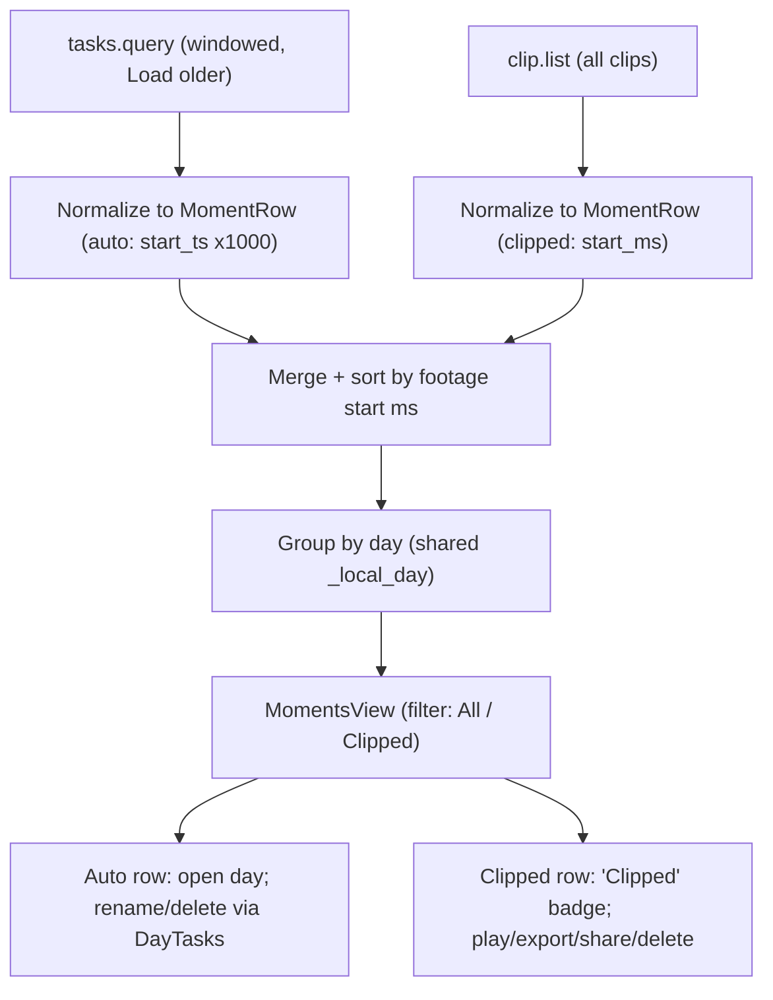
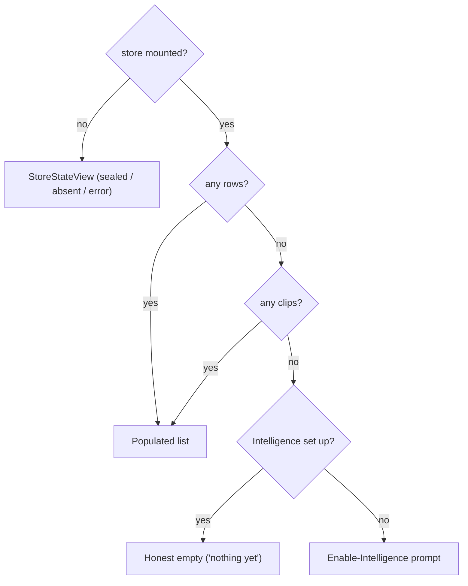

# Merge Tasks and Clips into Moments - Plan

## Goal Capsule

- **Objective:** Collapse the Tasks and Clips sidebar destinations into a single **Moments** surface, marking user-clipped rows "Clipped," without losing the durability and share value that clips carry today.
- **Product authority:** Rute Figueiredo (product owner) — scope confirmed in this brainstorm.
- **Execution profile:** macOS SwiftUI app-layer change only. No daemon or Python change — the merge is assembled client-side from the two existing verbs. Primary proof is pure `MomentsModel` unit tests.
- **Stop conditions:** No launch-blocking questions remain. Surface a genuine blocker (e.g., research reveals the two verbs can't be reconciled client-side) rather than guessing.
- **Tail ownership:** Standard — branch, macOS test target green, PR. Remove the now-dead Tasks/Clips view shells before declaring done.

---

## Product Contract

*Product Contract preservation: requirements unchanged (R1–R8, F1–F2, AE1–AE3). The two "deferred to planning" questions from the brainstorm (two-source union, row interleave/sort) are resolved in the Planning Contract; the clip-timeline-bands item moved to Scope Boundaries → Deferred to Follow-Up Work.*

### Summary

Merge the Tasks and Clips destinations into one **Moments** surface — a cross-day list of day spans that unions the app-detected task segments with the ranges the user clipped, marking clipped rows "Clipped" and offering a filter to show just those. The sidebar's primary destinations drop from Days · Tasks · Clips · Chat to **Days · Moments · Chat**. Clipping is unchanged; only the destination it lands in is renamed.

### Problem Frame

Tasks and Clips sit next to each other in the sidebar, and both read as "a slice of a day." They feel like one idea split into two shelves, and the Clips shelf sits empty on a fresh install — so the redundancy is the first thing a user notices.

Underneath, the two are genuinely different: a task is an app-detected pointer into the day that dies when the day is evicted; a clip is a durable range the user chose to keep, saved as real video that survives day deletion and can be exported and shared. That share-and-keep job is one `STRATEGY.md` names directly ("share reasoning with teammates"), and clips are the only surface that serves it. The fix is therefore not to cut one, but to stop the two from reading as siblings — by putting them on one shelf and distinguishing them by what the user can do with each row, not by which sidebar entry they live under.

### Key Decisions

- **Merge into one surface, not two reframed shelves.** The redundancy is perceptual. Rather than rename or reposition Clips to disambiguate, collapse both into one Moments list. This removes the redundancy at the root. The cost accepted: one list now holds two row types with different lifecycles and affordances (see the row-physics table under Requirements).
- **Mark by origin ("Clipped"), not by an invented affordance word.** An earlier "Kept" label was rejected — it introduced a new term that did not explain itself on sight. "Clipped" reuses the verb the user already presses, so the marker is self-evident. Durability and portability are shown by the row's own actions (play / export / share), not named in the badge.
- **"Clip" stays the verb; "Moments" is the destination.** Splitting the action name from the shelf name is what keeps the two row types from reading as siblings. The user still Clips; the result just lands in Moments.

### Requirements

**Surface and navigation**

- R1. Tasks and Clips merge into a single primary destination named **Moments**. The standalone Clips destination is removed and the Tasks destination is renamed, leaving three primary destinations: Days · Moments · Chat.
- R2. Moments is a cross-day, reverse-chronological list of day spans that unions app-detected task segments and user-clipped ranges into one list.

**Row identity and marking**

- R3. Rows the user clipped are marked **"Clipped."** App-detected rows carry no marker. The marker's only job is to set the user-made rows apart at a glance.
- R4. Clipped rows carry play, export, and share actions plus jump-to-day; app-detected rows carry jump-to-day only. The affordance difference rides the row, not the marker.

**Finding kept moments**

- R5. Moments offers a filter that shows only Clipped rows, so user-kept moments stay findable when app-detected rows outnumber them.

**Lifecycle and row physics**

- R6. Clipped rows persist after their source day is deleted or ages out (durability preserved from today's clips); app-detected rows evict with their day. A Moments list scrolled into the deep past therefore shows only Clipped rows.
- R7. Moments renders its Clipped rows even when Intelligence is off. Today's Tasks "enable Intelligence" zero-state applies only to the absence of app-detected rows — it must never hide a user's Clipped moments.

The two row types the Moments list unions:

| Row type | Source | Lifecycle | Actions | Needs Intelligence |
|---|---|---|---|---|
| App-detected (task span) | `pipeline_task_segments`, per-recording `recording.db` | Evicts with its day | Jump to day | Yes |
| Clipped (user range) | Durable `.clips/` catalog | Survives day deletion / aging | Play, export, share, jump to day | No |

**Creation (unchanged)**

- R8. Clipping is unchanged: the user selects a range on a day and chooses **Clip**, and the result appears in Moments as a Clipped row. The verb "Clip" is retained; only the destination's name changes.

### Key Flows

- F1. Clip a range into Moments
  - **Trigger:** The user selects a range on a day and chooses Clip.
  - **Steps:** The range is saved as a durable clip; a Clipped row appears in Moments.
  - **Outcome:** The row is playable, exportable, and shareable, and persists beyond its source day.
  - **Covers R2, R4, R6, R8.**
- F2. Filter to Clipped-only
  - **Trigger:** The user opens Moments and toggles the Clipped filter.
  - **Steps:** The list narrows to Clipped rows.
  - **Outcome:** The user's kept moments surface without app-detected rows burying them.
  - **Covers R5.**

### Acceptance Examples

- AE1. **Covers R7.** Intelligence is off and the user has Clipped moments → Moments shows the Clipped rows. Intelligence is off and there are no Clipped moments → the enable-Intelligence prompt shows in place of app-detected rows.
- AE2. **Covers R6.** A day is deleted → its app-detected rows disappear from Moments; its Clipped rows remain, still playable and exportable.
- AE3. **Covers R5.** App-detected rows greatly outnumber Clipped rows → the Clipped filter isolates the user's kept moments.

### Scope Boundaries

- Moments never auto-creates Clipped rows. Clipping stays a deliberate act — no auto highlight reel and no manual bookmark/pointer concept.
- Clip creation mechanics, clip durability and retention rules, and cloud/upload behavior are unchanged by this work.

#### Deferred to Follow-Up Work

- **Clipped moments as bands on the Day timeline.** Task bands on the day strip render from a third data path (`timeline.day.tasks` via `DayStripSegment.bands`), and there is no clip-band concept there today. Giving Clipped moments a day-timeline representation is a separate additive strip change, out of scope for this merge.

### Sources / Research

- `macos/Screencap/Views/Clips/ClipsView.swift` — current Clips surface: `ClipsController` (Phase enum, `clip.list` load), `ClipRowView` / `ClipThumbnail`, per-row play (`ClipPlayerSheet`) / export (`NSSavePanel`) / share (`ShareServicePresenter`) / delete (no-undo confirm), store-state branch before empty.
- `macos/Screencap/Views/Tasks/TasksView.swift`, `macos/Screencap/Views/Tasks/TasksModel.swift` — current Tasks surface: windowed `tasks.query` load with "Load older", `TaskRow`, local substring filter, `IntelligenceVerdict`-gated zero-state, `ListState` (populated / filterZero / systemZero).
- `macos/Screencap/Views/Shell/ShellSidebar.swift` — `ShellRoute` enum, `ShellNavItem`, `primaryNav` (Days · Tasks · Clips · Chat), `highlightedRoute`.
- `macos/Screencap/Views/MainWindow.swift` — the per-route `detail` switch (`.tasks` → `TasksView`, `.clips` → `ClipsView`) and origin-back tracking.
- `macos/Screencap/Views/Days/DayTasks.swift` — the shared rename/delete write-through both Tasks and the day page use.
- `macos/Screencap/Controllers/DaemonClient.swift` — `tasksQuery`, `clipList`, `ClipRecord`, `TasksQueryResponse`, `StoreState`.
- `src/screencap/clips.py`, `src/screencap/tasks_query.py`, `src/screencap/pipeline_state.py` — task segments live in per-recording `recording.db` (evict with the day); clips live in a retention-exempt `.clips/` catalog (durable). Both day strings derive from the single-sourced `_local_day` (KTD-11) rule, so they align.
- `docs/plans/2026-07-18-001-feat-day-first-days-tasks-navigation-plan.md` — the day-first restructure that created the Days · Tasks · Clips · Chat structure this plan modifies.

---

## Planning Contract

### Key Technical Decisions

- KTD-1. **Client-side union, no new daemon verb.** Moments calls both existing verbs — `tasks.query` (windowed) and `clip.list` (all) — and merges the results in the app. The two are reconcilable client-side: task `start_ts` (Unix seconds) and clip `start_ms` (absolute epoch ms) are both absolute after a `×1000` conversion, and both day strings come from the single-sourced `_local_day` rule so they align. A new unified daemon verb would be added complexity with no payoff.
- KTD-2. **All clips loaded; only app-detected rows page.** `clip.list` returns every clip (they are sparse and durable), while `tasks.query` stays windowed with "Load older." Kept moments are therefore never hidden behind paging (serves R5). Consequence, not bug: a day older than the loaded task window shows only its Clipped rows — exactly R6's deep-past property.
- KTD-3. **Interleave by footage time, not cut time.** The merged list sorts on absolute footage start ms (task `start_ts×1000`, clip `start_ms`). `clip.list` is delivered `created_at`-ordered (when the clip was cut); Moments re-sorts on footage position so a clip sits where the moment happened, next to the tasks around it.
- KTD-4. **New `MomentsView` reusing extracted subviews; auto curation stays on the shared `DayTasks` write-through.** Build one unified surface (the two current load lifecycles differ — Tasks uses in-view state + a pager + filter; Clips uses an external controller) rather than bolting clips onto `TasksView`. Extract the row/thumbnail subviews (`ClipRowView`, `ClipThumbnail`, `TaskRowView`) from the current views into reusable components rather than rewriting them. Keep app-detected-row rename/delete on the existing `DayTasks` write-through so curation can't drift from the day page.
- KTD-5. **"Clipped" marker on clipped rows only.** App-detected rows are unmarked (the majority/default). The affordances (play/export/share, persistence) ride the row, not the marker — per the brainstorm's rejection of an affordance-word badge.
- KTD-6. **Unified zero-state: clips override the Intelligence prompt.** The "set up Intelligence" prompt shows only when there are no clips *and* no app-detected rows. Any Clipped moments render regardless of Intelligence state (R7). A sealed/absent/error store branches before the empty check, using either response's `resolvedStoreState`.

### High-Level Technical Design

The merge is a client-side fan-in: two verbs normalize into one row model, sort by footage time, group by day, and render into one view whose rows carry kind-specific behavior.

Load state resolves through one branch that reconciles both responses' store state and honors the R7 clips-override-Intelligence rule:

### Assumptions

- The macOS-side change needs no daemon or schema change: `tasks.query` and `clip.list` already return everything Moments needs (rows plus `store_state`). If implementation finds a gap (e.g., a field Moments needs that only a new verb could supply), surface it as a blocker rather than silently adding a verb.
- `ClipRowView`, `ClipThumbnail`, and `TaskRowView` are currently `private` to their view files; extracting them to reusable components is a mechanical visibility/relocation change, not a rewrite.

### Sequencing

U1 (pure model) → U2 (view rendering + loads) → {U3 (row actions/curation), U4 (filters)} → U5 (sidebar/routing cutover, last so the old surfaces stay reachable until Moments is complete).

---

## Implementation Units

### U1. Moments data model — merge, sort, group, zero-state selection

- **Goal:** A pure, testable model that normalizes task segments and clips into one footage-time-interleaved, day-grouped list, and selects the correct list/zero state.
- **Requirements:** R2, R3, R6, R7.
- **Dependencies:** none.
- **Files:**
  - `macos/Screencap/Views/Moments/MomentsModel.swift` (new) — `MomentRow` (a normalized union over an app-detected task and a clip, exposing `startMs`, `endMs`, `day`, `isClipped`, `timeRangeText`), `MomentDayGroup`, `merge(tasks:clips:)`, and `listState(tasks:clips:verdict:storeState:)`.
  - `macos/ScreencapTests/MomentsModelTests.swift` (new).
- **Approach:** Normalize both sources to absolute ms — task `startTs × 1000`, clip `startMs` (KTD-3). Take the day from `TasksQueryDay.date` (auto) and `ClipRecord.sourceDay` (clipped); they align on the shared `_local_day` rule (KTD-1). Interleave rows within a day by footage start ms; order days reverse-chronologically. The model performs no daemon calls (KTD-4), so it unit-tests without a running daemon. `listState` encodes KTD-6: store-not-mounted and the clips-override-Intelligence branch.
- **Patterns to follow:** `TasksModel.DayGroup` grouping and `TasksModel.listState` (`macos/Screencap/Views/Tasks/TasksModel.swift`); `ClipsModel.ClipDayGroup` (`macos/Screencap/Views/Clips/ClipsModel.swift`).
- **Test scenarios:**
  - Covers R2. Given tasks and clips across two days, `merge` yields day groups reverse-chronological, with rows footage-time ordered within a day — a task at `start_ts = T` seconds and a clip at `start_ms = T×1000` land adjacent, proving the unit conversion.
  - Covers R3. A clipped row reports `isClipped == true`; an app-detected row reports `false`.
  - Covers R6. A day whose task rows are absent but whose clip is present (an evicted day) yields a group containing only the Clipped row.
  - Covers R7 (via `listState`). Intelligence off + clips present → `populated`; Intelligence off + no clips + no tasks → the enable-Intelligence zero; store not mounted → the store-state branch, regardless of rows.
  - Edge: same footage timestamp on a task and a clip orders deterministically (stable tie-break).
  - Edge: empty tasks + empty clips → empty; empty tasks + clips present → clip-only groups.

### U2. MomentsView — unified list rendering, thumbnails, store/zero states

- **Goal:** The Moments screen renders the merged list with both row kinds, the "Clipped" marker, clip thumbnails, and honest store/zero states, wiring both loads into U1's model.
- **Requirements:** R2, R3, R7, R8; AE1, AE2.
- **Dependencies:** U1.
- **Files:**
  - `macos/Screencap/Views/Moments/MomentsView.swift` (new) — the view plus its load orchestration (calls `DaemonClient.tasksQuery` windowed and `DaemonClient.clipList` unpaged, feeds U1).
  - `macos/Screencap/Views/Moments/MomentRowViews.swift` (new, or co-located) — the reusable row/thumbnail subviews extracted from the current views.
  - `macos/Screencap/Views/Clips/ClipsView.swift`, `macos/Screencap/Views/Tasks/TasksView.swift` — extract `ClipRowView` / `ClipThumbnail` / `TaskRowView` for reuse (visibility/relocation only).
- **Approach:** Load both sources; clips unpaged, tasks windowed with "Load older" (KTD-2). Branch store state first via `resolvedStoreState`, rendering the shared `StoreStateView`; then U1's `listState` drives populated vs zero (KTD-6). Clipped rows show the "Clipped" marker (reuse the `ClipRowView.flags` badge pattern) and a thumbnail; app-detected rows keep the text presentation. R8 is satisfied here: a clip created on the day page appears as a Clipped row on the next `clip.list` load — no unit modifies the day-page `clip.create` path.
- **Patterns to follow:** `TasksView.content` store-branch, `ClipsView.content` `Phase.loaded` branch, `ClipThumbnail` poster extraction, `StoreStateView`.
- **Test scenarios:**
  - Covers AE1. Intelligence off + clips present → the list shows Clipped rows (not the enable-Intelligence wall); Intelligence off + no clips → the enable-Intelligence prompt. (Assert the `listState` selection from U1; smoke-render the branch here.)
  - Covers AE2. A day deleted (tasks gone, clip remains) → the Clipped row still renders.
  - Sealed/absent store → `StoreStateView` renders before the empty check, when either response is non-mounted.
  - Mounted + zero rows + Intelligence set up → honest "nothing yet" zero, never a false "you did nothing."
  - **Execution note:** Extract the reusable subviews first (mechanical), then assemble the view — so the diff separates relocation from new composition.

### U3. Row actions and curation — clipped + app-detected, one error surface

- **Goal:** Clipped rows play/export/share/delete; app-detected rows open their day and rename/delete via the shared write-through; both curation failures surface through one honest path.
- **Requirements:** R4.
- **Dependencies:** U2.
- **Files:**
  - `macos/Screencap/Views/Moments/MomentsView.swift` (row actions + error alert), `macos/Screencap/Views/Moments/MomentRowViews.swift`.
  - Reuse `macos/Screencap/Views/Days/DayTasks.swift` (rename/delete write-through), the `ClipsController.deleteClip` path, `ShareServicePresenter`, `ClipPlayerSheet`, and the `NSSavePanel` export.
- **Approach:** Clipped-row actions reuse the current Clips implementations — play (`ClipPlayerSheet`), export (`NSSavePanel`), share (`ShareServicePresenter`), delete (no-undo confirm → `clipDelete`), each guarded on the clip's on-disk `path`. App-detected rows: click → `onOpenTimeline(day, startMs, highlight)`; context menu rename/delete → `DayTasks` write-through (optimistic, reverts on failure). Reconcile the two error surfaces (`DayTasks.writeError` retryable alert + the clip action error) into one alert presentation in `MomentsView`.
- **Patterns to follow:** `ClipRowView.actions`, `TaskRowView` context menu, `DayTasks.writeThrough`, `ClipsController.deleteClip`.
- **Test scenarios:**
  - Covers R4. A Clipped row exposes play/export/share/delete + open-day; an app-detected row exposes open-day + rename/delete. (Assert the per-kind action set on the row model where pure.)
  - Delete a clip → no-undo confirm → `clipDelete` → row gone on reload.
  - Rename/delete an app-detected row → write-through; on failure the optimistic change reverts and a retryable error surfaces.
  - A clip whose file is missing on disk → the action is guarded and surfaces an honest error, never a silent no-op.
  - An app-detected row click calls `onOpenTimeline` with the row's day, start ms, and span highlight.

### U4. Filters — Clipped-only and carried-over substring

- **Goal:** A filter to show only Clipped rows, plus the app-detected substring filter carried over from Tasks.
- **Requirements:** R5.
- **Dependencies:** U1, U2.
- **Files:**
  - `macos/Screencap/Views/Moments/MomentsModel.swift` (add the filter function), `macos/Screencap/Views/Moments/MomentsView.swift` (the filter control).
  - `macos/ScreencapTests/MomentsModelTests.swift` (filter tests).
- **Approach:** A type filter ("All" / "Clipped") plus the substring filter (matches app-detected name/category, as `TasksModel.filter` does today). Because all clips are loaded (KTD-2), the Clipped filter surfaces every kept moment regardless of the app-detected window. Filter logic lives in the model (pure, testable); the control wires it.
- **Patterns to follow:** `TasksView.filterField`, `TasksModel.filter`.
- **Test scenarios:**
  - Covers R5 (AE3). Many app-detected rows + few clipped → the Clipped filter yields only the clipped rows.
  - A clip whose day is older than the loaded task window still appears under the Clipped filter — proving no paging dependency.
  - The substring filter narrows app-detected rows by name/category; an empty query restores the full list.
  - Clipped filter + substring compose (both applied).

### U5. Sidebar and routing cutover — Days · Moments · Chat

- **Goal:** Replace the Tasks and Clips sidebar rows with one Moments destination routed to `MomentsView`, and retire the old routes and now-dead view shells.
- **Requirements:** R1.
- **Dependencies:** U2, U3, U4.
- **Files:**
  - `macos/Screencap/Views/Shell/ShellSidebar.swift` — add `case moments` to `ShellRoute`; collapse the two `primaryNav` rows into one `ShellNavItem(id: "moments", label: "Moments", route: .moments)`; add `.moments` to `highlightedRoute`; remove `.tasks` / `.clips`.
  - `macos/Screencap/Views/MainWindow.swift` — render `MomentsView(onOpenTimeline:onOpenIntelligence:)` for `.moments`; add `.moments` to the origin-back set; remove the `.tasks` / `.clips` cases.
  - Remove or thin the now-unreferenced `TasksView` / `ClipsView` top-level shells (their reusable subviews were extracted in U2).
- **Approach:** The only switch on `.tasks` / `.clips` is `MainWindow.detail` (confirmed by research). Add `.moments`, repoint the default-landing and origin-back wiring, and delete the dead cases. Grep the two enum cases before and after to confirm no dangling references.
- **Patterns to follow:** `ShellSidebar.primaryNav`, `ShellRoute`, `highlightedRoute`, `MainWindow.detail`, the origin-back `onChange(of: route)` block.
- **Test scenarios:**
  - Covers R1. `primaryNav` yields exactly three destinations — days, moments, chat (assert ids and labels).
  - `highlightedRoute(.moments) == .moments`; `highlightedRoute(.timeline) == .days` (unchanged).
  - **Execution note:** Removing the old route cases is the compile-break risk — grep `.tasks` / `.clips` references across `macos/Screencap` before finalizing.

---

## Verification Contract

| Gate | Command | Applies to | Done signal |
|---|---|---|---|
| macOS model tests | `xcodebuild test` on the `Screencap` scheme, `ScreencapTests` target (macOS destination) | U1–U5 | `MomentsModelTests` pass; existing `ClipsModelTests` / `TasksModel` tests unaffected |
| macOS build | `xcodebuild build` on the `Screencap` scheme after the U5 cutover | U5 | Builds clean with no references to removed `.tasks` / `.clips` routes |

- Primary proof is the pure `MomentsModel` tests (merge/sort/group, `listState` zero-state selection, filter) — they run without a live daemon, mirroring `macos/ScreencapTests/ClipsModelTests.swift`.
- No Python surface changes (client-side union), so no new `pytest` coverage and no impact on the `pytest -m privacy` lane.
- Manual smoke after U5: sidebar reads Days · Moments · Chat; a clipped row and an app-detected row coexist interleaved; the Clipped filter isolates kept moments; a clipped row plays/exports/shares; with Intelligence off but a clip present, the list shows the clip.

## Definition of Done

- **Global:**
  - Sidebar shows Days · Moments · Chat; no reachable Tasks or Clips destination remains (R1).
  - Moments interleaves app-detected and Clipped rows by footage time, grouped by day (R2, KTD-3).
  - Clipped rows are marked "Clipped" and filterable; app-detected rows are unmarked (R3, R5).
  - Clipped rows play/export/share/delete and persist past their day; app-detected rows open their day and rename/delete via the shared write-through (R4, R6).
  - With Intelligence off and clips present, Moments shows the clips; a sealed/absent store branches before the empty check (R7, KTD-6).
  - All `MomentsModel` tests pass; the macOS app builds with no dangling `.tasks` / `.clips` references.
  - Abandoned/dead code from the retired Tasks/Clips shells is removed, not left in the diff.
- **Per unit:** each unit's Test Scenarios pass and its Verification signal is met before the next dependent unit starts.
