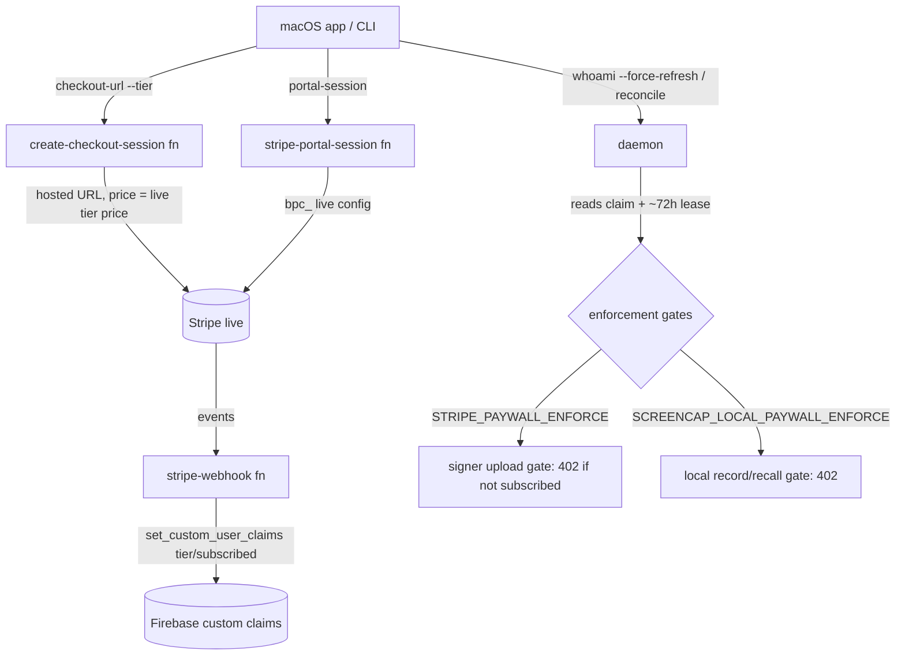
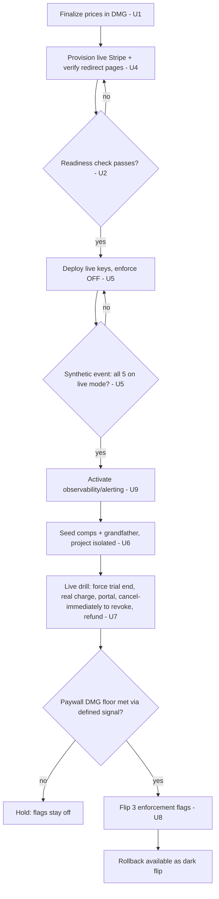

# Stripe Live Charging Cutover - Plan

## Goal Capsule

- **Objective:** Charge real customer cards by cutting the already-shipped two-tier billing (Local Pro / Cloud) over from Stripe **test mode** to **live mode**, safely and reversibly.
- **Authority hierarchy:** This plan supersedes conflicting steps in `docs/runbooks/paid-only-launch-pricing-cutover.md` (which it extends); that runbook supersedes ad-hoc practice. Live Stripe/GCP/Firebase state is authoritative over any doc where they disagree — verify live, don't trust the doc.
- **Execution profile:** Mostly an operational cutover against shipped, env-driven code, plus a thin in-repo diff (finalize displayed prices, add a live-readiness check, add a Secret-Manager deploy wrapper). Verify-heavy: real-money side effects are irreversible, so the posture is **prove-then-flip**, not flip-then-watch.
- **Stop conditions:** Do not flip any enforcement flag before the paywall-capable DMG is the minimum shipped app version AND comps + grandfather are seeded. Never deploy live keys via `--set-env-vars` or commit them. Do not run the live charge drill until the readiness check passes. Surface a blocker rather than guessing on Stripe account activation, tax, or legal copy.
- **Tail ownership:** The in-repo code units (U1–U3), plus the small `set_entitlement.py --dry-run` addition U6 needs, land as a PR. The operational units (U4–U9) execute against live infrastructure and are tracked in the cutover runbook, not the code diff.

---

## Product Contract

### Summary

Provision live-mode Stripe objects, deploy the existing billing + signer Cloud Functions with live secrets, verify the full pay → entitle → lapse → manage loop with a real card, then flip the three enforcement flags gated on the paywall DMG being the minimum shipped version. The billing code is already env-driven and shipped dark behind default-off flags — which mode Stripe runs in is decided by the secret key the deployed functions carry, so the cutover changes secrets, provisioning, and flag state, not billing logic. The only in-repo code is finalizing the client's displayed prices (they ship in the DMG, not via env), a live-readiness verification script, and a deploy wrapper that injects live secrets via Secret Manager.

### Problem Frame

The $5 Personal-cloud paywall (PR #348) and the two-tier paid-only launch pricing both shipped, but everything is behind three default-off flags and validated only against a **test-mode** Stripe account. Test mode cannot charge a real card and silently masks at least one live-only failure (the customer-portal configuration), so "it works in test" does not prove real charging works. Going live is therefore a deliberate operational cutover with irreversible side effects (real money moves), several live-only prerequisites Stripe does not carry over from test mode, and a hard cross-track coupling: the prices the app displays are compiled into the DMG, and old clients have no in-app way to pay, so enforcement must not turn on until the paywall build is the floor.

### Requirements

**Live billing enablement**

- R1. Real customer cards are charged in Stripe live mode for both paid tiers (Local Pro, Cloud), and the legacy $5 subscription keeps resolving to `tier=cloud`.
- R2. Every live-mode Stripe object the integration depends on is provisioned fresh in live mode — two recurring prices, the legacy $5 price, a webhook endpoint with its own signing secret, the customer-portal configuration, and any promo code — with no test-mode object reused.
- R3. Live secret material (`sk_live_…`, live `whsec_…`) is stored in GCP Secret Manager and injected via `--set-secrets`, never `--set-env-vars` and never a committed file.

**Client and redirect readiness**

- R4. The prices the app displays are finalized to the real launch numbers and match the live Stripe prices before the go-live DMG is cut (the client price is not env-driven).
- R5. Superseded single-tier ($5/month) pricing copy is removed or provably unreachable when the paywall is on.
- R6. The post-checkout success, cancel, and portal-return pages on `screencap.sh` resolve to real pages before go-live.

**Comps, verification, and enforcement cutover**

- R7. The full pay → entitle → lapse → manage loop is verified in live mode with a real card (refunded after) before any enforcement flag is flipped.
- R8. Internal/demo comps and existing $5 subscribers are entitled in the live Firebase project before enforcement flips, so no legitimate user is locked out.
- R9. The three enforcement flags (`STRIPE_PAYWALL_ENFORCE`, `SCREENCAP_STRIPE_PAYWALL`, `SCREENCAP_LOCAL_PAYWALL_ENFORCE`) flip only after the paywall-capable DMG is the minimum shipped app version, and rollback is a dark flag flip with no data loss.
- R10. A rollback path — revert to test keys, disable new checkouts, and disable the live webhook without losing entitlement events — is understood and exercised before go-live.
- R11. Silent webhook/entitlement failure is observable: a delivery-failure and no-grant signal exists (dashboard watch plus a log-based alert) so the team notices before customers do, at least through the launch window.
- R12. The live Firebase project is confirmed isolated from any test-mode claim writes before the grandfather backfill runs, so test-mode validation accounts are never grandfathered into live entitlement.

### Acceptance Examples

- AE1. **Trial converts and charges.** Given a real card completes live Checkout for Cloud, when the 7-day card-required trial converts, then the card is charged the live Cloud price and the account's claim stays `tier=cloud` / `subscribed=true`.
- AE2. **Live portal opens scoped.** Given a live customer with an active subscription, when they open Manage Subscription, then a live portal session opens scoped to exactly the Local Pro + Cloud products (the live `bpc_…` configuration is present).
- AE3. **Enforcement holds until DMG floor.** Given the paywall-capable DMG is not yet the minimum shipped app version, when the cutover is executed, then all three enforcement flags remain off and no live client is hard-gated.
- AE4. **Dropped webhook self-heals.** Given a real payment whose webhook did not land, when the user taps "I've paid," then reconcile grants the entitlement from the live subscription and `whoami --force-refresh` makes it visible.
- AE5. **Cancel revokes.** Given an active live subscription, when it is canceled and `customer.subscription.deleted` is delivered, then the claim clears to `tier=none` / `subscribed=false` and cloud upload returns 402. (A refund alone does not cancel the subscription and does not revoke.)

### Scope Boundaries

- **In scope:** live Stripe provisioning; deploying the five billing/signer functions with live secrets; the live-readiness check; the Secret-Manager deploy wrapper; finalizing displayed prices; verifying the redirect pages resolve; seeding comps + grandfather in live Firebase; the live charge drill; the gated enforcement flip; the rollback exercise.
- **Verify, don't build (cross-repo):** the `screencap.sh` redirect pages live in the sibling `screencap-website` repo. This plan verifies they resolve; building them if missing is a `screencap-website` task tracked separately, not part of this repo's diff.

#### Deferred to Follow-Up Work

- Restricted API keys (`rk_live_…`) for the webhook function in place of the full secret key — a security hardening the plan recommends but does not block go-live on.
- Reconciling the runbook wording ("app calls `POST /v0/entitlement.refresh`") with the actual Swift path (`whoami --force-refresh` via the CLI) — a doc-only fix.
- `customer.subscription.trial_will_end` reminder handling (trial-ending email) — a growth feature, not a charging prerequisite.
- Trial-abuse hardening (payment-method fingerprint / one-trial-per-customer) — a monetization-leak mitigation, not a safety blocker.
- Handling `charge.dispute.created` to auto-revoke on dispute — otherwise a disputed customer keeps entitlement until the subscription lapses.

### Sources

- Billing functions and deploy contract: `scripts/cloud-function/billing.py` (checkout `:270-342`, webhook `:447-560`, reconcile `:627-656`, portal `:680-785`; live-mode portal fail-closed `:744-762`).
- Signer cloud-upload gate: `scripts/cloud-function/main.py:216-269,428-438` (`STRIPE_PAYWALL_ENFORCE` → `subscribed is True` else 402).
- Portal configuration bootstrap: `scripts/cloud-function/setup_portal_config.py`.
- Deploy env reference: `scripts/cloud-function/.env.example`.
- Client flags: `src/screencap/config.py:385-411`. CLI billing URLs: `src/screencap/upload.py:74-98`.
- Client checkout / entitlement refresh: `macos/Screencap/Controllers/CloudAuthController.swift:220-236,402-410,505-514,560-576`.
- Displayed prices (hardcoded placeholders): `macos/Screencap/Views/Onboarding/OnboardingStepPolicy.swift:248-255,312`.
- Comp/grandfather tool: `scripts/set_entitlement.py`. Daemon local gates + lease: `src/screencap/daemon/app.py:425-467,513-533,580,5048`, `src/screencap/daemon/entitlement_lease.py:59-62,207`.
- Existing cutover runbook: `docs/runbooks/paid-only-launch-pricing-cutover.md`. Shipped plans: `docs/plans/2026-07-07-001-feat-personal-cloud-billing-paywall-plan.md`, `docs/plans/2026-07-10-001-feat-paid-only-launch-pricing-plan.md`.
- Stripe docs (2026): [Go-live checklist](https://docs.stripe.com/get-started/checklist/go-live), [API keys best practices](https://docs.stripe.com/keys-best-practices), [Configure the customer portal](https://docs.stripe.com/customer-management/configure-portal), [Webhook signature verification](https://docs.stripe.com/webhooks/signature), [Activate your account](https://docs.stripe.com/get-started/account/activate).

---

## Planning Contract

### Key Technical Decisions

- KTD-1. **Mode is set by deployed secrets, not by code.** The cutover swaps the Cloud Functions' `STRIPE_SECRET_KEY` / `STRIPE_WEBHOOK_SECRET` and the price/portal env from test to live; no billing logic changes. This is what makes go-live an operational task with a thin code diff rather than a rewrite.
- KTD-2. **Recreate every live-mode object; nothing carries from test.** Products/prices, the webhook endpoint (which mints its own live `whsec_…`), the portal configuration (`bpc_…`), and promo codes are all mode-isolated in Stripe. Use Stripe's "Copy to live mode" on the product to preserve price semantics, but promo codes have no copy path and must be recreated via API/dashboard. The portal configuration is a **live-only requirement** — test mode falls back to a default and hides its absence — so it must be created explicitly and pinned via `STRIPE_PORTAL_CONFIGURATION_ID`.
- KTD-3. **Live secrets via Secret Manager, least privilege, rotation ordered first.** Store `sk_live_…` and the live `whsec_…` as Secret Manager versions and inject with `--set-secrets`; grant the functions' runtime service account `secretAccessor` on only those secrets. Rotate the secret key **before** creating the Secret Manager version U5 deploys, so only the post-rotation key is ever deployed — never rotate after U5 without an immediate redeploy and readiness re-run. Rotation is not signature-isolated: the webhook uses `sk_live_` to re-fetch the subscription and resolve the tier, so a rotated-out key silently fails grants (re-fetch returns `None` → no grant) even though signatures still verify. `stripe.Webhook.construct_event` takes a single secret, so a future `whsec_` roll has no dual-secret grace window — roll it in a maintenance pause. Once the post-rotation key is confirmed live (readiness green + the U5 signature proof), **revoke the pre-rotation `sk_live_` in Stripe and disable its superseded Secret Manager version** — an un-revoked old key stays a fully valid live credential, so skipping this leaves the rotation with no security value. Scope who may read the live secrets and wield the Firebase Admin credential `set_entitlement.py` uses (see Open Questions). Restricted keys (`rk_live_…`) for the webhook function are recommended but deferred.
- KTD-4. **Enforcement flips last, independently, gated on the DMG floor.** Because displayed prices ship in the DMG and pre-paywall clients cannot pay, all three flags stay off until the paywall-capable DMG is the minimum shipped version; the flip is then a config change (no redeploy for the signer flag, which is read per-request), and rollback is a dark flip with no data deletion. This gate needs a defined determination signal, which the app does not have today (no forced-update or client-version telemetry in the request path) — see Open Questions. An alternative rollout — per-request, client-version-aware signer enforcement that gates only paywall-capable clients and never hard-gates old ones — would remove the whole-install-base-update dependency; it is recorded in Open Questions rather than chosen here, since it requires a client-version signal the request path does not yet carry.
- KTD-5. **The go-live proof is a real live charge, not just an entitlement loop.** Stripe test mode rejects real cards and masks the portal-config gap. Because checkout opens a card-required 7-day trial that charges `$0` until conversion, the drill must **force the trial to end immediately** (set the drill subscription's `trial_end` to now) so Stripe issues the first invoice and charges the real card — otherwise the one thing test mode cannot do (charge a real card, apply the statement descriptor and tax) is never proven, and the first genuine charge would be a paying customer's conversion ~7 days into launch. Confirm the charge succeeds, then exercise cancel→revoke and refund, confirming via the refund event (live refunds settle asynchronously).
- KTD-6. **A mechanical live-readiness check gates deploy.** A new script turns the Stripe go-live gotchas into a pass/fail gate before anything flips: prices exist, are recurring and active; the live webhook endpoint is registered with the right events and has a signing secret; the portal configuration exists; the account has charges enabled and a statement descriptor set. Test-mode validation cannot catch these; the check runs against the live key.
- KTD-7. **A deploy wrapper replaces manual command translation.** There is no deploy automation today — commands live only in docstrings and the `--set-secrets` pattern is demonstrated only in `scripts/cloud-function/feedback.py:68`. A small wrapper deploys the five functions with the correct source override and Secret-Manager injection, removing the error-prone hand-translation of `--set-env-vars` examples into live-secret deploys. Because the five functions deploy separately, the wrapper is all-or-nothing: on any function's deploy failure it halts and reports which functions are on which revision, so a partial deploy is never left silently in place.
- KTD-8. **Verify the deployed functions' live mode, not just Stripe's objects.** The readiness check (KTD-6) reads Stripe-side state and the operator's local env — it cannot see which secret each deployed function actually carries, so a cross-function mode split (checkout on live, webhook still on test) would pass it. Close that blind spot in two steps: a **synthetic live event delivered to the deployed webhook** proves the webhook's live signing secret (it returns 200 and verifies the live signature). The `sk_live_`-backed re-fetch that actually writes a claim only fires for an event bound to a real live subscription — the fail-closed webhook returns 200 with no grant for a canned event — so the claim-write path is proven by the U7 drill's real charge, still ahead of U8's public flip, so no real customer is exposed to a split-mode webhook.

### High-Level Technical Design

**Live entitlement loop (who talks to whom).** The client never calls Stripe directly — it shells to the CLI, which hits the prod function URLs; the webhook is the sole entitlement authority writing Firebase claims; two independent gates read those claims.

**Cutover sequence and gates.** Each phase is gated; the three hard gates are the readiness check, the deployed-mode signature proof, and the DMG-floor check.

### Assumptions

These resolve the scoping forks confirmed at intake; they are agent bets, correctable at handoff.

- **Deliverable shape:** an operational go-live runbook plus the minimal readiness code a live pass surfaced (price finalization, readiness script, deploy wrapper) — no billing-logic rewrite.
- **Cutover breadth:** the full go-live, staged so "live charging enabled (functions on live keys, enforce off)" is a separable, verifiable state before the enforcement flags flip.
- **Website:** verifying the redirect pages resolve is in scope; building them if missing is a `screencap-website` task tracked separately.
- **Account posture:** the Stripe account is a standard SaaS not requiring Stripe Tax at launch, and a statement descriptor will be set during provisioning. If Tax or a non-trivial legal-copy requirement applies, that is a blocker to surface, not to guess.

### Sequencing

U1–U3 are the in-repo diff and can proceed in parallel (one PR). U4 (provisioning) needs the final price numbers decided in U1 and a Stripe account that has cleared activation. The webhook has a bootstrap sub-sequence spanning U4/U5: deploy the webhook function dark to get its URL, register the live endpoint against that URL, capture its `whsec_…`, then redeploy with the secret — no live event exists before the secret is deployed. U5 depends on U2, U3, U4. U9 (observability) depends on U5 and must be active before U7. U6 can run any time after the live Firebase project is reachable but must complete before U8. U7 depends on U5, U6, and U9. U8 depends on U7 and on the paywall DMG being the minimum shipped version.

---

## Implementation Units

### U1. Finalize launch prices in the client and retire superseded copy

- **Goal:** Replace the placeholder displayed prices with the real launch numbers from a single source, and remove or gate the dead single-tier copy, so the DMG shows correct prices that match the live Stripe prices (R4, R5).
- **Requirements:** R4, R5.
- **Dependencies:** none (but the chosen numbers must equal the live prices created in U4).
- **Files:** `macos/Screencap/Views/Onboarding/OnboardingStepPolicy.swift` (`PricingCatalog` ~`:248-255`; legacy `personalCardMeta` `:312`), `macos/ScreencapTests/` (pricing/onboarding policy test).
- **Approach:** Set `localProMonthly` / `cloudMonthly` to the final launch prices, keeping a single definition as the display source of truth (Stripe remains the charging source of truth). Confirm the legacy `$5/month` card is not rendered when `SCREENCAP_STRIPE_PAYWALL` is on; if it is genuinely superseded, remove it rather than leaving dead copy.
- **Execution note:** The displayed number ships in the DMG and can only change via an app release — treat the value as launch-blocking input, not a tweakable config.
- **Patterns to follow:** existing `PricingCatalog` structure and the paywall-off/on labelling already in `OnboardingStepPolicy`.
- **Test scenarios:**
  - Happy path: `PricingCatalog` exposes the two finalized prices; a test asserts the exact expected strings so an accidental edit is caught.
  - Covers R5. With the paywall flag on, the onboarding/pricing policy surfaces the two-tier cards and does not surface the legacy single-tier `$5/month` card.
  - Edge: paywall flag off renders no pricing/checkout copy (regression guard on the default-off path).
- **Verification:** macOS app test target passes; the finalized strings match the live Stripe prices recorded in U4.

### U2. Live-readiness verification script

- **Goal:** A script that checks the live Stripe account and objects are correct before any deploy or flag flip, turning the go-live gotchas into a pass/fail gate (R2, KTD-6).
- **Requirements:** R2 (and gates R7).
- **Dependencies:** none to build; run against a live key populated in U4.
- **Files:** `scripts/cloud-function/verify_live_readiness.py` (new), `scripts/cloud-function/test_verify_live_readiness.py` (new).
- **Approach:** Given the live key and the configured price/portal ids, assert: the two tier prices (and the legacy price) exist, are `recurring`, and `active`; a webhook endpoint is registered whose enabled events include `checkout.session.completed`, `customer.subscription.created|updated|deleted`, `invoice.payment_failed`; a portal configuration (`bpc_…`) exists; the account reports charges enabled and a non-empty statement descriptor. Exit non-zero with a per-check reason on any failure. Reuse `billing.py`'s env names so the check reads the same configuration the functions will.
- **Execution note:** Test-first for the check logic — each assertion is a discrete failure mode; mock the Stripe client so the suite runs offline.
- **Patterns to follow:** `setup_portal_config.py`'s argparse + env-fallback + `--dry-run` shape; `test_billing.py`'s Stripe-mock fixtures.
- **Test scenarios:**
  - Happy path: a fully-provisioned mock account returns exit 0 with all checks green.
  - Error path: a price that is `one_time` (not recurring) fails with a price-specific reason.
  - Error path: a webhook endpoint missing `invoice.payment_failed` fails with an events reason.
  - Error path: no portal configuration present fails with a portal reason (the live-only trap).
  - Error path: account `charges_enabled = false` or empty statement descriptor fails with an activation reason.
  - Edge: a test-mode key (`sk_test_…`) is rejected up front so the readiness gate can never pass against test.
- **Verification:** `pytest scripts/cloud-function/test_verify_live_readiness.py` green; running it against the live account after U4 exits 0.

### U3. Secret-Manager deploy wrapper for the billing + signer functions

- **Goal:** One reviewed, repeatable deploy path for the five functions that injects live secrets via `--set-secrets` and passes the required source override, replacing hand-translated docstring commands (R3, KTD-7).
- **Requirements:** R3.
- **Dependencies:** none.
- **Files:** `scripts/cloud-function/deploy_billing.sh` (new), `scripts/cloud-function/.env.example` (note the Secret-Manager resource names), `scripts/cloud-function/billing.py` docstring (point to the wrapper).
- **Approach:** A parameterized wrapper (project, region defaults `proteus-photos` / `southamerica-east1`) that deploys `create-checkout-session`, `stripe-webhook`, `reconcile-entitlement`, `stripe-portal-session`, and the signer, each with `--set-build-env-vars GOOGLE_FUNCTION_SOURCE=billing.py` where applicable, `--set-secrets` for `STRIPE_SECRET_KEY` and (webhook) `STRIPE_WEBHOOK_SECRET`, and `--set-env-vars` for the non-secret config (price ids, portal config id, trial days, return/success/cancel URLs, `SCREENCAP_PROJECT_ID`). The signer keeps `STRIPE_PAYWALL_ENFORCE` unset (off) on this deploy. Refuse to run if a `STRIPE_SECRET_KEY` value is passed inline rather than as a secret reference. On any function's deploy failure, halt and report which functions landed on the new revision and which did not — never leave a partial live/test split silently in place (KTD-7).
- **Execution note:** Config/tooling — prefer a shellcheck pass and a `--dry-run`/`--print` mode that echoes the resolved `gcloud` commands over unit coverage.
- **Patterns to follow:** the `--set-secrets` usage demonstrated in `scripts/cloud-function/feedback.py:68`; the deploy blocks in `billing.py`'s and `main.py`'s docstrings for the exact flags.
- **Test scenarios:** `Test expectation: none — deploy tooling. Prove via a `--dry-run` that prints the five resolved commands with secret *references* (never values), and a shellcheck pass.`
- **Verification:** `--dry-run` prints correct commands; a real deploy in U5 succeeds and the functions resolve their secrets at runtime.

### U4. Provision live Stripe objects and verify redirect surfaces

- **Goal:** Stand up every live-mode Stripe object the integration needs and confirm the external redirect pages resolve (R1, R2, R6).
- **Requirements:** R1, R2, R6.
- **Dependencies:** U1 (final price numbers); a Stripe account that has completed activation.
- **Files:** operational — uses `scripts/cloud-function/setup_portal_config.py`; records ids for the U3 wrapper's env.
- **Approach:** Complete Stripe account activation (business details, bank account, statement descriptor, identity/KYC). Create the two recurring live prices (Local Pro, Cloud) and keep/create the legacy $5 live price for grandfather mapping; prefer "Copy to live mode" to preserve semantics. Store `sk_live_…` as a Secret Manager version. Resolve the webhook-endpoint chicken-and-egg explicitly: the `stripe-webhook` function is deployed once (U5, dark) to obtain its URL, then the live webhook endpoint is registered against that URL subscribed to exactly the consumed events, its live `whsec_…` captured into Secret Manager, and the function redeployed with that secret — no live event can be generated before the secret is in place. Run `setup_portal_config.py` against the live account to create the `bpc_…` portal configuration scoped to the two products. Recreate any launch promo code by hand, scoped (max redemptions, expiry, first-time-only) so a broadly-shared code can't grant open-ended discounts. Finally, confirm `screencap.sh/checkout/success`, `/checkout/cancel`, and `/account` resolve to real pages.
- **Execution note:** Provisioning against live infrastructure — capture each created id (prices, `bpc_…`, webhook secret name) into the deploy env before U5; do not proceed on a half-activated account.
- **Test scenarios:** `Test expectation: none — operational. Verified by U2's readiness check (objects) plus manual confirmation the three redirect URLs load.`
- **Verification:** U2 readiness check exits 0 against the live account; the three redirect URLs return real pages; the promo code (if any) exists in live mode.

### U5. Deploy billing + signer with live keys, enforcement OFF

- **Goal:** Run the live billing loop dark — functions on live keys, no enforcement — so it can be validated before any user is gated (KTD-1, KTD-4).
- **Requirements:** R1, R3.
- **Dependencies:** U2, U3, U4.
- **Files:** operational — runs `scripts/cloud-function/deploy_billing.sh`.
- **Approach:** Deploy all five functions via the U3 wrapper with the live secrets and the live price/portal env from U4. Keep `STRIPE_PAYWALL_ENFORCE` off, `SCREENCAP_STRIPE_PAYWALL` off, `SCREENCAP_LOCAL_PAYWALL_ENFORCE` off. Run U2's readiness check against the deployed configuration. Then verify the **deployed functions' live mode**, not just Stripe's objects (KTD-8): confirm all five functions are on the new revision, and deliver a synthetic live Stripe event (a dashboard "send test event" / CLI-triggered event against the live endpoint) to the deployed webhook — it must return 200 and verify the live signature, proving the deployed webhook carries the live signing secret. The fail-closed webhook writes no claim for a canned event (its subscription id resolves no paid tier), so this leaves no residual entitlement to clean up; the `sk_live_`-backed claim-write path is proven separately by the U7 drill's real charge, still before U8's flip. A cross-function test/live split is thus caught here (signature) and at U7 (grant).
- **Test scenarios:** `Test expectation: none — operational. Verified by the readiness check, the synthetic-event signature check, and the U7 drill (claim-write path).`
- **Verification:** functions deploy and start (no `MissingTargetException`); all five on the new revision; readiness check exits 0; the synthetic live event returns 200 and verifies the live signature; a manual authenticated `checkout-url --tier cloud` returns a live hosted URL.

### U6. Seed comps and grandfather in live Firebase

- **Goal:** Entitle internal/demo accounts and existing $5 subscribers in the live project before enforcement flips, so no legitimate user is locked out — without grandfathering test-mode accounts by mistake (R8, R12).
- **Requirements:** R8, R12.
- **Dependencies:** the `--dry-run` tool change (lands in the U1–U3 PR); live Firebase project reachable; must complete before U8.
- **Files:** `scripts/set_entitlement.py` — add a `--dry-run` count-only mode to `--backfill-grandfathered` (enumerate the `subscribed=true` / no-`tier` uids via `list_users().iterate_all()`, print the count, write nothing) plus a test for it; the rest is operational.
- **Approach:** The existing `--backfill-grandfathered` writes immediately and prints its count only afterward, and iterates only the first `list_users()` page (~1000 uids) — neither the count-preview this unit needs nor a full-project isolation audit is possible with it as-is, so add the `--dry-run` count-only mode (paginating via `iterate_all()`) first. Then confirm the live Firebase project is isolated from any test-mode claim writes (R12): use `--dry-run` to enumerate `subscribed=true` accounts, and reconcile or purge any that came from test-mode validation before the backfill, or it grandfathers them into live cloud. With live-project credentials (`GOOGLE_APPLICATION_CREDENTIALS`/ADC, `SCREENCAP_PROJECT_ID=proteus-photos`), grant each internal account (`--email … --tier cloud`). Because the real backfill is a mass, irreversible write, run `--dry-run` for the count-preview and echo-confirm the project name before executing it — do not fire the bulk write blind. Apply the runbook's caveat: because backfill grants `tier=cloud` to every `subscribed=true` account, reconcile any non-cloud comps (`--revoke` or `--tier local`) first. Run before flipping `SCREENCAP_LOCAL_PAYWALL_ENFORCE`, since the local lease keys on `tier`.
- **Execution note:** Idempotent and re-runnable, but the write path has no undo — confirm the project and the `--dry-run` count before running. Verify against the live project, not the dev project.
- **Test scenarios:**
  - Happy path: `--dry-run` on a fixture with N `subscribed=true`/no-`tier` uids prints N and writes nothing (assert no `set_custom_user_claims` call).
  - Edge: `--dry-run` paginates past one `list_users()` page (>1000 uids) and counts all of them, not just the first page.
  - Verified operationally by `whoami` on a seeded internal account showing the expected tier, and by the `--dry-run` count matching the expected legacy population before the backfill commits.
- **Verification:** `--dry-run` count-only path tested and green; project isolation confirmed (no test-mode `subscribed=true` accounts remain, or they are purged); a seeded internal account's `whoami` reports `tier=cloud`/`subscribed=true`; a known legacy $5 account resolves `tier=cloud`.

### U7. Live charge drill

- **Goal:** Prove the full live loop — including revoke — end-to-end with a real card before any enforcement flips (R7, KTD-5).
- **Requirements:** R7 (exercises AE1, AE2, AE4, AE5).
- **Dependencies:** U5, U6, U9 (observability active before the drill).
- **Files:** operational.
- **Approach:** Using a real card, complete live Checkout for both tiers (card-required 7-day trial). Confirm `checkout.session.completed` fires, signature verifies with the **live** secret, and the claim converges to the expected tier. **Force a real charge:** set the drill subscription's `trial_end` to now so Stripe issues the first invoice and charges the real card, and confirm the charge succeeds — this proves live invoicing, the statement descriptor, and tax, the part test mode cannot exercise; without it the drill never charges anything and the first real charge would be a paying customer's day-7 conversion. Walk the live customer portal (Manage Subscription) to confirm the `bpc_…` configuration works and is scoped to the two products. Exercise the dropped-webhook path (reconcile → `whoami --force-refresh`). Confirm the offline-payer lease behavior within the ~72h window. Prove the **revoke leg** explicitly: cancel the drill subscription **immediately** (Stripe Dashboard "cancel immediately" or `stripe.Subscription.cancel`, not the portal's at-period-end cancel, which keeps the sub active for days) and confirm `customer.subscription.deleted` fires and clears the claim to `tier=none` with cloud upload returning 402 (AE5). A refund alone does not cancel the subscription, so cancel first; then refund the charge and confirm via the refund event (live refunds settle asynchronously). Keep enforcement off throughout.
- **Execution note:** This is the go-live proof — do not flip flags until every step, including the forced real charge and the cancel→revoke leg, passes and the refund is confirmed. Do not leave a live, entitled, refunded drill account behind.
- **Test scenarios:** `Test expectation: none — operational live drill. Each step maps to an acceptance example (AE1 convert/charge, AE2 portal, AE4 dropped-webhook recovery, AE5 cancel→revoke).`
- **Verification:** all drill steps pass, including the forced trial-end charge succeeding on the real card and the drill subscription canceled immediately with the claim cleared to `tier=none`; webhook deliveries show success in the live dashboard; the refund is confirmed.

### U8. Flip enforcement flags at cutover, gated on the DMG floor

- **Goal:** Turn on real gating only when it is safe, with a verified rollback (R9, R10, AE3).
- **Requirements:** R9, R10 (exercises AE3).
- **Dependencies:** U7; a defined signal establishing the paywall-capable DMG is the minimum shipped app version (see Open Questions).
- **Files:** operational — config/env flip.
- **Approach:** Confirm the paywall DMG floor is met **via a defined determination signal** — the app has no forced-update or client-version telemetry in the request path today, so this signal (a version-adoption threshold, a forced-min-version mechanism, or a named attestation) must be established before this unit can gate honestly (see Open Questions). Also confirm comps + grandfather are seeded (U6) and go-live observability is active (U9). Then flip `STRIPE_PAYWALL_ENFORCE` on (signer, read per-request — no redeploy needed), and `SCREENCAP_STRIPE_PAYWALL` + `SCREENCAP_LOCAL_PAYWALL_ENFORCE` on (client), watching the webhook-delivery and no-grant signals through the flip. Before flipping, rehearse rollback: reverting each flag returns to the dark state with no data deletion; a deeper lever — swapping the functions back to test secrets — disables live charging but strands live customers' entitlement updates during the window (cancels won't revoke, payment failures won't lapse until re-enabled), so prefer the flag flip; disabling — not deleting — the live webhook stops delivery while preserving replayable events.
- **Execution note:** If the DMG floor signal is undefined or not met, hold: flags stay off and this unit does not complete.
- **Test scenarios:** `Test expectation: none — operational, gated. AE3: with the DMG floor unmet, the flip is not performed.`
- **Verification:** post-flip, an unentitled account receives 402 on cloud upload and gated local verbs while an entitled account is unaffected; toggling a flag off restores prior behavior within the lease window.

### U9. Go-live observability and alerting

- **Goal:** Make silent webhook/entitlement failure visible so the team notices before customers do, at least through the launch window (R11).
- **Requirements:** R11.
- **Dependencies:** U5 (functions deployed); must be active before U7 and U8.
- **Files:** operational — GCP log-based metrics/alerts + Stripe Dashboard webhook monitoring.
- **Approach:** Watch the live webhook-delivery success rate in the Stripe Dashboard, and add GCP log-based alerts on the failure signals the functions already emit: the `SignatureVerificationError` warning and the "no resolvable uid/tier" no-op path in `stripe_webhook`, plus the subscription re-fetch failure warning (a rotated-out key symptom). The `checkout.session.completed`-without-grant signal keys on the INFO-level `no resolvable paid tier for uid; no grant` log line — confirm INFO messages are captured by the log-based metric, since it is not a warning. Route alerts somewhere a human sees them. Because the card-required trial means the first real charges land at conversion (~7 days), not at checkout, keep observability attention through the first trial-conversion wave (~day 7–14), not only launch day. This is the operator-side complement to the client-side reconcile self-heal — reconcile repairs one stuck user; the alert catches a systemic break.
- **Test scenarios:** `Test expectation: none — operational. Verified by deliberately delivering a bad-signature event during the U7 drill and confirming the alert fires.`
- **Verification:** a signature-verification failure and a grant-less checkout both raise a visible alert; the Stripe Dashboard shows the live webhook delivery-success rate for the launch window.

---

## Verification Contract

| Gate | Command / action | Applies to | Done signal |
|---|---|---|---|
| Billing regression | `pytest scripts/cloud-function/` | U2 (and guards billing.py) | Existing billing tests + new readiness tests pass |
| Readiness tests | `pytest scripts/cloud-function/test_verify_live_readiness.py` | U2 | All check-specific cases green |
| Client price test | macOS app test target (XcodeGen scheme) | U1 | Finalized price strings + paywall-copy cases pass |
| Deploy dry-run | `deploy_billing.sh --dry-run` + shellcheck | U3 | Five resolved commands print with secret *references*, not values |
| Live readiness | `verify_live_readiness.py` against the live key | U4, U5 | Exit 0 |
| Deployed-mode proof | Synthetic live event to the deployed webhook | U5 | All five functions on new revision; webhook returns 200 and verifies the live signature |
| Comps + grandfather | `--dry-run` count preview + `whoami` on a seeded account | U6 | Seeded account resolves `tier=cloud`; `--dry-run` count matches expected legacy population before the backfill commits |
| Live charge drill | Real-card loop: force trial-end charge + portal + cancel-immediately→revoke + refund | U7 | Real charge succeeds; claim cleared on immediate cancel; refund confirmed |
| Observability | Deliberate bad-signature event during the drill | U9 | Alert fires; dashboard shows live delivery-success rate |
| Enforcement flip | Post-flip 402/allow spot checks | U8 | Unentitled gated, entitled unaffected, rollback restores |

Notes: the Python billing/readiness tests are **not** in the CI privacy lane (CI runs `pytest -m privacy` only), so run them locally — in a worktree, prefix with `PYTHONPATH=src` if editable-install resolution is ambiguous. Do not launch the macOS app test host from a `~/Documents` worktree (TCC brick); this worktree is under `~/dev`, but prefer a compile-only build if a launch-time brick is a concern.

---

## Definition of Done

**Global**

- The three code units (U1–U3) plus the `set_entitlement.py --dry-run` addition are merged with their tests green; abandoned/experimental code is removed from the diff.
- Live Stripe is fully provisioned (prices, webhook + live secret, portal `bpc_…`, promo if any); no live function references a test-mode object; `verify_live_readiness.py` exits 0 against live.
- Live secrets live in Secret Manager and are injected via `--set-secrets`; no live key is committed or passed as a plain env var.
- The live Firebase project is confirmed isolated from test-mode claim writes; comps + existing $5 subscribers are entitled there; the grandfather backfill ran only after a `--dry-run` count preview + project echo-confirm.
- Go-live observability (webhook delivery + no-grant alerting) is active before the live drill and stays attended through the first trial-conversion wave (~day 7–14).
- The live charge drill passed — including a forced real charge on a live card and the cancel-immediately→revoke leg (claim cleared to `tier=none`) — and the charge was refunded (refund confirmed); no live entitled drill account is left behind.
- No secret key was rotated after U5 without an immediate redeploy and readiness re-run; the pre-rotation key was revoked and its superseded Secret Manager version disabled once the new key was confirmed live.
- The three enforcement flags remain off until a defined signal confirms the paywall DMG is the minimum shipped version, then flip; rollback (dark flip) is understood and rehearsed.
- The `screencap.sh` redirect pages resolve.

**Per unit**

| Unit | Done when |
|---|---|
| U1 | Finalized prices match live Stripe; legacy copy gone/unreachable under the paywall; app test passes |
| U2 | Readiness script covers all live gotchas; offline tests pass; exits 0 against live |
| U3 | Wrapper deploys five functions via `--set-secrets`; dry-run + shellcheck clean |
| U4 | All live objects exist and pass the readiness check; redirect URLs resolve |
| U5 | Functions live on live keys with enforcement off; readiness check green; synthetic-event signature proof passes on all five (claim-write path proven at U7) |
| U6 | `--dry-run` code path tested; project isolation confirmed; internal comps + grandfathered subscribers entitled in live Firebase; backfill run only after `--dry-run` preview + project confirm |
| U7 | Full live loop (forced real charge, both tiers, portal, dropped-webhook, lease, cancel-immediately→revoke) verified; charge refunded |
| U8 | Flags flipped only with a defined DMG-floor signal met and observability active; gating + rollback verified |
| U9 | Webhook-failure and no-grant alerts fire on a deliberate bad event; active before the drill |

---

## Risks & Dependencies

- **Webhook signing-secret mode mismatch (silent failure).** Stripe's most common go-live failure: verifying live events with a test secret fails and entitlement never grants, with no client-visible error. Mitigation: U4 captures the live endpoint's own `whsec_…`; U2 verifies the endpoint + events; U5's synthetic-event proof catches a mode split before real traffic; U7 confirms the webhook fires and verifies live; U9 alerts on delivery failures through the launch window.
- **Partial / split-mode deploy.** The five functions deploy separately, so a failed or skipped redeploy can leave checkout on live keys and the webhook on test (or vice versa), which the Stripe-side readiness check cannot see. Mitigation: the U3 wrapper is all-or-nothing and halts+reports on partial failure (KTD-7); U5's synthetic-event proof asserts the deployed webhook's live mode (KTD-8).
- **Refund and dispute do not revoke entitlement.** The webhook handles only subscription cancel/`invoice.payment_failed`, not `charge.refunded` or `charge.dispute.created`, so a refunded or disputed customer keeps `tier=cloud` until the subscription itself lapses. Mitigation: U7 cancels the drill subscription (not just refunds) to prove the revoke leg (AE5); whether to handle `charge.dispute.created` is an open decision, otherwise an accepted limitation.
- **Test/live Firebase project bleed.** If test-mode validation wrote `subscribed=true` claims into the same project used for live, the grandfather backfill grandfathers those test accounts into live cloud. Mitigation: U6 confirms project isolation (or purges test-mode claims) before the backfill, which itself runs only after a count preview + project echo-confirm (R12).
- **Key rotation silently breaks grants.** The webhook uses `sk_live_` to re-fetch the subscription, so a key rotated out from under a deployed function fails grants while signatures still verify. Mitigation: KTD-3 orders rotation before the deployed Secret Manager version and forbids post-U5 rotation without an immediate redeploy + readiness re-run.
- **Trial abuse and broad promo codes (known limitation).** The card-required 7-day trial grants `tier=cloud` while `trialing`, and each checkout mints a new Stripe customer, so throwaway accounts can rotate free trials; `allow_promotion_codes=True` accepts any active live promo. Mitigation: scope launch promo codes in U4 (max redemptions, expiry, first-time-only); trial-abuse hardening (payment-method fingerprint / one-trial-per-customer) is a named deferred limitation, not a go-live blocker.
- **Missing live portal configuration.** Test mode masks it; the first real customer clicking Manage Subscription hits a 502. Mitigation: `setup_portal_config.py` in U4, U2's portal check, and the live portal walk in U7 (AE2).
- **Stripe account not activated.** KYC, bank account, or statement-descriptor gaps block the first live charge and cannot be discovered in test. Mitigation: U2's account check (charges enabled + statement descriptor); U4 completes activation first.
- **Grandfather backfill over-grants cloud.** `--backfill-grandfathered` grants `tier=cloud` to every `subscribed=true` account, including comps. Mitigation: reconcile non-cloud comps before running it (U6, per runbook caveat).
- **Flags flipped before the DMG floor.** Old clients have no in-app way to pay and would be hard-gated. Mitigation: U8's explicit precondition and AE3.
- **Live key in a dev/staging path → real charges.** Mitigation: Secret-Manager scoping, distinct dev functions on test keys, and U2 rejecting a test key so the two can't be confused.
- **Displayed price ≠ live Stripe price.** A stale test price id or mismatched number yields "No such price" or a wrong displayed price. Mitigation: U1 finalization cross-checked against the live prices recorded in U4.
- **Cross-repo dependency.** The `screencap.sh` redirect pages live in `screencap-website`; if missing, post-checkout UX breaks. Mitigation: U4 verifies they resolve; building them is tracked separately.

---

## Open Questions

- **Final launch price numbers** (deferred; needed before U1 completes) — the exact Local Pro / Cloud monthly prices to compile into the DMG and create in live Stripe. Not launch-blocking for plan readiness, but a required execution input for U1/U4.
- **Statement descriptor value and Stripe Tax applicability** (deferred; resolve during U4 activation) — the descriptor string (5–22 chars, letter rules) and whether the launch jurisdictions require Stripe Tax registration in live mode.
- **DMG-floor determination signal** (blocks U8; resolve before the enforcement flip) — the app has no forced-update or client-version telemetry in the request path, so "the paywall DMG is the minimum shipped version" is currently unverifiable. Decide the signal that establishes it: a version-adoption telemetry threshold with a pass value, a forced-min-version mechanism, or a named human attestation. Until one exists, U8 cannot gate honestly.
- **Version-aware vs. global enforcement rollout** (relates to the DMG-floor gate) — the signer reads its flag per-request, so it could enforce per client version (gate only paywall-capable clients, never hard-gate old ones), removing the whole-install-base-update dependency. This needs a client-version signal in the request path that does not exist today. Decide whether to add that signal and adopt per-version enforcement, or keep the global DMG-floor gate.
- **Human/CI access policy for live secrets and the Firebase Admin credential** (deferred; a launch task or a durable policy) — the plan scopes the runtime service account but not who may read `sk_live_`/`whsec_`, mint Secret Manager versions, or wield the Firebase Admin credential `set_entitlement.py` uses to write arbitrary `tier=cloud` claims. Decide the standing access policy and whether that Admin credential is short-lived and removed after the U6 backfill.
- **Runbook wording vs. actual refresh path** (deferred, doc-only) — the cutover runbook says the app calls `POST /v0/entitlement.refresh`, but the shipped Swift path uses `whoami --force-refresh` via the CLI. Reconcile the doc to avoid confusing a future operator.
