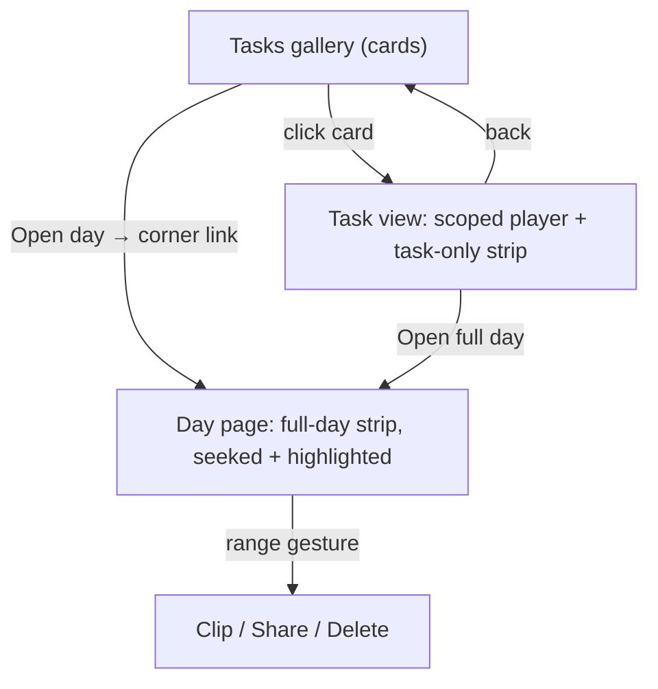
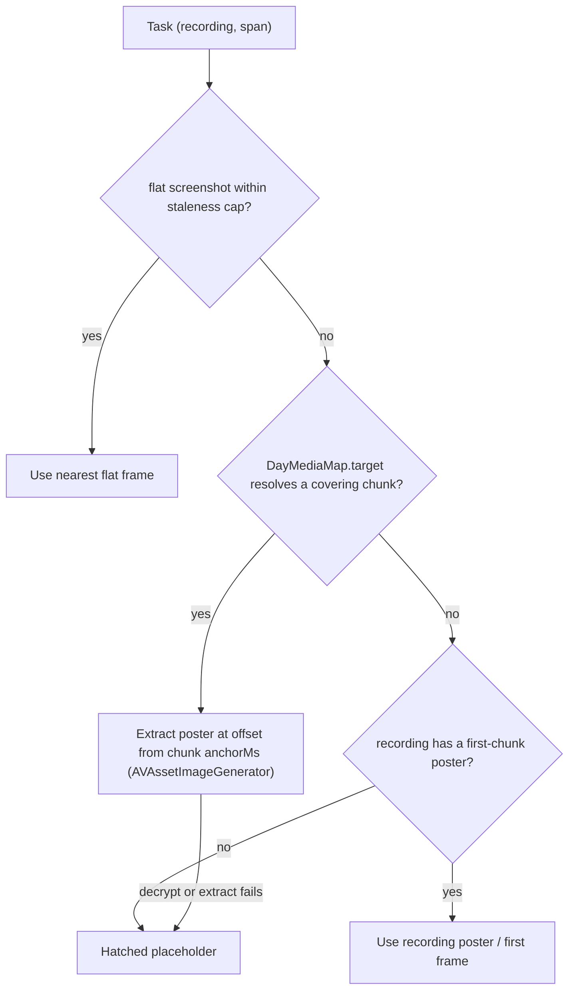
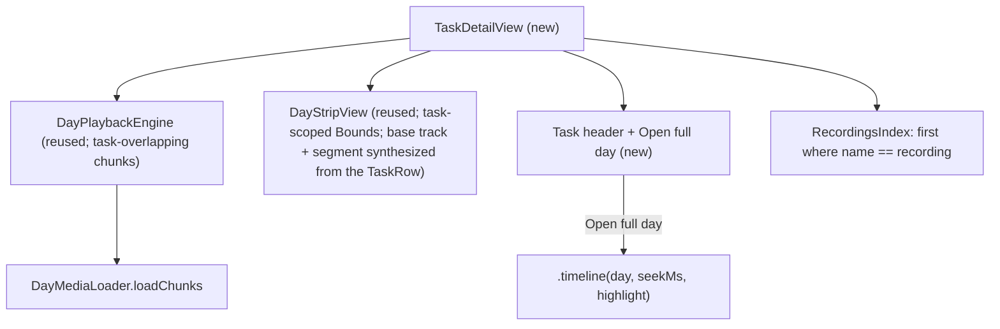

# Tasks Gallery and Dedicated Task View - Plan

## Goal Capsule

- **Objective:** Rework the macOS app's Tasks surface so it presents as a gallery of task cards and opening a task lands on a task-scoped view (player + task-only strip), not the whole day — while keeping the full day one click away.
- **Product authority:** The Product Contract below. This revises the day-first navigation plan ([docs/plans/2026-07-18-001-feat-day-first-days-tasks-navigation-plan.md](docs/plans/2026-07-18-001-feat-day-first-days-tasks-navigation-plan.md)) R4; that plan otherwise still governs Days, the day page, and the range gesture.
- **Execution profile:** App-side Swift only — no daemon, CLI, MCP, or capture-engine changes. Verified by Swift unit tests on new pure helpers plus manual QA.
- **Stop conditions:** Surface a blocker instead of guessing when a change would touch the capture/daemon layer, weaken the honesty/privacy posture (masked-frame handling), or expand beyond the Tasks surface. The day page and range gesture (clip/share/delete) are out of scope — do not modify them.
- **Open blockers:** None.

---

## Product Contract

Product Contract preservation: changed R2 and AE3 — thumbnail privacy aligned to the existing local behavior (masking is upload-scoped; the day-page player already shows masked frames locally), confirmed with the user before writing units. All other Product Contract IDs unchanged.

### Summary

Present the Tasks surface as a gallery of task cards (like the retired Library grid) instead of the current text list, and make clicking a card open a dedicated, task-scoped view — playback of the task's footage with a strip whose axis covers only that task — rather than dropping the user on the full day. The day stays reachable from both the card and the task view.

### Problem Frame

The day-first restructure (2026-07-18) made the day page the single footage surface: opening a task from the Tasks list seeks the full day and highlights the task's band on an 08:00–21:00 axis. In practice the task reads as a thin sliver on a full-day strip — clicking a task does not feel like opening the task, and the founder consistently reaches for the day when they wanted the task.

Separately, that restructure replaced the recording gallery with a text-row Tasks list. The gallery it replaced showed thumbnails, which the founder found faster to scan and recognize. So the surface used most for browsing is now both harder to scan and unfocused on the thing that was clicked.

### Key Decisions

- **Dedicated task view, not the day page.** Opening a task lands on a task-scoped surface (player + task-only strip), reversing the day-first plan's R4 ("opening a task lands on its day page seeked to the task's span"). This re-introduces a task-scoped footage surface that the restructure had merged into the day page — accepted deliberately, because the founder wants opening a task to *be* the task.
- **Gallery replaces the list.** The Tasks surface returns to thumbnail cards, not a list-or-gallery toggle.
- **Card click opens the task; the day is a secondary link.** The card body opens the task view; a small "Open day →" link in the card corner reaches the full day. Task-first, fewer controls per card than twin buttons.
- **The day-first work is demoted, not deleted.** "Open full day" reuses the existing day-page-seeked-and-highlighted behavior, so the day page stays the single full-day surface and the range gesture stays there.
- **Thumbnails follow the local view convention.** Masking governs upload, not local view; the local player already shows masked frames. Task cards inherit that — masked frames are shown, and the placeholder appears only for genuinely blocked/absent footage or a sealed vault.

Navigation shape:

### Requirements

**Gallery**

- R1. The Tasks surface renders as a gallery of task cards — thumbnail, task name, wall-clock range, and optional category chip — replacing the text-row list.
- R2. A card's thumbnail is a representative frame drawn from the task's own span. Consistent with the rest of the local UI, masked frames are shown locally (masking governs upload, not local view); the card falls back to the placeholder only when no frame is available — a genuinely blocked or absent interval, or a sealed vault.
- R3. The existing name filter and per-task curation (rename, delete) carry over to the gallery.

**Opening a task**

- R4. Clicking a card opens a dedicated task view scoped to that task, not the whole day.
- R5. The task view plays the task's footage, shows a strip whose axis spans only the task, and heads with the task name, wall-clock range, and apps/category.
- R6. The task view carries honest states for a live/in-progress task, a fully blocked or absent task, and a sealed vault — never a blank or misleading state.

**Keeping the day reachable**

- R7. The day stays one click away: an "Open day →" link on each card and an "Open full day" control in the task view open the full day page seeked to the task with its band highlighted — the behavior tasks previously opened into.

### Acceptance Examples

- AE1. Covers R1, R4. Given the Tasks gallery, clicking a task card opens the dedicated task view scoped to that task's span — not the full-day timeline.
- AE2. Covers R7. Using a card's "Open day →" link, or the task view's "Open full day" control, opens the full day page seeked to the task with its band highlighted.
- AE3. Covers R2. Given two tasks in the same recording, each card shows a frame drawn from within its own span (masked frames included, matching the day page). A task whose span is genuinely blocked/absent, or whose vault is sealed, shows the placeholder instead.
- AE4. Covers R6. A still-recording (live) task opens in the task view represented honestly as in-progress, not as an error or an empty state.

### Scope Boundaries

- Clip / share / delete stay on the full day page's range gesture — the task view is watch-and-rename in v1.
- Chat and search citations still land on the day page (day-first R13 unchanged); this brief covers the Tasks surface only.
- No MCP/agent-surface changes and no capture/daemon changes — app surfaces only.
- Gallery replaces the list; no list-or-gallery toggle.

#### Deferred to Follow-Up Work

- Hard end-of-task playback clamp (v1 bounds playback by loading task-overlapping chunks, which is chunk-granular; see KTD-2).
- A local-only "hide masked frames in task thumbnails" mode (a new masking rule distinct from the upload boundary), if ever wanted.

### Dependencies / Assumptions

- Reuses existing app machinery: `RecordingCardThumbnail` ([macos/Screencap/Views/Shared/RecordingCardThumbnail.swift](macos/Screencap/Views/Shared/RecordingCardThumbnail.swift)), `ThumbnailLoader`, `RecordingFrameIndex` for card thumbnails; `DayPlaybackEngine`, `DayMediaMap`, and `DayStripView` for the scoped player and strip; `RecordingsIndex` for per-task recording summaries.
- Task spans, names, and identity come from the `/v0/tasks.query` data the current Tasks surface ([macos/Screencap/Views/Tasks/TasksView.swift](macos/Screencap/Views/Tasks/TasksView.swift)) already loads; no new daemon verb is needed.
- Success signal (n=1, founder): opening a task lands you watching that task's footage scoped, the full day is one click away, and the Tasks surface reads as a browsable gallery.

---

## Planning Contract

### Key Technical Decisions

- KTD-1. **New `ShellRoute.taskDetail` case, not a reuse of `.timeline`.** The task view is a distinct surface. Add a `taskDetail` case to `ShellRoute` ([macos/Screencap/Views/Shell/ShellSidebar.swift](macos/Screencap/Views/Shell/ShellSidebar.swift)) carrying the identifying `TaskRow` fields (recording, task index, day, start/end ms) as Hashable values, mirroring `DaySpanHighlight` (tuples aren't Hashable). Map `taskDetail → .tasks` in `ShellSidebarModel.highlightedRoute(for:)` so the Tasks sidebar row stays lit. Keep the plain `HStack` shell — no `NavigationSplitView`/`NavigationStack` (occlusion trap, PR #335, [docs/solutions/ui-bugs/swiftui-hidden-toolbar-navigationsplitview-occludes-traffic-lights.md](docs/solutions/ui-bugs/swiftui-hidden-toolbar-navigationsplitview-occludes-traffic-lights.md)).
- KTD-2. **Reuse `DayPlaybackEngine` unchanged; bound the task view by loading only task-overlapping chunks.** The engine is thin (`load(chunks:seekToMs:)`, no `[startMs,endMs]` clamp). The task view builds the recording's chunks via the same `DayMediaLoader.loadChunks` path the day page uses, filters to chunks overlapping the task span, and calls `load(chunks:, seekToMs: startMs)`. Playback is therefore chunk-granular — it can run past the task end into the remainder of the last overlapping chunk. Acceptable for v1: the strip axis is bounded to the task, so the visual scope reads as the task; a hard end-clamp is deferred. Manual QA covers the overrun case (the strip playhead pins at the right edge while video keeps advancing — a known, not-frozen behavior).
- KTD-3. **Task-scoped strip = existing `DayStripView` with a task-scoped `Bounds`.** `DayStripView` is axis-agnostic (maps time→x purely from the passed `Bounds`). The task view passes `Bounds(startMs:endMs:)` for the task span (± small padding) instead of `DayStripLayout.axisBounds(...)`. Its base track and segment are synthesized from the loaded `TaskRow` (one `DayStripBaseTrack`, one `DayStripSegment`) — not from a `/v0/timeline.day` call, so opening a task never loads the whole day. A tiny task-scoped bounds helper replaces the day/waking-window `axisBounds`.
- KTD-4. **Per-timestamp thumbnail extractor with an honest fallback chain.** `RecordingCardThumbnail`/`RecordingFrameIndex` only yield a recording's first frame or first-chunk poster — no frame from within a task span (and default capture is video, so flat `screenshots/*.jpg` are usually absent, so `resolve(anchorMs:)` returns nil for most finished recordings). The card resolves its frame in a fixed order: (1) the nearest flat screenshot via `resolve(anchorMs:)` when one exists within the staleness cap; (2) a poster from the covering video chunk; (3) the recording's first-chunk poster / first frame; (4) the placeholder. Step 2 is the new work: resolve the task offset to a `(chunk, in-chunk offset)` via `DayMediaMap.target(atMs:in:)` over the recording's `DayPlayableChunk`s (from `DayMediaLoader.loadChunks`), then extract at that offset with `AVAssetImageGenerator` (mirroring `extractPoster`). The offset is measured from the chunk's first-written-frame `anchorMs`, not the manifest `chunk_start` — under action-gated capture the anchor is later than `chunk_start`, and `offset = t − chunk_start` would mis-seek to a black idle lead-in (KTD-12 of the day-first plan). Privacy follows the existing local convention (KTD-5): masked frames are shown; a decrypt failure or an absent/blocked interval yields no frame → placeholder. No new local-masking logic.
- KTD-5. **Thumbnail and player privacy follow the existing local convention.** Masking is upload-scoped; `RecordingCardThumbnail`/`ThumbnailLoader` already surface masked frames locally and fall back to the placeholder only on decrypt failure or absent frames, and the day-page player shows masked frames locally too. Task cards and the task-view player inherit this unchanged (R2/AE3 as revised). The sealed-vault gate (render `StoreStateView` when the store isn't mounted, before the grid/player body) is preserved so no thumbnail extraction is dispatched against a sealed vault.
- KTD-6. **Gallery mirrors the retired Library grid recipe.** A 3-flexible-column `LazyVGrid` (inter-column spacing 20), with one shared `RecordingFrameIndex` + `ThumbnailLoader` across all cards (not per-card), and the same shell padding the current `TasksView.populated` uses. Preserve the existing day grouping, name filter, rename/delete curation, and honest zero/degraded states.
- KTD-7. **Tear down the player on task-view exit.** Call `DayPlaybackEngine.tearDown()` when leaving the task view (back to the gallery, or "Open full day") before the day page spins up its own engine, and drive the teardown on the navigation edge rather than behind async work ([docs/solutions/ui-bugs/recording-hud-frozen-on-stop-decouple-teardown-from-finalization-2026-07-08.md](docs/solutions/ui-bugs/recording-hud-frozen-on-stop-decouple-teardown-from-finalization-2026-07-08.md); day-first KTD-12 AVPlayer-teardown precedent).

### High-Level Technical Design

Thumbnail resolution — the fallback chain a task card walks (KTD-4):

Task view composition — what is reused vs. new (KTD-2, KTD-3):

### Sequencing

U1 (thumbnail extractor) and U2 (task view) are independent and land first. U3 wires the task view into routing — this is where the core behavior change ships (opening a task now shows the task view). U4 turns the list into a gallery. Each unit leaves the app shippable: U1 adds a helper with no UI change; U2 adds a not-yet-reachable view; U3 makes opening a task scoped; U4 changes the Tasks presentation to a gallery.

---

## Implementation Units

| U-ID | Title | Depends on |
|---|---|---|
| U1 | Task-span thumbnail extraction | — |
| U2 | Dedicated task view | — |
| U3 | Route and navigation wiring | U2 |
| U4 | Tasks gallery | U1, U3 |

### U1. Task-span thumbnail extraction

- **Goal:** Produce a thumbnail frame from within a task's span (not the recording's first frame), with an honest fallback chain.
- **Requirements:** R2 (AE3).
- **Dependencies:** None.
- **Files:** `macos/Screencap/Controllers/RecordingFrameIndex.swift` (new poster-at-offset path), `macos/ScreencapTests/TaskThumbnailResolutionTests.swift` (new).
- **Approach:** Build the chunk-poster step of KTD-4's chain: resolve the task offset to a `(chunk, in-chunk offset)` via `DayMediaMap.target(atMs:in:)` over the recording's `DayPlayableChunk`s (`DayMediaLoader.loadChunks`), then extract at that offset with `AVAssetImageGenerator` — mirroring `extractPoster`/`firstVideoChunkURL`. Measure the offset from the chunk's `anchorMs` (first written frame), not the manifest `chunk_start`, so an action-gated chunk that begins idle yields a frame from the task moment rather than a black lead-in (KTD-4). The full resolution order is KTD-4's chain — flat-frame `resolve(anchorMs:)` first, then this chunk poster, then the recording poster / first frame, then the placeholder. Privacy is the existing local convention (KTD-5) — no new masking branch.
- **Patterns to follow:** `RecordingFrameIndex.extractPoster` / `firstVideoChunkURL` / `posterFrame`; `DayMediaLoader.loadChunks` + `DayMediaMap.target(atMs:in:)` for anchor-correct `(chunk, offset)` resolution.
- **Execution note:** The task-offset→`(chunk, offset)` resolution is a pure function over the chunk list — test it against fixture chunks before wiring the `AVAssetImageGenerator` extraction.
- **Test scenarios:** For a task offset in the middle of a multi-chunk recording, resolution picks the covering chunk and computes the offset from that chunk's `anchorMs` (an action-gated chunk that begins idle yields the task-moment offset, not the idle lead-in); an offset outside every chunk returns nil and falls through; the flat-frame path returns a frame when a `screenshots/*.jpg` exists within the staleness cap and falls through otherwise; a decrypt-unavailable result yields nil (→ placeholder). The `AVAssetImageGenerator` extraction itself is covered by manual QA.
- **Verification:** New tests green; manual — a recording with two tasks shows two different card frames drawn from each task's own moment.

### U2. Dedicated task view

- **Goal:** A read-only task-scoped surface: player of the task's footage, a strip bounded to the task span, a task header, and "Open full day".
- **Requirements:** R4, R5, R6, R7 (the "Open full day" arm).
- **Dependencies:** None (reuses the existing engine/strip; made reachable in U3).
- **Files:** `macos/Screencap/Views/Tasks/TaskDetailView.swift` (new), `macos/Screencap/Views/Tasks/TaskSpanLayout.swift` (new — task-scoped `Bounds` + chunk-overlap selection, pure), `macos/ScreencapTests/TaskDetailLayoutTests.swift` (new), `macos/ScreencapTests/MockStringSweepTests.swift` (extend — the task-view header sweep this unit's test scenario needs).
- **Approach:** Compose `AVPlayerNSView(player: engine.player)` (reuse the day view's `playbackPane` pattern) + `DayStripView` with a task-scoped `Bounds` (KTD-3) + a header (task name, `timeRangeText`, apps/category, Back, "Open full day"). Resolve the task's `RecordingSummary` from `RecordingsIndex` (`first { $0.name == recording }`), build chunks via `DayMediaLoader.loadChunks`, filter to those overlapping the task span, and `engine.load(chunks:, seekToMs: startMs)` (KTD-2). Synthesize the strip inputs from the loaded `TaskRow` — one `DayStripBaseTrack` spanning the task (title from `RecordingsIndex`, falling back to the recording name) and one `DayStripSegment` from `(recording, taskIndex, name, category, startMs, endMs)`; no `/v0/timeline.day` call, and provenance/gap inputs stay at their neutral defaults. Honest states (R6): (a) a live/in-progress task — bound the strip end to `now` (recomputed on the same daemon recording tick the day page uses), render the header range open-ended ("HH:MM – now") with a small in-progress indicator, and let the playhead follow the growing last chunk (no auto-scrub); the live signal derives from the task's recording via `RecordingsIndex` (the recording is actively recording and the task has no fixed end), since `TasksQueryTask` carries no live flag; (b) a fully blocked/absent span — placeholder + honest caption, the strip still rendering its empty task-scoped axis; (c) a sealed vault — `StoreStateView`. Never blank. Tear down the engine on exit (KTD-7). "Open full day" invokes a closure the host maps to the timeline route.
- **Patterns to follow:** `DayTimelineView` `playbackPane` and its `DayStripView` wiring; `StoreStateView` sealed-state branch (as in `TasksView`); `DayPlaybackEngine.load`/`seek`/`tearDown`.
- **Execution note:** Extract the task-scoped `Bounds` and the chunk-overlap selection as pure functions and test them first, mirroring `DayStripLayoutTests`.
- **Test scenarios:** The task-scoped bounds cover exactly the task span (± padding); for a live task the bounds end resolves to `now`; chunk-overlap selection keeps only chunks intersecting the task span and drops the rest; the strip inputs synthesize one base track + one segment from the `TaskRow` with no `timeline.day` call; the seek target equals the task start; the honest-state model resolves live / blocked / sealed to distinct states. Covers AE4 (live task → in-progress state). View rendering is manual QA; mock-string sweep confirms the header shows no recording name.
- **Verification:** `TaskDetailLayoutTests` green; manual — open a task, confirm the scoped strip and that playback starts at the task, and that "Open full day" lands on the day page highlighted.

### U3. Route and navigation wiring

- **Goal:** A `.taskDetail` route opens `TaskDetailView`; opening a task routes there; the Tasks sidebar row stays highlighted; the day stays reachable.
- **Requirements:** R4, R7 (routing).
- **Dependencies:** U2.
- **Files:** `macos/Screencap/Views/Shell/ShellSidebar.swift` (enum case + `ShellSidebarModel.highlightedRoute`), `macos/Screencap/Views/MainWindow.swift` (detail case + closure rewire + `lastNonTimelineRoute`), `macos/Screencap/Views/Tasks/TasksView.swift` (open-task vs open-day closures), `macos/ScreencapTests/ShellSidebarModelTests.swift`.
- **Approach:** Add the `taskDetail` case (KTD-1). In `MainWindow`, add a `.taskDetail` detail-view case building `TaskDetailView(...)` with `.id` on a task key and `onBack: { route = .tasks }` — the task view returns to the gallery explicitly; routing its Back through `lastNonTimelineRoute` would self-loop, because entering `.taskDetail` records itself as the last non-timeline route. Give the task view an "Open full day" closure that sets `.timeline(day:seekMs:highlight:)`. Rewire `TasksView`'s single open closure into `onOpenTask` (→ `.taskDetail`) and `onOpenDay` (→ `.timeline`). Map `taskDetail → .tasks` in `highlightedRoute(for:)`, and add `.taskDetail` to the `onChange(of: route)` list that records `lastNonTimelineRoute` solely so the day page's Back (`route = lastNonTimelineRoute`) returns to the task view. HStack shell unchanged (KTD-1).
- **Patterns to follow:** the existing `.timeline` detail-view case and `onBack`; `ShellSidebarModel` as a pure tested model.
- **Test scenarios:** `highlightedRoute(.taskDetail(...))` is `.tasks`; `isActive` lights the Tasks row while on `taskDetail`; the task view's Back lands on `.tasks`, and the day page opened via "Open full day" returns Back to `.taskDetail` (the full round-trip tasks → taskDetail → timeline → back → taskDetail). Covers AE2 (the day route is reached).
- **Verification:** `ShellSidebarModelTests` green; manual — open a task, confirm Tasks stays highlighted and Back behaves.

### U4. Tasks gallery

- **Goal:** The Tasks surface renders as a gallery of task cards; a card opens the task view; a corner "Open day →" link opens the day; filter, curation, and honest states are preserved.
- **Requirements:** R1, R3, R7 (the card "Open day" arm).
- **Dependencies:** U1, U3.
- **Files:** `macos/Screencap/Views/Tasks/TasksView.swift` (list → gallery; new `TaskCard`), `macos/ScreencapTests/TasksModelTests.swift` (extend if needed), `macos/ScreencapTests/MockStringSweepTests.swift`.
- **Approach:** Replace the `TaskRowView` list with a 3-column `LazyVGrid` of `TaskCard`s (KTD-6 recipe), with a shared `RecordingFrameIndex` + `ThumbnailLoader`. Each card shows the task-span thumbnail (U1), name, `timeRangeText`, and an optional category chip — the R1 element set (no separate duration chip; the wall-clock range already conveys span). The whole-card button calls `onOpenTask`; the "Open day →" corner link is a separate `Button` layered above the card with its own `contentShape` and an event-consuming plain style so its tap never also fires `onOpenTask` (avoiding the button-in-button footgun), with a distinct hover/pressed state, placed as the card's second focusable element (card → day-link keyboard order). Keep the day grouping (`TasksModel.listState` / `DayGroup`), the name filter, rename/delete curation via `DayTasks`, and the honest `filterZero` / `systemZero` / sealed states. Resolve each task's `RecordingSummary` from `RecordingsIndex` for its thumbnail.
- **Patterns to follow:** the retired `LibraryView` grid recipe (git `455fadd0~1:macos/ScreenCap/Views/Library/LibraryView.swift`); the current `TasksView.populated` shell padding and state machinery; `RecordingCardThumbnail`.
- **Test scenarios:** Grouping, filter, and curation still round-trip (existing `TasksModelTests`); a non-empty list filtered to zero shows "No tasks match", not the system-zero copy; a card tap invokes the task route while a tap on the corner link invokes the day route and does NOT also fire the task route; the mock-string sweep passes (no `rec-<timestamp>` on the gallery). Covers AE1 (card → task view) and AE2 (corner link → day route). Grid layout is manual QA.
- **Verification:** `TasksModelTests` + mock-string sweep green; manual — the gallery renders with per-task thumbnails, a card opens the task view, and the corner link opens the day.

---

## Verification Contract

| Gate | Command | Applies to |
|---|---|---|
| Swift unit tests | `cd macos && xcodegen generate && xcodebuild test -project Screencap.xcodeproj -scheme Screencap -only-testing:ScreencapTests` | U1–U4 (pure helpers/models) |
| Mock-string sweep | included in `ScreencapTests` (`MockStringSweepTests`) | U2, U4 — no recording names on the new surfaces |
| Manual QA | gallery render + per-task thumbnails; task-view scoped playback + strip; live-task in-progress state; chunk-overrun playhead; "Open full day" round-trip; sidebar highlight; honest states (live / blocked / sealed) | U2, U4 |

Constraints: `xcodegen generate` is mandatory after adding Swift files (the `.xcodeproj` is gitignored). No Python or daemon changes, so the pytest privacy lane does not apply. Run the full `xcodebuild test` gate from the main checkout — in a `~/Documents` worktree, `xcodebuild test` launches the test host and TCC-bricks the session, so use compile-only `xcodebuild build-for-testing` there.

---

## Definition of Done

- U1–U4 complete in dependency order; R1–R7 each satisfied by at least one unit's verified behavior; AE1–AE4 pass as automated tests or documented manual QA.
- Opening a task from the Tasks surface lands on the dedicated task view scoped to the task; "Open day →" (card) and "Open full day" (task view) reach the existing day-page-seeked-and-highlighted behavior; the task view's Back returns to the gallery.
- The Tasks surface renders as a gallery with per-task thumbnails; no `rec-<timestamp>` recording names appear on the gallery or task view (sweep green).
- The day page and its range gesture (clip/share/delete) are unchanged; no daemon/CLI/MCP/capture changes.
- `xcodegen generate` run after adding Swift files; Swift unit tests green.
- Abandoned-attempt code from any dead-end approaches is removed — the final diff contains only the shipped design.
