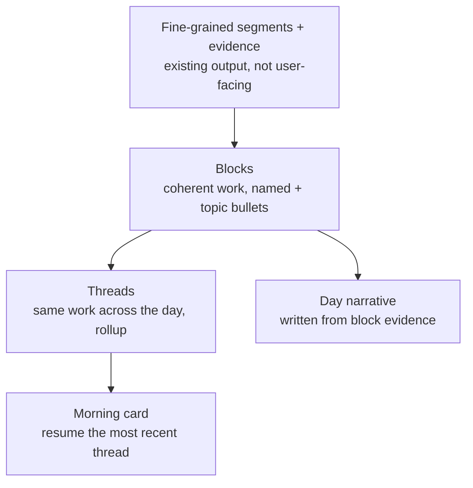
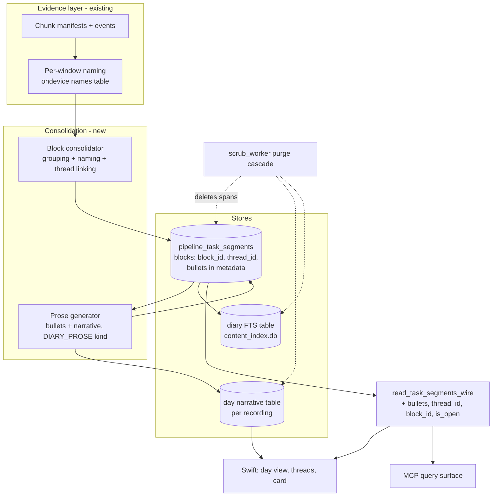
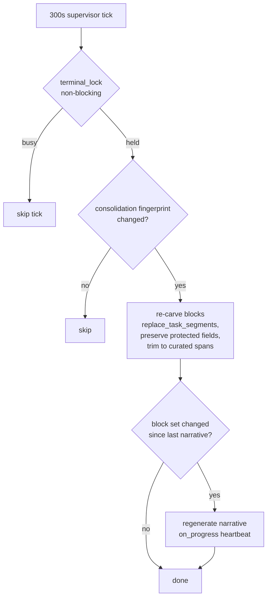

# Day Diary Task Segmentation - Plan

## Goal Capsule

- **Objective:** Turn the task layer into a day diary the app writes for the user — coherent, well-named work blocks with searchable topic summaries, linked into threads when the same work recurs, topped by a written day narrative and a morning resume card.
- **Product authority:** Rute Figueiredo (product owner) — scope confirmed in brainstorm and plan synthesis.
- **Authority hierarchy:** this plan > repo conventions (CLAUDE.md, SECURITY.md) > implementer judgment on details the plan leaves open.
- **Stop conditions:** surface a blocker instead of guessing when a change would contradict a Product Contract requirement, weaken a privacy invariant (local-only diary content, purge coverage, on-device-only day-split), or require a new consent surface.
- **Execution profile:** Python/daemon units land first and are independently shippable; Swift units follow the wire contract. New pure logic (grouping, thread linking, protection split) is built test-first; all new privacy-bearing tests carry `@pytest.mark.privacy` or CI never runs them.
- **Open blockers:** none.

---

## Product Contract

### Summary

The task layer becomes a day diary. Fine-grained segments consolidate into a handful of coherent work blocks per day, each named for the work (not the window) and carrying short searchable topic bullets. Recurring sittings of the same work stay chronological but link into one thread with a rolled-up total. The day view opens with a written, evidence-bound narrative of the day, and a morning card resumes the most recent thread ("Friday you left off at X — pick up here").

### Problem Frame

The intelligence layer does not yet deliver felt value; task segmentation is the chosen vehicle to change that, and today it reads as noise. A real half hour (2026-07-20, 16:53–17:24) produced eleven task rows — mostly one-minute fragments, three adjacent rows named identically, and names like "View" that describe a frontmost window rather than work. Nothing asks which fragments belong to the same piece of work, names carry no substance, and nearly every task lands in category `other`.

The user's actual recall needs are concrete: finding a moment by fuzzy topic memory ("something interesting about design systems", "that kick technique") weeks later, and bridging a gap ("what was I doing Friday, where do I pick up Monday?"). Both currently cost real search-and-replay time. A list of shallow fragments serves neither: names alone cannot be searched by memory, and fragments cannot be scanned as a day. The primary job, chosen explicitly over resume-continuity, insight analytics, and agent-fuel framings: recall and accounting — a work diary trustworthy at a glance.

### Key Decisions

- **Ship the full diary in one effort, not staged.** The staged path (blocks first, narrative later) was considered and rejected: the visible "the app wrote my day" moment is the point. The accepted cost is higher trust stakes for generated prose, mitigated by the evidence-bound rule below.
- **Consolidate over the existing fine-grained output; don't replace it.** The current segmentation keeps producing fine fragments as evidence; a consolidation step groups them into user-facing blocks. This preserves the working capture/segmentation machinery and gives the consolidator small inputs, which is what the on-device token ceiling demands.
- **Threaded recurrence over a merged per-task row.** When the same work recurs at different times, blocks stay in time order and link as one thread (rolled-up total, sitting count). A merged one-row-per-task view was rejected because the day's rhythm is part of the diary's truth; pure chronological repeats were rejected because nothing would connect the sittings for search, totals, or resume.
- **Evidence-bound prose everywhere.** Names, bullets, narrative, and card assert only what the underlying evidence supports. A thin-signal day reads thin or gets no narrative; the diary never pads. A wrong confident narrative damages trust more than a missing one.
- **Names describe work, never windows.** The diary never surfaces mechanical names (`task_N`) or raw window-title slugs; when naming is impossible, the block presents an honest unnamed state instead.

The derivation ladder — each layer is built only from the layer below it:

### Requirements

**Blocks — granularity and naming**

- R1. A day's diary is a small set of coherent work blocks — the grain at which the user would describe the day out loud — with adjacent fragments of the same work consolidated into one block.
- R2. Block names describe the work performed, never an app or window; mechanical fallback names and raw window-title slugs never appear as diary names, with an honest unnamed presentation when naming fails.
- R3. User curation (rename, merge, split, create, delete) applies at block level and survives re-consolidation, matching today's protection of user-edited rows.

**Substance — summaries and search**

- R4. Every block carries short topic bullets derived from evidence of what happened inside it.
- R5. Block names and bullets are searchable, so a fuzzy topic memory ("kick", "design systems") finds the block weeks later and jumps into its place in the day.
- R6. Summary richness degrades honestly with available signal: app/window-level bullets when screen-content signal is unavailable, never invented detail.

**Threads — recurring work**

- R7. Blocks of the same work within a day link into a thread: rows stay chronological, the thread carries a rolled-up total and sitting count, and search and resume land on the thread rather than a lone sitting.

**The written day**

- R8. The day view opens with a short written narrative of the day composed from block evidence.
- R9. The narrative is evidence-bound: on thin or mechanical-only days it shrinks or is absent, and it never asserts activity the blocks cannot support.
- R10. The diary fills as the live day progresses — blocks, threads, and narrative update during recording, not only after it ends.

**Morning card**

- R11. On app open after a work gap, a dismissible in-app card names the most recent thread and where the user left off, with a single action jumping back to that point in the day.
- R12. The card appears only when there is a real thread to resume, and only in-app — no macOS notifications.

**Privacy and lifecycle**

- R13. Summaries, narrative, and card content are derived-content sinks covered by the retroactive scrub purge, exactly as task names are today — a retroactively disabled app's content disappears from all of them.
- R14. Diary content is stored locally with the recording data and is never uploaded; generation follows the existing provider ladder and consent surfaces, with no new consent introduced.
- R15. The full diary works end-to-end on-device with thinner prose; screen-content indexing and consented cloud models enrich it but are not required.

### Key Flows

- F1. Scan the day
  - **Trigger:** The user opens a day.
  - **Steps:** The narrative reads in seconds; blocks below it confirm and locate the details.
  - **Outcome:** "What did I do?" answered without replaying anything.
  - **Covers R1, R2, R4, R8.**
- F2. Fuzzy recall
  - **Trigger:** The user searches a half-remembered topic weeks later.
  - **Steps:** The search hits a block or thread by name/bullets; the user jumps to its place in the day.
  - **Outcome:** The moment is found without scrubbing timelines.
  - **Covers R5, R7.**
- F3. Morning resume
  - **Trigger:** The user opens the app after a gap.
  - **Steps:** The card names the last thread and stopping point; one action jumps back in.
  - **Outcome:** Re-entry without reconstructing Friday from memory.
  - **Covers R7, R11, R12.**
- F4. Curate
  - **Trigger:** The user renames, merges, or splits a block.
  - **Steps:** The edit is applied and protected; later re-consolidation and narrative updates respect it.
  - **Outcome:** The diary stays the user's record, not the model's.
  - **Covers R3.**

### Acceptance Examples

- AE1. **Covers R1, R2, R4.** The recorded 16:53–17:24 stretch that today yields eleven fragments ("View", "Screencap", "Brainstorming" ×3, …) yields one block named for the work with 2–3 topic bullets.
- AE2. **Covers R5, R7.** The same work at 10:12–11:05 and 15:40–16:30 shows as two chronological rows linked as one thread with a rolled-up total; searching a topic from the morning sitting lands on the thread.
- AE3. **Covers R6, R9.** With the content index off and no cloud consent, blocks show app-level bullets and the narrative is short — nothing fabricated. On a mechanical-only day (model unavailable), blocks show the honest unnamed state and no narrative renders.
- AE4. **Covers R11, R12.** Opening the app Monday after Friday work shows the card naming Friday's thread and stopping point; opening after a weekend with no resumable thread shows no card.
- AE5. **Covers R13.** Retroactively disabling an app removes its traces from block names, bullets, the narrative, and the card for affected spans — including blocks the user has renamed (name edits are protected; agent-written bullets remain purge-eligible).

### Success Criteria

- The glance test: the user recognizes their own day from the diary without opening a single frame.
- Block grain matches an out-loud description of the day — blocks per day in the single digits for a typical day, not dozens.
- A weeks-old moment is findable from a fuzzy topic memory in under a minute.
- The diary is worth opening daily — the user returns to it unprompted.

### Scope Boundaries

- No new capture signals — the diary is built from evidence the recorder already captures.
- No time-tracking or analytics dashboards — this is recall, not measurement; the thread rollup is the only accounting surface.
- No sharing surfaces, and no auto-created highlight clips — clipping stays deliberate per the Moments plan, whose decisions (merged surface, "Clipped" marker) are untouched.
- No macOS notifications; the card is the only push-shaped moment and it lives in-app.
- Thread curation is never exposed as an agent/MCP mutation — mirrors `SECURITY.md`'s documented tool-surface posture (its rule R18: no destructive mutation forwarding; not an R-ID of this plan).

### Deferred to Follow-Up Work

- Cross-day threads (Friday's thread continuing Monday as one identity). The morning card only *reads* the previous day's last thread; no cross-day identity ships in v1.
- Recall/Chat grounding on diary blocks — a net-new fourth evidence stream for `src/screencap/recall/orchestrator.py`. When picked up, the grounding prompt must change in **both** `src/screencap/segmentation/generation_finish.py` and `macos/IntelligenceHelper/main.swift` (hand-mirrored by convention), or on-device Chat silently diverges from cloud Chat.
- Bulk backfill of diary treatment over historical recordings. If built, its job progress events must follow the recording-name-free opaque-ordinal contract in `src/screencap/daemon/backfill_job.py`.
- Exposing the day narrative over MCP — a separate proportionality decision; v1 exposes blocks/bullets/threads only.
- Moments merge interplay (`docs/plans/2026-07-20-002-feat-moments-merge-tasks-clips-plan.md`): that plan consumes task rows as an opaque union input; diary schema lands first (see KTD-12) and Moments re-bases its row model on blocks when it ships.

### Dependencies / Assumptions

- Existing seams suffice and were verified against HEAD on 2026-07-20: per-task metadata storage, protected user edits with agent-row replacement, the retroactive purge already reaching task-name sinks (SCR-280), the live incremental segmentation cadence, and local content search.
- Diary durability rides recording durability: task rows survive chunk eviction (retention never touches the per-recording database), so entries outlive the heavy data; deleting a whole day deletes its diary. Accepted under the default keep-forever posture.
- The canonical segmentation prompt already requests work-focused names, descriptions, categories, and confidence; the on-device path currently omits descriptions and confidence to fit its token window — the consolidation layer is the planned route around that ceiling, not a bigger single call.

---

## Planning Contract

**Product Contract preservation:** unchanged — R1–R15, F1–F4 as brainstormed; AE5 gained one clarifying clause (renamed blocks stay purge-eligible, per KTD-3, confirmed with the product owner); Scope Boundaries gained the MCP-mutation non-goal and the Deferred subsection. The brainstorm's Outstanding Questions are all resolved by the KTDs below.

### Key Technical Decisions

- KTD-1. **Blocks are the agent task rows.** The consolidation pass writes blocks as the agent-owned rows of `pipeline_task_segments` (scoped delete-then-insert via `replace_task_segments`, exactly the existing pattern). The fine per-window names remain internal evidence in the existing on-device names table; they are never user-facing. Rationale: curation verbs, the SCR-280 purge, the wire projection, the Swift views, and the Moments plan all read this table — landing blocks there upgrades every consumer at once with no parallel store.
- KTD-2. **Stable block identity.** New `block_id` column (opaque token) assigned by the consolidator and preserved across re-carves when a block's span/evidence is substantially the same; `thread_id` column links same-work blocks within a day. Rollups (total minutes, sitting count) are computed at read time, not stored. Rationale: `replace_task_segments` renumbers `task_index` every pass, so deep links, the morning card, and thread membership need an identity that survives; storing rollups would drift.
- KTD-3. **Protection splits by field.** Today any user touch sets `edited=1` and freezes the whole row against both re-segmentation and the retroactive purge. The diary splits this: the edit-protection scope is recorded per field (name/category/time vs. bullets), user-edited fields are protected, and agent-written bullets on a user-renamed block remain purge-eligible and re-generatable. Rationale: without the split, renaming a block silently exempts its bullets from AE5's privacy promise.
- KTD-4. **Prose is a new `TaskKind` with its own consent row; structure stays on-device-class.** Bullets and narrative generation register a new kind (e.g. `DIARY_PROSE`) in `segmentation/consent.py` whose matrix row permits consented cloud; block consolidation rides the existing on-device-only posture. The `resolve_day_split` never-cloud assertion in `degrade.py` is not weakened. The provider seam mirrors `build_answer_provider`'s shape in `routing.py`. Rationale: `DAY_SPLIT` is hard-pinned to on-device/heuristic by a test-pinned assertion; reusing it would either break R15's consented-cloud enrichment or weaken a guarantee.
- KTD-5. **Midnight ownership mirrors the day-clamp rule.** Blocks clamp at local midnight the way `day_segments.py` clamps recordings (split, each part owned by its day), replacing the current tasks-owned-by-start-day rule for blocks. Threads do not span the split. Rationale: a 23:40–00:20 block filed wholly under yesterday breaks both the new day's narrative and the morning card's evidence.
- KTD-6. **Consolidation and narrative get their own staleness keys.** Both ride the existing 300s incremental tick, but each with its own fingerprint: consolidation re-runs when completed-manifest state or kept-curation state changes (the existing fingerprint shape); narrative regenerates only when the block set changed since last generation. Phases that scale with input emit progress via the established `on_progress(phase)` heartbeat when running inside the terminal lock. Rationale: the tick's fingerprint is deliberately coarse and fail-open; an expensive whole-day prose call must not re-run on every unchanged tick, and silent long phases behind the Swift watchdog are a documented past failure.
- KTD-7. **Trim, don't drop, around protected rows.** The carve-out that today drops any agent row overlapping a protected span is upgraded (for block-grain rows) to trim agent block boundaries so they abut curated blocks cleanly. Rationale: dropping a 60-minute block because a user-merged block overlaps one minute of it fragments the diary around every curated row.
- KTD-8. **Search lands in a sibling FTS table inside `content_index.db`.** A block-text FTS table keyed by `(recording, block_id)` with span metadata, written after consolidation, replaced idempotently per recording, purged in the same cascade as other sinks, and queried via the daemon search surface. The narrative is never indexed. Rationale: the cross-day tasks list is windowed/paginated and the in-app filter only matches loaded rows — "find a weeks-old moment in under a minute" needs a real index; `content_index.db` already carries the hardened-permissions, local-only, FTS5-with-fallback machinery.
- KTD-9. **One wire projection serves all consumers; MCP gets blocks, not the narrative.** `read_task_segments_wire` (shared by `tasks.list`, `tasks.query`, and MCP) gains `bullets`, `thread_id`, `block_id`, and `is_open`; Swift models decode them with `decodeIfPresent` for forward compatibility. The narrative is a separate app-only read verb. No thread mutation is forwarded over MCP. Rationale: the projection is the single seam feeding three consumers; extending it once gives app/agent parity for free, while narrative prose exposure is a deliberate, separate proportionality call.
- KTD-10. **Honesty extends the existing outcome vocabulary; degradation is observable.** Narrative gating uses the per-recording outcome (`produced_tasks` / `mechanical_only` / …); a day with mixed recordings composes a partial narrative covering only the recordings with real names. Every prose fallback (model unavailable, budget exhausted) records an observable marker (source/reason field), never a silent degrade. Rationale: the outcome chain (ledger → verbs → `RecordingHonestState` → zero-state copy) already exists; a past on-device regression degraded silently for weeks because fallback left no signal.
- KTD-11. **Morning card is computed fresh, gated by a session-gap config.** The card derives from live daemon state on each app open (no cached snapshot — a deleted day cannot be named), fires only when the gap since the last recorded activity exceeds a new config threshold (default 4h; `rest_threshold`'s 120s grain is wrong for this), and its dismissal persists keyed by (day, thread) via the existing hint-store pattern.
- KTD-12. **Sequencing: Python/daemon first; UI targets the surface that exists.** Units U1–U7 are independent of the Moments merge. Swift units target the current Tasks/Days views; if the Moments merge lands first, U8 re-targets `MomentsView`/`MomentsModel` with the same wire contract. The diary schema (block rows + `thread_id`) lands before Moments re-bases either way.

### High-Level Technical Design

Component and data flow — what writes what, and which consumers read each store:

Live-tick control flow — when each pass runs and what makes it skip:

### Assumptions

- The Moments merge plan has not started; U8/U9 name the current views and re-target mechanically if Moments lands first (KTD-12).
- No bulk backfill: historical recordings gain diary treatment only when naturally re-segmented (e.g., a curation edit forces a re-carve).
- Block-identity matching across re-carves is heuristic (span overlap + evidence similarity); occasional identity churn on heavily reshaped days is acceptable, and threads self-heal on the next pass.

---

## Implementation Units

### U1. Schema, protection split, and wire projection

- **Goal:** The task table can represent blocks: stable identity, thread membership, field-level edit protection, and a wire shape that carries them.
- **Requirements:** R3, R7 (data model), R13 (protection split enabling AE5), KTD-2, KTD-3, KTD-9.
- **Dependencies:** none.
- **Files:** `src/screencap/pipeline_state.py`, `src/screencap/daemon/schema.py`, `src/screencap/tasks_query.py`, `tests/test_pipeline_state_tasks.py` (or the existing task-segment test module), `tests/daemon/test_tasks_query.py`.
- **Approach:** Add `block_id`, `thread_id`, and an edited-fields marker via the established `_TASK_SEGMENTS_ADDED_COLUMNS` + `_migrate_*_columns` pattern (PRAGMA table_info, guarded ALTER-ADD, duplicate-column race swallowed). Extend `read_task_segments_wire` with `bullets` (projected from `metadata`), `thread_id`, `block_id`, `is_open`; extend the pydantic response models. Rework the protection predicate so purge eligibility and re-segmentation protection consult field scope (`task_row_is_protected` keeps its row-level meaning for re-carve; a new field-scoped predicate serves the purge and bullet-regeneration paths). Preserve the disjoint user index range and cross-process write conventions (`busy_timeout=10000`, `BEGIN IMMEDIATE`).
- **Execution note:** Test-first on the protection-split predicate — it is the load-bearing privacy rule.
- **Test scenarios:**
  - Migration: opening an existing `recording.db` without the new columns adds them; a second concurrent opener hitting "duplicate column name" is tolerated.
  - Wire: a row with bullets/thread/block ids serializes all new fields; a row without them serializes without (older-daemon forward compat).
  - Protection split: a renamed block reports name-protected but bullets purge-eligible; a block whose bullets the user edited reports bullets protected; `replace_task_segments` still never deletes user/edited rows. Covers AE5 (data layer).
  - Read-only DB tolerance: schema ensure on a read-only file does not raise.
- **Verification:** `pytest tests/ -m privacy` green including the new tests (marked `@pytest.mark.privacy`, Vision-free).

### U2. Block consolidation and thread linking

- **Goal:** Fine fragments become a handful of coherent, named blocks with stable identity and same-day thread links, live and at finalize.
- **Requirements:** R1, R2, R7, R10; KTD-1, KTD-2, KTD-5, KTD-6, KTD-7; AE1, AE2.
- **Dependencies:** U1.
- **Files:** `src/screencap/segmentation/consolidate.py` (new), `src/screencap/segmentation/ondevice_pipeline.py`, `src/screencap/terminal_stage.py`, `src/screencap/daemon/supervisor.py`, `tests/segmentation/test_consolidate.py` (new), `tests/segmentation/test_ondevice_pipeline.py`.
- **Approach:** A pure grouping core (adjacency, app/topic affinity, gap tolerance) proposes block spans over the per-window evidence; a small model call (scripted-provider-testable, reusing the digest/`_halve_payload` budget seam) names each block and arbitrates merges; thread linking matches same-work blocks across the day (name/evidence affinity). Blocks clamp at local midnight (KTD-5). Block ids persist across re-carves by span/evidence matching; the carve-out trims agent blocks to abut protected spans instead of dropping them (KTD-7). The consolidator runs inside `_run_local_segmentation` so live and finalize share one body; the supervisor gains a consolidation-specific fingerprint (KTD-6). Mechanical names and raw slugs never surface: naming failure yields the honest unnamed state and an observable fallback marker (KTD-10).
- **Execution note:** Build the grouping core test-first over the in-memory fixtures; model calls always behind the scripted-fake seam.
- **Test scenarios:**
  - Covers AE1. Eleven adjacent same-work fragments consolidate to one block spanning the full stretch.
  - Covers AE2. Two separated sittings of the same work yield two blocks sharing one `thread_id`; an unrelated middle block gets none.
  - Identity: re-running consolidation on unchanged evidence preserves every `block_id`; adding one new chunk of the same work extends the last block without changing its id.
  - Protection: a user-renamed block survives a re-carve untouched; a neighboring agent block is trimmed to abut it, not dropped.
  - Midnight: a 23:40–00:20 work stretch yields two blocks split at local midnight, thread not spanning the split.
  - Fallback: model unavailable → blocks carry the unnamed honest state, never `task_N` or a window-title slug; the fallback marker is present.
  - Cadence: unchanged fingerprint skips the pass; a curation edit forces a re-run.
  - Live/finalize parity: the same evidence through the incremental path and the finalize path yields identical blocks.
- **Verification:** new tests green in the privacy lane; a real dogfood day (manual check) shows single-digit blocks.

### U3. Topic bullets — the prose kind

- **Goal:** Every block carries evidence-bound topic bullets, generated on-device by default and enriched by consented cloud.
- **Requirements:** R4, R6, R15; KTD-3, KTD-4, KTD-10; AE3.
- **Dependencies:** U1, U2.
- **Files:** `src/screencap/segmentation/consent.py`, `src/screencap/segmentation/degrade.py`, `src/screencap/segmentation/routing.py`, `src/screencap/segmentation/consolidate.py`, `src/screencap/segmentation/providers/gemini.py` (reuse of existing description output), `tests/segmentation/test_consent.py`, `tests/segmentation/test_consolidate.py`.
- **Approach:** Register the new prose `TaskKind` with its own consent-matrix row (on-device default; consented cloud allowed; heuristic fallback = app/window-level bullets). On-device: one small call per block over its digest. Cloud path: reuse the `description` text the existing prompt already produces and today discards. Bullets store in `metadata` under the field-scoped protection from U1. Bullets built from gate-blanked names must not assert content the gate rejected — bullets derive from evidence digests, not from downstream names. `resolve_day_split`'s never-cloud assertion is untouched.
- **Test scenarios:**
  - Consent matrix: prose kind resolves to on-device without consent, cloud with consent, heuristic when no model — day-split still never resolves to cloud.
  - Covers AE3 (bullets half): content signal absent → bullets are app-level, no invented specifics.
  - Purge interplay: after a span purge, bullets referencing the purged span are regenerated or dropped (with U5).
  - Budget: an over-budget digest halves via the existing seam before giving up; give-up leaves the observable marker.
- **Verification:** privacy-lane tests green; manual: a dogfood block shows 2–4 bullets matching what actually happened.

### U4. Day narrative

- **Goal:** A per-recording, evidence-bound narrative that the day view composes, regenerated only when blocks change.
- **Requirements:** R8, R9, R10; KTD-4, KTD-6, KTD-10; AE3.
- **Dependencies:** U2, U3.
- **Files:** `src/screencap/pipeline_state.py` (narrative table), `src/screencap/terminal_stage.py`, `src/screencap/segmentation/consolidate.py` (narrative call), `src/screencap/daemon/app.py` + `src/screencap/daemon/schema.py` (read verb), `tests/segmentation/`, `tests/daemon/`.
- **Approach:** New small table (narrative text, generated-at, source block-set fingerprint, reason) written under the standard transaction conventions. Generation uses the prose kind (U3) over block names+bullets+rollups only — never raw evidence — so the narrative cannot assert more than blocks support. Gating per recording by outcome reason: `mechanical_only`/`nothing_to_name` recordings contribute no narrative; a mixed day composes a partial narrative (KTD-10). Regeneration only when the block-set fingerprint changed (KTD-6), with `on_progress` heartbeat inside the terminal lock. Read verb: app-only `day.narrative`-style POST following the standard handler skeleton (pydantic validation, `store_state` on the envelope, `asyncio.to_thread`, typed errors); read-only, so it stays out of `_ACTIVITY_PATHS`.
- **Test scenarios:**
  - Covers AE3 (narrative half): mechanical-only recording → no narrative row; thin day → short narrative; mixed day → partial narrative covering only the produced-tasks recording.
  - Staleness: unchanged block set → no regeneration; a block rename regenerates.
  - Verb: locked store returns the healthy `store_locked` envelope, not a 500; response validates against the typed model.
  - Evidence bound: narrative generation input is exactly the block projection — a bullet-free day yields a names-only narrative, never invented detail.
- **Verification:** privacy-lane tests green; the read verb covered by an ASGI-transport test per the existing verb-test pattern.

### U5. Purge coverage for the new sinks

- **Goal:** The retroactive scrub purge reaches bullets, narrative, and the search index in the same cascade that already covers task names.
- **Requirements:** R13; KTD-3, KTD-8; AE5.
- **Dependencies:** U1, U3, U4 (U6 wiring lands with U6).
- **Files:** `src/screencap/enforcement/scrub_worker.py`, `tests/` (privacy-marked purge tests alongside the existing SCR-280 coverage).
- **Approach:** Extend the existing purge entry points (`_purge_task_segments`, the tasks.json purge) with: field-scoped bullet purge on protected rows (KTD-3 — name kept, bullets cleared/regenerated), narrative-row invalidation for affected recordings (regeneration picks it up next tick), and FTS row deletion (same transaction pattern as `_purge_content_index_intervals`). Never touch user-authored fields.
- **Execution note:** Characterization tests over the existing purge behavior first — this modifies a shipped privacy mechanism.
- **Test scenarios:**
  - Covers AE5. Disable an app retroactively → its spans vanish from agent block names, bullets (including on a user-renamed block), the narrative row is invalidated, and FTS rows for affected blocks are gone.
  - Protection: a user-edited bullet set survives the purge untouched; a user-created block is untouched.
  - Idempotence: running the purge twice is a no-op the second time.
- **Verification:** `pytest tests/ -m privacy` green — these tests are the CI-load-bearing privacy coverage for the feature.

### U6. Diary search index

- **Goal:** Block names and bullets are findable across months of history in one query.
- **Requirements:** R5; KTD-8; AE2 (search half).
- **Dependencies:** U2, U3; purge wiring with U5.
- **Files:** `src/screencap/content_index.py` (sibling FTS table + write/query paths), `src/screencap/terminal_stage.py` (post-consolidation write hook), `src/screencap/daemon/app.py` (search verb extension or sibling verb), `src/screencap/mcp/server.py` (mirror), `tests/test_content_index.py`, `tests/daemon/`.
- **Approach:** A `diary_fts` table in `content_index.db` keyed by `(recording, block_id)` carrying name+bullet text and span metadata; delete-then-insert per recording after each consolidation pass (idempotent, mirroring the chunk-replace convention); FTS5 probe with escaped-`LIKE` fallback and the existing hardened permissions. Query path returns pointer-only hits (recording, block_id, span) ranked, exposed through the daemon search surface and mirrored read-only over MCP. Narrative text is never written to the index.
- **Test scenarios:**
  - Covers AE2 (search): a morning-sitting topic query returns the thread's block weeks later by bullet text.
  - Idempotence: re-consolidation replaces a recording's rows; stale blocks disappear from results.
  - Fallback: FTS5 unavailable → LIKE fallback returns the same hits.
  - Purge: purged blocks are absent from results (with U5).
  - Pointer-only: results carry ids and spans, never bullet text echoes beyond the matched snippet convention already used by content search.
- **Verification:** privacy-lane tests green; manual: search a real dogfood topic and land on the day.

### U7. Wire, verbs, and MCP parity

- **Goal:** Every consumer — app and agents — reads blocks, bullets, threads, and rollups through the one shared projection; curation verbs operate on blocks.
- **Requirements:** R5, R7; KTD-9; Scope Boundary (no MCP thread mutation).
- **Dependencies:** U1 (projection), U2 (data).
- **Files:** `src/screencap/daemon/app.py`, `src/screencap/daemon/schema.py`, `src/screencap/tasks_query.py`, `src/screencap/mcp/server.py`, `tests/daemon/test_tasks_query.py`, `tests/test_tasks_crud_verbs.py`.
- **Approach:** Thread-rollup fields (total minutes, sitting count) computed in `tasks_query`; `tasks.query`/`tasks.list` responses carry the extended shape; MCP models mirror it read-only. Curation verbs keep their contracts (they already operate on task rows = blocks after U2); merge/split update `thread_id`/`block_id` coherently; audit records keep excluding free-text labels and bullets. No MCP mutation additions.
- **Test scenarios:**
  - A thread of two blocks reports the rollup on both rows; a lone block reports none.
  - Older-client compatibility: a client ignoring the new fields still round-trips CRUD.
  - Merge of two same-thread blocks preserves the thread; split assigns fresh block ids without disturbing neighbors.
  - MCP: query tools return the new fields; no thread/block mutation tool exists.
- **Verification:** existing + new verb tests green in the privacy lane.

### U8. Day view: narrative, blocks, and threads in the app

- **Goal:** The day opens with the written narrative; blocks render with bullets (expandable) and thread chips with rollups; honest states cover thin/mechanical days.
- **Requirements:** R1, R2, R4, R7, R8, R9; F1, F2 (in-app jump); AE1–AE3 (UI layer); KTD-12.
- **Dependencies:** U4, U6, U7.
- **Files:** `macos/Screencap/Models/RecordingTasks.swift`, `macos/Screencap/Models/CrossDayTasks.swift`, new `DayNarrative` model, `macos/Screencap/Controllers/DaemonClient.swift` + `SearchService.swift` (new verb cases + fakes), `macos/Screencap/Views/Timeline/DayTimelineView.swift`, `macos/Screencap/Views/Days/DayTasks.swift`, `macos/Screencap/Views/Tasks/` (or Moments equivalents per KTD-12), matching test files (`TasksModelTests.swift` siblings).
- **Approach:** Decode new fields with `decodeIfPresent`; narrative section inserted into the day view body below the header chrome; blocks show name + time + thread chip (`2 of 2 · 2h43 today`) + expandable bullets; the live trailing block renders as provisional via `is_open` (mirroring the `LiveTaskDraft` presentation). Honest states extend the existing `RecordingHonestState` resolution — no narrative section on gated days. Search entry uses the U6 verb and jumps via existing day-open plumbing keyed by `block_id` (not `task_index`).
- **Test scenarios:**
  - Model decoding with and without the new fields (forward compat).
  - Day composition: mixed-outcome day renders partial narrative; mechanical-only renders none and the existing zero-state copy.
  - Thread chip math from wire rollups; expandable bullets render only when present.
  - Deep-link by `block_id` still resolves after a simulated re-carve changes `task_index`.
- **Verification:** macOS unit tests green through the XcodeGen-generated project; manual dogfood pass of F1/F2.

### U9. Morning resume card

- **Goal:** The app greets a returning user with the last thread and stopping point, once, dismissibly, and only when real.
- **Requirements:** R11, R12; F3; AE4; KTD-11.
- **Dependencies:** U7 (wire), U8 (day-open plumbing).
- **Files:** new card view + pure gating model under `macos/Screencap/Views/` (shell or Days), `macos/Screencap/Controllers/DaemonClient.swift` (state read), config surface for the gap threshold (`src/screencap/config.py` + daemon exposure if server-computed), Swift tests for the gating predicate.
- **Approach:** A pure `shouldShowResumeCard(state, now, dismissals)` predicate (the `ShellSidebarModel.shouldShowLocalModelHint` pattern): fires when the gap since last recorded activity exceeds the threshold (default 4h), a resumable thread exists on the most recent recorded day, and the (day, thread) dismissal key is unset. Card content computed fresh from `tasks.query` on open — never cached (KTD-11). Jump action opens the day at the thread's last block by `block_id`. Dismissal persists via the existing hint-store pattern.
- **Test scenarios:**
  - Covers AE4. Monday-after-Friday state shows the card naming Friday's last thread; an empty weekend shows none; dismissal suppresses re-show for that (day, thread); a new day re-arms it.
  - Gap boundary: activity 3h ago → no card at the 4h default; 5h → card.
  - Deleted day: state referencing a since-deleted day yields no card (fresh computation finds nothing).
  - Mid-session open (recording active, no gap) → no card.
- **Verification:** Swift gating-predicate tests green; manual Monday-morning dogfood.

---

## Verification Contract

| Gate | Command | Proves |
|---|---|---|
| Python privacy lane (CI-load-bearing) | `pytest tests/ -m privacy` | U1–U7 test scenarios incl. AE1–AE5 data/verb layers; all new tests must carry `@pytest.mark.privacy` and stay Vision/OCR-free or CI never runs them |
| Full local Python suite | `pytest tests/` | Non-privacy-marked coverage (fixtures, eval helpers) |
| Lint | `ruff check src/screencap/engine/` plus repo-standard ruff on touched modules | Style gates |
| macOS app tests | XcodeGen project (`xcodegen` then `xcodebuild test` on the Screencap scheme, per `docs/` build notes) | U8/U9 model, composition, and gating tests |
| Manual dogfood smoke | Record a real mixed day; open the app next morning | Success Criteria: glance test, single-digit blocks, search-in-under-a-minute, card correctness |

Model calls in tests always go through scripted fake providers (`_ScriptedProvider` pattern in `tests/segmentation/test_ondevice_pipeline.py`); no test depends on live Apple Intelligence or cloud.

---

## Definition of Done

- All U1–U9 verification gates green; every AE has at least one covering automated test at its layer.
- AE5's purge promise holds on a real recording: retroactive app-disable leaves no trace in names, bullets, narrative, or search — including on a renamed block.
- A real dogfood day passes the glance test with single-digit blocks, working thread rollups, an honest narrative, and a correct morning card the following day.
- No mechanical name (`task_N`, window-title slug) is reachable in any user-facing surface; every prose fallback leaves its observable marker.
- Dead-end and experimental code from abandoned approaches is removed; the diff contains only the shipped design.
- Follow-up items (cross-day threads, Recall evidence stream, backfill, MCP narrative exposure) are ticketed in Linear, not left as code TODOs.

---

## Sources / Research

- `src/screencap/pipeline_state.py` — `_TASK_SEGMENTS_ADDED_COLUMNS` ALTER-ADD migration pattern; `replace_task_segments` scoped delete-then-insert with disjoint user index range; `task_row_is_protected`; cross-process `BEGIN IMMEDIATE` conventions; `read_task_segments_wire` six-field projection that currently drops `metadata`.
- `src/screencap/segmentation/ondevice_pipeline.py` — per-window naming, `_halve_payload` token-budget seam, `_day_summary` rows shape (natural consolidator input), `_mechanical_task` fallback; KTD-9 (descriptions/confidence omitted on-device).
- `src/screencap/segmentation/{consent.py,degrade.py,routing.py}` — `TaskKind` consent matrix; `resolve_day_split` never-cloud assertion; `build_answer_provider` as the seam shape for a new kind.
- `src/screencap/segmentation/outcome.py` + `Views/Tasks/TasksModel.swift` — the honesty chain the narrative gating extends.
- `src/screencap/terminal_stage.py` + `src/screencap/daemon/supervisor.py` — shared live/finalize body, `terminal_lock`, coarse fail-open fingerprint (why consolidation needs its own).
- `src/screencap/enforcement/scrub_worker.py` — SCR-280 purge already reaching task sinks; the pattern new sinks join.
- `src/screencap/content_index.py` — FTS5-with-fallback, hardened perms, idempotent replace-per-chunk pattern the diary FTS mirrors.
- `src/screencap/daemon/app.py` — verb handler skeleton (pydantic, `store_state` KTD-14 envelope, `asyncio.to_thread`, `_ACTIVITY_PATHS`, peer-audit without free-text labels); `tests/daemon/test_tasks_query.py` ASGI-transport test pattern.
- `src/screencap/daemon/backfill_job.py` — recording-name-free opaque-ordinal progress contract (binding on any future backfill).
- `macos/Screencap/Controllers/{DaemonClient.swift,SearchService.swift}` — verb client + injectable protocol seam; `Views/Days/DayTasks.swift` optimistic write-through CRUD; `Views/Shell/ShellSidebar.swift` `localModelHint` dismissible-hint precedent; `LiveTask.swift` provisional-row presentation.
- `docs/solutions/integration-issues/on-device-helper-discovery-nested-daemon-bundle.md` — silent fail-open degradation precedent behind KTD-10's observable markers.
- `docs/solutions/integration-issues/inner-timeout-unreachable-behind-outer-watchdog-2026-06-24.md` — the `on_progress(phase)` heartbeat rule in KTD-6.
- `docs/solutions/runtime-errors/eventbus-late-listener-replay-2026-05-12.md` — capture-cursor-before-kickoff if progress events are added.
- `docs/plans/2026-07-17-001-fix-scr-275-heuristic-first-ondevice-segmentation-plan.md`, `docs/plans/2026-07-20-002-feat-moments-merge-tasks-clips-plan.md`, `SECURITY.md` (R18 tool-surface posture), `STRATEGY.md`.
