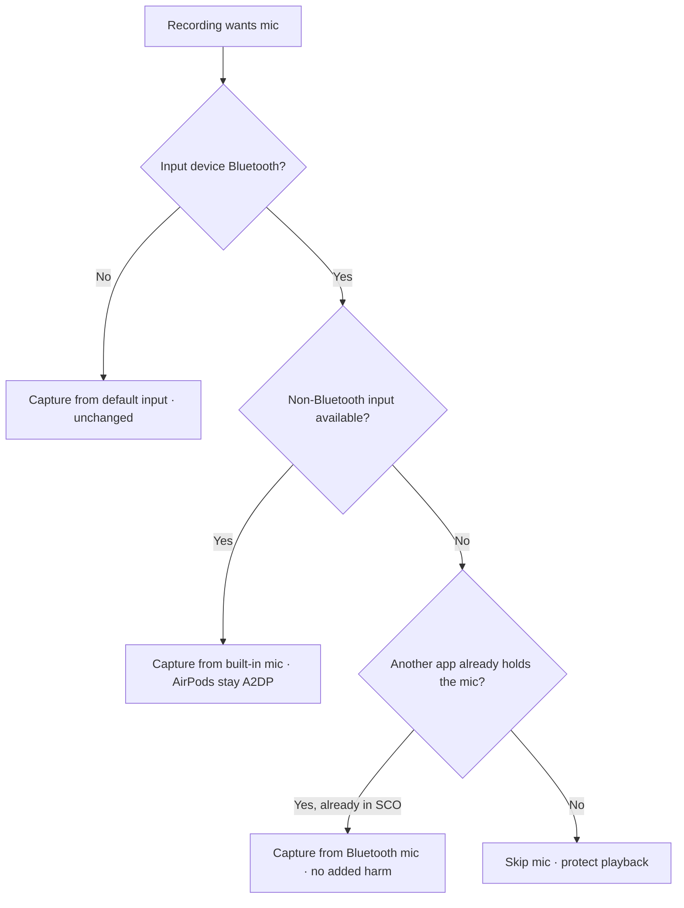
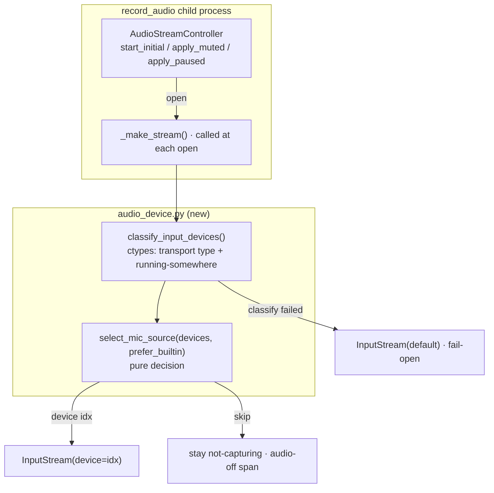

# Bluetooth Mic Redirect - Plan

## Goal Capsule

- Objective: stop screencap from degrading Bluetooth (AirPods) playback quality when it captures the mic, by capturing from the built-in mic instead of the Bluetooth device — keeping mic audio flowing with zero user action.
- Product authority: Rute Figueiredo (SCR-288 owner).
- Execution profile: bounded change to the audio-capture path in the recording engine; one new device-classification module plus wiring into `record_audio` / `AudioStreamController`. No cloud, privacy-pipeline, or schema surface touched.
- Stop conditions: surface a blocker if the real-hardware validation (below) shows an open built-in stream migrates to AirPods on connect — that reopens R7's scope and must be resolved before merge, not guessed.

---

## Product Contract

Product Contract unchanged from the requirements-only version — R1–R13 and AE1–AE6 preserved verbatim. Planning added no product-scope changes; all additions are technical (Planning Contract and below).

### Summary

When the mic input would be a Bluetooth device (AirPods), screencap captures from the built-in Mac mic instead. AirPods stay in high-quality A2DP output, mic audio keeps flowing into the corpus, and the user does nothing. In the rare case where the only input is Bluetooth (desktop or clamshell), screencap captures only if a call already has the AirPods in phone mode, and otherwise skips to protect playback.

### Problem Frame

Screencap is an always-on ambient recorder whose guiding principle is to be invisible and never disrupt the user. Today, when a recording captures audio (on by default), the audio process opens an input stream on the default device and holds it open for the whole recording. When that device is AirPods, macOS renegotiates the Bluetooth link from A2DP (rich stereo output) to HFP/SCO (mono, ~16 kHz, "phone call" quality) — degrading the audio the user *hears*, not just the mic input.

The pain lands hardest in the common non-call case: the user is listening to music or a podcast on AirPods, not in a meeting, and screencap silently drops their playback to telephone quality for the entire session. That is screencap uniquely degrading day-to-day listening, which the ambient-recorder principle forbids. This is a Bluetooth protocol limitation — a headset cannot serve rich A2DP output and mic input at once — so it cannot be converted around at the device; it must be routed around. (Distinct from the glitch fixed in PR #428, which addressed a shared-buffer stutter, not the SCO downgrade.)

### Key Decisions

- Route around the physics, don't fight it. AirPods cannot do A2DP output and mic input simultaneously, so screencap stops using the AirPods mic entirely and captures from a different input (the built-in mic). Never opening the Bluetooth mic means SCO is never triggered — output stays pristine.
- Keep capturing, no user action. The redirect is the silent default; the corpus stays complete via the built-in mic rather than going empty.
- Accept the fidelity trade. Built-in mic audio is room-ish and lower-fidelity than a close AirPods mic — worse for transcription, but still usable, and the same class of ambient audio the recorder already handles.
- Fallback only where redirect can't go. When there is no non-Bluetooth input, capture only when the mic is already held by another app (a call already forced SCO); otherwise skip to protect playback.
- Evaluate per stream-open, not once. The mic-source choice is re-made every time the input stream opens (recording start and each unmute), so state changes mid-session still land on the right source.

### Requirements

**Mic source selection**

- R1. When the resolved input device for a recording is a Bluetooth device and a non-Bluetooth input (e.g., the built-in mic) is available, screencap captures from that non-Bluetooth input instead of the Bluetooth device.
- R2. When the input device is not Bluetooth, behavior is unchanged — screencap captures from the default input as it does today.
- R3. Selecting the built-in mic must not disturb Bluetooth output routing: AirPods remain in A2DP, and screencap never opens the Bluetooth device's mic on the main path.

**Fallback when only a Bluetooth input exists**

- R4. When the only available input is a Bluetooth device and another process already holds the microphone (the device is already in call/SCO mode), screencap captures from the Bluetooth mic, since doing so adds no further degradation.
- R5. When the only available input is a Bluetooth device and no other process is using the mic, screencap does not capture mic audio for that span, leaving the recording without mic audio to protect playback.
- R6. The "another process holds the mic" determination is read before screencap opens its own input stream, so screencap's own stream never self-triggers the in-use signal.

**Capture lifecycle**

- R7. The mic-source decision is evaluated at every point the input stream is opened — recording start and each unmute/resume — not only at recording start.
- R8. Sample-rate resolution and the native-rate-capture-then-resample path (per PR #428) apply to the actually-selected input device, not the OS default.
- R9. A skipped span (R5) is represented the same way as an audio-off span — no mic audio on disk and `has_audio` semantics stay correct — reusing the existing muted-state representation rather than a new state.

**Configuration and surfacing**

- R10. The redirect is the default and requires no user action: no prompt, dialog, or interruption when it engages.
- R11. A setting lets a user who deliberately wants the Bluetooth mic disable the redirect; the default is redirect-on.
- R12. The behavior is documented so users understand that, on Bluetooth, mic audio comes from the built-in mic and may be skipped in the desktop/clamshell non-call case.
- R13. The selected mic source and the reason (redirect / fallback-capture / fallback-skip) are logged for diagnosability, without any user-facing UI.

### Acceptance Examples

- AE1. Non-call listening, laptop open. Given AirPods connected and playing music, not in a call, built-in mic available, when a recording captures audio, then screencap captures from the built-in mic, AirPods stay in A2DP, playback quality is unchanged, and mic audio is present in the corpus. Covers R1, R3, R10.
- AE2. On a call on AirPods. Given a Zoom/Meet/Teams call holding the AirPods mic (already SCO) with the built-in mic available, when a recording captures audio, then screencap still captures from the built-in mic (uniform main-path behavior) and the user's voice is captured. Covers R1, R7.
- AE3. Desktop, Bluetooth-only, not in a call. Given a Mac with no built-in mic, only AirPods as input, user listening but not in a call, when a recording captures audio, then screencap skips mic capture for that span and playback stays A2DP. Covers R5, R6.
- AE4. Desktop, Bluetooth-only, in a call. Given a Mac with no built-in mic, only AirPods as input, and another app already holding the mic (SCO active), when a recording captures audio, then screencap captures from the Bluetooth mic with no added degradation. Covers R4, R6.
- AE5. No Bluetooth device. Given no AirPods connected and the built-in mic as default, when a recording captures audio, then behavior is unchanged. Covers R2.
- AE6. AirPods connect mid-recording, then unmute. Given a recording that started with no AirPods (capturing built-in) that is then joined by AirPods and later unmuted, when the unmute reopens the stream, then the source is re-evaluated and stays on the built-in mic — the AirPods mic is never opened. Covers R3, R7.

### Success Criteria

- During non-call listening on AirPods, screencap never forces SCO — playback stays A2DP. (SCR-288 core acceptance.)
- Mic audio keeps being captured in the common laptop case with no user action and no configuration.
- No user-facing prompt or setting is required for the default protection to apply.

### Scope Boundaries

- Capturing high-quality audio from the AirPods mic while the user listens — physically impossible on Bluetooth; explicitly not attempted.
- Continuous/active audio-device-change monitoring, or migrating an already-open stream between devices — out of scope; per-stream-open evaluation (R7) suffices.
- Capturing system output audio (e.g., the far-end voice in a call) — a separate, pre-existing limitation, not part of this ticket.
- Preferring arbitrary newly-connected non-Bluetooth inputs (e.g., a USB mic) mid-session — screencap only redirects *away from* Bluetooth, it does not chase every device change.
- Improving built-in-mic transcription quality or noise handling — the fidelity trade is accepted as-is.
- Detecting whether an available built-in mic is OS-muted or physically covered — any non-Bluetooth input with input channels is treated as usable (see KTD-5).

### Dependencies / Assumptions

- A device's transport type (Bluetooth vs built-in) is readable via CoreAudio, and a specific non-default input can be selected explicitly for capture. Validated in Verification Contract on real hardware.
- "Another process already holds the mic" is readable via a CoreAudio "running somewhere" signal, evaluated before screencap opens its own stream.
- An input stream explicitly bound to the built-in device is not force-migrated to AirPods when they connect mid-recording. Load-bearing for R7; if false, a device-change guard is needed (see Outstanding Questions and the Verification Contract's migration probe).
- Built-in mic audio is acceptable-quality for the corpus and transcription in the target laptop-operator setup.

### Outstanding Questions

Resolve during implementation (via the Verification Contract hardware checklist):

- Whether an already-open built-in stream can migrate to AirPods on connect. If yes, R7 expands to include a device-change guard; if no, per-open evaluation is sufficient as written. Answered by the migration probe before merge.

---

## Planning Contract

### Key Technical Decisions

- KTD-1. Classify devices via CoreAudio, not names. Read `kAudioDevicePropertyTransportType` to distinguish Bluetooth from built-in/other, and `kAudioDevicePropertyDeviceIsRunningSomewhere` for in-use-elsewhere. This is a new ctypes layer — no CoreAudio code exists in the repo today, and `sounddevice.query_devices()` exposes neither transport type nor in-use state. Rationale: transport type is the canonical, locale-proof signal; matching device-name substrings ("AirPods", "MacBook Pro Microphone") is fragile and localized. Name-substring matching is a documented last-resort fallback only.
- KTD-2. Fail open to today's behavior. Any inability to classify (a CoreAudio read raises, or the result is ambiguous) resolves to the OS default input — exactly what screencap does now. The redirect is a best-effort improvement; it must never skip on uncertainty or break capture.
- KTD-3. Bind explicitly to a concrete non-Bluetooth device index, evaluated at each stream open. Selection runs inside the `_make_stream` path so it re-evaluates on start and every unmute (R7) without a device-change monitor. Binding to a concrete index (never "default") means a reopen after AirPods connect cannot drift onto the AirPods mic.
- KTD-4. Represent policy-skip with the existing not-capturing state, not a new one. When selection returns "skip" (R5), the controller stays not-capturing exactly as an audio-off/muted recording does, so `has_audio` and muted-interval semantics are unchanged (R9). No new on-disk state or enum. A skip open returns no confirmed transition (`None`) from every acquisition site — `start_initial`, `apply_muted` (unmute), and `apply_paused` (resume) — so no `audio_unmuted`/`audio_resumed` event is emitted and any open muted interval stays open. This is the easiest part to get wrong: a naive mirror of the unmute branch would `.start()` a null stream and emit a spurious transition.
- KTD-5. Resolve capture rate for the *selected* device at the first actual stream open, not unconditionally at process start; keep the resampler fixed thereafter. `resolve_capture_rate` gains a device argument so the native-rate-capture path (PR #428) tracks the chosen device. This matters for a muted-start (`--no-audio`) recording later unmuted: the rate must be resolved for the built-in mic actually opened on unmute, not for the default device (possibly the AirPods) sampled at process start — otherwise the built-in opens at a non-native rate and reintroduces the exact PR #428 buffer collapse that R8 exists to prevent. A mid-recording native-rate change (switching to a *different* non-Bluetooth device mid-session) remains a deferred edge. A built-in mic with no input channels or an unreadable device is treated as absent (falls to the R4/R5 fallback).
- KTD-6. Config toggle `prefer_builtin_mic_over_bluetooth` (default `True`) via the existing outer-config `get_*`/`set_*` pattern plus the engine `_FIELD_TO_CONFIG_ATTR` defaults table, resolved in the parent and passed to the audio child at spawn (mirrors `initially_muted`) for testability.

### High-Level Technical Design

The selection helper is the new seam between the capture policy and the stream. Classification (hardware, ctypes) is separated from the selection decision (pure, CI-testable) so the policy can be unit-tested with fabricated device lists while the CoreAudio reads stay mockable.

### Assumptions and Sequencing

- U1 (classification) and U2 (selection policy) land first as a self-contained, tested module before any wiring, so the risky ctypes surface is isolated and the pure policy is proven independently.
- U5 (wiring) is the integration point and depends on U1–U4; it must preserve all existing mute/pause behavior for the non-Bluetooth path (R2 regression guard).
- The audio-test gotcha applies throughout: any test exercising `record_audio` or the controller must stub `resolve_capture_rate`, `select_mic_source`, and `sounddevice` so it never touches the real machine's mic (see `tests/engine/test_audio_streaming.py`'s autouse-fixture pattern).

---

## Implementation Units

### U1. CoreAudio input-device classification

- Goal: enumerate input-capable audio devices and classify each by transport type (Bluetooth vs built-in vs other) and whether it is already running in another process.
- Requirements: R1, R4, R6 (supplies the signals they depend on).
- Dependencies: none.
- Files: `src/screencap/engine/audio_device.py` (new); `tests/test_audio_device.py` (new).
- Approach: a small ctypes wrapper over CoreAudio (`AudioObjectGetPropertyData`) reading `kAudioDevicePropertyTransportType` (`kAudioDeviceTransportTypeBluetooth` / `...BuiltIn`) and `kAudioDevicePropertyDeviceIsRunningSomewhere`, plus input-channel count to filter to real inputs. Return plain dataclass/dict records `(index, name, transport_class, input_channels, running_elsewhere)`. Every read is wrapped so a failure yields an `unknown` transport class rather than raising (KTD-2). Map the CoreAudio-classified device to the `sounddevice`/PortAudio device index so U5 can pass `device=`. Note the join constraint: `sounddevice.query_devices()` exposes only device `name` (no CoreAudio UID/AudioObjectID), so this bridge is name-keyed even though classification itself stays transport-based; when a classified device cannot be matched to a PortAudio index, fail open to the default device (KTD-2). Spike this join before U5 to confirm whether any stable identifier beyond `name` is reachable through PortAudio's macOS backend — if only `name` is available, accept name-keying for the mapping step (not the classification) and document it.
- Patterns to follow: `resolve_capture_rate` at `src/screencap/engine/recorder.py:2964` for the deferred-`import sounddevice` + fail-safe-query shape.
- Test scenarios (CoreAudio calls stubbed):
  - A device whose stubbed transport type is Bluetooth classifies as `bluetooth`; built-in classifies as `builtin`; an unrecognized transport type classifies as `other`.
  - `running_elsewhere` reflects the stubbed `IsRunningSomewhere` value (True and False cases).
  - A stubbed CoreAudio read that raises yields `transport_class == "unknown"` and does not propagate the exception.
  - Enumeration filters out devices with zero input channels.
  - A classified device whose name matches no PortAudio device yields no index mapping, so the caller falls open to the default device (KTD-2).
  - Test expectation: real transport-type and in-use values are validated manually on hardware (Verification Contract), not in CI.

### U2. Mic-source selection policy

- Goal: a pure function that decides, from a classified device list plus the config toggle, whether to capture from a specific device or skip.
- Requirements: R1, R2, R4, R5.
- Dependencies: U1 (consumes its classification records). The `prefer_builtin` toggle is supplied by the caller (U5) as an argument — U2 reads no config itself, so it can be built and tested before U3.
- Files: `src/screencap/engine/audio_device.py`; `tests/test_audio_device.py`.
- Approach: `select_mic_source(devices, default_index, prefer_builtin) -> Selection` returning either `("device", index)` or `("skip", reason)`. Logic mirrors the Key Decisions flowchart: non-Bluetooth default → use default; Bluetooth default with a non-Bluetooth input available → that input; Bluetooth-only + running-elsewhere → the Bluetooth device; Bluetooth-only + not running → skip. `prefer_builtin=False` or an `unknown`-classified default → use default (fail-open).
- Patterns to follow: keep it side-effect-free (no ctypes, no I/O) so it is fully CI-testable.
- Test scenarios (fabricated device lists):
  - Non-Bluetooth default → selects the default device. Covers R2, AE5.
  - Bluetooth default + built-in available → selects the built-in. Covers R1, AE1.
  - Bluetooth default + built-in available + Bluetooth running-elsewhere → still selects the built-in (built-in wins regardless of in-use). Covers AE2.
  - Bluetooth-only + running-elsewhere → selects the Bluetooth device. Covers R4, AE4.
  - Bluetooth-only + not running → returns `skip`. Covers R5, AE3.
  - `prefer_builtin=False` with a Bluetooth default → selects the Bluetooth device (redirect disabled).
  - Default classified `unknown` → selects the default device (fail-open). Covers KTD-2.

### U3. Config toggle `prefer_builtin_mic_over_bluetooth`

- Goal: add the escape-hatch setting, defaulting to redirect-on, wired through both config layers.
- Requirements: R11.
- Dependencies: none.
- Files: `src/screencap/config.py` (add `get_prefer_builtin_mic_over_bluetooth` / `set_...`); `src/screencap/engine/config.py` (add the `PREFER_BUILTIN_MIC_OVER_BLUETOOTH` Settings attr + `_FIELD_TO_CONFIG_ATTR` entry, and a `prefer_builtin_mic_over_bluetooth` field on `RecordingConfig`); the CLI/`screen_recorder` path that builds `RecordingConfig`; `tests/test_config.py`.
- Approach: mirror the FULL `capture_audio` chain, not just the Settings half. The engine `Settings` layer does not read the outer `config.toml` or the `SCREENCAP_*` env name, so a `get_/set_` + `_FIELD_TO_CONFIG_ATTR` entry alone leaves the engine default (`True`) always winning and the escape hatch silently no-ops (R11 would not work). Add: `get_prefer_builtin_mic_over_bluetooth` mirroring `get_audio_default` at `src/screencap/config.py:241` — env (`SCREENCAP_PREFER_BUILTIN_MIC_OVER_BLUETOOTH`) > toml key > default `True`, with a cache-invalidating `set_`; a `prefer_builtin_mic_over_bluetooth` field on `RecordingConfig`; the `_FIELD_TO_CONFIG_ATTR` entry (`src/screencap/engine/config.py:148`); and a read-through in the CLI/`screen_recorder` path that sets the `RecordingConfig` field from `get_prefer_builtin_mic_over_bluetooth()` — mirroring exactly how `capture_audio` flows from `get_audio_default()` to `config.RECORD_AUDIO` at spawn.
- Patterns to follow: the complete `capture_audio` chain (`get_audio_default` → `RecordingConfig.capture_audio` → `_FIELD_TO_CONFIG_ATTR` → `Settings.RECORD_AUDIO` → read at spawn), not just `_FIELD_TO_CONFIG_ATTR`.
- Test scenarios:
  - Default is `True` when unset.
  - Env var truthy/falsey override parses correctly.
  - Toml key is honored when no env var is set.
  - `set_` persists the value and a subsequent read reflects it.
  - A toml/env value of `False` reaches the engine `Settings` attribute through the read-through (not just the outer getter) — the regression guard for R11 actually working.
  - Test expectation: config parsing/precedence and read-through only.

### U4. Capture-rate resolution for the selected device

- Goal: resolve the native capture rate for the actually-selected input device, preserving the PR #428 resample path.
- Requirements: R8.
- Dependencies: U1 (device identity).
- Files: `src/screencap/engine/recorder.py` (`resolve_capture_rate`); `tests/test_audio_capture_rate.py`.
- Approach: add an optional `device` argument to `resolve_capture_rate`; when provided, query that device's `default_samplerate` instead of `kind="input"`. Keep the no-argument call path unchanged for backward compatibility and the existing fail-safe fallback to `target_rate`.
- Patterns to follow: existing `resolve_capture_rate` body at `src/screencap/engine/recorder.py:2964`.
- Test scenarios:
  - `resolve_capture_rate(device=idx)` returns that device's stubbed native rate.
  - `resolve_capture_rate()` (no device) is unchanged — queries the default input.
  - A query failure falls back to `target_rate` (existing behavior preserved).
  - Covers R8.

### U5. Wire selection and skip into the capture path

- Goal: use the selected device when opening the input stream, honor "skip" as a not-capturing span, and re-evaluate at every open.
- Requirements: R1, R2, R3, R5, R6, R7, R9.
- Dependencies: U1, U2, U3, U4.
- Files: `src/screencap/engine/recorder.py` (`record_audio`, `_make_stream`); `src/screencap/engine/audio_mute.py` (`AudioStreamController`); `tests/test_record_audio_mute.py`, `tests/test_audio_mute_controller.py`.
- Approach: at each `_make_stream` invocation, call `select_mic_source` (over freshly classified devices) and open `sounddevice.InputStream(device=idx)` for a device selection, or signal skip. Extend `AudioStreamController` so an open that resolves to "skip" leaves it not-capturing (no stream constructed) and returns no confirmed transition from every acquisition site (`start_initial`, `apply_muted`, `apply_paused`), behaving like the muted path for `has_audio`/muted-interval purposes (KTD-4). Resolve the capture rate (U4) for the device selected at the first actual open, not at process start (KTD-5), so a muted-start recording resolves for the built-in mic it actually opens. On any classification/selection failure, open the default device (fail-open, KTD-2). Pass `prefer_builtin_mic_over_bluetooth` into `record_audio` as a spawn kwarg from `src/screencap/engine/recorder.py:4428`.
- Execution note: preserve every existing mute/pause transition for the non-Bluetooth path — start from the current `test_audio_mute_controller.py` / `test_record_audio_mute.py` behavior as the regression baseline. Stub `select_mic_source`, `resolve_capture_rate`, and `sounddevice` in these tests (audio-test gotcha).
- Patterns to follow: the existing `_make_stream` closure and `AudioStreamController.start_initial` / `apply_muted` lazy-acquisition flow.
- Test scenarios:
  - Selection returns a device index → `InputStream` is constructed with `device=` that index. Covers R1, R3.
  - Selection returns "skip" on an unmute open → no `InputStream` is constructed, controller stays not-capturing, no `audio_unmuted` is emitted, and the span is treated as audio-off (`has_audio` false / muted-equivalent). Covers R5, R9.
  - Selection returns "skip" on a resume open (pause → resume, `apply_paused`) → no stream, no `audio_resumed` emitted, muted interval stays open — the resume acquisition site, not just unmute. Covers R7, R9.
  - Selection is invoked on start and again on a subsequent unmute (assert re-evaluation), and a mid-recording unmute after AirPods connect still opens the built-in device, never the Bluetooth one. Covers R7, AE6.
  - Classification/selection raises → falls back to opening the default device. Covers KTD-2.
  - Non-Bluetooth default → existing mute/unmute/pause behavior is unchanged (regression). Covers R2.

### U6. Logging and user-facing documentation

- Goal: make the behavior diagnosable in logs and discoverable in docs, without any UI interruption.
- Requirements: R10, R12, R13.
- Dependencies: U5.
- Files: `src/screencap/engine/recorder.py` (log line at each open); a user-facing doc under `docs/` (e.g., an audio/mic section) and a short note in `README` if audio behavior is documented there.
- Approach: log the chosen source and reason at info level per open; no prompt or dialog (R10). The reason vocabulary extends R13's three redirect-specific reasons (`redirect` / `fallback-capture` / `fallback-skip`) with `default` for the unchanged non-Bluetooth and fail-open opens, so every open path is diagnosable. Document that, on Bluetooth output, mic audio is captured from the built-in mic; that on a Bluetooth-only Mac outside a call mic audio is skipped; and how to disable the redirect via `prefer_builtin_mic_over_bluetooth`.
- Patterns to follow: existing `logger.info` usage in `record_audio` (e.g., the capture-rate log at `src/screencap/engine/recorder.py:3075`).
- Test scenarios:
  - Test expectation: none of substance — logging/docs. Optionally assert the log line is emitted with the expected reason for a redirect vs. skip case in the U5 tests.

---

## Verification Contract

CI note: the repo's CI runs only the privacy lane (`pytest -m privacy`); these units are not privacy-bearing, so the implementer runs their tests locally in the full suite. In a worktree, run with `PYTHONPATH=src`.

| Check | Scope | Signal |
|---|---|---|
| `pytest tests/test_audio_device.py` | U1, U2 | classification (mocked) + selection policy pass |
| `pytest tests/test_audio_capture_rate.py` | U4 | device-scoped rate resolution passes; no-arg path unchanged |
| `pytest tests/test_record_audio_mute.py tests/test_audio_mute_controller.py` | U5 | device-select + skip + per-open re-eval pass; non-BT mute/pause regressions green |
| `pytest tests/test_config.py` | U3 | toggle default/env/toml/set precedence |

Manual real-hardware validation (required before merge — audio device behavior is not CI-testable):

1. AirPods connected, playing music, laptop open, not in a call → start an audio recording → music stays high-quality (no telephone drop) and an `audio_*.flac` is produced. (AE1)
2. In a Zoom/Meet call on AirPods → start a recording → capture works; playback already SCO from the call, unchanged by screencap. (AE2)
3. Connect AirPods mid-recording, then unmute → playback stays A2DP, capture continues from the built-in mic. (AE6)
4. Desktop/clamshell (Bluetooth-only), not in a call → mic capture is skipped, playback protected; then join a call → capture resumes from the Bluetooth mic. (AE3, AE4)
5. Set `prefer_builtin_mic_over_bluetooth` off → recording captures from the Bluetooth mic and playback degrades (escape hatch verified). (R11)
6. Migration probe (resolves the Outstanding Question): start a recording with no AirPods, connect AirPods, confirm the open input stream does NOT migrate to AirPods (playback stays A2DP). If it migrates, add a device-change guard before merge (reopens R7).

The `capture-test` skill can drive the recording-pipeline sanity portion of steps 1–3.

---

## Definition of Done

- R1–R13 satisfied; AE1–AE6 hold (unit-level where CI-testable, manual where hardware-bound).
- U1–U6 implemented; the pure selection policy, mocked classification, device-scoped rate resolution, and config toggle are unit-tested and green locally.
- The manual hardware checklist is executed on real AirPods, including the migration probe that resolves the R7 Outstanding Question.
- Fail-open verified: a classification failure falls back to today's default-device behavior.
- Non-Bluetooth path shows no regression in existing mute/pause tests.
- Logging emits the mic-source reason; user-facing docs describe the behavior and the toggle.
- Product Contract unchanged (R1–R13, AE1–AE6 preserved).

---

## Sources & Research

- Audio capture entry point and stream lifecycle: `record_audio` at `src/screencap/engine/recorder.py:3014`; `AudioStreamController` at `src/screencap/engine/audio_mute.py:49` (owns lazy mic acquisition + mute/pause; the stream is held open for the whole recording when audio is on).
- Audio child spawn + config flow: `src/screencap/engine/recorder.py:4418` (`initially_muted = not config.RECORD_AUDIO` kwarg — the pattern the new toggle mirrors).
- Audio-on-by-default: `get_audio_default()` at `src/screencap/config.py:241` returns `True`.
- Native-rate capture + resample (PR #428): `resolve_capture_rate` at `src/screencap/engine/recorder.py:2964`; `resample_capture_block` at `src/screencap/engine/recorder.py:2983`.
- Engine config defaults table: `_FIELD_TO_CONFIG_ATTR` at `src/screencap/engine/config.py:148`.
- Mute/pause state already surfaces to the app via `EVENT_AUDIO_MUTED` / `EVENT_RECORDING_PAUSED` in `src/screencap/_stderr_events.py`.
- No existing CoreAudio ctypes code in the repo — device classification is a new surface (KTD-1).
- Linear SCR-288; PR #428 (buffer-collapse glitch fix, the sibling audio issue).
