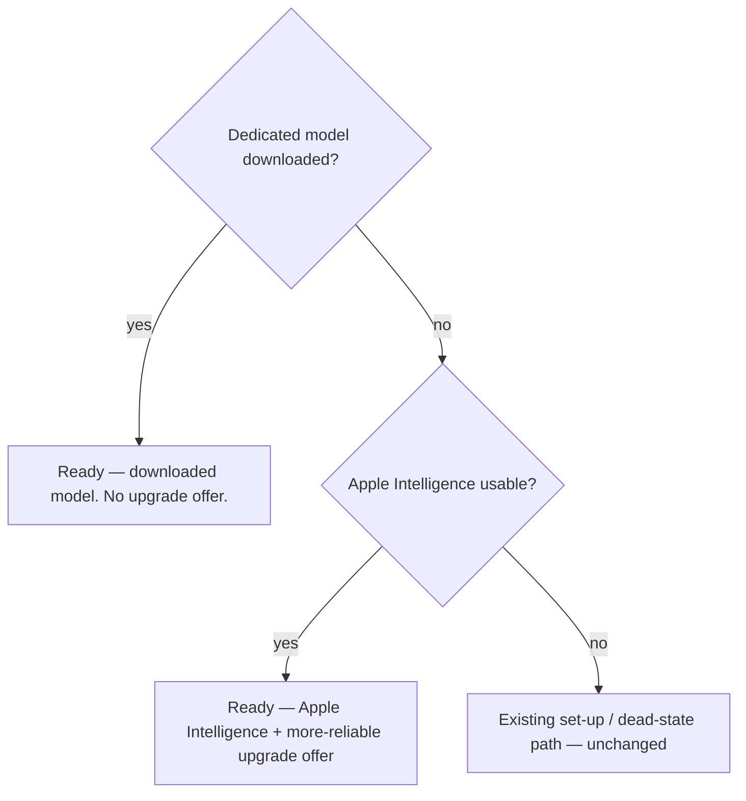

# Intelligence Model Upgrade Framing - Plan

## Goal Capsule

- **Objective:** Stop the Settings → Intelligence card reading as a contradiction ("Ready (Apple Intelligence)" alongside an unexplained "Download") by reframing the dedicated-model download as a *more-reliable-results upgrade*, and surface that same upgrade in the first-recording beat so Apple-Intelligence users discover the better model at the recording moment (acting on it opens Settings → Intelligence under the current KTD3 default — see Outstanding Questions).
- **Product authority:** rfigueiredo.dev@gmail.com (product owner). Product Contract validated in `ce-brainstorm`.
- **Execution profile:** macOS SwiftUI app only — three small units (card render, beat, honesty gate). No Python/daemon changes; the on-device verdict, beat-mode gating, and the downloaded model's identity (Qwen2.5-3B-Instruct 4-bit) are untouched. The state logic lands in pure, unit-tested seams (the on-device render matrix and a new beat predicate); the SwiftUI views are dumb bindings over those seams.
- **Environment constraints for the implementer:** (a) This repo lives under `~/Documents`, where running `xcodebuild` TCC-bricks the session — Swift units are **compile-only on a `/private/tmp` copy** (signing off, never launched/run) and are runtime-verified on a machine outside `~/Documents`. (b) This checkout may be concurrently owned by another branch, so implement in an **isolated git worktree**, never in the shared checkout. Linear-suggested branch: `rutefig/scr-274-decide-how-the-intelligence-settings-present-the-optional`.
- **Stop conditions:** Surface a genuine blocker (a change that contradicts the Product Contract, or that would require reworking the `usable` verdict / touching the daemon) rather than guessing. Do not downgrade Apple Intelligence to "not ready" (R8) and do not introduce a quality claim the honest-copy audit forbids (R7).
- **Product Contract preservation:** changed — the Outstanding Question on the beat's action (in-place download vs. deep-link) is resolved by planning to **deep-link** (KTD3). R1–R8 are unchanged.

---

## Product Contract

### Summary

Reframe the on-device Intelligence card so Apple Intelligence stays marked ready while the dedicated-model download reads as a distinct, clearly-related upgrade ("more reliable task names & summaries, still on-device") instead of a contradictory second affordance. Add one secondary, dismissible upgrade line to the first-recording beat for users whose Apple Intelligence is already usable. Keep the framing honest — an optional upgrade, not a requirement, not a benchmarked quality claim, and not a downgrade of Apple Intelligence.

### Problem Frame

Since PR #409, the app treats Apple Intelligence availability as a usable on-device model, so the dedicated ~2 GB download is deliberately not required. The composed verdict, the first-recording beat, and the dead-state banner all honor this — when intelligence is usable, they stop pushing the download.

The Settings card never got that memo. Its on-device row still renders the raw status and shows the download whenever the dedicated model is not installed, demoted to a secondary link but never hidden. So a user with Apple Intelligence sees "● Ready (Apple Intelligence)" *and* a "Download (~2 GB)" link with no stated relationship, and reads it as: *"it's ready — so why do I still need to download something?"* The card is the one surface still out of step with the shipped posture.

Underneath the presentation bug sits a substantive fact the app currently ignores: the two "ready" states are not equivalent. A direct on-device comparison found the dedicated model (Qwen2.5-3B-Instruct) produces more reliable results for Screencap's prompts than Apple Intelligence — which today is additionally hampered by SCR-275. The card presents them as interchangeable and gives a user no reason to prefer the better one.

### Key Decisions

- **Frame the download as an upgrade, not suppress it.** The product owner's direct comparison shows the dedicated model produces more reliable task names and summaries than Apple Intelligence for our prompts, so hiding the offer whenever Apple Intelligence is usable would remove the better path. The download coexists with a ready Apple Intelligence as a "more reliable results" upgrade with a stated reason.
- **Honest, not hard-sell.** The framing is experiential ("more reliable"), not a benchmarked or definitive quality claim, because the evidence is a single direct comparison and part of the current gap is SCR-275. Apple Intelligence stays a supported, non-degraded choice a user can keep.
- **Fix the card and the beat, not the verdict.** The beat is the main discovery path most users hit; leaving it on its silent light-confirm would under-serve everyone who never opens Settings. Reworking the deeper "usable vs best" verdict across all surfaces is out of scope.
- **Layer on the raw status; do not migrate the card to the composed verdict.** The card still renders the raw "Ready (Apple Intelligence)" status rather than the honest composed verdict that already drives the beat and banner — an un-landed piece of the 2026-07-16 honest-status work. This effort layers upgrade framing on top of the existing status; completing that verdict wiring is a follow-up, consistent with leaving the verdict model alone.

### Requirements

**Settings card**

- R1. When Apple Intelligence is usable and the dedicated model is not downloaded, the card presents Apple Intelligence as ready *and* the download as a distinct, clearly-related upgrade — never as an unexplained second affordance. The two must not read as contradictory.
- R2. The upgrade affordance states a concrete reason to download (more reliable task names and summaries) and reassures that it stays fully on-device.
- R3. The download is framed as an optional upgrade — not a requirement and not a hard recommendation. A user who stays on Apple Intelligence reads as a supported, non-degraded choice.
- R4. When the dedicated model is already downloaded, the card shows the downloaded-model ready state and presents no upgrade offer. When no model is usable, the existing set-up path is unchanged and no upgrade framing appears.

**First-recording beat**

- R5. For a user whose Apple Intelligence is usable (the beat's light-confirm path), the beat surfaces the same upgrade in one secondary, dismissible line, so the dedicated model is discoverable without opening Settings.
- R6. The beat's upgrade line never blocks or delays recording and never overrides the "you're ready" reassurance. It respects the beat's existing once-per-user behavior and does not appear when the dedicated model is already downloaded.

**Honesty guardrails**

- R7. No surface claims the download is definitively higher quality, faster, or benchmarked. The framing is experiential and honest at the current evidence level (a single direct comparison).
- R8. The card and beat continue to agree with the shipped verdict that Apple Intelligence is usable. The upgrade framing sits on top of "usable"; it does not downgrade Apple Intelligence to "not ready."

The card's presentation state resolves as:



### Key Flows

- F1. Card upgrade presentation
  - **Trigger:** User opens Settings → Intelligence with Apple Intelligence usable and the dedicated model not downloaded.
  - **Steps:** Card shows Apple Intelligence ready; below it, an upgrade affordance names the reason (more reliable results) and the on-device reassurance, with a download action.
  - **Outcome:** The user understands both states and why they coexist; no contradiction; the download is an informed, optional choice.
  - **Covered by:** R1, R2, R3, R8
- F2. Beat upgrade mention
  - **Trigger:** A user starts their first recording, Apple Intelligence is usable, and the dedicated model is not downloaded.
  - **Steps:** The beat shows its light "Intelligence is ready" confirm plus one secondary, dismissible line offering the more-reliable upgrade; recording proceeds regardless.
  - **Outcome:** The user learns the better model exists and can act on it, without the record action ever being blocked, and is not asked again.
  - **Covered by:** R5, R6, R8

### Acceptance Examples

- AE1. **Covers R1, R2, R3, R8.** Apple Intelligence available, dedicated model not downloaded → card shows "ready" plus an upgrade block naming the more-reliable reason and the on-device reassurance; the two lines relate clearly; Apple Intelligence is not disparaged and its status stays "Ready" (R8).
- AE2. **Covers R4.** Dedicated model downloaded → card shows the downloaded-model ready state and no upgrade offer.
- AE3. **Covers R4.** Apple Intelligence not available and nothing downloaded → the existing set-up / dead-state path renders unchanged, with no upgrade framing.
- AE4. **Covers R5, R6, R8.** First recording, Apple Intelligence usable, model not downloaded → beat shows the light confirm ("Intelligence is ready", R8) plus one dismissible upgrade line; recording proceeds; the beat does not fire again.
- AE5. **Covers R6.** First recording, dedicated model already downloaded → beat shows the plain light confirm with no upgrade line.
- AE6. **Covers R7.** Copy audit → no surface asserts the download is "better quality," "faster," or "benchmarked"; the upgrade reason reads as experiential reliability only.

### Scope Boundaries

**Deferred for later**

- Migrating the card's status from the raw probe to the honest composed verdict (finishing the un-landed 2026-07-16 wiring). This effort layers framing on top; the wiring is a follow-up.
- Reworking the "usable vs best" verdict so every surface (including the banner) distinguishes usable-but-not-optimal.
- Benchmarking the dedicated model against Apple Intelligence for our prompts (the ticket's option 3). The framing acts on the direct comparison instead.

**Outside this effort**

- Fixing SCR-275 (Apple Intelligence guided generation blowing the 4096-token window → mechanical names). Separate track; this effort must stay honest regardless of its outcome.
- Suppressing the download entirely while Apple Intelligence is available (the ticket's option 1). Rejected — the download is the more-reliable path.
- Changing what the models produce, or the dedicated model's identity, size, or download mechanics.

### Dependencies / Assumptions

- The "more reliable" framing rests on the product owner's single direct on-device comparison (the dedicated Qwen2.5-3B-Instruct 4-bit model vs Apple's system model), not a formal benchmark.
- Part of today's reliability gap is SCR-275. The framing is honest now, and carries an explicit revisit trigger: **when SCR-275 is resolved, re-run the on-device comparison (dedicated model vs Apple Intelligence) and re-audit the "more reliable" copy** (owner: the product owner). Otherwise "more reliable" silently becomes an overclaim. The chosen experiential wording (R7) is deliberately robust to that outcome.
- The shipped honest-status work (2026-07-16) already suppresses the download on the beat and banner when the verdict is usable; only the Settings card remains out of step, so this effort is scoped to the card plus the beat's upgrade line.

### Outstanding Questions

**Planning decision — open for product-owner confirmation**

- The beat's upgrade line currently uses a **deep-link** to Settings → Intelligence rather than an in-place download (KTD3), to keep the light-confirm light. Document review flagged that this diverges from the sibling honest-status plan's R5 "act in place, deep-link secondary" pattern: discovery happens in the beat, but *acting* still routes to Settings. Product-owner call: keep the deep-link, or switch the beat to an in-place download. Not an error either way — a friction-vs-simplicity tradeoff worth confirming.

**Deferred to design polish**

- Final upgrade-copy wording and exact card layout of the reason line vs. the download button. The units below carry concrete, honest starting copy; refining the exact words is a design detail that does not change the plan's structure or tests (the honest-copy audit gates any wording chosen).

### Sources / Research

- `macos/Screencap/Views/Settings/IntelligenceSelectionModel.swift` — the on-device row matrix (`statusFor` / `onDeviceRowRender`, and the `OnDeviceRowRender` struct at the top of the file): the download affordance is *demoted* (not hidden) when Apple Intelligence is available, and hides only when the dedicated model is installed. `allAuditedCopy` enumerates every audited copy static. This is the source of the contradiction and the home of the fix.
- `macos/Screencap/Views/Settings/IntelligenceSettingsView.swift` — `onDeviceAccessory` / `onDeviceStatusLine` / `downloadAffordance` (~lines 494-631): renders the status line then the demoted download button with no explanatory text.
- `macos/Screencap/Models/IntelligenceVerdict.swift` — `compose` treats `probe == .available` as usable; the download is not required for usability. Left unchanged.
- `macos/Screencap/Models/IntelligenceSurfacePolicy.swift` — the beat and banner already suppress the download when the verdict is usable (`beatMode` light-confirm; banner gated on not-usable). The new beat predicate joins these pure gates.
- `macos/Screencap/Views/Record/FirstRecordingBeatSheet.swift` — the `.lightConfirm` branch ("Intelligence is ready" + "Got it") where R5's upgrade line attaches; already carries `onOpenIntelligence` (deep-link) and a `ModelDownloadController`.
- `macos/ScreencapTests/IntelligenceSettingsTests.swift` — `testHonestCopyAuditNoForbiddenStrings` (~line 460): the honest-copy sweep to extend for R7.
- `src/screencap/models/registry.py` — `DEFAULT_MODEL_ID = "qwen2.5-3b-instruct"`, "Qwen2.5 3B Instruct (4-bit)", ~1.74 GB actual weight (the Download button shows the existing rounded "~2 GB" fallback label when `disclosedSizeBytes` is unavailable; user-facing size copy is unchanged by this plan). The dedicated model's identity (unchanged, referenced for copy grounding).
- `docs/plans/2026-07-16-001-feat-intelligence-setup-honest-status-plan.md` — the shipped honest-status verdict/beat/banner work this builds on; its card-not-wired-to-verdict gap is the un-landed piece referenced in Key Decisions.
- SCR-275 (Linear) — Apple Intelligence guided generation reliably fails on the 4096-token window, degrading to mechanical names; the reliability gap that motivates preferring the dedicated model today.

---

## Planning Contract

### Key Technical Decisions

- KTD1. **The card's "show the upgrade offer" decision lives in the pure `onDeviceRowRender` matrix, not the view.** Add an explicit `upgradeOffer: Bool` field to `OnDeviceRowRender`, computed as `status == .readyApple && affordance == .download` (Apple Intelligence ready, model not installed, download idle, daemon reachable). This matches the on-device matrix's existing convention — the *code's* `KTD3`-annotated "the matrix is the spec, encoded row for row" comment in `IntelligenceSelectionModel.swift`, a code annotation from the prior honest-status work, distinct from this plan's own KTD3 — and the no-UI-test posture — the state logic becomes a single unit-tested assertion, and the view stays a dumb binding that renders the reason line when `render.upgradeOffer` is true. Every other cell of the existing matrix keeps its current output; only the new field is added.
- KTD2. **The beat's upgrade line is gated by a new pure `IntelligenceSurfacePolicy` predicate.** Add `shouldOfferOnDeviceUpgrade(probe:downloadedModelInstalled:)` returning `probe == .available && !downloadedModelInstalled`. Evaluated inside the `.lightConfirm` branch, this shows the line only for the Apple-Intelligence-ready, model-not-downloaded state — never to an already-downloaded user (R6, AE5) and never to a cloud-only-usable user (who reaches `.lightConfirm` via cloud consent but has no on-device path to upgrade). It joins the sibling `beatMode` / `shouldShowDeadStateBanner` gates so the fire decision stays unit-testable.
- KTD3. **The beat's upgrade line deep-links to Settings → Intelligence; it does not download in place.** Reuse the existing `onOpenIntelligence` closure. Rationale: keep the one-time light-confirm genuinely light (a reassurance, not a download-progress session), and route the user to the reframed card where the upgrade is fully explained and the download is managed by the pane's durable controller. The `.chooseModel` branch keeps its existing in-place download (that path is for users with no usable model who must act now); the light-confirm's job is different. This is the plan's default resolution of the Product Contract's deferred in-place-vs-deep-link question, but it deliberately diverges from the sibling honest-status plan's R5 ("let the user act on the fix in place … rather than only deep-linking to Settings," with the deep-link secondary) — so it is flagged as an open product-owner call, not a settled fact; see Outstanding Questions.
- KTD4. **R7 is machine-enforced by extending the existing honest-copy audit, and both new copy statics are enrolled in the audit corpus.** The new card and beat upgrade strings become statics on `IntelligenceSelectionModel` and are added to `allAuditedCopy`, so `testHonestCopyAuditNoForbiddenStrings` reaches them. Extend that test's `forbidden` list with quality superlatives — `"faster"`, `"better"`, `"benchmarked"`, `"best quality"`, `"best-in-class"`, `"higher quality"`, `"instant"`. Do **not** add the bare token `"best"`: the audit matches by lowercased substring, and the corpus is saturated with mandatory `"best-effort"` frame-consent copy that is enrolled and asserted-present, so `"best"` would fail the very test on pre-existing copy. "more reliable" is the sanctioned phrasing and must remain absent from the forbidden list. This constrains all audited intelligence copy going forward, which is the intended honesty ratchet.
- KTD5. **No verdict, beat-mode, banner, or daemon change.** `IntelligenceVerdict.compose` and `IntelligenceSurfacePolicy.beatMode` / `shouldShowDeadStateBanner` keep their current logic; the card's status still comes from the raw probe (KTD "layer on top"). The change surface is exactly: one new matrix field, one new pure predicate, two view edits, two copy statics, one audit extension.

### High-Level Technical Design

The card fix is one added column on the existing pure render matrix. `upgradeOffer` is a derived boolean over the same four inputs the matrix already takes, so no new state is introduced — the view reads it and inserts the reason line:

| Probe | Model installed | Download state | Daemon | Status badge | Affordance | `upgradeOffer` | Card treatment |
|---|---|---|---|---|---|---|---|
| `.available` | no | idle | reachable | Ready (Apple Intelligence) | download (demoted) | **true** | reason line + demoted download = the upgrade offer |
| `.available` | no | downloading / failed | reachable | Ready (Apple Intelligence) | progress / retry | false | download UI is primary; no reason line |
| any | yes | — | reachable | Ready (downloaded model) | hidden | false | no offer |
| `.available` | no | idle | unreachable | Ready (Apple Intelligence) | disabled | false | no reason line (can't act) |
| `.appleIntelligenceOff` / `.notEligible` / `.osUnsupported` | no | idle | reachable | needs attention | download | false | existing set-up path, unchanged |
| `.unknown` | no | idle | reachable | Checking… | download | false | no offer |

The single rule `upgradeOffer = (status == .readyApple && affordance == .download)` produces every row above, so the derivation cannot drift from the states it should fire in.

The beat gate is the parallel one-liner over the fresh probe and the install bit, evaluated only inside `.lightConfirm`:

```
shouldOfferOnDeviceUpgrade(probe, downloadedModelInstalled)
  = probe == .available && !downloadedModelInstalled
```

### Assumptions

- The card view already has the fresh probe (`onDeviceStatus`) and the install bit (`settings.downloadedModelInstalled || download.isDefaultModelInstalled`); the beat already has `OnDeviceModelStatus.probe()`, `intelligence.settings`, and `download` — so no new data plumbing is required, only the derived signal and predicate.
- The `.lightConfirm` branch is the only beat state that needs the upgrade line; `.awaitVerdict` and `.chooseModel` are untouched.
- Adding a field to `OnDeviceRowRender` (an `Equatable` struct) touches its initializers and any exhaustive equality/testing sites; the compile-only pass will surface those.

### Sequencing

U1 (card) and U2 (beat) are independent and can land in either order. U3 (honesty audit extension) depends on U1 and U2 because it asserts against the copy statics they add; land it last, or land the statics first and the forbidden-list extension with U3.

---

## Implementation Units

### U1. Card: reframe the on-device row as an upgrade offer

- **Goal:** In the Apple-Intelligence-ready, model-not-downloaded state, present the download as a "more reliable results" upgrade with a stated reason, so "Ready" and "Download" no longer read as contradictory.
- **Requirements:** R1, R2, R3, R4, R8
- **Dependencies:** none
- **Files:**
  - `macos/Screencap/Views/Settings/IntelligenceSelectionModel.swift` — add `upgradeOffer: Bool` to `OnDeviceRowRender`; compute it in `onDeviceRowRender` as `status == .readyApple && affordance == .download`; add `onDeviceUpgradeReasonCopy` static and enroll it in `allAuditedCopy`.
  - `macos/Screencap/Views/Settings/IntelligenceSettingsView.swift` — in `onDeviceAccessory`, when `render.upgradeOffer`, render the reason line between the status line and the download affordance.
  - `macos/ScreencapTests/IntelligenceSelectionModelTests.swift` — extend with the `upgradeOffer` matrix scenarios.
- **Approach:** Keep every existing matrix output unchanged; add only the derived `upgradeOffer` field. The card now reads, in the upgrade state: "● Ready (Apple Intelligence)" / reason line / demoted "Download (~2 GB)". Starting copy (final wording is design polish, gated by the audit): `onDeviceUpgradeReasonCopy = "More reliable task names & summaries — Screencap's own model, still on this Mac."` Do not change the status string (R8: Apple Intelligence stays "Ready"). Do not promote the download button out of its demoted style — the reason line, not visual weight, carries the upgrade meaning (R3). When the row is in the reconcile state (`reconcile == true` in `onDeviceAccessory`), the reconcile prompt replaces the status line and the reason line is suppressed — an upgrade offer only makes sense atop a genuine "Ready (Apple Intelligence)" status. Group the status line, reason line, and Download button for VoiceOver (e.g., expose the reason as the Download button's `accessibilityHint`) so a screen-reader user hears the reason together with the Download action; otherwise R2's "informed choice" is lost for them.
- **Patterns to follow:** the pure `onDeviceRowRender` / `statusFor` matrix and its doc comment ("the matrix in the plan's Planning Contract is the spec, encoded row for row"); `statusLine(text:tone:)` only as the placement anchor — render the reason as a *distinct upgrade callout*, not the status-row dot+muted-text chrome, so it does not read as a third status badge (R1); the copy-static + `allAuditedCopy` enrollment convention (the code's `KTD7`-annotated copy block in `IntelligenceSelectionModel.swift`, formalized as this plan's KTD4).
- **Test scenarios:**
  - Covers AE1. `probe == .available`, `installed == false`, `download == .idle`, `daemonUnreachable == false` → `upgradeOffer == true` (and status `.readyApple`, affordance `.download`).
  - Covers AE2. `installed == true` (any probe) → `upgradeOffer == false`, affordance `.hidden`.
  - Covers AE3. `probe == .appleIntelligenceOff` / `.notEligible` / `.osUnsupported`, not installed, idle → `upgradeOffer == false` (needs-attention path unchanged).
  - Edge: `probe == .available`, not installed, `download == .downloading` → `upgradeOffer == false`; same for `.failed` and daemon-unreachable — the reason line must not appear while the download UI or a disabled state is primary.
  - Edge: `probe == .unknown`, not installed, idle → `upgradeOffer == false` (checking).
  - `onDeviceUpgradeReasonCopy` is present in `IntelligenceSelectionModel.allAuditedCopy`.
- **Verification:** `upgradeOffer` is true in exactly the readyApple+download cell and false everywhere else; the reason copy is enrolled in the audit corpus; no existing matrix output changed.

### U2. Beat: dismissible upgrade line in the light-confirm

- **Goal:** For an Apple-Intelligence-usable user who hasn't downloaded the dedicated model, add one secondary, dismissible line to the first-recording beat that deep-links to the reframed Settings upgrade — without blocking recording or undercutting "you're ready."
- **Requirements:** R5, R6, R8
- **Dependencies:** none (independent of U1; shares the copy-static + audit pattern)
- **Files:**
  - `macos/Screencap/Models/IntelligenceSurfacePolicy.swift` — add `shouldOfferOnDeviceUpgrade(probe:downloadedModelInstalled:)`.
  - `macos/Screencap/Views/Record/FirstRecordingBeatSheet.swift` — in the `.lightConfirm` branch, when the predicate holds, render the upgrade line + a secondary deep-link control invoking `onOpenIntelligence` then dismissing.
  - `macos/Screencap/Views/Settings/IntelligenceSelectionModel.swift` — add `beatUpgradeLineCopy` static and enroll it in `allAuditedCopy` (so R7 reaches the beat copy too).
  - `macos/ScreencapTests/IntelligenceSurfacePolicyTests.swift` — extend with the predicate scenarios.
- **Approach:** Read the fresh probe (`OnDeviceModelStatus.probe()`, already computed for the verdict) and the install bit (`intelligence.settings.downloadedModelInstalled`, or `download.state == .installed`) to evaluate the predicate. Render the line as secondary (muted/teal) positioned **below** the "Got it" reassurance so the reassurance keeps reading priority (R6). Starting copy: `beatUpgradeLineCopy = "For more reliable results, get Screencap's own on-device model in Settings → Intelligence."` — the "on-device" carries the same reassurance the card gives, so the line isn't ambiguous before the user reaches the card. Use a plain-style deep-link button with an accessibility label naming the upgrade action. The line is purely optional — dismissing via "Got it" proceeds unchanged; the beat's one-time marker semantics are untouched (R6).
- **Patterns to follow:** the pure predicates `beatMode` / `shouldShowDeadStateBanner` in `IntelligenceSurfacePolicy` (add the sibling); the `.chooseModel` branch's existing "Connect your own model" deep-link button (`Button("Connect your own model") { onOpenIntelligence(); dismiss() }`), which coexists there with that branch's in-place download control — reuse that button's idiom for the secondary link; the copy-static + `allAuditedCopy` enrollment convention (this plan's KTD4).
- **Test scenarios:**
  - Covers AE4. `probe == .available`, `downloadedModelInstalled == false` → `shouldOfferOnDeviceUpgrade == true`.
  - Covers AE5. `downloadedModelInstalled == true` (any probe) → `false`.
  - Edge: `probe == .appleIntelligenceOff` (cloud-only usable reaches `.lightConfirm` but has no on-device upgrade), not downloaded → `false`.
  - Edge: `probe == .unknown` / `.notEligible`, not downloaded → `false`.
  - `beatUpgradeLineCopy` is present in `IntelligenceSelectionModel.allAuditedCopy`.
- **Verification:** the predicate fires only for Apple-Intelligence-ready-and-not-downloaded; the beat line deep-links and dismisses without touching recording or the one-time marker; the beat copy is audited.

### U3. Honesty guardrail: forbid quality superlatives in intelligence copy

- **Goal:** Machine-enforce R7 so no current or future intelligence copy can claim the download is faster, better, or benchmarked, while allowing the sanctioned "more reliable" phrasing.
- **Requirements:** R7
- **Dependencies:** U1, U2 (asserts against the copy statics they add)
- **Files:**
  - `macos/ScreencapTests/IntelligenceSettingsTests.swift` — extend `testHonestCopyAuditNoForbiddenStrings`'s `forbidden` list and add a completeness assertion for the two new statics.
- **Approach:** Add quality-superlative phrases to the existing `forbidden` array (`"faster"`, `"better"`, `"benchmarked"`, `"best quality"`, `"best-in-class"`, `"higher quality"`, `"instant"` — extend as judgment dictates), keeping the existing privacy/pricing entries. **Do not add the bare `"best"`** — the audit matches by lowercased substring and the corpus is saturated with mandatory `"best-effort"` frame-consent copy, so `"best"` would fail the audit on pre-existing strings (KTD4). Add `XCTAssertTrue(corpus.contains(IntelligenceSelectionModel.onDeviceUpgradeReasonCopy))` and the same for `beatUpgradeLineCopy` to the enumeration-completeness block, mirroring the existing consent-caption assertions. Confirm the chosen upgrade copy contains none of the forbidden terms and does contain "more reliable."
- **Execution note:** Land after U1/U2 copy exists so the test compiles against real statics; if landing the statics first, keep the forbidden-list extension with this unit.
- **Patterns to follow:** the existing `forbidden` loop and the `XCTAssertTrue(corpus.contains(...))` enumeration-completeness assertions in `testHonestCopyAuditNoForbiddenStrings`.
- **Test scenarios:**
  - Covers AE6. The audit passes with the new upgrade copy present and no forbidden superlative in the corpus.
  - Guard: a deliberately-superlative string (local scratch assertion, not shipped copy) would be caught — i.e., the forbidden list is non-empty and matches case-insensitively (the sweep lowercases the corpus).
  - The two new statics are asserted present in the corpus (enumeration completeness), so a future un-enrolled static is caught.
- **Verification:** the honest-copy audit is green, forbids quality superlatives, and reaches both new upgrade-copy statics; "more reliable" remains permitted.

---

## Verification Contract

| Check | How | Applies to |
|---|---|---|
| Swift unit tests (compile) | `xcodebuild build-for-testing` on a `/private/tmp` copy, signing off, never launched (the `~/Documents` TCC constraint) | U1, U2, U3 |
| Swift unit tests (run) | Full `test` run on a machine outside `~/Documents`: `IntelligenceSelectionModelTests` (upgradeOffer matrix), `IntelligenceSurfacePolicyTests` (beat predicate), `IntelligenceSettingsTests.testHonestCopyAuditNoForbiddenStrings` (extended forbidden list + corpus enrollment) | U1, U2, U3 |
| Manual behavioral check | Apple Intelligence available, model not downloaded → card shows "Ready (Apple Intelligence)" + reason line + demoted download, and first recording's beat shows the dismissible upgrade line; download the model → card shows "Ready (downloaded model)" with no offer and the beat shows a plain light-confirm; recording is never blocked by the beat | R1–R6 |
| Honest-copy audit green | The extended `testHonestCopyAuditNoForbiddenStrings` passes | R7 |
| No out-of-scope drift | No changes to `IntelligenceVerdict`, `beatMode` / `shouldShowDeadStateBanner`, the banner, or any `src/screencap` file; diff is Swift-only | KTD5 |
| Isolation | All work in an isolated git worktree; no build products written into the shared checkout | Goal Capsule |

---

## Definition of Done

- **Global:** R1–R8 satisfied; the card presents the download as a stated upgrade (not a contradiction) in exactly the Apple-Intelligence-ready-and-not-downloaded state, and as nothing in the installed / not-usable / in-progress / daemon-unreachable states; the beat surfaces one dismissible, deep-linking upgrade line in that same state and never for already-downloaded or cloud-only users; recording is never blocked; Apple Intelligence is never downgraded from "Ready"; no forbidden quality superlative appears in audited copy and "more reliable" is the sanctioned framing.
- **Per unit:** each unit's test scenarios pass and its verification statement holds.
- **Scope integrity:** `IntelligenceVerdict`, the beat-mode / banner gates, and all `src/screencap` (daemon/Python) code are unchanged; the diff is Swift-only and lands in an isolated worktree.
- **Honesty gate:** both new upgrade-copy statics are enrolled in `allAuditedCopy`; the forbidden list rejects quality superlatives.
