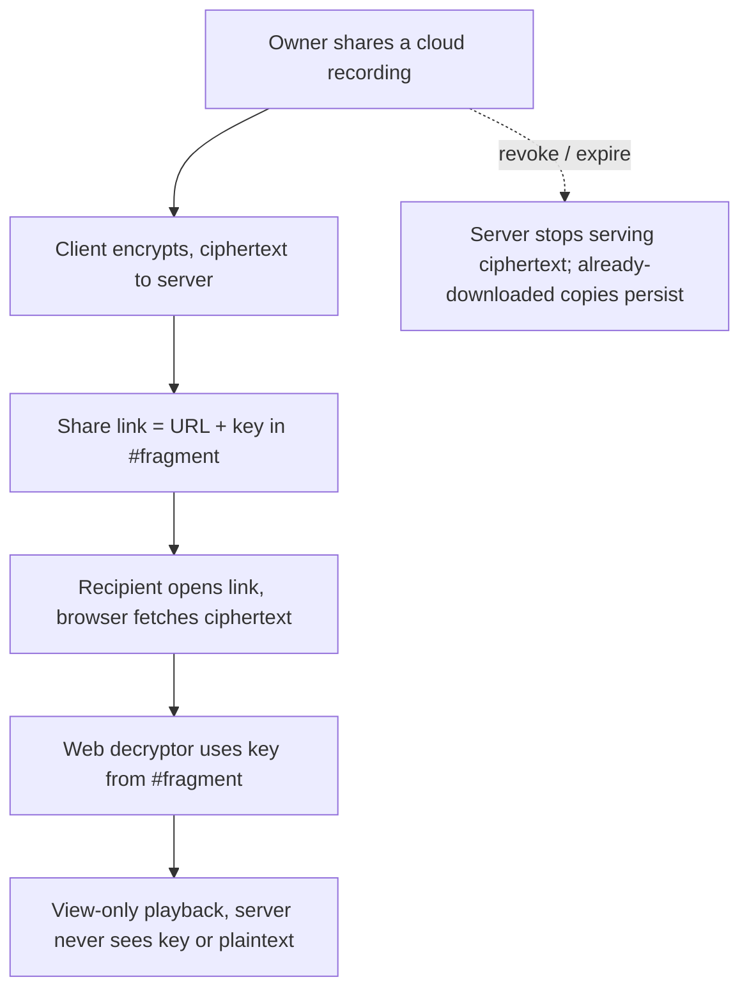
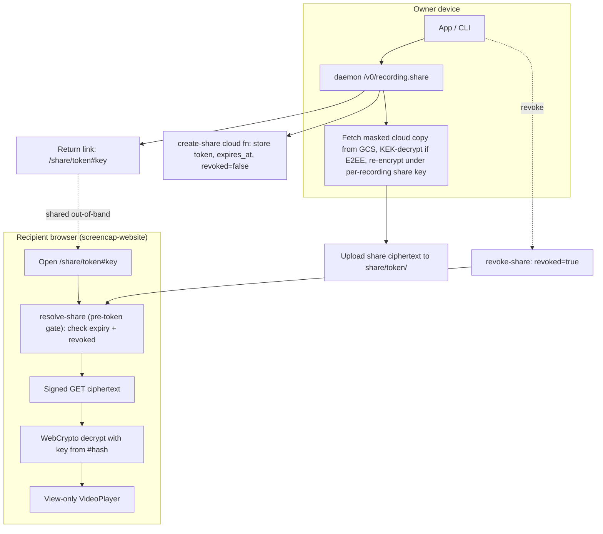

# Personal Cloud Share-by-Link - Plan

## Goal Capsule

- **Objective:** Build first-class per-recording **share-by-link** for cloud (Personal) users — E2EE with the decryption key in the URL fragment, view-only, revocable, auto-expiring, viewable by anyone with the link without an account.
- **Product authority:** Rute Figueiredo (owner). The Product Contract below is authoritative for scope; a substantive scope conflict pauses for the owner.
- **Execution profile:** Deep, security-sensitive (client crypto), cross-repo (`screencap` + `screencap-website`). Seven units, dependency-ordered.
- **Stop conditions:** Surface a blocker rather than guess if implementation shows the share re-encryption cost is unacceptable (revisit KTD1 Option B) or the single-KEK model can't yield a per-share key safely.
- **Tail ownership:** Standard PR + CI; the cross-repo work lands as coordinated PRs (screencap backend/CLI/app; screencap-website viewer).

---

## Product Contract

### Summary

Give cloud (Personal) users a first-class per-recording share link: the owner generates a link, anyone with it views the recording without an account, the view is view-only, and the owner can revoke the link or let it auto-expire. This becomes the explicit "share one recording" primitive, distinct from today's ambient account-page visibility (`show_on_website`).

### Problem Frame

SCR-229 was written 2026-07-03 and listed five missing capabilities. Four of the five shipped or were reassigned in the following two weeks; the ticket now over-states what remains and mis-names how billing attaches. The only genuinely-unbuilt promise is share-by-link — and its headline pairing with "encrypted backup across your Macs" is architecturally opposed (an E2EE recording can't be read by an anonymous link-holder without the key travelling somewhere), which is why it needs its own scoping.

Reconciliation of the original ticket against the codebase and Linear as of 2026-07-21:

| Original "missing" item | Status now | Evidence |
|---|---|---|
| Individual $5/mo billing | **Shipped** — via Stripe checkout + 402 `subscription_required` paywall + entitlement lease; *not* the `pipeline_policy.set_default_override` seam the ticket names (that seam has zero callers). Acceptance criterion is stale. | SCR-237 (Done); `docs/plans/2026-07-07-001-feat-personal-cloud-billing-paywall-plan.md`; `src/screencap/pipeline_policy.py:232` |
| Cross-Mac backup/sync | **Partial (more built than claimed)** — upload + a real cloud→Mac restore path + iCloud-Keychain key sync. But it is manual + CLI-only, not seamless in-app sync. | `src/screencap/download.py`; SCR-253 (Done) |
| Share-by-link (single recording) | **Unbuilt** — only ambient website-visibility exists; no share command or signed-URL generator. | `show_on_website` model; no `share` command in `src/screencap/` |
| Native Google/Apple/work-email auth | **Partial** — one Google browser path serves all three buttons; native per-provider flows out of scope. Shared surface with SCR-221. | Reassigned → SCR-221 |
| "Encrypted" claim (E2EE) | **Nuanced** — E2EE upload lane exists but defaults **off**; the shareable/website copy is deliberately server-readable. | `src/screencap/config.py:618` (`cloud_e2ee_enabled` → `False`); SCR-220 (In Review), SCR-238 (Done, default-flip soak-gated) |

### Key Decisions

- KD1. SCR-229 narrows to per-recording share-by-link. The other four original items are marked resolved (billing, E2EE capability, restore) or reassigned (native auth, seamless sync, copy-unlock) rather than tracked here.
- KD2. Sharing is cloud-gated. A "This Mac only" recording has no server copy to link to, so share-by-link presupposes an uploaded copy and is a paid-cloud capability by construction — one of the three things the Personal card is for.
- KD3. Access model is anyone-with-the-link (unlisted); the recipient needs no account. This rules out per-recipient key delivery.
- KD4. Share delivery is E2EE with the key in the link fragment. The shared recording stays ciphertext on the server; the key rides in the URL `#fragment` (never sent to the server) and a browser-side decryptor decrypts for the viewer. Chosen for privacy alignment — Screencap's servers never read shared recordings — over the cheaper server-readable copy, accepting two costs: a new web decryptor must be built (the current pipeline no-ops on ciphertext), and revocation is weaker (R4).

### Requirements

**Share link lifecycle**

- R1. A cloud user can generate a share link for a single recording they own.
- R2. Anyone holding the link can view the recording without signing in or holding an account.
- R3. The shared view is view-only — no download affordance for the recording file.
- R4. The owner can revoke a link; after revocation the server stops serving the recording's ciphertext. Revocation prevents future fetches but cannot retract a copy a recipient already downloaded — the key travels in the link — and the UI must not imply otherwise.
- R5. A link auto-expires after a bounded period; after expiry it stops serving the recording.

**Relationship to existing sharing**

- R6. Share links are explicit and per-recording (opt-in per share), distinct from the ambient account-page visibility (`show_on_website`). Whether that ambient model is retired or coexists is deferred to planning (OQ3).

**Honesty of claims**

- R7. The share UI is truthful about the link's security model: shared copies are end-to-end encrypted (the server can't read them), and the link itself carries the key — so anyone holding the link can decrypt. It must not imply per-recipient access control the model doesn't provide.

**Encrypted delivery (KD4)**

- R8. The shared recording is stored as ciphertext on the server; the server is never able to read shared recordings.
- R9. The decryption key is carried in the link's URL fragment, is never sent to the server, and a browser-side decryptor decrypts it for the viewer.
- R10. The shared copy is the already-masked `<name>-scrubbed` cloud copy, so masking is inherited — never re-derived from the unmasked local screenshots. No re-scrub and no server-side processing of the ciphertext is needed.

### Key Flows

- F1. Create and share
  - **Trigger:** Owner selects "Share" on a cloud recording they own.
  - **Steps:** System produces a link for that recording; owner copies/sends it out-of-band.
  - **Covered by:** R1, R2
- F2. Recipient view
  - **Trigger:** Anyone opens the link.
  - **Steps:** The recording plays view-only; no account prompt, no download control.
  - **Covered by:** R2, R3
- F3. Revoke or expire
  - **Trigger:** Owner revokes, or the expiry period elapses.
  - **Steps:** Subsequent opens of the link no longer serve the recording.
  - **Covered by:** R4, R5

### Acceptance Examples

- AE1. Revocation. **Covers R4.** **Given** a link that currently plays a recording, **when** the owner revokes it, **then** a fresh open of the link no longer serves the recording. (Does not retract a copy a recipient already fetched — see A2.)
- AE2. Expiry. **Covers R5.** **Given** a link past its expiry period, **when** anyone opens it, **then** it no longer serves the recording.
- AE3. Local-only recording. **Covers R1, KD2.** **Given** a "This Mac only" recording with no cloud copy, **when** the user looks to share it, **then** share-by-link is unavailable (or routes through becoming a cloud user first) rather than silently uploading.
- AE4. View-only. **Covers R3.** **Given** a recipient viewing a shared recording, **then** no download control is offered. (Soft control once a browser renders the video — see A3.)

### Scope Boundaries

Deferred for later (eventually, not this ticket):
- Seamless / in-app cross-Mac sync. Manual `download.py` restore is the v1 story.
- Personal-card copy unlock (pricing + "encrypted backup"). Gated on the encryption stance and the global E2EE default-flip.

Outside SCR-229 (reassigned):
- Native Google/Apple/work-email sign-in → SCR-221.
- Team sharing, member visibility, per-seat billing → SCR-221.
- E2EE default-flip → SCR-238 (Done, soak-gated).
- Key recovery after total device loss → SCR-252.
- Clip / segment sharing → SCR-219 (Done). Share here is whole-recording.

### Dependencies / Assumptions

- Depends on existing cloud upload with per-user isolation (`users/{uid}/`) and account identity (Firebase uid + Stripe `metadata.uid`).
- A1. Sharing requires a paid cloud entitlement — the same gate as backup.
- A2. Revoke and expire mean "the server stops serving the copy." Neither can retract a copy a recipient already fetched.
- A3. View-only is a soft control: once a browser can decrypt/render the video to play it, capture cannot be hard-prevented. State this honestly rather than implying a hard guarantee.
- A4. With KD4 (E2EE shares), the card's "encrypted backup" + "share by link" pairing is jointly truthful — both are encrypted. The residual honesty gap is per-recipient control: the link is the access token, so "share with one person" is really "share with anyone who gets the link."
- A5. The link is the secret. Whoever obtains it (chat logs, browser history, referrer, shoulder-surf) can decrypt; there is no server-side per-recipient gate under KD4.

### Outstanding Questions

Resolved during planning (see Planning Contract): OQ2 expiry → 30-day default, configurable + per-share override (KTD6); OQ3 → coexists with `show_on_website` as a distinct primitive (KTD5); OQ4 → net-new `/share/[token]` route + WebCrypto decryptor in `screencap-website` (KTD4). No open question blocks implementation.

### Sources / Research

- Billing: SCR-237 (Done); `docs/plans/2026-07-07-001-feat-personal-cloud-billing-paywall-plan.md`; live-charging cutover in `docs/plans/2026-07-20-002-feat-stripe-live-charging-cutover-plan.md`. Unused plan-tier seam at `src/screencap/pipeline_policy.py:232` (`set_default_override`, zero callers).
- E2EE arc: SCR-220 (In Review), SCR-253 (Done), SCR-238 (Done); plan `docs/plans/2026-07-11-002-feat-scr-220-e2ee-shared-copies-plan.md`; `src/screencap/config.py:618` (`cloud_e2ee_enabled` defaults `False`).
- Cross-Mac restore: `src/screencap/download.py` (manual/CLI restore, `DownloadResult`, `is_downloaded`).
- Sharing today: `show_on_website` (ambient account-page visibility); no `share` command or signed-URL generator exists.
- UI / claims: `docs/design/screencap-prototype/Screencap Prototype.dc.html` (Onboarding storage step, three-card layout); `docs/plans/2026-07-03-001-feat-screencap-prototype-ui-plan.md` (Personal card + account step rendered with pricing/encryption copy withheld per the honesty gate).
- Implementation seams: `src/screencap/cloud_crypto.py` (single per-user KEK, `encrypt_stream:566` / `decrypt_to:644`); `src/screencap/upload.py:546` + `scripts/cloud-function/paths.py:112` (GCS `users/{uid}/...` layout); `scripts/cloud-function/main.py:170-192` (action allow-list, pre-token demo dispatch); `scripts/process-recording/main.py` no-ops on E2EE ciphertext (SECURITY.md:53); `screencap-website` `src/app/_components/viewer/VideoPlayer.tsx` + `_lib/gcs-proxy.ts:60` (separate-repo web player); `src/screencap/cli/__init__.py:5198` (`e2ee` group precedent); `src/screencap/daemon/app.py:1082` (`recording_rename` verb template); `macos/Screencap/Views/Inspect/InspectWindow.swift:90` (share affordance).

---

## Planning Contract

**Product Contract preservation:** unchanged. The three deferred Outstanding Questions were resolved in planning (KTD4–6); no R-IDs changed.

### Key Technical Decisions

- KTD1. Share crypto = re-encrypt under a per-recording share key (Option A), sourced from the masked cloud copy. The single per-user KEK (`cloud_crypto.py:566`) encrypts every recording with no per-recording key, so a key that decrypts only one recording is net-new. The share source is the already-masked `<name>-scrubbed` cloud copy — never the raw local screenshots, which are unmasked (R10) and evicted after upload (`retention.py`): fetch it from GCS, and if `cloud_e2ee_enabled` was on, KEK-decrypt it; if it was off, the copy is already server-readable plaintext (no KEK needed). Re-encrypt it **once per recording** under a freshly minted 256-bit share key (`secrets` CSPRNG); links to the same recording reuse that ciphertext and revoke per-link via the record, avoiding a fresh full-size copy per link. The share key goes in the URL fragment; the master KEK never leaves the device. Escape hatch for large-recording cost: the deferred envelope-encryption alternative (per-recording key wrapped by the KEK) is O(key) not O(bytes) but changes the core E2EE path.
- KTD2. Share record store = a GCS marker object under the share prefix (the `_unlisted` precedent, `chunk_processor.py:1350`); no new GCP dependency. Billing has **no reusable datastore** — entitlement lives only in Stripe subscriptions + a Firebase custom claim (`billing.py`, `set_custom_user_claims`; there is no Firestore in `scripts/cloud-function/`), so the earlier "reuse billing's datastore" idea is dead. Each record holds `{owner_uid, recording_prefix, expires_at, revoked, view_only}`, keyed by a CSPRNG token (`secrets.token_urlsafe(32)`, 256-bit, URL-safe). `owner_uid` (the verified Firebase uid captured at create) is what `revoke-share` checks the caller against. Alternative if `share list` or revoke atomicity outgrows markers: a net-new Firestore `shares/{token}` collection (adds an IAM role, client lib, and deploy config).
- KTD3. Issuance via a daemon verb. `/v0/recording.share` mints the per-share key locally, re-encrypts + uploads (KTD1), then calls the `create-share` cloud function with the daemon's Firebase token; CLI and app are thin clients. Matches the daemon-client architecture and keeps key minting off the server. Handler template: `recording_rename` (`daemon/app.py:1082`, same-EUID + `audit_log`).
- KTD4. Web viewer = net-new `/share/[token]` route + WebCrypto decryptor in `screencap-website` (Next.js). A link resolves via the public `resolve-share` cloud function to signed GET URLs for the ciphertext; the browser reads the key from `window.location.hash`, decrypts with WebCrypto (a JS port of `decrypt_to:644`), and feeds the existing `VideoPlayer.tsx` view-only. Distinct from the server-readable demo player.
- KTD5. Coexist with `show_on_website`. Share-by-link is a per-recording, anonymous, token-gated, revocable primitive; `show_on_website` (`config.py:1169`) is a per-user ambient account-page visibility toggle. Orthogonal; the ambient model is untouched.
- KTD6. Default link expiry 30 days, via a `share_link_expiry_days` setting (the config doc-write pattern in `cli/__init__.py`, `_set_cloud_e2ee_flag`) with a per-share override at create time.
- KTD7. Anonymous access boundary = the share token, treated as an **opaque high-entropy lookup key**. `resolve-share` dispatches BEFORE the bearer gate in the allow-list (like `demo-sign-download`, `main.py:176-179`), looks up the record, validates `expires_at` + `revoked`, and signs GET URLs for **only the `recording_prefix` stored in the record** — never a path built from the raw URL token (reuse `paths.py` `_validate_name` + `startswith` so a `../users/{victim}` token cannot climb the namespace). This adds a third unauthenticated namespace beside `demo/`, widening `resolve_prefix`'s single-namespace boundary, so its invariant tests (`test_paths.py`, `test_main.py` tokenless-boundary) must be revised. Rate-limit `resolve-share` per IP/token (enumeration + cost-DoS on a public endpoint). Revoke/expiry stop future signing but do not invalidate already-issued signed URLs until their own TTL lapses (R4, A2); already-downloaded copies persist.

### High-Level Technical Design

### Assumptions

- Sharing sources the masked `<name>-scrubbed` cloud copy from GCS — the local rich copy is evicted post-upload (`retention.py`) and the local screenshots are unmasked, so neither is a valid share source (KTD1, R10).
- Billing persists no datastore to reuse (Stripe + Firebase custom claims only); the share store is net-new GCS-marker (KTD2). The daemon can mint the Firebase id-token it needs for `create-share` (`auth.get_id_token`).
- `screencap-website` is the viewer deploy target and can be granted GET access to the recordings bucket via its CORS proxy allow-list (`api/proxy/route.ts:11`).
- A recording must be cloud-uploaded (owned `users/{uid}/` prefix) before it can be shared (KD2).

### Sequencing

U1 → U2 → U3 are the crypto+backend spine. U4 (daemon) depends on U1–U3; U5 (CLI) on U4; U7 (macOS) on U4/U5. U6 (viewer) depends on U3's resolve-share contract + U1's ciphertext format and can proceed in parallel in `screencap-website` once U3 is fixed.

---

## Implementation Units

### U1. Per-recording share key + re-encryption from the masked cloud copy
- **Goal:** Produce a share-scoped ciphertext under a per-recording share key, sourced from the masked cloud copy, without exposing the master KEK.
- **Requirements:** R8, R9, R10; KD4, KTD1.
- **Dependencies:** none.
- **Files:** `src/screencap/share_crypto.py` (new), `src/screencap/cloud_crypto.py` (reuse `encrypt_stream`/`decrypt_to`/`_build_header`), `src/screencap/download.py` (reuse the cloud fetch), `tests/test_share_crypto.py` (new).
- **Approach:** Fetch the masked `<name>-scrubbed` cloud copy from GCS — never the raw local artifacts (evicted after upload, and the local screenshots are unmasked). If the copy is KEK-ciphertext (E2EE was on), decrypt it with the cloud KEK; if `cloud_e2ee_enabled` was off, it is server-readable plaintext — use as-is. Mint a 256-bit share key with a CSPRNG, re-encrypt under it with the existing framed AES-256-GCM, emit a share manifest, and return the key base64url for the fragment. Do not touch the KEK item or the per-user upload path.
- **Patterns to follow:** `cloud_crypto.encrypt_stream:566` / `decrypt_to:644`; header `_build_header:514`; cloud fetch `download.py`.
- **Test scenarios:** re-encrypt then decrypt with the share key yields the original masked bytes; the share key does not decrypt a KEK artifact and vice-versa; key is 256-bit CSPRNG + base64url-safe; the share source is the masked copy, never the unmasked local screenshots (Covers R10); an uploaded-but-evicted recording still shares via the GCS fetch; an E2EE-off recording (plaintext cloud copy, no KEK) shares.
- **Verification:** a share ciphertext built from the masked cloud copy decrypts only with its share key and never exposes unmasked content.

### U2. Share ciphertext upload + share-scoped GCS path + anonymous GET
- **Goal:** Store the share ciphertext under a share-scoped prefix and allow anonymous signed GET of it.
- **Requirements:** R8; KTD1, KTD7.
- **Dependencies:** U1.
- **Files:** `src/screencap/upload.py` (reuse `request_signed_urls:546` / `upload_recording:644`), `scripts/cloud-function/paths.py` (add a `share/{token}/` prefix beside `resolve_prefix:83`), `scripts/cloud-function/main.py` (`_sign_recording:312` reuse), `tests/`.
- **Approach:** Add a `share/{token}/` layout (owner writes authed; reader gets a tokenless signed GET, like `demo/`). Upload the U1 ciphertext + share manifest there. Reader-side signing is gated by the share token in U3, not Firebase auth. This adds a third unauthenticated namespace beside `demo/` — thread it through `resolve_prefix` as a validated third branch (never a raw-token path) and plan to revise the tokenless-boundary tests in U3.
- **Patterns to follow:** demo tokenless path `paths.py:118`; `_sign_recording:312`.
- **Test scenarios:** share prefix built correctly for `{uid, token}`; owner upload is authed; a signed GET of a share object succeeds without a Firebase bearer; non-share `users/` objects stay bearer-gated; the `demo/`-only tokenless invariant still holds after the `share/` branch is added.
- **Verification:** ciphertext lands under `share/{token}/` and is GET-able with only a valid signed URL.

### U3. Share record store + create/resolve/revoke cloud functions
- **Goal:** Mint, resolve, and revoke shares with server-side expiry, revocation, and owner-only authz.
- **Requirements:** R1, R4, R5, R6, R8; KTD2, KTD6, KTD7.
- **Dependencies:** U2.
- **Files:** `scripts/cloud-function/main.py` (add `create-share` / `resolve-share` / `revoke-share` to the allow-list `:170-192`), `scripts/cloud-function/shares.py` (new GCS-marker store), `scripts/cloud-function/paths.py` (validated `share/` branch), `scripts/cloud-function/deploy_*.sh`, `tests/` (incl. the revised `test_paths.py` / `test_main.py` tokenless-boundary tests).
- **Approach:** `create-share` (authed) writes a GCS-marker record `{owner_uid, recording_prefix, expires_at` default +30d`, revoked:false, view_only:true}` keyed by a `secrets.token_urlsafe(32)` token (KTD2). `resolve-share` (dispatched before the bearer gate, like `demo-sign-download`) treats the token as an opaque lookup key, validates not-expired + not-revoked, and signs GET URLs for **only the stored `recording_prefix`** — never a path built from the raw token (reuse `_validate_name` + `startswith`, KTD7). `revoke-share` (authed) compares the caller's Firebase uid to `owner_uid` and sets `revoked:true` on match. Rate-limit `resolve-share`.
- **Patterns to follow:** `@functions_framework.http` (`billing.py:274`); pre-token dispatch `main.py:176-179`; namespace guard `resolve_prefix` (`paths.py:83`).
- **Test scenarios:** create returns a token + a record with `owner_uid` populated; resolve on a valid token returns signed URLs for the stored prefix only; a `../users/{other}` token is rejected (no namespace climb); resolve on expired → denied (Covers AE2); resolve on revoked → denied (Covers AE1); revoke by a non-owner uid → denied; resolve never requires a Firebase bearer; the `demo/` tokenless-boundary invariant still holds.
- **Verification:** the create→resolve→revoke lifecycle enforces expiry, revocation, and owner-only authz, and no token resolves outside its stored prefix.

### U4. Daemon share verbs
- **Goal:** Broker share creation/revocation from the owner's authenticated daemon, minting the key locally.
- **Requirements:** R1, R4; KTD3.
- **Dependencies:** U1, U2, U3.
- **Files:** `src/screencap/daemon/app.py` (add `Route("/v0/recording.share", ...)` near `:5277`, handler modeled on `recording_rename:1082`), `tests/`.
- **Approach:** `create` builds the per-recording share ciphertext (U1), uploads it (U2), calls `create-share` with the daemon's Firebase id-token, and returns `{share_url, token, expires_at}` with the key placed in the fragment for the local caller only. `revoke` / `list` proxy to the cloud functions. Same-EUID gated; emits `/v0/events`. The `audit_log.record_verb` entry and the event payload log only `token` + `expires_at`, never the fragment/key — the `recording_rename` template records verb payloads, so this exclusion must be explicit.
- **Test scenarios:** create returns a well-formed link with `#key`; revoke flips server state; list returns the owner's active shares; the verb rejects a cross-EUID caller; sharing a local-only recording is refused (Covers AE3); the audit-log record and `/v0/events` payload for the verb never contain the key or fragment.
- **Verification:** the owner can create and revoke a share through the daemon; the key never appears in server state or logs.

### U5. CLI `share` group + expiry-default config
- **Goal:** Give CLI users `share create/revoke/list` and a configurable default expiry.
- **Requirements:** R1, R4, R5, R7; KTD3, KTD6.
- **Dependencies:** U4.
- **Files:** `src/screencap/cli/__init__.py` (`@cli.group("share")` beside `e2ee:5198`; reuse the `_set_cloud_e2ee_flag` doc-write helper), `src/screencap/config.py` (`share_link_expiry_days` getter), `tests/`.
- **Approach:** `share create <recording> [--expires-days N]` prints the link (with `#key`) plus an honest one-liner (the link carries the key; anyone with it can view; view-only). `share revoke <token>`, `share list`. Thin client over the U4 verbs.
- **Test scenarios:** `create` prints a link containing `#`; `--expires-days` overrides the default; `revoke` / `list` call the right verbs; honesty copy present in `create` output (Covers R7).
- **Verification:** the CLI round-trips create→list→revoke against the daemon.

### U6. Website `/share/[token]` viewer + WebCrypto decryptor
- **Target repo:** `screencap-website`.
- **Goal:** Resolve a share link and play the recording view-only, decrypting in the browser.
- **Requirements:** R2, R3, R8, R9; KTD4.
- **Dependencies:** U3 (resolve-share contract), U1 (ciphertext format).
- **Files:** `src/app/share/[token]/page.tsx` (new), `src/app/_lib/share-decrypt.ts` (new WebCrypto port of `decrypt_to`), `src/app/_lib/gcs-proxy.ts` (reuse `getSignedUrls:60` against `resolve-share`), `src/app/api/proxy/route.ts` (`ALLOWED_BUCKETS:11` add recordings bucket), reuse `src/app/_components/viewer/VideoPlayer.tsx`, tests.
- **Approach:** Call `resolve-share` with the path token for signed GET URLs; read the key from `window.location.hash` (never sent to the server); decrypt the framed AES-256-GCM frame-by-frame with WebCrypto; feed `VideoPlayer` with controls that omit download. Show an expired/revoked state when resolve denies. The framed format (VERSION byte, `SCRE2E` magic, 64KB frames, per-frame AAD) must be reproduced byte-exactly or every link fails with `InvalidTag` — bind it with the golden-vector test (Verification Contract). Assembling playback buffers decrypted frames into a MediaSource/Blob; budget for large-recording browser memory.
- **Test scenarios:** valid token + `#key` plays (Covers R2); missing/wrong `#key` fails to decrypt without crashing; expired/revoked token shows the denied state; no download control rendered (Covers R3); the key from `#hash` never appears in any network request (Covers R9); a Python-encrypted golden fixture decrypts byte-exactly in the JS port.
- **Verification:** end-to-end — a link minted by U5 plays in the browser and stops playing after revoke/expiry.

### U7. macOS Inspect share affordance
- **Goal:** Let a user copy a share link and revoke it from the recording Inspect window.
- **Requirements:** R1, R4, R7; KTD3.
- **Dependencies:** U4, U5.
- **Files:** `macos/Screencap/Views/Inspect/InspectWindow.swift` (extend the "Share / Upload…" affordance `:90`, `InspectShareAffordance:16`), `macos/Screencap/Controllers/ShareLinkController.swift` (new, modeled on `CloudAuthController`), reuse `macos/Screencap/Views/Shared/ShareServicePresenter.swift`, XcodeGen project (see `docs/solutions/build-errors/xcodegen-stale-project-missing-new-sources.md`), tests.
- **Approach:** A "Copy share link" action shells `screencap share create`, copies the link, and shows honest copy (the link carries the key; view-only). A "Revoke link" action calls `share revoke`. Cloud-only recordings.
- **Test scenarios:** copy-link populates the pasteboard with a `#`-fragment link; revoke reflects state; the affordance is disabled/hidden for local-only recordings; honesty copy present (Covers R7).
- **Verification:** a user copies and revokes a share link from Inspect without leaving the app.

---

## Verification Contract

| Gate | Command | Applies to |
|---|---|---|
| Python unit tests | `pytest tests/test_share_crypto.py` (+ new share tests) | U1–U5 |
| Privacy lane (crypto/sharing is privacy-bearing) | `pytest -m privacy` — mark new share/crypto tests `@pytest.mark.privacy`, Vision-free | U1–U4 |
| Engine lint | `ruff check src/screencap/engine/` | screencap units |
| Cloud-function tests | `pytest scripts/cloud-function/` | U2, U3 |
| Website tests + build | `npm test` / `npm run build` in `screencap-website` | U6 |
| macOS build/test | XcodeGen + `xcodebuild` (repo flow) | U7 |
| Cross-repo format golden vector | Python-encrypted fixtures (header + multi-frame) decrypt byte-exactly in the JS port; both sides assert the format VERSION | U1 ↔ U6 |

- Mark all crypto/share Python tests `@pytest.mark.privacy` — CI runs only the privacy lane.
- No `recording.db`, KEK, or per-share key ever appears in an uploaded artifact or a log line.

---

## Definition of Done

- A cloud user creates a share link (CLI or Inspect); a recipient with no account opens it in the browser and watches the recording view-only.
- The per-share key travels only in the URL fragment and never reaches the server, server logs, or GCS metadata; the master KEK never leaves the device.
- Revoke and expiry both stop the server serving the ciphertext (AE1, AE2); UI/CLI copy states plainly that already-downloaded copies can't be retracted and that the link carries the key (R7, A2, A5).
- Sharing is refused for local-only recordings (AE3); `show_on_website` behavior is unchanged (KTD5).
- All new share/crypto tests are `@pytest.mark.privacy` and green on the privacy lane; `ruff` clean; `screencap-website` builds; macOS builds.
- Abandoned/experimental code from the crypto exploration is removed before done.
