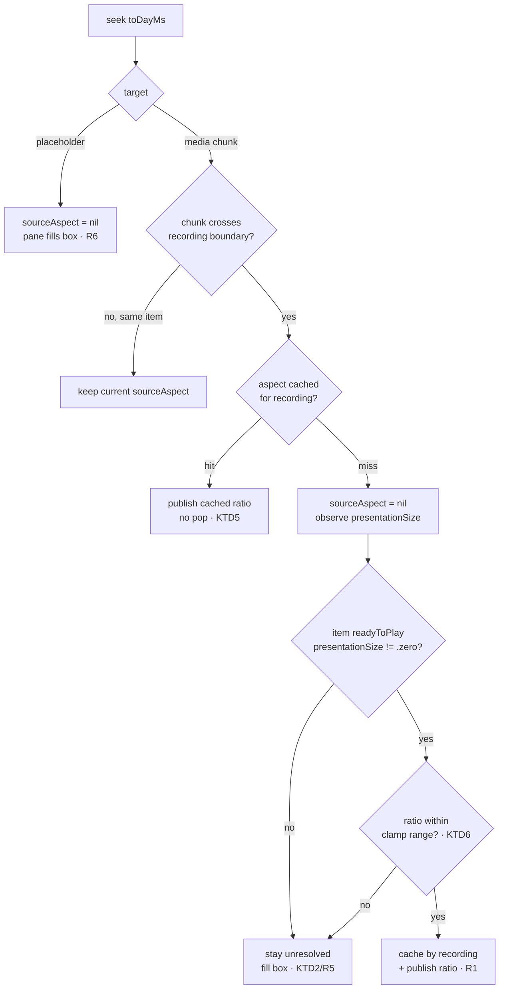

# fix: Constrain the Day page player to its source aspect ratio

**Linear:** [SCR-297](https://linear.app/zk-email/issue/SCR-297/day-page-player-still-pillarboxes-at-wide-window-sizes) · **Branch:** `rutefig/scr-297-day-page-player-still-pillarboxes-at-wide-window-sizes`

---

## Goal Capsule

The Day page's playback pane fills whatever box the page leaves it and lets `AVPlayerView` pillarbox the footage inside. Give the pane the footage's **real** aspect ratio instead, read per-chunk at runtime, so the black bars stop existing and the leftover width becomes page background. The pane's three chrome overlays — timestamp chip, action buttons, clip bounds — come along for the ride: they stop floating over dead black space and anchor to the video's own edges.

Not a reflow. The page keeps its fixed-viewport character and its current section order.

---

## Problem Frame

PR #442 fixed the Day page's window overflow and improved the player at both ends of the size range: a 320pt floor for `playbackPaneMinHeight`, a 1180×780 `defaultSize` so the window stops opening at its minimum, and a 24pt `playbackPaneHorizontalInset` matching the day page's content gutter. That answered the reporter's "small margin" request and roughly doubled the rendered video width at the new default.

It did not remove the pillarboxing, and the ticket correctly deferred that as a layout-design decision rather than a sizing one. At the 1180×780 default the detail column is ~932pt wide while 16:10 footage fitted to the available height renders ~710pt, leaving roughly 100pt of black either side.

`playbackPane` ([macos/Screencap/Views/Timeline/DayTimelineView.swift:503](macos/Screencap/Views/Timeline/DayTimelineView.swift:503)) is declared `.frame(maxWidth: .infinity, minHeight:, maxHeight: .infinity)` — it takes the whole box and delegates aspect handling to `AVPlayerView`'s default aspect-fit. The bars are `AVPlayerView`'s, drawn inside a pane that is the wrong shape.

**A second defect the ticket does not name.** The pane's three overlays are attached to the pane's frame, deliberately *before* the gutter padding so they track "the video's own edges" ([DayTimelineView.swift:541-546](macos/Screencap/Views/Timeline/DayTimelineView.swift:541)). That comment describes the intent, but the pane's edges are only the video's edges when the pane happens to match the source aspect. At the shipped default they do not: the timestamp chip and the action bar sit out over the pillarbox bars. Constraining the pane makes the existing comment true rather than aspirational, which is why this approach fixes two things at once and the surface-treatment alternative fixes neither.

**The source aspect is not a constant.** It is whatever display was captured. Ultrawide and multi-display captures behave differently, and a day can cross recordings from different displays. Any fixed assumption (16:10, 16:9) is wrong for some users and produces a *worse* failure than today's bars: a mis-shaped pane with mis-anchored chrome.

---

## Requirements

| ID | Requirement |
|----|-------------|
| R1 | When the chunk under the playhead has a resolvable video display size, `playbackPane` renders at that exact aspect ratio, fitted inside the slot the page gives it. |
| R2 | **Once the aspect has resolved**, no black pillarbox or letterbox bars are drawn inside the pane at any window size at or above the declared minimum. (Scoped deliberately: R5's unresolved state still fills the box, and bars are drawn then. R2 and R5 would contradict if R2 were unconditional.) |
| R3 | The space freed beside/below the constrained player renders as day-page background (`Color.scPaper`), not as player surface. |
| R4 | The timestamp chip, action buttons, and clip-bounds overlay anchor to the constrained player's edges at every window size — never over freed background. |
| R5 | While the source aspect is unresolved or unresolvable, the pane keeps today's fill-the-box behaviour. No guessed ratio is ever applied. |
| R6 | The placeholder states (`nothingCaptured`, `mediaUnavailable`) keep filling the slot — they are page states, not video, and carry no aspect. |
| R7 | A chunk or recording boundary that changes the source aspect re-shapes the pane without the page reflowing its other sections. |
| R8 | An absurd or corrupt reported size never produces a degenerate pane; the ratio is clamped to a plausible display range or treated as unresolved. |
| R9 | The pane's existing `playbackPaneMinHeight` floor and `playbackPaneHorizontalInset` gutter contract survive unchanged, including their pinned tests. |

---

## Key Technical Decisions

### KTD0. Constrain the pane to the source aspect — the ticket's Option 2

*(session-settled: user-directed — chosen over Option 1 "accept the bars and give the pane a surface treatment" and Option 3 "grow to fill width, page scrolls": Option 2 is the only one of the three that also fixes the mis-anchored overlay chrome described in the Problem Frame, and it removes the bars without surrendering the page's fixed-viewport character the way Option 3 does.)*

Governs the whole plan. The ticket left three options open and suggested Option 1 as the cheap first step; the decision taken was Option 2. Recorded here so an executor does not re-open it, and so the deferred reflow (KTD4) is understood as the other half of Option 2 rather than a new idea.

### KTD1. Read the aspect from `AVPlayerItem.presentationSize`, not from the asset's track geometry

`presentationSize` reports the item's display size with the preferred transform and pixel aspect ratio already applied, is KVO-observable, and needs no async track load. The alternative — `AVAsset.loadTracks(withMediaType: .video)` then `load(.naturalSize, .preferredTransform)` — requires composing the transform by hand to get display size right for rotated or non-square-pixel media, and adds an async load per chunk swap.

The one thing the alternative buys is knowing the aspect *before* the item is ready to play, which would avoid the brief unresolved window in KTD2. That is not worth hand-rolled transform math for a pane whose unresolved state is a safe, already-shipped rendering.

`presentationSize` is `.zero` until the item reaches `.readyToPlay`. That is the unresolved state, not an error.

### KTD2. Unknown aspect falls back to filling the box — never to a guessed ratio

Governs R5. When `presentationSize` has not resolved, the pane behaves exactly as it does today. A hardcoded 16:10 fallback would be wrong for ultrawide and multi-display captures — the ticket says so explicitly — and a wrong guess is worse than the bars: it mis-shapes the pane *and* mis-anchors the chrome, whereas filling the box is the known-safe rendering that ships today.

### KTD3. The freed width is page background, not player surface

Governs R3. This is the actual visual payoff and the answer to the ticket's objection that Option 2 "moves the empty space beside the player rather than removing it." Black bars inside a player read as dead space in the video; the same pixels rendered as `Color.scPaper` beside a correctly-shaped player read as page margin. The VStack's existing `.background(Color.scPaper)` ([DayTimelineView.swift:128](macos/Screencap/Views/Timeline/DayTimelineView.swift:128)) supplies this for free once the pane stops claiming the full width.

### KTD4. No page reflow in this change

Governs R7. Moving the narrative into a sidebar or relocating the action bar to consume the freed width is a separate, larger design change. This plan makes the player correctly shaped; whether the page later *uses* the freed width is a follow-up decision that is easier to make once the correct shape is visible. Deferred explicitly rather than silently.

### KTD5. Cache the resolved aspect per recording

Governs R7. Seeking within a day swaps `AVPlayerItem`s at every chunk boundary ([DayPlaybackEngine.swift:345-349](macos/Screencap/Controllers/DayPlaybackEngine.swift:345)). Without a cache, each swap drops back to unresolved and the pane visibly pops to full-width and back. Chunks of one recording share a display, so caching by recording name makes the pop a once-per-recording event instead of once-per-chunk. Mirrors the existing `tasksCache` pattern in the same class ([DayPlaybackEngine.swift:292](macos/Screencap/Controllers/DayPlaybackEngine.swift:292)).

### KTD6. Clamp the ratio to a plausible display range

Governs R8. A corrupt manifest or an unexpected `presentationSize` should not be able to produce a 40:1 sliver or a zero-width pane. Values outside a generous display range (roughly 1:2 through 4:1 — covering portrait-rotated displays through ultrawide) are treated as unresolved and fall through to KTD2's fill behaviour.

### KTD7. Keep `AVPlayerNSView` and apply the constraint on the SwiftUI side

The codebase already replaced SwiftUI's `VideoPlayer` with an `NSViewRepresentable` over `AVPlayerView` specifically because `VideoPlayer` crashes on macOS 26 / SwiftUI 7.5.3 when its body is composed under a layout modifier such as `.aspectRatio` together with a transition ([VideoPlayerPane.swift:300-308](macos/Screencap/Views/Review/VideoPlayerPane.swift:300)). That crash is in `_AVKit_SwiftUI`, which `AVPlayerNSView` does not go through — but this plan applies exactly the modifier shape that comment warns about, one layer out. Treated as a real risk with a named verification step rather than assumed safe. See Risks.

---

## High-Level Technical Design

### Aspect resolution flow



### Pane composition — modifier order is the whole design

Order is load-bearing: the aspect constraint must sit **inside** the overlays so the overlays inherit the constrained frame (R4), and the flexible slot frame must sit **outside** them so it centres the constrained player and holds the height floor (R9).

```
ZStack { AVPlayerNSView | placeholder }
  └─ .aspectRatio(ratio, contentMode: .fit)   ← only when resolved; no-op when nil (R5)
       └─ .overlay(bottomLeading)  timestampChip      ┐
       └─ .overlay(bottomTrailing) actionButtons      ├─ now anchored to the VIDEO (R4)
       └─ .overlay(bottom)         clipBoundsOverlay  ┘
            └─ .frame(maxWidth: .infinity,
                      minHeight: playbackPaneMinHeight,
                      maxHeight: .infinity)   ← the slot: centres the player, holds the floor (R9)
                 └─ .padding(.horizontal, playbackPaneHorizontalInset)   ← gutter, unchanged (R9)
                      └─ .contextMenu { footageDebugMenu }
```

*Directional guidance — the implementer owns the exact expression (a `ViewModifier`, an `@ViewBuilder` branch, or `.aspectRatio` with an optional). What is not negotiable is the nesting: constraint inside overlays, overlays inside the flexible slot frame.*

The existing comment block at [DayTimelineView.swift:528-535](macos/Screencap/Views/Timeline/DayTimelineView.swift:528) explains the pre-#442 failures and the floor/inset fixes. It needs revising, not deleting — the floor and inset still exist for the reasons stated; what changes is that the pane is no longer aspect-free.

### Rendered result at the 1180×780 default

```
BEFORE — pane fills the box, AVPlayerView pillarboxes inside it
┌─ detail column ~932pt ───────────────────────┐
│ ████████│      video ~710pt      │████████   │  ← ~100pt black each side
│ ████████│                        │████████   │
│ [00:14:22]                    [clip] [⋯]     │  ← chrome over the BARS
└──────────────────────────────────────────────┘

AFTER — pane IS the video; freed width is scPaper
┌─ detail column ~932pt ───────────────────────┐
│         │      video ~710pt      │           │  ← page background (KTD3)
│         │                        │           │
│         │[00:14:22]      [clip] [⋯]│          │  ← chrome on the VIDEO (R4)
└──────────────────────────────────────────────┘
```

---

## Implementation Units

### U1. Aspect resolution as a pure, testable value

**Goal:** A small pure helper that turns a reported `CGSize` into a validated aspect ratio, plus the layout constants the clamp reads. Isolating this from AVFoundation and from SwiftUI is what makes R5, R6, and R8 testable at all.

**Requirements:** R5, R8 · KTD2, KTD6

**Dependencies:** none

**Files:**
- `macos/Screencap/Views/Shell/ShellWindowLayout.swift` — add the clamp bounds beside the existing playback-pane constants, with the same doc-comment discipline the file already uses. This file is also the natural home for U3's pure fitted-size function, since it already owns the page's layout arithmetic as derived properties.
- `macos/Screencap/Controllers/DayPlaybackEngine.swift` *(or a small sibling file — implementer's call)* — the resolution helper.
- `macos/ScreencapTests/ShellWindowLayoutTests.swift` — clamp-bound sanity.
- `macos/ScreencapTests/DayPlaybackEngineTests.swift` — resolution cases.

**Approach:**
1. Add `playbackAspectMin` / `playbackAspectMax` to `ShellWindowLayout` (roughly 0.5 and 4.0 per KTD6), documented as "generous display range — portrait-rotated through ultrawide", not as tuned values.
2. Write a pure function taking `CGSize` and returning `CGFloat?`: `nil` for zero/negative/non-finite width or height, `nil` for a ratio outside the clamp, otherwise `width / height`.
3. Keep it free of `AVFoundation` imports so the tests stay fast and hermetic — `DayPlaybackEngineTests` is explicitly "No AVFoundation involved" ([DayPlaybackEngineTests.swift:6](macos/ScreencapTests/DayPlaybackEngineTests.swift:6)) and this unit should not break that.

**Patterns to follow:** `ShellWindowLayout`'s existing constants document *why the number is what it is* and what breaks if it drifts — match that voice, not a bare `static let`. The pure-logic-plus-fake-inputs shape of `DayPlaybackEngineTests`'s seek-resolution section is the model for the tests.

**Test scenarios:**
- A 1920×1200 size resolves to 1.6.
- A 3440×1440 ultrawide size resolves to ~2.389 and is inside the clamp.
- A 1080×1920 portrait-rotated size resolves to 0.5625 and is inside the clamp.
- `CGSize.zero` resolves to `nil` (the pre-`readyToPlay` state — R5).
- A zero-height size with non-zero width resolves to `nil` without dividing by zero.
- A negative or non-finite dimension resolves to `nil`.
- A 8000×100 size (ratio 80) resolves to `nil` — outside the clamp, R8.
- A 100×8000 size resolves to `nil` — outside the clamp on the other side.
- `playbackAspectMin` is strictly less than `playbackAspectMax`, and the range contains 16:9, 16:10, and 4:3.

**Verification:** `ShellWindowLayoutTests` and `DayPlaybackEngineTests` pass; neither gained an `AVFoundation` import.

---

### U2. `DayPlaybackEngine` publishes the source aspect

**Goal:** A `@Published sourceAspect: CGFloat?` that tracks the chunk under the playhead, resolves via `presentationSize`, caches per recording, and clears on placeholder and teardown.

**Requirements:** R1, R5, R6, R7 · KTD1, KTD2, KTD5

**Dependencies:** U1

**Files:**
- `macos/Screencap/Controllers/DayPlaybackEngine.swift`
- `macos/ScreencapTests/DayPlaybackEngineTests.swift`

**Approach:**
1. Add `@Published private(set) var sourceAspect: CGFloat?` alongside `target` and `currentDayMs` ([DayPlaybackEngine.swift:271-274](macos/Screencap/Controllers/DayPlaybackEngine.swift:271)).
2. Add `private var aspectCache: [String: CGFloat]` keyed by recording name, mirroring `tasksCache` ([DayPlaybackEngine.swift:292](macos/Screencap/Controllers/DayPlaybackEngine.swift:292)).
3. In `seek(toDayMs:)`'s `.media` branch, at the point the chunk changes and the item is replaced ([DayPlaybackEngine.swift:344-349](macos/Screencap/Controllers/DayPlaybackEngine.swift:344)): on a cache hit publish immediately (no pop); on a miss set `nil` and start observing the new item's `presentationSize`.
4. In the `.placeholder` branch ([DayPlaybackEngine.swift:353-357](macos/Screencap/Controllers/DayPlaybackEngine.swift:353)), clear `sourceAspect` to `nil` — R6.
5. Observe `presentationSize` on the current item; on a change, run U1's resolver, and on a non-`nil` result cache it under the current recording and publish. Guard that the item observed is still the current item, the same way `refreshTasksForCurrentRecording` guards the playhead having moved during its await ([DayPlaybackEngine.swift:314-316](macos/Screencap/Controllers/DayPlaybackEngine.swift:314)).
6. Release the observation in `tearDown()` beside the existing time-observer and end-observer cleanup ([DayPlaybackEngine.swift:362-374](macos/Screencap/Controllers/DayPlaybackEngine.swift:362)) and clear `sourceAspect`. This class has a documented history of retain problems through AVFoundation observation (SCR-93, [VideoPlayerPane.swift:337-343](macos/Screencap/Views/Review/VideoPlayerPane.swift:337)); a leaked KVO observation here would be the same class of bug.

**Execution note — the tests need a seam, and `private(set)` is not one.** The `presentationSize` path needs a real `AVPlayerItem` and cannot be unit-tested hermetically. Test the cache/clear/guard state machine instead, by giving the KVO handler an **`internal`** entry point it delegates to — something shaped like `applyReportedSize(_ size: CGSize, forRecording: String)` — so `@testable import Screencap` can drive it directly with fake sizes. `@testable` exposes `internal`, not `private`, so a `private(set) var` plus a private handler leaves the state machine unreachable from tests. Prove the `presentationSize` → handler wiring itself in the Verification Contract's runtime pass rather than contorting the tests to reach it.

**Patterns to follow:** `refreshTasksForCurrentRecording` is the closest sibling — per-recording cache, don't-cache-a-failure, re-check identity after the async gap. Match its structure and its comment density.

**Test scenarios:**
- Seeking to a placeholder target clears a previously published `sourceAspect` to `nil` (R6).
- Seeking within one recording's chunks does not clear an already-resolved aspect (R7, KTD5).
- Crossing into a recording with a cached aspect publishes it without an intervening `nil` — the no-pop guarantee.
- Crossing into an uncached recording publishes `nil` first (R5), then the resolved value once supplied.
- A resolution arriving for a recording the playhead has already left does not overwrite the current recording's aspect.
- An unresolvable size (per U1) leaves `sourceAspect` at `nil` and is not written to the cache, so a later attempt can still resolve.
- `tearDown()` clears `sourceAspect` and leaves no observation registered.

**Verification:** `DayPlaybackEngineTests` pass with no new `AVFoundation` dependency in the hermetic cases; teardown leaves no observer.

---

### U3. `playbackPane` adopts the constraint and re-anchors its chrome

**Goal:** Apply the aspect constraint inside the overlays and inside the slot frame, so the player is correctly shaped, the freed space is page background, and the three overlays land on the video.

**Requirements:** R1, R2, R3, R4, R6, R9 · KTD3, KTD4, KTD7

**Dependencies:** U2

**Files:**
- `macos/Screencap/Views/Timeline/DayTimelineView.swift` — the pane restructure.
- `macos/Screencap/Views/Shell/ShellWindowLayout.swift` — the pure fitted-size function (see the Execution note).
- `macos/ScreencapTests/ShellWindowLayoutTests.swift` *(or a new `DayPlaybackPaneLayoutTests.swift` — implementer's call)*

**Approach:**
1. Restructure `playbackPane` ([DayTimelineView.swift:503-551](macos/Screencap/Views/Timeline/DayTimelineView.swift:503)) to the nesting in the High-Level Technical Design: aspect constraint on the `ZStack`, then the three overlays, then the flexible slot frame carrying `minHeight: playbackPaneMinHeight`, then the horizontal gutter padding, then `.contextMenu`.
2. Apply the constraint only when `engine.sourceAspect` is non-`nil`. A `nil` ratio must produce byte-for-byte today's layout (R5) — this is the fallback that makes KTD2 safe, so it deserves an explicit branch rather than an `.aspectRatio(ratio ?? something)`.
3. Leave the gutter padding and the `.contextMenu` outermost, unchanged.
4. Revise the comment block at [DayTimelineView.swift:528-535](macos/Screencap/Views/Timeline/DayTimelineView.swift:528). It currently opens "The pane carries no aspect-ratio constraint" — that becomes false. Keep the record of *why* the floor and inset exist (they still do) and replace the aspect-free framing with what the pane now does and why the fallback exists.
5. Correspondingly, the comment at [DayTimelineView.swift:544-546](macos/Screencap/Views/Timeline/DayTimelineView.swift:544) ("AFTER the overlays deliberately…") gets stronger, not weaker — note that the overlays now genuinely track the video's edges, which was the intent all along.

**Execution note — read before writing tests.** The obvious test ("host the pane, measure the player's frame") is **not implementable with what exists**, and this was checked rather than assumed:
- `playbackPane` is a `private var` on `DayTimelineView` ([DayTimelineView.swift:503](macos/Screencap/Views/Timeline/DayTimelineView.swift:503)), so it cannot be hosted in isolation.
- `ViewHost` exposes only the *root's* `fittingSize` plus a non-uniform-bitmap "did it draw anything" check, and its own header states that the accessibility tree is unreadable from this host and that `.accessibilityIdentifier` does not reliably land on a discrete `NSView` ([ViewHostingHarness.swift:14-19](macos/ScreencapTests/ViewHostingHarness.swift:14)). There is no supported way to measure an inner subview's frame.

So do not try to assert the rendered frame. Put the layout contract in a **pure fitted-size function** — given a slot size, an optional ratio, and the gutter inset, return the player's resulting size — test that exhaustively, and have `playbackPane` call it (or express the same arithmetic through `.aspectRatio`, with the function as the pinned contract). The visual claims stay in the Verification Contract where they belong. Do not build a heavier hosting harness for this.

**Patterns to follow:** `ShellWindowLayout`'s derived-property style (`dayHeaderMinWidth`, `minContentWidth`) is the model for the pure function — layout arithmetic as testable computed values, not as numbers buried in a view body. `ShellWindowLayoutTests.testEstimatedControlWidthsAreWithinBudget` shows the repo's preference for measuring over trusting.

**Test scenarios** *(against the pure fitted-size function unless noted):*
- A 1.6 ratio in a slot wider than the ratio demands is height-bound: returned height equals the slot height, returned width is strictly less than the slot's content width. The remainder is the freed background (R1, R3).
- The same 1.6 ratio in a slot narrower than the ratio demands is width-bound: returned width equals slot width minus twice `playbackPaneHorizontalInset`, returned height is strictly less than the slot height.
- A `nil` ratio returns the full slot content size — today's behaviour, unchanged (R5).
- A 2.389 ultrawide ratio at the 1180×780 default slot is width-bound and returns a height above a stated watchable floor, not a sliver.
- A 0.5625 portrait ratio returns a height-bound result without exceeding the slot width.
- The returned size never exceeds the slot in either dimension, for every ratio inside U1's clamp range.
- The returned size is never zero or negative for any ratio inside the clamp range.
- *(ViewHost)* The pane still renders visible content in both the resolved and `nil`-ratio states — the existing anti-blank guard, confirming the restructure did not blank the pane.
- The existing `testPlaybackPaneFloorFitsTheMinimumWindowHeight` and `testPlaybackPaneInsetMatchesTheDayPageGutter` both continue to pass **unmodified** (R9).

**Verification:** the full `ShellWindowLayoutTests` suite passes with its two pre-existing playback-pane tests untouched; the fitted-size tests pass; the `nil`-ratio case returns exactly the pre-change slot size.

---

## Verification Contract

Automated coverage cannot see "there are no black bars" or "the chip is on the video." Those are the actual acceptance criteria, so they get a named runtime pass. Build and launch per the macOS app's normal `xcodebuild` flow.

Drive the Day page and confirm, at each of these window sizes: the 1000×640 declared minimum, the 1180×780 default, and maximized on the widest available display.

| # | Check | Requirement |
|---|-------|-------------|
| V1 | No black bar is visible on any side of the player once footage is playing. | R2 |
| V2 | The space beside the player is warm page background, visually continuous with the narrative section above it. | R3 |
| V3 | The timestamp chip sits on the video's bottom-left corner, the action buttons on its bottom-right — neither over background. | R4 |
| V4 | Entering clip mode puts the clip-bounds overlay on the video's edges. | R4 |
| V5 | Seeking across a chunk boundary within one recording does not re-shape the pane. | R7, KTD5 |
| V6 | Seeking to a gap (placeholder) fills the slot with the hatch placeholder as before. | R6 |
| V7 | Seeking into a recording for the first time shows at most one brief re-shape, and never a wrongly-shaped player. | R5, KTD2 |
| V8 | The app does not crash entering or leaving the Day page — the `_AVKit_SwiftUI` risk in KTD7. | KTD7 |
| V9 | `AVPlayerView`'s inline transport controls remain usable at the minimum window size, where the constrained player is at its smallest. | — |

If a multi-display or ultrawide capture is available, repeat V1–V3 against it. If not, say so rather than claiming the coverage — a 16:10-only pass does not prove the aspect-agnostic claim, which is the ticket's central caution.

---

## Risks & Dependencies

| Risk | Assessment | Mitigation |
|------|------------|------------|
| `.aspectRatio` near AVKit crashes on macOS 26 | The documented crash ([VideoPlayerPane.swift:300-308](macos/Screencap/Views/Review/VideoPlayerPane.swift:300)) is inside `_AVKit_SwiftUI`'s `VideoPlayer`, which `AVPlayerNSView` bypasses — so this *should* be safe. But this change applies precisely the warned-about modifier shape one layer out, and the crash was a Swift runtime metadata fatal error, not a graceful failure. | V8 is a blocking check, not a nice-to-have. If it fires, fall back to a `GeometryReader`-computed explicit `.frame(width:height:)` — same result, no `.aspectRatio` modifier in the tree. |
| Layout pop on first resolution | `presentationSize` is `.zero` until `readyToPlay`, so the first chunk of an uncached recording renders full-width briefly. | KTD5's cache makes it once-per-recording rather than once-per-chunk. V7 bounds the acceptable behaviour. If it reads badly in practice, KTD1's rejected alternative (async track load at chunk-load time) becomes worth revisiting — noted, not pre-committed. |
| Aspect changes mid-day across displays | A day mixing a laptop and an ultrawide re-shapes the pane at the boundary. This is correct behaviour, but it is motion the page did not have before. | V5 covers the within-recording case (no motion). Cross-recording motion is accepted as correct; revisit only if it reads as a glitch. |
| Chrome crowding at small sizes | A width-bound player at the 1000×640 minimum is short, putting the chip and action bar close to `AVPlayerView`'s inline controls. | V9. If they collide, the fix is chrome placement, not the aspect constraint. |
| Overlay change is invisible to tests | R4 is the second defect this change fixes and nothing automated can assert it. | V3 and V4 exist specifically to carry it. |
| **This may not satisfy the original reporter** | The strongest objection to the chosen approach, recorded rather than buried. Bence's words were "both left and right side has a huge black area, so I think everything could still fit into this sized window too" — that reads as *the space is being wasted*, not *the space is the wrong colour*. This change removes the bars but does **not** make the video any larger; the freed width becomes page background. Only KTD4's deferred reflow actually reclaims it for content. | Land this, then look at the result before closing SCR-297. If the page still reads as wasteful with correctly-shaped chrome, the deferred reflow is the real fix and should be raised as a follow-up rather than treated as optional polish. Consider showing the reporter a build before closing. |

**Dependency:** none external. All three units are local to the macOS app target.

---

## Scope Boundaries

**In scope:** the Day page's `playbackPane`, `DayPlaybackEngine`'s published state, and the `ShellWindowLayout` constants the clamp reads.

**Out of scope (not deferred — genuinely not this change):**
- The Inspect window's own player (`macos/Screencap/Views/Review/VideoPlayerPane.swift`). It has its own layout context and is reached only through the debug context menu (KTD-10).
- The day strip, the narrative section, and the header width contract.
- `AVPlayerNSView` itself — no changes to the representable.

### Deferred to Follow-Up Work

- **Page reflow to consume the freed width** (KTD4) — narrative-as-sidebar, or relocating the action bar beside the player. The ticket's Option 2 note. Worth revisiting once the correctly-shaped player is visible, since the freed space is only now a known quantity.
- **Rounding the player's corners.** With the pane's frame equal to the video's frame, clipping to `SCMetrics.radiusMd` becomes coherent in a way it is not today (it would currently round the *bars*). It would align the player with the narrative cards at [DayTimelineView.swift:366](macos/Screencap/Views/Timeline/DayTimelineView.swift:366). Deliberately not bundled — it is a visual-design call that should be made looking at the shipped shape.
- **Ticket Option 3** (pane grows to fill width, page scrolls) — recorded as rejected here, not open. It trades the always-visible strip for bar removal, which is a worse deal now that the constraint achieves the same removal without touching the page's fixed-viewport character.

---

## Definition of Done

- [ ] R1–R9 hold.
- [ ] U1–U3 landed, each with its test scenarios covered.
- [ ] `ShellWindowLayoutTests` passes with `testPlaybackPaneFloorFitsTheMinimumWindowHeight` and `testPlaybackPaneInsetMatchesTheDayPageGutter` unmodified.
- [ ] `DayPlaybackEngineTests` passes and still imports no `AVFoundation` in its hermetic cases.
- [ ] V1–V9 run at all three window sizes, with results stated — including honestly reporting any check that could not be run (e.g. no ultrawide capture available).
- [ ] The two stale comment blocks in `playbackPane` are revised, not left describing the old behaviour.
- [ ] The shipped result was looked at against the reporter's actual complaint (see the last row of Risks) before SCR-297 is closed — not just against R1–R9.
- [ ] SCR-297 moved to done with the outcome noted, and the deferred reflow captured as its own Linear issue if still wanted.

---

## Sources & Research

- [SCR-297](https://linear.app/zk-email/issue/SCR-297/day-page-player-still-pillarboxes-at-wide-window-sizes) — the ticket, its three options, and the caution that source aspect does not generalise.
- PR #442 — the floor, default size, and gutter inset this plan builds on.
- Original user report (Bence, Slack, 2026-07-28) — "huge black area", "the player also feels out of place, maybe a small margin on the side could help."
- Codebase: `DayTimelineView.playbackPane`, `ShellWindowLayout`, `DayPlaybackEngine`, `AVPlayerNSView`, `ViewHost`, `ShellWindowLayoutTests`, `DayPlaybackEngineTests`.
- No external research was run. The one genuinely external question — how to obtain a source aspect from an `AVPlayerItem` — is settled AVFoundation API surface, and the codebase's own `VideoPlayerPane` comments already carry the macOS-26 AVKit constraint that shapes KTD7.
