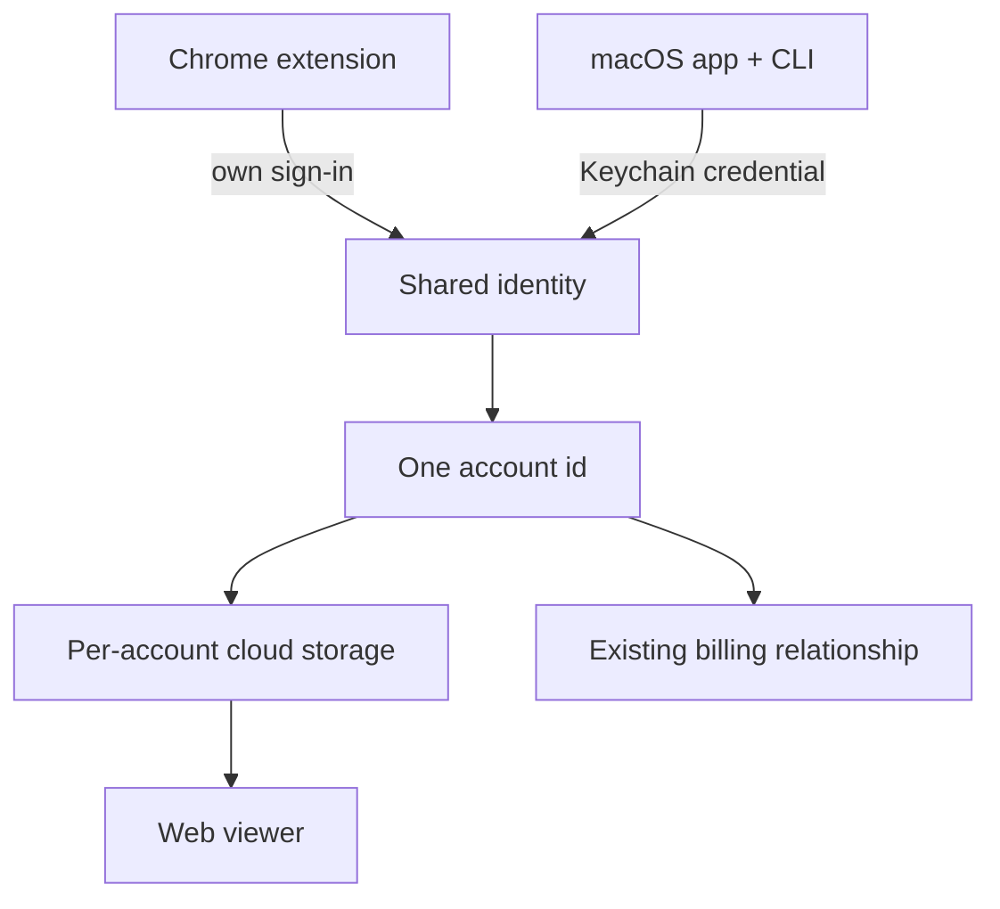
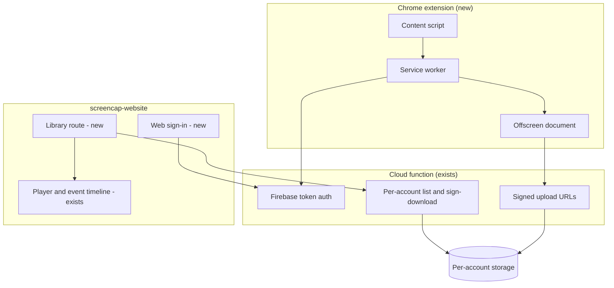

# Screencap Browser Tier (Chrome Extension) - Plan

## Goal Capsule

- **Objective:** Let someone record their browser work, and watch it back, without installing the macOS app — as a Screencap tier sharing one account with the existing product.
- **Repos:** This plan spans two. Units are marked `[screencap]` (this repo — the extension and the cloud function) or `[website]` (the `screencap-website` repo — sign-in and the recordings library). Paths inside a unit are relative to that unit's repo.
- **Product authority:** The Product Contract below governs behavior. The Planning Contract governs mechanism within it. This plan owns the capture extension, the web sign-in surface, and the recordings library. It does not own search, the agent-facing surface, or any change to how the macOS app records.
- **Execution profile:** Each implementation unit is sized to complete in one session and lands as its own commit or PR. Units declare their dependencies by U-ID; an executor picks any unit whose dependencies are satisfied.
- **Stop conditions:** Stop and surface rather than guessing when Chrome Web Store review rejects the permission set (U2), when the existing viewer cannot read a browser-tier recording without changing the macOS artifact contract (U5, U9), or when any change would alter how the macOS app captures or stores recordings.
- **Open blockers:** None.
- **Product Contract preservation:** changed — R11 flipped from an exclusion list to an opt-in allow-list, confirmed at plan scoping; see KTD2. Key Decision "Privacy comes from not capturing" and AE5 were re-pointed to match. All other Product Contract meaning and IDs are unchanged.

---

## Product Contract

### Summary

A Chrome extension records browser work as video plus a structured event stream and uploads it under the user's existing Screencap account. A new sign-in surface on the website lets that user list their recordings and play one back on a timeline of captured actions, not just a video scrubber. No macOS app install is required at any point.

### Problem Frame

Screencap today costs a lot to start using. A user downloads a DMG, clears a Developer ID gate, registers a background daemon through `SMAppService`, grants Screen Recording and Accessibility permissions, and enters an admin password before network capture works. Each step sheds people, and the helper-signature failure documented against the released DMG sheds some of them permanently.

That cost buys system-wide capture. But the persona named in `STRATEGY.md:22` — operators living in Salesforce, Looker, the data warehouse, and internal admin panels — does most of their work inside a browser tab, so a large share of what the install buys them is capability they never exercise.

The product already reaches into the browser from outside and does it poorly. `src/screencap/engine/window/ax_browser_url.py` walks the macOS Accessibility tree hunting for an address bar, browser family by browser family, and returns `None` on any failure — at which point the recording falls back to a `BROWSER_UNVERIFIED` classification. Inside a tab, that URL and far more is directly available.

One existing user has asked for the browser form, wants video and an online viewer, and has said cloud-only storage is acceptable to them. That is a single data point, and it pulls against the local-first positioning in `STRATEGY.md:10`, which names cloud upload as a competitor failure mode.

### Key Decisions

- **A Screencap tier, not a separate product.** (session-settled: user-directed — chosen over a standalone browser recorder with its own positioning: one account, one billing relationship, and an event stream that the eventual recall and agent surfaces can reuse.) Governs R5, R6.
- **Cloud-only storage for this tier.** A stated exception to local-first, scoped to browser-tier recordings; the macOS app's local-first posture is unchanged. Governs R6, R14.
- **Pin the data format, build thin around it.** (session-settled: user-directed — chosen over a throwaway thin vertical and over building full shared infrastructure now: the recording shape is the part that cannot be fixed retroactively, so it carries the design investment while the implementation stays minimal.) Governs R3, R16.
- **One account means one library.** (session-settled: user-directed — chosen over a browser-tier-only list: the viewer shows every cloud-stored recording on the account and labels each with the tier that produced it.) Governs R9.
- **Privacy comes from not capturing, not from masking afterward.** (session-settled: user-directed — chosen over post-hoc video masking and over uploading unmasked with disclosure: an origin outside the user's allow-list never enters the recording, which costs far less than masking video and matches the capture-time boundary `SECURITY.md` already documents.) Governs R11, R14.
- **Video and a structured event stream, not video alone.** The event stream is what makes the viewer a timeline rather than a player, and it is the substrate search and the agent surface will need. Governs R2, R3, R10.
- **Session-based record-and-share, not ambient always-on capture.** Matches what the requester asked for, and makes the source picker ordinary UX rather than added friction. Governs R1, R2.
- **The extension authenticates separately from the macOS app, against the same identity.** A Chrome extension cannot read the macOS Keychain credential; matching the account is what matters, not sharing the credential store. Governs R5, R7.



### Actors

- A1. Recording user — signs in, starts and stops recordings, watches them back. The only human actor in v1.
- A2. Chrome extension — captures video and events, uploads them.
- A3. Cloud backend — authenticates, stores recordings under the account, serves them back.
- A4. Web viewer — the signed-in page where recordings are listed and played.

### Requirements

**Capture**

- R1. A1 starts and stops a recording explicitly from the extension, and capture runs only between those two actions.
- R2. Each recording captures video of the source A1 selects when starting it.
- R3. Each recording captures a structured event stream alongside the video — navigations, clicks with the clicked element's visible label, form field identity, tab focus changes, and network request metadata — timestamped against the video timeline.
- R4. A recording is never lost silently; when capture or upload cannot complete, A1 is told.

**Identity and storage**

- R5. A1 signs in from the extension and resolves to the same account the macOS app and CLI would resolve them to.
- R6. Recordings upload into storage isolated per account.
- R7. A1 sees only their own recordings, in the extension and in the viewer.

**Viewer**

- R8. The website gains a sign-in surface; it has none today.
- R9. A signed-in A1 sees a list of every recording stored in the cloud under their account, labeled by which tier produced it, and can open one.
- R10. Playback presents the event stream as a timeline synchronized to the video, so A1 can jump to a captured action instead of only scrubbing.

**Privacy and control**

- R11. A1 maintains an allow-list of origins; capture records only allow-listed origins, and an origin outside the list is never captured.
- R12. Values entered into form fields are never captured; the field's identity may be, its contents may not.
- R13. While a recording is running, A1 can see that it is running and what source it is capturing.
- R14. Before A1's first upload, the product states plainly that video leaves the machine unmasked apart from the allow-list boundary in R11.
- R15. A1 can delete a recording, and deletion removes it from cloud storage.

**Data durability**

- R16. The event stream and stored recording shape are specified so that recordings captured by v1 remain usable by later search and agent surfaces without recapture.

### Key Flows

- F1. First recording
  - **Trigger:** A1 installs the extension and clicks record.
  - **Actors:** A1, A2, A3
  - **Steps:** Extension requires sign-in before capture; A1 authenticates and resolves to their account; A1 grants at least one origin and picks a capture source; capture runs; A1 stops it; video and events upload under the account.
  - **Outcome:** A1 has one recording stored against their account and a way to reach it.
  - **Covered by:** R1, R2, R3, R5, R6, R11, R14

- F2. Watching a recording back
  - **Trigger:** A1 opens the viewer.
  - **Actors:** A1, A4, A3
  - **Steps:** A1 signs in on the website; the viewer lists recordings belonging to that account; A1 opens one; video plays with the event timeline alongside it; A1 jumps to a captured action.
  - **Outcome:** A1 finds a specific moment without scrubbing the whole video.
  - **Covered by:** R7, R8, R9, R10

### Acceptance Examples

- AE1. Capture requires an account
  - **Covers R1, R5.**
  - **Given** A1 has installed the extension but has not signed in,
  - **When** A1 clicks record,
  - **Then** A1 is taken through sign-in, and no capture starts until it succeeds.

- AE2. Form values stay out of the recording
  - **Covers R3, R12.**
  - **Given** a recording is running,
  - **When** A1 types a password into a login form and submits it,
  - **Then** the event stream records that a field was filled and the form submitted, and contains none of the typed characters.

- AE3. Upload interrupted
  - **Covers R4, R6.**
  - **Given** A1 has stopped a recording and upload is in progress,
  - **When** the network drops before upload completes,
  - **Then** A1 is told the recording has not finished uploading, rather than seeing it appear as complete or disappear.

- AE4. An account that also uses the macOS app
  - **Covers R7, R9.**
  - **Given** A1 already records with the macOS app under the same account,
  - **When** A1 opens the viewer,
  - **Then** both tiers' cloud-stored recordings appear in one list, and each is labeled with the tier that produced it.

- AE5. A non-allow-listed origin during a recording
  - **Covers R11, R13.**
  - **Given** A1 has allow-listed one origin and a recording is running,
  - **When** A1 navigates to a different, non-allow-listed origin,
  - **Then** neither video nor events are captured for as long as it is in view, A1 can see that capture has paused, and the finished recording contains no frames of it.

### Scope Boundaries

**Deferred for later**

- Search over captured history, and the agent-facing surface over browser-tier recordings.
- Sharing: links, permissions, or any viewer who is not the recording user. The share-by-link infrastructure already exists (`scripts/cloud-function/shares.py`, `/v0/recording.share`) and is close to free to enable, which is why the exclusion is stated rather than assumed.
- Account management beyond sign-in — billing, settings, and org concepts stay where they are.
- Browsers other than Chrome.
- Ambient always-on capture.

**Outside this product's identity**

- A general screen recorder whose only output is a video file. The event stream is what makes this Screencap rather than a clip tool, and dropping it would leave a product with no path to search or agent use.
- Any companion mode that requires the macOS app to be installed. The premise of this tier is that nothing gets installed.

**Deferred to follow-up work**

- Backfilling the existing public dataset viewer to share the authenticated library's components. The two can diverge until a second consumer justifies the extraction.
- Any change to how the macOS app produces its recording artifacts. This plan conforms to that shape rather than negotiating with it.

### Dependencies / Assumptions

Verified against the codebase:

- Identity, per-account cloud storage, and the billing relationship already exist. `src/screencap/auth.py` runs Firebase auth over a loopback + PKCE flow to Google; `scripts/cloud-function/main.py` authenticates requests by Firebase bearer token and resolves them to a uid.
- Signed upload URLs already exist — `get_upload_urls` in `scripts/cloud-function/main.py` mints signed PUT URLs for an authenticated caller.
- Per-user listing and download already exist — `_handle_list` and `_handle_sign_download` in `scripts/cloud-function/main.py` operate over the caller's `users/{uid}/` prefix.
- The website has no login today. `src/screencap/auth.py:3` states that the macOS app and CLI are the only auth surface.
- The website already renders recordings: a video player, a virtualized event timeline that seeks the video, a transcript panel, and a recordings list, reading `recording.db` client-side through `sql.js`. Artifact categorization by filename lives in `src/app/_lib/types.ts` in the `screencap-website` repo.
- The macOS app action-gates capture rather than recording continuously — `RECORD_FULL_VIDEO` defaults to `False` in `src/screencap/engine/config.py:42`.

Verified externally:

- MV3 service workers cannot hold a `MediaRecorder`; the supported pattern is an offscreen document, which is DOM-enabled and stays alive while recording. Consuming a `chrome.tabCapture` stream ID inside an offscreen document requires Chrome 116 or later.
- Broad host permissions (`<all_urls>`, `*://*/*`) trigger in-depth Chrome Web Store review and are a common rejection cause; the published guidance is to request the narrowest permissions that implement the feature. Review times were extended as of April 2026.

Assumed and not yet verified — each is load-bearing:

- Firebase's web SDK can authenticate an extension and the website into the same project and resolve both to the uid the macOS app already uses.
- Chrome Web Store will approve the extension with optional per-origin permissions plus the capture permissions. The permission model is chosen to make this likely, not to guarantee it. **Correction (U3, SCR-308):** `desktopCapture` turned out to be unusable in this architecture and is not requested, so the review surface is one sensitive permission narrower than assumed here.
- Cloud cost per recording-hour is unmodeled. Video storage and egress for this tier have no budget attached.
- The requester matches the operator persona in `STRATEGY.md:22`. This rests on one user's request with little detail. If they turn out to be, for example, a Windows user, this becomes a platform-reach play and the scope shifts.
- Whether this tier stays a lane for people who cannot install the app, or becomes the primary surface with the macOS app as an upgrade path, is undecided. v1 is scoped so that answer can arrive later without invalidating what was already captured.

### Outstanding Questions

**Deferred to Planning**

- What the viewer shows for a macOS-tier entry with no playable video. `masked_video_upload` defaults to off, so some macOS recordings reach cloud storage as structured data with no video attached, and R9 puts them in the same list as browser-tier recordings that always have one. Settle in U9.
- Retention and eviction for browser-tier recordings. Settle in U10.

---

## Planning Contract

### Key Technical Decisions

- KTD1. **Video capture runs in an offscreen document, not the service worker.** MV3 service workers are suspended when idle and have no DOM, so `MediaRecorder` cannot live there; an offscreen document is the supported host. Governs R2.
- KTD2. **Origin access is an opt-in allow-list built on optional host permissions, not `<all_urls>`.** (session-settled: user-approved — chosen over a broad host permission plus an exclusion list: broad permissions are a documented Web Store rejection trigger, and per-origin grants satisfy the capture-time privacy boundary with the same mechanism.) Governs R11.
- KTD3. **The extension emits the same recording artifact shape the macOS app already produces.** (session-settled: user-approved — chosen over a browser-native format: the existing viewer reads that shape today, so conforming buys playback nearly free and keeps v1 recordings readable by later search.) Governs R3, R10, R16.
- KTD4. **Upload reuses the existing signed-PUT endpoint rather than a new one.** The endpoint already authenticates by Firebase token and writes under the caller's account prefix, which is exactly the requirement. Governs R6.
- KTD5. **The website's existing player and event timeline are reused; the new work is sign-in and an authenticated library route.** The components already do synchronized playback over this artifact shape. Governs R9, R10.
- KTD6. **Web and extension sign-in are separate Firebase sessions resolving to one account.** Neither surface can read the macOS Keychain credential, and neither needs to. Governs R5, R8.
- KTD7. **The authenticated library is a new route, not a mode on the public dataset page.** The dataset page is unauthenticated and serves a different namespace; branching it on auth state would couple two products. Governs R9.

### High-Level Technical Design

Component topology across the two repos and the existing cloud surface. Boxes marked new are what this plan builds.



Recording lifecycle, from click to playable artifact.

```mermaid
sequenceDiagram
  participant A1 as User
  participant SW as Service worker
  participant OFF as Offscreen doc
  participant CS as Content script
  participant GCS as Cloud storage
  A1->>SW: Start recording
  SW->>SW: Check sign-in and allow-list
  SW->>OFF: Open with capture stream id
  OFF->>OFF: MediaRecorder writes video
  CS->>SW: Interaction events while on allow-listed origin
  A1->>SW: Stop recording
  SW->>SW: Assemble artifact in shared shape
  SW->>GCS: Signed PUT per file
  SW->>A1: Report success or failure
```

### Sequencing

Two tracks run in parallel after U1. The capture track (U2–U6) and the web track (U7–U8) are independent until U9 joins them. U9 can be developed against a hand-uploaded fixture recording before U6 lands.

### Risks & Dependencies

- **Chrome Web Store rejection blocks the whole tier.** Nothing ships to a real user without approval, and screen-recording extensions with origin access draw in-depth review. KTD2's per-origin permission model is the mitigation. Submit a review-only build early — before U4 and U5 are complete — so a rejection arrives while the permission model is still cheap to change.
- **Browser events may not map onto the macOS event shape.** KTD3 assumes conformance is possible; if browser interactions cannot be expressed in the tables the viewer reads, U5 either distorts the data to fit or U9 needs a separate playback path. Prove the mapping on one event type in U4 before building the rest of the schema.
- **Cloud cost is unmodeled and this tier uploads video by default.** The macOS tier is local-first, so browser-tier storage and egress are a new cost class with no budget. Size it before general availability, not before the first recording.
- **Firebase multi-surface identity is assumed, not verified.** U1 and U7 both rest on the same project resolving extension and web sessions to the existing uid. U1 verifies it first; treat a mismatch as a stop condition rather than minting a parallel identity.

### System-Wide Impact

- **Auth surface count goes from one to three.** `src/screencap/auth.py:3` currently records the macOS app and CLI as the only auth surface. This plan adds two more against the same identity, and that comment becomes wrong when U7 lands — correct it there.
- **A cloud-only data class enters a local-first product.** Browser-tier recordings have no local copy and no encrypted container, unlike everything the macOS app stores. `SECURITY.md` should gain a browser-tier section describing this boundary; the local-first claims in it are otherwise no longer complete.
- **Privacy enforcement moves from bundle-and-title classification to origin grants.** The macOS path classifies apps and windows; the browser path uses Chrome's permission grants as the boundary. Both are capture-time, but they are different mechanisms with different failure modes, and the privacy documentation should say so rather than implying one model covers both.

---

## Implementation Units

Each unit is sized for one session and tracked as its own Linear issue.

| U-ID | Issue | Title | Repo | Key paths | Depends on |
|---|---|---|---|---|---|
| U1 | SCR-305 | Extension scaffold and account sign-in | screencap | `extension/` | — |
| U2 | SCR-307 | Origin allow-list and per-origin grants | screencap | `extension/src/permissions/` | U1 |
| U3 | SCR-308 | Video capture with a recording indicator | screencap | `extension/src/capture/` | U1 |
| U4 | SCR-310 | Structured interaction event stream | screencap | `extension/src/events/` | U2 |
| U5 | SCR-313 | Recording artifact assembly | screencap | `extension/src/artifact/` | U3, U4 |
| U6 | SCR-314 | Authenticated upload with disclosure | screencap | `extension/src/upload/` | U5 |
| U7 | SCR-306 | Firebase sign-in on the website | website | `src/app/(auth)/` | — |
| U8 | SCR-309 | Authenticated recordings library | website | `src/app/library/`, `src/app/api/library/` | U7 |
| U9 | SCR-311 | Browser-tier playback and tier labeling | website | `src/app/_components/viewer/` | U8 |
| U10 | SCR-312 | Recording deletion | website, screencap | `src/app/api/library/`, `scripts/cloud-function/main.py` | U8 |

### U1. Extension scaffold and account sign-in

- **Goal:** An installable MV3 extension that signs a user into their existing Screencap account and shows who they are.
- **Requirements:** R5. Advances AE1.
- **Dependencies:** none
- **Repo:** screencap
- **Files:** `extension/manifest.json`, `extension/src/background/service-worker.ts`, `extension/src/auth/firebase.ts`, `extension/src/popup/`, `extension/vitest.config.ts`, `extension/src/auth/firebase.test.ts`
- **Approach:**
  1. Scaffold an MV3 extension under a new top-level `extension/` directory with its own package manifest and build; use vitest to match the toolchain the website already uses.
  2. Implement sign-in against the same Firebase project the macOS app uses, resolving to the same uid. Do not attempt to read or share the macOS Keychain credential — per KTD6 the credential stores are separate by design.
  3. Store the refresh credential in extension storage and refresh the ID token ahead of expiry, mirroring the transparent-refresh behavior in `src/screencap/auth.py`.
  4. Popup shows signed-out and signed-in states, with the account identity visible when signed in.
- **Patterns to follow:** `src/screencap/auth.py` for the token lifecycle and the provisioned-credential pattern (client id and API key injected at build, not hardcoded per developer).
- **Test scenarios:**
  - Signed-out popup offers sign-in and shows no account identity.
  - A successful sign-in surfaces the account identity in the popup.
  - An expired ID token refreshes transparently without a second interactive sign-in.
  - A refresh failure surfaces as signed-out rather than a silent broken state.
  - Sign-out clears the stored credential so a reopened popup shows signed-out.
- **Verification:** The extension loads unpacked in Chrome, a user signs in, and the resolved account matches what `screencap whoami` reports for the same person on a machine with the CLI installed.

### U2. Origin allow-list and per-origin grants

- **Goal:** A user chooses which origins may ever be recorded, backed by Chrome's optional permission grants.
- **Requirements:** R11. Advances AE5.
- **Dependencies:** U1
- **Repo:** screencap
- **Files:** `extension/manifest.json`, `extension/src/permissions/allowlist.ts`, `extension/src/popup/AllowlistPanel.tsx`, `extension/src/permissions/allowlist.test.ts`
- **Approach:**
  1. Declare optional host permissions rather than a broad host permission, per KTD2, and no blanket origin access. **Correction (U3, SCR-308):** `desktopCapture` is not requested at all — its stream ids cannot be consumed inside an offscreen document, so whole-screen capture uses the web-standard display picker instead. The capture permissions (`offscreen`, `tabCapture`, `unlimitedStorage`, `activeTab`) are declared by U3, which exercises them.
  2. Adding an origin to the allow-list triggers a runtime permission request for that origin; revoking removes both the list entry and the grant, so the stored list and Chrome's grant state cannot drift apart.
  3. Expose the current allow-list in the popup with add and remove, and treat Chrome's grant state as the source of truth on read.
- **Patterns to follow:** the fail-closed posture in `src/screencap/privacy/policy.py` — an origin whose state cannot be determined is treated as not allowed.
- **Test scenarios:**
  - Adding an origin requests the matching host permission and records the entry only when the grant succeeds.
  - Declining the Chrome permission prompt leaves the allow-list unchanged.
  - Removing an origin revokes the host permission as well as the list entry.
  - An origin whose grant was revoked outside the extension reads as not allowed.
  - An empty allow-list reports that no origin can be recorded yet.
- **Verification:** Chrome's extension details page shows site access only for allow-listed origins, and the popup list matches it after an out-of-band revoke.

### U3. Video capture with a recording indicator

- **Goal:** A user starts and stops a recording and gets a video file of the source they chose.
- **Requirements:** R1, R2, R13.
- **Dependencies:** U1
- **Repo:** screencap
- **Files:** `extension/src/capture/offscreen.html`, `extension/src/capture/recorder.ts`, `extension/src/background/capture-controller.ts`, `extension/src/capture/recorder.test.ts`
- **Approach:**
  1. The service worker obtains a capture stream id and opens an offscreen document that owns the `MediaRecorder`, per KTD1. The service worker never holds the media stream.
  2. Support tab capture and whole-screen capture through the source picker; the user chooses at start.
  3. Surface a running-state indicator that names the captured source, and keep it accurate across service-worker suspension by deriving it from stored state rather than in-memory flags.
  4. Stopping releases the stream, closes the offscreen document, and hands the recorded blob to the caller.
- **Execution note:** Service-worker suspension mid-recording is the failure mode worth proving first — write that test before the happy path.
- **Test scenarios:**
  - Starting a recording opens exactly one offscreen document and begins recording.
  - Stopping produces a non-empty video blob and closes the offscreen document.
  - The indicator reports the running state and source correctly after the service worker is suspended and revived.
  - Starting a second recording while one is running is refused rather than silently replacing it.
  - The user cancelling the source picker leaves no offscreen document open and no recording started.
- **Verification:** A recording started, held across a service-worker restart, and stopped yields a video that plays start to finish with no gap at the restart point.

### U4. Structured interaction event stream

- **Goal:** Interactions on allow-listed origins are recorded as a structured, timestamped event stream.
- **Requirements:** R3, R12. Advances AE2, AE5.
- **Dependencies:** U2
- **Repo:** screencap
- **Files:** `extension/src/events/content-script.ts`, `extension/src/events/schema.ts`, `extension/src/events/collector.ts`, `extension/src/events/content-script.test.ts`
- **Approach:**
  1. Define the event schema first — it is the artifact this plan is least able to change later, per KTD3. Cover navigation, click with the target element's visible label, form field identity, tab focus change, and network request metadata.
  2. Capture the field's identity but never its value, per R12. The value must not be readable anywhere in the pipeline, not merely dropped before upload.
  3. Timestamp every event against the recording clock established in U3, so the viewer can seek.
  4. The content script only runs on allow-listed origins; leaving one stops event collection until an allow-listed origin is in view again.
- **Execution note:** Write the form-value exclusion test before the collector — a leak here is the one defect that cannot be walked back after recordings exist.
- **Test scenarios:**
  - Covers AE2. A filled and submitted password field yields a field-identity event containing none of the typed characters.
  - A click records the target element's visible label and a stable selector.
  - Navigation within an allow-listed origin records a navigation event with the URL.
  - Covers AE5. Navigating to a non-allow-listed origin stops event collection, and no event carries that origin.
  - Event timestamps align to the recording clock such that ordering matches the video.
  - A page with no interactions produces an empty stream rather than an error.
- **Verification:** A scripted browsing session over an allow-listed origin produces an event stream whose ordering and timestamps match the recorded video, with no form values present anywhere in it.

### U5. Recording artifact assembly

- **Goal:** A finished recording is assembled into the same artifact shape the macOS app produces.
- **Requirements:** R16. Advances R10.
- **Dependencies:** U3, U4
- **Repo:** screencap
- **Files:** `extension/src/artifact/assemble.ts`, `extension/src/artifact/schema.ts`, `extension/src/artifact/assemble.test.ts`
- **Approach:**
  1. Read the macOS artifact contract from what the viewer already consumes — filename-based categorization lives in `src/app/_lib/types.ts` in the `screencap-website` repo, and the event tables live in the recording database the viewer opens client-side.
  2. Emit the video and the event stream under filenames that categorization already recognizes, so U9 needs no new artifact branch.
  3. Where the browser cannot produce a field the macOS shape carries, omit it rather than inventing a placeholder, and record the omission in the artifact so a later consumer can tell absent from empty.
- **Patterns to follow:** `src/screencap/engine/convert.py` for how window and event rows are shaped on export.
- **Test scenarios:**
  - An assembled artifact's filenames categorize into video and events under the existing rules.
  - The event table round-trips through the artifact without losing ordering or timestamps.
  - A recording with zero events still assembles into a valid artifact.
  - Fields the browser cannot supply are marked absent rather than written as empty values.
  - Assembly is deterministic — the same capture input produces byte-identical output.
- **Verification:** An artifact produced by the extension loads in the existing website viewer without changes to the viewer.

### U6. Authenticated upload with disclosure

- **Goal:** A finished recording uploads under the user's account, and the user is told what leaves their machine before the first one does.
- **Requirements:** R4, R6, R14. Advances AE3.
- **Dependencies:** U5
- **Repo:** screencap
- **Files:** `extension/src/upload/uploader.ts`, `extension/src/upload/disclosure.tsx`, `extension/src/upload/uploader.test.ts`, `scripts/cloud-function/test_main.py`
- **Approach:**
  1. Request signed PUT URLs from the existing upload endpoint with the user's Firebase token and PUT each artifact file, per KTD4. Extend the cloud function only if the browser tier needs a field the endpoint does not already accept.
  2. Show the disclosure required by R14 before the first upload of the account's lifetime, not on every recording.
  3. Report interrupted uploads to the user and leave the recording recoverable rather than presenting it as complete, per R4.
- **Test scenarios:**
  - Covers AE3. A network failure mid-upload surfaces an incomplete state to the user and does not mark the recording uploaded.
  - A successful upload places every artifact file under the caller's account prefix.
  - The disclosure appears before the first upload and not before subsequent ones.
  - An expired token refreshes and the upload proceeds without user action.
  - An upload attempted while signed out is refused before any bytes are sent.
- **Verification:** After a successful upload, the account's per-user listing endpoint returns the new recording with all expected files.

### U7. Firebase sign-in on the website

- **Goal:** A person can sign in on the website with the same account the macOS app and extension use.
- **Requirements:** R8. Advances R5.
- **Dependencies:** none
- **Repo:** website
- **Files:** `src/app/(auth)/sign-in/page.tsx`, `src/app/_lib/auth.ts`, `src/app/_lib/auth.test.ts`, `src/app/_components/AuthNav.tsx`
- **Approach:**
  1. Add Firebase web authentication against the same project, per KTD6. This is the first authentication surface on the website; `src/screencap/auth.py:3` currently records that no such surface exists, and that note should be corrected when this lands.
  2. Session state is available to server components so the library route in U8 can authorize server-side rather than trusting the client.
  3. Signed-in state is visible in the site navigation; the public pages stay reachable signed-out.
- **Test scenarios:**
  - A signed-out visitor reaching a protected route is redirected to sign-in.
  - A successful sign-in establishes a session readable by a server component.
  - Sign-out clears the session and returns the visitor to public pages.
  - Public pages including the existing dataset page render unchanged while signed out.
  - An expired session refreshes or degrades to signed-out rather than erroring.
- **Verification:** Signing in on the website and running `screencap whoami` on a machine with the CLI resolves to the same account.

### U8. Authenticated recordings library

- **Goal:** A signed-in user sees every cloud-stored recording on their account, labeled by tier.
- **Requirements:** R7, R9. Advances AE4.
- **Dependencies:** U7
- **Repo:** website
- **Files:** `src/app/library/page.tsx`, `src/app/api/library/route.ts`, `src/app/_lib/library.ts`, `src/app/api/library/route.test.ts`
- **Approach:**
  1. Add a route distinct from the public dataset page, per KTD7. Reuse the existing recordings-list presentation; do not branch the dataset page on auth state.
  2. Back the route with the cloud function's existing per-account list and sign-download handlers, passing the caller's token. Authorization happens server-side.
  3. Derive the tier label from the artifact rather than from a user-supplied field, so a recording cannot misreport its origin.
- **Test scenarios:**
  - A signed-in request lists only recordings under the caller's account.
  - A signed-out request to the library API is refused.
  - Recordings from both tiers appear in one list with correct tier labels.
  - An account with no recordings renders an empty state rather than an error.
  - An upstream listing failure surfaces as an error state rather than an empty list, which would read as "you have no recordings".
- **Verification:** Two accounts with different recordings each see only their own, and a browser-tier and macOS-tier recording on one account both appear correctly labeled.

### U9. Browser-tier playback and tier labeling

- **Goal:** A browser-tier recording plays back with its event timeline in the existing viewer.
- **Requirements:** R10. Advances AE4.
- **Dependencies:** U8
- **Repo:** website
- **Files:** `src/app/_components/viewer/DatasetDetail.tsx`, `src/app/_lib/types.ts`, `src/app/_components/viewer/EventRow.tsx`, `src/app/_components/viewer/DatasetDetail.test.tsx`
- **Approach:**
  1. Feed browser-tier artifacts through the existing player and event timeline, per KTD5. If U5 conformed correctly this is wiring, not new playback code — a need for a separate playback path is a signal to revisit U5 rather than to branch here.
  2. Render browser-tier event types in the timeline rows, which today expect macOS-shaped events.
  3. Settle the open question from the Product Contract: decide and implement what a macOS-tier entry with no playable video shows, given `masked_video_upload` defaults to off.
- **Test scenarios:**
  - A browser-tier recording renders video and a seekable event timeline.
  - Clicking a browser-tier event seeks the video to that moment.
  - A macOS-tier entry with no video renders its decided no-video state rather than a broken player.
  - Browser-tier event types render with readable labels rather than raw type names.
  - A recording whose event stream fails to load shows the video with an error on the timeline, not a blank page.
- **Verification:** A recording captured by the extension in U3–U6 plays end to end in the library with its timeline, and clicking an event seeks correctly.

### U10. Recording deletion

- **Goal:** A user deletes a recording and it is gone from cloud storage.
- **Requirements:** R15.
- **Dependencies:** U8
- **Repo:** website, screencap
- **Files:** `src/app/api/library/[name]/route.ts`, `src/app/_components/viewer/DatasetList.tsx`, `scripts/cloud-function/main.py`, `scripts/cloud-function/test_main.py`
- **Approach:**
  1. Add an authenticated delete handler to the cloud function scoped to the caller's account prefix, and surface it from the library.
  2. Deletion removes every artifact file for that recording, not just the entry that made it visible.
  3. Settle the retention question from the Product Contract: decide whether browser-tier recordings expire on a schedule, and record the decision here even if the answer is "no automatic expiry in v1".
- **Test scenarios:**
  - Deleting a recording removes all of its artifact files from storage.
  - A delete request for a recording on another account is refused.
  - A partially failed delete reports failure rather than removing the entry from the list.
  - The list reflects the deletion without a full page reload.
  - Deleting a recording that is already gone succeeds rather than erroring.
- **Verification:** After deletion, the per-account listing no longer returns the recording and its files are absent from storage.

---

## Verification Contract

| Scope | Command | Applies to |
|---|---|---|
| Python tests | `pytest tests/` | U10 |
| Privacy lane | `pytest -m privacy` | any unit changing Python privacy behavior — none in the capture track as scoped |
| Engine lint | `ruff check src/screencap/engine/` | any unit touching `src/screencap/engine/` |
| Cloud function tests | `pytest scripts/cloud-function/` | U6, U10 |
| Extension tests + type-check | `npm test` and `npm run typecheck` in `extension/` | U1–U6 |
| Website tests | `npm test` in the `screencap-website` repo | U7–U10 |
| Website lint and build | `npm run lint && npm run build` in the `screencap-website` repo | U7–U10 |

**Corrected during U2 (SCR-307).** The privacy lane originally listed U2 and U4, and `pytest tests/` listed U6. All three are implemented entirely in TypeScript under `extension/`, so `pytest` has nothing to collect for them and the rows could never have passed. The capture track's privacy-bearing behavior — the allow-list boundary and event capture — is proven by the extension suite instead, which U2 put on CI as the `Extension tests (Node)` job in `.github/workflows/ci.yml`. That job also runs `typecheck`, because `vitest` does not type-check.

The privacy lane still applies to any unit that changes Python privacy behavior; CI runs `pytest -m privacy` as its gate, so a privacy-bearing Python test that is not marked never runs there.

---

## Definition of Done

Global:

- Every requirement R1–R16 is either implemented by a unit or explicitly deferred in Scope Boundaries.
- The five acceptance examples pass as automated tests.
- No form field value appears anywhere in a captured artifact.
- A recording captured by the extension plays back in the website library with its event timeline.
- The macOS app's capture and storage behavior is unchanged; no unit modifies how it records.
- Code from approaches that did not work out is removed, not left in the diff behind a flag.

Per unit: the unit's test scenarios pass, its verification statement holds, and the Verification Contract rows that apply to it are green.
