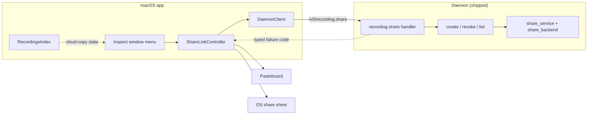
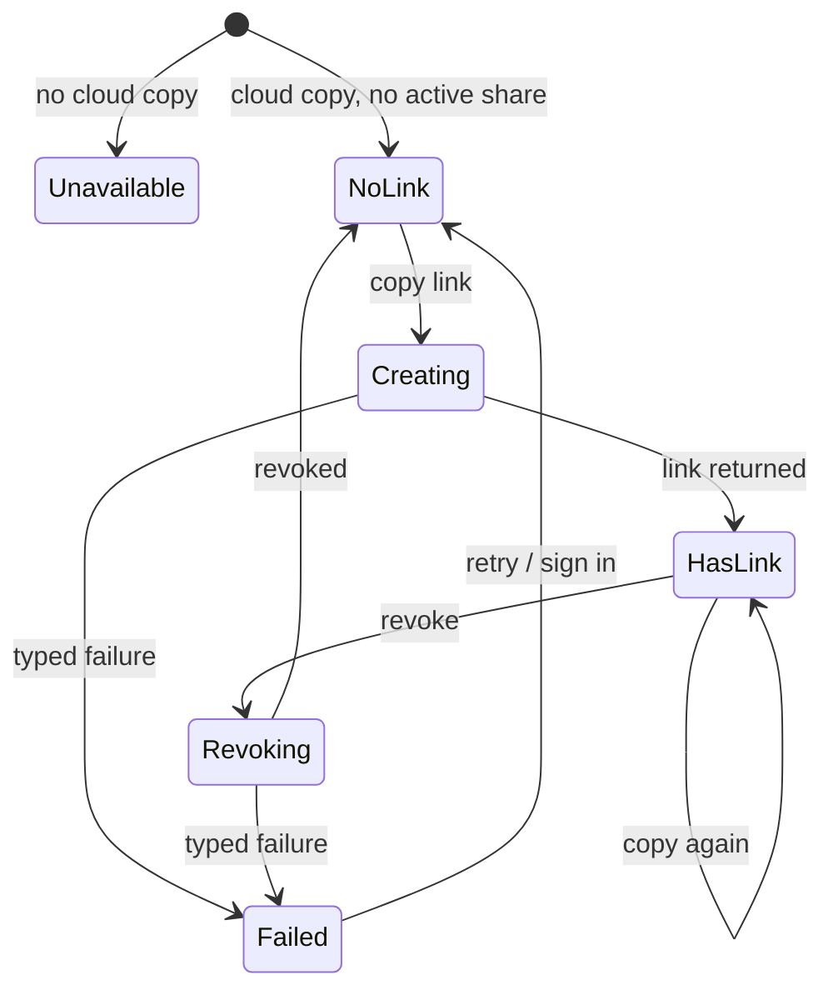

# macOS Inspect Share Affordance - Plan

## Goal Capsule

- **Objective:** Let a cloud user copy and revoke a per-recording share link from the Inspect window, without dropping to Terminal. Implements U7 of the share-by-link plan (see origin: `docs/plans/2026-07-21-001-feat-personal-cloud-share-by-link-plan.md`), tracked as SCR-299.
- **Product authority:** Rute Figueiredo (owner). The origin plan's Product Contract is authoritative for share semantics; this plan adds only the macOS surface and the failure vocabulary it needs.
- **Execution profile:** Standard. One Python unit (typed daemon failure codes), four Swift units. Single repo.
- **Stop conditions:** Surface a blocker rather than guess if the share verb's real-world latency makes a synchronous request untenable (the fallback is an event-driven verb, which is a larger change than this plan scopes). Do not widen into the share crypto, cloud functions, or the browser viewer.
- **Tail ownership:** Standard PR + CI. Land after SCR-300 (the `/share/[token]` viewer) merges — see Risks.

---

## Product Contract

### Summary

Extend the Inspect window's existing "Share / Upload…" toolbar affordance into a menu that also copies and revokes a share link. Swift reaches the already-shipped `/v0/recording.share` daemon verb through the typed daemon client rather than shelling the CLI, and a small Python change gives that verb typed failure codes so the app can offer the right recovery instead of one generic error.

### Problem Frame

The share-by-link backend shipped at `57cd6978` (app `macos-app-v0.21.0`, embedded daemon 0.31.0): `share_crypto.py`, `share_backend.py`, and `share_service.py` carry the crypto and orchestration; `/v0/recording.share` is registered at `src/screencap/daemon/app.py:5367`; and `screencap share create|revoke|list` shipped at `src/screencap/cli/__init__.py:2086`. None of it has a Swift caller — `grep -rn 'recording\.share' macos/` returns nothing. A user can only mint a link from a terminal.

`macos/Screencap/Views/Shared/ShareServicePresenter.swift` already exists but is unrelated to this: it presents the OS sharing picker for an already-cut local clip file, and its doc comment states upload-share is deliberately excluded from it. It is a reuse target here, not an existing implementation.

### Key Decisions

Carried from origin, unchanged:

- KD2. Sharing is cloud-gated — a "This Mac only" recording has no server copy to link to.
- KD4. The link is E2EE with the key in the URL fragment. The server never sees the key or the plaintext.

### Requirements

Carried from origin (unchanged meaning, original IDs):

- R1. A cloud user can generate a share link for a single recording they own.
- R4. The owner can revoke a link; after revocation the server stops serving the ciphertext. Revocation cannot retract a copy a recipient already downloaded, and the UI must not imply otherwise.
- R7. The share UI is truthful about the link's security model: the shared copy is end-to-end encrypted, and the link itself carries the key, so anyone holding it can decrypt. It must not imply per-recipient access control the model does not provide.

New, plan-local to the macOS surface (numbered from the origin's next unused ID):

- R11. The share-link affordance is offered only for a recording that has a cloud copy. It is visibly unavailable — not silently failing — for local-only recordings.
- R12. A user creates and revokes a share link entirely within the app.
- R13. A failed share names the user's next step. A signed-out user is told to sign in and offered that action; a transient failure offers a retry.
- R14. The window shows whether the recording has an active link created on this Mac, so revoke is offered only when there is something this Mac can revoke. It must not imply knowledge of links minted on another Mac.

### Key Flows

- F1. Create and share. **Trigger:** owner picks the copy action on a cloud recording. **Steps:** the app produces the link, places it on the pasteboard, and states the link's security model. **Covered by:** R1, R7, R12.
- F3. Revoke. **Trigger:** owner picks revoke on a recording with an active link. **Steps:** the server stops serving the ciphertext; the affordance stops offering revoke and states that already-downloaded copies persist. **Covered by:** R4, R14.

### Acceptance Examples

- AE3. Local-only recording. **Covers R11, KD2.** **Given** a recording with no cloud copy, **when** the user opens Inspect, **then** the share-link actions are unavailable rather than present-and-failing.
- AE5. Copy. **Covers R1, R7, R12.** **Given** a cloud recording, **when** the user picks the copy action, **then** the pasteboard holds a link carrying the key in its URL fragment, and the window states that the link carries the key and the view is view-only.
- AE6. Revoke reflects state. **Covers R4, R14.** **Given** a recording with an active link, **when** the user revokes it, **then** revoke is no longer offered for that recording and the window states that already-downloaded copies cannot be retracted.
- AE7. Signed out. **Covers R13.** **Given** a signed-out user, **when** they attempt to copy a link, **then** the window tells them to sign in and offers that action, rather than an undifferentiated failure.

### Scope Boundaries

#### Deferred to Follow-Up Work

- A share-management surface outside Inspect (a list of every link created on this Mac, with bulk revoke). `screencap share list` covers this need for now.
- Per-share expiry override in the UI. The daemon verb accepts it; the affordance uses the configured default.

#### Outside this plan

- Share crypto, the share-scoped GCS path, and the create/resolve/revoke cloud functions — all shipped.
- The `/share/[token]` browser viewer and its WebCrypto decryptor — SCR-300, sibling repo `screencap-website`.
- Entitlement gating UI. The cloud function enforces it server-side; this plan surfaces the resulting failure honestly rather than pre-gating on tier.
- `show_on_website` ambient visibility — untouched (origin KTD5).

### Dependencies / Assumptions

- **Blocked by SCR-300.** Until the viewer lands, a copied link resolves to nothing. SCR-300 is In Review with an open PR; this plan sequences behind it rather than shipping behind a flag.
- A1 (origin). Sharing requires a paid cloud entitlement. Enforced server-side by `create-share`; the app surfaces the refusal.
- A2 (origin). Revoke and expiry mean the server stops serving the copy. Neither retracts a copy a recipient already fetched.
- A5 (origin). The link is the secret — whoever obtains it can decrypt.
- The Inspect window already receives the recordings index via `.environmentObject` (`macos/Screencap/ScreencapApp.swift:160-168`), so upload state is reachable without new plumbing.

### Sources / Research

- Origin plan U7 and its Product Contract: `docs/plans/2026-07-21-001-feat-personal-cloud-share-by-link-plan.md`.
- Daemon verb: handler `recording_share` and the blocking op `_run_share_op` in `src/screencap/daemon/app.py`; route registered alongside `recording.rename`. Request/response models at `src/screencap/daemon/schema.py:520-543` — one response model backs all three ops, with unused fields null.
- Swift daemon-client template: `RecordingRenameRequest` / `RecordingRenameResponse` and `recordingRename` in `macos/Screencap/Controllers/DaemonClient.swift`; test template `macos/ScreencapTests/DaemonClientRenameTests.swift`.
- Error-copy discipline: `AccountErrorCopy` in `macos/Screencap/Controllers/CloudAuthController.swift` — a pure enum keyed on the machine-readable `code`, every message a static literal so backend text can never reach rendered copy.
- Pure-predicate precedent on the recordings model: `isUploadEligible` and `isClippable` in `macos/Screencap/Models/RecordingSummary.swift`.
- Existing Inspect affordance and its pure enablement rule: `InspectShareAffordance` and `shareToolbarItem` in `macos/Screencap/Views/Inspect/InspectWindow.swift`; test in `macos/ScreencapTests/InspectWindowOpenerTests.swift`.
- Local share record: `record_local_share` / `list_local_shares` / `mark_local_revoked` in `src/screencap/share_backend.py`, a JSON file keyed by token and carrying the recording's directory name.
- Auth failure surface: `NotSignedIn` propagates out of `auth.authed_post` (`src/screencap/auth.py`), so the daemon can distinguish it today.
- Typed daemon error precedent: `DaemonAPIError` in `src/screencap/daemon/errors.py`; a typed raise in a handler at `src/screencap/daemon/app.py:4792-4805`.
- XcodeGen staleness is already handled by the build script's source-tree freshness check: `docs/solutions/build-errors/xcodegen-stale-project-missing-new-sources.md`.

---

## Planning Contract

**Product Contract preservation:** origin R1/R4/R7, KD2/KD4, F1/F3, AE3, A1/A2/A5 carried unchanged. R11-R14 and AE5-AE7 are new, numbered from the origin's next unused IDs so cross-references stay unambiguous. One origin approach statement is superseded — see KTD1.

### Key Technical Decisions

- KTD1. Swift reaches `/v0/recording.share` through the typed daemon client; no `screencap share create` shell-out. This supersedes the origin U7 approach line, which predates the verb being registered. `recordingRename` is the exact template — same trust boundary, same envelope shape — and shelling the CLI would add a process hop plus an untyped stderr surface that KTD2 then has to parse back into codes. Consistent with origin KTD3, which makes CLI and app peer thin clients of the verb. Governs R12.
- KTD2. The share verb returns typed failure codes, and the app's copy keys on the code rather than message text. Today every failure — signed out, nothing uploaded, network — collapses into the generic internal-error envelope, because `_run_share_op` raises plain `ShareError` / `ValueError` and the handler's catch-all converts them. `NotSignedIn` already propagates distinctly out of the auth layer, so the mapping exists to be made. *(session-settled: user-approved — chosen over a macOS-only generic failure message: a signed-out user is the likeliest failure and deserves a sign-in action, and the existing account error mapper already forbids rendering backend text.)* Governs R13.
- KTD3. Share eligibility is a pure predicate on the recordings model, alongside `isUploadEligible` and `isClippable`, read from the recordings index the Inspect window already receives. A recording is shareable when it has a cloud copy — a share reads that copy, so local eviction is irrelevant and the stub state must not disqualify it. Keeping the rule on the model rather than in the view means the affordance and any future consumer share one definition. Governs R11.
- KTD4. Active-share state is derived from the verb's list op, filtered to this recording. The daemon's local share record is the only place a token is recoverable, and revoke needs a token. A share counts as active when it is neither marked revoked nor past its expiry. That record is per-Mac, so a link minted on another Mac is invisible here and cannot be revoked from this window — R14 is scoped to match, and the copy must not overstate it. Governs R4, R14.
- KTD5. Copy to pasteboard is the primary action; the OS share sheet is a secondary path reusing the existing presenter. The presenter already takes a URL binding, so the second delivery path costs almost nothing. Its doc comment's "upload-share is excluded" boundary needs correcting: a share *link* is not an upload, and leaving the comment as-is would read as a violated invariant. *(session-settled: user-approved — chosen over clipboard-only, which meets the acceptance criterion with a smaller surface but leaves the user to find their own delivery path.)* Governs R1, R12.
- KTD6. The create call uses a generous client timeout and an in-flight UI state. The verb synchronously fetches the masked cloud copy, re-encrypts it, and uploads it, so it is unbounded in a way rename is not; the daemon client's default short timeout would abort a legitimate long share. Revoke and list stay on the default. Governs R12.
- KTD7. No feature flag. The affordance sequences behind SCR-300 landing. A flag would add a config surface and a dead code path for a dependency already in review.

### High-Level Technical Design

Call path — the app is a thin client over the shipped verb, and nothing in the share spine changes:

Affordance state — what the menu offers is a function of eligibility plus current share state:

### Sequencing

U1 (typed codes) is independent and can land first. U2 depends on U1 for the codes its decoding tests assert. U3 is pure and independent of U2. U4 composes U2 and U3. U5 consumes U4.

---

## Implementation Units

### U1. Typed failure codes for the share verb

- **Goal:** Give `/v0/recording.share` machine-readable failure codes so a client can distinguish signed-out, nothing-to-share, and transient failures.
- **Requirements:** R13; KTD2.
- **Dependencies:** none.
- **Files:** `src/screencap/daemon/errors.py`, `src/screencap/daemon/app.py` (`_run_share_op`, `recording_share`), `tests/test_daemon_recording_share.py`.
- **Approach:**
  1. Add a share error type to `errors.py` following the existing `DaemonAPIError` subclass shape, carrying the code and an appropriate 4xx status.
  2. In `_run_share_op`, distinguish the cases the layer already has in hand: `auth.NotSignedIn` propagating out of the backend, the empty-masked-artifacts `ShareError` that means the recording has no cloud copy to share, and transport failures from the `requests` calls. Leave anything unrecognized on the existing internal-error path.
  3. In `recording_share`, let the typed error reach the existing `DaemonAPIError` branch rather than the catch-all, so the envelope carries the code.
  4. Leave the audit-log call untouched — it records peer and outcome only, never the token or key, and that exclusion must survive this change.
- **Patterns to follow:** the typed raise at `src/screencap/daemon/app.py:4792-4805`; `DaemonAPIError` subclassing in `src/screencap/daemon/errors.py:238-263`.
- **Execution note:** the code vocabulary is a cross-boundary contract that U2 and U4 both key on. Fix the codes here first, test-first, before any Swift consumes them.
- **Test scenarios:**
  - A signed-out create returns the signed-out code, not the generic internal-error code.
  - A create for a recording with no masked artifacts returns the nothing-to-share code. This is defense in depth, not what satisfies AE3 — U3 and U5 keep the action unavailable so a user never reaches this path.
  - A transport failure during create returns the transient code.
  - An unrecognized internal exception still returns the generic internal-error code — the catch-all is narrowed, not removed.
  - Revoke surfaces the same typed vocabulary as create for signed-out and transport failures.
  - The audit-log entry for every failing path records outcome only, with no token and no share key. Covers the origin's key-confidentiality invariant.
- **Verification:** each failure mode returns its own code, the generic path still catches the unexpected, and no failing path logs a token or key.

### U2. Swift daemon-client binding for `recording.share`

- **Goal:** Expose the share verb to Swift as a typed daemon-client call.
- **Requirements:** R12; KTD1, KTD6.
- **Dependencies:** U1.
- **Files:** `macos/Screencap/Controllers/DaemonClient.swift`, `macos/ScreencapTests/DaemonClientShareTests.swift` (new).
- **Approach:**
  1. Add request and response types mirroring the daemon's op-discriminated models. The single response model backs all three ops, so every payload field is optional and each op's caller reads only the fields its op populates.
  2. Add the verb function next to `recordingRename`, taking the op and its op-specific arguments.
  3. Give create the generous timeout from KTD6; leave revoke and list on the default.
  4. Surface the daemon's typed codes through the existing envelope-error case so U4 can key on them without parsing text.
- **Patterns to follow:** `RecordingRenameRequest` / `RecordingRenameResponse` / `recordingRename` in `macos/Screencap/Controllers/DaemonClient.swift`; the socket-fake test harness in `macos/ScreencapTests/DaemonClientRenameTests.swift`.
- **Test scenarios:**
  - A create response decodes the link, token, and expiry; the revoke-only and list-only fields decode as absent rather than failing.
  - A revoke response decodes without requiring the create-only fields.
  - A list response decodes an empty share array and a populated one.
  - A typed failure envelope surfaces as an envelope error carrying U1's code verbatim.
  - An unreachable socket surfaces as the transport-unavailable error, not a decode failure.
  - A create whose response arrives later than the client's default timeout still succeeds, proving create carries the longer bound rather than inheriting the default.
- **Verification:** every op round-trips against the fake socket, and a typed daemon failure reaches the caller as a code rather than a message.

### U3. Share eligibility, share state, and failure copy

- **Goal:** Establish the pure rules the affordance renders from, each unit-testable without a SwiftUI render.
- **Requirements:** R11, R13, R14; KTD3, KTD4.
- **Dependencies:** none.
- **Files:** `macos/Screencap/Models/RecordingSummary.swift`, `macos/Screencap/Controllers/ShareLinkController.swift` (new — pure types only in this unit), `macos/ScreencapTests/ShareLinkPolicyTests.swift` (new).
- **Approach:**
  1. Add a shareability predicate to `RecordingSummary` beside `isUploadEligible` and `isClippable`, with a doc comment stating why it differs from both: unlike upload eligibility it requires the recording to already be uploaded, and unlike clippability it reads the cloud copy rather than local media — so it must not exclude a stub, which a share can still source from the cloud.
  2. Add a pure resolver that takes this Mac's share records plus the recording and a reference time, and returns whether there is an active link and which token to revoke. A record counts as inactive when it is marked revoked or its expiry has passed.
  3. Add a failure-copy enum keyed on U1's codes, with a static message and a recovery action per case, plus an unknown fallback for an absent or future code.
- **Patterns to follow:** `isUploadEligible` / `isClippable` doc-comment-and-rationale style in `macos/Screencap/Models/RecordingSummary.swift`; `AccountErrorCopy` in `macos/Screencap/Controllers/CloudAuthController.swift` for the code-keyed, static-literal error mapper.
- **Test scenarios:**
  - An uploaded recording is shareable; a never-uploaded one is not. Covers AE3.
  - A stub (uploaded then locally deleted) is still shareable — the cloud copy is what a share reads, so local deletion must not disable it. The Inspect window's own load gate means a stub rarely reaches this menu, but the predicate must not be the thing that excludes it.
  - The resolver reports no active link when every matching record was created on another Mac — the local record is the only source, and the copy must not imply otherwise.
  - The state resolver returns no active link when the records are empty, when every record belongs to another recording, when the matching record is revoked, and when it has expired.
  - The resolver returns the token of a matching, unrevoked, unexpired record.
  - With several records for the same recording, the resolver picks a still-active one rather than an expired or revoked sibling.
  - The signed-out code maps to a sign-in action; the transient code maps to retry; an unrecognized code maps to the fallback.
  - Every mapped message is a static literal — no case interpolates a code, a raw envelope string, or any other failure field.
- **Verification:** eligibility, active-link state, and failure copy are each decidable from their inputs alone, with no rendered view and no daemon.

### U4. ShareLinkController

- **Goal:** Orchestrate create, revoke, and state refresh over the daemon client, exposing one observable state the view renders.
- **Requirements:** R1, R4, R12, R13, R14; KTD5, KTD6.
- **Dependencies:** U2, U3.
- **Files:** `macos/Screencap/Controllers/ShareLinkController.swift`, `macos/ScreencapTests/ShareLinkControllerTests.swift` (new).
- **Approach:**
  1. Model the affordance states from the design diagram, with the in-flight states distinct so the view can disable actions and show progress during a long create.
  2. On create success, place the link on the general pasteboard and hold it for the share sheet. Refresh share state afterward so revoke becomes available without a window reopen.
  3. On revoke success, refresh state so revoke stops being offered. Covers AE6.
  4. Map every failure through U3's copy enum. Never render an error's own description.
  5. Never log the link. No logger statement may interpolate a share URL, token, or key, and no share-derived value may be marked public in a log privacy annotation — the unified system log is readable well beyond this process, and the fragment is the decryption key.
  6. Guard against concurrent entry the way the inspect view model does — a second tap while a create is in flight is a no-op, not a second racing call.
  7. Put the daemon calls behind a protocol so tests drive the controller with a fake.
- **Patterns to follow:** `CloudAuthController` for controller shape and the error-mapping seam; the `isLoading` concurrent-entry guard in `macos/Screencap/Views/Inspect/InspectWindowViewModel.swift`.
- **Execution note:** the pasteboard write is the acceptance-bearing side effect. Prove it against a fake rather than by inspecting the real system pasteboard in a test.
- **Test scenarios:**
  - A successful create moves the controller to the has-link state and writes a link containing a URL fragment to the pasteboard. Covers AE5.
  - After a successful create, share state reports an active link so revoke is offered.
  - A successful revoke returns to the no-link state and stops offering revoke. Covers AE6.
  - A signed-out create surfaces the sign-in copy and action, not a generic failure. Covers AE7.
  - A transient create failure surfaces retry copy, and a retry after it succeeds.
  - A second create tapped while one is in flight does not issue a second call.
  - A failure never places anything on the pasteboard and never leaves a stale link in the has-link state.
  - No rendered message interpolates the underlying error's description.
  - No log statement emitted across create, revoke, and every failure path contains the link, its fragment, or the token.
- **Verification:** the controller drives create, revoke, and refresh end-to-end against a fake client, and every failure path yields static, actionable copy.

### U5. Inspect window share menu

- **Goal:** Replace the single Share / Upload button with a menu that also copies and revokes a link, honestly labelled.
- **Requirements:** R1, R4, R7, R11, R12, R14; KTD3, KTD5.
- **Dependencies:** U4.
- **Files:** `macos/Screencap/Views/Inspect/InspectWindow.swift`, `macos/Screencap/Views/Shared/ShareServicePresenter.swift` (doc comment only), `macos/ScreencapTests/InspectWindowOpenerTests.swift`, `macos/ScreencapTests/InspectShareMenuTests.swift` (new).
- **Approach:**
  1. Turn the toolbar item into a menu keeping the existing hand-off to the review window as its first action, unchanged in behavior and placement emphasis.
  2. Add the copy and revoke actions, resolving the recording's shareability from the recordings index already in the environment. Render the link actions unavailable — not merely inert — when the recording has no cloud copy. Covers AE3.
  3. Extend the existing pure enablement rule so the whole menu still requires the recording to have loaded, and add a companion rule for which link actions the menu offers. Keep both testable without a render, as the current rule is.
  4. Present the honesty copy at the point of copying: the link carries the decryption key, anyone holding it can view, the view is view-only, and revoking does not retract an already-downloaded copy. Covers R7 and origin assumptions A2 and A5.
  5. Bind the share-sheet presenter to the controller's held link so the OS picker offers Messages, Mail, and AirDrop for it.
  6. Correct the presenter's doc comment: sharing a link is not upload-share, so the excluded-boundary note needs to say what it actually excludes now.
- **Patterns to follow:** the existing `InspectShareAffordance` pure-rule extraction and its test; the pasteboard-then-confirm interaction in `macos/Screencap/Views/Feedback/FeedbackSheetView.swift`.
- **Test scenarios:**
  - The existing enablement rule still gates the whole menu on the recording having loaded — the current assertions keep passing unchanged.
  - The link actions are unavailable for a recording with no cloud copy and available for one with it. Covers AE3.
  - Revoke is offered only when share state reports an active link, and not when it reports none. Covers AE6.
  - The review-window hand-off remains reachable for a local-only recording — gating the link actions must not disable the pre-existing upload path.
  - The honesty copy naming the key-in-link, view-only, and no-retraction facts is present on the copy path. Covers R7.
  - Test expectation for the presenter doc-comment correction: none — comment-only change, covered by the build.
- **Verification:** a user copies a link, sees the honest description, revokes it, and watches revoke stop being offered — all without leaving the window; a local-only recording offers upload but not link actions.

---

## Verification Contract

| Gate | Command | Applies to |
|---|---|---|
| Share daemon tests | `pytest tests/test_daemon_recording_share.py` | U1 |
| Privacy lane | `pytest -m privacy` — mark new share tests `@pytest.mark.privacy`, Vision-free | U1 |
| macOS build + tests | XcodeGen + `xcodebuild` (repo flow) | U2-U5 |

- **Run Python tests with `PYTHONPATH=src`** in this worktree — the editable install points at whichever worktree last ran `pip install -e`.
- **Set `SCREENCAP_LOCAL_PAYWALL_ENFORCE=0`** if `config.toml` has local paywall enforcement on; otherwise daemon verb tests fail with spurious 402s that are an env leak, not a regression.
- **Check the privacy lane against the base commit before blaming this diff.** This checkout has known pre-existing failures unrelated to share work.
- CI runs only the privacy lane plus the lock-policy test, so an unmarked share test never runs on CI.
- XcodeGen staleness is handled: the build script regenerates when the source tree structure is newer than the generated project, so the new Swift files in U2-U5 are picked up without touching `macos/project.yml`. See `docs/solutions/build-errors/xcodegen-stale-project-missing-new-sources.md`.
- **`xcodebuild` hazard.** Running `xcodebuild` from a worktree under `~/Documents` can TCC-brick the session at app *launch* time. Compile-only builds are safe; if the change needs to be run, build from the main checkout or from sources copied outside `~/Documents`.
- No share token and no share key appears in any log line, audit-log entry, or rendered error message.

---

## Definition of Done

- A cloud user copies a share link from Inspect, sees copy stating that the link carries the key and the view is view-only, and revokes it from the same menu without leaving the app (R1, R4, R7, R12).
- The link actions are unavailable for a local-only recording, while the pre-existing upload hand-off still works (AE3).
- Revoke is offered only when the recording has an active link, and stops being offered once revoked (R14, AE6).
- A signed-out user is told to sign in and offered that action; a transient failure offers retry; neither renders backend text (R13, AE7).
- The share key never reaches a log line, an audit-log entry, or an error message.
- The share crypto, cloud functions, and `show_on_website` behavior are unchanged.
- New Python tests are marked `@pytest.mark.privacy` and green on the privacy lane; the macOS build and test suite pass.
- SCR-300 has landed, so a copied link resolves.
- Abandoned or experimental code from the implementation is removed before done.

---

## Risks & Dependencies

- **Dead links until SCR-300 lands.** The affordance is only honest once the viewer resolves a link. SCR-300 is In Review with an open PR; if it stalls, hold this rather than shipping a copy action that produces a link to nothing (KTD7).
- **The key lands on the general pasteboard.** Clipboard managers and Universal Clipboard will capture the fragment, and the fragment is the decryption key. This is inherent to origin KD4 and assumption A5, not introduced here, but it raises the stakes on the honesty copy in U5 — the user must understand the link is a secret before it leaves their control.
- **Share state is per-Mac, and the window can only revoke what this Mac minted.** The local share record is the only place a token survives, so a link created on another Mac shows as no-link here and cannot be revoked from this window. R14 and the rendered copy are scoped to match (KTD4). A cross-Mac share index is a server-side change well outside this plan.
- **Local share records are keyed by directory name.** A post-stop directory rename would orphan the record, so a renamed recording could show no active link even though one exists on the server. Out of scope to fix here; worth knowing when the state resolver reports nothing.
- **The share key can leak through the app's own logs.** The controllers log via OSLog, and the inspect view model already logs error descriptions at public privacy. If a share URL ever reaches a log statement, the fragment — the decryption key — lands in the unified system log. U4 carries the guard and the test; it is the one place in this plan where a routine logging habit would silently defeat the whole encryption model.
- **Share creation latency is unbounded in principle.** It fetches the masked cloud copy, re-encrypts it, and uploads it, all synchronously. KTD6's generous timeout plus an in-flight state is the mitigation; if real recordings blow past it, the fix is an event-driven verb, which is a larger change than this plan scopes (see Stop conditions).
- **Narrowing the handler's catch-all is the one regression risk in U1.** Anything unrecognized must still land on the generic internal-error path; the test asserting that is load-bearing.
