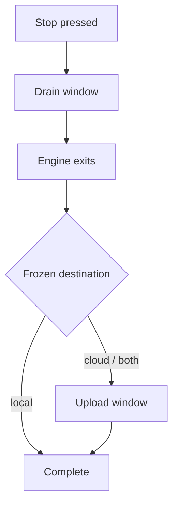
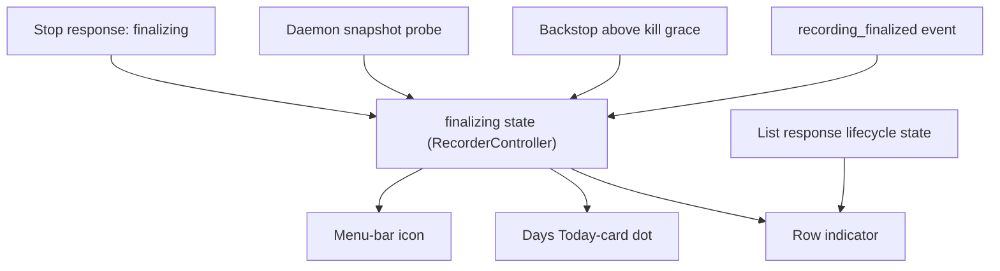

# Post-Stop Finalization Legibility - Plan

## Goal Capsule

- **Objective:** Give the operator an honest, ambient signal that Screencap is still finishing a recording during the post-stop finalize drain, so the multi-minute wait stops reading as a hang.
- **Product authority:** SCR-296. The finalize-drain plumbing landed with SCR-276 (PR #445) and is a dependency, not part of this scope.
- **Execution profile:** macOS app only — Swift under `macos/Screencap/`. No Python, daemon, or CLI change; every signal this needs already exists.
- **Stop conditions:** Stop and surface it if the work requires changing `catalog._derive_state`, the daemon's stop path, or the stop kill grace — that would move the change out of the app and past this plan's authority.
- **Tail ownership:** Standard branch-and-PR. No migration, rollout, or operational step.
- **Open blockers:** None.

---

## Product Contract

### Summary

The menu-bar icon carries a third "finishing up" state while a post-stop finalize drain runs, and Library/Days rows show a per-recording unfinished indicator. Both clear on the recording's real completion signal rather than a timer, and neither shows a countdown.

### Problem Frame

Stopping a recording can take one to five minutes. That is correct behavior: SCR-273 stopped killing an engine that misses the 30s stop deadline, letting it drain transcribe, scrub, index, and export under a 630s backstop instead. Killing early left scrub work pending on disk and produced false "stopped before it finished processing" banners.

During that window the app says nothing. The menu-bar label reads "Stopping…" only until the in-app stop wait expires at 60s, then clears while minutes of work continue. A user reported this on 2026-07-28: he stopped a recording, waited several minutes, and could not tell whether it was working or stuck.

Nothing was blocked. He did not try to start another recording, quit, or kill anything — he waited, and was confused. The cost is the not-knowing, not lost work or a lost action. That makes this a trust problem, matching `STRATEGY.md`'s "UX & native experience" thesis for non-technical operators, rather than a latency or throughput problem.

Two facts narrow the remedy. First, the app already receives both edges of the drain window — the stop response reports the drain started, and `recording_finalized` arrives on the event stream when the engine exits, after the stop task has given up. The app discards this rather than lacking it. Second, the recording rows already decode a per-recording lifecycle state that no view renders.

### Key Decisions

- **Ambient icon plus per-recording row, not a post-Stop toast.** (session-settled: user-directed — chosen over a self-dismissing message at the Stop moment: the operator has usually moved to another app by then, so a one-shot toast misses the person it is for.) Governs R1, R4.
- **The ambient state tracks the drain; the row tracks the whole recording.** These windows differ on cloud recordings, and that divergence is intended: the drain is the window where starting a new recording is refused, and upload is not. (session-settled: user-directed — chosen over extending the ambient state through upload, and over narrowing the row to match the drain.) Governs R2, R5.
- **Indeterminate reassurance, not measured progress.** The reported cost was confusion rather than a blocked action, so an honest "still working" clears the bar and per-phase instrumentation through the processing pipeline does not earn its cost. Governs R9.
- **Clear on the completion signal, never on a clock.** The SCR-276 review rejected a channel that could not auto-clear, and the existing Cmd+Q line counts down a timeout budget rather than real work — a recording that finalizes in 40s still shows minutes "remaining". Governs R7, R8.
- **Leave room for counts later.** The `chunk_finalized` event holds a reserved-but-unemitted schema slot, and the ledger already freezes `chunks_expected`. The surfaces should be able to carry "3 of 5" without redesign if per-chunk progress is ever wired.

The two windows and which surface covers each:



- **Drain window** — ambient icon shows finishing up; row shows unfinished.
- **Upload window** (cloud/both only) — ambient icon is idle; row still shows unfinished.
- **Complete** — both surfaces clear.

### Requirements

**Ambient state**

- R1. While a post-stop finalize drain is running, the menu-bar icon renders a state distinct from both idle and recording.
- R2. The ambient state covers the finalize drain only, ending when the engine exits, and does not extend through upload.
- R3. The ambient state reflects any drain the daemon reports, including drains this app did not initiate.

**Per-recording state**

- R4. Library and Days rows show a per-recording unfinished indicator for a recording that has stopped but not completed.
- R5. The row indicator covers the recording's full path to completion, which on cloud and both destinations includes upload.
- R6. The row indicator appears during the finalize drain, not only after the engine exits.
- R13. The Days Today-card status indicator distinguishes finalizing from recording, paused, starting, and off.

**Lifecycle and clearing**

- R7. The user-visible finalizing state persists for the full drain, independent of the app's internal stop wait.
- R8. Both surfaces clear on the recording's completion signal rather than an elapsed budget; the only time-based exit is R10's failure backstop.
- R9. No surface displays a countdown, remaining-seconds, elapsed time, or percentage.
- R10. A backstop bounds the ambient state so a missed completion signal cannot leave it stuck indefinitely.

**Degradation and re-entry**

- R11. A drain that ends in a backstop kill continues to surface through the existing force-stop path, and the new surfaces neither suppress nor contradict it.
- R12. An app launched or relaunched into an in-progress drain reflects that drain in the ambient state.

### Key Flows

- F1. Stop and move on
  - **Trigger:** Operator presses Stop, then switches to another app.
  - **Steps:** The HUD pill tears down as it does today; the menu-bar icon enters the finishing state; the operator works elsewhere; the icon returns to idle when the engine exits.
  - **Outcome:** The operator can answer "is it still working?" with a glance at the menu bar, without opening Screencap.
  - **Covered by:** R1, R2, R7, R8

- F2. Check back mid-drain
  - **Trigger:** Operator opens Screencap during the drain to look for the recording.
  - **Steps:** The recording's row shows an unfinished indicator; the indicator persists through upload on a cloud recording; it clears when the recording completes.
  - **Outcome:** The recording is visibly present and visibly unfinished, rather than absent or falsely complete.
  - **Covered by:** R4, R5, R6, R8, R13

- F3. Drain the app did not start
  - **Trigger:** A recording is stopped from the CLI, or by ambient auto-stop, while the app is open.
  - **Steps:** The app observes the daemon's finalizing state at its existing probe points and enters the ambient state.
  - **Outcome:** The ambient state describes the machine's actual condition, not just this app's last action.
  - **Covered by:** R3, R12

- F4. Drain that never finishes cleanly
  - **Trigger:** The engine hangs and the daemon's backstop kills it.
  - **Steps:** The ambient state ends at the backstop bound; the existing force-stop path reports the incomplete recording.
  - **Outcome:** The operator gets the existing incomplete-recording message, not a surface that quietly claims success or stays busy forever.
  - **Covered by:** R10, R11

### Acceptance Examples

- AE1. Local recording, clean drain
  - **Covers R2, R5, R8.**
  - **Given** a local-destination recording whose drain takes three minutes,
  - **When** the engine exits,
  - **Then** the ambient state and the row indicator clear together, because a local recording has no upload window that outlasts the drain.

- AE2. Cloud recording, drain completes before upload
  - **Covers R2, R5.**
  - **Given** a cloud-destination recording,
  - **When** the engine exits but chunks are still uploading,
  - **Then** the ambient state clears while the row indicator continues, and this is correct rather than a contradiction.

- AE3. App relaunched mid-drain
  - **Covers R3, R12.**
  - **Given** a drain running when the app starts,
  - **When** the app completes its first daemon probe,
  - **Then** the ambient state is already showing, without the operator taking an action.

- AE4. Backstop kill
  - **Covers R10, R11.**
  - **Given** a drain that exceeds the daemon's kill grace and is force-killed,
  - **When** the engine exits non-zero,
  - **Then** the ambient state ends and the existing force-stop message reports the recording as incomplete.

- AE5. Drain shorter than the internal stop wait
  - **Covers R7, R9.**
  - **Given** a recording that finalizes in twenty seconds,
  - **When** the engine exits,
  - **Then** both surfaces clear at twenty seconds, with no countdown having been shown and no residual state tied to the longer internal wait.

### Success Criteria

An operator who stops a recording and returns several minutes later can tell whether Screencap is still working without opening the app, and never sees a surface that outlives the work it describes.

### Scope Boundaries

**Deferred for later**

- Per-phase progress events (transcribe, scrub, index, export) through the processing pipeline. The reserved `chunk_finalized` slot stays reserved; the surfaces here should not preclude wiring it.
- Realigning the Cmd+Q countdown. It measures a timeout budget rather than real work, but it answers a different question — when the app will quit — and the app is terminating when it shows.
- Per-chunk counts in either surface.

**Outside this work**

- Making the drain faster, or changing the stop timeout and kill grace. The window's duration is correct; only its legibility is in question.
- Any new terminal-error channel. The existing force-stop path owns failure reporting.

### Dependencies / Assumptions

- SCR-276 (PR #445) is the dependency that makes this cheap: the `finalizing` flag on the session snapshot, the typed retryable start refusal, and the app-side finalizing-session snapshot outcome all exist.
- The app's event subscription outlives the stop task, so the drain-end event arrives even after the internal stop wait expires. Verified against `macos/Screencap/State/RecordingsIndex.swift` and `macos/Screencap/Controllers/RecordingStateMachine.swift`.
- Assumed: the event stream stays live for the drain's duration. R10's backstop exists because this assumption can fail.

### Outstanding Questions

**Deferred to Planning** — resolved during this planning pass; retained for traceability.

- Visual treatment of the third menu-bar icon state — resolved by KTD5.
- Repaint mechanism for the rows during the drain — resolved by KTD7.
- Whether the row indicator's copy differs between the drain and upload phases — resolved by KTD3: one label, two sources.

### Sources / Research

- `src/screencap/daemon/supervisor.py` — the no-kill stop path returning a finalizing state (line 1110), the drain flag on the session snapshot (line 579), and the engine-exit funnel that publishes the finalize event (line 1743).
- `src/screencap/catalog.py` — `_derive_state` (line 628) and `_active_recording_name` (line 527), the pair behind KTD3.
- `src/screencap/cli/__init__.py:2784` — the display-time `finalizing` branch this plan mirrors in the app.
- `src/screencap/_stderr_events.py:20` — `chunk_finalized` documented as reserved and not emitted.
- `macos/Screencap/Controllers/StopPolicyCoordinator.swift:79` — the 60s in-app stop wait that R7 decouples from visibility.
- `macos/Screencap/Controllers/RecorderController.swift:1140` — the stop-timeout path that currently surfaces nothing.
- `docs/solutions/ui-bugs/recording-hud-frozen-on-stop-decouple-teardown-from-finalization-2026-07-08.md` — the prevention rule behind KTD1 and KTD2.
- `docs/solutions/integration-issues/inner-timeout-unreachable-behind-outer-watchdog-2026-06-24.md` — the layered-timeout failure behind KTD4.
- SCR-273 (why the drain exists), SCR-276 (the plumbing), and `STRATEGY.md`'s "UX & native experience" section.

---

## Planning Contract

The work is entirely app-side. One orthogonal published property on the recorder controller becomes the single authority for "a drain is running"; three view surfaces read it. The row indicator additionally reads the per-recording lifecycle state the list response already carries, because that state covers the post-exit window the drain flag does not.

### Product Contract preservation

Restructured, no scope change. R4 and R6 were restated as intent — R4 dropped the `derived state is processing` mechanism and R6 dropped the "the Library repaints" mechanism — because research found that mechanism cannot satisfy them (KTD3). R10 likewise dropped its `at the daemon's existing stop kill grace` clause, which KTD4 now owns and sets *above* that bound. R13 was added for the Days Today-card status dot, a surface the brainstorm did not name. All other requirements, both governing Key Decisions, and every `Governs`/`Covers` link are unchanged.

### Key Technical Decisions

- KTD1. **Model the finalizing state as an orthogonal published property, not a state-machine state.** It mirrors how mute and pause are handled — orthogonal to the idle/starting/recording/stopping lifecycle. It must survive `enterIdleStayingBackgrounded()` and must not be cleared at the `state.didSet` idle chokepoint that clears `captureAdvisory`, since that chokepoint fires exactly when an in-app Stop concludes. Governs R7.
- KTD2. **Open on the user-action edge, close on the completion edge.** The state opens from the stop response's finalizing outcome and closes on the finalize event. Gating visibility on a transition that only fires after a long background await is the documented failure in the HUD-freeze learning; this inverts it. Governs R7, R8.
- KTD3. **The row's drain-window label reads the finalizing signal; the list response's lifecycle state carries the post-exit window.** The engine holds the pidfile flock until it exits, so a draining recording is still reported as `recording` — not `processing` — for the entire drain. Branching at display time is what the CLI's status output already does for this window, and it leaves the shared backend contract untouched. (session-settled: user-approved — chosen over changing the backend state derivation: that would alter a contract the CLI shares.) Governs R4, R6.
- KTD4. **The app-side backstop sits above the daemon's 630s kill grace, not at it.** The daemon already hard-bounds the drain; an app bound set equal or lower fires before the real completion signal can arrive and clears the surface falsely — the layered-timeout failure documented in `docs/solutions/integration-issues/inner-timeout-unreachable-behind-outer-watchdog-2026-06-24.md`. (session-settled: user-approved — chosen over binding at the kill grace.) Governs R10.
- KTD5. **The third menu-bar icon state is a symbol variant, not a new color.** The label's existing discipline reserves color for the recording state and the brand accent and de-colors advisories, so a new hue would break a stated rule for a non-alarming condition. Governs R1.
- KTD6. **The Days Today-card status indicator gains a finalizing case, drawn as an unfilled ring in the existing muted role.** Shape carries the distinction, not colour: `starting` already occupies the muted colour, so a colour-only treatment could not satisfy R13, and a new hue would break the same scarcity rule KTD5 honours. Shape also keeps the indicator from being colour-only for accessibility. (session-settled: user-directed — chosen over a distinct muted colour and over a pulse: colour is already spoken for and motion needs a reduced-motion fallback on a passive surface.) Governs R13.
- KTD7. **Repaint the rows by reacting to the state change, not by polling.** The Days surface already re-resolves on recorder-state change and the recordings index is documented timer-free; extending the reactive path keeps that property. Governs R6.

### High-Level Technical Design

One authority, three readers, with the row label taking a second input for the window the authority does not cover:



`S1` and `S2` open the state; `S4` closes it; `S3` is the failure-only exit. `V3` is the only reader with two inputs — the authority covers the drain, the list response covers the post-exit window.

### Risks

- **This area has a documented history of subtle bugs** — SCR-69's false "still finalizing" surface, SCR-71's zero-elapsed report, SCR-100/101's capture-health teardown, and the HUD freeze. The through-line is visual concerns getting welded to finalization concerns. KTD1 and KTD2 keep them separate; U1's SCR-69 guard is the specific regression this plan is most likely to re-introduce, since it makes finalization visible for exactly the window SCR-69 was about not over-reporting.
- **The CLI-fallback transport has no drain-start signal.** The daemon transport's stop response carries the final state, but the CLI-fallback stop is dispatched detached and returns nothing to read. On that transport the state opens only at the next daemon probe (U2), so the ambient surface can lag or, if the app never probes during the drain, miss it. Accepted rather than fixed: the fallback transport is the degraded path already, and closing this would need a new signal on the CLI's stderr channel, which the Execution profile puts out of scope.

### Sequencing

U1 establishes the authority and must land first. U2 completes its coverage and hardening. U3, U4, and U5 are the readers and are independent of each other; each depends only on U1. U4 and U5 both touch `macos/Screencap/Views/Days/DaysView.swift`, so landing them in either order requires a rebase but no coordination.

---

## Implementation Units

### U1. Introduce the finalizing state and drive it from the in-app stop path

- **Goal:** A published `finalizing` property on the recorder controller that opens when an in-app Stop reports a drain and closes when the finalize event arrives.
- **Requirements:** R7, R8. Implements KTD1, KTD2.
- **Dependencies:** none.
- **Files:**
  - `macos/Screencap/Controllers/RecorderController.swift`
  - `macos/ScreencapTests/RecorderControllerTests.swift`
- **Approach:**
  1. Add the published property next to `muted`, following the same orthogonal-to-lifecycle treatment.
  2. Open it **only** when the stop response's final state reports a drain. The stop wait's outcome — completed or timed out — does not open it; a slow clean stop is not a drain, and treating the timeout as evidence of one re-introduces SCR-69's false "still finalizing" surface.
  3. Close it where the finalize event is already handled.
  4. Confirm the `state.didSet` idle chokepoint and `enterIdleStayingBackgrounded()` leave it untouched — this is the invariant the unit exists to establish, per KTD1.
- **Patterns to follow:** the mute/pause handling in `handleRecorderEvent` — confirmed events update an orthogonal surface directly and still fall through to the state machine.
- **Test scenarios:**
  - An in-app Stop whose drain outlasts the internal stop wait leaves `finalizing` true after the controller has transitioned to idle.
  - The finalize event sets `finalizing` false.
  - Covers AE5. A drain that completes in well under the internal stop wait clears `finalizing` at the finalize event, not at the wait's expiry.
  - Reaching idle via `enterIdleStayingBackgrounded()` does not clear `finalizing`, while `captureAdvisory` is still cleared there.
  - A stop whose signal dispatch fails leaves `finalizing` false — no drain started, so nothing to report.
  - A stop wait that times out **without** the response reporting a drain leaves `finalizing` false — the SCR-69 guard.
  - `lastError` is not written by any path in this unit.
- **Verification:** the controller reports a drain that outlives the stop wait, and no idle transition clears it.

### U2. Cover externally-initiated drains, relaunch, and the backstop

- **Goal:** The finalizing state reflects drains this app did not start, survives a relaunch into a running drain, and cannot stick if the completion signal never arrives.
- **Requirements:** R3, R10, R11, R12. Implements KTD4.
- **Dependencies:** U1.
- **Files:**
  - `macos/Screencap/Controllers/RecorderController.swift`
  - `macos/ScreencapTests/RecorderControllerDaemonTests.swift`
- **Approach:**
  1. Open the state from the finalizing-session snapshot outcome that `syncDaemonSnapshot` already receives and already refuses to attach to.
  2. Arm a backstop when the state opens, sized per KTD4; disarm it when the state closes normally.
  3. Leave the force-stop path untouched — R11 is a non-interference requirement, so this unit proves it rather than changing it.
- **Patterns to follow:** the existing finalizing-session branch in `syncDaemonSnapshot`, which already logs and declines to attach.
- **Execution note:** exercise the backstop and the completion signal against each other rather than injecting each in isolation — the layered-timeout learning records that per-layer tests with injected triggers passed while the real cross-layer timing was broken.
- **Test scenarios:**
  - Covers AE3. A probe returning a finalizing session opens the state with no prior Stop from this app.
  - A probe returning a finalizing session does not attach to it as a live recording.
  - The backstop fires only after the daemon's kill grace could have elapsed, never before.
  - Covers AE4. A finalize event carrying force-stopped still closes the state, and the existing force-stop message is produced.
  - A finalize event arriving after the backstop already closed the state is a no-op, not a second transition.
  - A drain that opens, closes, and opens again within one session arms a fresh backstop rather than reusing the spent one.
- **Verification:** the state reflects daemon-reported drains, and neither the backstop nor an abnormal exit leaves it stuck or suppresses the force-stop message.

### U3. Menu-bar icon finalizing state

- **Goal:** The menu-bar icon renders a third state, distinct from idle and recording, while a drain runs.
- **Requirements:** R1, R2, R9. Implements KTD5.
- **Dependencies:** U1.
- **Files:**
  - `macos/Screencap/ScreencapApp.swift`
  - `macos/Screencap/Views/MenuBarMenu.swift`
  - `macos/Screencap/Views/MenuBarMenuPolicy.swift`
  - `macos/ScreencapTests/MenuBarMenuPolicyTests.swift`
- **Approach:**
  1. Widen the menu-bar label's input from the current recording boolean to a tri-state derived from recording plus finalizing, resolved by a pure policy function so it is testable without a view host.
  2. Render the finalizing case as a symbol variant with the de-colored advisory role, per KTD5.
  3. Replace the dropdown's "Stopping…" line so it reflects the drain rather than clearing when the internal stop wait expires; keep the Cmd+Q countdown branch ahead of it and unchanged.
  4. Update the accessibility label so VoiceOver distinguishes the three states.
- **Patterns to follow:** `MenuBarMenuPolicy` — pure, testable policy functions separated from the view.
- **Test scenarios:**
  - Recording resolves to the recording state; finalizing with no recording resolves to the finalizing state; neither resolves to idle.
  - Finalizing while a Cmd+Q countdown is active still renders the countdown branch — the existing quit path keeps precedence.
  - The finalizing case carries no elapsed value, remaining-seconds, or percentage.
  - Each of the three states has a distinct accessibility label.
  - The finalizing case does not resolve to the recording color role.
- **Verification:** the icon shows a distinct non-recording busy state for the drain's duration and returns to idle when it ends.

### U4. Library and Days row unfinished indicator

- **Goal:** A recording that has stopped but not completed shows an unfinished indicator on its row, during the drain and through upload.
- **Requirements:** R4, R5, R6, R9. Implements KTD3, KTD7.
- **Dependencies:** U1.
- **Files:**
  - `macos/Screencap/Views/Shared/RecordingRowStatus.swift` (new)
  - `macos/Screencap/Views/Days/DaysView.swift`
  - `macos/Screencap/Views/MainWindow.swift`
  - `macos/ScreencapTests/RecordingRowStatusPolicyTests.swift` (new)
- **Approach:**
  1. Add a pure policy resolving a row's display status from the recording's lifecycle state plus whether that named recording is the one currently draining — the two-source rule KTD3 owns.
  2. Render the indicator on the row surfaces that consume the recordings list, starting from `DaysView` and the consumer reached via `MainWindow`.
  3. Trigger a list refresh when the finalizing state changes, extending the existing reactive re-resolve rather than adding a timer (KTD7).
  4. Correct the stale claim about existing status chips in the timed-out branch of `runStop` in `macos/Screencap/Controllers/RecorderController.swift`, which asserts the Library already carries this signal.
- **Patterns to follow:** the existing `.onChange(of:)` re-resolve in `DaysView`; the already-decoded lifecycle state on the recording summary model.
- **Test scenarios:**
  - Covers AE1. A local recording resolves to unfinished while draining and to finished once complete.
  - Covers AE2. A cloud recording still reports its backend lifecycle as incomplete after the drain ends, and the row stays unfinished through upload.
  - A recording that is draining resolves to unfinished even though its backend lifecycle still reads as recording — the KTD3 case the derived state alone cannot cover.
  - A different recording than the one draining is unaffected by the finalizing state.
  - A recording whose ledger reports a failed chunk resolves to finished rather than sitting unfinished forever.
  - The indicator carries no elapsed time, countdown, or percentage.
- **Verification:** the row shows unfinished from the moment Stop is pressed until the recording completes, with no polling introduced.

### U5. Days Today-card status dot finalizing case

- **Goal:** The Today card's status dot distinguishes finalizing from the states it already shows.
- **Requirements:** R13, R9. Implements KTD6.
- **Dependencies:** U1.
- **Files:**
  - `macos/Screencap/Views/Days/DaysView.swift`
  - `macos/ScreencapTests/DaysModelTests.swift`
- **Approach:**
  1. Add a finalizing case to the status enum backing the dot and map it to a de-colored role, consistent with KTD5's treatment of the same condition in the menu bar.
  2. Resolve the case from the same finalizing authority U1 established, so the dot and the icon cannot disagree.
- **Patterns to follow:** the existing status-dot colour mapping, where starting already uses a muted non-alarming role.
- **Test scenarios:**
  - Finalizing resolves to its own case, distinct from recording, paused, starting, and off.
  - The finalizing case does not resolve to the recording colour role.
  - Recording takes precedence over finalizing if both were ever set, so a fresh recording is never shown as finishing.
- **Verification:** the Today card and the menu-bar icon show the same condition for the same window.

---

## Verification Contract

Run from `macos/`. On a fresh clone, run `xcodegen generate` first — the `.xcodeproj` is gitignored.

```bash
xcodebuild test -only-testing:ScreencapTests -project Screencap.xcodeproj -scheme Screencap
```

Gates:

- The full `ScreencapTests` target passes. The daemon-reconnect test in this target is known to be flaky — re-run before treating it as a regression.
- No Python test run is required; this plan changes no Python.
- Manual check for the behavior the automated tests cannot reach: start a stills-enabled recording, stop it, and confirm the menu-bar icon holds its third state past the 60s mark and clears on its own, with the row showing unfinished throughout.

---

## Definition of Done

Global:

- R1–R13 are satisfied, each traceable to at least one unit.
- The finalizing state survives every idle transition and is cleared only by the completion signal or the R10 backstop.
- No countdown, elapsed time, or percentage appears on any of the three surfaces.
- No Python, daemon, or CLI file is modified.
- No timer or polling loop is introduced into the recordings index.
- Abandoned or experimental code from approaches that did not pan out is removed before the branch is declared done.

Per unit:

- U1 — the state exists, opens on the stop edge, closes on the finalize edge, and no idle transition clears it.
- U2 — daemon-reported drains open the state, the backstop sits above the kill grace, and the force-stop message still fires on an abnormal exit.
- U3 — the icon renders three distinct states with distinct accessibility labels, and the Cmd+Q countdown keeps precedence.
- U4 — the row shows unfinished across both the drain and upload windows, and the stale status-chip claim in `runStop`'s timed-out branch is corrected.
- U5 — the Today-card dot has a finalizing case that cannot disagree with the menu-bar icon.
