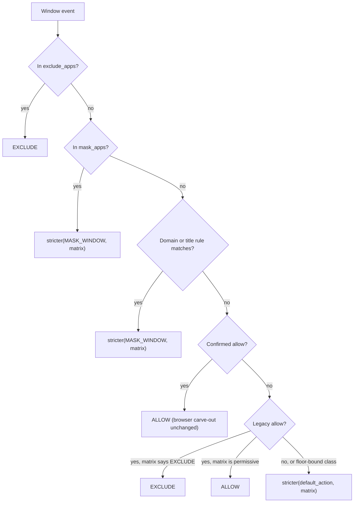

# Per-App Mask Override and Default Action for Unruled Apps - Plan

## Goal Capsule

- **Objective:** Make the App-rules pane's two dead controls real — the per-app Mask segment and the default-action banner — as tightening-only rules that flow through every privacy consumer.
- **Authority hierarchy:** Product Contract > Planning Contract > per-unit approach notes. Repo conventions govern style. SCR-235's confirmed-allow authority (SECURITY.md, "User allow-list authority over the privacy matrix") is unchanged and outranks anything here that would contradict it.
- **Execution profile:** Single branch; Python policy core first (test-first on precedence), then mutators and payload, then Swift. The Swift half cannot be verified until the payload lands.
- **Stop conditions:** Stop and surface rather than guess if a change would let either new rule *weaken* a matrix action, or if a downstream consumer turns out to need explicit plumbing rather than inheriting the evaluator.

---

## Product Contract

### Summary

Ship both halves of SCR-225: a per-app Mask rule and a user-settable default action for apps with no explicit rule. Both are strictly tightening — they raise the floor over the privacy matrix and can never loosen it — which is what makes a single global control safe to expose without per-app consent. The banner's current label also misdescribes what it governs and is replaced.

### Problem Frame

The App-rules pane ships two controls that render but do nothing. The default-for-new-apps banner hardcodes Record as selected with every segment disabled and a `"Coming soon — SCR-225"` tooltip (`macos/Screencap/Views/Settings/AppRulesView.swift`, `defaultForNewAppsBanner`). The per-app Mask segment is `enabled: false` on every row: it either reflects the matrix's own mask decision or stubs out (`macos/Screencap/Views/Settings/AppRuleSegmentPolicy.swift`).

Underneath, app rules are binary. `exclude_apps` and `allow_apps` are the only per-app knobs; mask is derived from the (context × mode) matrix and cannot be set for an app. There is no user-authored route to `MASK_WINDOW` at all — which is also why a Mask *default* is unimplementable without the per-app override, and why the two halves belong in one change.

The banner's label is separately wrong. "Default for new apps — anything not listed below" implies a partial list, but the rows below are every app `discover_installed_apps` finds. What a default would actually govern is any app the user has not given an explicit rule — including apps already visible in that list.

### Key Decisions

- **Tightening only.** Both new rules combine with the matrix through the existing `stricter()` helper. Setting Mask on a password manager still yields `EXCLUDE`; setting the default to Block cannot un-mask a banking app, and setting it to Record changes nothing. Governs R1, R2, R3.
- **Two Record buttons that mean different things.** Per-app Record keeps SCR-235's confirmed-allow authority: an explicit, individually confirmed choice that beats the matrix. The banner's Record is the identity floor. The asymmetry is deliberate — a per-app allow carries a consequences confirmation for that one app, and a global default cannot. Governs R3, R4.
- **The default is a floor over every unruled app, not a replacement for the unknown-context row.** Scoping it to unclassified apps only would leave browsers, terminals, and cloud storage untouched, so Block would not deliver a record-nothing-unless-allowed posture. Governs R2.
- **Future capture only.** Changing either rule shapes what is captured next; nothing re-masks, re-scrubs, or purges recordings or index rows that already exist. Governs R15.

### Requirements

**Policy semantics**

- R1. A per-app Mask rule resolves the app to at least `MASK_WINDOW`, and never weakens a stricter matrix action for that app's class.
- R2. A configured default action applies to every app with no explicit per-app rule, as a floor over the matrix action for that app's context class and the active privacy mode.
- R3. The default action `allow` is the identity floor — resolution matches today's behavior for every app and mode.
- R4. An explicit deny beats every other rule; a per-app Mask beats an allow entry for the same bundle.
- R5. Both rules cascade to every consumer of the policy decision — capture-time window filtering, background-window masking, scrub-time masking, keystroke nulling, content indexing, and cloud copies — with no layer applying a weaker action than the evaluator returned.
- R6. Each decision the new rules produce carries its own reason code, so audit records name the rule that fired rather than attributing it to the matrix.

**Persistence and surfaces**

- R7. Both rules persist through the Python privacy mutators under the existing advisory config lock; the macOS app never writes TOML directly.
- R8. The three per-app segments are mutually exclusive per bundle: setting one clears the others in the same write.
- R9. `screencap apps --json` exposes each row's per-app Mask membership and which layer decided its resolved action, plus the configured default.
- R10. New payload fields decode leniently in the macOS app, so a stale daemon degrades to the current rendering instead of failing the whole app-list decode.

**macOS surfaces**

- R11. The Mask segment accepts interaction on every app row, writing and clearing the per-app Mask rule.
- R12. The default-action banner reflects the configured default and writes it on tap.
- R13. The banner's label describes what it governs — apps with no explicit rule — instead of claiming the list below is partial.

**Docs and tests**

- R14. SECURITY.md records the tightening-only property of both rules and its asymmetry with SCR-235's confirmed-allow authority.
- R15. Neither rule triggers retroactive re-masking, re-scrubbing, or content-index purging of existing recordings.
- R16. Tests carry `@pytest.mark.privacy` and stay Vision-free so the CI privacy lane runs them.

**Escape hatch under a tightened default**

- R17. Allow-listing a bundle the CLI cannot classify succeeds as a plain allow, so a user under an `exclude` default can record an app the floor blocked. Confirmation-required classes keep their existing gate.

### Acceptance Examples

- AE1. **Covers R1, R5.** Given a code editor with no rule (matrix `ALLOW` at internal), when the user sets Mask, then its screenshots are masked at scrub time, its keystrokes are nulled, and its video frames are dropped.
- AE2. **Covers R1.** Given a password manager (matrix `EXCLUDE` in every mode), when the user sets Mask, then it still resolves to `EXCLUDE`.
- AE3. **Covers R2.** Given default `exclude` and no per-app rules, when an unrecognized app appears on screen, then it is excluded from capture.
- AE4. **Covers R2, R4.** Given default `exclude` and a confirmed allow for Slack, when Slack appears, then it records — the floor applies only where no rule already decided.
- AE5. **Covers R3.** Given default `allow`, when any recording runs under any mode, then every app resolves to the same action as before this change for the same config.
- AE6. **Covers R5.** Given default `mask_window` and a cloud-destined recording, when an unlisted app appears, then the cloud copy masks it — the floor survives the cloud posture's confirmed-only narrowing of the allow set.
- AE7. **Covers R8.** Given an app currently in `exclude_apps`, when the user taps Mask, then the bundle leaves `exclude_apps` and enters `mask_apps` in one locked write.
- AE8. **Covers R10.** Given a daemon emitting the current schema, when the updated app decodes the app list, then rows render as they do today rather than failing to decode.

### Scope Boundaries

- No per-window or per-tab granularity; both rules operate at the bundle level.
- No new privacy modes, and no edits to the matrix's own (context × mode) rows.
- `MASK_REGION` and shared mode stay unimplemented and out of reach of both rules.
- The Safari private-windows row stays a stub (SCR-224).
- Menu-bar runtime overrides stay a separate session-scoped mechanism, untouched and still stripped for cloud-bound recordings.
- `masked_video_upload` semantics and the capture-time-blocking vs post-hoc-masking split are unchanged.

#### Deferred to Follow-Up Work

- Harden `build_privacy_filter`'s config-load fallback to fail closed. Its `except` branch constructs a bare `PrivacyConfig(mode=mode)`, which already drops `exclude_apps`, `mask_domains`, and `mask_title_patterns` on a load failure and will drop the new rules identically. Pre-existing behavior, not introduced here — see Risks.
- Retroactive purge on tightening. Today `scrub_worker._purge_content_index_intervals` propagates a retroactive per-app disable into the content index; extending that to a tightened default would be a library-wide purge and needs its own design.

### Open Questions

- Q2. **Deferred.** Should the setup wizard learn the mutual-exclusion invariant, or is deterministic read-time precedence enough? See Risks.

### Sources / Research

- `src/screencap/privacy/policy.py` — `DefaultPolicyEvaluator.evaluate` (the five-step precedence this plan extends), `_ACTION_MATRIX` (the `UNKNOWN` row is `ALLOW` in all three modes), `PrivacyConfig` with its `__post_init__` case-normalization loop and `__getstate__`/`__setstate__` pickle bridge, `restricted_to_confirmed`, and `parse_privacy_config`.
- `src/screencap/privacy/actions.py` — `stricter()` and the four downstream action sets (`BLOCK_ACTIONS`, `KEYSTROKE_NULL_ACTIONS`, `VIDEO_BLOCK_ACTIONS`, `SCRUB_BLOCK_ACTIONS`, `SCRUB_CONTENT_NULL_ACTIONS`) that every consumer keys on. `MASK_WINDOW` is already in all of them except `BLOCK_ACTIONS`, so a per-app Mask needs no new consumer wiring.
- `src/screencap/privacy/reasons.py` — `ReasonCode`'s policy-layer block, where R6's two new codes go.
- `src/screencap/privacy_settings.py` — `_PRIVACY_LIST_FIELDS` / `_PRIVACY_SCALAR_FIELDS` / `_PRIVACY_MODE_VALUES` registries, the `_privacy_config_writer` flock'd read-modify-write, and `_settings_privacy_apply`'s list logic including the `is_bundle_field` case-insensitive matching set and the `allow_apps` paired-write precedent (add writes both lists; remove prunes both) that R8's mutual exclusion mirrors.
- `src/screencap/cli/__init__.py` — the `apps` command's row builder and `_APPS_SCHEMA_VERSION` (currently 3).
- `src/screencap/enforcement/window_filter.py` — `build_privacy_filter`: cloud intent forces `PUBLIC` and calls `restricted_to_confirmed()`; the tightening knobs are documented as surviving into cloud. Its `except` fallback constructs a bare `PrivacyConfig` (see Risks).
- `src/screencap/enforcement/recorder_enforcement.py` — `mask_frame`'s lazily built `_masking_evaluator`, cloud vs local branches. Both wrap a `DefaultPolicyEvaluator`, so both inherit U1 with no change. Called from `src/screencap/engine/recorder.py`, so this is capture-time background-window masking.
- `src/screencap/scrubber.py` — the scrub-time `evaluator.evaluate(...)` call and its `PrivacyAction` branch table. This is the second half of the cascade the ticket's acceptance criteria name; it inherits U1 the same way. Its `MASK_WINDOW` branch passes explicit regions or an explicit `FULL_WINDOW` strategy at every call site, which is why KTD8's map gap is latent rather than live.
- `src/screencap/privacy/mask_primitives.py` — `window_regions_from_geometry` selects regions by `PrivacyAction`, defaulting its trigger set to `KEYSTROKE_NULL_ACTIONS` (`{EXCLUDE, MASK_WINDOW}`). Both the capture-time and scrub-time selective paths therefore pick up a per-app Mask window automatically. The coupling to a keystroke-named constant is incidental, which is why U7 pins it with a test.
- `src/screencap/redaction/masking.py` — `_SURFACE_STRATEGY` and `get_mask_strategy`; the omitted-class comment KTD8 retires.
- `macos/Screencap/Views/Settings/AppRuleSegmentPolicy.swift` — the row-derivation priority ladder and `Transition` enum; `maskStubHelp` is the stub string to retire.
- `macos/Screencap/Views/Settings/AppRulesView.swift` — `defaultForNewAppsBanner` (the stub), `apply(_:to:tapped:)`, and the shared `segmentLabel` chrome the banner reuses.
- `macos/Screencap/Models/InstalledApp.swift` — the custom `init(from:)` whose `decodeIfPresent` + default pattern (SCR-235 KTD8) R10 extends.
- `macos/Screencap/Controllers/PrivacyController.swift` — `toggleMembership` (the per-bundle in-flight guard and refresh-on-both-paths discipline) and `setUploadDefault` (the optimistic-flip-with-revert pattern the banner writer mirrors).
- `SECURITY.md`, "User allow-list authority over the privacy matrix (SCR-235)" — the section R14 extends; its precedence bullet is the one that gains the new steps.
- `docs/plans/2026-07-06-001-feat-allowlist-authoritative-over-matrix-plan.md` — the direct precedent for changing this precedence ladder, including its test-first approach and Verification Contract shape.
- `docs/solutions/integration-issues/stale-daemon-after-app-update-http-500-2026-07-02.md` — the decode-skew failure R10 guards against.
- `docs/solutions/workflow-issues/privacy-guards-deselected-on-ci-silently-rot-2026-06-10.md` — why R16's marker discipline matters.
- Linear: SCR-225 (this change), SCR-235 (confirmed-allow authority), SCR-224 (private-window row, still stubbed).

---

## Planning Contract

### Key Technical Decisions

- KTD1. **Both rules combine with the matrix via `stricter()`, never replacing it.** A per-app Mask resolves to `stricter(MASK_WINDOW, matrix_action)` — the exact shape `mask_domains` and `mask_title_patterns` already use — and the default resolves to `stricter(default_floor, matrix_action)` at the matrix step. This is what makes one global control safe to expose: no combination of settings can produce a weaker action than today's matrix. Governs R1, R2, R3.
- KTD2. **The default is stored in policy vocabulary (`allow` / `mask_window` / `exclude`), not UI vocabulary.** The field parses straight to a `PrivacyAction` and composes with `resolved_action`, which the payload already emits in the same vocabulary. Rejected: storing `record`/`mask`/`block` to match the segment labels — that would put two vocabularies in one JSON envelope and add a translation table on the Python side, when `AppRuleSegmentPolicy` already maps policy values to segment labels for `resolved_action`.
- KTD3. **The per-app Mask step slots immediately after the explicit-deny step.** App-level rules resolve before per-frame domain/title work, and evaluating Mask before the allow steps makes a hand-edited config that lists a bundle in both `mask_apps` and `allow_apps` fail closed. Governs R4.
- KTD4. **Mutual exclusion is enforced at the write seam, not at read time.** Setting one segment clears the other two lists for that bundle inside the same `_privacy_config_writer` transaction, extending the existing `allow_apps` paired-write precedent. Reading stays a plain precedence walk, so a hand-edited config still resolves deterministically rather than erroring. Governs R8.
- KTD5. **`mask_apps` is a list field and `default_action` a scalar field in the existing registries.** Adding them to `_PRIVACY_LIST_FIELDS` and `_PRIVACY_SCALAR_FIELDS` inherits the CLI verb, the flock'd writer, the JSON envelope, idempotent no-ops, and — once `mask_apps` joins the `is_bundle_field` set — case-insensitive bundle matching at the write seam. Governs R7.
- KTD6. **Downstream consumers inherit the change; none are edited.** Every consumer keys on `PrivacyAction` through a `DefaultPolicyEvaluator` built over the live `PrivacyConfig`, and `MASK_WINDOW` is already a member of every relevant action set. `restricted_to_confirmed()` uses `dataclasses.replace`, so the new tightening fields survive the cloud narrowing untouched. Tests prove the cascade rather than code carrying it. Governs R5.
- KTD7. **New payload fields decode leniently in Swift with today's behavior as the default.** `in_mask_apps` defaults to `false` and `action_source` to `matrix`, mirroring SCR-235 KTD8. Governs R10.
- KTD9. **The allow gate's unclassified-bundle rejection is relaxed to a plain allow.** (session-settled: user-directed — chosen over having the pane write an `app_classes` entry first, and over shipping `exclude` behind a separate gate fix: a tightened default is unusable if the user cannot record the apps it blocked, and most of a normal library is unclassified.) `_allow_requires_confirmation` still gates every confirmation-required class, so the surviving exposure is narrow and named: a genuinely sensitive app that is absent from `BUNDLE_ID_MAP` has no static class, so it allow-lists without the consequences dialog. Governs R17.
- KTD8. **The scrub-time mask-strategy map must stop assuming a class's matrix action.** `_SURFACE_STRATEGY` in `src/screencap/redaction/masking.py` omits `CODE_EDITOR_TERMINAL` and `ADMIN_CONSOLE`, justified by a comment reading "-> TEXT_REDACT (no masking needed)". That premise dies the moment a user can set Mask on a terminal. The live scrub path survives — every `MASK_WINDOW` call site passes either explicit regions or an explicit `FULL_WINDOW` strategy — but `get_mask_strategy` would return `None` for a user-masked terminal, so the map is a loaded gun for the next caller. Governs R5.

### High-Level Technical Design

The precedence ladder after this change. Steps 1, 3, 4, and 5 exist today; step 2 and the floor on step 5 are new.

The default floor's effect, by configured value:

| `default_action` | Effect on an app with no rule | Net change vs today |
|---|---|---|
| `allow` (default) | matrix decides | none — identity floor |
| `mask_window` | matrix action, or `MASK_WINDOW` if the matrix was weaker | `ALLOW`-class apps become masked |
| `exclude` | `EXCLUDE` for every unruled app | allowlist-only posture |

### Assumptions

- The classifier's context resolution is unchanged; the floor is applied to whatever action the matrix returns for the class the classifier already produced.
- `mask_apps` needs the same case normalization as the other bundle lists, both in `PrivacyConfig.__post_init__` and at the write seam. macOS treats bundle identifiers case-insensitively and every existing bundle field already normalizes.

### Risks & Dependencies

- **A config-load failure silently drops the tightening default.** `build_privacy_filter`'s `except` branch falls back to a bare `PrivacyConfig(mode=mode)`, which will drop `default_action` and `mask_apps` exactly as it already drops `exclude_apps` and `mask_domains`. This plan does not change that branch — doing so would alter existing behavior for three other fields — but a user who sets Block and hits a malformed config gets Record. Recorded in Deferred to Follow-Up Work; U6 notes it in SECURITY.md so the limitation is disclosed rather than implied away.
- **A stale daemon plus an updated app is a live skew path.** The bundled CLI and the app ship together, but a leftover daemon from a prior install serves the old schema. KTD7's lenient decode is the mitigation; AE8 is the test.
- **The banner is a global control with a large blast radius.** Setting `exclude` blocks every app the user has not explicitly ruled on, which for most libraries is nearly all of them. This is the intended posture, not a bug, but U5 should make the consequence legible in the banner's copy rather than only in the segment label.

---

## Implementation Units

### U1. Policy core: per-app Mask and the default floor

- **Goal:** Both rules exist in `PrivacyConfig` and resolve correctly in `evaluate()`, with their own reason codes.
- **Requirements:** R1, R2, R3, R4, R5, R6 (KTD1, KTD2, KTD3, KTD6)
- **Dependencies:** none
- **Files:**
  - `src/screencap/privacy/policy.py`
  - `src/screencap/privacy/reasons.py`
  - `tests/test_privacy_default_action.py` (new)
  - `tests/test_privacy_matrix_corrections.py`
- **Approach:**
  1. Add `mask_apps: frozenset[str]` and `default_action: PrivacyAction` to `PrivacyConfig`, defaulting to an empty set and `ALLOW`. Add `mask_apps` to the `__post_init__` case-normalization loop and add an `is_masked_app` accessor beside `is_excluded_app`.
  2. Parse both in `parse_privacy_config`, rejecting an unrecognized `default_action` with `InvalidPrivacyConfigError` the way an invalid `mode` is rejected.
  3. Insert the per-app Mask step in `evaluate()` immediately after the explicit-deny step, returning `stricter(MASK_WINDOW, matrix_action)`.
  4. Apply the floor at the matrix-default step: `stricter(self._config.default_action, matrix_action)`.
  5. Add `POLICY_MASKED_APP` and `POLICY_DEFAULT_FLOOR` to `ReasonCode`; emit the floor reason only when the floor actually changed the action, so unchanged decisions keep their context reason.
- **Patterns to follow:** the `mask_domains` branch in `evaluate()` is the shape for step 3; `PrivacyMode` parsing in `parse_privacy_config` is the shape for the scalar validation.
- **Execution note:** Write the precedence tests before touching `evaluate()` — the existing suites pin the current ladder, and seeing them fail first is the cheapest proof the new steps sit where intended.
- **Test scenarios:**
  - Covers AE2. A bundle in `mask_apps` whose class is `PASSWORD_MANAGER` resolves to `EXCLUDE`, not `MASK_WINDOW`.
  - Covers AE1. A bundle in `mask_apps` whose class resolves to `ALLOW` at internal mode resolves to `MASK_WINDOW`.
  - Covers AE3. With `default_action = exclude` and an empty rule set, an `UNKNOWN`-class bundle resolves to `EXCLUDE`.
  - Covers AE4. With `default_action = exclude` and a confirmed allow for the bundle, it resolves to `ALLOW`.
  - Covers AE5. With `default_action = allow`, resolution is unchanged across every context class and both enforced modes.
  - A bundle present in both `exclude_apps` and `mask_apps` resolves to `EXCLUDE`.
  - A bundle present in both `mask_apps` and `confirmed_allow_apps` resolves to a mask action (fail-closed on a hand-edited config).
  - A legacy unconfirmed allow whose matrix action is `MASK_WINDOW` still reaches the floor step and picks up a tightened default.
  - Mixed-case bundle IDs in `mask_apps` match a canonically-cased runtime bundle ID.
  - `parse_privacy_config` rejects `default_action = "banana"` and accepts each valid value.
  - A `PrivacyConfig` carrying both new fields survives a pickle round-trip with normalization intact.
  - Covers AE6, R5. `restricted_to_confirmed()` preserves `default_action` and `mask_apps`.
  - Covers R6. A floor-changed decision carries `POLICY_DEFAULT_FLOOR`; an unchanged one keeps its context reason.
- **Verification:** the new suite and `tests/test_privacy_matrix_corrections.py` pass, and both collect under `pytest -m privacy`.

### U7. Scrub-time mask coverage for user-masked classes

- **Goal:** A user-set Mask produces masked pixels for every context class, including the two the strategy map omits.
- **Requirements:** R5 (KTD8)
- **Dependencies:** U1
- **Files:**
  - `src/screencap/redaction/masking.py`
  - `tests/test_privacy_default_action.py`
- **Approach:**
  1. Add `CODE_EDITOR_TERMINAL` and `ADMIN_CONSOLE` to `_SURFACE_STRATEGY` as `FULL_WINDOW`, and rewrite the trailing comment: the map now answers "how would this surface be masked if asked", not "does the matrix ask for masking".
  2. Leave the `PASSWORD_MANAGER` / `BANKING` omissions in place — those classes resolve to `EXCLUDE` under every rule this plan adds, so they are never asked for a strategy.
  3. Change no call sites. The `MASK_WINDOW` branch in `src/screencap/scrubber.py` already passes explicit regions or an explicit strategy; this unit closes the latent hole rather than fixing a live break.
- **Patterns to follow:** the existing `_SURFACE_STRATEGY` entries and their per-class comment style.
- **Test scenarios:**
  - Covers AE1. A bundle in `mask_apps` classified `CODE_EDITOR_TERMINAL` produces a masked screenshot at scrub time, through the selective-region path.
  - The same bundle produces a masked screenshot through the no-geometry fallback path.
  - `get_mask_strategy(CODE_EDITOR_TERMINAL)` returns `FULL_WINDOW` rather than `None`.
  - `get_mask_strategy(PASSWORD_MANAGER)` still returns `None`.
  - Region selection includes a `mask_apps` window: `window_regions_from_geometry` yields a region for a window whose resolved action is `MASK_WINDOW` because of a per-app rule, pinning the behavior against a future edit to the action set it defaults to.
- **Verification:** the new scenarios pass and collect under `pytest -m privacy`.

### U2. Config mutators and CLI verbs

- **Goal:** Both rules are writable through `screencap settings privacy`, with the three per-app segments mutually exclusive.
- **Requirements:** R7, R8, R17 (KTD4, KTD5, KTD9)
- **Dependencies:** U1
- **Files:**
  - `src/screencap/privacy_settings.py`
  - `src/screencap/cli/__init__.py`
  - `tests/test_privacy_settings.py`
  - `tests/test_settings_privacy.py`
- **Approach:**
  1. Add `mask_apps` to `_PRIVACY_LIST_FIELDS` and to the `is_bundle_field` set inside `_settings_privacy_apply` so it matches case-insensitively at the write seam.
  2. Add `default_action` to `_PRIVACY_SCALAR_FIELDS` with a validated value set alongside `_PRIVACY_MODE_VALUES`.
  3. Implement mutual exclusion inside the single locked transaction: `mask_apps add` prunes the bundle from `exclude_apps`, `allow_apps`, and `confirmed_allow_apps`; `exclude_apps add` and `allow_apps add` prune it from `mask_apps`.
  4. Leave the sensitive-class confirmation gate untouched — it guards allow-listing, and Mask cannot loosen anything, so it must not demand `--confirm-sensitive`.
  5. Relax the allow gate's unclassified-bundle branch (KTD9): when no `app_classes` override, `BUNDLE_ID_MAP` entry, or browser membership resolves a class, permit the add as a plain allow instead of exiting 1. Keep the `_allow_requires_confirmation` branch exactly as-is.
  6. Update the `settings privacy` docstring and help text to cover both fields and the relaxed gate.
- **Patterns to follow:** the `allow_apps` paired-write branch in `_settings_privacy_apply` (add writes both lists, remove prunes both) is the model for cross-list pruning; `_PRIVACY_MODE_VALUES` is the model for scalar validation.
- **Test scenarios:**
  - Covers AE7. `mask_apps add` on a bundle currently in `exclude_apps` leaves it in `mask_apps` only, in one write.
  - `allow_apps add` on a bundle currently in `mask_apps` removes the mask entry.
  - `exclude_apps add` on a bundle currently in `mask_apps` removes the mask entry.
  - `mask_apps add` on a `PASSWORD_MANAGER` bundle succeeds without `--confirm-sensitive`.
  - `mask_apps add` of an already-present bundle is an idempotent no-op with exit 0.
  - `mask_apps remove` of an absent bundle is an idempotent no-op with exit 0.
  - `mask_apps remove` matches a case-variant entry written by hand.
  - `default_action` accepts each valid value and rejects an invalid one with a non-zero exit and a JSON error envelope.
  - Concurrent writes do not lose an update — the flock'd writer covers the cross-list pruning too.
  - Covers R17. `allow_apps add` on a bundle absent from `BUNDLE_ID_MAP` with no `app_classes` override succeeds and writes a confirmed entry, where it previously exited 1 with `unknown_bundle_id`.
  - Covers R17. `allow_apps add` on a `PASSWORD_MANAGER` bundle still exits 1 without `--confirm-sensitive` — the relaxation does not reach classified sensitive bundles.
  - `allow_apps add` on a bundle whose only class comes from an `app_classes` override to a sensitive class still demands `--confirm-sensitive`.
- **Verification:** both settings suites pass and collect under `pytest -m privacy`.

### U3. App-list payload: schema v4

- **Goal:** The payload carries enough for the pane to distinguish user-set rules, the default floor, and matrix-derived states.
- **Requirements:** R9 (KTD2)
- **Dependencies:** U1, U2
- **Files:**
  - `src/screencap/cli/__init__.py`
  - `tests/test_apps_command.py`
- **Approach:**
  1. Bump `_APPS_SCHEMA_VERSION` to 4.
  2. Add `in_mask_apps` to each row, using the case-normalized accessor rather than raw set membership.
  3. Add `action_source` to each row with values `user_rule`, `default_floor`, and `matrix`, derived from the reason code the evaluator returned.
  4. Add `default_action` to the envelope beside `schema_version`.
  5. Update the command docstring's output list and schema note.
- **Patterns to follow:** the existing row builder's use of accessor methods over raw membership, and the `has_per_frame_overrides` envelope-level field as precedent for config state that is not per-row.
- **Test scenarios:**
  - A bundle in `mask_apps` emits `in_mask_apps: true` and `action_source: "user_rule"`.
  - With a tightened default and no rule for a bundle, its row emits `action_source: "default_floor"` and a `resolved_action` matching the floor.
  - With `default_action = allow`, every row's `action_source` and `resolved_action` match the pre-change payload.
  - The envelope reports the configured `default_action` and `schema_version: 4`.
  - A mixed-case bundle in `mask_apps` still emits `in_mask_apps: true`.
  - The error envelope still emits `ok: false` with a non-zero exit when discovery fails.
- **Verification:** `tests/test_apps_command.py` passes and collects under `pytest -m privacy`.

### U4. Swift model and row derivation

- **Goal:** The app model carries the new fields, and the Mask segment becomes a real, writable state.
- **Requirements:** R10, R11 (KTD7)
- **Dependencies:** U3
- **Files:**
  - `macos/Screencap/Models/InstalledApp.swift`
  - `macos/Screencap/Views/Settings/AppRuleSegmentPolicy.swift`
  - `macos/Screencap/Controllers/PrivacyController.swift`
  - `macos/ScreencapTests/AppRuleSegmentPolicyTests.swift`
- **Approach:**
  1. Add `inMaskApps` and `actionSource` to `InstalledApp`, decoded with `decodeIfPresent` and today's-behavior defaults.
  2. Add an `inMaskApps` branch to `AppRuleSegmentPolicy.derive` between the deny branch and the confirmed-allow branch, selecting Mask with a "masked by you" note.
  3. Make Mask tappable: add a `maskAdd` transition, return it from `transition(for:tapping:)`, and enable the segment on rows where it is not already selected. Retire `maskStubHelp`.
  4. Distinguish matrix-derived mask from user-set mask in the row note, driven by `actionSource`, so a locked-looking row and a user-set row read differently.
  5. Add a `toggleMask` writer to `PrivacyController` over the existing `toggleMembership` body.
- **Patterns to follow:** the existing `decodeIfPresent` + fallback block in `init(from:)`; the deny/allow branches in `derive`; `toggleExclude` and `toggleAllow` as the shape for `toggleMask`.
- **Test scenarios:**
  - Covers AE8. A payload without the new keys decodes, with `inMaskApps` false and `actionSource` defaulting to matrix.
  - A row with `inMaskApps: true` derives Mask selected with Record and Block enabled.
  - Tapping Mask on a Record-selected row yields the mask-add transition.
  - Tapping Mask on a row already showing Mask yields no transition.
  - A row whose mask comes from the matrix renders a different note than one the user set.
  - A row in `exclude_apps` still derives Block selected, ahead of any mask state.
- **Verification:** `xcodebuild test` passes for the Screencap scheme.

### U5. App-rules pane: live banner and Mask wiring

- **Goal:** Both controls are live, and the banner's label describes what it governs.
- **Requirements:** R11, R12, R13
- **Dependencies:** U4
- **Files:**
  - `macos/Screencap/Views/Settings/AppRulesView.swift`
  - `macos/Screencap/Controllers/PrivacyController.swift`
- **Approach:**
  1. Replace `defaultForNewAppsBanner`'s hardcoded state with the controller's published default, enable all three segments, and write on tap.
  2. Rewrite the label to name what it governs — apps with no explicit rule — instead of "anything not listed below", and make the blast radius of the strict values legible in the supporting copy.
  3. Route the Mask segment's tap through the existing `apply(_:to:tapped:)` optimistic-pending discipline so a Mask write locks the row like Record and Block do.
  4. Give the banner its own in-flight guard with revert-on-failure, mirroring `setUploadDefault`; a failed default write must not leave the segment showing a value that contradicts disk.
  5. Refresh the app list after a successful default write — every row's resolved action can change.
- **Patterns to follow:** `setUploadDefault`'s optimistic-flip-with-revert; `apply(_:to:tapped:)`'s per-bundle pending map; the shared `segmentLabel` chrome the banner already uses.
- **Test scenarios:** covered by U4's derivation tests plus manual verification below — the view body itself carries no branching logic worth a unit test once derivation and the controller are covered.
- **Verification:** in a dev build, setting the default to the strictest value re-renders every unruled row, setting Mask on one app persists across a pane reopen, and a forced CLI failure reverts the banner and surfaces the inline error.

### U6. SECURITY.md and docs

- **Goal:** The trust-boundary docs state the tightening-only property and its limits.
- **Requirements:** R14, R15
- **Dependencies:** U1
- **Files:**
  - `SECURITY.md`
  - `CLAUDE.md`
- **Approach:**
  1. Extend the SCR-235 section's precedence bullet with the two new steps.
  2. State the tightening-only property and why it is what makes a global default safe without per-app consent, contrasted with the confirmed allow's authority.
  3. Record the three limits: the config-load fallback drops the tightening default (see Risks), neither rule purges or re-masks existing recordings, and per KTD9 an unclassified sensitive bundle can now be allow-listed without the consequences dialog.
  4. Update the CLAUDE.md privacy-subsystem paragraph if the new fields change how a reader would describe the policy layer.
- **Test scenarios:** `Test expectation: none — documentation only.`
- **Verification:** the precedence bullet matches U1's implemented ladder step for step.

---

## Verification Contract

Run from the repo root. In this worktree, prefix pytest with `PYTHONPATH=src` — the editable install may point at a different checkout.

| Gate | Command | Proves |
|---|---|---|
| Policy core and mask coverage | `pytest tests/test_privacy_default_action.py tests/test_privacy_matrix_corrections.py` | U1, U7 |
| Settings and CLI | `pytest tests/test_privacy_settings.py tests/test_settings_privacy.py` | U2 |
| Payload | `pytest tests/test_apps_command.py` | U3 |
| Structural guards | `pytest tests/test_privacy_filter_call_graph.py tests/test_package_boundary_call_graph.py tests/redaction/test_import_lightness.py` | package DAG and filter-factory home intact |
| CI-lane parity | `pytest -m privacy` passes and collects the new suite | R16 — the tests actually run in CI, Vision-free |
| macOS app | `xcodegen generate` then `xcodebuild test` (Screencap scheme, per `macos/README.md`) | U4 |
| Pane behavior | Manual dev-build pass per U5's verification | U5 |

The privacy lane carries known pre-existing failures on this checkout; compare counts and classes against the base branch before attributing one to this change.

---

## Definition of Done

- Every requirement R1–R17 is satisfied or explicitly deferred in Scope Boundaries.
- `default_action = allow` produces byte-identical resolution to the pre-change evaluator for every context class and enforced mode (R3, AE5) — this is the regression gate for the whole change.
- No combination of `mask_apps` and `default_action` produces a weaker action than the matrix alone (R1, R2).
- The Mask segment and the banner both write, persist, and survive a pane reopen; a failed write reverts and surfaces an error.
- Every new or changed test collects under `pytest -m privacy` and imports nothing from Apple Vision.
- SECURITY.md's precedence bullet matches the implemented ladder.
- No abandoned or experimental code from approaches that did not pan out remains in the diff.
