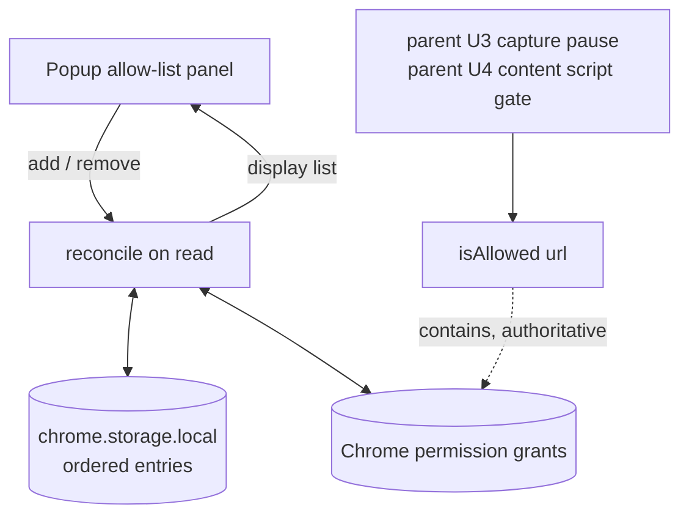

# SCR-307 - Origin allow-list and per-origin grants (browser tier U2)

## Goal Capsule

- **Objective:** A user chooses which origins may ever be recorded, and Chrome's own permission grants are what make that choice real.
- **Repo:** screencap. All paths are relative to it.
- **Origin:** This plan is unit **U2** of [the browser-tier plan](docs/plans/2026-07-29-001-feat-chrome-extension-browser-tier-plan.md), tracked as [SCR-307](https://linear.app/zk-email/issue/SCR-307/browser-tier-u2-origin-allow-list-and-per-origin-grants). That plan's Product Contract governs behavior; this one governs mechanism inside U2 only.
- **U-ID note:** Unit IDs below (U1-U4) are **local to this plan**. The parent plan's U2 is this entire document. Parent-plan units are written `parent U3`, `parent U4` when referenced.
- **Dependency status:** Satisfied. Parent U1 merged in [PR #450](https://github.com/proteus-computer-use/screencap/pull/450); `extension/` is on `origin/main` at `19b597cd`.
- **Downstream consumers:** `parent U3` (capture pauses off-allow-list) and `parent U4` (content script runs only on allow-listed origins) both build on the `isAllowed(url)` seam this plan introduces. Getting that seam's shape right matters more than the popup.
- **Stop conditions:** Stop and surface rather than guessing if Chrome cannot express a user-chosen origin as a requestable match pattern without widening it beyond that origin (see Open Question OQ1), or if `optional_host_permissions` turns out to require enumerating origins at build time.
- **Product Contract preservation:** unchanged. R11 and AE5 are carried verbatim from the parent plan; no requirement is added, split, or reworded. Two **non-product** corrections to the parent's U2 *Approach* and *Patterns to follow* are recorded in Planning Notes below.

---

## Product Contract

Inherited from the parent plan. Only the slice this unit advances is restated; the parent document remains authoritative.

### Requirements

- **R11.** A1 maintains an allow-list of origins; capture records only allow-listed origins, and an origin outside the list is never captured.

### Acceptance Examples

- **AE5. A non-allow-listed origin during a recording** (Covers R11, R13)
  - **Given** A1 has allow-listed one origin and a recording is running,
  - **When** A1 navigates to a different, non-allow-listed origin,
  - **Then** neither video nor events are captured for as long as it is in view, A1 can see that capture has paused, and the finished recording contains no frames of it.

This plan **advances but does not complete** AE5. It delivers the allow-list and the `isAllowed(url)` decision; the pause behavior and the visible indicator land in `parent U3` and `parent U4`. AE5 becomes testable end to end only once those exist.

### Governing Key Decision

- **Privacy comes from not capturing, not from masking afterward.** (session-settled: user-directed) Governs R11, R14.

---

## Planning Contract

### Planning Notes: corrections to the parent unit

Two statements in the parent plan's U2 do not survive contact with the merged code. Both are mechanism, not product, so they are corrected here rather than renegotiated upstream.

1. **`extension/src/popup/AllowlistPanel.tsx` is not buildable as written.** The extension has no React dependency (`extension/package.json` lists only `@types/chrome`, `typescript`, `vitest`), and `extension/vitest.config.ts` sets `environment: "node"` with no DOM. The merged popup pattern is a pure decision function (`extension/src/popup/view.ts`) beside untested DOM wiring (`extension/src/popup/popup.ts`). This plan follows that pattern; the file is `extension/src/popup/allowlist-view.ts`.
2. **`src/screencap/privacy/policy.py` is the wrong fail-closed citation.** Its matrix maps `ContextClass.UNKNOWN` to `PrivacyAction.ALLOW` in all three privacy modes (`src/screencap/privacy/policy.py:127-129`) — fail-*open* on unknown context, by design. The repo's genuine fail-closed exemplars are `src/screencap/terminal_stage.py` and `src/screencap/frame_blocked.py`, and the closest structural analogue is `src/screencap/auth.py:525`, where an unresolvable identity is used "only ever ... to *refuse* a cross-account action (fail closed)". This plan cites those.

Neither correction changes what U2 must do. Both change what an implementer would produce if they followed the parent text literally.

### Key Technical Decisions

- **KTD1. The stored list and Chrome's grant are both kept, and kept in sync.** (session-settled: user-directed — chosen over deriving the allow-list from `chrome.permissions.getAll().origins` alone: the stored list keeps room for per-entry ordering and metadata, accepting a reconciliation surface that KTD2 and KTD3 make self-healing.) Governs R11.
- **KTD2. Chrome's grant state is the capture-boundary authority; storage is the display layer.** `isAllowed(url)` resolves against `chrome.permissions.contains()` and **never** consults storage. The security-critical path stays single-sourced even though the UI reads two stores. Governs R11.
- **KTD3. Reconciliation is bidirectional and happens on read, not on an event.** `chrome.permissions.onRemoved` does not fire when a user revokes site access from the `chrome://extensions` page, though `contains()` reports the revoke correctly. An event-driven cache would therefore go stale in exactly the case the unit must handle. Reading the list prunes entries whose grant is gone and adopts grants with no entry. Governs R11.
- **KTD4. The reconciled answer is fail-closed even when the repair write fails.** A read that finds a dead entry excludes it from what it returns regardless of whether the storage prune succeeds. Persisting the repair is best-effort; refusing the origin is not. Mirrors `src/screencap/auth.py:525`.
- **KTD5. `permissions.request()` is called from the popup's click handler directly, not delegated to the service worker.** Chrome requires the call to occur inside a user gesture in an extension page; routing it through `chrome.runtime.sendMessage` as `extension/src/popup/popup.ts` does for auth would throw "This function must be called during a user gesture". This is a deliberate, documented divergence from the U1 pattern. Governs R11.
- **KTD6. Adding an origin grants that exact host only.** `https://example.com/*` does not cover `app.example.com`; a subdomain is a separate decision the user makes separately. Matches R11's literal "origins" wording and keeps each grant as narrow as the feature allows. Chrome may still widen a grant through its own prompt — `contains()` matches by pattern subsumption, so a widened grant answers correctly without special handling.
- **KTD7. `optional_host_permissions` declares the requestable envelope, not the grants.** Origins are user-chosen at runtime and cannot be enumerated at build time, so the manifest declares `https://*/*` and `http://*/*` as *optional*. This grants nothing on install. `file://` is excluded — local files are outside R11's origin model and would broaden the Web Store review surface for no persona benefit.
- **KTD8. This unit does not touch `desktopCapture` or `offscreen`.** The parent unit's approach step 1 places them here; they belong with the code that uses them in `parent U3`. Declaring a permission before any code exercises it is the posture KTD2 of the parent plan exists to avoid.
- **KTD10. An empty allow-list is only allowed to mean "nothing can be recorded" when that is verifiably true.** (Added during code review, which found the original design collapsed three states into one empty array.) `list()` returns `ok`, `broad-grant`, or `grants-unreadable` beside the entries, and the popup withholds its empty-state copy for the latter two. Keeping the all-sites envelope out of the rows — KTD2's adoption guard — stops it being mistaken for a user's choice, but does nothing to stop it authorizing capture, so the state is what prevents the panel making a safety claim the boundary does not support. Governs R11.
- **KTD9. The extension test suite gains a CI job in this unit.** All four jobs in `.github/workflows/ci.yml` are Python; `npm test` in `extension/` runs on no gate today. U2 is the capture-time privacy boundary for this tier, so it is the wrong unit to merge with unenforced tests.

### High-Level Technical Design

**Authority topology.** Two stores, one authority. The dashed edge is the only one the capture decision depends on.



**Reconciliation matrix.** Every read resolves each of four states. The two diagonal cells are drift; both are repaired, in opposite directions.

| | **Grant present** | **Grant absent** |
|---|---|---|
| **Entry present** | Allowed. Show it. No write. | Revoked out-of-band. **Drop from the returned list**, then best-effort prune the entry. |
| **Entry absent** | Granted out-of-band, or a storage write failed after a successful grant. **Adopt** — append an entry, show it as allowed. | Not on the list. Nothing to do. |

Adoption is the safety-critical half. Without it, an origin that Chrome will happily let the extension record stays invisible in the popup — the user cannot revoke what they cannot see, and `isAllowed()` would return true for it.

**Add-origin protocol.** The grant is requested before anything is stored, so a declined prompt cannot leave an entry behind.

```mermaid
sequenceDiagram
  participant A1 as User
  participant P as Popup (click handler)
  participant C as chrome.permissions
  participant S as chrome.storage.local

  A1->>P: Types origin, clicks Add
  P->>P: Normalize and validate to a match pattern
  P->>C: request({origins:[pattern]}) — inside the gesture
  C->>A1: Chrome's own permission prompt
  A1-->>C: Allow or Decline
  C-->>P: granted: true | false
  alt granted
    P->>S: Append entry
    P->>P: Re-read and re-render
  else declined
    P->>P: Re-render unchanged; no write
  end
```

### Sequencing

U1 is pure vocabulary with no Chrome surface and unblocks the rest. U2 is the substance. U3 and U4 are independent of each other and both depend on U2 — U4 can land first if CI enforcement is wanted before the UI exists.

### Risks & Dependencies

- **Ports may not be expressible in a host permission, which would silently widen a grant.** Chrome match patterns document an optional port that "defaults to matching all ports", and it is unconfirmed whether a port survives into a granted host permission. If it does not, allow-listing `http://localhost:3000` grants all ports on `localhost` — directly relevant, since internal admin panels and local dev servers are the persona's habitat. OQ1 resolves this with a spike in U1 before the store is built; the fallback is to display the pattern actually granted rather than the string the user typed, so the widening is visible rather than silent.
- **The Chrome 130+ details page shows the *granted* set, not the active set.** Permissions "remain in the 'granted' set even if they are removed ... by using the `permissions.remove()` API", so the parent unit's verification statement — "Chrome's extension details page shows site access only for allow-listed origins" — may not hold literally after a remove. U4's verification restates it in terms this unit can actually prove. Confirm the real behavior during manual verification and correct the parent plan if it diverges.
- **Optional broad host patterns are still visible to Web Store review.** KTD7 declares `https://*/*` and `http://*/*` as optional. This is far weaker than a required `<all_urls>` and is the standard mechanism for user-chosen origins, but it is not invisible. This is the first unit whose manifest carries any host pattern, so it is the right point to submit the review-only build the parent plan's Risks section calls for.
- **`isAllowed()` is a security seam with two unwritten consumers.** `parent U3` and `parent U4` both gate capture on it. Its contract — fail-closed on throw, pattern-subsumption semantics, no storage read — must be stated in the module so neither consumer reimplements the check.
- **`parent U4`'s content script cannot reach the seam the way U2 exposes it.** `chrome.permissions` is unavailable in content scripts, and the existing `isTrustedSender` guard rejects every sender that has a `tab` — which is every content script. So `parent U4` needs both a message verb and its own sender predicate. U2 documents the constraint rather than building the verb, so the cost lands with the unit that knows what it needs; the failure mode if undocumented is `parent U4` calling a namespace that is `undefined` at runtime, or silently reusing an auth guard designed to refuse it.

### System-Wide Impact

- **CI gains its first non-Python job.** `.github/workflows/ci.yml` runs four Python jobs today. Adding a Node job establishes the pattern that later browser-tier units (`parent U3`-`parent U6`) extend rather than re-invent.
- **The parent plan's Verification Contract has a row that cannot pass.** It assigns `pytest -m privacy` to U2, which contains no Python. U4 corrects the row to `npm test` in `extension/` and records why.
- **A second privacy-enforcement mechanism enters the product.** The macOS path classifies bundles and window titles; this path uses Chrome permission grants. The parent plan's System-Wide Impact already flags that `SECURITY.md` should say so. This unit does not write that section — it is `parent U6`'s disclosure work — but it is the unit where the mechanism becomes real.

---

## Implementation Units

### U1. Origin vocabulary and match-pattern normalization

- **Goal:** One tested place that turns what a user types, and what a browser navigates to, into a Chrome match pattern — and refuses anything it cannot express exactly.
- **Requirements:** R11 (KTD6, KTD7).
- **Dependencies:** none
- **Files:** `extension/src/permissions/origins.ts`, `extension/src/permissions/origins.test.ts`
- **Approach:**
  1. Export `normalizeOrigin(input: string): NormalizedOrigin | null` — parse with `URL`, keep scheme and host, drop path, query, and fragment, emit `<scheme>://<host>/*`. Return `null` rather than throwing for anything unparseable; the caller decides how to surface it. **As built this returns a record `{ pattern, label, portDropped }` rather than the bare pattern string this plan first specified** — OQ1 resolved against carrying the port, and the caller has to be able to say the grant widened (see step 4).
  2. Accept bare hosts (`example.com`) by defaulting to `https://`, since that is what a user types. Reject any scheme other than `http` and `https`, per KTD7.
  3. Export `originLabel(pattern: string): string` for display — the pattern without the trailing `/*`, so the popup shows `https://example.com` rather than a pattern.
  4. Settle OQ1 here: write the port case as a test first, and let the answer decide whether the port is carried into the pattern or dropped. If dropped, `originLabel` must still show what was granted, not what was typed.
  5. Do not implement subdomain expansion. Per KTD6 an exact host is what gets granted; a wildcard host that arrives from Chrome's own widened grant is handled by `contains()` subsumption, not by this module.
- **Execution note:** Pure functions with no Chrome surface — write the table of input/output pairs first, including the rejections. This is the module every other unit's correctness rests on.
- **Patterns to follow:** `extension/src/popup/view.ts` for a pure, exhaustively-tested decision function with the reasoning in the docstring rather than in a commit message.
- **Test scenarios:**
  - A full URL with a path and query normalizes to `<scheme>://<host>/*` with both discarded.
  - A bare host normalizes to an `https://` pattern.
  - An explicit `http://` host is preserved rather than upgraded, since internal panels are the persona's case.
  - A `file://`, `chrome://`, or `chrome-extension://` input is rejected as `null`.
  - Empty string, whitespace, and a non-URL string each reject as `null` rather than throwing.
  - A host with an explicit port resolves per OQ1, and the test asserts the decided behavior explicitly rather than accepting either.
  - `https://example.com` and `https://app.example.com` produce different patterns — subdomains are not collapsed.
  - `originLabel` round-trips a pattern to a displayable origin with no trailing `/*`.
- **Verification:** Every string the popup can pass to `chrome.permissions.request()` came out of `normalizeOrigin`, and no other module builds a pattern by concatenation.

### U2. Allow-list store, bidirectional reconcile, and the `isAllowed` seam

- **Goal:** The allow-list survives out-of-band changes in either direction, and one function answers "may this URL be recorded?" for every consumer that will ever ask.
- **Requirements:** R11. Advances AE5.
- **Dependencies:** U1
- **Files:** `extension/manifest.json`, `extension/src/permissions/allowlist.ts`, `extension/src/permissions/allowlist.test.ts`, `extension/src/permissions/chrome-deps.test.ts`
- **Approach:**
  1. Add `optional_host_permissions: ["https://*/*", "http://*/*"]` to the manifest per KTD7. Add nothing else — no `desktopCapture`, no `offscreen` (KTD8).
  2. Define `AllowlistDeps` (`permissionsRequest`, `permissionsRemove`, `permissionsContains`, `permissionsGetAll`, `storage`) and a `chromeAllowlistDeps()` adapter, mirroring `AuthDeps` / `chromeAuthDeps()` in `extension/src/auth/firebase.ts:80-155` so the store is testable with fakes and the adapter is covered separately.
  3. `isAllowed(url)` resolves `normalizeOrigin(url)` then returns `permissionsContains({origins:[pattern]})`. A `null` pattern is `false`. **A throw is `false`** (KTD4) — never a rethrow, never a cached answer. Never read storage here (KTD2). State that contract in the module docstring, since `parent U3` and `parent U4` both consume it.
  4. `list()` performs the reconcile in the matrix above (KTD1, KTD3): read stored entries and `permissionsGetAll().origins`, drop entries with no live grant, adopt granted origins with no entry, return the reconciled view, then best-effort persist. A rejected persist is swallowed after the reconciled view is computed — the answer is already correct.
  5. **Adopt only concrete-host patterns.** A pattern whose host is a bare `*` — the `https://*/*` and `http://*/*` envelope from step 1 — is never adopted into the allow-list. Chrome's documentation describes `Permissions.origins` as including origins "specified in the `optional_permissions` or `permissions` keys in the manifest", so it is not certain that `getAll()` excludes the declared-but-ungranted envelope. If it does not, an unguarded adoption path would write the envelope into the allow-list and read back as *everything allowed* — a silent fail-open of the exact boundary this unit exists to build.

     **Narrowed during implementation:** this plan first said to refuse any pattern the normalizer would not itself have produced. That is too strong — it would also refuse `https://*.example.com/*`, a real bounded grant a user can make through Chrome's own prompt, and hiding it would be the precise harm adoption exists to prevent. Only a bare-`*` host is refused.

     **And it is not sufficient on its own — see step 6.** Refusing to adopt the envelope keeps it out of the rows, but it does not stop it authorizing capture.
  6. **Report a live all-sites grant instead of rendering it as an empty list.** Step 5 keeps the envelope out of the rows; `isAllowed` still answers `true` for every URL by subsumption while it is granted. An empty list would then read as "nothing can be recorded" while everything is — a false all-clear on this unit's own boundary, and the same shape as the fail-open step 5 guards against. So `list()` returns a state alongside the entries: `ok`, `broad-grant`, or `grants-unreadable`, and the popup replaces the empty-state copy with a warning for the latter two. Detecting a *live* envelope needs more than its presence in `getAll()` (the ambiguity in step 5 cuts both ways — warning on a declared-only envelope would cry wolf on every open), so its presence only triggers a `contains()` probe against a reserved `.invalid` host that nobody could have granted individually; Chrome answers `true` there only when a broader pattern subsumes it.
  7. **A failed `getAll()` is not an empty grant set.** Returning `[]` on that path would both make the same false all-clear and persist the empty list, destroying the ordering the stored list exists to keep. Report `grants-unreadable` with the last known entries, and write nothing.
  8. `add(input)` normalizes, calls `permissionsRequest` (the caller supplies the gesture, per KTD5), and appends **only** on `granted === true`. A declined prompt and a rejected request both leave storage untouched.
  9. `remove(pattern)` calls `permissionsRemove` then deletes the entry. If the revoke fails, do not delete the entry — a list that still shows a live grant is honest; one that hides it is not.
  10. Do **not** add a `chrome.runtime` message verb for `isAllowed` here — that belongs with its first consumer. Record in the module docstring how each caller reaches it, because the answer differs by context: the popup and the service worker call `isAllowed` directly, but **a content script cannot** — `chrome.permissions` is not exposed to content scripts, so `parent U4` must ask the service worker over a message. Note also that `isTrustedSender` in `extension/src/background/service-worker.ts:57-59` rejects any sender with a `tab`, which is every content script; `parent U4` needs its own sender predicate for that verb rather than reusing the auth one, which is deliberately stricter.
- **Execution note:** Write the out-of-band-revoke test before the happy path. It is the case `permissions.onRemoved` cannot cover and the reason the design reads rather than listens.
- **Patterns to follow:** `extension/src/auth/firebase.ts` for the injected-deps class plus thin Chrome adapter; `extension/src/auth/chrome-deps.test.ts` for stubbing `globalThis.chrome` to cover the adapter itself; `src/screencap/auth.py:525` for refusing on an unresolvable state rather than guessing.
- **Test scenarios:**
  - Adding an origin requests the matching host permission and records the entry only when the grant succeeds.
  - Declining the Chrome permission prompt leaves the allow-list unchanged and stores nothing.
  - A `permissionsRequest` that rejects is reported to the caller and leaves the allow-list unchanged.
  - Removing an origin revokes the host permission as well as the list entry.
  - A `permissionsRemove` that fails leaves the entry in place rather than hiding a live grant.
  - An origin whose grant was revoked outside the extension reads as not allowed from `isAllowed` and is absent from `list()`.
  - A granted origin with no stored entry is adopted into `list()` and shown as allowed.
  - A bare-wildcard-host pattern present in `getAll().origins` — `https://*/*` or `http://*/*` — is **never** adopted, and `list()` stays empty rather than reading back as everything-allowed.
  - A **live** all-sites grant reports state `broad-grant`, and the same test asserts `isAllowed` returns `true` for an arbitrary URL in that state — the two halves pinned together, so a list that says "empty" can never drift apart from a gate that says "yes".
  - An envelope present in `getAll()` but **not** live reports `ok` — a declared-only envelope must not raise a warning on every popup open.
  - No probe call is made at all when no envelope is present.
  - A failed `getAll()` reports `grants-unreadable` with the last known entries, and leaves the stored list byte-identical.
  - A reconcile whose storage write rejects still returns the corrected list — the stale store does not leak into the answer.
  - `isAllowed` returns `false` when `permissionsContains` throws.
  - `isAllowed` returns `false` for an unparseable URL and for a `chrome://` URL.
  - `isAllowed` returns `true` for `https://app.example.com/x` when the granted pattern is the broader `https://*.example.com/*`, confirming subsumption is left to Chrome.
  - `isAllowed` returns `false` for `https://app.example.com/x` when only `https://example.com/*` is granted (KTD6).
  - The adapter maps each Chrome call and its shapes, covered against a `globalThis.chrome` stub.
  - The manifest declares no required `host_permissions` key, so nothing is granted at install and every concrete host in `getAll().origins` is a runtime grant the user made.
- **Verification:** With one origin allow-listed, revoking it from `chrome://extensions` and reopening the popup shows it gone, with no extension reload; and granting an origin from that same page makes it appear.

### U3. Allow-list panel in the popup

- **Goal:** A user can see, add, and remove allow-listed origins, and an empty list says plainly that nothing can be recorded yet.
- **Requirements:** R11. Advances AE5.
- **Dependencies:** U2
- **Files:** `extension/src/popup/allowlist-view.ts`, `extension/src/popup/allowlist-view.test.ts`, `extension/src/popup/popup.html`, `extension/src/popup/popup.ts`
- **Approach:**
  1. `allowlistView(entries, error)` is a pure function returning what to render — the entry labels, an `empty` flag, and any error string — following `extension/src/popup/view.ts` exactly. All display decisions live here; `popup.ts` only assigns to elements.
  2. The empty state states the consequence, not the fact: nothing can be recorded until an origin is added. An empty allow-list is the safe default, and the copy should not read as an error.
  3. Wire add and remove in `popup.ts` with `chrome.permissions.request()` called **directly inside the click handler** (KTD5). Do not route it through `chrome.runtime.sendMessage`; add a comment saying why, because the auth buttons immediately above it do the opposite.
  4. Show the allow-list section only when signed in, reusing the existing `signed-in` section — an allow-list is meaningless without an account to record under.
  5. Disable the add button for the duration of the request, mirroring the double-click guard in `extension/src/popup/popup.ts:54-63`.
- **Patterns to follow:** `extension/src/popup/view.ts` and its test for pure-view separation; `extension/src/popup/popup.html` for the existing `hidden`-section idiom and inline styling.
- **Test scenarios:**
  - An empty allow-list reports that no origin can be recorded yet, as an ordinary state rather than an error.
  - A populated list renders one label per entry, showing the granted origin rather than the raw pattern.
  - A rejected input surfaces a message naming what was wrong, and the list is unchanged.
  - An error from the store renders alongside the current list rather than replacing it, so a failed add does not blank the panel.
  - The panel is absent when signed out.
- **Verification:** Loading the unpacked extension, signing in, adding an origin through the popup, and confirming Chrome's own prompt results in that origin appearing in both the popup and the extension's site-access list.

### U4. Extension test suite on CI

- **Goal:** The extension's tests fail the build when they break, and the parent plan's Verification Contract says something true about this unit.
- **Requirements:** none directly — this unit enforces the others (KTD9).
- **Dependencies:** none (independent of U1-U3; can land first)
- **Files:** `.github/workflows/ci.yml`, `docs/plans/2026-07-29-001-feat-chrome-extension-browser-tier-plan.md`
- **Approach:**
  1. Add an `Extension tests (Node)` job to `.github/workflows/ci.yml` running `npm ci`, `npm test`, and `npm run typecheck` in `extension/`. Include `typecheck` — `vitest` does not type-check, so tests alone would let a type error through.
  2. Run it unconditionally on every pull request, as all four existing jobs do — none of them uses a `paths` filter. A filter would be cheaper, but it makes the job skip on some PRs, and a skipped job cannot serve as a required status check. The job is ubuntu-only with no heavy dependencies, so the saving is not worth the branch-protection footgun.
  3. Correct the parent plan's Verification Contract: the `Privacy lane | pytest -m privacy | U2, U4` row cannot pass for parent U2, which contains no Python. Change parent U2's row to the extension suite and leave `parent U4`'s privacy-lane entry alone if it genuinely touches Python.
  4. Do not extract the shared CI setup steps into a composite action — that is [SCR-173](https://linear.app/zk-email/issue/SCR-173/p3-extract-duplicated-pip-cve-pin-spacy-download-ci-steps-into) and is out of scope here.
- **Test expectation:** none -- this unit adds CI configuration and a documentation correction; its proof is the job running, which the verification below covers.
- **Verification:** A pull request shows the Node job in its checks, and deliberately breaking an extension test turns that check red.

---

## Verification Contract

| Scope | Command | Applies to |
|---|---|---|
| Extension tests | `npm test` in `extension/` | U1, U2, U3 |
| Extension type-check | `npm run typecheck` in `extension/` | U1, U2, U3 |
| Extension build (browser-only gate) | `npm run build` in `extension/` — stricter than type-check, since `tsconfig.build.json` drops the test-only node types | U1, U2, U3 |
| Extension build loads | load `dist/` unpacked in Chrome | U2, U3 |
| CI job present | The Node job runs on a PR touching `extension/` | U4 |

`pytest -m privacy` does **not** apply to any unit in this plan — no unit adds or changes Python. This corrects the parent plan's Verification Contract row, which U4 amends at the source.

---

## Definition of Done

- A user can add and remove origins in the popup, and each add is backed by a real Chrome host-permission grant.
- `isAllowed(url)` returns `false` for every URL that is not covered by a live grant, including when the underlying Chrome call throws.
- The popup never says nothing can be recorded unless that is verifiably true — a live all-sites grant and an unreadable grant state each surface as a warning instead.
- Revoking site access from `chrome://extensions` is reflected on the next popup read with no extension reload; granting it there is adopted into the list.
- The manifest declares no required host permissions, and no permission the code does not exercise.
- The extension suite runs on CI and fails the build when broken.
- The parent plan's Verification Contract no longer assigns a Python command to this unit.
- Code from approaches that did not work out is removed, not left behind a flag.

---

## Open Questions

- **OQ1. Does a port survive into a granted host permission?** Chrome documents the port as optional in a match pattern and as defaulting to all ports when omitted, but not whether an explicit port is preserved in a grant. If it is not, allow-listing `http://localhost:3000` silently grants every port on `localhost`. **Resolve in U1** with a test that asserts the actual behavior; if the port is dropped, `originLabel` must display the granted pattern rather than the typed string so the widening is visible. Blocking for U1 only — the rest of the plan holds either way.
- **OQ2. Does the `chrome://extensions` details page reflect a `permissions.remove()`?** Chrome 130 changed that page to show the granted set, which reportedly retains permissions removed via the API. This affects only how a human verifies U2, not the code. **Resolve during U2's manual verification**; if the page does retain them, correct the parent plan's U2 verification statement rather than treating it as a defect.

- **OQ3. What happens to the allow-list when the account changes?** Sign-out clears the stored credential (parent U1) but nothing clears the allow-list, and the grants are properties of the Chrome profile, not the account. On a shared profile, the second person to sign in inherits the first person's allow-listed origins and can record them. The exposure is configuration rather than recordings, and one browser profile per person is the ordinary case, so this plan does not act on it. **Raise with the user before `parent U6`'s disclosure work**, which is where "what leaves your machine" is stated and where an inherited allow-list would make that statement incomplete. Not blocking for any unit here.

None of the three blocks an implementation unit; OQ1 is settled inside U1, OQ2 during U2's manual verification, and OQ3 belongs to a later unit.

---

## Sources & Research

Codebase, at `origin/main` `19b597cd`:

- `extension/src/auth/firebase.ts:80-155` — the `AuthDeps` interface plus `chromeAuthDeps()` adapter that U2's store mirrors.
- `extension/src/popup/view.ts` and `extension/src/popup/popup.ts` — the pure-view / DOM-wiring split, and the message-passing pattern KTD5 deliberately breaks.
- `extension/src/auth/chrome-deps.test.ts` — how a `globalThis.chrome` stub covers an adapter.
- `extension/vitest.config.ts`, `extension/package.json` — `environment: "node"`, no React; the basis for the first Planning Note.
- `src/screencap/privacy/policy.py:127-129` — `UNKNOWN` maps to `ALLOW`; the basis for the second Planning Note.
- `src/screencap/auth.py:525` — refusing an action on an unresolvable state, the fail-closed analogue KTD4 follows.
- `.github/workflows/ci.yml` — four jobs, all Python; no extension coverage.

External, July 2026:

- [chrome.permissions API](https://developer.chrome.com/docs/extensions/reference/api/permissions) — `request()` requires a user gesture; `getAll().origins` returns host permissions; `remove()` rejects on failure.
- [Match patterns](https://developer.chrome.com/docs/extensions/develop/concepts/match-patterns) — `<scheme>://<host>:<port>/<path>`; `https://example.com/*` does not cover subdomains; a host wildcard must be leading and followed by a dot.
- [chromium-extensions: Chrome 130 permissions UI](https://groups.google.com/a/chromium.org/g/chromium-extensions/c/tqbVLwgVh58) — the details page shows the granted set, which retains permissions removed via `permissions.remove()`.
- Community reports that `permissions.onRemoved` does not fire for a `chrome://extensions` revoke while `contains()` reports it correctly — the direct basis for KTD3.
