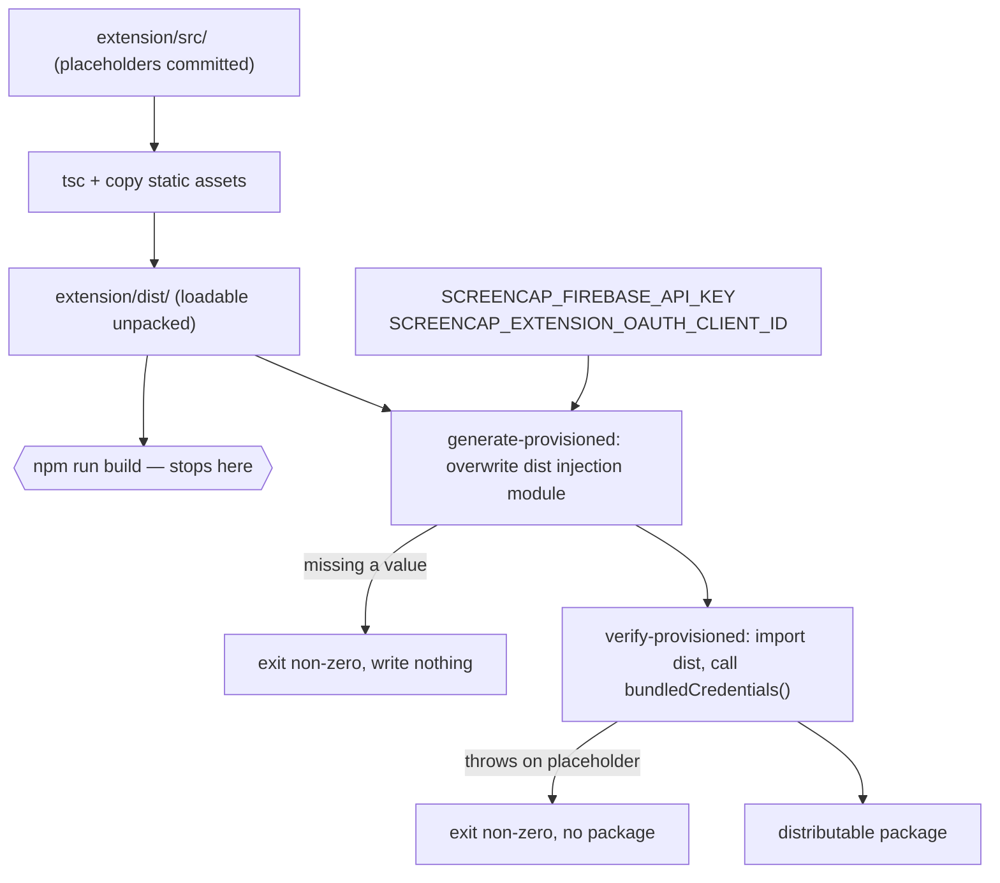
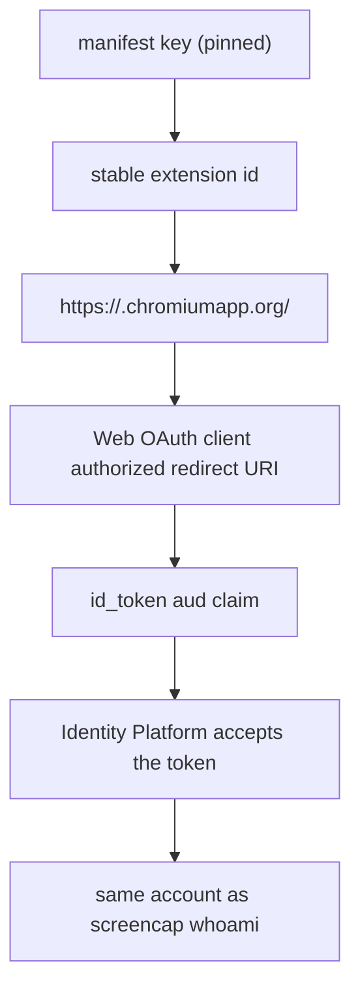

# Extension OAuth Provisioning and Release Guard - Plan

## Goal Capsule

- **Objective:** Make browser-tier sign-in real — provision the extension's OAuth client, inject its credentials at build time, and refuse to package a build that still carries the un-provisioned sentinels.
- **Repo:** screencap, almost entirely under `extension/`. One CI workflow change lives at the repo root.
- **Product authority:** The Product Contract governs behavior; the Planning Contract governs mechanism within it. This plan owns the extension's credential path and its packaging gate. It does not own the Chrome Web Store listing, the website sign-in surface, or any capture unit.
- **Execution profile:** Six units, each landing as its own commit. U2 is operator work in the Google Cloud console with no code; every other unit is code or config.
- **Stop conditions:** Stop and surface rather than guessing when Identity Platform rejects the extension's ID token (KTD5's audience assumption is wrong and minting a parallel identity is not the answer), or when the existing Firebase Web API key turns out to carry referrer restrictions that a `chrome-extension://` origin cannot satisfy.
- **Open blockers:** None. U2 requires an operator with Google Cloud console access on the Firebase project, and the preferred id-minting path in KTD1 requires a Chrome Web Store developer account; both have documented fallbacks.
- **Tail ownership:** The implementer owns branch, commits, and PR. U6 is a manual acceptance check a human performs in Chrome — it cannot be automated and should not be claimed as passing without being run.

---

## Product Contract

### Summary

Provision a Google Web OAuth client for the extension, inject its client id and the existing Firebase Web API key into the extension build, and add a packaging step that fails rather than emitting a package whose credentials are still placeholders. Console provisioning is operator work recorded in the existing cloud-auth runbook; the code is the plumbing that consumes it.

### Problem Frame

`extension/src/auth/` is complete and tested, but nothing provisions it. `extension/src/auth/credentials.ts` carries `UNPROVISIONED_FIREBASE_API_KEY` and `UNPROVISIONED_OAUTH_CLIENT_ID` sentinels, and `bundledCredentials()` throws on them — so an un-provisioned build fails loudly at first sign-in instead of shipping broken. That is the fail-closed floor, not the feature.

The consequence is that the browser tier's first unit cannot meet its own done-when: "loads unpacked, a user signs in, resolved account matches `screencap whoami`" (see origin: `docs/plans/2026-07-29-001-feat-chrome-extension-browser-tier-plan.md`, U1). No build has ever completed a real sign-in, so the assumption underneath the whole tier — that a Chrome extension and the macOS CLI resolve to the same account against one Firebase project — is unverified. The browser-tier plan names that assumption as a risk and asks U1 to prove it first.

There is an ordering problem in the way. The OAuth client's authorized redirect URI is `https://<extension-id>.chromiumapp.org/`, so the client cannot be created until the extension has an id — and an unpacked build's id is derived from its install path unless the manifest pins a `key`.

The CLI already solved the injection half of this for its own credentials: `scripts/generate_provisioned.py` writes a gitignored module, `.github/workflows/release.yml` runs it before PyInstaller, and `screencap _auth-config-check` fails the release on the built binary. The extension needs the same shape, adapted to a toolchain where a missing import is a compile error rather than a catchable exception.

### Requirements

**Credential provisioning**

- R1. A Google **Web** OAuth client exists in the same Google Cloud project as the Firebase tenant the CLI authenticates against, with `https://<extension-id>.chromiumapp.org/` registered as an authorized redirect URI.
- R2. The extension has an id that is stable across unpacked builds and across machines, pinned in `extension/manifest.json`.
- R3. What was provisioned, where, and which values the build consumes is recorded in `docs/runbooks/cloud-auth-setup.md` alongside the CLI's entry, with the values themselves kept out of git.

**Build-time injection**

- R4. A packaged build resolves non-placeholder values for both `firebaseApiKey` and `oauthClientId`.
- R5. Injection fails closed: a build that does not receive both values writes no injected output and exits non-zero.
- R6. The extension's OAuth client id is supplied through a variable distinct from the CLI's desktop client id, so the wrong client cannot be bundled silently.
- R7. A plain source checkout with no injection still typechecks, tests, and builds a loadable unpacked extension carrying the placeholders.

**Release guard**

- R8. Packaging refuses to emit a distributable package whose resolved credentials are still placeholders.
- R9. The guard runs against the built output, not against source.
- R10. The placeholder sentinels and the committed injection-point values cannot drift apart undetected.

**Continuous integration**

- R11. The extension's typecheck and test suite run on CI for every pull request that could affect them.
- R12. CI asserts that the guard itself rejects an un-provisioned build.

**Acceptance**

- R13. A user signs in through the unpacked extension in Chrome and the resolved account matches what `screencap whoami` reports for the same person on a machine with the CLI installed.

### Acceptance Examples

- AE1. Un-provisioned packaging is rejected.
  - **Covers:** R5, R8
  - **Given:** a checkout with neither credential variable set in the environment
  - **When:** the packaging command runs
  - **Then:** it exits non-zero, names the missing variables, and leaves no distributable package behind

- AE2. A provisioned package carries real credentials.
  - **Covers:** R4, R9
  - **Given:** both credential variables set to real provisioned values
  - **When:** the packaging command runs
  - **Then:** the guard reads the built output, finds no placeholder, and a distributable package is produced

- AE3. A dev build stays usable without credentials.
  - **Covers:** R7
  - **Given:** a plain checkout with no environment variables set
  - **When:** the ordinary build command runs
  - **Then:** it succeeds and produces a loadable unpacked extension whose first sign-in attempt throws the "built without provisioned credentials" error

- AE4. Sentinel drift is caught.
  - **Covers:** R10
  - **Given:** the committed injection-point placeholder is edited so it no longer matches the sentinel `isPlaceholderCredential` compares against
  - **When:** the test suite runs
  - **Then:** a test fails, rather than the guard silently accepting an un-provisioned build

- AE5. One account across two surfaces.
  - **Covers:** R13
  - **Given:** a person signed into `screencap` on a machine with the CLI installed
  - **When:** that person signs in through the unpacked extension in Chrome
  - **Then:** the account shown in the popup is the same account `screencap whoami` reports

### Scope Boundaries

- Chrome Web Store **publication** is out of scope. An unpublished draft upload is used only to mint a stable key under KTD1's preferred path; nothing is submitted for review.
- The website sign-in surface (SCR-306) and every capture unit (SCR-307, SCR-308) are untouched. This plan has no code dependency on them.
- The existing Firebase Web API key is consumed as-is. Rotating it, narrowing its API restrictions, or minting a second key for the extension is not part of this work.
- The CLI's credential path — `src/screencap/auth.py`, `scripts/generate_provisioned.py`, `_auth-config-check`, and the release workflow's provisioning steps — is read as a pattern and left unmodified.
- The stale "macOS app and CLI are the only auth surface" comment at `src/screencap/auth.py:3` is corrected by the browser tier's website unit (see origin), not here.

#### Deferred to Follow-Up Work

- Swapping the pinned manifest key for the Chrome Web Store's own public key, and adding the store's redirect URI to the OAuth client, when the listing is created. Additive console and manifest changes; see KTD1.
- A separate dev/prod OAuth client split. One client covers the current single-id world; a second id (store vs. unpacked) is what would force the split.

### Dependencies / Assumptions

- An operator has Google Cloud console access on the Firebase project the CLI authenticates against (`proteus-photos`, per `docs/runbooks/cloud-auth-setup.md`).
- The existing Firebase Web API key is restricted by API (Identity Toolkit + Token Service) and not by HTTP referrer. A referrer restriction would block a `chrome-extension://` origin; U2 verifies this rather than assuming it.
- `chrome.identity.getRedirectURL()` called with no path returns `https://<extension-id>.chromiumapp.org/` **with** a trailing slash, and Google matches authorized redirect URIs exactly. The runbook records the URI verbatim.

---

## Planning Contract

### Key Technical Decisions

- KTD1. **Pin the extension id with a manifest `key`, minted from an unpublished Chrome Web Store draft upload where possible.** (session-settled: user-directed — chosen over provisioning against a published Web Store id: sign-in has to be exercisable against an unpacked build now, and waiting on a listing blocks the ticket's done-when.) Google's documented workflow is to upload the packaged zip to the Developer Dashboard without publishing, copy the item's public key, and pin it — which makes the unpacked id and the eventual store id the same id, permanently. That path needs a developer account; without one, generate a keypair locally and pin its public key instead, accepting that the store will later assign a different id and the store's redirect URI gets added to the same OAuth client as a second entry. Both paths satisfy R2 today; the draft-upload path additionally removes the future migration. Governs R1, R2.

- KTD2. **Inject by overwriting a dedicated generated module in `dist/`, not by writing a gitignored module into `src/`.** The Python original tolerates an absent `_provisioned` module because `ImportError` is catchable at runtime; TypeScript cannot — a missing import breaks `tsc --noEmit` and vitest in every plain checkout, which would violate R7. A committed single-purpose module holding the placeholder literals keeps source-only workflows green, and the build overwrites its **compiled** output after `tsc` runs. This holds only while `tsc` is the last thing to touch that file: a bundler adopted for a later capture unit would inline the placeholder constants at build time, leaving nothing to overwrite and a guard that passes a package which cannot sign in. Adopting one means moving injection into the bundler's define step. Governs R4, R5, R7.

- KTD3. **The guard runs against the built output by importing it and calling `bundledCredentials()`.** This mirrors `_auth-config-check` running on the PyInstaller binary rather than on source: it catches "forgot to inject" and "injection did not reach the output" with one check, and it exercises the exact function a user's first sign-in calls. `isPlaceholderCredential` is what that function consults, so the guard inherits the sentinel comparison rather than re-implementing it. Governs R8, R9.

- KTD4. **Guard enforcement is split by command, not by an environment marker.** The CLI gates `_auth-config-check` on `SCREENCAP_RELEASE_BUILD` because the same binary is built on PRs and on tags. The extension has two distinct commands available: the ordinary build stays green with placeholders, and the packaging command — which exists only to produce something distributable — enforces unconditionally. No marker to forget, and the only scripted path that produces a distributable enforces the guard. A hand-assembled archive of the build output still bypasses it (U1 does exactly that to mint a key), but such an archive carries the placeholders and cannot sign in. Governs R7, R8.

- KTD5. **The extension's Web OAuth client lives in the same Google Cloud project as the Firebase tenant.** Identity Platform rejects a Google ID token whose `aud` is an OAuth client it does not recognize, surfacing as an opaque `INVALID_IDP_RESPONSE: id_token audience mismatch`. Same-project creation is the condition under which the client is recognized. Same-project is necessary but may not be sufficient — some tenants also require the client id in the Google sign-in provider's allowed-client list. If sign-in fails with an audience mismatch despite same-project creation, adding the client id there is the first remedy; a failure that survives both is the stop condition in the Goal Capsule. Governs R1, R13.

- KTD6. **The extension's client id gets its own environment variable name, distinct from the CLI's.** `SCREENCAP_OAUTH_CLIENT_ID` already carries the Google **Desktop** client id used by the CLI, and both values are present in the same `.env` and the same GitHub Secrets namespace. Reusing the name would bundle the desktop client id into the extension, which fails at sign-in with the audience mismatch above rather than at build time. The Firebase Web API key is genuinely the same value and reuses its existing name. Governs R6.

- KTD7. **The extension gets its own CI job rather than joining an existing one.** (session-settled: user-directed — chosen over deferring CI to a follow-up ticket: nothing runs the extension's typecheck or tests on CI today, so the guard's own tests would not run anywhere automated.) `CLAUDE.md` already records `extension/` as a self-contained npm sub-project sharing no build with the Python layer, and the existing jobs are Python-lane jobs. The job runs build-level checks only — packaging needs secrets, so CI asserts the guard's **rejection** path instead. Governs R11, R12.

### High-Level Technical Design

The build has two exits. The ordinary build stays green with placeholders so a source checkout is workable; the packaging path injects, verifies, and only then produces something distributable.

The provisioning chain runs the other way and explains why U1 must land before U2. Each link is determined by the one above it, which is the ordering problem the ticket names.

### Assumptions

- The Chrome Web Store draft-upload path in KTD1 needs a registered developer account. If none exists when U1 runs, the local-keypair fallback is taken without stopping the unit.

### Sequencing

U1 comes first — every other credential-facing unit needs a stable id. U2 (console provisioning) and U3 (injection code) are independent of each other once U1 lands: U3 can be written and tested against fake values before any real client exists. U5 (CI) is independent of everything. U6 is the acceptance gate and needs U2 and U4 both done.

### Risks & Dependencies

- **Identity Platform rejects the extension's ID token.** The whole tier rests on one Firebase project resolving both surfaces to one uid, and this plan is the first time that is exercised. KTD5 is the mitigation; a rejection is a stop condition, not something to route around by minting a second identity.
- **`redirect_uri_mismatch` from a trailing-slash or path difference.** Google matches authorized redirect URIs exactly, and the extension sends whatever `chrome.identity.getRedirectURL()` returns. U2 records the URI verbatim rather than reconstructing it by hand.
- **The Firebase Web API key may carry referrer restrictions.** The runbook documents API restrictions, not referrer restrictions, but that is inference from a document rather than an observation of the key's current configuration. U2 checks.
- **`extension/manifest.json` is contended.** SCR-307 is in flight in a separate worktree and edits the same manifest to add optional host permissions. U1's `key` addition is a one-line change, but expect a merge.
- **A locally minted key strands the id.** If the fallback path in KTD1 is taken, the eventual store id differs and the OAuth client needs a second redirect URI. Additive and cheap, but it must be written down when it happens or it becomes a mystery later.

### System-Wide Impact

- **The repo gains a second build-time credential injection path.** The Python one and the extension one share a shape and a runbook but no code, and they read different environment variables (KTD6). `docs/runbooks/cloud-auth-setup.md` becomes the single operator source of truth for both — U2 extends it rather than starting a parallel document.
- **CI gains its first non-Python job.** Existing jobs are Python lanes; this adds a Node lane that runs on every pull request.
- **Secrets namespace grows by one.** A new repository secret carries the extension's OAuth client id. It is non-confidential by design — as the CLI's already are — but it is one more value an operator must set before a packaging run in CI ever works.

---

## Implementation Units

### U1. Pin a stable extension id

- **Goal:** The unpacked extension has the same id on every machine and every install path, so a redirect URI can be provisioned against it.
- **Requirements:** R2. Enables R1.
- **Dependencies:** none
- **Files:** `extension/manifest.json`, `extension/src/auth/manifest.test.ts`
- **Approach:**
  1. Mint the key. Preferred: run the ordinary build, zip `extension/dist/` by hand, upload it to the Chrome Web Store Developer Dashboard **without publishing**, and copy the item's public key from the Package tab (single line, newlines stripped). Fallback when no developer account exists: generate an RSA keypair locally and use its base64 public key.
     - The uploaded zip carries no `key` field — the store mints the keypair on first upload, and the field is what pins its public half afterward.
     - Deliberately not the packaging command from U4: that command does not exist yet at this point in the sequence, and once it does it refuses to emit a zip without credentials, which is what this unit is unblocking. The circularity is only apparent — a plain build zip is enough to mint a key.
     - A developer account is not the only prerequisite the upload can trip on: store package validation checks the manifest too, and this one declares no icons. If the upload is refused for any store-side package requirement, take the local-keypair fallback. Do not add icons or listing assets to get past it — publication is explicitly out of scope, and satisfying the store here would pull it back in.
  2. Add the value as `key` in `extension/manifest.json`.
  3. Load the unpacked build at `chrome://extensions` and record the resulting id — it is the input to U2 and belongs in the runbook, not only in a terminal.
  4. Record which path was taken. The fallback carries a follow-up obligation (a second redirect URI later); the draft-upload path does not.
- **Patterns to follow:** none in-repo — this is the extension's first manifest field that is environment-facing rather than behavior-facing.
- **Test scenarios:**
  - The manifest parses and carries a non-empty `key` that is not a placeholder string.
  - The manifest still declares the `identity` and `storage` permissions the auth path needs, so pinning the key did not disturb the existing permission set.
- **Verification:** The extension loads unpacked in Chrome, and the id shown at `chrome://extensions` is identical after removing and re-adding it from a different directory.

### U2. Provision the Web OAuth client and record it

- **Goal:** A Web OAuth client exists that will accept the extension's sign-in request, and what was provisioned is written down.
- **Requirements:** R1, R3. Advances AE5.
- **Dependencies:** U1
- **Files:** `docs/runbooks/cloud-auth-setup.md`
- **Approach:**
  1. In the **same** Google Cloud project as the Firebase tenant (per KTD5), create an OAuth client of type **Web application** named for the extension.
  2. Add `https://<extension-id>.chromiumapp.org/` from U1 as an authorized redirect URI, verbatim including the trailing slash. Authorized JavaScript origins are not needed — `launchWebAuthFlow` is a redirect flow, not a browser-origin flow.
  3. Inspect the existing Firebase Web API key's restrictions and confirm they are API restrictions only. A referrer restriction blocks the extension and must be resolved before U6 can pass.
  4. Check whether the tenant's Google sign-in provider carries an allowed-client list. If it does, add the new client id per KTD5 — this is the remedy for an audience mismatch and is cheaper to do now than to diagnose from an opaque error during U6.
  5. Extend `docs/runbooks/cloud-auth-setup.md` with a browser-tier section: the extension id, the redirect URI verbatim, the client id, which project holds it, which key-minting path U1 took, whether the provider allow-list needed the client, and the environment variable names the build reads. Follow the existing runbook's convention — record what was provisioned and where, keep secret material in the gitignored `.env`.
  6. Add the client id to the gitignored `.env` and as a repository secret, under the name U3 establishes.
- **Patterns to follow:** the existing runbook's structure and its "non-secret by design, still not committed" framing.
- **Test scenarios:** Test expectation: none — this unit is console configuration and documentation with no code path to exercise. U6 is where the provisioned client is proven to work.
- **Verification:** The runbook section names the extension id, the exact redirect URI, and the client id, and a reader who has never seen this work could reproduce the console state from it.

### U3. Build-time credential injection

- **Goal:** A build supplied with both credential values produces output carrying them; a build without them produces nothing and fails.
- **Requirements:** R4, R5, R6, R7, R10.
- **Dependencies:** U1
- **Files:** `extension/src/auth/provisioned.ts`, `extension/src/auth/credentials.ts`, `extension/src/auth/credentials.test.ts`, `extension/scripts/generate-provisioned.mjs`, the generator's test file (see the placement note below), `extension/package.json`
- **Approach:**
  1. Extract the two injected values into a new committed single-purpose module, `extension/src/auth/provisioned.ts`, exporting them as the placeholder literals. It is the only build-time injection point and holds no logic.
  2. Have `credentials.ts` build `PROVISIONED` from that module's exports. `DEFAULT_FIREBASE_API_KEY`, `DEFAULT_OAUTH_CLIENT_ID`, `isPlaceholderCredential`, and `bundledCredentials` stay where they are and keep their current behavior — the placeholder throw is the floor this unit builds on, not something to replace. Update the module docstring's "Not yet wired" note, which becomes wrong here.
  3. Write `extension/scripts/generate-provisioned.mjs`, mirroring `scripts/generate_provisioned.py`: read the two environment variables, delete any stale output **first** so a fail-closed exit cannot leave a previous run's values behind, and exit non-zero naming the missing variables when either is absent. On success it writes the compiled injection module into `dist/`, overwriting what `tsc` emitted. Print the path only, never the values.
  4. Read the Firebase key from the existing `SCREENCAP_FIREBASE_API_KEY` and the client id from a new, extension-specific variable name (KTD6).
  5. Add an npm script for the generator. It runs after `tsc`, never before — it overwrites compiled output.
  6. Give the script a callable entry that takes its environment and output directory as arguments and returns a status, with a thin wrapper that reads the real environment and sets the exit code. Its failure paths are the ones worth testing, and spawning a subprocess per scenario to observe an exit code is slower and flakier than calling the entry directly.
  7. Decide where script tests live before writing them, and apply the same choice in U4. `extension/vitest.config.ts` collects `src/**/*.test.ts` and `extension/tsconfig.json` includes `src` only, so a test placed beside the script in `extension/scripts/` would be silently collected by neither — a green suite that ran nothing. Either put the script tests under `src/` or widen both globs to cover `scripts/`; do not leave the placement implicit.
- **Patterns to follow:** `scripts/generate_provisioned.py` for the fail-closed shape, the delete-stale-first ordering, the GitHub Actions `::error::` annotation on stdout alongside human-readable stderr, and the never-echo-the-values rule.
- **Execution note:** Write the sentinel-drift test (below) before the extraction. It is the one failure mode this restructuring introduces, and it is cheap to prove first.
- **Test scenarios:**
  - The committed injection-point values are exactly equal to the `DEFAULT_*` sentinels `isPlaceholderCredential` compares against — the drift guard for AE4.
  - `bundledCredentials()` still throws on the committed placeholders, so the existing fail-closed behavior survived the extraction.
  - `bundledCredentials()` returns both values when the injection module holds real-looking ones.
  - The generator exits non-zero and writes nothing when only the Firebase variable is set.
  - The generator exits non-zero and writes nothing when only the client-id variable is set.
  - The generator removes a stale injected module before failing, so a prior run's values cannot survive a failed one.
  - The generator writes both values when given both.
- **Verification:** With both variables set, a build followed by the generator produces a `dist/` whose credentials module carries the injected values; with neither set, the generator fails and `dist/` still carries the placeholders.

### U4. Packaging with the release guard

- **Goal:** A distributable package can be produced, and cannot be produced from an un-provisioned build.
- **Requirements:** R8, R9. Advances AE1, AE2.
- **Dependencies:** U3
- **Files:** `extension/scripts/verify-provisioned.mjs`, `extension/package.json`, `extension/.gitignore`, the guard's test file (same placement decision as U3 step 7 — the two must agree)
- **Approach:**
  1. Write `extension/scripts/verify-provisioned.mjs`: import the **built** credentials module from `dist/` and call `bundledCredentials()`. A throw is a guard failure — exit non-zero with a message naming the generator and the runbook, the way `_auth-config-check` does. Success prints a confirmation and nothing else. Follow U3's split: a callable entry taking the directory to check, plus a thin exit-code wrapper, so the scenarios below can point it at fixture directories.
  2. Add a packaging npm script chaining build, generate, verify, then archive `dist/` into a versioned zip at the extension root.
  3. Gitignore the zip.
  4. Keep the ordinary build script unchanged so it stays green with placeholders (KTD4). Packaging is the only enforcing path.
- **Patterns to follow:** `src/screencap/cli/__init__.py:6386` (`_auth-config-check`) for the guard's shape and its error message's "here is how to fix it" ending; `.github/workflows/release.yml` for running the guard immediately after the build and before anything else.
- **Test scenarios:**
  - The guard exits non-zero against a `dist/` built without injection.
  - The guard exits zero against a `dist/` whose injection module carries real-looking values.
  - The guard fails rather than passing when `dist/` is absent entirely, so a missing build is not mistaken for a clean check.
  - Packaging from a checkout with no credential variables set exits non-zero and leaves no zip behind.
  - Packaging with both variables set produces a zip containing the manifest and the compiled service worker.
- **Verification:** Packaging without the variables fails and no zip exists; packaging with them produces a zip whose extracted credentials module carries the injected values.

### U5. Extension CI lane

- **Goal:** The extension's checks run automatically, including proof that the guard rejects an un-provisioned build.
- **Requirements:** R11, R12.
- **Dependencies:** none
- **Files:** `.github/workflows/ci.yml`
- **Approach:**
  1. Add a job running unconditionally on ubuntu with Node and an `npm ci` install. The existing jobs are Python lanes; this is a separate job, not a step bolted onto one. Deliberately not path-scoped: GitHub Actions filters paths at the workflow trigger, not per job, and `.github/workflows/ci.yml` declares no `paths:` today — so scoping this job would mean a second workflow file or a changed-files action. A Node typecheck and vitest run on ubuntu costs seconds, and the lanes worth protecting from needless runs are the 10x-billed macOS ones, so the filter machinery does not earn its keep here.
  2. Run typecheck, the vitest suite, and the ordinary build — the three commands `CLAUDE.md` already documents for the sub-project.
  3. Assert the guard directly: after the build, run the verify script against the placeholder `dist/` and require a non-zero exit. Do **not** assert this by running the packaging command — packaging runs the generator first, which exits on the missing variables before the guard is ever reached, so that route would prove the generator's fail-closed path while reporting it as the guard's. No secrets are needed either way.
  4. Do not run a provisioned packaging build on CI. There is no release pipeline for the extension yet, and adding secret plumbing without one is scope this ticket does not carry.
- **Patterns to follow:** the existing job structure in `.github/workflows/ci.yml` — concurrency group and explicit `permissions`.
- **Test scenarios:** Test expectation: none — the job *is* the test harness. Its correctness is proven by the workflow running green on a PR that touches `extension/`, and red on a deliberately broken typecheck.
- **Verification:** The job runs on a PR and passes on the current tree, with the guard step reporting a non-zero exit that the workflow treats as expected.

### U6. End-to-end sign-in acceptance

- **Goal:** A real sign-in in Chrome resolves to the same account the CLI reports — the assumption the whole browser tier rests on.
- **Requirements:** R13. Covers AE5.
- **Dependencies:** U2, U4
- **Files:** `docs/runbooks/cloud-auth-setup.md`
- **Approach:**
  1. Build with real injected credentials and load the result unpacked in Chrome.
  2. Sign in through the popup. Confirm the id at `chrome://extensions` still matches the one U2 provisioned against — a mismatch here is the redirect URI failing, not the credentials.
  3. On a machine with the CLI installed and the same person signed in, run `screencap whoami` and compare the resolved account against the popup's.
  4. Prove the stored refresh credential works — **without** signing out first. Let the ID token age past its refresh buffer, or restart the service worker, then reopen the popup and confirm the session restores with no interactive prompt.
  5. Only then sign out, and confirm the popup returns to signed-out and the stored credential is gone. Sign-out deletes that credential, so a sign-in after this step is expected to prompt; that prompt is correct behavior, not a failure.
  6. Append the result to the runbook's browser-tier section as a live execution log entry, matching how the CLI's provisioning was recorded — including the date and which account was used.
- **Patterns to follow:** the "Live execution log" convention already used in `docs/runbooks/cloud-auth-setup.md`.
- **Execution note:** This is manual verification a human performs in a browser. It cannot be automated and must not be reported as passing on the strength of the code looking correct.
- **Test scenarios:** Test expectation: none — manual acceptance. The automated coverage for the auth path already exists in `extension/src/auth/firebase.test.ts`; what is unproven is the provisioned configuration, which only a real sign-in exercises.
- **Verification:** The popup shows an account, `screencap whoami` reports the same account, and the runbook carries a dated log entry saying so.

---

## Verification Contract

All commands run from `extension/` unless noted.

| Gate | Command | Applies to | Signal |
|---|---|---|---|
| Type check | `npm run typecheck` | U1, U3, U4 | Clean `tsc --noEmit` over `src/` including tests |
| Unit tests | `npm test` | U1, U3, U4 | Vitest green, including the sentinel-drift test |
| Dev build | `npm run build` | U1, U3 | Emits a loadable unpacked extension into `dist/` with placeholders intact |
| Guard rejection | verify script against a placeholder `dist/` | U4, U5 | Non-zero exit |
| Packaging rejection | packaging command with no credential variables set | U4 | Non-zero exit, no zip produced |
| Guard acceptance | packaging command with both variables set | U4 | Zero exit, zip produced carrying injected values |
| CI lane | the new job on any PR | U5 | Job runs and passes |
| Acceptance | manual sign-in in Chrome vs. `screencap whoami` | U6 | Same account on both surfaces |

The Python test suite is not affected — no file under `src/screencap/` or `tests/` changes. Do not run `pytest` as evidence for this plan.

---

## Definition of Done

**Global**

- A packaged build carries non-placeholder credentials, and the packaging command rejects one that does not.
- A plain checkout with no environment variables still typechecks, tests, and builds a loadable unpacked extension.
- A real sign-in in Chrome resolves to the same account `screencap whoami` reports for the same person.
- `docs/runbooks/cloud-auth-setup.md` carries a browser-tier section recording the extension id, the exact redirect URI, the client id's project, the environment variable names, and a dated acceptance log entry.
- No credential value appears in git, in a commit message, or in any command's output.
- Abandoned scaffolding is removed — no unused injection module variants, no dead scripts from approaches that did not pan out, no commented-out packaging steps.

**Per unit**

| Unit | Done signal |
|---|---|
| U1 | The unpacked id is identical across install paths, and which key-minting path was taken is written down |
| U2 | The runbook section is reproducible by someone who did not do the work; the Firebase key's restrictions were inspected, not assumed |
| U3 | Both generator failure paths write nothing and exit non-zero; the sentinel-drift test fails when the placeholder is edited |
| U4 | Packaging fails without credentials and succeeds with them; the guard reads `dist/`, not `src/` |
| U5 | The job runs on a PR and its assertion invokes the guard itself, not the generator standing in for it |
| U6 | Both surfaces report the same account, and the runbook says so with a date |

---

## Sources / Research

- `extension/src/auth/credentials.ts` — the placeholder sentinels, `isPlaceholderCredential`, and the `bundledCredentials()` throw this plan wires up.
- `extension/src/auth/firebase.ts:131-155` (`chromeAuthDeps`) — where `bundledCredentials` is injected and where `chrome.identity.getRedirectURL()` supplies the redirect URI; `signIn` sends that URI to Google and as `requestUri` to Identity Platform.
- `scripts/generate_provisioned.py` — the fail-closed generator this plan mirrors, including delete-stale-first and the Actions annotation.
- `src/screencap/cli/__init__.py:6386` (`_auth-config-check`) — the guard-on-built-output pattern and its error-message shape.
- `.github/workflows/release.yml:63-96` — generate-then-verify ordering, and the "run the credential check before the smoke tests" rationale.
- `docs/runbooks/cloud-auth-setup.md` — the operator record convention and the CLI's existing provisioned values.
- [Chrome extension manifest `key` field](https://developer.chrome.com/docs/extensions/reference/manifest/key) — the draft-upload-then-copy-public-key workflow that makes the unpacked id and the store id identical.
- [Adding Sign In with Google OAuth to a Chrome Extension](https://www.xiegerts.com/post/chrome-extension-oauth-web-auth-flow-firebase-google/) — Web-client type and the `chromiumapp.org` redirect registration; note it does not cover the same-project audience constraint, which KTD5 does.
- [Firebase `INVALID_IDP_RESPONSE` audience mismatch reports](https://github.com/GodotNuts/GodotFirebase/issues/68) — the failure mode KTD5 exists to avoid.
