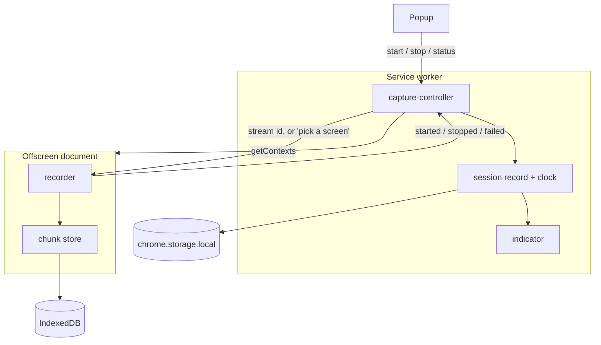

# Browser tier U3 - video capture with a recording indicator - Plan

## Goal Capsule

- **Objective:** A user starts and stops a recording in the Screencap Chrome extension and gets a video of the source they chose, with a running indicator that stays truthful when Chrome suspends the service worker.
- **Ticket:** [SCR-308](https://linear.app/zk-email/issue/SCR-308/browser-tier-u3-video-capture-with-a-recording-indicator). This is unit U3 of the browser-tier plan (`docs/plans/2026-07-29-001-feat-chrome-extension-browser-tier-plan.md`), which is the Product Contract authority. Requirements keep that plan's R-IDs; Key Decisions there still govern.
- **U-ID scope:** The `U1`-`U5` IDs below are **local to this plan**. The parent plan's units are referred to by name (`browser-tier U4`, `browser-tier U5`) to avoid collision.
- **Repo:** screencap. All paths are relative to the repo root; the extension is a self-contained npm sub-project under `extension/` with its own toolchain.
- **Depends on:** browser-tier U1 (SCR-305, landed — `extension/` scaffold and account sign-in).
- **Blocks:** browser-tier U5 (SCR-313, artifact assembly), which consumes this unit's recording handle and clock.
- **Stop conditions:** Stop and surface rather than guessing if the display picker cannot be driven from an offscreen document (see Risk 1 — the documented fallback is tab-capture-only), or if any change here would alter how the macOS app captures or stores recordings.
- **Open blockers:** None.
- **Product Contract preservation:** changed — R11's "an origin outside the list is never captured" is scoped to tab capture, because whole-screen capture cannot honor it. Confirmed at plan scoping; see KTD6. All other Product Contract meaning and IDs are unchanged.

---

## Product Contract

### Summary

The service worker acquires a capture source and opens an offscreen document that owns the `MediaRecorder`. The offscreen document persists timesliced chunks to IndexedDB as they arrive and stopping returns a handle to them, not a video blob. Running state lives in a persisted session record reconciled against live offscreen-document presence, so the indicator survives service-worker suspension.

### Problem Frame

MV3 service workers have no DOM and are suspended after roughly 30 seconds idle, so a `MediaRecorder` cannot live in one. The parent plan settled the host question in KTD1: an offscreen document. What that leaves open is everything the seam implies.

An offscreen document does not keep the service worker alive, and does not need to — it has no lifetime limit of its own, so recording continues while the worker sleeps. What dies is the worker's memory. Any running-state flag held there is gone on revival, which is why the ticket calls for state derived from storage rather than in-memory flags. Storage alone is not enough either: a browser crash leaves a record claiming "recording" with nothing behind it.

The seam is also narrower than it looks. An offscreen document can use only the `chrome.runtime` API — no `chrome.storage`, no `chrome.tabCapture`. And extension messaging is JSON-serialized by default, so a video `Blob` does not survive the trip back to the worker. The unit's stated outcome, "hands the recorded blob to the caller", cannot be done literally at the Chrome version floor this extension declares.

### Key Decisions

Carried from the parent plan, unchanged:

- **Session-based record-and-share, not ambient always-on capture.** Makes the source picker ordinary UX rather than added friction. Governs R1, R2.
- **Privacy comes from not capturing, not from masking afterward.** Governs R11, R14. This unit narrows the reach of that promise for one capture source; see KTD6.

### Actors

- A1. Recording user — starts and stops recordings, and needs to know one is running.
- A2. Chrome extension — the service worker, the offscreen document, and the popup.

### Requirements

In scope for this unit, carrying the parent plan's IDs:

- R1. A1 starts and stops a recording explicitly from the extension, and capture runs only between those two actions.
- R2. Each recording captures video of the source A1 selects when starting it.
- R13. While a recording is running, A1 can see that it is running and what source it is capturing.

Advanced but not completed here:

- R4. A recording is never lost silently. Chunk-level persistence means an interrupted recording survives up to its last chunk; telling A1 about a failed **upload** belongs to browser-tier U6.
- R11. Origin-scoped capture. This unit builds pause/resume as mechanism with no policy; the allow-list that triggers it is browser-tier U2 and U4. See KTD4 and KTD6.
- R16. Durable recording shape. The recording clock and the paused-interval record defined here are what later consumers align against; the artifact shape itself is browser-tier U5.

### Key Flows

- F1a. Recording a browser session (the capture half of the parent plan's F1)
  - **Trigger:** A1 picks a source in the popup and clicks record.
  - **Actors:** A1, A2
  - **Steps:** The extension resolves the chosen source; an offscreen document opens and begins recording; chunks persist as they arrive; the indicator reports running state and source throughout, including after the service worker is suspended and revived; A1 stops; the stream is released, the document closes, and a handle to the stored recording is returned.
  - **Outcome:** A1 has a playable video of the source they chose and knows the recording ended.
  - **Covered by:** R1, R2, R13

### Acceptance Examples

- AE-U3-1. Running state survives service-worker suspension
  - **Covers R13.**
  - **Given** a recording is running,
  - **When** Chrome suspends and later revives the service worker,
  - **Then** the indicator still reports that a recording is running and names the same source it named before.

- AE-U3-2. A crashed recording does not read as running
  - **Covers R13.**
  - **Given** the session record says a recording is running but no offscreen document exists,
  - **When** A1 opens the popup,
  - **Then** A1 is told the recording was interrupted rather than shown a recording still in progress, and starting a new one is allowed.

- AE-U3-3. A second recording is refused
  - **Covers R1.**
  - **Given** a recording is running,
  - **When** a start is requested again,
  - **Then** it is refused with the running recording named, and the running recording is untouched.

- AE-U3-4. Cancelling the picker leaves nothing behind
  - **Covers R1.**
  - **Given** A1 chose whole-screen capture,
  - **When** A1 dismisses Chrome's source picker,
  - **Then** no offscreen document remains open, no session record claims a running recording, and no chunks were written.

Partially advanced — the video half of the parent plan's AE5 ("the finished recording contains no frames of it") becomes reachable once the allow-list supplies the trigger; this unit proves pause/resume produces a video with no frames from the paused window.

### Scope Boundaries

**Deferred for later**

- Audio capture. No requirement asks for it, and capturing tab audio mutes the tab for the person being recorded unless the stream is echoed back through an `AudioContext` — cost with no requirement behind it.
- Artifact assembly and filename conformance to the macOS shape (browser-tier U5).
- Upload and the pre-upload disclosure (browser-tier U6).
- Deciding *when* to pause — the origin allow-list (browser-tier U2) and the content script that watches navigation (browser-tier U4).

**Outside this product's identity**

- A general screen recorder whose only output is a video file. This unit produces video, but the recording clock it establishes exists so the event stream can align to it.

**Deferred to follow-up work**

- Recovering orphaned chunks from a browser crash into a finished recording. This unit makes the chunks survive and marks the session interrupted; turning that into a recoverable artifact needs the assembly unit to exist first.
- Codec negotiation beyond a supported-type probe. Whatever the artifact unit needs is decided there.

### Dependencies / Assumptions

Verified in the codebase:

- `extension/` is a working MV3 scaffold with sign-in landed: `extension/manifest.json` declares `minimum_chrome_version: 116` and permissions `identity`, `storage`.
- `extension/src/background/service-worker.ts` already owns a `chrome.runtime.onMessage` listener that declines unrecognized messages so later units can add their own, and gates senders with `isTrustedSender` (content scripts refused). Its test already asserts that a `capture.start` message is declined by the auth listener.
- `extension/scripts/copy-static.mjs` discovers `src/**/*.html` rather than hard-listing entry points, explicitly so an offscreen document lands in `dist/` without a build change.
- The dependency-injection idiom is established: a `Deps` interface plus a `chromeXDeps()` factory (`extension/src/auth/firebase.ts`), with decisions split into pure functions (`extension/src/popup/view.ts`) so they test without a browser.

Verified externally:

- A `chrome.tabCapture.getMediaStreamId()` stream id obtained in the service worker after a user gesture **can** be consumed in an offscreen document via `getUserMedia` — this cross-context path was added in Chrome 116.
- A `chrome.desktopCapture.chooseDesktopMedia()` stream id **cannot**. The Chrome extensions team confirmed the API is not designed to cross execution contexts; consuming it in an offscreen document throws `InvalidStateError`.
- Only one offscreen document may exist per extension at a time. `chrome.runtime.getContexts()` (Chrome 116+) detects an existing one. `chrome.offscreen.hasDocument()` needs Chrome 150 and is therefore unavailable at this extension's floor.
- Only the `chrome.runtime` API is available inside an offscreen document. Web platform APIs, including IndexedDB, are available.
- No offscreen reason except `AUDIO_PLAYBACK` sets a lifetime limit; a `USER_MEDIA` / `DISPLAY_MEDIA` document persists until closed.
- Extension messaging is JSON-serialized by default. Structured-clone messaging (which would carry a `Blob`) is opt-in and requires Chrome 148+; stable is Chrome 150 as of this plan.
- The `unlimitedStorage` permission exempts an extension from both quota limits and eviction, covering `chrome.storage.local`, IndexedDB, Cache Storage, and OPFS. Without it, browser storage pressure can evict a recording that has not been uploaded yet.
- Writes through an OPFS writable file stream land in a swap file and reach the real file only on close, so they do not survive a crash mid-stream. The durable path is a synchronous access handle with periodic flushes, which is available only inside a worker.

Assumed and not yet verified — load-bearing:

- `navigator.mediaDevices.getDisplayMedia()` can be called from an offscreen document created with the `DISPLAY_MEDIA` reason. Chrome's own documentation recommends exactly this for recording across navigations, and developers report the picker opening from offscreen documents — but `getDisplayMedia` requires transient user activation, which an offscreen document does not obtain on its own. Risk 1 makes proving this the first move in U3.
- Known picker defects are acceptable for v1: from an offscreen document the picker does not auto-focus the target tab, and on multi-monitor setups it may open on a monitor the user is not looking at.

### Outstanding Questions

**Deferred to implementation**

- Which WebM codec the recorder settles on. Decided by probing `MediaRecorder.isTypeSupported` at runtime; the chosen type is recorded in the session record so the assembly unit can name the file correctly.
- Timeslice duration. A shorter slice bounds crash loss more tightly and costs more IndexedDB writes; pick it against a real recording rather than in the plan.

**Deferred to browser-tier U5**

- How stored chunks become a file with a macOS-conformant name. This unit hands over a handle and a manifest of chunks; naming is the artifact unit's decision.

---

## Planning Contract

### Key Technical Decisions

- KTD1. **Two source paths, one offscreen host, and no `desktopCapture` permission.** Tab capture acquires a stream id in the service worker after the user's click and passes it to the offscreen document; whole-screen capture calls the web-standard display picker from inside the offscreen document. `chrome.desktopCapture` is neither used nor declared, because its stream ids cannot cross into an offscreen document. Dropping it also removes a sensitive permission from Chrome Web Store review, which reinforces the parent plan's KTD2 mitigation rather than working against it. Governs R2.
- KTD2. **Stopping returns a handle to persisted chunks, not a video blob.** (session-settled: user-approved — chosen over raising `minimum_chrome_version` to 148 and messaging the blob under structured-clone serialization: the version floor is a real cost for a tier whose premise is that nothing gets installed, and per-chunk persistence buys crash survival that an in-memory blob cannot.) The offscreen document writes each timeslice to IndexedDB itself; the service worker never holds media. Governs R2, advances R4.
- KTD3. **Running state is the persisted session record reconciled against live offscreen-document presence — never either alone.** The record alone can claim "recording" after a browser crash; document presence alone carries no source identity. The record lives in `chrome.storage.local`, not `session`, because a crash must leave evidence that chunks are stranded rather than erasing it. Governs R13.
- KTD4. **Pause/resume is built here as mechanism with no policy.** (session-settled: user-approved — chosen over leaving the whole behavior to a later unit: the parent plan assigns permission grants to browser-tier U2 and events to browser-tier U4, so nothing owns suppressing *video frames*, and the mechanism is testable here without an allow-list.) This unit decides *how* capture pauses; the allow-list decides *when*. Governs R13; unblocks the video half of AE5.
- KTD5. **Paused intervals are recorded, because pausing elides time from the video.** `MediaRecorder.pause()` omits the paused span from the output rather than freezing a frame, so video time and recording-clock time diverge by the accumulated pause duration. Without the intervals, an event captured after a pause would seek to the wrong frame. Governs R16.
- KTD6. **The allow-list promise is scoped to tab capture; Chrome's picker is the consent boundary for whole-screen capture.** (session-settled: user-approved — chosen over shipping tab-capture-only in v1: whole-screen capture records other applications and other browsers by construction, so no origin allow-list can constrain it, and the picker already makes the user name what they are sharing.) This narrows R11's reach; the parent plan's R11 text is otherwise unchanged. Governs R2, R11.
- KTD7. **The service worker learns about chunks only at start, stop, and failure.** Per-timeslice messages would revive the suspended worker on every slice, which is a keepalive anti-pattern and buys nothing — the offscreen document persists chunks without the worker's help. Governs R13.
- KTD8. **Chunks go to IndexedDB under the `unlimitedStorage` permission, not to the origin private file system.** OPFS is the better-suited substrate for large binary media on every axis except the one KTD2 depends on: a writable file stream commits to the real file only on close, so a crash mid-recording loses everything since the stream opened — exactly the loss KTD2 exists to prevent. The durable OPFS variant needs a synchronous access handle, which is worker-only and would mean an extra worker inside the offscreen document for a v1 that has no performance problem yet. IndexedDB commits per transaction, so each appended slice is durable the moment its transaction completes. `unlimitedStorage` is what exempts that data from quota eviction. Governs R2, advances R4.

### High-Level Technical Design

Component topology. The service worker owns decisions and state; the offscreen document owns media and bytes. Nothing crosses that line except small JSON messages.



Start paths. The two sources differ in *when* the offscreen document is created, which is what makes their cancel paths different.

```mermaid
sequenceDiagram
  participant A1 as User
  participant CTRL as capture-controller
  participant OFF as Offscreen doc
  participant IDB as IndexedDB
  A1->>CTRL: Start (tab)
  CTRL->>CTRL: getMediaStreamId (needs the click)
  CTRL->>OFF: create, then start with stream id
  OFF->>OFF: getUserMedia with the stream id
  Note over CTRL,OFF: Cancel is impossible here - no picker
  A1->>CTRL: Start (whole screen)
  CTRL->>OFF: create first (picker lives inside)
  OFF->>A1: Chrome display picker
  A1-->>OFF: Dismiss
  OFF->>CTRL: failed (cancelled)
  CTRL->>OFF: close
  Note over CTRL,OFF: Document existed before the choice, so cancel must tear it down
  OFF->>IDB: timesliced chunks while recording
```

Session lifecycle. The reconciliation edge is what makes the indicator honest; it is evaluated on every read, not on a timer.

```mermaid
stateDiagram-v2
  [*] --> Idle
  Idle --> Starting: start requested
  Starting --> Recording: recorder reports started
  Starting --> Idle: picker cancelled or source failed
  Recording --> Paused: pause requested
  Paused --> Recording: resume requested
  Recording --> Stopping: stop requested
  Paused --> Stopping: stop requested
  Stopping --> Idle: stream released, document closed, handle returned
  Recording --> Failed: recorder reports failure
  Paused --> Failed: recorder reports failure
  Failed --> Idle: acknowledged; chunks left for recovery
  Recording --> Interrupted: record says running, no offscreen document
  Paused --> Interrupted: record says running, no offscreen document
  Interrupted --> Idle: acknowledged; chunks left for recovery
```



### Sequencing

U1 and U2 are independent and can run in either order or together — neither touches media. U3 needs both. U4 needs U1 and U3. U5 needs U4. The execution note in the ticket is honored by U1 coming first: the service-worker suspension failure mode is proven against the state model with no media in the picture at all.

### Risks & Dependencies

- **The display picker may not be callable from an offscreen document.** `getDisplayMedia` requires transient user activation and an offscreen document has none of its own, yet Chrome documents this exact arrangement for recording across navigations and developers report the picker appearing. Prove it with a throwaway unpacked build before building anything else in U3. If it rejects, the fallback is the alternative already weighed at scoping: ship tab-capture-only, open a follow-up for whole-screen, and leave KTD6 unexercised. Treat this as a stop condition, not something to work around with a visible extension tab.
- **A tab-capture stream id expires quickly and needs the user's click.** `getMediaStreamId` must run in the same turn as the action click; an await inserted before it (a storage read, a permission check) can consume the activation. Order the start path so nothing async precedes the acquisition.
- **Chunk writes can outrun IndexedDB.** A long recording at a short timeslice writes steadily; a failed write must fail the recording loudly rather than silently dropping a slice, or the "no gap" property in the Definition of Done is lost without anyone noticing.
- **The recording clock is a cross-unit contract.** Browser-tier U4 is written against "the recording clock established in U3" but the parent plan never assigns it. If the shape here is wrong, that unit inherits the error. Export it as a named seam with its own tests rather than leaving it implicit in the session record.
- **Stored recordings have no lifecycle, and quota eviction is a silent data-loss path.** Chunks accumulate in the browser profile and nothing deletes them: upload is browser-tier U6 and deletion is browser-tier U10, so between this unit landing and those, every recording is kept forever. `unlimitedStorage` (KTD8) removes the eviction risk but makes the growth unbounded rather than self-limiting. Ship the delete path in U2 even though nothing calls it yet, so the later units have a seam to call rather than a reason to reach into the store themselves.

### System-Wide Impact

- **The extension gains its first sensitive permission.** `tabCapture` joins `identity` and `storage`; `offscreen` and `unlimitedStorage` are added but neither drives a user-facing warning. `desktopCapture` is deliberately not requested — the parent plan's browser-tier U2 says the manifest requests it, and that instruction is now wrong. Correct it when that unit lands. Net, the review surface is one sensitive permission narrower than the parent plan assumed, which cuts against its Chrome Web Store rejection risk rather than adding to it.
- **A second message namespace joins the runtime channel.** The auth listener already declines unrecognized messages so a `capture.*` listener can coexist; its test asserts this with `capture.start` by name. Adding the capture listener makes that test's premise real rather than hypothetical.
- **This is the first code in the repo that writes user content outside `~/.screencap`.** Browser-tier recordings live in the browser profile's IndexedDB until upload, with no encrypted container, no retention policy, and — under `unlimitedStorage` — no eviction either. Every at-rest guarantee the macOS tier makes through the sparse-bundle container is absent here, and the exemption that protects a pending recording from eviction is the same exemption that lets abandoned ones accumulate. `SECURITY.md` already needs a browser-tier section per the parent plan's System-Wide Impact; this is the first unit that makes it concrete.

---

## Implementation Units

### U1. Session record, recording clock, and reconciliation

- **Goal:** Running state that stays truthful across service-worker suspension and browser crashes, with no media involved.
- **Requirements:** R13. Advances R16 (the clock). Covers AE-U3-1, AE-U3-2, AE-U3-3.
- **Dependencies:** none
- **Files:** `extension/src/capture/session.ts`, `extension/src/capture/clock.ts`, `extension/src/capture/session.test.ts`, `extension/src/capture/clock.test.ts`
- **Approach:**
  1. Define the persisted session record: a session id, the chosen source kind and a human-readable source label, the clock origin, accumulated paused intervals, the negotiated recorder mime type, and the lifecycle state from the state machine above.
  2. Write the state transitions as pure functions over that record, mirroring the pure-decision split in `extension/src/popup/view.ts` — the transition decides, the caller persists.
  3. Reconciliation takes the stored record plus a "does an offscreen document exist" answer and returns the honest state, resolving a running record with no document to `Interrupted` per KTD3. Keep the existence probe injected, not called directly, so the whole model tests without Chrome.
  4. The clock module owns the mapping in both directions: wall-clock instant to recording-relative offset, and recording-relative offset to video time net of paused intervals per KTD5. This is the seam browser-tier U4 aligns its event timestamps to — name it and document it as such.
  5. Persist to `chrome.storage.local` behind an injected storage interface shaped like `AuthStorage` in `extension/src/auth/firebase.ts`.
- **Execution note:** Write the suspension and crash-reconciliation tests before the transitions. The ticket names service-worker suspension as the failure mode worth proving first, and it is provable here with no media, no offscreen document, and no Chrome.
- **Patterns to follow:** `extension/src/popup/view.ts` for the pure-decision split; `extension/src/auth/firebase.ts` for the injected-dependency interface and for a failure taxonomy that distinguishes "unusable right now" from "gone".
- **Test scenarios:**
  - Covers AE-U3-1. A record reloaded from storage after the in-memory copy is discarded reports the same running state and the same source label.
  - Covers AE-U3-2. A running record reconciled against "no offscreen document exists" resolves to interrupted, not running.
  - Covers AE-U3-3. A start transition applied to a running record is refused and leaves the record unchanged.
  - A record with no running session reconciles to idle whether or not a document exists.
  - Recording-relative offsets are monotonic across a pause and resume.
  - Video time for an instant after a pause is the recording offset minus the accumulated paused duration, and equals the recording offset when nothing was ever paused.
  - An instant that falls inside a paused interval maps to the boundary rather than to a frame that does not exist.
- **Verification:** The state model and clock pass headlessly with no Chrome global faked beyond the injected storage.

### U2. Chunk store

- **Goal:** Recorded bytes survive as they are produced, so an interrupted recording keeps everything up to its last chunk.
- **Requirements:** R2. Advances R4.
- **Dependencies:** none
- **Files:** `extension/src/capture/chunk-store.ts`, `extension/src/capture/chunk-store.test.ts`
- **Approach:**
  1. An append-only IndexedDB store keyed by session id and chunk index, per KTD8. IndexedDB rather than `chrome.storage` because the offscreen document that writes it has only the `chrome.runtime` API available, and rather than OPFS because per-transaction commit is what makes an interrupted recording recoverable.
  2. Appends are ordered and gap-detectable: a caller reading a session back can tell a complete sequence from one missing a slice, so a recording damaged by a failed write is recognizable rather than silently short.
  3. Expose read-back as an ordered chunk list plus the metadata browser-tier U5 needs to assemble a file, and a delete for a session whose bytes are no longer wanted.
  4. A failed append surfaces to the caller rather than being swallowed — the recorder's job is to fail the recording loudly, and it cannot do that if the store hides the error.
- **Patterns to follow:** the error taxonomy in `extension/src/auth/firebase.ts` — distinguish a transient failure from a corrupt store, because the callers respond differently.
- **Test scenarios:**
  - Chunks appended in order read back in order with no loss.
  - Two sessions writing concurrently do not interleave into each other's chunk sequence.
  - A sequence missing an index reads back as incomplete rather than as a shorter complete recording.
  - A failed append propagates to the caller instead of resolving successfully.
  - Deleting a session removes its chunks and leaves another session's chunks intact.
  - Reading a session id that was never written yields empty rather than throwing.
- **Verification:** The store passes headlessly against a fake IndexedDB, and a manually recorded session's chunks read back in order with a total byte count matching what was written.

### U3. Offscreen recorder

- **Goal:** An offscreen document that acquires the chosen source, records it, pauses and resumes on request, and finalizes to persisted chunks.
- **Requirements:** R2. Advances R11 and the video half of AE5 via KTD4.
- **Dependencies:** U1, U2
- **Files:** `extension/src/capture/offscreen.html`, `extension/src/capture/recorder.ts`, `extension/src/capture/recorder.test.ts`
- **Approach:**
  1. **First, before anything else,** prove the display picker opens from an offscreen document created with the `DISPLAY_MEDIA` reason, in a throwaway unpacked build. Risk 1 turns on this and the fallback is a scope change, not a code change.
  2. Two acquisition paths behind one interface: a tab stream id consumed through `getUserMedia` with the tab media-source constraints, and the display picker called directly for whole-screen capture. Declare both offscreen reasons.
  3. Probe `MediaRecorder.isTypeSupported` for a WebM type, record the chosen type in the session record, and refuse to start rather than silently falling back to a type the assembly unit cannot name.
  4. Record with a timeslice so `ondataavailable` fires periodically, and append each slice to the chunk store as it arrives. Do not accumulate slices in memory — that reintroduces the loss KTD2 exists to prevent.
  5. Pause and resume drive `MediaRecorder.pause()` / `.resume()` and report the interval boundaries to the controller so the session record can accumulate them per KTD5. No allow-list knowledge here — this unit does not know *why* it was asked to pause.
  6. Stop releases every track, finalizes the last slice, and reports completion. Track release is what dismisses Chrome's own sharing indicator; leaving a track live leaves the user believing they are still being recorded.
  7. Keep every browser API injected so the recorder tests without a DOM, matching `chromeAuthDeps()` in `extension/src/auth/firebase.ts`.
- **Execution note:** The picker spike gates the rest of this unit. Do not build the whole-screen path before it returns an answer.
- **Test scenarios:**
  - A tab stream id is consumed with tab media-source constraints and recording begins.
  - A dismissed display picker reports cancellation and writes no chunks.
  - Each timeslice is appended to the chunk store as it arrives rather than accumulated until stop.
  - A failed chunk append fails the recording and reports it, rather than continuing with a hole.
  - An unsupported mime type refuses to start instead of recording an unnameable type.
  - Pause then resume produces a chunk sequence with no slices from the paused window, and reports both interval boundaries.
  - Stop releases every track on the stream, including when recording was paused at the time.
- **Verification:** A recording made through a real unpacked build plays start to finish, and a recording paused mid-way plays with the paused window absent rather than frozen.

### U4. Capture controller

- **Goal:** The service worker owns the recording lifecycle — one document at a time, a refused second start, and a clean teardown on cancel.
- **Requirements:** R1, R2. Covers AE-U3-3, AE-U3-4.
- **Dependencies:** U1, U3
- **Files:** `extension/manifest.json`, `extension/src/background/capture-controller.ts`, `extension/src/background/capture-controller.test.ts`, `extension/src/background/service-worker.ts`
- **Approach:**
  1. Add `tabCapture`, `offscreen`, and `unlimitedStorage` to the manifest. `unlimitedStorage` is what keeps a recorded-but-not-yet-uploaded session from being evicted under storage pressure, per KTD8. Do not add `desktopCapture` — per KTD1 it cannot serve this architecture, and the parent plan's instruction to declare it in browser-tier U2 is superseded.
  2. Register a `capture.*` message listener alongside the existing auth listener, reusing `isTrustedSender` so a content script cannot start or stop a recording. Follow the existing shape: decline unrecognized messages so later units can add their own.
  3. Acquire a tab stream id in the same turn as the user's click, with nothing awaited before it, per Risk 2.
  4. Guarantee a single offscreen document through `chrome.runtime.getContexts()` rather than `hasDocument()`, which needs a Chrome version above this extension's floor. Creating a document when one exists is an error, not a replacement.
  5. Order teardown so cancel leaves nothing behind: for whole-screen capture the document exists before the user chooses, so a cancellation must close it and clear the session record before returning.
  6. Refuse a second start by naming the running recording's source, so the refusal tells the user what is already running rather than just declining.
  7. Stop returns the handle from U2's store — a session id and its chunk manifest — which is what browser-tier U5 consumes.
- **Patterns to follow:** `extension/src/background/service-worker.ts` for the listener shape, the `isTrustedSender` gate, and the "decline what isn't mine" convention its test already asserts with `capture.start`.
- **Test scenarios:**
  - Covers AE-U3-4. A cancelled picker closes the offscreen document and leaves the session record idle.
  - Covers AE-U3-3. A start while a recording is running is refused, names the running source, and does not touch the running recording.
  - A start when a stale offscreen document already exists is refused rather than opening a second one.
  - A capture message from a content script is refused before any document is created.
  - Stop closes the document, clears the running record, and returns a handle whose session id matches what was recorded.
  - A recorder failure reported mid-recording marks the session failed and closes the document rather than leaving it open.
  - The auth listener still answers its own messages unchanged once the capture listener is registered.
- **Verification:** In a real unpacked build, Chrome's extension internals show exactly one offscreen document during a recording and none before or after, across start, cancel, stop, and refused-second-start.

### U5. Running indicator

- **Goal:** A1 can see that a recording is running and what source it is capturing, including right after the service worker was revived.
- **Requirements:** R13. Covers AE-U3-1, AE-U3-2.
- **Dependencies:** U4
- **Files:** `extension/src/background/indicator.ts`, `extension/src/background/indicator.test.ts`, `extension/src/popup/view.ts`, `extension/src/popup/view.test.ts`, `extension/src/popup/popup.ts`, `extension/src/popup/popup.html`
- **Approach:**
  1. Extend the popup's view function with capture state, keeping it a pure function of state as `popupView` already is. The popup renders the source label from the session record, so a revived worker shows the same label it showed before.
  2. Set the action badge from reconciled state, and re-derive it on service-worker startup rather than only on transitions — a revived worker inherits whatever badge the browser kept, which may be wrong.
  3. Show interrupted distinctly from running and from idle, mirroring the reasoning behind the popup's existing four-state split: collapsing interrupted into idle would tell someone their recording finished when its bytes are stranded.
  4. Leave Chrome's own sharing indicator alone. It is the browser's, it appears for whole-screen capture, and duplicating or contradicting it is worse than deferring to it.
- **Patterns to follow:** `extension/src/popup/view.ts` — its four-state model and the reasoning in its docstring for why states are not collapsed.
- **Test scenarios:**
  - Covers AE-U3-1. A running session renders as running with the captured source named.
  - Covers AE-U3-2. An interrupted session renders distinctly from both running and idle, and offers a new recording.
  - Badge state is derived on worker startup from the reconciled record, not carried over from whatever the browser retained.
  - An unreachable service worker renders as unknown rather than as not-recording, matching how the popup already treats unreachable auth.
  - A paused session renders as paused with the source still named, not as stopped.
- **Verification:** With a recording running, the badge and popup both report running and name the source; after forcing the service worker to stop from Chrome's extensions page, reopening the popup still reports the same running state and source.

---

## Verification Contract

Gates that must pass before this work is done:

- `npm test` and `npm run typecheck` pass from `extension/`.
- `npm run build` emits a loadable unpacked extension including `dist/capture/offscreen.html`.
- The manifest declares `tabCapture`, `offscreen`, and `unlimitedStorage`, and does not declare `desktopCapture`.
- Manual, in a real unpacked build, because none of these can run headlessly:
  - A tab recording started, held across a forced service-worker stop from Chrome's extensions page, and stopped plays start to finish with no gap at the restart point.
  - A whole-screen recording captures the screen, or the picker spike's negative result is recorded and whole-screen capture is descoped per Risk 1.
  - Dismissing the picker leaves no offscreen document open, per Chrome's extension internals.
  - Stopping a recording dismisses Chrome's own sharing indicator.

## Definition of Done

- A user picks a source, starts a recording, and stops it, and the extension holds a playable video of that source.
- The indicator reports running state and the captured source correctly after the service worker has been suspended and revived.
- A second start while a recording runs is refused, naming what is already running.
- Cancelling the source picker leaves no offscreen document open, no session record claiming a recording, and no chunks written.
- Pausing and resuming produces a video with no frames from the paused window, and the session record carries the interval so a later timeline can map events to frames.
- The recording clock is exported as a named seam with its own tests, so browser-tier U4 has something real to align against.
- The parent plan's browser-tier U2 instruction to declare `desktopCapture` is corrected, or a follow-up records that it must be.
